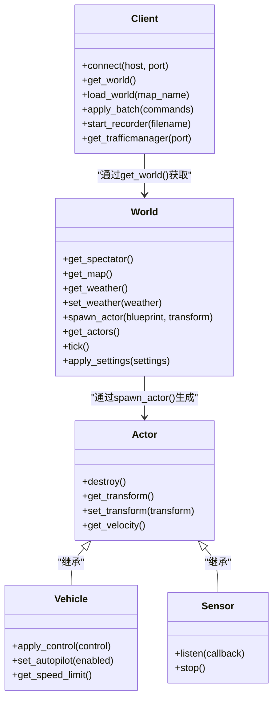
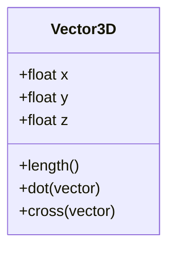
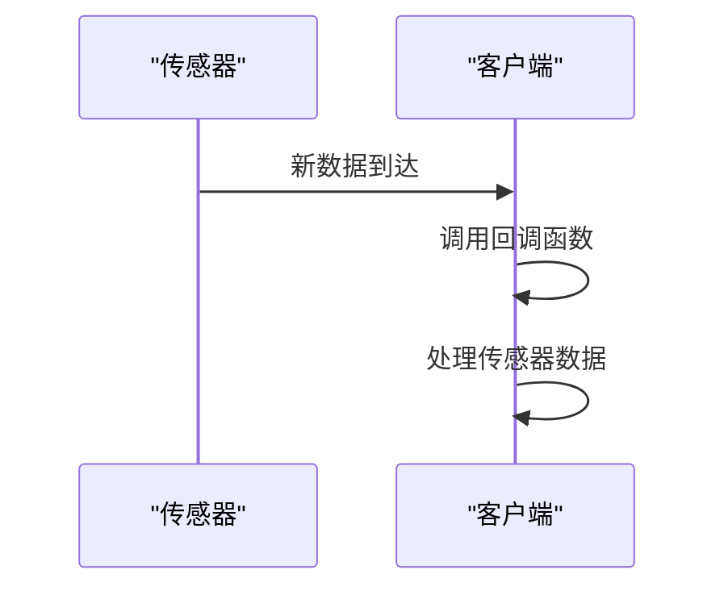

# API参考

**Referenced Files in This Document**   
- [client.yml](https://github.com/carla-simulator/carla/blob/ue5-dev/PythonAPI/docs/client.yml)
- [world.yml](https://github.com/carla-simulator/carla/blob/ue5-dev/PythonAPI/docs/world.yml)
- [actor.yml](https://github.com/carla-simulator/carla/blob/ue5-dev/PythonAPI/docs/actor.yml)
- [map.yml](https://github.com/carla-simulator/carla/blob/ue5-dev/PythonAPI/docs/map.yml)
- [sensor.yml](https://github.com/carla-simulator/carla/blob/ue5-dev/PythonAPI/docs/sensor.yml)
- [control.yml](https://github.com/carla-simulator/carla/blob/ue5-dev/PythonAPI/docs/control.yml)
- [geom.yml](https://github.com/carla-simulator/carla/blob/ue5-dev/PythonAPI/docs/geom.yml)
- [weather.yml](https://github.com/carla-simulator/carla/blob/ue5-dev/PythonAPI/docs/weather.yml)
- [snapshot.yml](https://github.com/carla-simulator/carla/blob/ue5-dev/PythonAPI/docs/snapshot.yml)
- [light_manager.yml](https://github.com/carla-simulator/carla/blob/ue5-dev/PythonAPI/docs/light_manager.yml)
- [traffic_manager.md](https://github.com/carla-simulator/carla/blob/ue5-dev/Docs/adv_traffic_manager.md)
- [ros2_native.md](https://github.com/carla-simulator/carla/blob/ue5-dev/Docs/ros2_native.md)
- [ros2_native_msgs.md](https://github.com/carla-simulator/carla/blob/ue5-dev/Docs/ros2_native_msgs.md)

## 目录
1. [简介](#简介)
2. [Python API](#python-api)
3. [C++ API](#c-api)
4. [ROS2接口](#ros2接口)
5. [核心类参考](#核心类参考)
6. [几何数据结构](#几何数据结构)
7. [传感器API](#传感器api)
8. [交通管理器](#交通管理器)
9. [ROS2集成](#ros2集成)
10. [错误处理与版本控制](#错误处理与版本控制)

## 简介
CARLA提供了一套全面的API，用于与自动驾驶仿真环境进行交互。这些API允许用户控制仿真、生成和管理车辆、行人、传感器等实体，以及获取仿真数据。API主要分为三个部分：Python API、C++ API和ROS2接口。Python API通过`carla`模块提供，是与CARLA仿真器交互的主要方式。C++ API（LibCarla）为需要更高性能的应用提供了底层访问。ROS2接口则实现了与机器人操作系统的无缝集成，支持发布/订阅模式的数据通信。

**Section sources**
- [client.yml](https://github.com/carla-simulator/carla/blob/ue5-dev/PythonAPI/docs/client.yml)
- [world.yml](https://github.com/carla-simulator/carla/blob/ue5-dev/PythonAPI/docs/world.yml)

## Python API
Python API是与CARLA仿真器交互的主要接口，通过`carla`模块提供。它基于客户端-服务器架构，客户端通过TCP连接与运行仿真的服务器通信。API的核心是`Client`类，用于建立连接和管理仿真世界。`World`类代表当前的仿真环境，包含地图、天气和所有实体。`Actor`类是所有可移动实体的基类，包括车辆、行人和传感器。用户可以通过`BlueprintLibrary`获取预定义的实体蓝图来生成新的实体。

**Diagram sources**
- [client.yml](https://github.com/carla-simulator/carla/blob/ue5-dev/PythonAPI/docs/client.yml)
- [world.yml](https://github.com/carla-simulator/carla/blob/ue5-dev/PythonAPI/docs/world.yml)
- [actor.yml](https://github.com/carla-simulator/carla/blob/ue5-dev/PythonAPI/docs/actor.yml)

## C++ API
C++ API，也称为LibCarla，是CARLA的底层库，为需要更高性能和更精细控制的应用提供了C++接口。它位于`LibCarla/source/carla`目录下，实现了与Python API相同的核心功能，但直接暴露了更多的底层细节。LibCarla使用CMake进行构建，并通过消息传递系统与Unreal Engine仿真核心通信。对于需要集成到C++项目或对性能有严格要求的应用，LibCarla是首选。

**Section sources**
- [LibCarla/source/carla](https://github.com/carla-simulator/carla/blob/ue5-dev/LibCarla/source/carla)

## ROS2接口
CARLA提供了原生的ROS2接口，允许仿真器作为ROS2网络中的一个节点运行。该接口通过`Ros2Native`模块实现，支持将传感器数据作为ROS2消息发布，并接收来自ROS2网络的车辆控制命令。这种集成使得CARLA可以无缝地与ROS2生态系统中的其他组件（如感知、规划和控制算法）协同工作。

**Section sources**
- [Ros2Native](https://github.com/carla-simulator/carla/blob/ue5-dev/Ros2Native)
- [ros2_native.md](https://github.com/carla-simulator/carla/blob/ue5-dev/Docs/ros2_native.md)

## 核心类参考
CARLA API的核心类提供了对仿真环境的全面控制。`Client`类是与服务器通信的入口点，负责建立连接、加载地图和管理仿真记录。`World`类代表当前的仿真世界，提供对地图、天气和所有实体的访问。`Actor`类是所有可移动实体的基类，包括车辆、行人和传感器。`Vehicle`类继承自`Actor`，提供了车辆特有的控制方法，如应用油门、转向和刹车。

### Client类
`Client`类是与CARLA服务器通信的客户端。它负责建立网络连接、发送命令和接收数据。通过`Client`，用户可以加载不同的地图、启动和停止仿真记录，并获取当前的仿真世界。

**Section sources**
- [client.yml](https://github.com/carla-simulator/carla/blob/ue5-dev/PythonAPI/docs/client.yml)

### World类
`World`类代表CARLA中的一个仿真世界。它包含了地图、天气、所有实体和仿真设置。用户可以通过`World`类生成新的实体、获取当前的天气状况、控制仿真时间步长，并管理仿真设置。

**Section sources**
- [world.yml](https://github.com/carla-simulator/carla/blob/ue5-dev/PythonAPI/docs/world.yml)

### Actor类
`Actor`类是CARLA中所有可移动实体的基类。它提供了实体的基本属性和方法，如位置、旋转、速度和销毁。所有在仿真中生成的实体，如车辆、行人和传感器，都是`Actor`的实例或其子类的实例。

**Section sources**
- [actor.yml](https://github.com/carla-simulator/carla/blob/ue5-dev/PythonAPI/docs/actor.yml)

## 几何数据结构
CARLA使用一系列几何数据结构来表示三维空间中的位置、方向和形状。这些结构是API的基础，用于定义实体的变换、传感器的位置和检测区域。

### Vector3D
`Vector3D`类表示三维空间中的一个向量，具有x、y和z三个分量。它用于表示位置、速度、加速度等物理量。

**Diagram sources**
- [geom.yml](https://github.com/carla-simulator/carla/blob/ue5-dev/PythonAPI/docs/geom.yml)

### Location
`Location`类继承自`Vector3D`，表示世界坐标系中的一个位置点。它的三个分量分别代表在x、y和z轴上的距离（单位：米）。

### Rotation
`Rotation`类表示三维空间中的一个旋转，使用欧拉角（pitch、yaw、roll）来定义。CARLA使用Z向上左手坐标系，旋转顺序为(pitch, yaw, roll)。

### Transform
`Transform`类结合了`Location`和`Rotation`，表示一个完整的三维变换，用于定义实体在世界中的位置和方向。

**Section sources**
- [geom.yml](https://github.com/carla-simulator/carla/blob/ue5-dev/PythonAPI/docs/geom.yml)

## 传感器API
CARLA提供了多种传感器，用于模拟自动驾驶车辆的感知系统。这些传感器可以附加到车辆或其他实体上，并通过回调函数将数据流式传输到客户端。

### 传感器类型
CARLA支持多种传感器类型，包括：
- **RGB相机**：模拟彩色摄像头，输出图像数据。
- **深度相机**：模拟深度传感器，输出每个像素的深度值。
- **语义分割相机**：输出每个像素的语义标签。
- **激光雷达**：模拟3D激光扫描仪，输出点云数据。
- **雷达**：模拟毫米波雷达，输出检测到的物体。
- **GNSS传感器**：提供全球导航卫星系统数据。
- **IMU传感器**：提供惯性测量单元数据，包括加速度和角速度。

### 传感器使用
传感器通过`listen()`方法注册一个回调函数，当传感器接收到新数据时，该函数会被调用。用户可以在回调函数中处理传感器数据，例如保存图像或进行物体检测。

**Diagram sources**
- [sensor.yml](https://github.com/carla-simulator/carla/blob/ue5-dev/PythonAPI/docs/sensor.yml)

**Section sources**
- [sensor.yml](https://github.com/carla-simulator/carla/blob/ue5-dev/PythonAPI/docs/sensor.yml)

## 交通管理器
交通管理器（Traffic Manager）是一个独立的模块，用于管理仿真中所有自动驾驶车辆的行为。它通过客户端-服务器架构运行，为车辆提供逼真的交通行为，如车道变换、跟车和遵守交通信号。

### 核心功能
交通管理器的主要功能包括：
- **自动导航**：为车辆规划路径并控制其行驶。
- **交通规则遵守**：确保车辆遵守红绿灯、停车标志等交通规则。
- **车辆交互**：管理车辆之间的交互，避免碰撞。
- **参数化行为**：允许用户调整车辆的行为参数，如期望速度、跟车距离等。

### API方法
用户可以通过`TrafficManager`类的API方法来配置和控制交通管理器的行为，例如设置全局速度差、控制车道变换行为和管理红绿灯。

**Section sources**
- [client.yml](https://github.com/carla-simulator/carla/blob/ue5-dev/PythonAPI/docs/client.yml)
- [adv_traffic_manager.md](https://github.com/carla-simulator/carla/blob/ue5-dev/Docs/adv_traffic_manager.md)

## ROS2集成
CARLA的ROS2集成允许仿真器作为ROS2网络中的一个节点运行。这使得CARLA可以与ROS2生态系统中的其他组件无缝协作。

### 发布/订阅主题
CARLA通过ROS2主题发布传感器数据，并订阅车辆控制命令。主要的主题包括：
- `/carla/ego_vehicle/rgb_front/image_color`：发布前向RGB相机的图像数据。
- `/carla/ego_vehicle/collision`：发布碰撞检测事件。
- `/carla/ego_vehicle/vehicle_status`：发布车辆状态信息。
- `/carla/ego_vehicle/vehicle_control_cmd`：订阅车辆控制命令。

### 消息类型
CARLA使用标准的ROS2消息类型来传输数据，例如`sensor_msgs/Image`用于图像数据，`std_msgs/Float32`用于标量数据，以及自定义的`carla_msgs/CarlaEgoVehicleStatus`用于车辆状态。

**Section sources**
- [ros2_native_msgs.md](https://github.com/carla-simulator/carla/blob/ue5-dev/Docs/ros2_native_msgs.md)
- [ros2_native.md](https://github.com/carla-simulator/carla/blob/ue5-dev/Docs/ros2_native.md)

## 错误处理与版本控制
CARLA API提供了完善的错误处理机制和版本控制信息，以确保客户端和服务器之间的兼容性。

### 错误处理
API方法可能抛出异常，例如`RuntimeError`或`TimeoutException`。用户应使用try-catch块来捕获和处理这些异常，以确保程序的健壮性。

### 版本控制
用户可以通过`Client.get_client_version()`和`Client.get_server_version()`方法获取客户端和服务器的版本信息。确保客户端和服务器版本兼容是避免意外问题的关键。

**Section sources**
- [client.yml](https://github.com/carla-simulator/carla/blob/ue5-dev/PythonAPI/docs/client.yml)