# C++ API


**本文档中引用的文件**  
- [Client.h](https://github.com/carla-simulator/carla/blob/ue5-dev/LibCarla/source/carla/client/Client.h)
- [World.h](https://github.com/carla-simulator/carla/blob/ue5-dev/LibCarla/source/carla/client/World.h)
- [Actor.h](https://github.com/carla-simulator/carla/blob/ue5-dev/LibCarla/source/carla/client/Actor.h)
- [Vehicle.h](https://github.com/carla-simulator/carla/blob/ue5-dev/LibCarla/source/carla/client/Vehicle.h)
- [Walker.h](https://github.com/carla-simulator/carla/blob/ue5-dev/LibCarla/source/carla/client/Walker.h)
- [TrafficLight.h](https://github.com/carla-simulator/carla/blob/ue5-dev/LibCarla/source/carla/client/TrafficLight.h)
- [Sensor.h](https://github.com/carla-simulator/carla/blob/ue5-dev/LibCarla/source/carla/client/Sensor.h)
- [ServerSideSensor.h](https://github.com/carla-simulator/carla/blob/ue5-dev/LibCarla/source/carla/client/ServerSideSensor.h)
- [ClientSideSensor.h](https://github.com/carla-simulator/carla/blob/ue5-dev/LibCarla/source/carla/client/ClientSideSensor.h)
- [main.cpp](https://github.com/carla-simulator/carla/blob/ue5-dev/Examples/CppClient/main.cpp)


## 目录
1. [简介](#简介)
2. [项目结构](#项目结构)
3. [核心组件](#核心组件)
4. [架构概述](#架构概述)
5. [详细组件分析](#详细组件分析)
6. [依赖分析](#依赖分析)
7. [性能考虑](#性能考虑)
8. [故障排除指南](#故障排除指南)
9. [结论](#结论)

## 简介
本文档提供LibCarla库的C++ API参考，重点介绍客户端连接、世界管理、参与者控制和传感器系统。文档基于头文件实现，深入解析关键类和方法，为开发者提供构建自动驾驶仿真应用的全面指导。

## 项目结构
LibCarla库的C++ API主要位于`LibCarla/source/carla/client/`目录下，包含客户端核心功能的实现。API设计采用面向对象模式，通过智能指针管理对象生命周期，支持异步操作和批量命令处理。

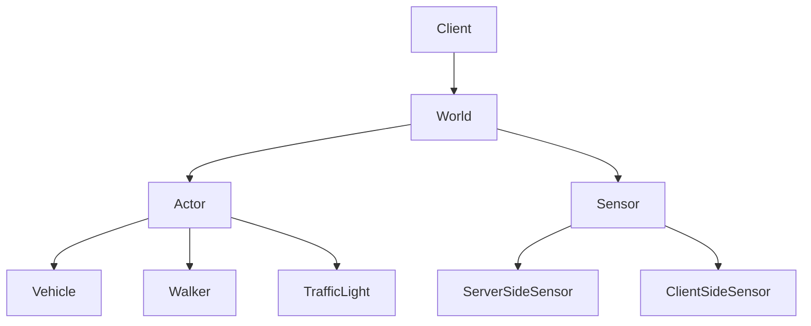

**图示来源**
- [Client.h](https://github.com/carla-simulator/carla/blob/ue5-dev/LibCarla/source/carla/client/Client.h)
- [World.h](https://github.com/carla-simulator/carla/blob/ue5-dev/LibCarla/source/carla/client/World.h)
- [Actor.h](https://github.com/carla-simulator/carla/blob/ue5-dev/LibCarla/source/carla/client/Actor.h)

**本节来源**
- [Client.h](https://github.com/carla-simulator/carla/blob/ue5-dev/LibCarla/source/carla/client/Client.h#L1-L193)
- [World.h](https://github.com/carla-simulator/carla/blob/ue5-dev/LibCarla/source/carla/client/World.h#L1-L243)

## 核心组件
LibCarla C++ API的核心组件包括Client、World、Actor及其派生类（Vehicle、Walker、TrafficLight）以及传感器系统。这些组件通过RPC通信与模拟器交互，提供完整的仿真控制能力。

**本节来源**
- [Client.h](https://github.com/carla-simulator/carla/blob/ue5-dev/LibCarla/source/carla/client/Client.h#L1-L193)
- [World.h](https://github.com/carla-simulator/carla/blob/ue5-dev/LibCarla/source/carla/client/World.h#L1-L243)
- [Actor.h](https://github.com/carla-simulator/carla/blob/ue5-dev/LibCarla/source/carla/client/Actor.h#L1-L162)

## 架构概述
LibCarla API采用分层架构设计，客户端通过TCP连接与模拟器通信，使用消息打包（MsgPack）进行数据序列化。API提供同步和异步两种操作模式，支持高性能的批量命令处理。

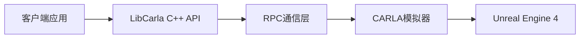

**图示来源**
- [Client.h](https://github.com/carla-simulator/carla/blob/ue5-dev/LibCarla/source/carla/client/Client.h#L1-L193)
- [rpc/Client.h](https://github.com/carla-simulator/carla/blob/ue5-dev/LibCarla/source/carla/rpc/Client.h)

## 详细组件分析

### Client类分析
Client类是连接CARLA模拟器的入口点，负责建立网络连接和管理会话。

#### 构造函数和连接参数
Client类的构造函数接受主机地址、端口和工作线程数作为参数，建立与模拟器的连接。

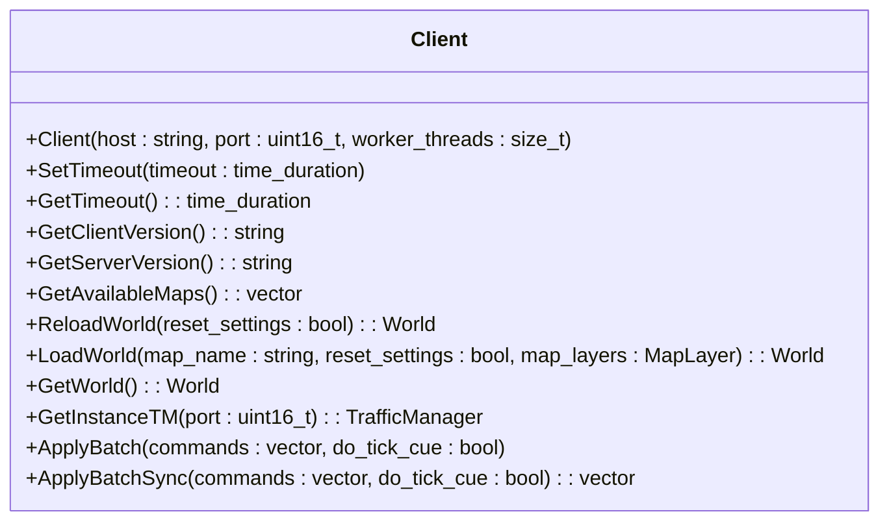

**图示来源**
- [Client.h](https://github.com/carla-simulator/carla/blob/ue5-dev/LibCarla/source/carla/client/Client.h#L20-L193)

#### 异步操作模式
Client类支持异步操作模式，通过工作线程池处理网络请求，提高性能。

**本节来源**
- [Client.h](https://github.com/carla-simulator/carla/blob/ue5-dev/LibCarla/source/carla/client/Client.h#L20-L193)

### World类分析
World类代表模拟世界，提供场景查询和状态管理功能。

#### 场景查询方法
World类提供多种方法查询世界状态和获取对象。

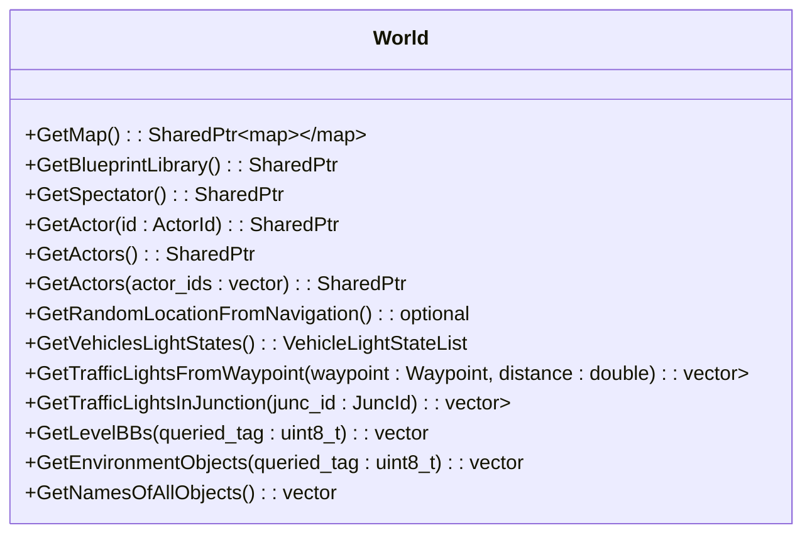

**图示来源**
- [World.h](https://github.com/carla-simulator/carla/blob/ue5-dev/LibCarla/source/carla/client/World.h#L45-L243)

#### 状态管理功能
World类提供世界状态管理和控制功能。

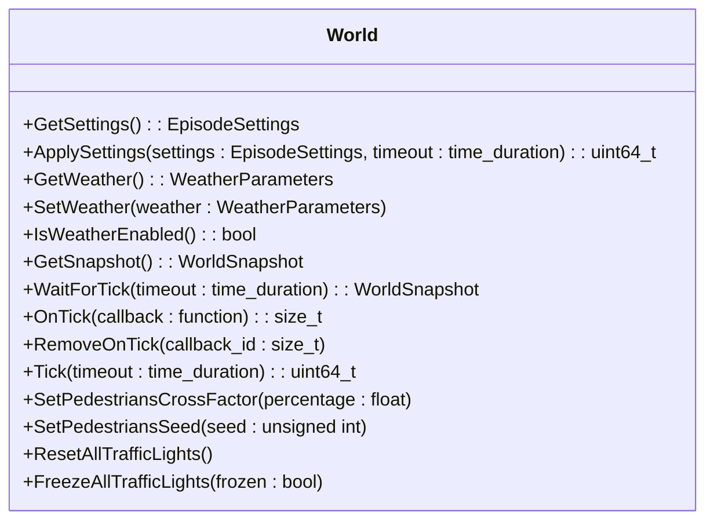

**图示来源**
- [World.h](https://github.com/carla-simulator/carla/blob/ue5-dev/LibCarla/source/carla/client/World.h#L45-L243)

**本节来源**
- [World.h](https://github.com/carla-simulator/carla/blob/ue5-dev/LibCarla/source/carla/client/World.h#L45-L243)

### Actor基类分析
Actor类是所有可模拟对象的基类，提供通用接口。

#### 通用接口
Actor类提供位置、速度和物理控制等通用方法。

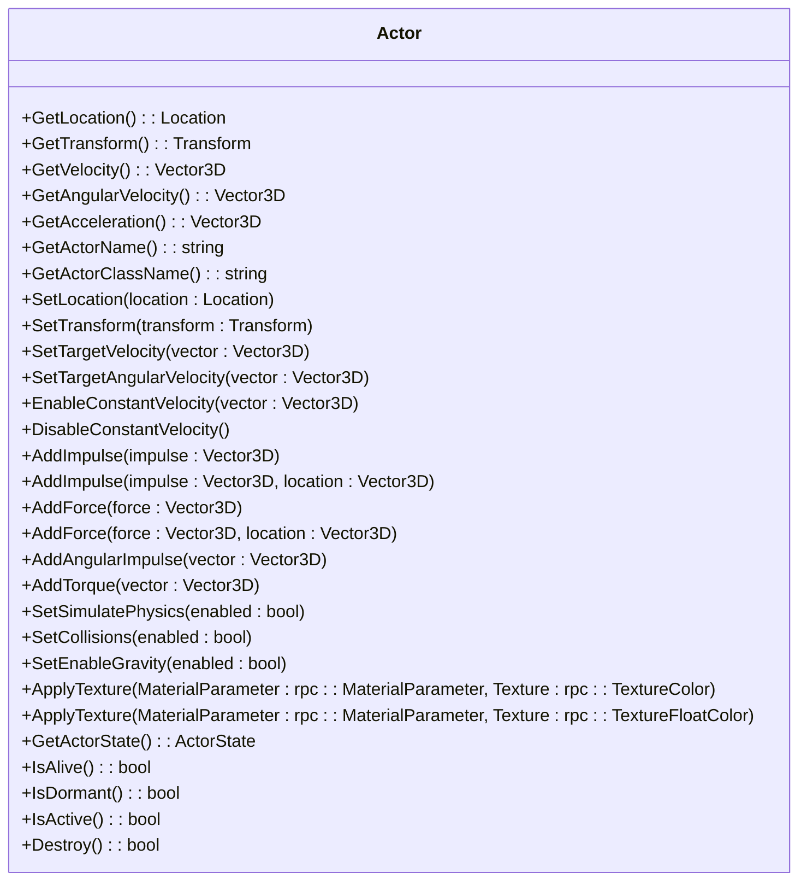

**图示来源**
- [Actor.h](https://github.com/carla-simulator/carla/blob/ue5-dev/LibCarla/source/carla/client/Actor.h#L18-L162)

**本节来源**
- [Actor.h](https://github.com/carla-simulator/carla/blob/ue5-dev/LibCarla/source/carla/client/Actor.h#L18-L162)

### 派生类特定控制方法

#### Vehicle类
Vehicle类提供车辆特定的控制方法。

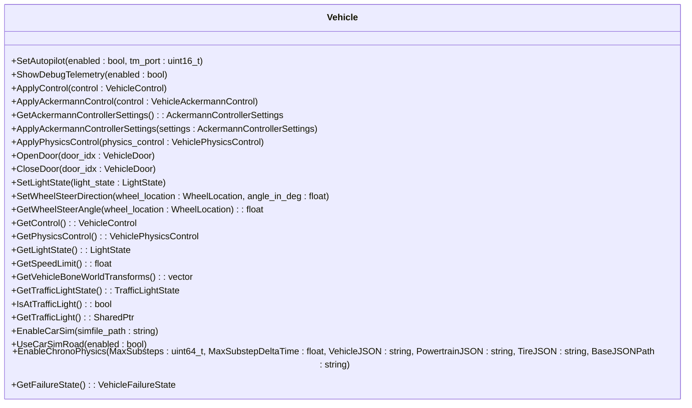

**图示来源**
- [Vehicle.h](https://github.com/carla-simulator/carla/blob/ue5-dev/LibCarla/source/carla/client/Vehicle.h#L32-L154)

#### Walker类
Walker类提供行人特定的控制方法。

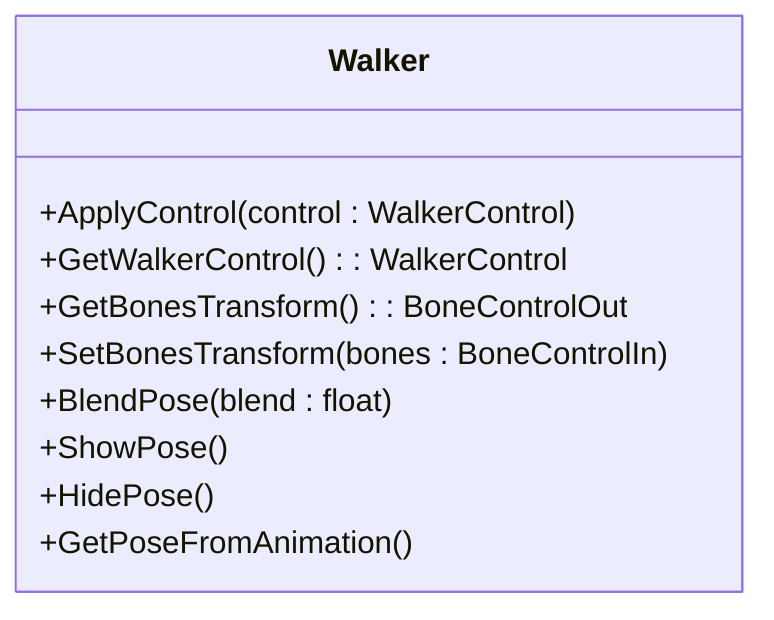

**图示来源**
- [Walker.h](https://github.com/carla-simulator/carla/blob/ue5-dev/LibCarla/source/carla/client/Walker.h#L17-L49)

#### TrafficLight类
TrafficLight类提供交通信号灯控制方法。

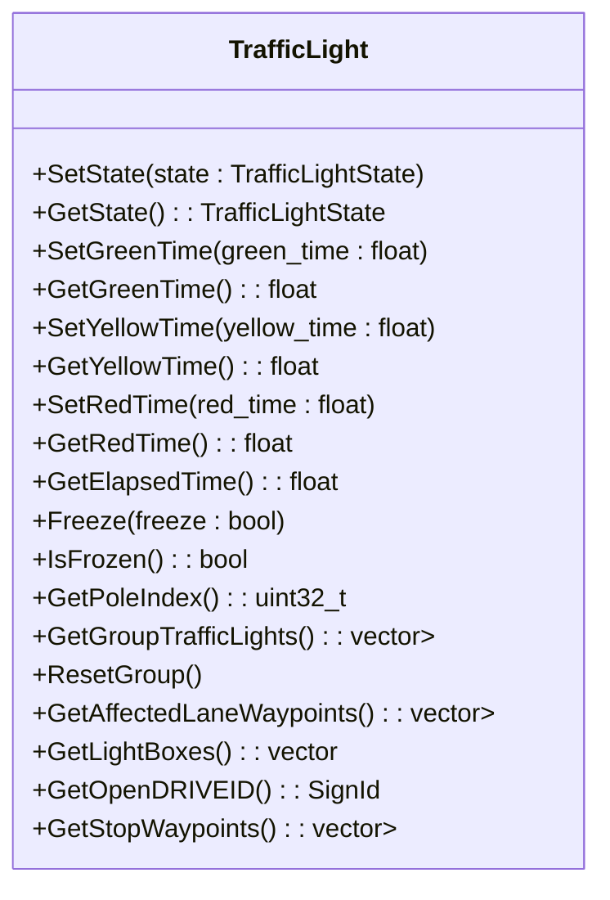

**图示来源**
- [TrafficLight.h](https://github.com/carla-simulator/carla/blob/ue5-dev/LibCarla/source/carla/client/TrafficLight.h#L18-L83)

**本节来源**
- [Vehicle.h](https://github.com/carla-simulator/carla/blob/ue5-dev/LibCarla/source/carla/client/Vehicle.h#L32-L154)
- [Walker.h](https://github.com/carla-simulator/carla/blob/ue5-dev/LibCarla/source/carla/client/Walker.h#L17-L49)
- [TrafficLight.h](https://github.com/carla-simulator/carla/blob/ue5-dev/LibCarla/source/carla/client/TrafficLight.h#L18-L83)

### 传感器系统分析
传感器系统采用服务器端和客户端两种设计模式。

#### 设计模式
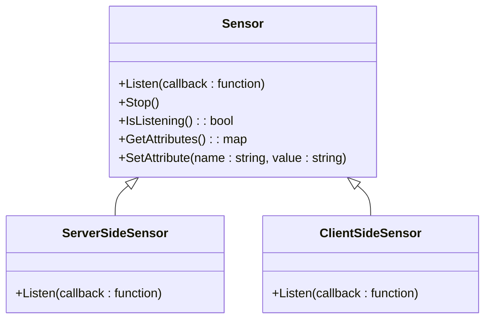

**图示来源**
- [Sensor.h](https://github.com/carla-simulator/carla/blob/ue5-dev/LibCarla/source/carla/client/Sensor.h)
- [ServerSideSensor.h](https://github.com/carla-simulator/carla/blob/ue5-dev/LibCarla/source/carla/client/ServerSideSensor.h)
- [ClientSideSensor.h](https://github.com/carla-simulator/carla/blob/ue5-dev/LibCarla/source/carla/client/ClientSideSensor.h)

#### 使用场景
- **服务器端传感器**：数据在服务器端生成和处理，适合高性能应用
- **客户端传感器**：数据在客户端生成和处理，适合自定义传感器逻辑

**本节来源**
- [Sensor.h](https://github.com/carla-simulator/carla/blob/ue5-dev/LibCarla/source/carla/client/Sensor.h)
- [ServerSideSensor.h](https://github.com/carla-simulator/carla/blob/ue5-dev/LibCarla/source/carla/client/ServerSideSensor.h)
- [ClientSideSensor.h](https://github.com/carla-simulator/carla/blob/ue5-dev/LibCarla/source/carla/client/ClientSideSensor.h)

### C++客户端实现示例
基于Examples/CppClient/main.cpp提供实际实现示例。

#### 初始化连接
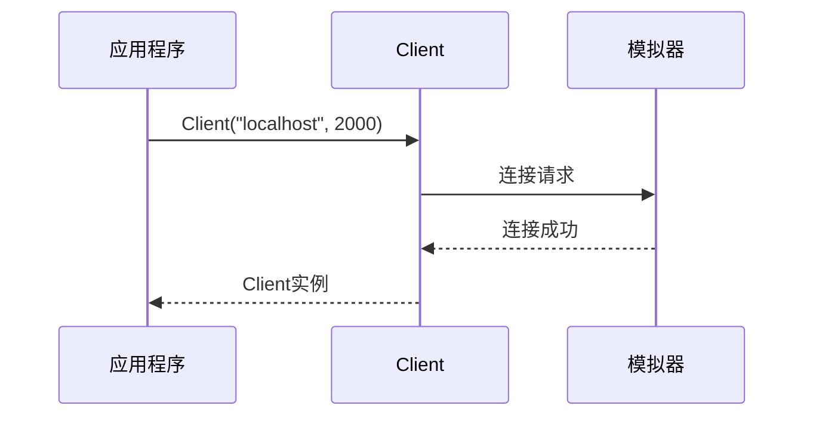

**图示来源**
- [main.cpp](https://github.com/carla-simulator/carla/blob/ue5-dev/Examples/CppClient/main.cpp)

#### 获取世界实例
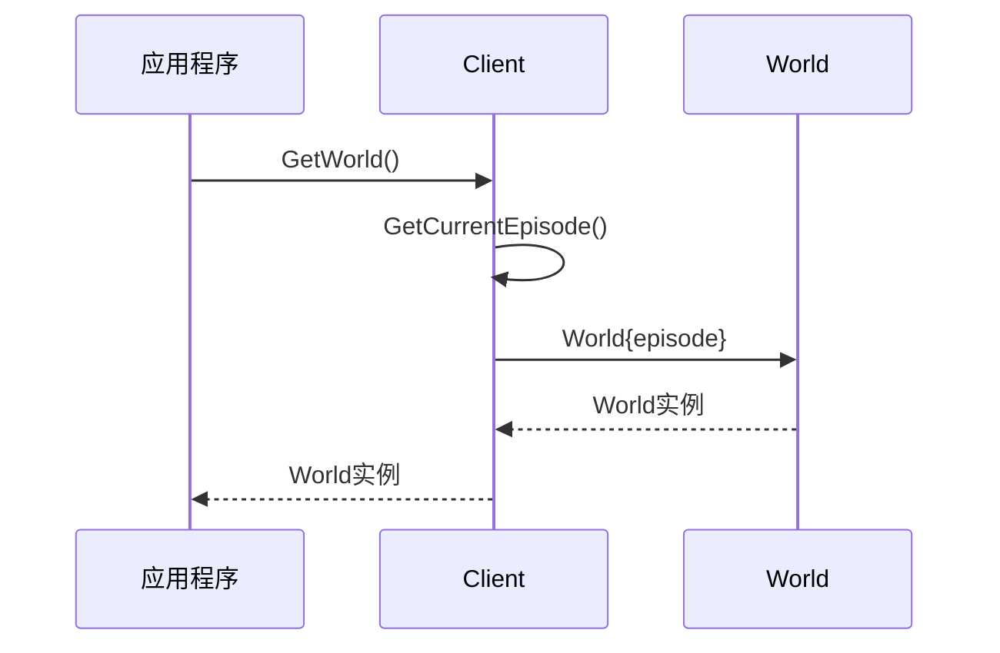

**图示来源**
- [main.cpp](https://github.com/carla-simulator/carla/blob/ue5-dev/Examples/CppClient/main.cpp)

#### 管理仿真对象
```mermaid
sequenceDiagram
participant App as 应用程序
participant World as World
participant Actor as Actor
App->>World : SpawnActor(blueprint, transform)
World->>World : 创建Actor实例
World->>Actor : Actor{init}
Actor-->>World : Actor实例
World-->>App : Actor智能指针
```

**图示来源**
- [main.cpp](https://github.com/carla-simulator/carla/blob/ue5-dev/Examples/CppClient/main.cpp)

**本节来源**
- [main.cpp](https://github.com/carla-simulator/carla/blob/ue5-dev/Examples/CppClient/main.cpp)

### 智能指针使用模式
API广泛使用智能指针进行内存管理。

#### SharedPtr使用
- 所有Actor及其派生类使用`SharedPtr`管理生命周期
- 避免内存泄漏和悬空指针
- 支持共享所有权

#### 内存管理策略
- 对象在模拟器中创建，由客户端通过智能指针引用
- 当所有引用释放时，对象自动清理
- 支持跨线程安全访问

**本节来源**
- [Actor.h](https://github.com/carla-simulator/carla/blob/ue5-dev/LibCarla/source/carla/client/Actor.h#L18-L162)
- [Memory.h](https://github.com/carla-simulator/carla/blob/ue5-dev/LibCarla/source/carla/Memory.h)

## 依赖分析
LibCarla API依赖于多个内部组件和第三方库。

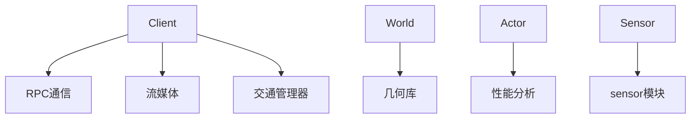

**图示来源**
- [Client.h](https://github.com/carla-simulator/carla/blob/ue5-dev/LibCarla/source/carla/client/Client.h)
- [World.h](https://github.com/carla-simulator/carla/blob/ue5-dev/LibCarla/source/carla/client/World.h)
- [Actor.h](https://github.com/carla-simulator/carla/blob/ue5-dev/LibCarla/source/carla/client/Actor.h)

**本节来源**
- [Client.h](https://github.com/carla-simulator/carla/blob/ue5-dev/LibCarla/source/carla/client/Client.h#L9-L18)
- [World.h](https://github.com/carla-simulator/carla/blob/ue5-dev/LibCarla/source/carla/client/World.h#L9-L31)
- [Actor.h](https://github.com/carla-simulator/carla/blob/ue5-dev/LibCarla/source/carla/client/Actor.h#L9-L13)

## 性能考虑
为性能关键型应用提供最佳实践。

### 批量操作
- 使用`ApplyBatch`和`ApplyBatchSync`进行批量命令处理
- 减少网络往返次数
- 提高仿真步进效率

### 高效数据访问
- 使用`GetSnapshot`获取世界状态快照
- 避免频繁的单个查询调用
- 利用缓存数据减少模拟器通信

### 最佳实践
- 在同步模式下使用`Tick`控制仿真步进
- 合理设置客户端超时
- 使用适当的线程池大小

**本节来源**
- [Client.h](https://github.com/carla-simulator/carla/blob/ue5-dev/LibCarla/source/carla/client/Client.h#L162-L176)
- [World.h](https://github.com/carla-simulator/carla/blob/ue5-dev/LibCarla/source/carla/client/World.h#L128-L143)

## 故障排除指南
常见问题和解决方案。

### 连接问题
- 检查模拟器是否运行
- 验证主机和端口配置
- 检查防火墙设置

### 性能问题
- 监控网络延迟
- 调整批量操作大小
- 优化传感器数据处理

**本节来源**
- [Client.h](https://github.com/carla-simulator/carla/blob/ue5-dev/LibCarla/source/carla/client/Client.h#L36-L42)
- [TimeoutException.h](https://github.com/carla-simulator/carla/blob/ue5-dev/LibCarla/source/carla/client/TimeoutException.h)

## 结论
LibCarla C++ API提供了功能完整的接口用于控制CARLA模拟器。通过理解Client、World、Actor等核心组件的设计和使用模式，开发者可以构建高效的自动驾驶仿真应用。智能指针的使用确保了内存安全，而批量操作支持则满足了性能关键型应用的需求。