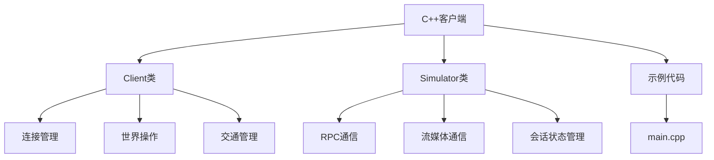
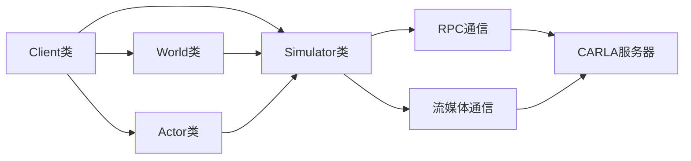
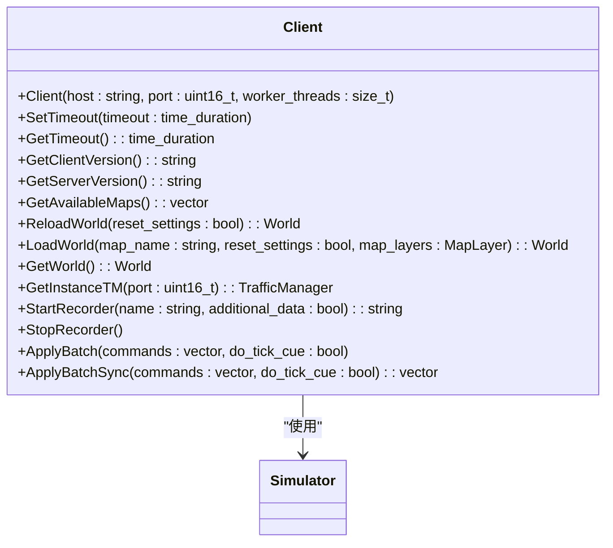
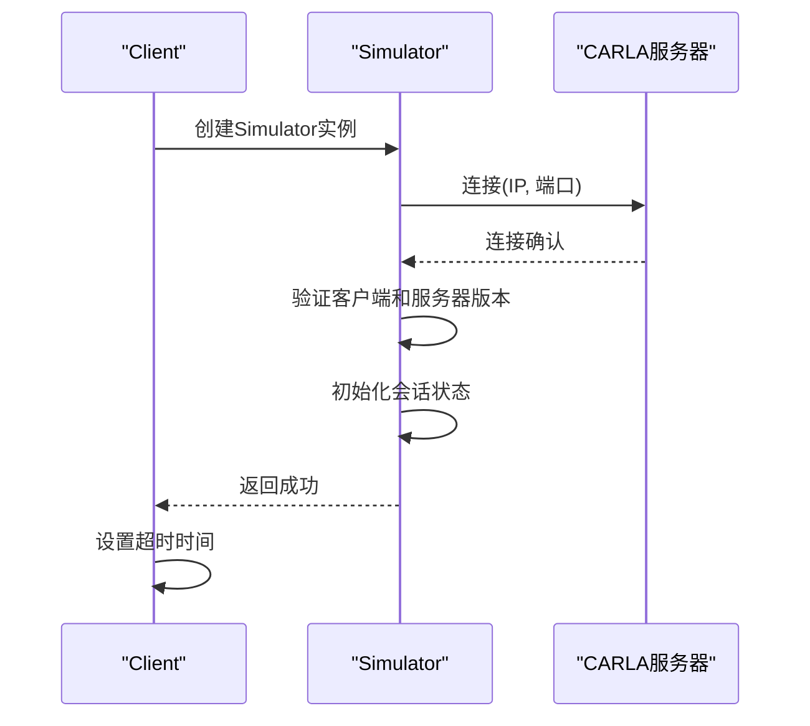
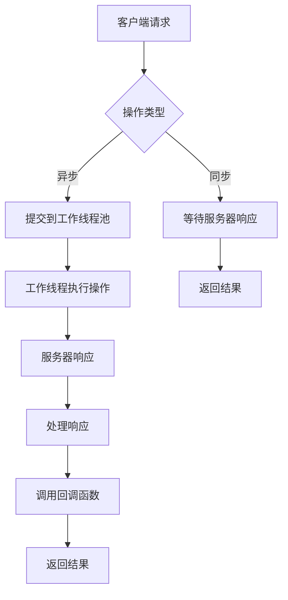
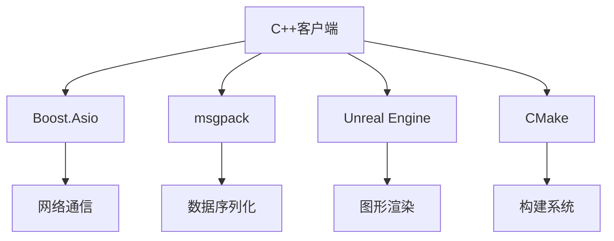
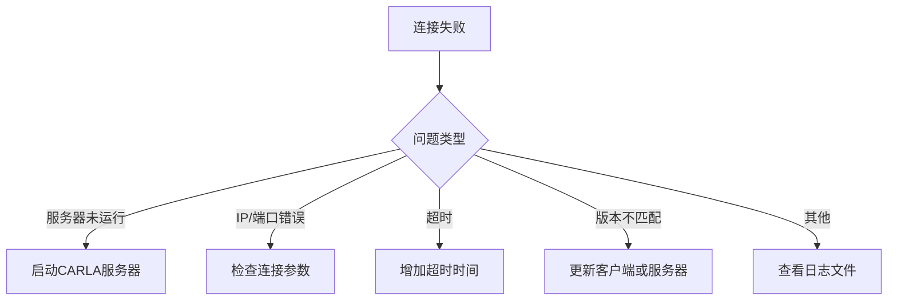

# C++ 客户端

> **引用文件**
> **本文档中引用的文件**

- [Client.h](https://github.com/carla-simulator/carla/blob/ue5-dev/LibCarla/source/carla/client/Client.h)
- [Simulator.h](https://github.com/carla-simulator/carla/blob/ue5-dev/LibCarla/source/carla/client/detail/Simulator.h)
- [Simulator.cpp](https://github.com/carla-simulator/carla/blob/ue5-dev/LibCarla/source/carla/client/detail/Simulator.cpp)
- [Client.cpp](https://github.com/carla-simulator/carla/blob/ue5-dev/LibCarla/source/carla/client/detail/Client.cpp)
- [main.cpp](https://github.com/carla-simulator/carla/blob/ue5-dev/Examples/CppClient/main.cpp)
- [TimeoutException.h](https://github.com/carla-simulator/carla/blob/ue5-dev/LibCarla/source/carla/client/TimeoutException.h)
- [TimeoutException.cpp](https://github.com/carla-simulator/carla/blob/ue5-dev/LibCarla/source/carla/client/TimeoutException.cpp)

## 目录

1. [简介](#简介)
2. [项目结构](#项目结构)
3. [核心组件](#核心组件)
4. [架构概述](#架构概述)
5. [详细组件分析](#详细组件分析)
6. [依赖分析](#依赖分析)
7. [性能考虑](#性能考虑)
8. [故障排除指南](#故障排除指南)
9. [结论](#结论)

## 简介

本文档详细介绍了 CARLA 模拟器的 C++客户端实现，重点分析了 Client 类和 Simulator 类的功能。文档涵盖了如何通过 IP 地址和端口连接到 CARLA 服务器，解释了构造函数参数和连接超时设置，以及客户端的异步操作模式。同时，深入解析了 Simulator 类在客户端-服务器通信中的作用，以及如何管理与仿真器的会话状态。基于示例代码提供了完整的连接、断开连接和错误处理代码示例，并解释了客户端的线程安全特性及在多线程环境下的使用注意事项。

## 项目结构

CARLA C++客户端的项目结构组织清晰，主要分为以下几个部分：

- **CMake/**: 包含 CMake 构建系统的配置文件
- **Docs/**: 包含项目文档
- **Examples/CppClient/**: 包含 C++客户端示例代码
- **LibCarla/**: 包含核心客户端库源代码
- **PythonAPI/**: 包含 Python API 实现
- **Unreal/**: 包含 Unreal 引擎相关代码

C++客户端的核心功能主要位于 LibCarla/source/carla/client/目录下，其中 Client 类是主要的接口类，而 Simulator 类负责底层的通信和状态管理。

**图表来源**

- [Client.h](https://github.com/carla-simulator/carla/blob/ue5-dev/LibCarla/source/carla/client/Client.h)
- [Simulator.h](https://github.com/carla-simulator/carla/blob/ue5-dev/LibCarla/source/carla/client/detail/Simulator.h)
- [main.cpp](https://github.com/carla-simulator/carla/blob/ue5-dev/Examples/CppClient/main.cpp)

**本节来源**

- [Client.h](https://github.com/carla-simulator/carla/blob/ue5-dev/LibCarla/source/carla/client/Client.h)
- [Simulator.h](https://github.com/carla-simulator/carla/blob/ue5-dev/LibCarla/source/carla/client/detail/Simulator.h)

## 核心组件

C++客户端的核心组件包括 Client 类、Simulator 类和相关的辅助类。Client 类作为主要的接口类，提供了连接 CARLA 服务器、加载世界、管理演员等高级功能。Simulator 类则负责底层的通信细节，包括 RPC 调用和流媒体数据传输。TimeoutException 类用于处理网络超时异常，确保客户端能够优雅地处理连接问题。

**本节来源**

- [Client.h](https://github.com/carla-simulator/carla/blob/ue5-dev/LibCarla/source/carla/client/Client.h)
- [Simulator.h](https://github.com/carla-simulator/carla/blob/ue5-dev/LibCarla/source/carla/client/detail/Simulator.h)
- [TimeoutException.h](https://github.com/carla-simulator/carla/blob/ue5-dev/LibCarla/source/carla/client/TimeoutException.h)

## 架构概述

CARLA C++客户端采用分层架构设计，上层的 Client 类提供简洁的 API 接口，下层的 Simulator 类处理复杂的通信逻辑。这种设计模式使得客户端既易于使用又具有良好的扩展性。客户端通过 RPC 协议与 CARLA 服务器通信，同时使用流媒体协议传输传感器数据等大量信息。

**图表来源**

- [Client.h](https://github.com/carla-simulator/carla/blob/ue5-dev/LibCarla/source/carla/client/Client.h)
- [Simulator.h](https://github.com/carla-simulator/carla/blob/ue5-dev/LibCarla/source/carla/client/detail/Simulator.h)

## 详细组件分析

### Client 类分析

Client 类是 C++客户端的主要接口，负责管理与 CARLA 服务器的连接和会话。它通过构造函数接收服务器的 IP 地址和端口号，并创建 Simulator 实例来处理底层通信。

**图表来源**

- [Client.h](https://github.com/carla-simulator/carla/blob/ue5-dev/LibCarla/source/carla/client/Client.h)
- [Simulator.h](https://github.com/carla-simulator/carla/blob/ue5-dev/LibCarla/source/carla/client/detail/Simulator.h)

### Simulator 类分析

Simulator 类是客户端的核心，负责管理与 CARLA 服务器的通信。它处理 RPC 调用、流媒体数据传输和会话状态管理。

```mermaid
classDiagram
class Simulator {
+Simulator(host : string, port : uint16_t, worker_threads : size_t, enable_garbage_collection : bool)
+LoadEpisode(map_name : string, reset_settings : bool, map_layers : MapLayer) : EpisodeProxy
+LoadOpenDriveEpisode(opendrive : string, params : OpendriveGenerationParameters, reset_settings : bool) : EpisodeProxy
+GetCurrentEpisode() : EpisodeProxy
+GetWorld() : World
+GetWorldSnapshot() : WorldSnapshot
+GetCurrentMap() : SharedPtr<Map>
+GetAvailableMaps() : vector<string>
+SetNetworkingTimeout(timeout : time_duration)
+GetNetworkingTimeout() : time_duration
+GetClientVersion() : string
+GetServerVersion() : string
+WaitForTick(timeout : time_duration) : WorldSnapshot
+RegisterOnTickEvent(callback : function) : size_t
+RemoveOnTickEvent(id : size_t)
+Tick(timeout : time_duration) : uint64_t
+GetBlueprintLibrary() : SharedPtr<BlueprintLibrary>
+GetSpectator() : SharedPtr<Actor>
+GetEpisodeSettings() : EpisodeSettings
+SetEpisodeSettings(settings : EpisodeSettings) : uint64_t
+GetWeatherParameters() : WeatherParameters
+SetWeatherParameters(weather : WeatherParameters)
+SpawnActor(blueprint : ActorBlueprint, transform : Transform, parent : Actor, attachment_type : AttachmentType, gc : GarbageCollectionPolicy) : SharedPtr<Actor>
+DestroyActor(actor : Actor) : bool
+GetActorSnapshot(actor_id : ActorId) : ActorSnapshot
+GetActorSnapshot(actor : Actor) : ActorSnapshot
+GetActorState(actor : Actor) : ActorState
+GetActorLocation(actor : Actor) : Location
+GetActorTransform(actor : Actor) : Transform
+GetActorVelocity(actor : Actor) : Vector3D
+SetActorTargetVelocity(actor : Actor, vector : Vector3D)
+GetActorAngularVelocity(actor : Actor) : Vector3D
+SetActorTargetAngularVelocity(actor : Actor, vector : Vector3D)
+EnableActorConstantVelocity(actor : Actor, vector : Vector3D)
+DisableActorConstantVelocity(actor : Actor)
+AddActorImpulse(actor : Actor, impulse : Vector3D)
+AddActorImpulse(actor : Actor, impulse : Vector3D, location : Vector3D)
+AddActorForce(actor : Actor, force : Vector3D)
+AddActorForce(actor : Actor, force : Vector3D, location : Vector3D)
+AddActorAngularImpulse(actor : Actor, vector : Vector3D)
+AddActorTorque(actor : Actor, torque : Vector3D)
+GetActorAcceleration(actor : Actor) : Vector3D
+GetActorName(actor : Actor) : string
+GetActorClassName(actor : Actor) : string
+SetActorLocation(actor : Actor, location : Location)
+SetActorTransform(actor : Actor, transform : Transform)
+SetActorSimulatePhysics(actor : Actor, enabled : bool)
+SetActorCollisions(actor : Actor, enabled : bool)
+SetActorDead(actor : Actor)
+SetActorEnableGravity(actor : Actor, enabled : bool)
+ApplyTextureToActor(actor : Actor, MaterialParameter : MaterialParameter, Texture : TextureColor)
+ApplyTextureToActor(actor : Actor, MaterialParameter : MaterialParameter, Texture : TextureFloatColor)
+SetVehicleAutopilot(vehicle : Vehicle, enabled : bool)
+ShowVehicleDebugTelemetry(vehicle : Vehicle, enabled : bool)
+SetLightsToVehicle(vehicle : Vehicle, control : VehicleControl)
+ApplyControlToVehicle(vehicle : Vehicle, control : VehicleControl)
+ApplyAckermannControlToVehicle(vehicle : Vehicle, control : VehicleAckermannControl)
+GetAckermannControllerSettings(vehicle : Vehicle) : AckermannControllerSettings
+ApplyAckermannControllerSettings(vehicle : Vehicle, settings : AckermannControllerSettings)
+ApplyControlToWalker(walker : Walker, control : WalkerControl)
+GetBonesTransform(walker : Walker) : WalkerBoneControlOut
+SetBonesTransform(walker : Walker, bones : WalkerBoneControlIn)
+BlendPose(walker : Walker, blend : float)
+GetPoseFromAnimation(walker : Walker)
+ApplyPhysicsControlToVehicle(vehicle : Vehicle, physicsControl : VehiclePhysicsControl)
+SetLightStateToVehicle(vehicle : Vehicle, light_state : VehicleLightState)
+OpenVehicleDoor(vehicle : Vehicle, door_idx : VehicleDoor)
+CloseVehicleDoor(vehicle : Vehicle, door_idx : VehicleDoor)
+SetWheelSteerDirection(vehicle : Vehicle, wheel_location : VehicleWheelLocation, angle_in_deg : float)
+GetWheelSteerAngle(vehicle : Vehicle, wheel_location : VehicleWheelLocation) : float
+EnableCarSim(vehicle : Vehicle, simfile_path : string)
+UseCarSimRoad(vehicle : Vehicle, enabled : bool)
+EnableChronoPhysics(vehicle : Vehicle, MaxSubsteps : uint64_t, MaxSubstepDeltaTime : float, VehicleJSON : string, PowertrainJSON : string, TireJSON : string, BaseJSONPath : string)
+StartRecorder(name : string, additional_data : bool) : string
+StopRecorder()
+ShowRecorderFileInfo(name : string, show_all : bool) : string
+ShowRecorderCollisions(name : string, type1 : char, type2 : char) : string
+ShowRecorderActorsBlocked(name : string, min_time : double, min_distance : double) : string
+ReplayFile(name : string, start : double, duration : double, follow_id : uint32_t, replay_sensors : bool) : string
+SetReplayerTimeFactor(time_factor : double)
+SetReplayerIgnoreHero(ignore_hero : bool)
+SetReplayerIgnoreSpectator(ignore_spectator : bool)
+StopReplayer(keep_actors : bool)
+ApplyBatch(commands : vector<Command>, do_tick_cue : bool)
+ApplyBatchSync(commands : vector<Command>, do_tick_cue : bool) : vector<CommandResponse>
+SubscribeToSensor(sensor : Sensor, callback : function)
+UnSubscribeFromSensor(sensor : Actor)
+EnableForROS(sensor : Sensor)
+DisableForROS(sensor : Sensor)
+IsEnabledForROS(sensor : Sensor) : bool
+SubscribeToGBuffer(sensor : Actor, gbuffer_id : uint32_t, callback : function)
+UnSubscribeFromGBuffer(sensor : Actor, gbuffer_id : uint32_t)
+SetTrafficLightState(trafficLight : TrafficLight, trafficLightState : TrafficLightState)
+SetTrafficLightGreenTime(trafficLight : TrafficLight, greenTime : float)
+SetTrafficLightYellowTime(trafficLight : TrafficLight, yellowTime : float)
+SetTrafficLightRedTime(trafficLight : TrafficLight, redTime : float)
+FreezeTrafficLight(trafficLight : TrafficLight, freeze : bool)
+ResetTrafficLightGroup(trafficLight : TrafficLight)
+ResetAllTrafficLights()
+GetLightBoxes(trafficLight : TrafficLight) : vector<BoundingBox>
+GetGroupTrafficLights(trafficLight : TrafficLight) : vector<ActorId>
+DrawDebugShape(shape : DebugShape)
+GetLightManager() : SharedPtr<LightManager>
+QueryLightsStateToServer() : vector<LightState>
+UpdateServerLightsState(lights : vector<LightState>, discard_client : bool)
+UpdateDayNightCycle(active : bool)
+RegisterLightUpdateChangeEvent(callback : function) : size_t
+RemoveLightUpdateChangeEvent(id : size_t)
+FreezeAllTrafficLights(frozen : bool)
+ApplyColorTextureToObjects(objects_name : vector<string>, parameter : MaterialParameter, Texture : TextureColor)
+ApplyColorTextureToObjects(objects_name : vector<string>, parameter : MaterialParameter, Texture : TextureFloatColor)
}
Simulator --> Client : "实现"
Simulator --> Episode : "管理"
Simulator --> Map : "管理"
Simulator --> BlueprintLibrary : "管理"
Simulator --> LightManager : "管理"
Simulator --> EpisodeProxy : "返回"
Simulator --> World : "返回"
Simulator --> WorldSnapshot : "返回"
```

**图表来源**

- [Simulator.h](https://github.com/carla-simulator/carla/blob/ue5-dev/LibCarla/source/carla/client/detail/Simulator.h)
- [Simulator.cpp](https://github.com/carla-simulator/carla/blob/ue5-dev/LibCarla/source/carla/client/detail/Simulator.cpp)

### 连接和会话管理

Client 类的构造函数负责建立与 CARLA 服务器的连接。它接收服务器的 IP 地址、端口号和工作线程数作为参数，并创建 Simulator 实例来管理会话。

**图表来源**

- [Client.h](https://github.com/carla-simulator/carla/blob/ue5-dev/LibCarla/source/carla/client/Client.h)
- [Simulator.h](https://github.com/carla-simulator/carla/blob/ue5-dev/LibCarla/source/carla/client/detail/Simulator.h)
- [Simulator.cpp](https://github.com/carla-simulator/carla/blob/ue5-dev/LibCarla/source/carla/client/detail/Simulator.cpp)

### 异步操作模式

C++客户端支持异步操作模式，允许在不阻塞主线程的情况下执行各种操作。这通过工作线程池和回调机制实现。

**图表来源**

- [Client.h](https://github.com/carla-simulator/carla/blob/ue5-dev/LibCarla/source/carla/client/Client.h)
- [Simulator.h](https://github.com/carla-simulator/carla/blob/ue5-dev/LibCarla/source/carla/client/detail/Simulator.h)

**本节来源**

- [Client.h](https://github.com/carla-simulator/carla/blob/ue5-dev/LibCarla/source/carla/client/Client.h)
- [Simulator.h](https://github.com/carla-simulator/carla/blob/ue5-dev/LibCarla/source/carla/client/detail/Simulator.h)
- [Simulator.cpp](https://github.com/carla-simulator/carla/blob/ue5-dev/LibCarla/source/carla/client/detail/Simulator.cpp)

## 依赖分析

C++客户端依赖于多个外部库和内部模块，包括 Boost.Asio 用于网络通信，msgpack 用于数据序列化，以及 Unreal Engine 用于图形渲染。这些依赖关系通过 CMake 构建系统进行管理。

**图表来源**

- [CMake/Dependencies.cmake](https://github.com/carla-simulator/carla/blob/ue5-dev/CMake/Dependencies.cmake)
- [CMakeLists.txt](https://github.com/carla-simulator/carla/blob/ue5-dev/CMakeLists.txt)

**本节来源**

- [CMake/Dependencies.cmake](https://github.com/carla-simulator/carla/blob/ue5-dev/CMake/Dependencies.cmake)
- [CMakeLists.txt](https://github.com/carla-simulator/carla/blob/ue5-dev/CMakeLists.txt)

## 性能考虑

C++客户端在设计时考虑了性能优化，包括使用工作线程池处理异步操作，减少主线程阻塞；使用高效的数据序列化格式(msgpack)减少网络传输开销；以及通过连接池管理长连接，减少连接建立的开销。

**本节来源**

- [Client.h](https://github.com/carla-simulator/carla/blob/ue5-dev/LibCarla/source/carla/client/Client.h)
- [Simulator.h](https://github.com/carla-simulator/carla/blob/ue5-dev/LibCarla/source/carla/client/detail/Simulator.h)

## 故障排除指南

当遇到连接问题时，首先检查 CARLA 服务器是否正在运行，并确认 IP 地址和端口号是否正确。如果出现超时异常，可以尝试增加超时时间。对于版本不匹配的问题，确保客户端和服务器使用相同的 API 版本。

**图表来源**

- [TimeoutException.h](https://github.com/carla-simulator/carla/blob/ue5-dev/LibCarla/source/carla/client/TimeoutException.h)
- [TimeoutException.cpp](https://github.com/carla-simulator/carla/blob/ue5-dev/LibCarla/source/carla/client/TimeoutException.cpp)

**本节来源**

- [TimeoutException.h](https://github.com/carla-simulator/carla/blob/ue5-dev/LibCarla/source/carla/client/TimeoutException.h)
- [TimeoutException.cpp](https://github.com/carla-simulator/carla/blob/ue5-dev/LibCarla/source/carla/client/TimeoutException.cpp)

## 结论

CARLA C++客户端提供了一个功能强大且易于使用的接口，用于与 CARLA 模拟器进行交互。通过 Client 类和 Simulator 类的分层设计，客户端既提供了高级的 API 接口，又保持了良好的性能和可扩展性。开发者可以利用这些功能快速构建自动驾驶和机器人应用。
