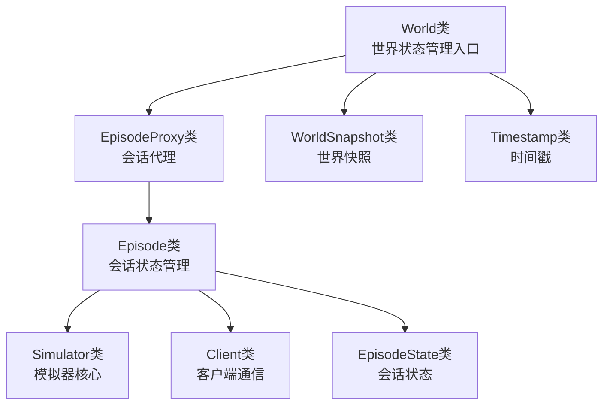
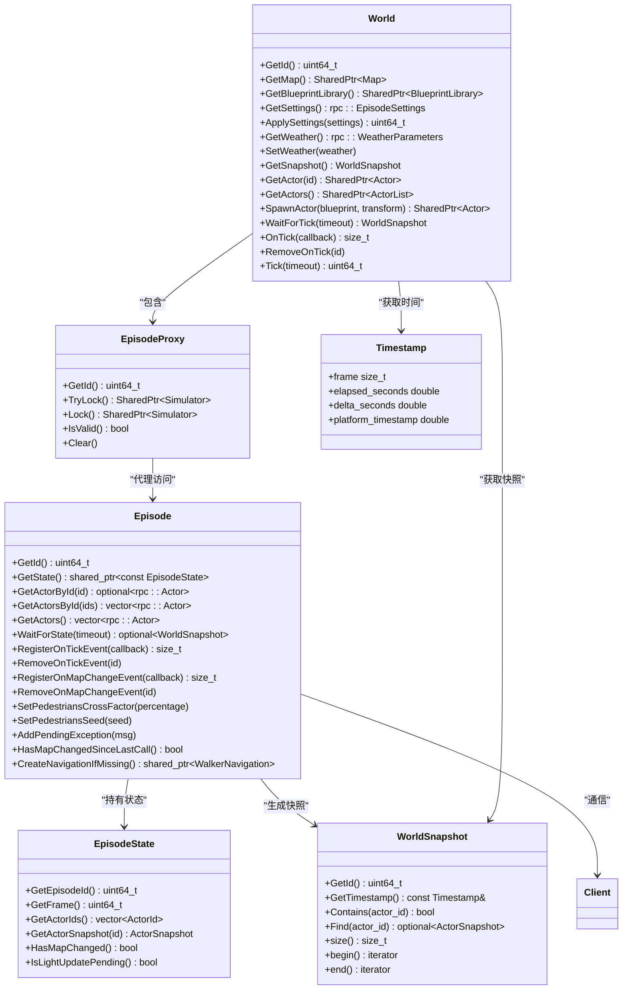
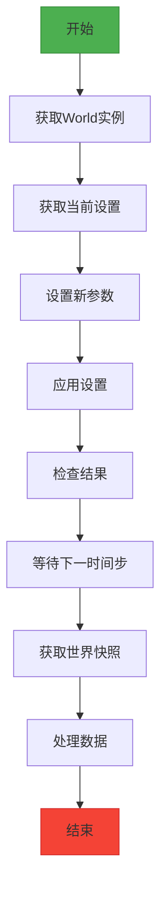
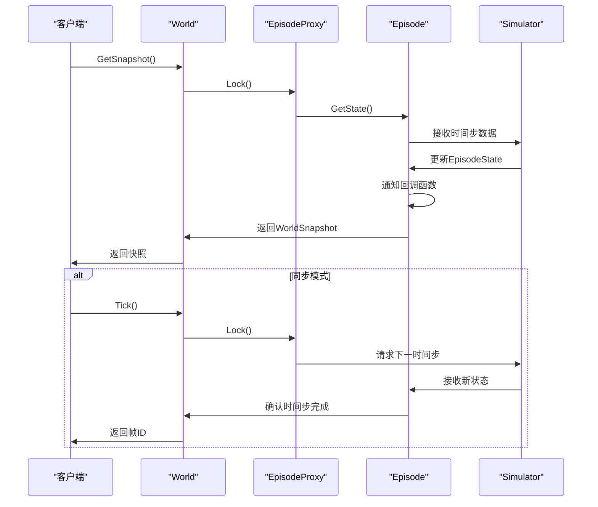
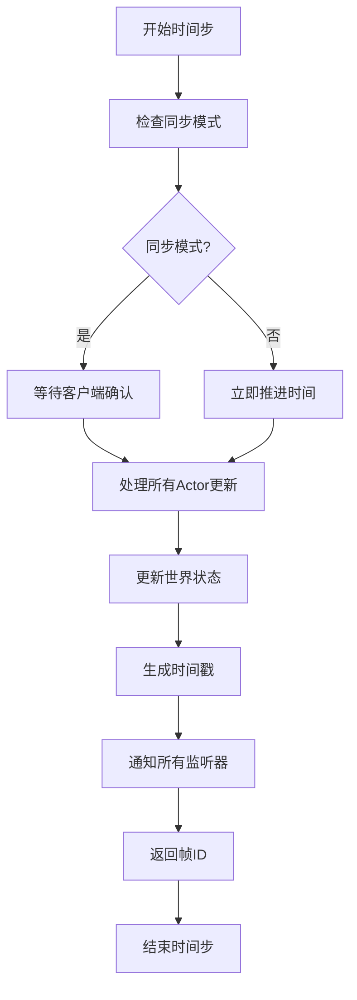
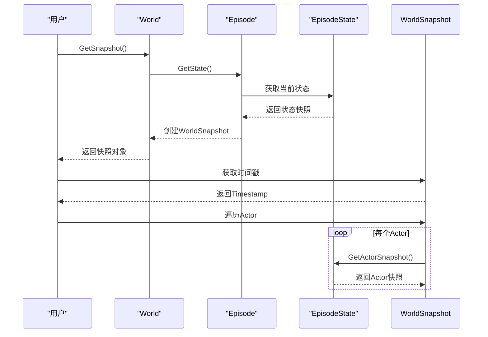
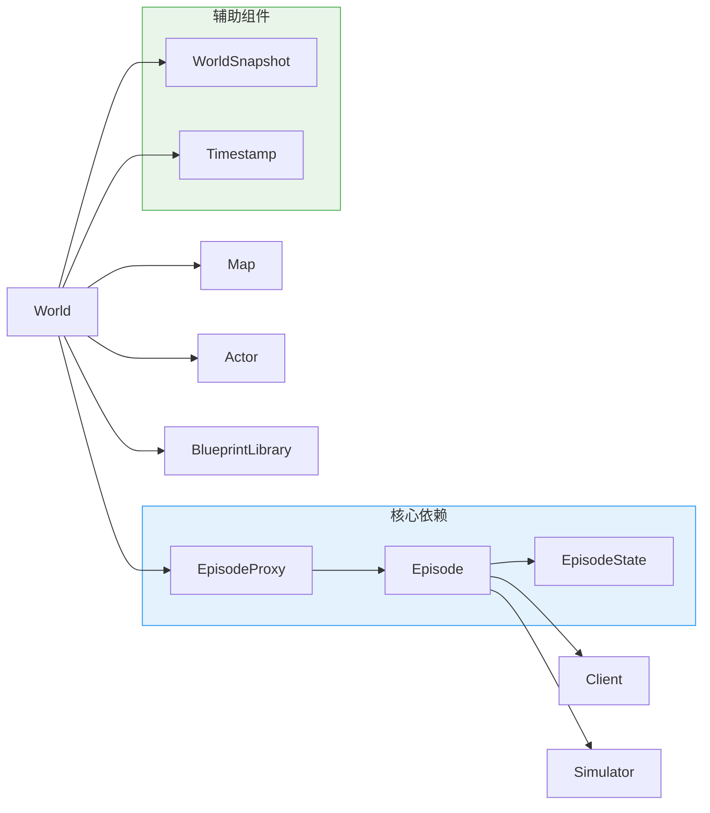

# 世界状态管理

> **引用文件**
> **本文档引用的文件**

- [World.h](https://github.com/carla-simulator/carla/blob/ue5-dev/LibCarla/source/carla/client/World.h)
- [World.cpp](https://github.com/carla-simulator/carla/blob/ue5-dev/LibCarla/source/carla/client/World.cpp)
- [Episode.h](https://github.com/carla-simulator/carla/blob/ue5-dev/LibCarla/source/carla/client/detail/Episode.h)
- [Episode.cpp](https://github.com/carla-simulator/carla/blob/ue5-dev/LibCarla/source/carla/client/detail/Episode.cpp)
- [EpisodeProxy.h](https://github.com/carla-simulator/carla/blob/ue5-dev/LibCarla/source/carla/client/detail/EpisodeProxy.h)
- [EpisodeProxy.cpp](https://github.com/carla-simulator/carla/blob/ue5-dev/LibCarla/source/carla/client/detail/EpisodeProxy.cpp)
- [EpisodeSettings.h](https://github.com/carla-simulator/carla/blob/ue5-dev/LibCarla/source/carla/rpc/EpisodeSettings.h)
- [Timestamp.h](https://github.com/carla-simulator/carla/blob/ue5-dev/LibCarla/source/carla/client/Timestamp.h)
- [WorldSnapshot.h](https://github.com/carla-simulator/carla/blob/ue5-dev/LibCarla/source/carla/client/WorldSnapshot.h)

## 目录

1. [简介](#简介)
2. [项目结构](#项目结构)
3. [核心组件](#核心组件)
4. [架构概述](#架构概述)
5. [详细组件分析](#详细组件分析)
6. [依赖分析](#依赖分析)
7. [性能考虑](#性能考虑)
8. [故障排除指南](#故障排除指南)
9. [结论](#结论)

## 简介

本文档详细介绍了 CARLA 仿真平台中世界状态管理的核心机制，重点阐述了 World 类如何管理仿真会话的生命周期。文档深入分析了 Episode 和 EpisodeProxy 类在维护当前仿真状态中的核心作用，包括时间步进、快照获取和状态同步机制。同时，文档化了 World 类提供的主要功能，如获取当前时间戳、设置世界设置（同步/异步模式、固定时间步长、子步数等）、执行批量操作（apply_batch）以及清理环境中的 Actor。

## 项目结构

CARLA 的世界状态管理主要集中在 LibCarla 模块的 client 子目录中，通过 World、Episode 和 EpisodeProxy 等核心类实现。这些类协同工作，为用户提供了一套完整的仿真控制接口。



**图示来源**

- [World.h](https://github.com/carla-simulator/carla/blob/ue5-dev/LibCarla/source/carla/client/World.h)
- [EpisodeProxy.h](https://github.com/carla-simulator/carla/blob/ue5-dev/LibCarla/source/carla/client/detail/EpisodeProxy.h)
- [Episode.h](https://github.com/carla-simulator/carla/blob/ue5-dev/LibCarla/source/carla/client/detail/Episode.h)

**本节来源**

- [World.h](https://github.com/carla-simulator/carla/blob/ue5-dev/LibCarla/source/carla/client/World.h)
- [EpisodeProxy.h](https://github.com/carla-simulator/carla/blob/ue5-dev/LibCarla/source/carla/client/detail/EpisodeProxy.h)

## 核心组件

世界状态管理的核心组件包括 World 类、Episode 类和 EpisodeProxy 类。World 类作为用户与仿真世界交互的主要接口，封装了所有世界级别的操作。Episode 类负责管理当前仿真会话的完整状态，包括所有 Actor 的状态、时间信息和环境设置。EpisodeProxy 类则作为安全代理，确保对 Episode 的访问在会话有效期内进行。

**本节来源**

- <a href="https://github.com/carla-simulator/carla/blob/ue5-dev/LibCarla/source/carla/client/World.h#L45-L239" target="_blank">World.h</a>
- <a href="https://github.com/carla-simulator/carla/blob/ue5-dev/LibCarla/source/carla/client/detail/Episode.h#L34-L137" target="_blank">Episode.h</a>
- <a href="https://github.com/carla-simulator/carla/blob/ue5-dev/LibCarla/source/carla/client/detail/EpisodeProxy.h#L28-L67" target="_blank">EpisodeProxy.h</a>

## 架构概述

CARLA 的世界状态管理采用分层架构设计，通过清晰的职责分离实现了高效的状态管理和同步机制。World 类作为顶层接口，通过 EpisodeProxy 代理访问底层的 Episode 实例，从而确保线程安全和会话有效性。



**图示来源**

- [World.h](https://github.com/carla-simulator/carla/blob/ue5-dev/LibCarla/source/carla/client/World.h)
- [EpisodeProxy.h](https://github.com/carla-simulator/carla/blob/ue5-dev/LibCarla/source/carla/client/detail/EpisodeProxy.h)
- [Episode.h](https://github.com/carla-simulator/carla/blob/ue5-dev/LibCarla/source/carla/client/detail/Episode.h)
- [EpisodeState.h](https://github.com/carla-simulator/carla/blob/ue5-dev/LibCarla/source/carla/client/detail/EpisodeState.h)
- [WorldSnapshot.h](https://github.com/carla-simulator/carla/blob/ue5-dev/LibCarla/source/carla/client/WorldSnapshot.h)
- [Timestamp.h](https://github.com/carla-simulator/carla/blob/ue5-dev/LibCarla/source/carla/client/Timestamp.h)

## 详细组件分析

### World 类分析

World 类是用户与仿真世界交互的主要接口，提供了丰富的世界状态管理功能。

#### 功能特性

- **会话管理**: 通过 EpisodeProxy 管理当前仿真会话的生命周期
- **状态查询**: 提供获取当前时间戳、天气、设置等状态信息的接口
- **Actor 管理**: 支持查询、生成和管理世界中的所有 Actor
- **事件处理**: 支持注册和处理世界时间步进事件



**图示来源**

- <a href="https://github.com/carla-simulator/carla/blob/ue5-dev/LibCarla/source/carla/client/World.h#L45-L239" target="_blank">World.h</a>
- <a href="https://github.com/carla-simulator/carla/blob/ue5-dev/LibCarla/source/carla/client/World.cpp#L1-L392" target="_blank">World.cpp</a>

**本节来源**

- [World.h](https://github.com/carla-simulator/carla/blob/ue5-dev/LibCarla/source/carla/client/World.h)
- [World.cpp](https://github.com/carla-simulator/carla/blob/ue5-dev/LibCarla/source/carla/client/World.cpp)

### Episode 和 EpisodeProxy 类分析

Episode 和 EpisodeProxy 类是世界状态管理的核心，负责维护仿真会话的完整状态和生命周期。

#### 类关系

```mermaid
classDiagram
class EpisodeProxyImpl~T~ {
+_episode_id uint64_t
+_simulator T
+GetId() uint64_t
+TryLock() SharedPtr~Simulator~
+Lock() SharedPtr~Simulator~
+IsValid() bool
+Clear()
}
class Episode {
+_client Client&
+_state AtomicSharedPtr~const EpisodeState~
+_actors CachedActorList
+_on_tick_callbacks CallbackList~WorldSnapshot~
+_on_map_change_callbacks CallbackList~WorldSnapshot~
+_on_light_update_callbacks CallbackList~WorldSnapshot~
+_snapshot RecurrentSharedFuture~WorldSnapshot~
+_walker_navigation AtomicSharedPtr~WalkerNavigation~
+_token streaming : : Token
+_pending_exceptions bool
+_should_update_map bool
+_simulator weak_ptr~Simulator~
}
EpisodeProxyImpl~Strong~ <|-- EpisodeProxy
EpisodeProxyImpl~Weak~ <|-- WeakEpisodeProxy
Episode --> EpisodeState
Episode --> Client
Episode --> Simulator
note right of EpisodeProxyImpl~T~
EpisodeProxy是使用Strong指针的
EpisodeProxyImpl特化版本
end note
note right of Episode
Episode类通过原子共享指针
管理会话状态，确保线程安全
end note
```

**图示来源**

- <a href="https://github.com/carla-simulator/carla/blob/ue5-dev/LibCarla/source/carla/client/detail/EpisodeProxy.h#L28-L67" target="_blank">EpisodeProxy.h</a>
- <a href="https://github.com/carla-simulator/carla/blob/ue5-dev/LibCarla/source/carla/client/detail/Episode.h#L34-L137" target="_blank">Episode.h</a>

#### 状态同步机制



**图示来源**

- <a href="https://github.com/carla-simulator/carla/blob/ue5-dev/LibCarla/source/carla/client/detail/Episode.cpp#L56-L112" target="_blank">Episode.cpp</a>
- <a href="https://github.com/carla-simulator/carla/blob/ue5-dev/LibCarla/source/carla/client/World.cpp#L142-L161" target="_blank">World.cpp</a>

**本节来源**

- [Episode.h](https://github.com/carla-simulator/carla/blob/ue5-dev/LibCarla/source/carla/client/detail/Episode.h)
- [Episode.cpp](https://github.com/carla-simulator/carla/blob/ue5-dev/LibCarla/source/carla/client/detail/Episode.cpp)
- [EpisodeProxy.h](https://github.com/carla-simulator/carla/blob/ue5-dev/LibCarla/source/carla/client/detail/EpisodeProxy.h)
- [EpisodeProxy.cpp](https://github.com/carla-simulator/carla/blob/ue5-dev/LibCarla/source/carla/client/detail/EpisodeProxy.cpp)

### 时间步进与快照机制

世界状态管理中的时间步进和快照机制是确保仿真一致性和可预测性的关键。

#### 时间步进流程



**图示来源**

- <a href="https://github.com/carla-simulator/carla/blob/ue5-dev/LibCarla/source/carla/client/World.cpp#L157-L161" target="_blank">World.cpp</a>
- <a href="https://github.com/carla-simulator/carla/blob/ue5-dev/LibCarla/source/carla/client/detail/Episode.cpp#L85-L110" target="_blank">Episode.cpp</a>

#### 快照获取流程



**图示来源**

- <a href="https://github.com/carla-simulator/carla/blob/ue5-dev/LibCarla/source/carla/client/World.cpp#L98-L100" target="_blank">World.cpp</a>
- <a href="https://github.com/carla-simulator/carla/blob/ue5-dev/LibCarla/source/carla/client/detail/Episode.h#L63-L65" target="_blank">Episode.h</a>
- [WorldSnapshot.h](https://github.com/carla-simulator/carla/blob/ue5-dev/LibCarla/source/carla/client/WorldSnapshot.h)

**本节来源**

- [World.h](https://github.com/carla-simulator/carla/blob/ue5-dev/LibCarla/source/carla/client/World.h)
- [World.cpp](https://github.com/carla-simulator/carla/blob/ue5-dev/LibCarla/source/carla/client/World.cpp)
- [Episode.h](https://github.com/carla-simulator/carla/blob/ue5-dev/LibCarla/source/carla/client/detail/Episode.h)
- [WorldSnapshot.h](https://github.com/carla-simulator/carla/blob/ue5-dev/LibCarla/source/carla/client/WorldSnapshot.h)
- [Timestamp.h](https://github.com/carla-simulator/carla/blob/ue5-dev/LibCarla/source/carla/client/Timestamp.h)

## 依赖分析

世界状态管理系统的各个组件之间存在明确的依赖关系，这些依赖关系确保了系统的稳定性和可维护性。



**图示来源**

- [World.h](https://github.com/carla-simulator/carla/blob/ue5-dev/LibCarla/source/carla/client/World.h)
- [EpisodeProxy.h](https://github.com/carla-simulator/carla/blob/ue5-dev/LibCarla/source/carla/client/detail/EpisodeProxy.h)
- [Episode.h](https://github.com/carla-simulator/carla/blob/ue5-dev/LibCarla/source/carla/client/detail/Episode.h)

**本节来源**

- [World.h](https://github.com/carla-simulator/carla/blob/ue5-dev/LibCarla/source/carla/client/World.h)
- [EpisodeProxy.h](https://github.com/carla-simulator/carla/blob/ue5-dev/LibCarla/source/carla/client/detail/EpisodeProxy.h)
- [Episode.h](https://github.com/carla-simulator/carla/blob/ue5-dev/LibCarla/source/carla/client/detail/Episode.h)

## 性能考虑

在设计和使用世界状态管理功能时，需要考虑以下性能因素：

1. **时间步长设置**: 在同步模式下，固定时间步长可以提高仿真的可预测性，但过小的时间步长会增加通信开销
2. **批量操作**: 使用批量操作（如 apply_batch）可以减少网络通信次数，提高效率
3. **事件回调**: 合理使用 OnTick 事件回调，避免在回调函数中执行耗时操作
4. **状态查询**: 频繁的状态查询会影响性能，建议在必要时才获取世界快照
5. **Actor 管理**: 大量 Actor 的存在会增加状态同步的开销，需要合理控制场景复杂度

## 故障排除指南

在使用世界状态管理功能时，可能会遇到以下常见问题：

1. **会话失效**: 当尝试访问已结束的会话时，会抛出运行时异常。确保在会话有效期内进行操作
2. **设置应用失败**: 在调用 ApplySettings 后，系统会尝试验证设置是否生效。如果验证失败，会记录警告信息
3. **时间步进超时**: 在同步模式下，如果客户端未能及时响应，可能会导致时间步进超时
4. **状态不一致**: 在高负载情况下，可能会出现状态不一致的情况，建议使用世界快照来确保状态一致性

**本节来源**

- <a href="https://github.com/carla-simulator/carla/blob/ue5-dev/LibCarla/source/carla/client/World.cpp#L56-L84" target="_blank">World.cpp</a>
- <a href="https://github.com/carla-simulator/carla/blob/ue5-dev/LibCarla/source/carla/client/detail/EpisodeProxy.cpp#L38-L47" target="_blank">EpisodeProxy.cpp</a>

## 结论

CARLA 的世界状态管理系统通过 World、Episode 和 EpisodeProxy 等核心类的协同工作，提供了一套完整且高效的仿真会话管理机制。该系统支持灵活的时间步进控制、精确的状态同步和丰富的状态查询功能，为用户提供了强大的仿真控制能力。通过理解这些核心组件的工作原理和相互关系，开发者可以更好地利用 CARLA 平台进行自动驾驶和机器人技术的研究与开发。
