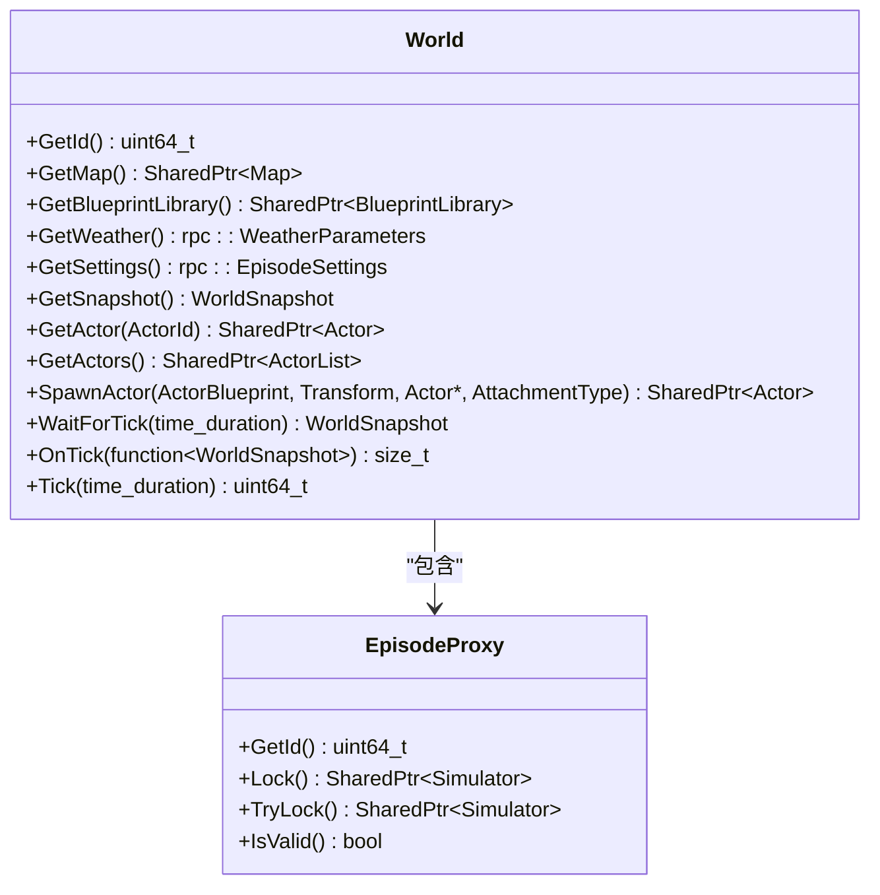
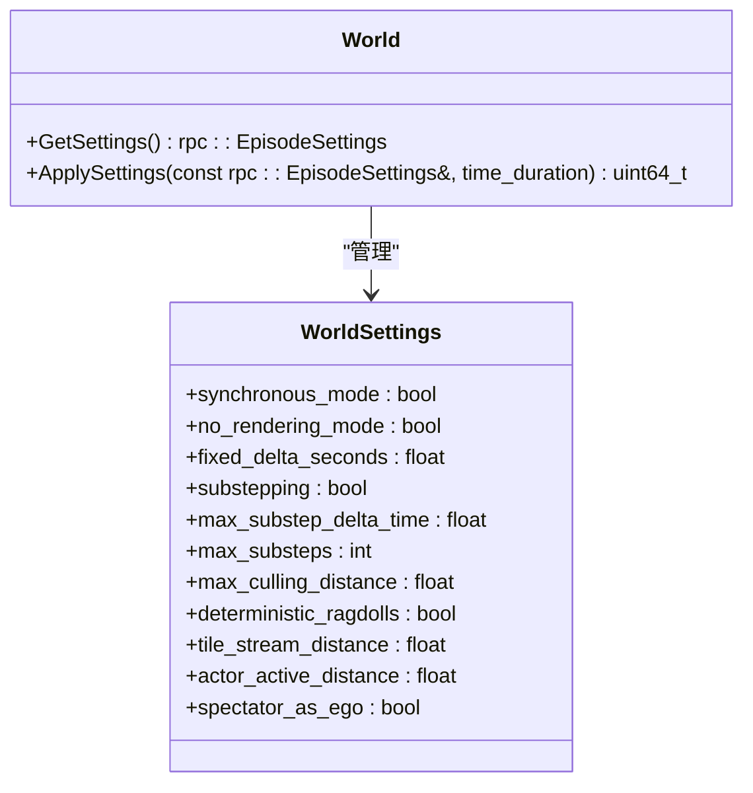
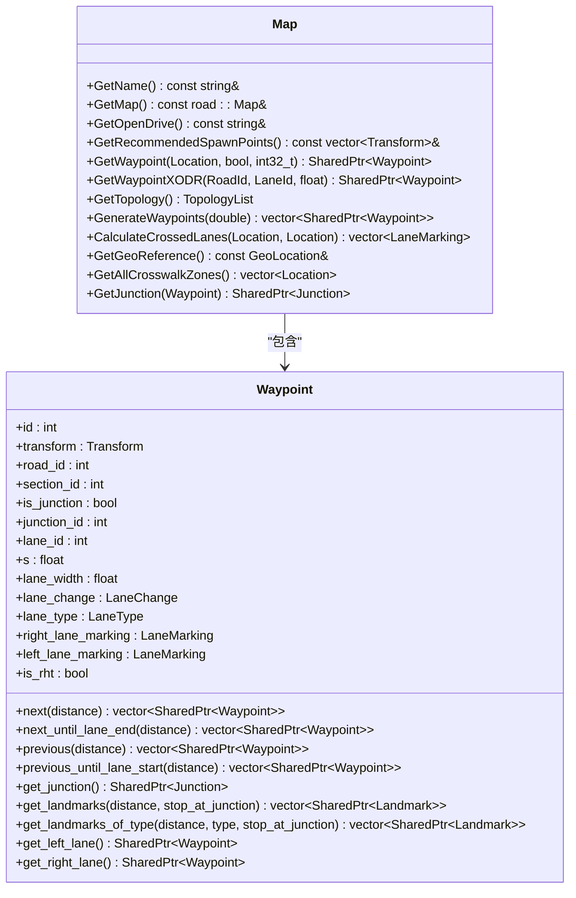
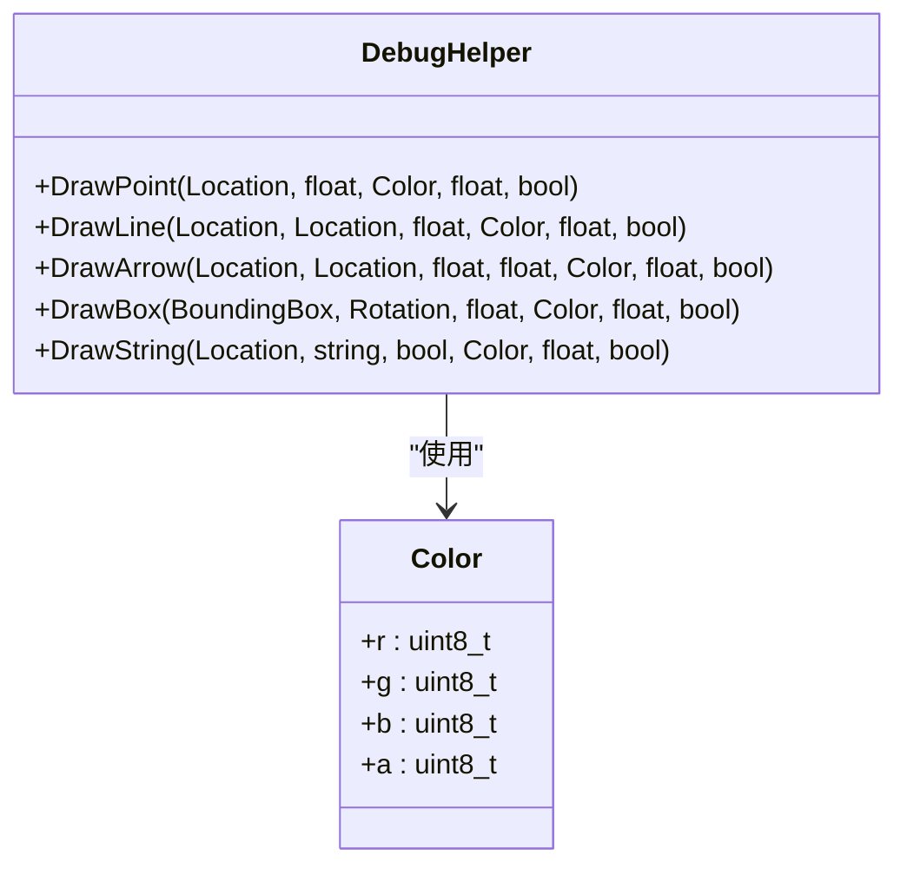
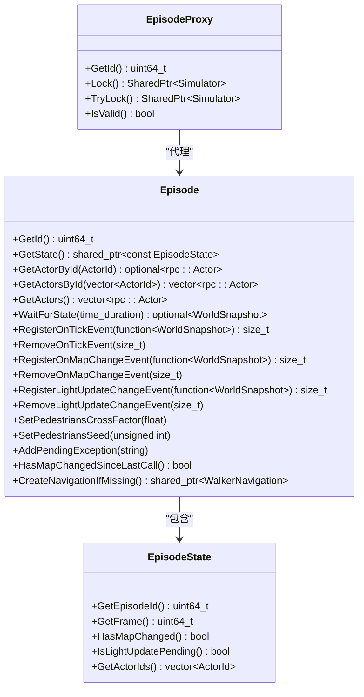
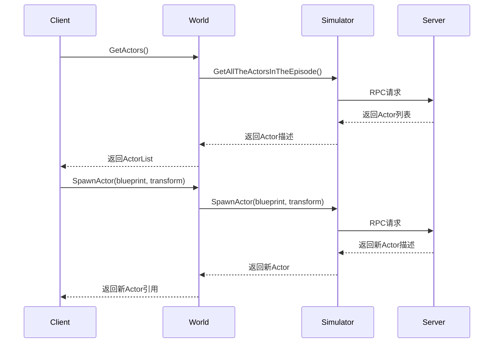
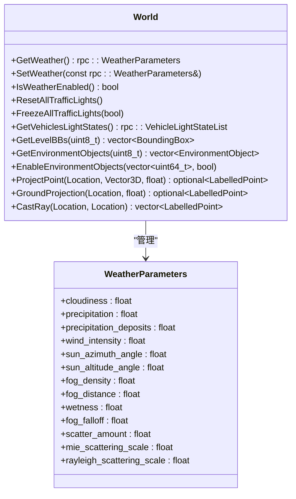

# 世界管理

> **引用文件**
> **本文档中引用的文件**

- [World.h](https://github.com/carla-simulator/carla/blob/ue5-dev/LibCarla/source/carla/client/World.h)
- [World.cpp](https://github.com/carla-simulator/carla/blob/ue5-dev/LibCarla/source/carla/client/World.cpp)
- [Map.h](https://github.com/carla-simulator/carla/blob/ue5-dev/LibCarla/source/carla/client/Map.h)
- [Map.cpp](https://github.com/carla-simulator/carla/blob/ue5-dev/LibCarla/source/carla/client/Map.cpp)
- [DebugHelper.h](https://github.com/carla-simulator/carla/blob/ue5-dev/LibCarla/source/carla/client/DebugHelper.h)
- [DebugHelper.cpp](https://github.com/carla-simulator/carla/blob/ue5-dev/LibCarla/source/carla/client/DebugHelper.cpp)
- [EpisodeProxy.h](https://github.com/carla-simulator/carla/blob/ue5-dev/LibCarla/source/carla/client/detail/EpisodeProxy.h)
- [EpisodeProxy.cpp](https://github.com/carla-simulator/carla/blob/ue5-dev/LibCarla/source/carla/client/detail/EpisodeProxy.cpp)
- [Episode.h](https://github.com/carla-simulator/carla/blob/ue5-dev/LibCarla/source/carla/client/detail/Episode.h)
- [Episode.cpp](https://github.com/carla-simulator/carla/blob/ue5-dev/LibCarla/source/carla/client/detail/Episode.cpp)
- [core_world.md](https://github.com/carla-simulator/carla/blob/ue5-dev/Docs/core_world.md)
- [core_map.md](https://github.com/carla-simulator/carla/blob/ue5-dev/Docs/core_map.md)
- [world.yml](https://github.com/carla-simulator/carla/blob/ue5-dev/PythonAPI/docs/world.yml)
- [map.yml](https://github.com/carla-simulator/carla/blob/ue5-dev/PythonAPI/docs/map.yml)
- [generate_traffic.py](https://github.com/carla-simulator/carla/blob/ue5-dev/PythonAPI/examples/generate_traffic.py)
- [test_world.py](https://github.com/carla-simulator/carla/blob/ue5-dev/PythonAPI/test/smoke/test_world.py)

## 目录

1. [简介](#简介)
2. [世界实例获取](#世界实例获取)
3. [世界设置管理](#世界设置管理)
4. [地图管理与查询](#地图管理与查询)
5. [调试辅助功能](#调试辅助功能)
6. [仿真会话状态管理](#仿真会话状态管理)
7. [批量操作与 Actor 查询](#批量操作与actor查询)
8. [环境参数设置](#环境参数设置)
9. [结论](#结论)

## 简介

世界管理是 CARLA 仿真系统的核心功能，它提供了对仿真环境的全面控制。通过 World 类，用户可以获取当前仿真世界实例、加载不同地图、管理世界设置（如天气、时间步长）、查询地图信息以及进行可视化调试。本文档详细介绍了 World 类及其相关组件提供的所有功能，并提供了代码示例展示如何在世界中进行批量操作、查询所有 Actor 以及设置环境参数。

**Section sources**

- <a href="https://github.com/carla-simulator/carla/blob/ue5-dev/LibCarla/source/carla/client/World.h#L1-L243" target="_blank">World.h</a>
- <a href="https://github.com/carla-simulator/carla/blob/ue5-dev/LibCarla/source/carla/client/World.cpp#L1-L392" target="_blank">World.cpp</a>

## 世界实例获取

在 CARLA 仿真系统中，可以通过客户端获取当前的仿真世界实例。World 类是访问和管理仿真环境的主要入口点。每个 World 实例都与一个特定的仿真会话（episode）相关联，该会话由 EpisodeProxy 管理。

World 类的构造函数接受一个 EpisodeProxy 对象作为参数，该对象提供了对当前仿真会话的访问。通过 World 实例，用户可以获取地图、蓝图库、天气信息、Actor 列表等关键资源。

**Diagram sources **

- <a href="https://github.com/carla-simulator/carla/blob/ue5-dev/LibCarla/source/carla/client/World.h#L45-L239" target="_blank">World.h</a>
- <a href="https://github.com/carla-simulator/carla/blob/ue5-dev/LibCarla/source/carla/client/detail/EpisodeProxy.h#L17-L76" target="_blank">EpisodeProxy.h</a>

**Section sources**

- <a href="https://github.com/carla-simulator/carla/blob/ue5-dev/LibCarla/source/carla/client/World.h#L45-L239" target="_blank">World.h</a>
- <a href="https://github.com/carla-simulator/carla/blob/ue5-dev/LibCarla/source/carla/client/detail/EpisodeProxy.h#L17-L76" target="_blank">EpisodeProxy.h</a>

## 世界设置管理

World 类提供了对仿真环境参数的全面管理功能，包括同步模式、渲染模式、时间步长等关键设置。这些设置通过 EpisodeSettings 对象进行配置和应用。

### 同步与异步模式

仿真系统支持同步和异步两种模式。在同步模式下，服务器会等待客户端的 tick 信号才会推进到下一帧，这确保了客户端和服务器之间的精确同步。在异步模式下，服务器会以最大可能的速度运行，不等待客户端的信号。

### 时间步长控制

通过设置固定的时间步长（fixed_delta_seconds），可以控制仿真中每帧之间的时间间隔。这对于需要精确时间控制的实验非常重要。当设置为 0.0 时，系统将使用可变时间步长。

### 渲染模式

可以启用"无渲染模式"（no_rendering_mode），在这种模式下，仿真将完全不进行渲染，主要用于避免在大规模交通仿真中的性能开销。

**Diagram sources **

- <a href="https://github.com/carla-simulator/carla/blob/ue5-dev/LibCarla/source/carla/client/World.h#L85-L88" target="_blank">World.h</a>
- <a href="https://github.com/carla-simulator/carla/blob/ue5-dev/PythonAPI/docs/world.yml#L107-L236" target="_blank">world.yml</a>

**Section sources**

- <a href="https://github.com/carla-simulator/carla/blob/ue5-dev/LibCarla/source/carla/client/World.h#L85-L88" target="_blank">World.h</a>
- <a href="https://github.com/carla-simulator/carla/blob/ue5-dev/LibCarla/source/carla/client/World.cpp#L52-L84" target="_blank">World.cpp</a>
- <a href="https://github.com/carla-simulator/carla/blob/ue5-dev/PythonAPI/docs/world.yml#L107-L236" target="_blank">world.yml</a>

## 地图管理与查询

地图管理是世界管理的重要组成部分，通过 Map 类提供了对 OpenDRIVE 地图文件的完整访问和查询功能。

### 地图加载与访问

通过 World 的 GetMap 方法可以获取当前仿真世界使用的地图实例。该方法会从服务器获取 XODR 格式的地图文件，并将其解析为 Map 对象。由于此操作涉及网络通信，因此建议只调用一次并缓存结果。

### 路点查询

Map 类提供了强大的路点查询功能，可以根据位置坐标获取最近的路点。路点（Waypoint）是 CARLA 中描述道路位置的基本单位，包含了位置、方向、车道类型等信息。

**Diagram sources **

- <a href="https://github.com/carla-simulator/carla/blob/ue5-dev/LibCarla/source/carla/client/Map.h#L27-L107" target="_blank">Map.h</a>
- <a href="https://github.com/carla-simulator/carla/blob/ue5-dev/LibCarla/source/carla/client/Map.cpp#L21-L193" target="_blank">Map.cpp</a>
- <a href="https://github.com/carla-simulator/carla/blob/ue5-dev/PythonAPI/docs/map.yml#L129-L387" target="_blank">map.yml</a>

**Section sources**

- <a href="https://github.com/carla-simulator/carla/blob/ue5-dev/LibCarla/source/carla/client/Map.h#L27-L107" target="_blank">Map.h</a>
- <a href="https://github.com/carla-simulator/carla/blob/ue5-dev/LibCarla/source/carla/client/Map.cpp#L21-L193" target="_blank">Map.cpp</a>
- <a href="https://github.com/carla-simulator/carla/blob/ue5-dev/PythonAPI/docs/map.yml#L129-L387" target="_blank">map.yml</a>

## 调试辅助功能

DebugHelper 类提供了在仿真环境中进行可视化调试的强大工具，允许用户绘制各种几何形状来辅助开发和调试。

### 调试形状绘制

DebugHelper 支持绘制多种类型的调试形状，包括点、线、箭头、3D 框和文本标签。这些形状可以在仿真视图中显示，帮助开发者理解场景中的空间关系和逻辑。

### 形状属性

每种调试形状都可以设置颜色、大小、生命周期等属性。颜色使用 RGB 值表示，大小控制形状的尺寸，生命周期决定了形状在场景中显示的时间（以秒为单位）。如果生命周期设置为-1，则形状将永久显示。

**Diagram sources **

- <a href="https://github.com/carla-simulator/carla/blob/ue5-dev/LibCarla/source/carla/client/DebugHelper.h#L18-L69" target="_blank">DebugHelper.h</a>
- <a href="https://github.com/carla-simulator/carla/blob/ue5-dev/LibCarla/source/carla/client/DebugHelper.cpp#L15-L86" target="_blank">DebugHelper.cpp</a>

**Section sources**

- <a href="https://github.com/carla-simulator/carla/blob/ue5-dev/LibCarla/source/carla/client/DebugHelper.h#L18-L69" target="_blank">DebugHelper.h</a>
- <a href="https://github.com/carla-simulator/carla/blob/ue5-dev/LibCarla/source/carla/client/DebugHelper.cpp#L15-L86" target="_blank">DebugHelper.cpp</a>

## 仿真会话状态管理

仿真会话状态由 Episode 和 EpisodeProxy 类共同管理，它们负责维护当前仿真会话的完整状态信息。

### Episode 类

Episode 类持有当前的仿真会话和会话状态。会话状态会在每次接收到世界 tick 时在后台更新。Episode 类还负责管理 Actor 列表、注册 tick 事件回调、处理地图变更等。

### EpisodeProxy 类

EpisodeProxy 提供了对特定仿真会话中 Simulator 的访问。它确保在会话结束后对 Simulator 的任何访问都会抛出异常，从而防止对已销毁资源的访问。

**Diagram sources **

- <a href="https://github.com/carla-simulator/carla/blob/ue5-dev/LibCarla/source/carla/client/detail/Episode.h#L34-L137" target="_blank">Episode.h</a>
- <a href="https://github.com/carla-simulator/carla/blob/ue5-dev/LibCarla/source/carla/client/detail/Episode.cpp#L23-L169" target="_blank">Episode.cpp</a>
- <a href="https://github.com/carla-simulator/carla/blob/ue5-dev/LibCarla/source/carla/client/detail/EpisodeProxy.h#L17-L76" target="_blank">EpisodeProxy.h</a>
- <a href="https://github.com/carla-simulator/carla/blob/ue5-dev/LibCarla/source/carla/client/detail/EpisodeProxy.cpp#L18-L61" target="_blank">EpisodeProxy.cpp</a>

**Section sources**

- <a href="https://github.com/carla-simulator/carla/blob/ue5-dev/LibCarla/source/carla/client/detail/Episode.h#L34-L137" target="_blank">Episode.h</a>
- <a href="https://github.com/carla-simulator/carla/blob/ue5-dev/LibCarla/source/carla/client/detail/Episode.cpp#L23-L169" target="_blank">Episode.cpp</a>
- <a href="https://github.com/carla-simulator/carla/blob/ue5-dev/LibCarla/source/carla/client/detail/EpisodeProxy.h#L17-L76" target="_blank">EpisodeProxy.h</a>
- <a href="https://github.com/carla-simulator/carla/blob/ue5-dev/LibCarla/source/carla/client/detail/EpisodeProxy.cpp#L18-L61" target="_blank">EpisodeProxy.cpp</a>

## 批量操作与 Actor 查询

World 类提供了丰富的 API 来查询和管理场景中的 Actor，支持批量操作和高效查询。

### Actor 查询

可以通过多种方式查询 Actor：

- `GetActor(id)`：根据 Actor ID 获取单个 Actor
- `GetActors()`：获取场景中所有 Actor 的列表
- `GetActors(vector<ActorId>)`：根据 Actor ID 列表获取多个 Actor

### 批量操作

支持批量应用命令，如批量生成 Actor、批量设置自动驾驶等。这通过命令批处理机制实现，可以显著提高性能。

**Diagram sources **

- <a href="https://github.com/carla-simulator/carla/blob/ue5-dev/LibCarla/source/carla/client/World.h#L102-L118" target="_blank">World.h</a>
- <a href="https://github.com/carla-simulator/carla/blob/ue5-dev/LibCarla/source/carla/client/World.cpp#L102-L139" target="_blank">World.cpp</a>
- <a href="https://github.com/carla-simulator/carla/blob/ue5-dev/PythonAPI/examples/generate_traffic.py#L168-L197" target="_blank">generate_traffic.py</a>

**Section sources**

- <a href="https://github.com/carla-simulator/carla/blob/ue5-dev/LibCarla/source/carla/client/World.h#L102-L118" target="_blank">World.h</a>
- <a href="https://github.com/carla-simulator/carla/blob/ue5-dev/LibCarla/source/carla/client/World.cpp#L102-L139" target="_blank">World.cpp</a>
- <a href="https://github.com/carla-simulator/carla/blob/ue5-dev/LibCarla/source/carla/client/ActorList.h#L18-L72" target="_blank">ActorList.h</a>
- <a href="https://github.com/carla-simulator/carla/blob/ue5-dev/PythonAPI/examples/generate_traffic.py#L168-L197" target="_blank">generate_traffic.py</a>

## 环境参数设置

World 类提供了对仿真环境参数的全面控制，包括天气、交通灯、环境对象等。

### 天气控制

可以获取和设置当前的天气参数，包括云量、降水、风力、太阳位置等。通过改变天气参数，可以模拟不同的天气条件。

### 交通灯管理

支持对交通灯的全面控制，包括冻结/解冻所有交通灯、重置所有交通灯到初始状态、查询特定路口的交通灯等。

### 环境对象管理

可以查询和控制环境对象（如建筑物、植被、道具等）的可见性。这通过语义标签进行过滤和管理。

**Diagram sources **

- <a href="https://github.com/carla-simulator/carla/blob/ue5-dev/LibCarla/source/carla/client/World.h#L90-L97" target="_blank">World.h</a>
- <a href="https://github.com/carla-simulator/carla/blob/ue5-dev/LibCarla/source/carla/client/World.h#L160-L185" target="_blank">World.h</a>
- <a href="https://github.com/carla-simulator/carla/blob/ue5-dev/LibCarla/source/carla/client/World.cpp#L86-L258" target="_blank">World.cpp</a>

**Section sources**

- <a href="https://github.com/carla-simulator/carla/blob/ue5-dev/LibCarla/source/carla/client/World.h#L90-L97" target="_blank">World.h</a>
- <a href="https://github.com/carla-simulator/carla/blob/ue5-dev/LibCarla/source/carla/client/World.h#L160-L185" target="_blank">World.h</a>
- <a href="https://github.com/carla-simulator/carla/blob/ue5-dev/LibCarla/source/carla/client/World.cpp#L86-L258" target="_blank">World.cpp</a>
- <a href="https://github.com/carla-simulator/carla/blob/ue5-dev/PythonAPI/docs/world.yml#L735-L783" target="_blank">world.yml</a>

## 结论

本文档全面介绍了 CARLA 仿真系统中的世界管理功能。通过 World 类，用户可以有效地控制和管理仿真环境，包括获取世界实例、管理世界设置、查询地图信息、进行可视化调试以及管理仿真会话状态。这些功能为开发和测试自动驾驶系统提供了强大的支持，使得研究人员和开发者能够创建复杂而真实的仿真场景。

**Section sources**

- <a href="https://github.com/carla-simulator/carla/blob/ue5-dev/LibCarla/source/carla/client/World.h#L1-L243" target="_blank">World.h</a>
- <a href="https://github.com/carla-simulator/carla/blob/ue5-dev/LibCarla/source/carla/client/World.cpp#L1-L392" target="_blank">World.cpp</a>
- [core_world.md](https://github.com/carla-simulator/carla/blob/ue5-dev/Docs/core_world.md)
- [world.yml](https://github.com/carla-simulator/carla/blob/ue5-dev/PythonAPI/docs/world.yml)
