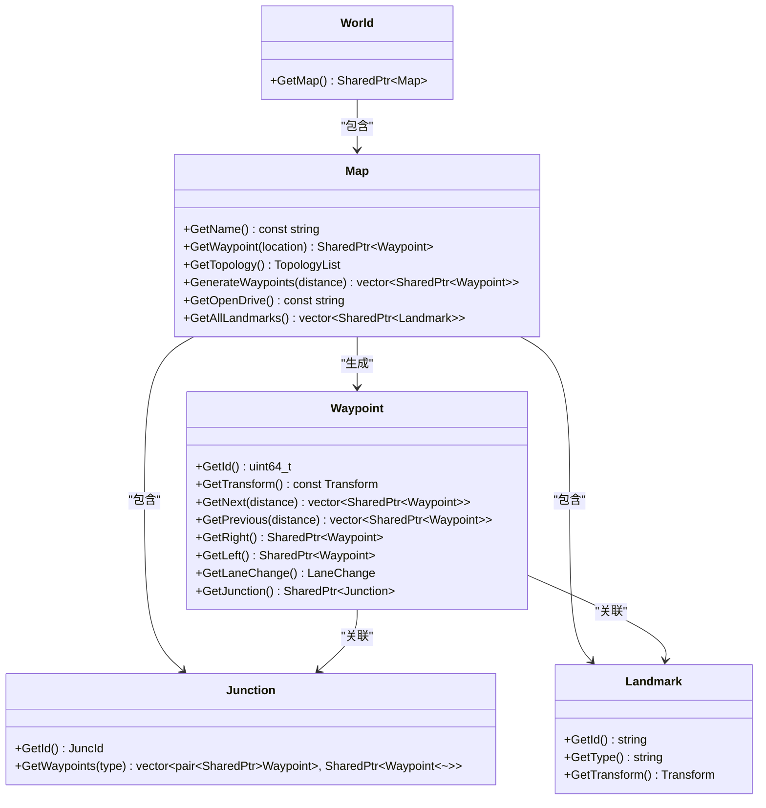
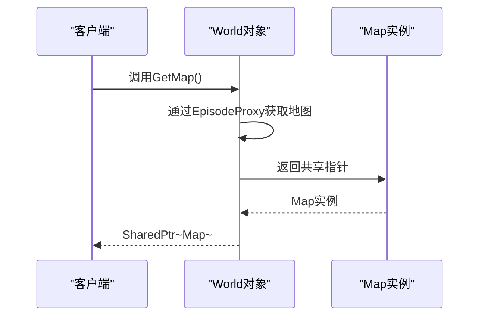
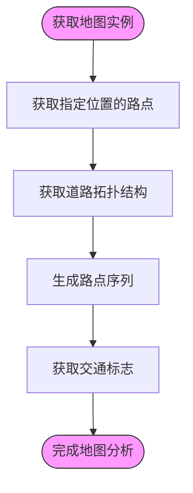
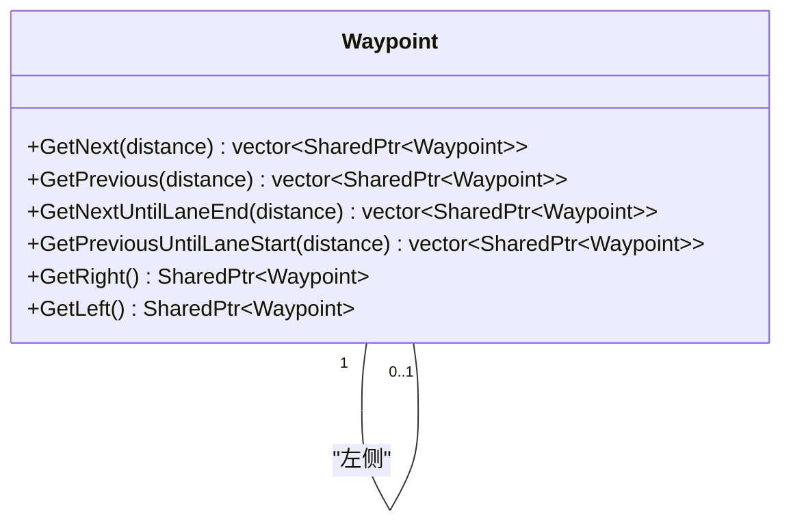
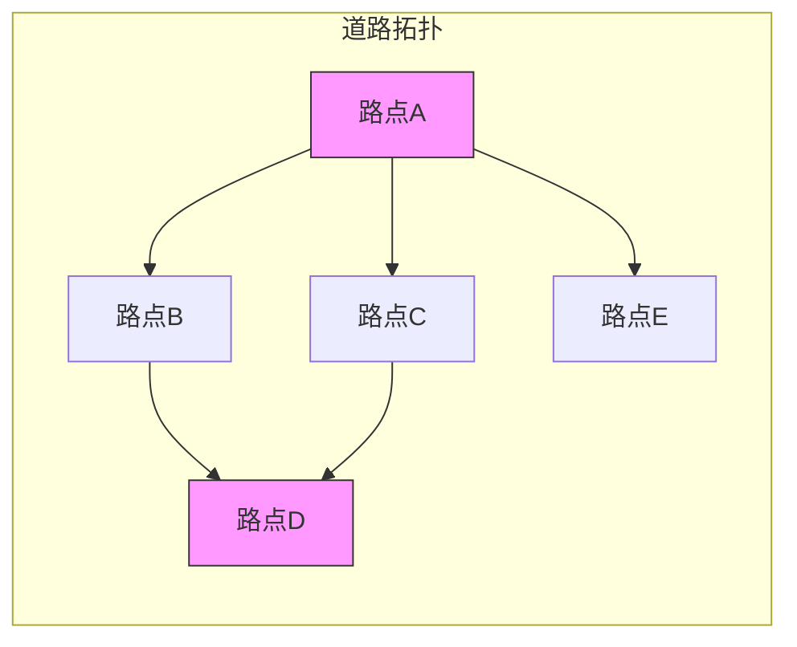
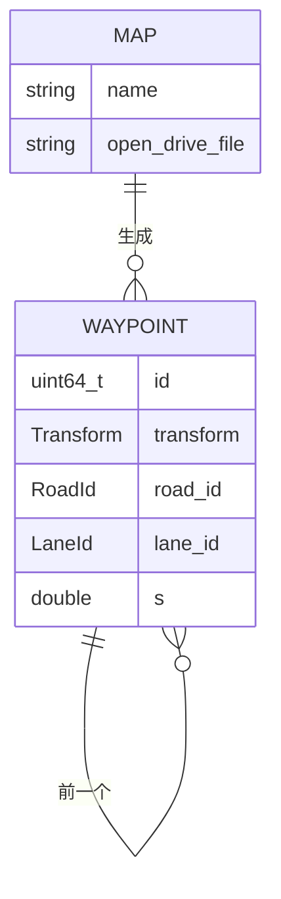
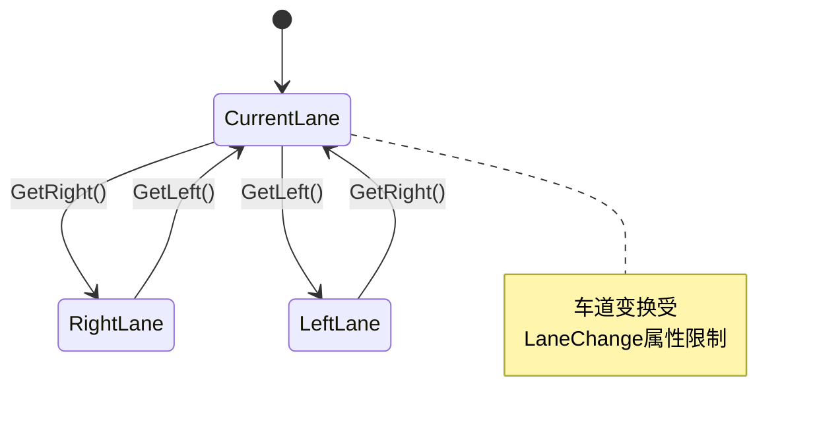
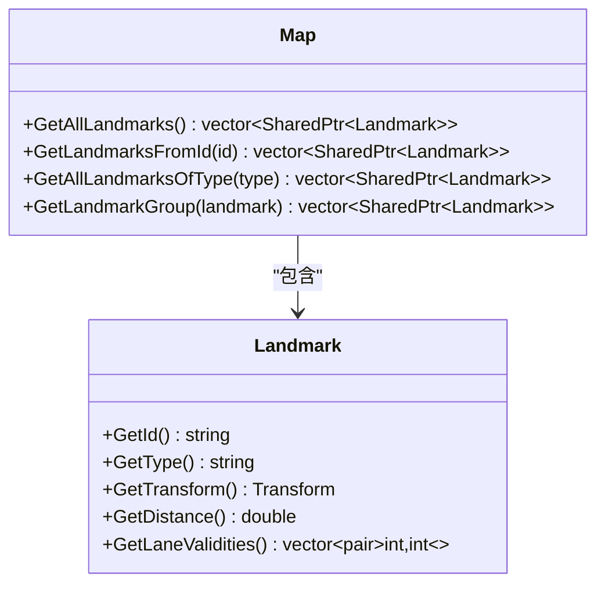
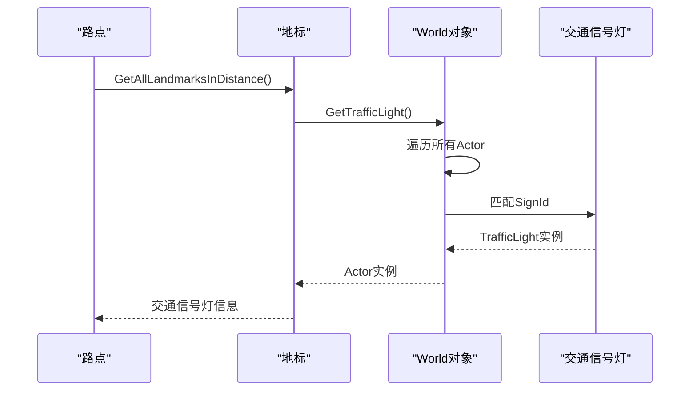
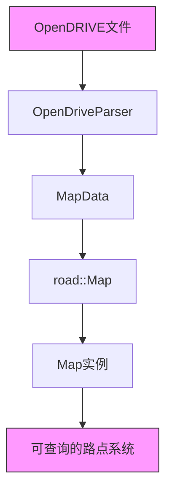

# 地图系统

> **引用文件**
> **本文档中引用的文件**

- [Map.h](https://github.com/carla-simulator/carla/blob/ue5-dev/LibCarla/source/carla/client/Map.h)
- [Map.cpp](https://github.com/carla-simulator/carla/blob/ue5-dev/LibCarla/source/carla/client/Map.cpp)
- [Waypoint.h](https://github.com/carla-simulator/carla/blob/ue5-dev/LibCarla/source/carla/client/Waypoint.h)
- [Waypoint.cpp](https://github.com/carla-simulator/carla/blob/ue5-dev/LibCarla/source/carla/client/Waypoint.cpp)
- [World.h](https://github.com/carla-simulator/carla/blob/ue5-dev/LibCarla/source/carla/client/World.h)
- [World.cpp](https://github.com/carla-simulator/carla/blob/ue5-dev/LibCarla/source/carla/client/World.cpp)
- [OpenDriveParser.h](https://github.com/carla-simulator/carla/blob/ue5-dev/LibCarla/source/carla/opendrive/OpenDriveParser.h)
- [Map.h](https://github.com/carla-simulator/carla/blob/ue5-dev/LibCarla/source/carla/road/Map.h)
- [core_map.md](https://github.com/carla-simulator/carla/blob/ue5-dev/Docs/core_map.md)
- [map.yml](https://github.com/carla-simulator/carla/blob/ue5-dev/PythonAPI/docs/map.yml)
- [lane_explorer.py](https://github.com/carla-simulator/carla/blob/ue5-dev/PythonAPI/examples/lane_explorer.py)

## 目录

1. [简介](#简介)
2. [地图系统架构](#地图系统架构)
3. [Map 类核心功能](#map类核心功能)
4. [路点（Waypoint）系统](#路点（waypoint）系统)
5. [道路拓扑与连接关系](#道路拓扑与连接关系)
6. [车道信息与变换规则](#车道信息与变换规则)
7. [交通标志与信号灯定位](#交通标志与信号灯定位)
8. [OpenDRIVE 格式支持](#opendrive格式支持)
9. [实际应用示例](#实际应用示例)
10. [总结](#总结)

## 简介

CARLA 仿真中的地图系统是自动驾驶模拟的核心组件，它基于 OpenDRIVE 标准定义了道路网络的几何结构和语义信息。地图系统通过 Map 类提供了一套完整的查询接口，使开发者能够获取路点、分析道路拓扑、查询车道信息以及定位交通标志和信号灯。本文档详细说明了 Map 类在 CARLA 仿真中的角色和功能，解释如何通过 World 对象获取当前地图实例，并深入探讨地图提供的核心功能。

**Section sources**

- <a href="https://github.com/carla-simulator/carla/blob/ue5-dev/Docs/core_map.md#L1-L206" target="_blank">core_map.md</a>

## 地图系统架构

CARLA 的地图系统采用分层架构设计，将 OpenDRIVE 道路数据与仿真环境中的可导航路点相结合。系统核心由 Map 类、Waypoint 类和 World 类组成，它们协同工作以提供完整的地图功能。



**Diagram sources**

- <a href="https://github.com/carla-simulator/carla/blob/ue5-dev/LibCarla/source/carla/client/Map.h#L27-L107" target="_blank">Map.h</a>
- <a href="https://github.com/carla-simulator/carla/blob/ue5-dev/LibCarla/source/carla/client/Waypoint.h#L27-L127" target="_blank">Waypoint.h</a>
- <a href="https://github.com/carla-simulator/carla/blob/ue5-dev/LibCarla/source/carla/client/World.h#L45-L243" target="_blank">World.h</a>

## Map 类核心功能

Map 类是 CARLA 地图系统的核心，负责管理道路网络数据并提供各种查询功能。它通过 OpenDRIVE 文件解析道路信息，并将其转换为可查询的路点系统。

### 获取地图实例

在 CARLA 仿真中，可以通过 World 对象获取当前地图实例：



**Diagram sources**

- <a href="https://github.com/carla-simulator/carla/blob/ue5-dev/LibCarla/source/carla/client/World.h#L64" target="_blank">World.h</a>
- <a href="https://github.com/carla-simulator/carla/blob/ue5-dev/LibCarla/source/carla/client/World.cpp#L24-L26" target="_blank">World.cpp</a>

### 核心查询功能

Map 类提供了多种核心查询功能，包括路点查询、拓扑分析和 OpenDRIVE 支持：



**Diagram sources**

- <a href="https://github.com/carla-simulator/carla/blob/ue5-dev/LibCarla/source/carla/client/Map.h#L54-L68" target="_blank">Map.h</a>
- <a href="https://github.com/carla-simulator/carla/blob/ue5-dev/LibCarla/source/carla/client/Map.cpp#L44-L103" target="_blank">Map.cpp</a>

**Section sources**

- <a href="https://github.com/carla-simulator/carla/blob/ue5-dev/LibCarla/source/carla/client/Map.h#L32-L107" target="_blank">Map.h</a>
- <a href="https://github.com/carla-simulator/carla/blob/ue5-dev/LibCarla/source/carla/client/Map.cpp#L30-L193" target="_blank">Map.cpp</a>

## 路点（Waypoint）系统

路点系统是 CARLA 导航功能的基础，每个路点代表道路上的一个 3D 位置和方向，包含了丰富的道路信息。

### 路点属性

路点包含以下关键属性：

| 属性        | 类型       | 描述                                        |
| ----------- | ---------- | ------------------------------------------- |
| id          | uint64_t   | 路点唯一标识符，基于 OpenDRIVE 参数哈希生成 |
| transform   | Transform  | 路点的位置和方向                            |
| road_id     | RoadId     | 所属道路的 OpenDRIVE ID                     |
| section_id  | SectionId  | 所属路段的 ID                               |
| lane_id     | LaneId     | 所属车道的 ID                               |
| s           | double     | 沿道路的距离（米）                          |
| lane_width  | double     | 车道宽度（米）                              |
| lane_type   | LaneType   | 车道类型                                    |
| lane_change | LaneChange | 车道变换权限                                |

**Section sources**

- <a href="https://github.com/carla-simulator/carla/blob/ue5-dev/LibCarla/source/carla/client/Waypoint.h#L38-L57" target="_blank">Waypoint.h</a>
- <a href="https://github.com/carla-simulator/carla/blob/ue5-dev/PythonAPI/docs/map.yml#L322-L355" target="_blank">map.yml</a>

### 路点连接关系

路点系统提供了丰富的连接关系查询功能，支持路径规划和导航：



**Diagram sources**

- <a href="https://github.com/carla-simulator/carla/blob/ue5-dev/LibCarla/source/carla/client/Waypoint.h#L72-L87" target="_blank">Waypoint.h</a>
- <a href="https://github.com/carla-simulator/carla/blob/ue5-dev/LibCarla/source/carla/client/Waypoint.cpp#L50-L78" target="_blank">Waypoint.cpp</a>

## 道路拓扑与连接关系

CARLA 地图系统提供了完整的道路拓扑分析功能，支持复杂的路径规划需求。

### 拓扑结构查询

通过 GetTopology()方法可以获取道路的最小拓扑图：



**Diagram sources**

- <a href="https://github.com/carla-simulator/carla/blob/ue5-dev/LibCarla/source/carla/client/Map.h#L66" target="_blank">Map.h</a>
- <a href="https://github.com/carla-simulator/carla/blob/ue5-dev/LibCarla/source/carla/client/Map.cpp#L70-L93" target="_blank">Map.cpp</a>

### 路点生成

Map 类提供了多种路点生成方法：



**Diagram sources**

- <a href="https://github.com/carla-simulator/carla/blob/ue5-dev/LibCarla/source/carla/client/Map.h#L68" target="_blank">Map.h</a>
- <a href="https://github.com/carla-simulator/carla/blob/ue5-dev/LibCarla/source/carla/client/Map.cpp#L95-L103" target="_blank">Map.cpp</a>

**Section sources**

- <a href="https://github.com/carla-simulator/carla/blob/ue5-dev/LibCarla/source/carla/client/Map.h#L64-L68" target="_blank">Map.h</a>
- <a href="https://github.com/carla-simulator/carla/blob/ue5-dev/LibCarla/source/carla/client/Map.cpp#L70-L103" target="_blank">Map.cpp</a>

## 车道信息与变换规则

CARLA 地图系统提供了详细的车道信息和变换规则，支持安全的车道变换决策。

### 车道类型

根据 OpenDRIVE 1.4 标准，CARLA 定义了多种车道类型：

| 车道类型   | 描述     |
| ---------- | -------- |
| Driving    | 行车道   |
| Shoulder   | 路肩     |
| Biking     | 自行车道 |
| Sidewalk   | 人行道   |
| Parking    | 停车道   |
| Border     | 边界车道 |
| Restricted | 限制车道 |

**Section sources**

- <a href="https://github.com/carla-simulator/carla/blob/ue5-dev/PythonAPI/docs/map.yml#L5-L29" target="_blank">map.yml</a>

### 车道变换规则

路点系统提供了车道变换权限查询功能：



**Diagram sources**

- <a href="https://github.com/carla-simulator/carla/blob/ue5-dev/LibCarla/source/carla/client/Waypoint.h#L84-L87" target="_blank">Waypoint.h</a>
- <a href="https://github.com/carla-simulator/carla/blob/ue5-dev/LibCarla/source/carla/client/Waypoint.cpp#L130-L146" target="_blank">Waypoint.cpp</a>

## 交通标志与信号灯定位

CARLA 地图系统提供了完整的交通标志和信号灯定位功能，支持交通规则理解和遵守。

### 交通标志查询

Map 类提供了多种交通标志查询方法：



**Diagram sources**

- <a href="https://github.com/carla-simulator/carla/blob/ue5-dev/LibCarla/source/carla/client/Map.h#L85-L96" target="_blank">Map.h</a>
- <a href="https://github.com/carla-simulator/carla/blob/ue5-dev/LibCarla/source/carla/client/Map.cpp#L138-L185" target="_blank">Map.cpp</a>

### 信号灯关联

通过 World 对象可以将地标与实际的交通信号灯关联：



**Diagram sources**

- <a href="https://github.com/carla-simulator/carla/blob/ue5-dev/LibCarla/source/carla/client/Waypoint.h#L94-L102" target="_blank">Waypoint.h</a>
- <a href="https://github.com/carla-simulator/carla/blob/ue5-dev/LibCarla/source/carla/client/World.h#L154-L156" target="_blank">World.h</a>
- <a href="https://github.com/carla-simulator/carla/blob/ue5-dev/LibCarla/source/carla/client/World.cpp#L171-L201" target="_blank">World.cpp</a>

**Section sources**

- <a href="https://github.com/carla-simulator/carla/blob/ue5-dev/LibCarla/source/carla/client/Map.h#L85-L96" target="_blank">Map.h</a>
- <a href="https://github.com/carla-simulator/carla/blob/ue5-dev/LibCarla/source/carla/client/Waypoint.h#L94-L102" target="_blank">Waypoint.h</a>
- <a href="https://github.com/carla-simulator/carla/blob/ue5-dev/LibCarla/source/carla/client/World.h#L154-L156" target="_blank">World.h</a>

## OpenDRIVE 格式支持

CARLA 地图系统完全基于 OpenDRIVE 标准，提供了完整的格式支持和解析功能。

### OpenDRIVE 解析

地图系统通过 OpenDriveParser 类解析 OpenDRIVE 文件：



**Diagram sources**

- <a href="https://github.com/carla-simulator/carla/blob/ue5-dev/LibCarla/source/carla/opendrive/OpenDriveParser.h#L21" target="_blank">OpenDriveParser.h</a>
- <a href="https://github.com/carla-simulator/carla/blob/ue5-dev/LibCarla/source/carla/road/Map.h#L38" target="_blank">Map.h</a>

### OpenDRIVE 功能

Map 类提供了 OpenDRIVE 相关的功能：

| 功能                        | 方法              | 描述                              |
| --------------------------- | ----------------- | --------------------------------- |
| 获取 OpenDRIVE 内容         | GetOpenDrive()    | 返回原始 OpenDRIVE 文件内容       |
| 通过 OpenDRIVE 参数获取路点 | GetWaypointXODR() | 根据 road_id, lane_id, s 获取路点 |
| 保存地图到 OpenDRIVE 文件   | save_to_disk()    | 将当前地图保存为.xodr 文件        |
| 转换为 OpenDRIVE 字符串     | to_opendrive()    | 返回 OpenDRIVE 格式的字符串       |

**Section sources**

- <a href="https://github.com/carla-simulator/carla/blob/ue5-dev/LibCarla/source/carla/client/Map.h#L46-L62" target="_blank">Map.h</a>
- <a href="https://github.com/carla-simulator/carla/blob/ue5-dev/PythonAPI/docs/map.yml#L274-L277" target="_blank">map.yml</a>

## 实际应用示例

以下示例展示了如何在实际应用中使用 CARLA 地图系统：

### 路点查询与路径规划

```python
# 获取当前地图
map = world.get_map()

# 获取指定位置的路点
waypoint = map.get_waypoint(vehicle.get_location())

# 获取前方2米的下一个路点
next_waypoints = waypoint.get_next(2.0)

# 获取右侧车道的路点
right_waypoint = waypoint.get_right_lane()

# 生成道路拓扑
topology = map.get_topology()
```

### 交通标志检测

```python
# 获取当前位置200米内的所有交通标志
landmarks = waypoint.get_landmarks(200.0)

# 获取当前位置的交通信号灯
traffic_lights = world.get_traffic_lights_from_waypoint(waypoint, 50.0)

# 获取特定类型的交通标志
speed_signs = waypoint.get_landmarks_of_type(200.0, "SpeedLimit")
```

### 道路拓扑分析

```python
# 生成所有路点（间隔2米）
waypoints = map.generate_waypoints(2.0)

# 获取道路拓扑结构
topology = map.get_topology()

# 可视化道路拓扑
for waypoint_pair in topology:
    draw_waypoint_union(debug, waypoint_pair[0], waypoint_pair[1])
```

**Section sources**

- <a href="https://github.com/carla-simulator/carla/blob/ue5-dev/PythonAPI/examples/lane_explorer.py#L115-L162" target="_blank">lane_explorer.py</a>
- <a href="https://github.com/carla-simulator/carla/blob/ue5-dev/Docs/core_map.md#L170-L189" target="_blank">core_map.md</a>

## 总结

CARLA 的地图系统通过 Map 类提供了完整的道路网络查询功能，支持自动驾驶仿真中的各种导航需求。系统基于 OpenDRIVE 标准，将道路数据转换为可查询的路点系统，提供了路点查询、拓扑分析、车道信息获取和交通标志定位等核心功能。通过 World 对象可以方便地获取当前地图实例，并利用丰富的 API 进行路径规划和交通规则理解。地图系统的分层架构设计确保了高效的数据访问和灵活的功能扩展，为自动驾驶算法的开发和测试提供了坚实的基础。
