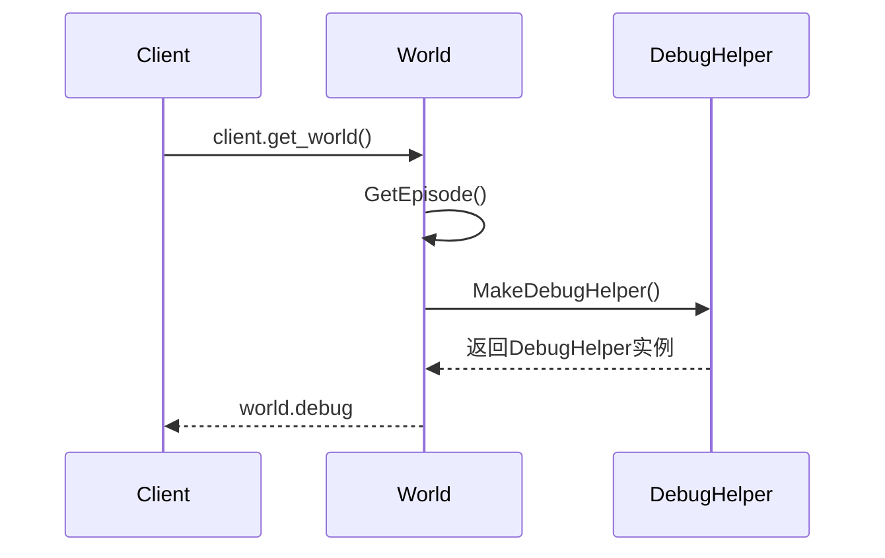
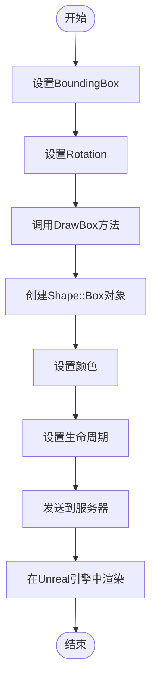
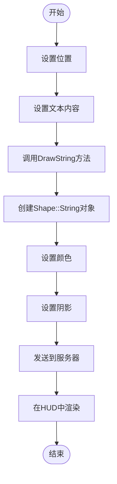
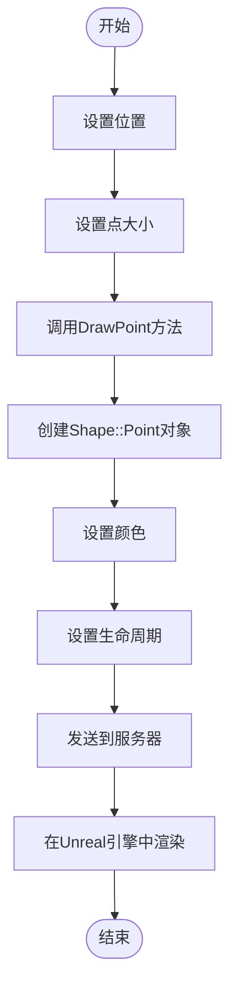
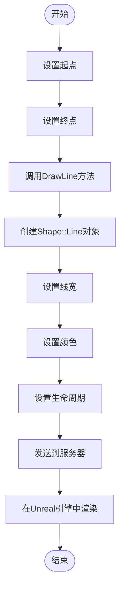
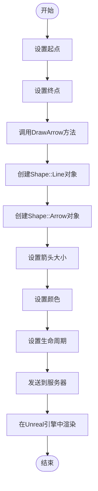

# 调试与可视化

> **引用文件**
> **本文档引用的文件**

- <a href="https://github.com/carla-simulator/carla/blob/ue5-dev/LibCarla/source/carla/client/DebugHelper.h#L1-L73" target="_blank">DebugHelper.h</a>
- <a href="https://github.com/carla-simulator/carla/blob/ue5-dev/LibCarla/source/carla/client/DebugHelper.cpp#L1-L86" target="_blank">DebugHelper.cpp</a>
- <a href="https://github.com/carla-simulator/carla/blob/ue5-dev/LibCarla/source/carla/client/World.h#L1-L243" target="_blank">World.h</a>
- <a href="https://github.com/carla-simulator/carla/blob/ue5-dev/LibCarla/source/carla/client/World.cpp#L1-L392" target="_blank">World.cpp</a>
- <a href="https://github.com/carla-simulator/carla/blob/ue5-dev/PythonAPI/docs/snipets/carla.DebugHelper.draw_box.py#L1-L14" target="_blank">carla.DebugHelper.draw_box.py</a>
- <a href="https://github.com/carla-simulator/carla/blob/ue5-dev/PythonAPI/docs/snipets/carla.DebugHelper.draw_string.py#L1-L25" target="_blank">carla.DebugHelper.draw_string.py</a>
- <a href="https://github.com/carla-simulator/carla/blob/ue5-dev/PythonAPI/examples/lane_explorer.py#L1-L175" target="_blank">lane_explorer.py</a>
- <a href="https://github.com/carla-simulator/carla/blob/ue5-dev/LibCarla/source/carla/rpc/DebugShape.h#L1-L77" target="_blank">DebugShape.h</a>
- <a href="https://github.com/carla-simulator/carla/blob/ue5-dev/Unreal/CarlaUnreal/Plugins/Carla/Source/Carla/Util/DebugShapeDrawer.cpp#L1-L244" target="_blank">DebugShapeDrawer.cpp</a>
- <a href="https://github.com/carla-simulator/carla/blob/ue5-dev/Unreal/CarlaUnreal/Plugins/Carla/Source/Carla/Util/DebugShapeDrawer.h#L1-L24" target="_blank">DebugShapeDrawer.h</a>

## 目录

1. [简介](#简介)
2. [DebugHelper 类概述](#debughelper类概述)
3. [获取 DebugHelper 实例](#获取debughelper实例)
4. [绘制方法详解](#绘制方法详解)
   1. [绘制 3D 框（draw_box）](#绘制3d框draw_box)
   2. [绘制文本标签（draw_string）](#绘制文本标签draw_string)
   3. [绘制点（draw_point）](#绘制点draw_point)
   4. [绘制线条（draw_line）](#绘制线条draw_line)
   5. [绘制箭头（draw_arrow）](#绘制箭头draw_arrow)
5. [参数配置](#参数配置)
6. [实用代码示例](#实用代码示例)
7. [应用场景](#应用场景)
8. [总结](#总结)

## 简介

CARLA 模拟器提供了强大的调试与可视化功能，通过 DebugHelper 类可以在 3D 世界中绘制各种调试形状，帮助开发者在开发和调试过程中可视化 Actor 的边界框、传感器视锥、路径规划结果和自定义几何形状。这些可视化功能对于算法开发和问题排查至关重要。

**Section sources**

- <a href="https://github.com/carla-simulator/carla/blob/ue5-dev/LibCarla/source/carla/client/DebugHelper.h#L1-L73" target="_blank">DebugHelper.h</a>
- <a href="https://github.com/carla-simulator/carla/blob/ue5-dev/LibCarla/source/carla/client/DebugHelper.cpp#L1-L86" target="_blank">DebugHelper.cpp</a>

## DebugHelper 类概述

DebugHelper 类是 CARLA 中用于在 3D 世界中绘制调试形状的核心类。它提供了多种绘制方法，包括绘制 3D 框、文本标签、点、线条和箭头。这些方法允许开发者在模拟环境中可视化各种信息，从而更好地理解和调试系统行为。

```mermaid
classDiagram
class DebugHelper {
+using Color = sensor : : data : : Color
+DebugHelper(detail : : EpisodeProxy episode)
+DrawPoint(location, size, color, life_time, persistent_lines)
+DrawLine(begin, end, thickness, color, life_time, persistent_lines)
+DrawArrow(begin, end, thickness, arrow_size, color, life_time, persistent_lines)
+DrawBox(box, rotation, thickness, color, life_time, persistent_lines)
+DrawString(location, text, draw_shadow, color, life_time, persistent_lines)
}
DebugHelper --> detail : : EpisodeProxy : "使用"
```

**Diagram sources**

- <a href="https://github.com/carla-simulator/carla/blob/ue5-dev/LibCarla/source/carla/client/DebugHelper.h#L18-L73" target="_blank">DebugHelper.h</a>
- <a href="https://github.com/carla-simulator/carla/blob/ue5-dev/LibCarla/source/carla/client/DebugHelper.cpp#L28-L82" target="_blank">DebugHelper.cpp</a>

**Section sources**

- <a href="https://github.com/carla-simulator/carla/blob/ue5-dev/LibCarla/source/carla/client/DebugHelper.h#L1-L73" target="_blank">DebugHelper.h</a>
- <a href="https://github.com/carla-simulator/carla/blob/ue5-dev/LibCarla/source/carla/client/DebugHelper.cpp#L1-L86" target="_blank">DebugHelper.cpp</a>

## 获取 DebugHelper 实例

要使用 DebugHelper 类，首先需要从 World 对象获取其实例。在 CARLA 中，World 对象提供了 MakeDebugHelper()方法来创建 DebugHelper 实例。在 Python API 中，可以通过 world.debug 属性直接访问 DebugHelper 实例。



**Diagram sources**

- <a href="https://github.com/carla-simulator/carla/blob/ue5-dev/LibCarla/source/carla/client/World.h#L164-L166" target="_blank">World.h</a>
- <a href="https://github.com/carla-simulator/carla/blob/ue5-dev/LibCarla/source/carla/client/World.cpp#L1-L392" target="_blank">World.cpp</a>

**Section sources**

- <a href="https://github.com/carla-simulator/carla/blob/ue5-dev/LibCarla/source/carla/client/World.h#L1-L243" target="_blank">World.h</a>
- <a href="https://github.com/carla-simulator/carla/blob/ue5-dev/LibCarla/source/carla/client/World.cpp#L1-L392" target="_blank">World.cpp</a>

## 绘制方法详解

### 绘制 3D 框（draw_box）

draw_box 方法用于在 3D 世界中绘制一个带旋转的边界框。该方法接受 BoundingBox 对象、Rotation 对象以及可选的厚度、颜色、生命周期和持久性参数。



**Diagram sources**

- <a href="https://github.com/carla-simulator/carla/blob/ue5-dev/LibCarla/source/carla/client/DebugHelper.h#L50-L56" target="_blank">DebugHelper.h</a>
- <a href="https://github.com/carla-simulator/carla/blob/ue5-dev/LibCarla/source/carla/client/DebugHelper.cpp#L62-L71" target="_blank">DebugHelper.cpp</a>
- <a href="https://github.com/carla-simulator/carla/blob/ue5-dev/LibCarla/source/carla/rpc/DebugShape.h#L51-L56" target="_blank">DebugShape.h</a>

**Section sources**

- <a href="https://github.com/carla-simulator/carla/blob/ue5-dev/LibCarla/source/carla/client/DebugHelper.h#L50-L56" target="_blank">DebugHelper.h</a>
- <a href="https://github.com/carla-simulator/carla/blob/ue5-dev/LibCarla/source/carla/client/DebugHelper.cpp#L62-L71" target="_blank">DebugHelper.cpp</a>

### 绘制文本标签（draw_string）

draw_string 方法用于在指定位置绘制文本标签。该方法可以显示 Actor 的速度、状态等信息，对于实时监控非常有用。



**Diagram sources**

- <a href="https://github.com/carla-simulator/carla/blob/ue5-dev/LibCarla/source/carla/client/DebugHelper.h#L58-L64" target="_blank">DebugHelper.h</a>
- <a href="https://github.com/carla-simulator/carla/blob/ue5-dev/LibCarla/source/carla/client/DebugHelper.cpp#L73-L82" target="_blank">DebugHelper.cpp</a>
- <a href="https://github.com/carla-simulator/carla/blob/ue5-dev/Unreal/CarlaUnreal/Plugins/Carla/Source/Carla/Util/DebugShapeDrawer.cpp#L198-L214" target="_blank">DebugShapeDrawer.cpp</a>

**Section sources**

- <a href="https://github.com/carla-simulator/carla/blob/ue5-dev/LibCarla/source/carla/client/DebugHelper.h#L58-L64" target="_blank">DebugHelper.h</a>
- <a href="https://github.com/carla-simulator/carla/blob/ue5-dev/LibCarla/source/carla/client/DebugHelper.cpp#L73-L82" target="_blank">DebugHelper.cpp</a>
- <a href="https://github.com/carla-simulator/carla/blob/ue5-dev/PythonAPI/docs/snipets/carla.DebugHelper.draw_string.py#L1-L25" target="_blank">carla.DebugHelper.draw_string.py</a>

### 绘制点（draw_point）

draw_point 方法用于在 3D 世界中绘制一个点。该方法常用于标记特定位置，如路径点或目标位置。



**Diagram sources**

- <a href="https://github.com/carla-simulator/carla/blob/ue5-dev/LibCarla/source/carla/client/DebugHelper.h#L26-L31" target="_blank">DebugHelper.h</a>
- <a href="https://github.com/carla-simulator/carla/blob/ue5-dev/LibCarla/source/carla/client/DebugHelper.cpp#L28-L36" target="_blank">DebugHelper.cpp</a>

**Section sources**

- <a href="https://github.com/carla-simulator/carla/blob/ue5-dev/LibCarla/source/carla/client/DebugHelper.h#L26-L31" target="_blank">DebugHelper.h</a>
- <a href="https://github.com/carla-simulator/carla/blob/ue5-dev/LibCarla/source/carla/client/DebugHelper.cpp#L28-L36" target="_blank">DebugHelper.cpp</a>

### 绘制线条（draw_line）

draw_line 方法用于在 3D 世界中绘制一条直线。该方法常用于连接两个点，如显示路径或连接关系。



**Diagram sources**

- <a href="https://github.com/carla-simulator/carla/blob/ue5-dev/LibCarla/source/carla/client/DebugHelper.h#L33-L39" target="_blank">DebugHelper.h</a>
- <a href="https://github.com/carla-simulator/carla/blob/ue5-dev/LibCarla/source/carla/client/DebugHelper.cpp#L38-L47" target="_blank">DebugHelper.cpp</a>
- <a href="https://github.com/carla-simulator/carla/blob/ue5-dev/Unreal/CarlaUnreal/Plugins/Carla/Source/Carla/Util/DebugShapeDrawer.cpp#L91-L131" target="_blank">DebugShapeDrawer.cpp</a>

**Section sources**

- <a href="https://github.com/carla-simulator/carla/blob/ue5-dev/LibCarla/source/carla/client/DebugHelper.h#L33-L39" target="_blank">DebugHelper.h</a>
- <a href="https://github.com/carla-simulator/carla/blob/ue5-dev/LibCarla/source/carla/client/DebugHelper.cpp#L38-L47" target="_blank">DebugHelper.cpp</a>

### 绘制箭头（draw_arrow）

draw_arrow 方法用于在 3D 世界中绘制一个带箭头的线段。该方法在显示方向或向量时非常有用。



**Diagram sources**

- <a href="https://github.com/carla-simulator/carla/blob/ue5-dev/LibCarla/source/carla/client/DebugHelper.h#L41-L48" target="_blank">DebugHelper.h</a>
- <a href="https://github.com/carla-simulator/carla/blob/ue5-dev/LibCarla/source/carla/client/DebugHelper.cpp#L49-L60" target="_blank">DebugHelper.cpp</a>
- <a href="https://github.com/carla-simulator/carla/blob/ue5-dev/Unreal/CarlaUnreal/Plugins/Carla/Source/Carla/Util/DebugShapeDrawer.cpp#L91-L128" target="_blank">DebugShapeDrawer.cpp</a>

**Section sources**

- <a href="https://github.com/carla-simulator/carla/blob/ue5-dev/LibCarla/source/carla/client/DebugHelper.h#L41-L48" target="_blank">DebugHelper.h</a>
- <a href="https://github.com/carla-simulator/carla/blob/ue5-dev/LibCarla/source/carla/client/DebugHelper.cpp#L49-L60" target="_blank">DebugHelper.cpp</a>

## 参数配置

DebugHelper 的每个绘制方法都支持以下参数配置：

| 参数      | 类型  | 默认值        | 描述                                  |
| --------- | ----- | ------------- | ------------------------------------- |
| 颜色      | Color | 红色(255,0,0) | 调试形状的颜色                        |
| 生命周期  | float | -1.0f         | 形状显示的时间（秒），-1 表示永久显示 |
| 持久性    | bool  | true          | 是否为持久线，true 表示不会被清除     |
| 厚度/大小 | float | 0.1f          | 线条厚度或点的大小                    |

这些参数可以根据需要进行调整，以满足不同的可视化需求。

**Section sources**

- <a href="https://github.com/carla-simulator/carla/blob/ue5-dev/LibCarla/source/carla/client/DebugHelper.h#L26-L64" target="_blank">DebugHelper.h</a>

## 实用代码示例

以下是使用 DebugHelper 进行调试可视化的实用代码示例：

```python
# 在lane_explorer.py示例中使用DebugHelper
def draw_waypoint_union(debug, w0, w1, color=carla.Color(255, 0, 0), lt=5):
    debug.draw_line(
        w0.transform.location + carla.Location(z=0.25),
        w1.transform.location + carla.Location(z=0.25),
        thickness=0.1, color=color, life_time=lt, persistent_lines=False)
    debug.draw_point(w1.transform.location + carla.Location(z=0.25), 0.1, color, lt, False)

def draw_waypoint_info(debug, w, lt=5):
    w_loc = w.transform.location
    debug.draw_string(w_loc + carla.Location(z=0.5), "lane: " + str(w.lane_id), False, yellow, lt)
    debug.draw_string(w_loc + carla.Location(z=1.0), "road: " + str(w.road_id), False, blue, lt)
    debug.draw_string(w_loc + carla.Location(z=-.5), str(w.lane_change), False, red, lt)
```

```python
# 绘制交通灯边界框
debug = world.debug
world_snapshot = world.get_snapshot()
for actor_snapshot in world_snapshot:
    actual_actor = world.get_actor(actor_snapshot.id)
    if actual_actor.type_id == 'traffic.traffic_light':
        debug.draw_box(carla.BoundingBox(actor_snapshot.get_transform().location,carla.Vector3D(0.5,0.5,2)),actor_snapshot.get_transform().rotation, 0.05, carla.Color(255,0,0,0),0)
```

**Section sources**

- <a href="https://github.com/carla-simulator/carla/blob/ue5-dev/PythonAPI/examples/lane_explorer.py#L1-L175" target="_blank">lane_explorer.py</a>
- <a href="https://github.com/carla-simulator/carla/blob/ue5-dev/PythonAPI/docs/snipets/carla.DebugHelper.draw_box.py#L1-L14" target="_blank">carla.DebugHelper.draw_box.py</a>
- <a href="https://github.com/carla-simulator/carla/blob/ue5-dev/PythonAPI/docs/snipets/carla.DebugHelper.draw_string.py#L1-L25" target="_blank">carla.DebugHelper.draw_string.py</a>

## 应用场景

DebugHelper 类在以下场景中特别有用：

1. **Actor 边界框可视化**：显示车辆、行人等 Actor 的边界框，便于碰撞检测和空间关系分析
2. **传感器视锥可视化**：显示摄像头、激光雷达等传感器的感知范围
3. **路径规划结果可视化**：显示规划的路径、航路点和转向指示
4. **自定义几何形状**：绘制自定义的几何形状来表示算法的中间结果或决策过程
5. **实时信息显示**：在 3D 世界中显示 Actor 的速度、状态等实时信息

这些应用场景可以帮助开发者更好地理解系统行为，快速定位和解决问题。

**Section sources**

- <a href="https://github.com/carla-simulator/carla/blob/ue5-dev/PythonAPI/examples/lane_explorer.py#L1-L175" target="_blank">lane_explorer.py</a>
- <a href="https://github.com/carla-simulator/carla/blob/ue5-dev/PythonAPI/docs/snipets/carla.DebugHelper.draw_box.py#L1-L14" target="_blank">carla.DebugHelper.draw_box.py</a>

## 总结

DebugHelper 类是 CARLA 模拟器中强大的调试与可视化工具。通过本文档，我们详细介绍了如何获取 DebugHelper 实例以及如何使用其各种绘制方法。这些功能对于开发和调试自动驾驶算法至关重要，可以帮助开发者直观地理解系统行为，快速定位问题，并验证算法的正确性。

**Section sources**

- <a href="https://github.com/carla-simulator/carla/blob/ue5-dev/LibCarla/source/carla/client/DebugHelper.h#L1-L73" target="_blank">DebugHelper.h</a>
- <a href="https://github.com/carla-simulator/carla/blob/ue5-dev/LibCarla/source/carla/client/DebugHelper.cpp#L1-L86" target="_blank">DebugHelper.cpp</a>
- <a href="https://github.com/carla-simulator/carla/blob/ue5-dev/LibCarla/source/carla/client/World.h#L1-L243" target="_blank">World.h</a>
- <a href="https://github.com/carla-simulator/carla/blob/ue5-dev/LibCarla/source/carla/client/World.cpp#L1-L392" target="_blank">World.cpp</a>
