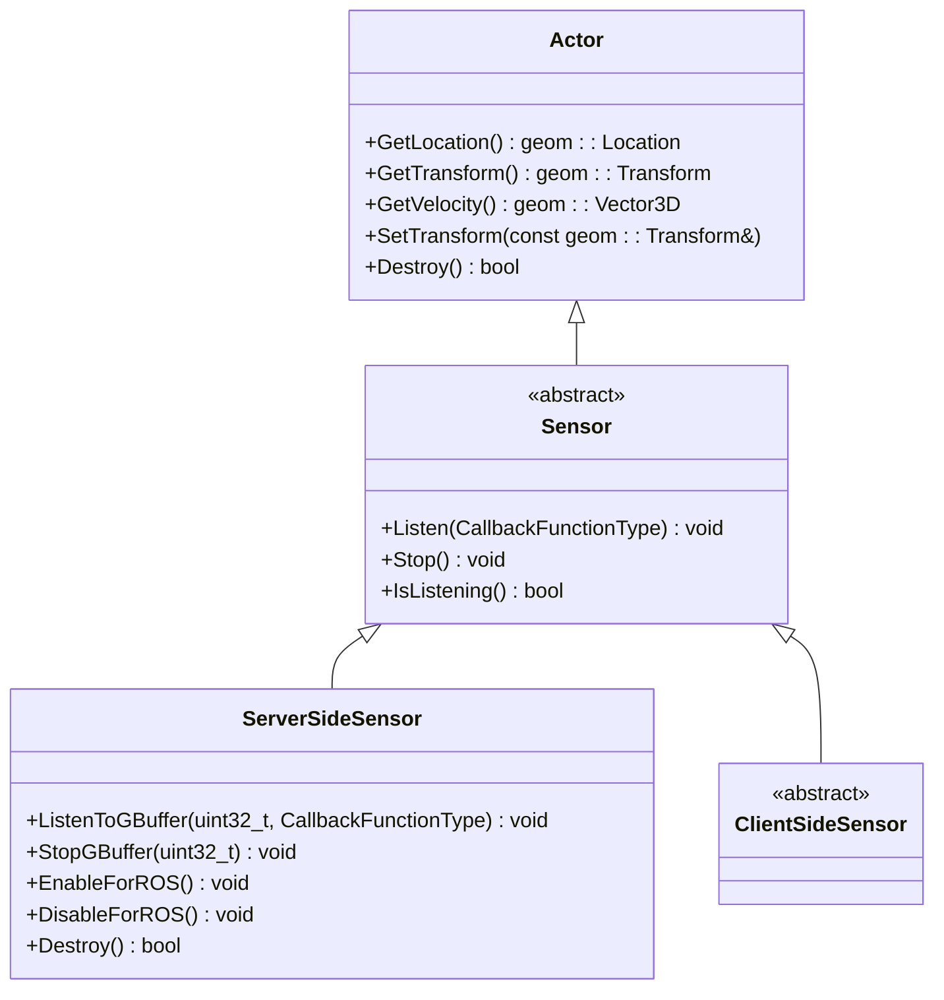
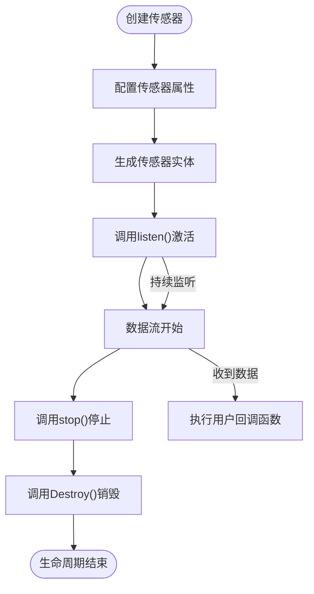
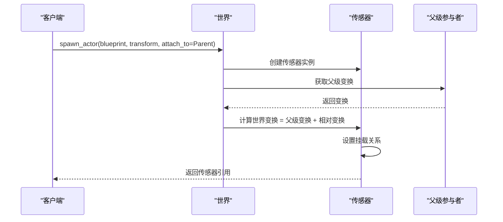
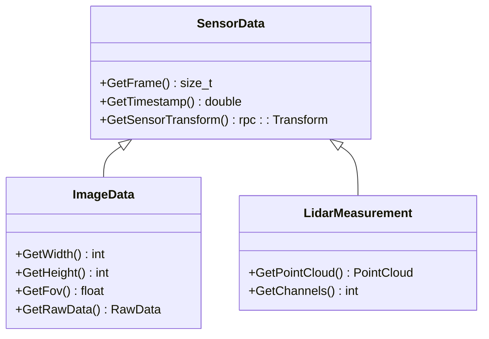

# 传感器基础

> **引用文件**
> **本文档引用的文件**

- [Sensor.h](https://github.com/carla-simulator/carla/blob/ue5-dev/LibCarla/source/carla/client/Sensor.h)
- [ServerSideSensor.h](https://github.com/carla-simulator/carla/blob/ue5-dev/LibCarla/source/carla/client/ServerSideSensor.h)
- [ServerSideSensor.cpp](https://github.com/carla-simulator/carla/blob/ue5-dev/LibCarla/source/carla/client/ServerSideSensor.cpp)
- [ClientSideSensor.h](https://github.com/carla-simulator/carla/blob/ue5-dev/LibCarla/source/carla/client/ClientSideSensor.h)
- [Actor.h](https://github.com/carla-simulator/carla/blob/ue5-dev/LibCarla/source/carla/client/Actor.h)
- [Sensor.cpp](https://github.com/carla-simulator/carla/blob/ue5-dev/PythonAPI/carla/src/Sensor.cpp)
- [SensorData.h](https://github.com/carla-simulator/carla/blob/ue5-dev/LibCarla/source/carla/sensor/SensorData.h)
- [Sensor.h](https://github.com/carla-simulator/carla/blob/ue5-dev/Unreal/CarlaUnreal/Plugins/Carla/Source/Carla/Sensor/Sensor.h)
- [SensorFactory.h](https://github.com/carla-simulator/carla/blob/ue5-dev/Unreal/CarlaUnreal/Plugins/Carla/Source/Carla/Sensor/SensorFactory.h)
- [ActorAttacher.cpp](https://github.com/carla-simulator/carla/blob/ue5-dev/Unreal/CarlaUnreal/Plugins/Carla/Source/Carla/Util/ActorAttacher.cpp)
- [core_sensors.md](https://github.com/carla-simulator/carla/blob/ue5-dev/Docs/core_sensors.md)
- [ref_sensors.md](https://github.com/carla-simulator/carla/blob/ue5-dev/Docs/ref_sensors.md)
- [sensor_synchronization.py](https://github.com/carla-simulator/carla/blob/ue5-dev/PythonAPI/examples/sensor_synchronization.py)

## 目录

1. [引言](#引言)
2. [传感器继承体系](#传感器继承体系)
3. [传感器生命周期管理](#传感器生命周期管理)
4. [传感器属性系统](#传感器属性系统)
5. [传感器变换与挂载机制](#传感器变换与挂载机制)
6. [传感器数据流与监听](#传感器数据流与监听)
7. [API 使用示例](#api使用示例)
8. [总结](#总结)

## 引言

传感器是 CARLA 模拟器中的核心组件，作为能够感知周围环境并生成数据的特殊类型参与者（Actor）。它们在自动驾驶代理的学习环境中起着至关重要的作用。本文档深入解释 CARLA 中传感器的通用属性和行为，详细阐述传感器继承自 Actor 类的设计原理，传感器变换（位置和旋转）的计算方法及其相对于父级车辆或角色的偏移机制，以及传感器的生命周期管理。

传感器通过蓝图（Blueprint）进行配置，可以测量各种物理属性，如位置、速度、碰撞等，并将数据流式传输给客户端进行处理。所有传感器都遵循相似的使用模式：设置、生成、监听和数据处理。

**Section sources**

- <a href="https://github.com/carla-simulator/carla/blob/ue5-dev/Docs/core_sensors.md#L1-L198" target="_blank">core_sensors.md</a>

## 传感器继承体系

在 CARLA 的架构中，所有传感器都继承自`Actor`类，这使得它们具有与车辆、行人等其他模拟实体相同的基本行为和属性。这种设计实现了代码的复用和统一的管理接口。

传感器的继承层次结构如下：

- `Actor`：所有模拟实体的基类，提供位置、变换、速度等基本功能。
- `Sensor`：从`Actor`派生，定义了传感器特有的接口，如`Listen`和`Stop`方法。
- `ServerSideSensor`和`ClientSideSensor`：`Sensor`的两个具体实现，分别代表在服务器端处理数据和在客户端处理数据的传感器。



**Diagram sources**

- <a href="https://github.com/carla-simulator/carla/blob/ue5-dev/LibCarla/source/carla/client/Actor.h#L17-L162" target="_blank">Actor.h</a>
- <a href="https://github.com/carla-simulator/carla/blob/ue5-dev/LibCarla/source/carla/client/Sensor.h#L17-L37" target="_blank">Sensor.h</a>
- <a href="https://github.com/carla-simulator/carla/blob/ue5-dev/LibCarla/source/carla/client/ServerSideSensor.h#L15-L71" target="_blank">ServerSideSensor.h</a>
- <a href="https://github.com/carla-simulator/carla/blob/ue5-dev/LibCarla/source/carla/client/ClientSideSensor.h#L14-L22" target="_blank">ClientSideSensor.h</a>

**Section sources**

- <a href="https://github.com/carla-simulator/carla/blob/ue5-dev/LibCarla/source/carla/client/Sensor.h#L17-L37" target="_blank">Sensor.h</a>
- <a href="https://github.com/carla-simulator/carla/blob/ue5-dev/LibCarla/source/carla/client/Actor.h#L17-L162" target="_blank">Actor.h</a>

## 传感器生命周期管理

传感器的生命周期包括创建、配置、激活和销毁四个主要阶段。每个阶段都有明确的 API 调用和内部处理逻辑。

### 创建与配置

传感器的创建始于从蓝图库中获取相应的蓝图，并设置其属性。这些属性决定了传感器的行为，如更新频率、分辨率等。

### 激活

通过调用`listen`方法激活传感器，开始接收数据。此时，传感器会向模拟器注册一个数据流，每当有新的测量数据时，就会调用用户提供的回调函数。

### 销毁

通过调用`Destroy`方法销毁传感器。在销毁之前，系统会自动停止所有监听，确保资源被正确释放。



**Diagram sources**

- <a href="https://github.com/carla-simulator/carla/blob/ue5-dev/LibCarla/source/carla/client/ServerSideSensor.cpp#L39-L106" target="_blank">ServerSideSensor.cpp</a>
- <a href="https://github.com/carla-simulator/carla/blob/ue5-dev/Docs/core_sensors.md#L19-L102" target="_blank">core_sensors.md</a>

**Section sources**

- <a href="https://github.com/carla-simulator/carla/blob/ue5-dev/LibCarla/source/carla/client/ServerSideSensor.cpp#L19-L110" target="_blank">ServerSideSensor.cpp</a>
- <a href="https://github.com/carla-simulator/carla/blob/ue5-dev/Docs/core_sensors.md#L19-L102" target="_blank">core_sensors.md</a>

## 传感器属性系统

传感器的属性系统通过蓝图（Blueprint）进行配置，允许用户在生成传感器之前设置其参数。这些属性包括更新频率、传感器位置、噪声模型等。

### 蓝图属性

蓝图属性是传感器的静态配置，决定了传感器的基本行为。例如，`sensor_tick`属性设置传感器的更新间隔，`image_size_x`和`image_size_y`设置相机的分辨率。

### 传感器属性

传感器属性是运行时的动态属性，可以通过 API 进行修改。例如，`is_listening`属性可以随时启用或禁用数据监听。

```mermaid
erDiagram
SENSOR ||--o{ BLUEPRINT : "has"
BLUEPRINT ||--o{ ATTRIBUTE : "has"
SENSOR ||--o{ DATA_STREAM : "produces"
class SENSOR {
id: string
is_listening: bool
transform: Transform
}
class BLUEPRINT {
id: string
attributes: Map<string, string>
}
class ATTRIBUTE {
name: string
type: string
default: string
description: string
}
class DATA_STREAM {
frame: int
timestamp: double
data: bytes
}
```

**Diagram sources**

- <a href="https://github.com/carla-simulator/carla/blob/ue5-dev/Docs/ref_sensors.md#L1-L200" target="_blank">ref_sensors.md</a>
- <a href="https://github.com/carla-simulator/carla/blob/ue5-dev/Docs/core_sensors.md#L29-L45" target="_blank">core_sensors.md</a>

**Section sources**

- <a href="https://github.com/carla-simulator/carla/blob/ue5-dev/Docs/ref_sensors.md#L1-L200" target="_blank">ref_sensors.md</a>
- <a href="https://github.com/carla-simulator/carla/blob/ue5-dev/Docs/core_sensors.md#L29-L45" target="_blank">core_sensors.md</a>

## 传感器变换与挂载机制

传感器的变换（Transform）计算是其核心功能之一，决定了传感器在世界坐标系中的位置和方向。传感器通常挂载在车辆或其他参与者上，其位置是相对于父级的偏移。

### 挂载类型

CARLA 支持三种主要的挂载类型：

- **刚性挂载（Rigid）**：传感器随父级严格移动，适用于数据采集。
- **弹簧臂挂载（SpringArm）**：移动时带有平滑的加减速，适用于录制视频。
- **幽灵弹簧臂挂载（SpringArmGhost）**：与 SpringArm 类似，但不进行碰撞检测。

### 变换计算

当传感器挂载到父级参与者时，其世界变换是通过父级的变换与相对变换的组合计算得出的。在代码层面，这通过`AttachToActor`方法实现。



**Diagram sources**

- <a href="https://github.com/carla-simulator/carla/blob/ue5-dev/Unreal/CarlaUnreal/Plugins/Carla/Source/Carla/Util/ActorAttacher.cpp#L95-L119" target="_blank">ActorAttacher.cpp</a>
- <a href="https://github.com/carla-simulator/carla/blob/ue5-dev/Docs/core_sensors.md#L48-L57" target="_blank">core_sensors.md</a>

**Section sources**

- <a href="https://github.com/carla-simulator/carla/blob/ue5-dev/Unreal/CarlaUnreal/Plugins/Carla/Source/Carla/Util/ActorAttacher.cpp#L95-L119" target="_blank">ActorAttacher.cpp</a>
- <a href="https://github.com/carla-simulator/carla/blob/ue5-dev/Docs/core_sensors.md#L48-L57" target="_blank">core_sensors.md</a>

## 传感器数据流与监听

传感器的数据流管理是其核心功能，通过`listen`方法注册回调函数来接收数据。数据流的建立和销毁由`ServerSideSensor`类管理。

### 数据流架构

传感器数据流采用发布-订阅模式。当客户端调用`listen`时，传感器会向模拟器的 episode 注册一个订阅，开始接收数据。数据通过流（Stream）传输，包含帧号、时间戳和传感器变换等元数据。

### 数据结构

所有传感器数据都继承自`SensorData`基类，包含通用的元数据：

- `frame`：数据生成时的帧号
- `timestamp`：模拟时间戳
- `sensor_transform`：传感器在测量时的变换



**Diagram sources**

- <a href="https://github.com/carla-simulator/carla/blob/ue5-dev/LibCarla/source/carla/sensor/SensorData.h#L19-L73" target="_blank">SensorData.h</a>
- <a href="https://github.com/carla-simulator/carla/blob/ue5-dev/LibCarla/source/carla/client/ServerSideSensor.cpp#L39-L56" target="_blank">ServerSideSensor.cpp</a>

**Section sources**

- <a href="https://github.com/carla-simulator/carla/blob/ue5-dev/LibCarla/source/carla/sensor/SensorData.h#L19-L73" target="_blank">SensorData.h</a>
- <a href="https://github.com/carla-simulator/carla/blob/ue5-dev/LibCarla/source/carla/client/ServerSideSensor.cpp#L39-L56" target="_blank">ServerSideSensor.cpp</a>

## API 使用示例

以下示例展示了如何使用 Python 和 C++ API 创建和配置基本传感器。

### Python API 示例

```python
# 查找传感器蓝图
blueprint = world.get_blueprint_library().find('sensor.camera.rgb')
# 配置传感器属性
blueprint.set_attribute('image_size_x', '1920')
blueprint.set_attribute('image_size_y', '1080')
blueprint.set_attribute('fov', '110')
blueprint.set_attribute('sensor_tick', '1.0')
# 生成传感器并挂载到车辆
transform = carla.Transform(carla.Location(x=0.8, z=1.7))
sensor = world.spawn_actor(blueprint, transform, attach_to=my_vehicle)
# 注册数据监听回调
sensor.listen(lambda data: do_something(data))
```

### C++ API 示例

```cpp
// 查找传感器蓝图
auto blueprint = world->GetBlueprintLibrary()->Find("sensor.camera.rgb");
// 配置传感器属性
blueprint->SetAttribute("image_size_x", "1920");
blueprint->SetAttribute("image_size_y", "1080");
blueprint->SetAttribute("fov", "110");
blueprint->SetAttribute("sensor_tick", "1.0");
// 生成传感器并挂载到车辆
FTransform transform;
transform.SetLocation(FVector(0.8, 0.0, 1.7));
auto sensor = world->SpawnActor<ASensor>(blueprint, transform, FActorSpawnParameters());
sensor->AttachToActor(parent_vehicle, FAttachmentTransformRules::KeepRelativeTransform);
// 注册数据监听回调
sensor->Listen([](TSharedPtr<FSensorData> data) {
    DoSomething(data);
});
```

**Section sources**

- <a href="https://github.com/carla-simulator/carla/blob/ue5-dev/PythonAPI/examples/sensor_synchronization.py#L1-L124" target="_blank">sensor_synchronization.py</a>
- <a href="https://github.com/carla-simulator/carla/blob/ue5-dev/PythonAPI/carla/src/Sensor.cpp#L1-L54" target="_blank">Sensor.cpp</a>

## 总结

CARLA 的传感器系统是一个精心设计的组件，通过继承 Actor 类实现了与模拟环境的无缝集成。传感器的生命周期管理、属性系统、变换计算和数据流架构共同构成了一个强大而灵活的感知框架。通过理解这些核心概念，开发者可以有效地创建和配置各种传感器，为自动驾驶研究和开发提供高质量的模拟数据。

**Section sources**

- <a href="https://github.com/carla-simulator/carla/blob/ue5-dev/Docs/core_sensors.md#L160-L198" target="_blank">core_sensors.md</a>
- <a href="https://github.com/carla-simulator/carla/blob/ue5-dev/Docs/ref_sensors.md#L1-L200" target="_blank">ref_sensors.md</a>
