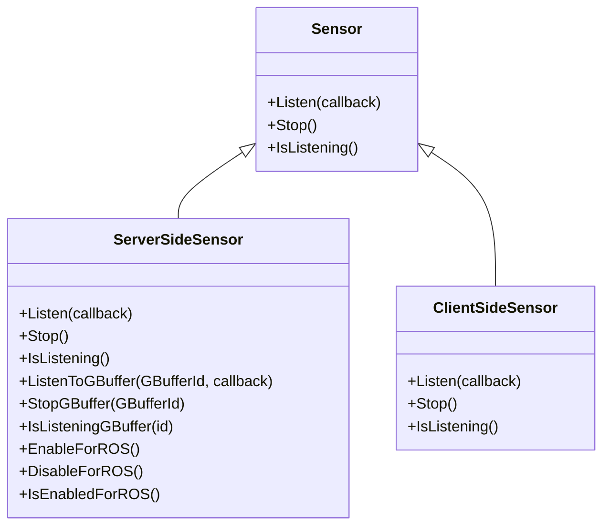
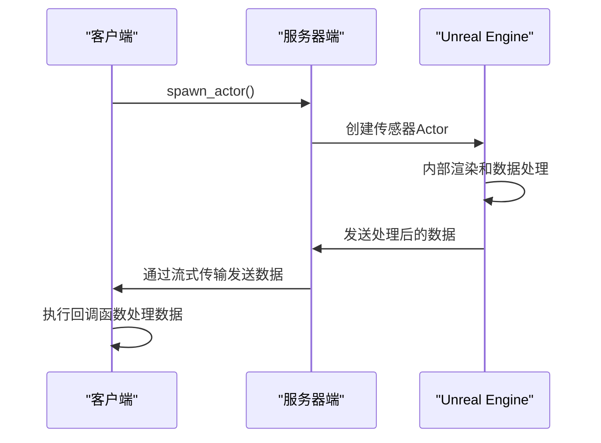
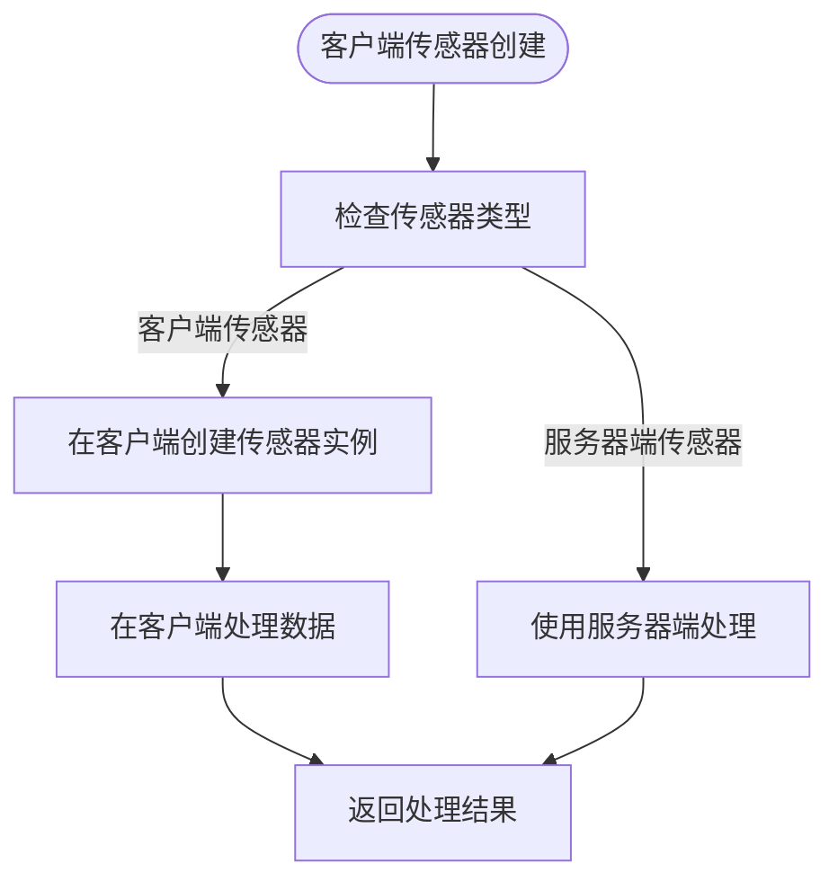
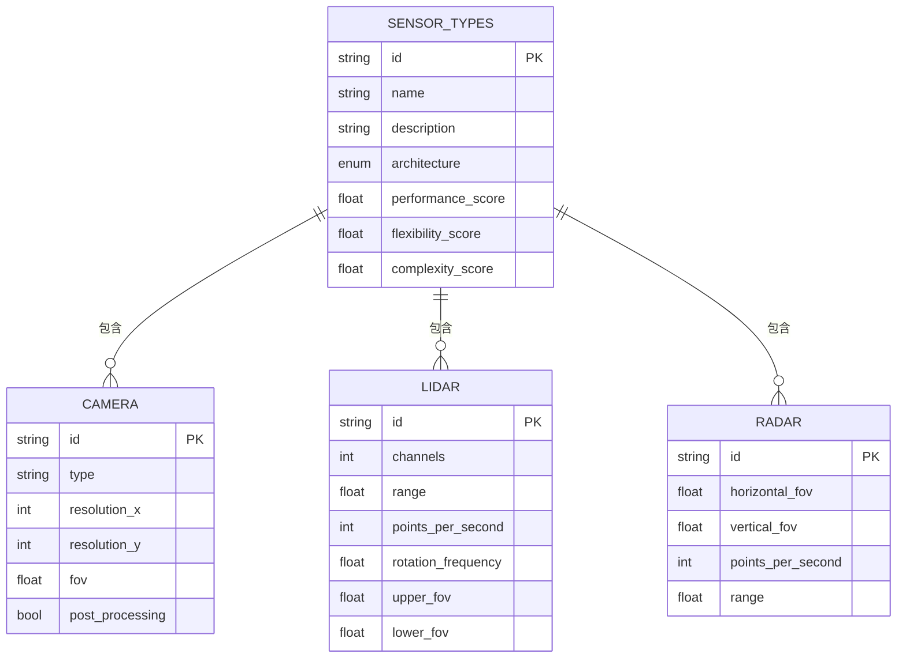
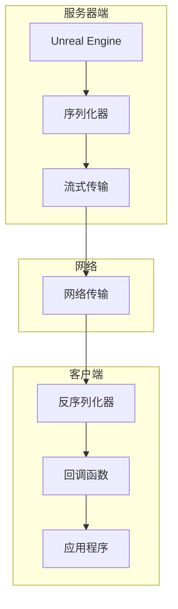

# 传感器类型

> **引用文件**
> **本文档中引用的文件**

- [ServerSideSensor.h](https://github.com/carla-simulator/carla/blob/ue5-dev/LibCarla/source/carla/client/ServerSideSensor.h)
- [ServerSideSensor.cpp](https://github.com/carla-simulator/carla/blob/ue5-dev/LibCarla/source/carla/client/ServerSideSensor.cpp)
- [ClientSideSensor.h](https://github.com/carla-simulator/carla/blob/ue5-dev/LibCarla/source/carla/client/ClientSideSensor.h)
- [Sensor.h](https://github.com/carla-simulator/carla/blob/ue5-dev/LibCarla/source/carla/client/Sensor.h)
- [core_sensors.md](https://github.com/carla-simulator/carla/blob/ue5-dev/Docs/core_sensors.md)
- [ref_sensors.md](https://github.com/carla-simulator/carla/blob/ue5-dev/Docs/ref_sensors.md)
- [SensorRegistry.h](https://github.com/carla-simulator/carla/blob/ue5-dev/LibCarla/source/carla/sensor/SensorRegistry.h)
- [NormalsCamera.h](https://github.com/carla-simulator/carla/blob/ue5-dev/Unreal/CarlaUnreal/Plugins/Carla/Source/Carla/Sensor/NormalsCamera.h)
- [RayCastSemanticLidar.cpp](https://github.com/carla-simulator/carla/blob/ue5-dev/Unreal/CarlaUnreal/Plugins/Carla/Source/Carla/Sensor/RayCastSemanticLidar.cpp)
- [RadarData.h](https://github.com/carla-simulator/carla/blob/ue5-dev/LibCarla/source/carla/sensor/data/RadarData.h)
- [RadarMeasurement.h](https://github.com/carla-simulator/carla/blob/ue5-dev/LibCarla/source/carla/sensor/data/RadarMeasurement.h)

## 目录

1. [引言](#引言)
2. [传感器架构设计](#传感器架构设计)
3. [服务器端传感器实现](#服务器端传感器实现)
4. [客户端传感器实现](#客户端传感器实现)
5. [传感器类型与性能特征](#传感器类型与性能特征)
6. [数据流与序列化机制](#数据流与序列化机制)
7. [传感器选择决策指南](#传感器选择决策指南)
8. [结论](#结论)

## 引言

CARLA 仿真平台提供了两种主要的传感器架构：服务器端传感器（ServerSideSensor）和客户端传感器（ClientSideSensor）。这两种架构在数据处理、性能特征和使用场景上存在显著差异。服务器端传感器在 Unreal Engine 内部直接渲染和处理数据，提供更高的性能和保真度；而客户端传感器通过网络传输原始渲染数据并在客户端进行处理，提供更大的灵活性和自定义能力。本文档将系统性地比较和对比这两种架构的设计差异，并详细说明不同类型传感器的具体实现机制和性能特征。

## 传感器架构设计

**图表来源**

- <a href="https://github.com/carla-simulator/carla/blob/ue5-dev/LibCarla/source/carla/client/ServerSideSensor.h#L15-L67" target="_blank">ServerSideSensor.h</a>
- <a href="https://github.com/carla-simulator/carla/blob/ue5-dev/LibCarla/source/carla/client/ClientSideSensor.h#L14-L18" target="_blank">ClientSideSensor.h</a>
- <a href="https://github.com/carla-simulator/carla/blob/ue5-dev/LibCarla/source/carla/client/Sensor.h#L17-L33" target="_blank">Sensor.h</a>

CARLA 传感器系统基于继承层次结构设计，所有传感器都继承自基类 Sensor。ServerSideSensor 和 ClientSideSensor 是 Sensor 的两个主要子类，分别代表服务器端和客户端传感器架构。这种设计模式允许统一的接口调用，同时为不同类型的传感器提供特定的功能扩展。

**章节来源**

- <a href="https://github.com/carla-simulator/carla/blob/ue5-dev/LibCarla/source/carla/client/ServerSideSensor.h#L15-L67" target="_blank">ServerSideSensor.h</a>
- <a href="https://github.com/carla-simulator/carla/blob/ue5-dev/LibCarla/source/carla/client/ClientSideSensor.h#L14-L18" target="_blank">ClientSideSensor.h</a>

## 服务器端传感器实现

**图表来源**

- <a href="https://github.com/carla-simulator/carla/blob/ue5-dev/LibCarla/source/carla/client/ServerSideSensor.cpp#L39-L43" target="_blank">ServerSideSensor.cpp</a>
- <a href="https://github.com/carla-simulator/carla/blob/ue5-dev/Unreal/CarlaUnreal/Plugins/Carla/Source/Carla/Sensor/RayCastSemanticLidar.cpp#L73-L82" target="_blank">RayCastSemanticLidar.cpp</a>

服务器端传感器在 Unreal Engine 内部直接进行数据渲染和处理。当客户端调用`Listen()`方法时，服务器会在 Unreal Engine 中订阅传感器数据流。传感器数据在服务器端经过完整的渲染管线处理，包括几何计算、光照模型和后期处理效果，然后通过流式传输协议发送给客户端。这种方式提供了更高的性能和保真度，因为数据处理完全在服务器端完成，减少了网络传输的数据量。

ServerSideSensor 类实现了`Listen()`、`Stop()`和`IsListening()`等核心方法。`Listen()`方法通过`GetEpisode().Lock()->SubscribeToSensor()`在服务器端订阅传感器数据流，并设置监听掩码。对于特定类型的传感器（如 RGB 相机），还提供了`ListenToGBuffer()`方法来订阅 GBuffer 数据流，这允许访问渲染管线中的中间缓冲区数据。

**章节来源**

- <a href="https://github.com/carla-simulator/carla/blob/ue5-dev/LibCarla/source/carla/client/ServerSideSensor.h#L22-L38" target="_blank">ServerSideSensor.h</a>
- <a href="https://github.com/carla-simulator/carla/blob/ue5-dev/LibCarla/source/carla/client/ServerSideSensor.cpp#L39-L43" target="_blank">ServerSideSensor.cpp</a>

## 客户端传感器实现

**图表来源**

- <a href="https://github.com/carla-simulator/carla/blob/ue5-dev/LibCarla/source/carla/client/ClientSideSensor.h#L14-L18" target="_blank">ClientSideSensor.h</a>
- [ref_sensors.md](https://github.com/carla-simulator/carla/blob/ue5-dev/Docs/ref_sensors.md#lane-invasion-detector)

客户端传感器架构主要用于那些不需要在服务器端进行复杂数据处理的传感器类型。如文档中提到的车道入侵检测器（LaneInvasionDetector），它被明确标记为"在客户端完全工作"。这类传感器的数据处理逻辑在客户端实现，服务器端仅提供必要的原始数据或状态信息。这种架构提供了更大的灵活性和自定义能力，因为用户可以在客户端实现自己的数据处理算法。

ClientSideSensor 类相对简单，主要继承了 Sensor 基类的功能，没有添加额外的服务器端处理方法。这表明客户端传感器的设计重点在于轻量级和灵活性，适用于那些计算成本较低或需要高度定制化处理的传感器类型。

**章节来源**

- <a href="https://github.com/carla-simulator/carla/blob/ue5-dev/LibCarla/source/carla/client/ClientSideSensor.h#L14-L18" target="_blank">ClientSideSensor.h</a>
- [ref_sensors.md](https://github.com/carla-simulator/carla/blob/ue5-dev/Docs/ref_sensors.md#lane-invasion-detector)

## 传感器类型与性能特征

**图表来源**

- [ref_sensors.md](https://github.com/carla-simulator/carla/blob/ue5-dev/Docs/ref_sensors.md#rgb-camera)
- [ref_sensors.md](https://github.com/carla-simulator/carla/blob/ue5-dev/Docs/ref_sensors.md#lidar-sensor)
- [ref_sensors.md](https://github.com/carla-simulator/carla/blob/ue5-dev/Docs/ref_sensors.md#radar-sensor)

CARLA 平台支持多种类型的传感器，每种传感器都有其特定的实现机制和性能特征。摄像头传感器（如 RGB、深度、语义分割等）基于 Unreal Engine 的渲染管线实现，提供高保真的视觉数据。激光雷达（LIDAR）传感器通过光线投射（ray-casting）技术模拟旋转激光扫描，生成三维点云数据。雷达（Radar）传感器则创建一个锥形视图，生成二维点图表示视野内的元素及其相对于传感器的运动。

不同传感器的性能特征差异显著。服务器端传感器如 LIDAR 和 Radar 提供了高精度的物理模拟，但计算成本较高。客户端传感器如车道入侵检测器虽然功能简单，但提供了极低的延迟和高度的可定制性。选择合适的传感器类型需要在精度、性能和使用复杂度之间进行权衡。

**章节来源**

- [ref_sensors.md](https://github.com/carla-simulator/carla/blob/ue5-dev/Docs/ref_sensors.md#rgb-camera)
- [ref_sensors.md](https://github.com/carla-simulator/carla/blob/ue5-dev/Docs/ref_sensors.md#lidar-sensor)
- [ref_sensors.md](https://github.com/carla-simulator/carla/blob/ue5-dev/Docs/ref_sensors.md#radar-sensor)

## 数据流与序列化机制

**图表来源**

- <a href="https://github.com/carla-simulator/carla/blob/ue5-dev/LibCarla/source/carla/sensor/SensorRegistry.h#L57-L83" target="_blank">SensorRegistry.h</a>
- <a href="https://github.com/carla-simulator/carla/blob/ue5-dev/LibCarla/source/carla/sensor/Deserializer.cpp#L14-L15" target="_blank">Deserializer.cpp</a>

CARLA 传感器系统的数据流涉及复杂的序列化和反序列化机制。服务器端通过 SensorRegistry 注册所有可用的传感器类型及其对应的序列化器。当传感器数据生成时，相应的序列化器将数据转换为二进制格式，通过流式传输协议发送到客户端。客户端接收到数据后，使用 Deserializer 进行反序列化，恢复为相应的 SensorData 对象，并调用用户注册的回调函数进行处理。

这种机制确保了不同类型传感器数据的一致性和高效传输。例如，IMU 传感器使用 IMUSerializer 进行序列化，GNSS 传感器使用 GnssSerializer，而 LIDAR 传感器使用 LidarSerializer。NoopSerializer 用于那些不发送数据的客户端传感器，如车道入侵检测器。

**章节来源**

- <a href="https://github.com/carla-simulator/carla/blob/ue5-dev/LibCarla/source/carla/sensor/SensorRegistry.h#L57-L83" target="_blank">SensorRegistry.h</a>
- <a href="https://github.com/carla-simulator/carla/blob/ue5-dev/LibCarla/source/carla/sensor/Deserializer.cpp#L14-L15" target="_blank">Deserializer.cpp</a>

## 传感器选择决策指南

| 传感器类型     | 精度 | 性能 | 使用复杂度 | 适用场景                                 |
| -------------- | ---- | ---- | ---------- | ---------------------------------------- |
| 服务器端传感器 | 高   | 中等 | 低         | 需要高保真数据的场景，如深度学习训练     |
| 客户端传感器   | 中等 | 高   | 高         | 需要高度定制化处理的场景，如特定算法验证 |
| 摄像头传感器   | 高   | 中等 | 低         | 视觉感知、目标检测                       |
| 激光雷达传感器 | 高   | 低   | 中等       | 三维环境感知、点云处理                   |
| 雷达传感器     | 中等 | 高   | 低         | 运动检测、速度测量                       |

选择合适的传感器类型需要综合考虑多个因素。对于需要高精度和高保真度的应用，如自动驾驶系统的深度学习训练，推荐使用服务器端传感器。这些传感器在 Unreal Engine 内部直接渲染和处理数据，提供了最接近真实世界的模拟效果。对于需要低延迟和高度定制化的应用，如特定算法的验证和测试，客户端传感器可能是更好的选择。

在具体传感器类型的选择上，摄像头传感器适合视觉感知任务，提供了丰富的纹理和颜色信息；激光雷达传感器适合三维环境感知，提供了精确的几何信息；雷达传感器适合运动检测，能够测量物体的速度和方向。用户应根据具体的应用需求和性能要求，选择最合适的传感器类型和架构。

**章节来源**

- [core_sensors.md](https://github.com/carla-simulator/carla/blob/ue5-dev/Docs/core_sensors.md#types-of-sensors)
- [ref_sensors.md](https://github.com/carla-simulator/carla/blob/ue5-dev/Docs/ref_sensors.md#sensors-reference)

## 结论

CARLA 平台的传感器系统通过服务器端传感器和客户端传感器两种架构，提供了灵活而强大的数据采集能力。服务器端传感器在 Unreal Engine 内部直接渲染和处理数据，提供了高保真度和高性能的模拟效果，适用于需要高质量数据的深度学习训练等场景。客户端传感器通过网络传输原始数据并在客户端处理，提供了更大的灵活性和自定义能力，适用于需要特定算法验证的场景。

不同类型的传感器（如摄像头、激光雷达、雷达等）具有各自独特的实现机制和性能特征。用户在选择传感器时，需要在精度、性能和使用复杂度之间进行权衡，根据具体的应用需求选择最合适的传感器类型和架构。通过深入理解这些传感器的设计差异和适用场景，用户可以更有效地利用 CARLA 平台进行自动驾驶系统的研究和开发。
