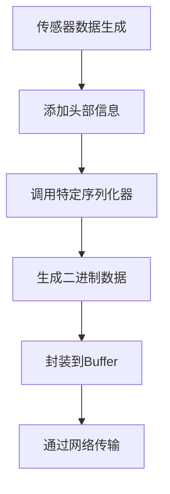
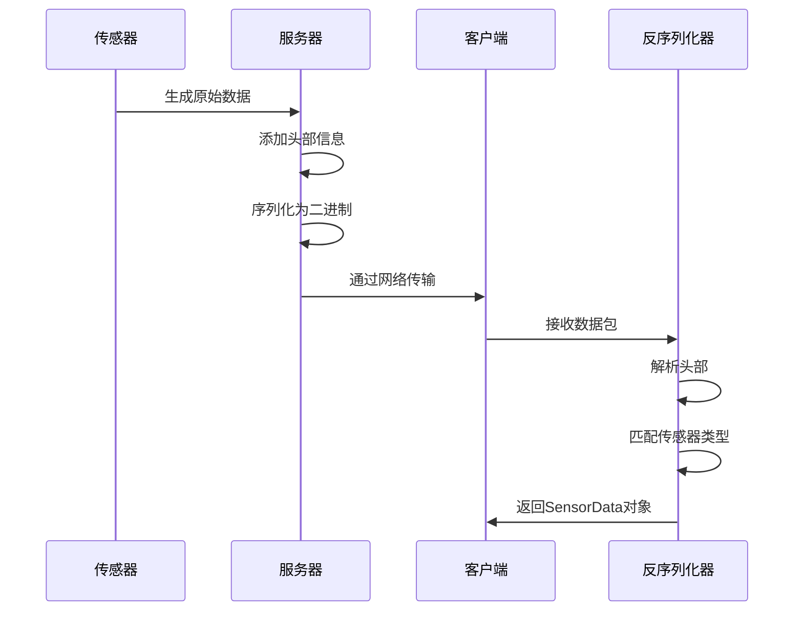
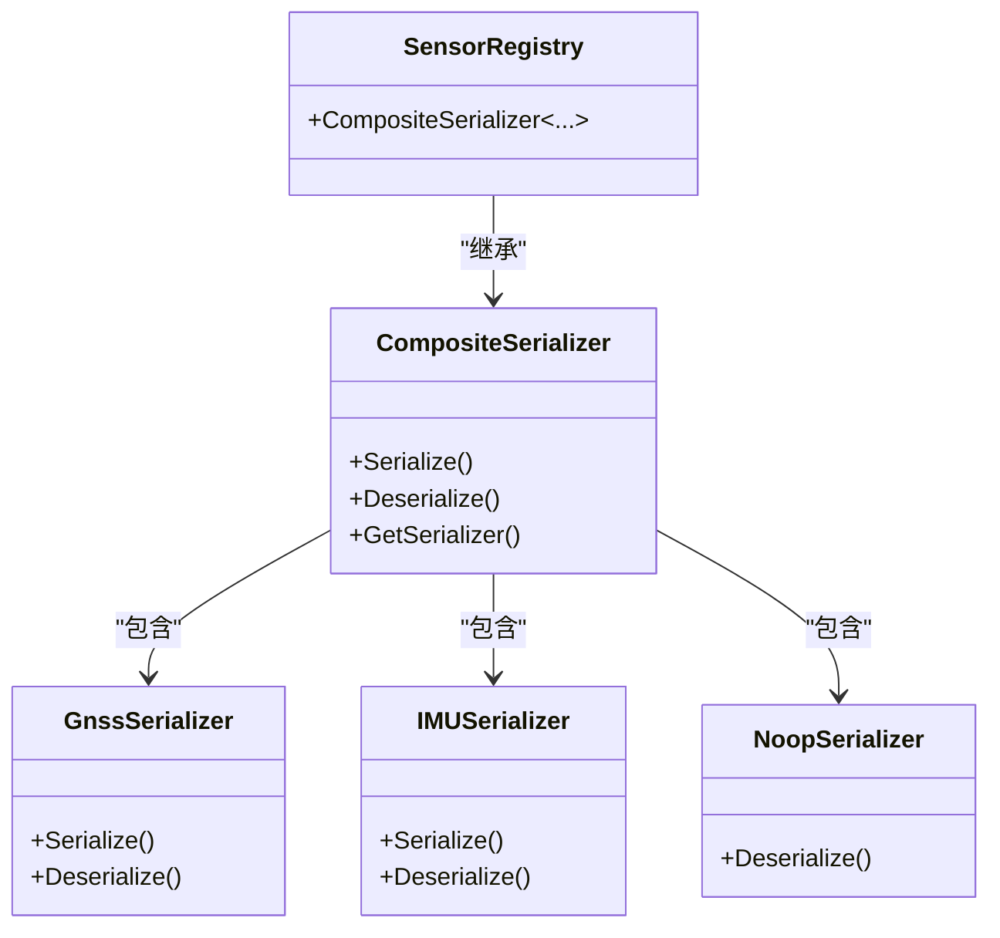
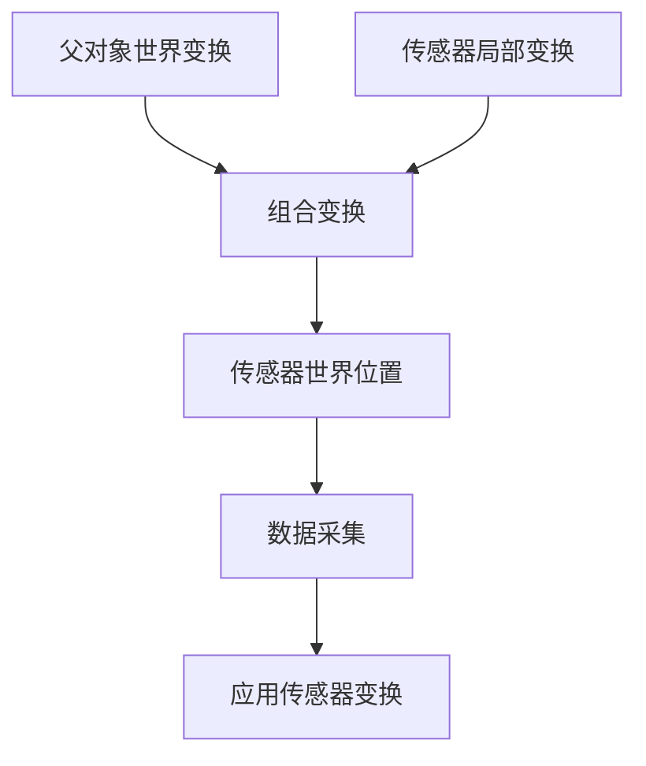

# 传感器系统

> **引用文件**
> **本文档中引用的文件**

- [Sensor.h](https://github.com/carla-simulator/carla/blob/ue5-dev/LibCarla/source/carla/client/Sensor.h)
- [ServerSideSensor.h](https://github.com/carla-simulator/carla/blob/ue5-dev/LibCarla/source/carla/client/ServerSideSensor.h)
- [ServerSideSensor.cpp](https://github.com/carla-simulator/carla/blob/ue5-dev/LibCarla/source/carla/client/ServerSideSensor.cpp)
- [ClientSideSensor.h](https://github.com/carla-simulator/carla/blob/ue5-dev/LibCarla/source/carla/client/ClientSideSensor.h)
- [SensorRegistry.h](https://github.com/carla-simulator/carla/blob/ue5-dev/LibCarla/source/carla/sensor/SensorRegistry.h)
- [CompositeSerializer.h](https://github.com/carla-simulator/carla/blob/ue5-dev/LibCarla/source/carla/sensor/CompositeSerializer.h)
- [Deserializer.h](https://github.com/carla-simulator/carla/blob/ue5-dev/LibCarla/source/carla/sensor/Deserializer.h)
- [RawData.h](https://github.com/carla-simulator/carla/blob/ue5-dev/LibCarla/source/carla/sensor/RawData.h)
- [SensorHeaderSerializer.h](https://github.com/carla-simulator/carla/blob/ue5-dev/LibCarla/source/carla/sensor/s11n/SensorHeaderSerializer.h)
- [Simulator.h](https://github.com/carla-simulator/carla/blob/ue5-dev/LibCarla/source/carla/client/detail/Simulator.h)

## 目录

1. [引言](#引言)
2. [传感器类型对比](#传感器类型对比)
3. [传感器数据流处理机制](#传感器数据流处理机制)
4. [SensorRegistry 管理机制](#sensorregistry管理机制)
5. [传感器挂载与变换偏移](#传感器挂载与变换偏移)
6. [传感器配置与使用示例](#传感器配置与使用示例)

## 引言

CARLA 仿真平台提供了完整的传感器系统，支持在自动驾驶和机器人应用中模拟各种传感器行为。本系统基于客户端-服务器架构，通过精心设计的继承体系和序列化机制，实现了高性能的数据采集和传输。传感器系统不仅支持多种物理传感器的模拟，还提供了灵活的扩展机制，允许用户自定义传感器类型和数据处理流程。

## 传感器类型对比

CARLA 中的传感器主要分为两种类型：服务器端传感器（ServerSideSensor）和客户端传感器（ClientSideSensor），它们在性能、功能和使用场景上有着显著的区别。

### 服务器端传感器

服务器端传感器在仿真服务器端运行，直接与 Unreal Engine 的渲染和物理引擎交互，具有以下特点：

- **性能优势**：由于在服务器端直接生成数据，避免了复杂的客户端计算，能够提供高帧率和低延迟的数据流
- **数据完整性**：可以直接访问渲染管线的原始数据，包括深度、法线、语义分割等高级渲染信息
- **多客户端共享**：多个客户端可以同时订阅同一个服务器端传感器的数据流
- **资源效率**：传感器的计算负载由服务器承担，减轻了客户端的计算压力

服务器端传感器通过`ServerSideSensor`类实现，继承自`Sensor`基类。它维护一个位掩码（listening_mask）来跟踪当前的监听状态，并提供了`Listen()`和`Stop()`方法来管理数据流的订阅。

### 客户端传感器

客户端传感器在客户端运行，主要依赖于从服务器获取的数据进行二次处理，具有以下特点：

- **灵活性**：可以在客户端实现复杂的后处理逻辑，如数据融合、特征提取等
- **定制化**：易于扩展和修改，适合实验性的传感器算法开发
- **独立性**：不依赖服务器的特定实现，可以在不同的仿真环境中复用

客户端传感器通过`ClientSideSensor`类实现，同样继承自`Sensor`基类，但其数据处理逻辑完全在客户端完成。

### 适用场景对比

| 特性         | 服务器端传感器     | 客户端传感器         |
| ------------ | ------------------ | -------------------- |
| **性能**     | 高性能，低延迟     | 受客户端计算能力限制 |
| **数据质量** | 原始、高质量       | 依赖于输入数据质量   |
| **扩展性**   | 需要修改服务器代码 | 易于在客户端扩展     |
| **资源占用** | 服务器资源占用高   | 客户端资源占用高     |
| **适用场景** | 实时感知、生产环境 | 算法研究、原型开发   |

**Section sources**

- <a href="https://github.com/carla-simulator/carla/blob/ue5-dev/LibCarla/source/carla/client/Sensor.h#L17-L36" target="_blank">Sensor.h</a>
- <a href="https://github.com/carla-simulator/carla/blob/ue5-dev/LibCarla/source/carla/client/ServerSideSensor.h#L15-L70" target="_blank">ServerSideSensor.h</a>
- <a href="https://github.com/carla-simulator/carla/blob/ue5-dev/LibCarla/source/carla/client/ClientSideSensor.h#L14-L18" target="_blank">ClientSideSensor.h</a>

## 传感器数据流处理机制

CARLA 传感器系统的数据流处理机制设计精巧，涵盖了从数据生成、序列化、传输到反序列化的完整流程。

### 数据序列化过程

传感器数据的序列化由`CompositeSerializer`模板类管理，该类通过编译时类型映射将不同类型的传感器与其对应的序列化器关联起来。序列化过程包含以下步骤：

1. **头部信息添加**：每个传感器数据包都包含一个标准化的头部，包含传感器类型 ID、帧号、时间戳和传感器变换信息
2. **数据体序列化**：根据传感器类型调用相应的序列化器将原始数据转换为二进制格式
3. **缓冲区封装**：将序列化后的数据封装到`Buffer`对象中，准备传输



**Diagram sources**

- <a href="https://github.com/carla-simulator/carla/blob/ue5-dev/LibCarla/source/carla/sensor/s11n/SensorHeaderSerializer.h#L16-L43" target="_blank">SensorHeaderSerializer.h</a>
- <a href="https://github.com/carla-simulator/carla/blob/ue5-dev/LibCarla/source/carla/sensor/CompositeSerializer.h#L23-L95" target="_blank">CompositeSerializer.h</a>

### 数据传输机制

数据传输通过 CARLA 的客户端-服务器架构实现，具体流程如下：

1. 客户端通过`Listen()`方法订阅传感器数据
2. 服务器端的`Simulator`对象管理订阅关系
3. 每当传感器生成新数据时，通过流式传输机制发送到所有订阅的客户端
4. 数据传输支持多种模式，包括常规传感器数据流和 GBuffer 数据流

### 数据反序列化过程

接收到的数据通过`Deserializer`类进行反序列化，具体步骤包括：

1. **头部解析**：从数据包中提取头部信息，确定传感器类型
2. **类型匹配**：通过`SensorRegistry`查找对应的反序列化器
3. **数据重建**：调用相应的反序列化器将二进制数据转换为可用的对象



**Diagram sources**

- <a href="https://github.com/carla-simulator/carla/blob/ue5-dev/LibCarla/source/carla/sensor/RawData.h#L19-L100" target="_blank">RawData.h</a>
- <a href="https://github.com/carla-simulator/carla/blob/ue5-dev/LibCarla/source/carla/sensor/Deserializer.h#L17-L28" target="_blank">Deserializer.h</a>
- <a href="https://github.com/carla-simulator/carla/blob/ue5-dev/LibCarla/source/carla/client/ServerSideSensor.cpp#L39-L43" target="_blank">ServerSideSensor.cpp</a>

## SensorRegistry 管理机制

`SensorRegistry`是 CARLA 传感器系统的核心组件，负责管理所有传感器类型的序列化和反序列化过程。

### 注册机制

`SensorRegistry`采用编译时注册机制，通过模板特化将传感器类型与其序列化器关联。注册过程遵循四个步骤：

1. **包含序列化器头文件**：在`SensorRegistry.h`中包含所有需要的序列化器头文件
2. **前向声明传感器类**：声明所有支持的传感器类
3. **注册传感器-序列化器对**：在`CompositeSerializer`模板参数中注册传感器和序列化器的配对
4. **包含传感器实现文件**：在条件编译块中包含传感器的实际实现文件



**Diagram sources**

- <a href="https://github.com/carla-simulator/carla/blob/ue5-dev/LibCarla/source/carla/sensor/SensorRegistry.h#L57-L83" target="_blank">SensorRegistry.h</a>
- <a href="https://github.com/carla-simulator/carla/blob/ue5-dev/LibCarla/source/carla/sensor/CompositeSerializer.h#L23-L95" target="_blank">CompositeSerializer.h</a>

### 编译时类型映射

`SensorRegistry`基于`CompileTimeTypeMap`实现编译时类型映射，这种设计具有以下优势：

- **零运行时开销**：类型查找在编译时完成，无需运行时的哈希表查找
- **类型安全**：编译器可以验证所有注册的传感器类型
- **高效性能**：通过模板递归实现，生成的代码经过优化后具有跳转表的性能

`CompileTimeTypeMap`使用递归模板技术，为每个传感器-序列化器对生成唯一的索引，确保在运行时能够快速定位到正确的序列化器。

### 特殊序列化器

系统提供了几种特殊的序列化器以满足不同需求：

- **NoopSerializer**：用于客户端传感器，这些传感器不发送数据到服务器
- **GBuffer 序列化器**：用于处理渲染管线的 GBuffer 数据
- **消息包序列化器**：使用 MessagePack 格式进行高效的数据序列化

**Section sources**

- <a href="https://github.com/carla-simulator/carla/blob/ue5-dev/LibCarla/source/carla/sensor/SensorRegistry.h#L1-L112" target="_blank">SensorRegistry.h</a>
- <a href="https://github.com/carla-simulator/carla/blob/ue5-dev/LibCarla/source/carla/sensor/CompositeSerializer.h#L17-L95" target="_blank">CompositeSerializer.h</a>
- <a href="https://github.com/carla-simulator/carla/blob/ue5-dev/LibCarla/source/carla/sensor/CompileTimeTypeMap.h#L79-L104" target="_blank">CompileTimeTypeMap.h</a>

## 传感器挂载与变换偏移

传感器挂载机制是 CARLA 传感器系统的重要组成部分，它决定了传感器在仿真环境中的位置和方向。

### 挂载机制

传感器通过`SpawnActor`方法附加到车辆或其他角色上，挂载过程包括：

1. **创建传感器蓝图**：定义传感器的类型和初始属性
2. **指定挂载变换**：设置传感器相对于父对象的变换（位置和旋转）
3. **执行挂载**：将传感器作为子对象附加到指定的父角色上

挂载变换使用`Transform`类表示，包含`Location`和`Rotation`两个主要组件。`Location`定义了传感器在父对象坐标系中的偏移，`Rotation`定义了传感器的朝向。

### 变换偏移计算

变换偏移的计算涉及坐标系的转换，CARLA 使用右手坐标系，其中：

- X 轴指向前进方向
- Y 轴指向右侧
- Z 轴指向上方

当传感器挂载到移动的车辆上时，其世界坐标需要通过以下公式计算：

```
世界坐标 = 父对象世界变换 × 传感器局部变换
```

这个计算在引擎内部自动完成，确保传感器能够正确地跟随父对象移动。



**Diagram sources**

- <a href="https://github.com/carla-simulator/carla/blob/ue5-dev/LibCarla/source/carla/geom/Transform.h#L46-L115" target="_blank">Transform.h</a>
- <a href="https://github.com/carla-simulator/carla/blob/ue5-dev/LibCarla/source/carla/geom/Rotation.h#L94-L126" target="_blank">Rotation.h</a>

### 挂载示例

常见的传感器挂载配置包括：

- **前向摄像头**：安装在车辆前部，朝向正前方，用于车道检测和物体识别
- **环视摄像头**：多个摄像头分布在车辆四周，提供 360 度视野
- **激光雷达**：安装在车顶，提供高精度的 3D 环境感知
- **IMU**：安装在车辆重心附近，用于测量加速度和角速度

每种挂载配置都需要精确的变换偏移设置，以确保传感器数据的准确性和一致性。

**Section sources**

- <a href="https://github.com/carla-simulator/carla/blob/ue5-dev/LibCarla/source/carla/client/detail/Simulator.h#L363-L368" target="_blank">Simulator.h</a>
- <a href="https://github.com/carla-simulator/carla/blob/ue5-dev/LibCarla/source/carla/geom/Transform.h#L66-L86" target="_blank">Transform.h</a>

## 传感器配置与使用示例

本节提供传感器配置和使用的代码示例，展示如何在 CARLA 中配置各种传感器参数、订阅数据流以及处理不同类型的数据包。

### 传感器配置

传感器的配置通过蓝图系统完成，可以设置各种参数，如：

- **基本参数**：传感器 ID、标签、附加类型
- **位置参数**：相对于父对象的 X、Y、Z 坐标
- **旋转参数**：偏航角、俯仰角、翻滚角
- **传感器特定参数**：如摄像头的视野、分辨率，雷达的探测范围等

### 数据订阅

通过`Listen()`方法订阅传感器数据，该方法接受一个回调函数作为参数，每当有新数据到达时，回调函数就会被调用。

### 数据处理

接收到的数据通过`SensorData`对象传递，不同类型的数据包具有不同的结构和访问方法。处理流程通常包括：

1. **数据类型检查**：确定接收到的数据包类型
2. **数据提取**：从数据包中提取有用的信息
3. **数据处理**：对提取的数据进行进一步处理或分析
4. **资源清理**：确保及时释放不再需要的资源

虽然不提供具体的代码内容，但可以通过上述文件路径了解完整的实现细节和使用方法。

**Section sources**

- <a href="https://github.com/carla-simulator/carla/blob/ue5-dev/LibCarla/source/carla/client/ServerSideSensor.h#L29-L32" target="_blank">ServerSideSensor.h</a>
- <a href="https://github.com/carla-simulator/carla/blob/ue5-dev/LibCarla/source/carla/client/Sensor.h#L26-L29" target="_blank">Sensor.h</a>
- <a href="https://github.com/carla-simulator/carla/blob/ue5-dev/LibCarla/source/carla/client/detail/Simulator.h#L662-L665" target="_blank">Simulator.h</a>
