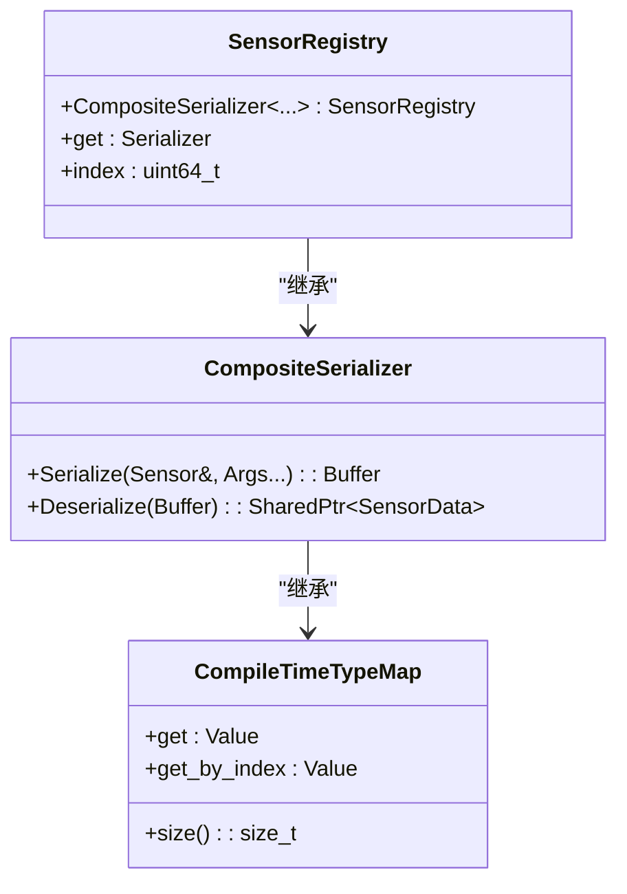
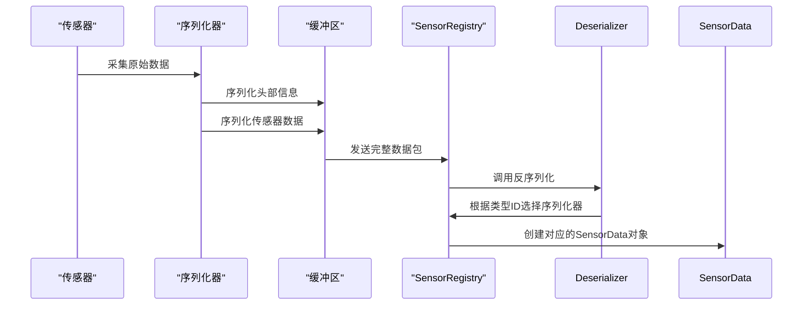
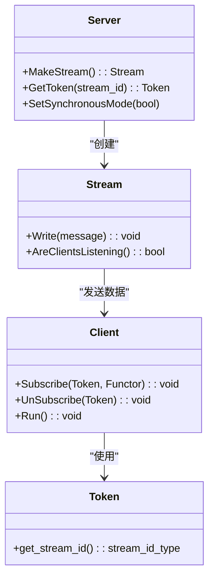
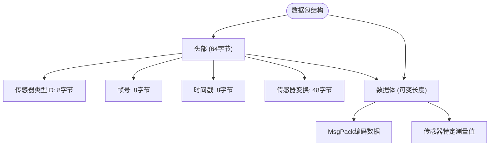
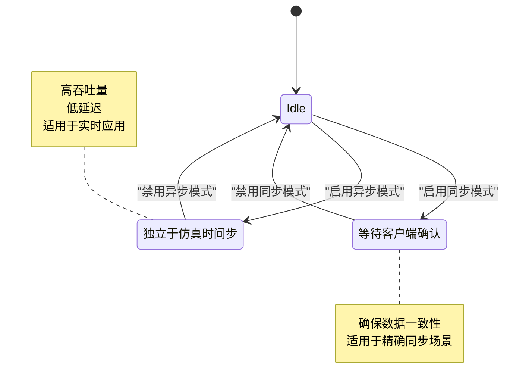
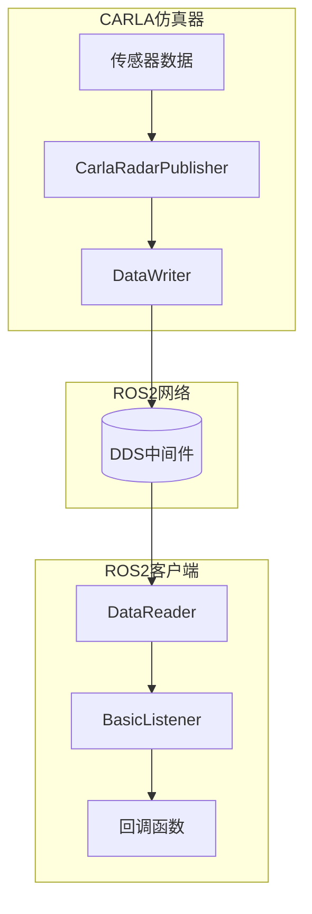

# 数据流处理

> **引用文件**
> **本文档中引用的文件**

- [SensorRegistry.h](https://github.com/carla-simulator/carla/blob/ue5-dev/LibCarla/source/carla/sensor/SensorRegistry.h)
- [CompositeSerializer.h](https://github.com/carla-simulator/carla/blob/ue5-dev/LibCarla/source/carla/sensor/CompositeSerializer.h)
- [SensorData.h](https://github.com/carla-simulator/carla/blob/ue5-dev/LibCarla/source/carla/sensor/SensorData.h)
- [RawData.h](https://github.com/carla-simulator/carla/blob/ue5-dev/LibCarla/source/carla/sensor/RawData.h)
- [SensorHeaderSerializer.h](https://github.com/carla-simulator/carla/blob/ue5-dev/LibCarla/source/carla/sensor/s11n/SensorHeaderSerializer.h)
- [IMUSerializer.h](https://github.com/carla-simulator/carla/blob/ue5-dev/LibCarla/source/carla/sensor/s11n/IMUSerializer.h)
- [GnssSerializer.h](https://github.com/carla-simulator/carla/blob/ue5-dev/LibCarla/source/carla/sensor/s11n/GnssSerializer.h)
- [Deserializer.h](https://github.com/carla-simulator/carla/blob/ue5-dev/LibCarla/source/carla/sensor/Deserializer.h)
- [DataStream.h](https://github.com/carla-simulator/carla/blob/ue5-dev/Unreal/CarlaUnreal/Plugins/Carla/Source/Carla/Sensor/DataStream.h)
- [AsyncDataStream.h](https://github.com/carla-simulator/carla/blob/ue5-dev/Unreal/CarlaUnreal/Plugins/Carla/Source/Carla/Sensor/AsyncDataStream.h)
- [Server.h](https://github.com/carla-simulator/carla/blob/ue5-dev/LibCarla/source/carla/streaming/Server.h)
- [Client.h](https://github.com/carla-simulator/carla/blob/ue5-dev/LibCarla/source/carla/streaming/Client.h)
- [MultiStreamState.h](https://github.com/carla-simulator/carla/blob/ue5-dev/LibCarla/source/carla/streaming/detail/MultiStreamState.h)
- [CarlaRadarPublisher.cpp](https://github.com/carla-simulator/carla/blob/ue5-dev/LibCarla/source/carla/ros2/publishers/CarlaRadarPublisher.cpp)
- [CarlaCollisionPublisher.cpp](https://github.com/carla-simulator/carla/blob/ue5-dev/LibCarla/source/carla/ros2/publishers/CarlaCollisionPublisher.cpp)
- [BasicSubscriber.cpp](https://github.com/carla-simulator/carla/blob/ue5-dev/LibCarla/source/carla/ros2/subscribers/BasicSubscriber.cpp)
- [BasicListener.cpp](https://github.com/carla-simulator/carla/blob/ue5-dev/LibCarla/source/carla/ros2/listeners/BasicListener.cpp)

## 目录

1. [引言](#引言)
2. [传感器数据注册与管理](#传感器数据注册与管理)
3. [序列化与反序列化机制](#序列化与反序列化机制)
4. [数据流管理](#数据流管理)
5. [数据包结构与元数据](#数据包结构与元数据)
6. [同步与异步模式下的数据流控制](#同步与异步模式下的数据流控制)
7. [ROS2 集成与数据传输](#ros2集成与数据传输)
8. [性能优化建议](#性能优化建议)
9. [结论](#结论)

## 引言

CARLA 仿真平台提供了一套完整的传感器数据处理框架，用于高效地采集、序列化、传输和分发各种传感器数据。本文档深入解析从传感器数据采集到客户端接收的完整流程，重点阐述 SensorRegistry 如何注册和管理不同类型的传感器数据格式，解释序列化和反序列化机制如何在客户端和服务器之间高效传输大量传感器数据，以及 DataStream 类如何管理数据订阅和发布。

## 传感器数据注册与管理

CARLA 使用 SensorRegistry 来集中注册和管理所有可用的传感器类型及其对应的序列化器。SensorRegistry 基于编译时类型映射（CompileTimeTypeMap）实现，将传感器指针类型与相应的序列化器配对，确保在编译时就能确定正确的序列化路径。

SensorRegistry 通过四个步骤完成传感器注册：

1. 包含序列化器头文件
2. 添加传感器的前向声明
3. 在 SensorRegistry 中注册传感器及其序列化器
4. 包含传感器实现头文件

这种设计模式实现了传感器与序列化逻辑的解耦，同时保证了类型安全和运行时性能。

**图表来源**

- <a href="https://github.com/carla-simulator/carla/blob/ue5-dev/LibCarla/source/carla/sensor/SensorRegistry.h#L59-L84" target="_blank">SensorRegistry.h</a>
- <a href="https://github.com/carla-simulator/carla/blob/ue5-dev/LibCarla/source/carla/sensor/CompositeSerializer.h#L29-L30" target="_blank">CompositeSerializer.h</a>
- <a href="https://github.com/carla-simulator/carla/blob/ue5-dev/LibCarla/source/carla/sensor/CompileTimeTypeMap.h#L90-L101" target="_blank">CompileTimeTypeMap.h</a>

**本节来源**

- <a href="https://github.com/carla-simulator/carla/blob/ue5-dev/LibCarla/source/carla/sensor/SensorRegistry.h#L1-L113" target="_blank">SensorRegistry.h</a>

## 序列化与反序列化机制

CARLA 的序列化机制采用 MsgPack 作为底层序列化格式，结合自定义的序列化器实现高效的数据编码和解码。每个传感器类型都有对应的序列化器，负责将原始传感器数据转换为紧凑的二进制格式。

序列化过程包括两个主要部分：

1. **头部序列化**：使用 SensorHeaderSerializer 生成包含传感器类型 ID、帧号、时间戳和传感器变换的固定大小头部
2. **数据序列化**：使用特定传感器的序列化器（如 IMUSerializer、GnssSerializer）将传感器测量数据编码为二进制格式

反序列化过程则通过 SensorRegistry 根据传感器类型 ID 动态选择正确的反序列化器，确保不同类型的数据能够被正确解析。

**图表来源**

- <a href="https://github.com/carla-simulator/carla/blob/ue5-dev/LibCarla/source/carla/sensor/s11n/SensorHeaderSerializer.h#L16-L44" target="_blank">SensorHeaderSerializer.h</a>
- <a href="https://github.com/carla-simulator/carla/blob/ue5-dev/LibCarla/source/carla/sensor/s11n/IMUSerializer.h#L20-L60" target="_blank">IMUSerializer.h</a>
- <a href="https://github.com/carla-simulator/carla/blob/ue5-dev/LibCarla/source/carla/sensor/s11n/GnssSerializer.h#L24-L40" target="_blank">GnssSerializer.h</a>
- <a href="https://github.com/carla-simulator/carla/blob/ue5-dev/LibCarla/source/carla/sensor/Deserializer.h#L23-L26" target="_blank">Deserializer.h</a>

**本节来源**

- <a href="https://github.com/carla-simulator/carla/blob/ue5-dev/LibCarla/source/carla/sensor/CompositeSerializer.h#L78-L92" target="_blank">CompositeSerializer.h</a>
- <a href="https://github.com/carla-simulator/carla/blob/ue5-dev/LibCarla/source/carla/sensor/s11n/SensorHeaderSerializer.h#L16-L44" target="_blank">SensorHeaderSerializer.h</a>

## 数据流管理

CARLA 使用流（Stream）机制来管理传感器数据的订阅和发布。每个传感器都有一个关联的数据流，客户端可以通过流令牌（Token）订阅该流以接收数据。

流管理的核心组件包括：

- **Server**：创建和管理数据流，处理客户端连接
- **Client**：订阅数据流，接收数据回调
- **Stream**：表示一个数据流通道
- **Token**：用于标识和订阅特定数据流

服务器端通过 MakeStream()创建新的数据流，并通过 GetToken()获取订阅令牌。客户端使用该令牌通过 Subscribe()方法订阅数据流，当有新数据时，注册的回调函数会被调用。

**图表来源**

- <a href="https://github.com/carla-simulator/carla/blob/ue5-dev/LibCarla/source/carla/streaming/Server.h#L19-L101" target="_blank">Server.h</a>
- <a href="https://github.com/carla-simulator/carla/blob/ue5-dev/LibCarla/source/carla/streaming/Client.h#L23-L66" target="_blank">Client.h</a>
- <a href="https://github.com/carla-simulator/carla/blob/ue5-dev/LibCarla/source/carla/streaming/detail/MultiStreamState.h#L48-L92" target="_blank">MultiStreamState.h</a>

**本节来源**

- <a href="https://github.com/carla-simulator/carla/blob/ue5-dev/LibCarla/source/carla/streaming/Server.h#L1-L101" target="_blank">Server.h</a>
- <a href="https://github.com/carla-simulator/carla/blob/ue5-dev/LibCarla/source/carla/streaming/Client.h#L1-L66" target="_blank">Client.h</a>

## 数据包结构与元数据

CARLA 传感器数据包采用分层结构，包含固定头部和可变长度的数据体。这种设计既保证了元数据的快速访问，又支持不同类型传感器数据的灵活编码。

数据包结构如下：

- **头部（Header）**：固定大小的元数据区域
  - 传感器类型 ID（8 字节）
  - 帧号（8 字节）
  - 时间戳（8 字节）
  - 传感器变换矩阵（48 字节）
- **数据体（Data Body）**：可变长度的传感器测量数据
  - 使用 MsgPack 格式编码
  - 包含传感器特定的测量值

RawData 类作为数据包的封装，提供了对头部元数据和数据体的访问接口。通过 GetSensorTypeId()、GetFrame()、GetTimestamp()等方法可以快速获取元数据，而 begin()和 end()迭代器则用于访问原始数据。

**图表来源**

- <a href="https://github.com/carla-simulator/carla/blob/ue5-dev/LibCarla/source/carla/sensor/s11n/SensorHeaderSerializer.h#L20-L27" target="_blank">SensorHeaderSerializer.h</a>
- <a href="https://github.com/carla-simulator/carla/blob/ue5-dev/LibCarla/source/carla/sensor/RawData.h#L21-L101" target="_blank">RawData.h</a>
- <a href="https://github.com/carla-simulator/carla/blob/ue5-dev/LibCarla/source/carla/sensor/SensorData.h#L19-L73" target="_blank">SensorData.h</a>

**本节来源**

- <a href="https://github.com/carla-simulator/carla/blob/ue5-dev/LibCarla/source/carla/sensor/s11n/SensorHeaderSerializer.h#L16-L44" target="_blank">SensorHeaderSerializer.h</a>
- <a href="https://github.com/carla-simulator/carla/blob/ue5-dev/LibCarla/source/carla/sensor/RawData.h#L1-L101" target="_blank">RawData.h</a>

## 同步与异步模式下的数据流控制

CARLA 支持同步和异步两种数据流模式，以适应不同的仿真需求和性能要求。

在**同步模式**下，服务器会等待所有订阅客户端确认接收到数据后才推进仿真时间步。这种模式确保了数据的一致性和确定性，适用于需要精确时间同步的场景。

在**异步模式**下，数据流独立于仿真时间步运行，服务器不会等待客户端确认。这种模式提供了更高的吞吐量和更低的延迟，适用于实时性要求高的应用。

数据流控制通过 MultiStreamState 类实现，该类维护了所有会话连接，并提供 AreClientsListening()方法来检查是否有客户端正在监听数据流。ForceActive()方法可以强制激活数据流，即使没有客户端连接。

**图表来源**

- <a href="https://github.com/carla-simulator/carla/blob/ue5-dev/LibCarla/source/carla/streaming/Server.h#L70-L72" target="_blank">Server.h</a>
- <a href="https://github.com/carla-simulator/carla/blob/ue5-dev/LibCarla/source/carla/streaming/detail/MultiStreamState.h#L77-L79" target="_blank">MultiStreamState.h</a>

**本节来源**

- <a href="https://github.com/carla-simulator/carla/blob/ue5-dev/LibCarla/source/carla/streaming/Server.h#L70-L88" target="_blank">Server.h</a>
- <a href="https://github.com/carla-simulator/carla/blob/ue5-dev/LibCarla/source/carla/streaming/detail/MultiStreamState.h#L61-L79" target="_blank">MultiStreamState.h</a>

## ROS2 集成与数据传输

CARLA 通过 ROS2 集成模块实现了与 ROS 生态系统的无缝对接。ROS2 发布者（Publisher）和订阅者（Subscriber）组件负责将 CARLA 传感器数据转换为 ROS2 消息格式，并通过 DDS（Data Distribution Service）进行高效传输。

关键组件包括：

- **CarlaRadarPublisher**：雷达数据发布者
- **CarlaCollisionPublisher**：碰撞检测数据发布者
- **CarlaSemanticLidarPublisher**：语义激光雷达数据发布者
- **BasicSubscriber**：基础订阅者实现
- **BasicListener**：数据可用性监听器

ROS2 集成使用 FastRTPS 作为 DDS 实现，通过 PREALLOCATED_WITH_REALLOC_MEMORY_MODE 内存策略优化大数据包的传输性能。DataWriterQos 和 DataReaderQos 配置确保了数据传输的可靠性和实时性。

**图表来源**

- <a href="https://github.com/carla-simulator/carla/blob/ue5-dev/LibCarla/source/carla/ros2/publishers/CarlaRadarPublisher.cpp#L84-L94" target="_blank">CarlaRadarPublisher.cpp</a>
- <a href="https://github.com/carla-simulator/carla/blob/ue5-dev/LibCarla/source/carla/ros2/publishers/CarlaCollisionPublisher.cpp#L76-L87" target="_blank">CarlaCollisionPublisher.cpp</a>
- <a href="https://github.com/carla-simulator/carla/blob/ue5-dev/LibCarla/source/carla/ros2/subscribers/BasicSubscriber.cpp#L82-L131" target="_blank">BasicSubscriber.cpp</a>
- <a href="https://github.com/carla-simulator/carla/blob/ue5-dev/LibCarla/source/carla/ros2/listeners/BasicListener.cpp#L45-L75" target="_blank">BasicListener.cpp</a>

**本节来源**

- <a href="https://github.com/carla-simulator/carla/blob/ue5-dev/LibCarla/source/carla/ros2/publishers/CarlaRadarPublisher.cpp#L1-L100" target="_blank">CarlaRadarPublisher.cpp</a>
- <a href="https://github.com/carla-simulator/carla/blob/ue5-dev/LibCarla/source/carla/ros2/subscribers/BasicSubscriber.cpp#L1-L150" target="_blank">BasicSubscriber.cpp</a>

## 性能优化建议

为了平衡仿真精度和系统负载，建议采取以下性能优化措施：

1. **调整数据流频率**：根据应用需求调整传感器数据采集频率，避免不必要的数据传输
2. **选择合适的同步模式**：在不需要精确同步的场景下使用异步模式以提高性能
3. **优化 ROS2 QoS 配置**：根据网络条件调整 DataWriterQos 和 DataReaderQos 参数
4. **使用预分配内存模式**：对于大数据包使用 PREALLOCATED_WITH_REALLOC_MEMORY_MODE 减少内存分配开销
5. **合理管理订阅**：及时取消不需要的数据流订阅以减少网络带宽占用
6. **批处理数据**：在可能的情况下合并多个小数据包为单个大数据包传输
7. **监控系统负载**：使用 CARLA 内置的性能监控工具跟踪 CPU、内存和网络使用情况

通过合理配置这些参数，可以在保证仿真质量的同时最大化系统性能。

**本节来源**

- <a href="https://github.com/carla-simulator/carla/blob/ue5-dev/LibCarla/source/carla/streaming/Server.h#L70-L88" target="_blank">Server.h</a>
- <a href="https://github.com/carla-simulator/carla/blob/ue5-dev/LibCarla/source/carla/streaming/detail/MultiStreamState.h#L61-L79" target="_blank">MultiStreamState.h</a>
- <a href="https://github.com/carla-simulator/carla/blob/ue5-dev/LibCarla/source/carla/ros2/publishers/CarlaRadarPublisher.cpp#L84-L94" target="_blank">CarlaRadarPublisher.cpp</a>

## 结论

CARLA 的数据流处理框架提供了一套完整、高效且可扩展的传感器数据管理解决方案。通过 SensorRegistry 的编译时类型映射、基于 MsgPack 的序列化机制、灵活的流管理架构以及与 ROS2 的深度集成，CARLA 能够支持多种传感器类型的数据采集、传输和分发。理解这一框架的内部工作原理对于开发高性能的自动驾驶仿真应用至关重要。
