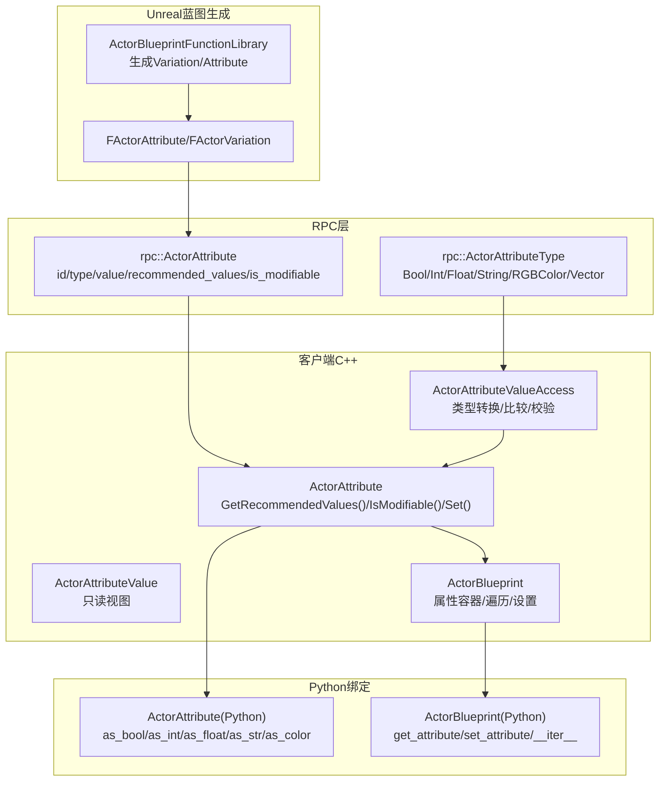
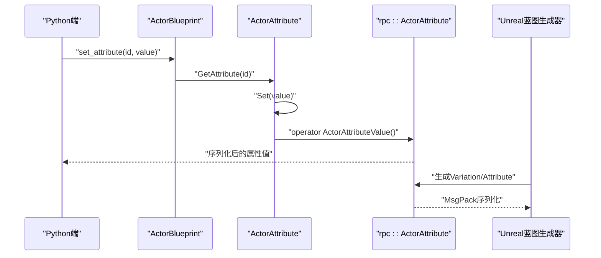
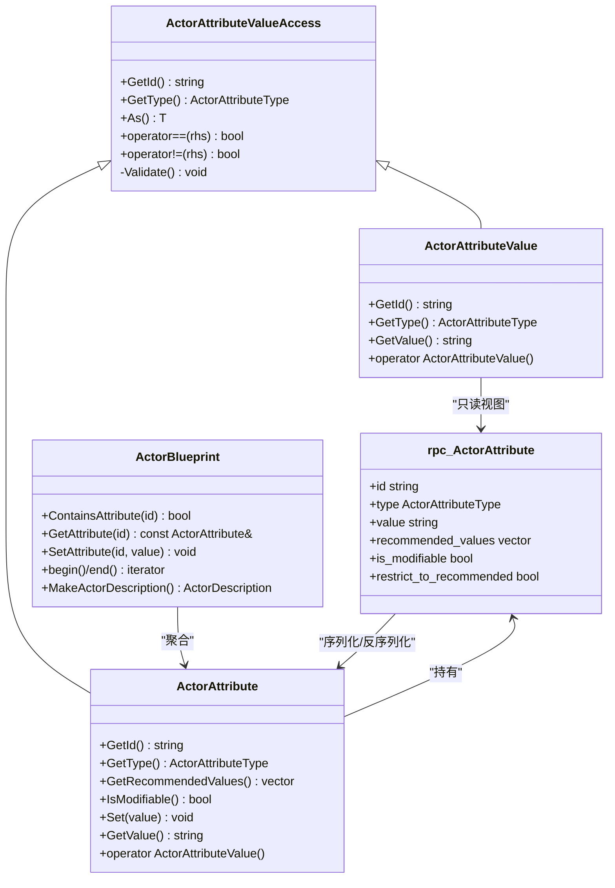
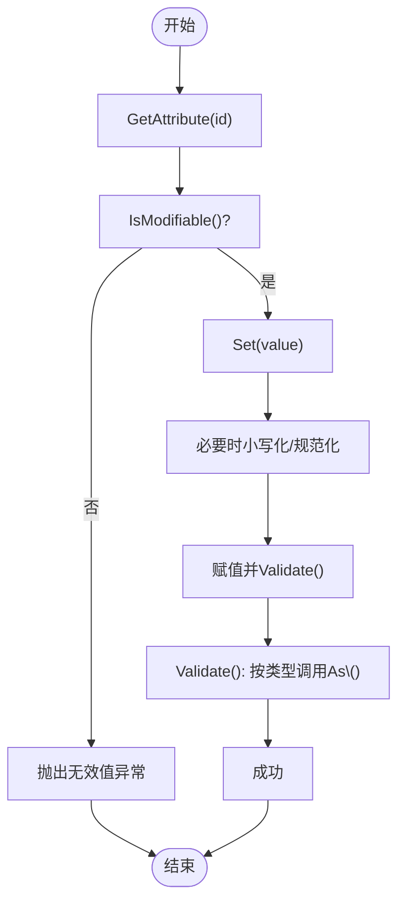
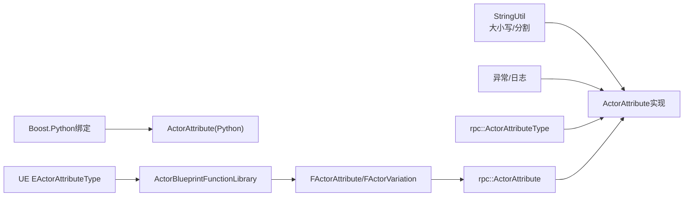

# 属性管理

**本文引用的文件**
- [ActorAttribute.h](https://github.com/carla-simulator/carla/blob/ue5-dev/LibCarla/source/carla/client/ActorAttribute.h)
- [ActorAttribute.cpp](https://github.com/carla-simulator/carla/blob/ue5-dev/LibCarla/source/carla/client/ActorAttribute.cpp)
- [ActorAttributeType.h](https://github.com/carla-simulator/carla/blob/ue5-dev/LibCarla/source/carla/rpc/ActorAttributeType.h)
- [ActorAttribute.h](https://github.com/carla-simulator/carla/blob/ue5-dev/LibCarla/source/carla/rpc/ActorAttribute.h)
- [ActorBlueprint.h](https://github.com/carla-simulator/carla/blob/ue5-dev/LibCarla/source/carla/client/ActorBlueprint.h)
- [ActorBlueprint.cpp](https://github.com/carla-simulator/carla/blob/ue5-dev/LibCarla/source/carla/client/ActorBlueprint.cpp)
- [Blueprint.cpp](https://github.com/carla-simulator/carla/blob/ue5-dev/PythonAPI/carla/src/Blueprint.cpp)
- [set_attribute.py](https://github.com/carla-simulator/carla/blob/ue5-dev/PythonAPI/docs/snipets/carla.ActorBlueprint.set_attribute.py)
- [core_actors.md](https://github.com/carla-simulator/carla/blob/ue5-dev/Docs/core_actors.md)
- [ActorAttribute.h](https://github.com/carla-simulator/carla/blob/ue5-dev/Unreal/CarlaUnreal/Plugins/Carla/Source/Carla/Actor/ActorAttribute.h)
- [ActorBlueprintFunctionLibrary.cpp](https://github.com/carla-simulator/carla/blob/ue5-dev/Unreal/CarlaUnreal/Plugins/Carla/Source/Carla/Actor/ActorBlueprintFunctionLibrary.cpp)

## 目录
1. [简介](#简介)
2. [项目结构](#项目结构)
3. [核心组件](#核心组件)
4. [架构总览](#架构总览)
5. [详细组件分析](#详细组件分析)
6. [依赖关系分析](#依赖关系分析)
7. [性能考量](#性能考量)
8. [故障排查指南](#故障排查指南)
9. [结论](#结论)
10. [附录](#附录)

## 简介
本文件聚焦于ActorAttribute类的设计与使用，系统性阐述CARLA属性系统的数据结构、类型体系、验证与默认值策略，并结合蓝图系统说明属性在角色生成过程中的作用。文档同时提供面向Python API的使用示例路径与C++实现细节，帮助读者高效理解与应用属性系统。

## 项目结构
属性系统横跨客户端C++、RPC序列化层、Python绑定层以及Unreal蓝图生成器，形成“定义—序列化—访问—生成”的完整链路：
- 定义与类型：RPC层定义属性结构与类型枚举，供网络传输与序列化。
- 访问与校验：客户端C++提供ActorAttribute/ActorAttributeValueAccess抽象与具体实现，负责类型转换、格式校验与异常抛出。
- 蓝图集成：ActorBlueprint封装属性集合，支持按id检索、设置与遍历；Python绑定导出到API。
- 蓝图生成：Unreal侧通过ActorBlueprintFunctionLibrary生成Variation/Attribute，驱动属性推荐值与可变性约束。

图表来源
- [ActorAttribute.h](https://github.com/carla-simulator/carla/blob/ue5-dev/LibCarla/source/carla/client/ActorAttribute.h#L47-L241)
- [ActorAttribute.cpp](https://github.com/carla-simulator/carla/blob/ue5-dev/LibCarla/source/carla/client/ActorAttribute.cpp#L1-L108)
- [ActorAttribute.h](https://github.com/carla-simulator/carla/blob/ue5-dev/LibCarla/source/carla/rpc/ActorAttribute.h#L26-L103)
- [ActorAttributeType.h](https://github.com/carla-simulator/carla/blob/ue5-dev/LibCarla/source/carla/rpc/ActorAttributeType.h#L14-L24)
- [ActorBlueprint.h](https://github.com/carla-simulator/carla/blob/ue5-dev/LibCarla/source/carla/client/ActorBlueprint.h#L72-L121)
- [Blueprint.cpp](https://github.com/carla-simulator/carla/blob/ue5-dev/PythonAPI/carla/src/Blueprint.cpp#L58-L114)
- [ActorBlueprintFunctionLibrary.cpp](https://github.com/carla-simulator/carla/blob/ue5-dev/Unreal/CarlaUnreal/Plugins/Carla/Source/Carla/Actor/ActorBlueprintFunctionLibrary.cpp#L850-L888)

章节来源
- [ActorAttribute.h](https://github.com/carla-simulator/carla/blob/ue5-dev/LibCarla/source/carla/client/ActorAttribute.h#L47-L241)
- [ActorAttribute.cpp](https://github.com/carla-simulator/carla/blob/ue5-dev/LibCarla/source/carla/client/ActorAttribute.cpp#L1-L108)
- [ActorAttribute.h](https://github.com/carla-simulator/carla/blob/ue5-dev/LibCarla/source/carla/rpc/ActorAttribute.h#L26-L103)
- [ActorAttributeType.h](https://github.com/carla-simulator/carla/blob/ue5-dev/LibCarla/source/carla/rpc/ActorAttributeType.h#L14-L24)
- [ActorBlueprint.h](https://github.com/carla-simulator/carla/blob/ue5-dev/LibCarla/source/carla/client/ActorBlueprint.h#L72-L121)
- [Blueprint.cpp](https://github.com/carla-simulator/carla/blob/ue5-dev/PythonAPI/carla/src/Blueprint.cpp#L58-L114)
- [ActorBlueprintFunctionLibrary.cpp](https://github.com/carla-simulator/carla/blob/ue5-dev/Unreal/CarlaUnreal/Plugins/Carla/Source/Carla/Actor/ActorBlueprintFunctionLibrary.cpp#L850-L888)

## 核心组件
- ActorAttributeValueAccess：抽象基类，提供统一的类型转换接口As\<T\>()、比较运算符与通用校验逻辑。
- ActorAttribute：蓝图属性对象，包含id、类型、当前值、推荐值列表、是否可修改等元信息，并提供Set()写入与Validate()校验。
- ActorAttributeValue：只读属性值视图，用于运行时读取当前值。
- ActorBlueprint：蓝图容器，聚合多个ActorAttribute，提供按id检索、设置、遍历与生成ActorDescription。
- RPC层：rpc::ActorAttribute与rpc::ActorAttributeType定义属性的序列化结构与类型枚举，支持MsgPack序列化与UE4互操作。

章节来源
- [ActorAttribute.h](https://github.com/carla-simulator/carla/blob/ue5-dev/LibCarla/source/carla/client/ActorAttribute.h#L47-L241)
- [ActorAttribute.cpp](https://github.com/carla-simulator/carla/blob/ue5-dev/LibCarla/source/carla/client/ActorAttribute.cpp#L1-L108)
- [ActorAttribute.h](https://github.com/carla-simulator/carla/blob/ue5-dev/LibCarla/source/carla/rpc/ActorAttribute.h#L26-L103)
- [ActorAttributeType.h](https://github.com/carla-simulator/carla/blob/ue5-dev/LibCarla/source/carla/rpc/ActorAttributeType.h#L14-L24)
- [ActorBlueprint.h](https://github.com/carla-simulator/carla/blob/ue5-dev/LibCarla/source/carla/client/ActorBlueprint.h#L72-L121)

## 架构总览
属性系统围绕“类型—值—元信息—访问—序列化”展开，客户端与RPC层保持一致的数据模型，Python绑定提供易用的API，Unreal蓝图生成器负责将Variation/Attribute注入RPC结构，最终在运行时由ActorAttribute完成类型转换与校验。

图表来源
- [ActorBlueprint.cpp](https://github.com/carla-simulator/carla/blob/ue5-dev/LibCarla/source/carla/client/ActorBlueprint.cpp#L50-L63)
- [ActorAttribute.cpp](https://github.com/carla-simulator/carla/blob/ue5-dev/LibCarla/source/carla/client/ActorAttribute.cpp#L22-L31)
- [ActorAttribute.h](https://github.com/carla-simulator/carla/blob/ue5-dev/LibCarla/source/carla/client/ActorAttribute.h#L216-L233)
- [ActorAttribute.h](https://github.com/carla-simulator/carla/blob/ue5-dev/LibCarla/source/carla/rpc/ActorAttribute.h#L70-L103)
- [ActorBlueprintFunctionLibrary.cpp](https://github.com/carla-simulator/carla/blob/ue5-dev/Unreal/CarlaUnreal/Plugins/Carla/Source/Carla/Actor/ActorBlueprintFunctionLibrary.cpp#L850-L888)

## 详细组件分析

### 类层次与关系
ActorAttribute继承自ActorAttributeValueAccess，二者均基于rpc::ActorAttributeType进行类型转换与校验；ActorAttributeValue提供只读视图，便于快照或序列化。

图表来源
- [ActorAttribute.h](https://github.com/carla-simulator/carla/blob/ue5-dev/LibCarla/source/carla/client/ActorAttribute.h#L47-L241)
- [ActorAttribute.cpp](https://github.com/carla-simulator/carla/blob/ue5-dev/LibCarla/source/carla/client/ActorAttribute.cpp#L1-L108)
- [ActorAttribute.h](https://github.com/carla-simulator/carla/blob/ue5-dev/LibCarla/source/carla/rpc/ActorAttribute.h#L26-L103)
- [ActorBlueprint.h](https://github.com/carla-simulator/carla/blob/ue5-dev/LibCarla/source/carla/client/ActorBlueprint.h#L72-L121)

章节来源
- [ActorAttribute.h](https://github.com/carla-simulator/carla/blob/ue5-dev/LibCarla/source/carla/client/ActorAttribute.h#L47-L241)
- [ActorAttribute.cpp](https://github.com/carla-simulator/carla/blob/ue5-dev/LibCarla/source/carla/client/ActorAttribute.cpp#L1-L108)
- [ActorAttribute.h](https://github.com/carla-simulator/carla/blob/ue5-dev/LibCarla/source/carla/rpc/ActorAttribute.h#L26-L103)
- [ActorBlueprint.h](https://github.com/carla-simulator/carla/blob/ue5-dev/LibCarla/source/carla/client/ActorBlueprint.h#L72-L121)

### 数据结构与类型体系
- 属性名称：id为字符串标识，用于蓝图检索与设置。
- 类型：ActorAttributeType枚举包含Bool、Int、Float、String、RGBColor、Vector等。
- 值：以字符串存储，通过As\<T\>()模板进行类型转换。
- 元信息：recommended_values为可选值列表；is_modifiable指示是否允许修改；restrict_to_recommended在UE侧用于约束。
- 序列化：MsgPack宏定义数组字段，支持跨进程/跨语言传递。

章节来源
- [ActorAttributeType.h](https://github.com/carla-simulator/carla/blob/ue5-dev/LibCarla/source/carla/rpc/ActorAttributeType.h#L14-L24)
- [ActorAttribute.h](https://github.com/carla-simulator/carla/blob/ue5-dev/LibCarla/source/carla/rpc/ActorAttribute.h#L26-L103)
- [ActorAttribute.h](https://github.com/carla-simulator/carla/blob/ue5-dev/LibCarla/source/carla/client/ActorAttribute.h#L183-L239)

### 查询与修改流程
- 查询：ActorBlueprint::GetAttribute(id)返回ActorAttribute引用；支持遍历迭代器。
- 修改：ActorBlueprint::SetAttribute(id, value)委托给ActorAttribute::Set；若属性不可修改或格式不匹配则抛出异常。
- 类型转换：As\<T\>()根据类型枚举进行解析，例如bool大小写不敏感、RGBColor按逗号分隔且通道范围检查。

图表来源
- [ActorBlueprint.cpp](https://github.com/carla-simulator/carla/blob/ue5-dev/LibCarla/source/carla/client/ActorBlueprint.cpp#L50-L63)
- [ActorAttribute.cpp](https://github.com/carla-simulator/carla/blob/ue5-dev/LibCarla/source/carla/client/ActorAttribute.cpp#L22-L31)
- [ActorAttribute.cpp](https://github.com/carla-simulator/carla/blob/ue5-dev/LibCarla/source/carla/client/ActorAttribute.cpp#L91-L101)

章节来源
- [ActorBlueprint.cpp](https://github.com/carla-simulator/carla/blob/ue5-dev/LibCarla/source/carla/client/ActorBlueprint.cpp#L50-L63)
- [ActorAttribute.cpp](https://github.com/carla-simulator/carla/blob/ue5-dev/LibCarla/source/carla/client/ActorAttribute.cpp#L22-L31)
- [ActorAttribute.cpp](https://github.com/carla-simulator/carla/blob/ue5-dev/LibCarla/source/carla/client/ActorAttribute.cpp#L91-L101)

### 验证机制与默认值策略
- 验证规则：
  - 只读属性禁止Set()。
  - 类型不匹配时抛出BadAttributeCast异常。
  - 数值溢出（如float超出float范围）抛出InvalidAttributeValue异常。
  - 颜色通道数量必须为3且不超过uint8范围。
- 默认值与推荐值：
  - UE侧Variation可声明recommended_values与restrict_to_recommended，Blueprint构造时会填充默认值（通常取recommended_values首项）。
  - 客户端C++未显式提供默认值字段，推荐值仅作为建议集合，实际值由Set()或蓝图生成决定。

章节来源
- [ActorAttribute.cpp](https://github.com/carla-simulator/carla/blob/ue5-dev/LibCarla/source/carla/client/ActorAttribute.cpp#L16-L21)
- [ActorAttribute.cpp](https://github.com/carla-simulator/carla/blob/ue5-dev/LibCarla/source/carla/client/ActorAttribute.cpp#L34-L60)
- [ActorAttribute.cpp](https://github.com/carla-simulator/carla/blob/ue5-dev/LibCarla/source/carla/client/ActorAttribute.cpp#L69-L89)
- [ActorAttribute.cpp](https://github.com/carla-simulator/carla/blob/ue5-dev/LibCarla/source/carla/client/ActorAttribute.cpp#L91-L101)
- [ActorAttribute.h](https://github.com/carla-simulator/carla/blob/ue5-dev/LibCarla/source/carla/rpc/ActorAttribute.h#L41-L63)
- [ActorBlueprintFunctionLibrary.cpp](https://github.com/carla-simulator/carla/blob/ue5-dev/Unreal/CarlaUnreal/Plugins/Carla/Source/Carla/Actor/ActorBlueprintFunctionLibrary.cpp#L850-L888)

### 与蓝图系统的集成
- Python API导出：
  - ActorAttribute提供as_bool/as_int/as_float/as_str/as_color与比较运算符。
  - ActorBlueprint提供has_attribute/get_attribute/set_attribute/__iter__等方法。
- 使用示例：
  - 设置步行者不可被伤害、随机选择车辆颜色、设置相机分辨率等。

章节来源
- [Blueprint.cpp](https://github.com/carla-simulator/carla/blob/ue5-dev/PythonAPI/carla/src/Blueprint.cpp#L58-L114)
- [set_attribute.py](https://github.com/carla-simulator/carla/blob/ue5-dev/PythonAPI/docs/snipets/carla.ActorBlueprint.set_attribute.py#L1-L20)
- [core_actors.md](https://github.com/carla-simulator/carla/blob/ue5-dev/Docs/core_actors.md#L20-L60)

### 在角色生成中的作用
- 蓝图生成阶段：ActorBlueprintFunctionLibrary为不同类型的Actor生成Variation/Attribute，如颜色、驾驶员ID、粘性控制、地形力学等，设置recommended_values与可选约束。
- 运行时应用：ActorBlueprint聚合这些Variation/Attribute，用户可通过API设置属性，最终在生成Actor时生效。

章节来源
- [ActorBlueprintFunctionLibrary.cpp](https://github.com/carla-simulator/carla/blob/ue5-dev/Unreal/CarlaUnreal/Plugins/Carla/Source/Carla/Actor/ActorBlueprintFunctionLibrary.cpp#L850-L888)
- [ActorBlueprint.h](https://github.com/carla-simulator/carla/blob/ue5-dev/LibCarla/source/carla/client/ActorBlueprint.h#L108-L111)

## 依赖关系分析
- 客户端C++依赖RPC层类型与序列化宏，确保跨模块一致性。
- ActorAttribute依赖StringUtil工具进行大小写转换与分割，依赖日志与异常设施。
- Python绑定依赖Boost.Python导出属性与方法，提供as_*系列转换函数。
- Unreal蓝图生成器依赖rpc::ActorAttributeType映射到UE枚举，生成Variation/Attribute并写入recommended_values。

图表来源
- [ActorAttribute.cpp](https://github.com/carla-simulator/carla/blob/ue5-dev/LibCarla/source/carla/client/ActorAttribute.cpp#L1-L108)
- [ActorAttribute.h](https://github.com/carla-simulator/carla/blob/ue5-dev/LibCarla/source/carla/client/ActorAttribute.h#L47-L241)
- [Blueprint.cpp](https://github.com/carla-simulator/carla/blob/ue5-dev/PythonAPI/carla/src/Blueprint.cpp#L58-L114)
- [ActorAttribute.h](https://github.com/carla-simulator/carla/blob/ue5-dev/Unreal/CarlaUnreal/Plugins/Carla/Source/Carla/Actor/ActorAttribute.h#L17-L31)
- [ActorBlueprintFunctionLibrary.cpp](https://github.com/carla-simulator/carla/blob/ue5-dev/Unreal/CarlaUnreal/Plugins/Carla/Source/Carla/Actor/ActorBlueprintFunctionLibrary.cpp#L850-L888)

章节来源
- [ActorAttribute.cpp](https://github.com/carla-simulator/carla/blob/ue5-dev/LibCarla/source/carla/client/ActorAttribute.cpp#L1-L108)
- [Blueprint.cpp](https://github.com/carla-simulator/carla/blob/ue5-dev/PythonAPI/carla/src/Blueprint.cpp#L58-L114)
- [ActorAttribute.h](https://github.com/carla-simulator/carla/blob/ue5-dev/Unreal/CarlaUnreal/Plugins/Carla/Source/Carla/Actor/ActorAttribute.h#L17-L31)
- [ActorBlueprintFunctionLibrary.cpp](https://github.com/carla-simulator/carla/blob/ue5-dev/Unreal/CarlaUnreal/Plugins/Carla/Source/Carla/Actor/ActorBlueprintFunctionLibrary.cpp#L850-L888)

## 性能考量
- 类型转换开销：As\<T\>()在每次读取时进行格式解析与边界检查，频繁读取建议缓存结果。
- 字符串处理：bool大小写转换与颜色通道分割为O(n)操作，建议批量设置时减少重复解析。
- 序列化成本：MsgPack序列化字段较少，传输效率高；避免在热路径中频繁序列化大量属性。
- 遍历与查找：ActorBlueprint内部使用哈希表存储属性，按id查找为平均O(1)，遍历为O(n)。

## 故障排查指南
- 无法修改属性：检查is_modifiable标志，只读属性会抛出无效值异常。
- 类型不匹配：确认传入字符串与类型一致（如bool大小写、RGBColor格式），否则抛出坏类型转换异常。
- 数值溢出：确保数值在目标类型范围内，超界将触发无效值异常。
- 颜色格式错误：RGBColor需为“R,G,B”，且每个通道不超过uint8范围。
- 蓝图未找到属性：使用ActorBlueprint::ContainsAttribute/id存在性检查，避免越界异常。

章节来源
- [ActorAttribute.cpp](https://github.com/carla-simulator/carla/blob/ue5-dev/LibCarla/source/carla/client/ActorAttribute.cpp#L16-L21)
- [ActorAttribute.cpp](https://github.com/carla-simulator/carla/blob/ue5-dev/LibCarla/source/carla/client/ActorAttribute.cpp#L34-L60)
- [ActorAttribute.cpp](https://github.com/carla-simulator/carla/blob/ue5-dev/LibCarla/source/carla/client/ActorAttribute.cpp#L69-L89)
- [ActorBlueprint.cpp](https://github.com/carla-simulator/carla/blob/ue5-dev/LibCarla/source/carla/client/ActorBlueprint.cpp#L41-L48)

## 结论
ActorAttribute类通过清晰的类型体系与严格的验证机制，为CARLA的蓝图与运行时提供了可靠的属性管理能力。客户端C++与RPC层的一致设计保证了跨模块的稳定性，Python绑定与Unreal蓝图生成器进一步扩展了可用性与可配置性。遵循本文的使用与排错建议，可在角色生成与运行时配置中高效、安全地管理属性。

## 附录

### 常见属性与用途示例（路径）
- 设置步行者不可被伤害：参考示例路径
  - [set_attribute.py](https://github.com/carla-simulator/carla/blob/ue5-dev/PythonAPI/docs/snipets/carla.ActorBlueprint.set_attribute.py#L1-L20)
- 随机选择车辆颜色：参考示例路径
  - [set_attribute.py](https://github.com/carla-simulator/carla/blob/ue5-dev/PythonAPI/docs/snipets/carla.ActorBlueprint.set_attribute.py#L1-L20)
- 设置相机分辨率：参考示例路径
  - [set_attribute.py](https://github.com/carla-simulator/carla/blob/ue5-dev/PythonAPI/docs/snipets/carla.ActorBlueprint.set_attribute.py#L1-L20)
- 遍历蓝图属性与获取特定属性信息：参考API导出路径
  - [Blueprint.cpp](https://github.com/carla-simulator/carla/blob/ue5-dev/PythonAPI/carla/src/Blueprint.cpp#L88-L114)

### 关键API与行为摘要
- ActorAttribute
  - GetId()/GetType()/GetRecommendedValues()/IsModifiable()
  - Set(value)：写入并Validate()
  - As\<T\>()：按类型解析字符串值
- ActorBlueprint
  - ContainsAttribute(id)/GetAttribute(id)/SetAttribute(id, value)
  - begin()/end()：遍历所有属性
  - MakeActorDescription()：生成运行时描述
- Python绑定
  - ActorAttribute.as_bool/as_int/as_float/as_str/as_color
  - ActorBlueprint.get_attribute/set_attribute/__iter__

章节来源
- [ActorAttribute.h](https://github.com/carla-simulator/carla/blob/ue5-dev/LibCarla/source/carla/client/ActorAttribute.h#L183-L239)
- [ActorAttribute.cpp](https://github.com/carla-simulator/carla/blob/ue5-dev/LibCarla/source/carla/client/ActorAttribute.cpp#L22-L31)
- [ActorBlueprint.h](https://github.com/carla-simulator/carla/blob/ue5-dev/LibCarla/source/carla/client/ActorBlueprint.h#L72-L121)
- [Blueprint.cpp](https://github.com/carla-simulator/carla/blob/ue5-dev/PythonAPI/carla/src/Blueprint.cpp#L58-L114)