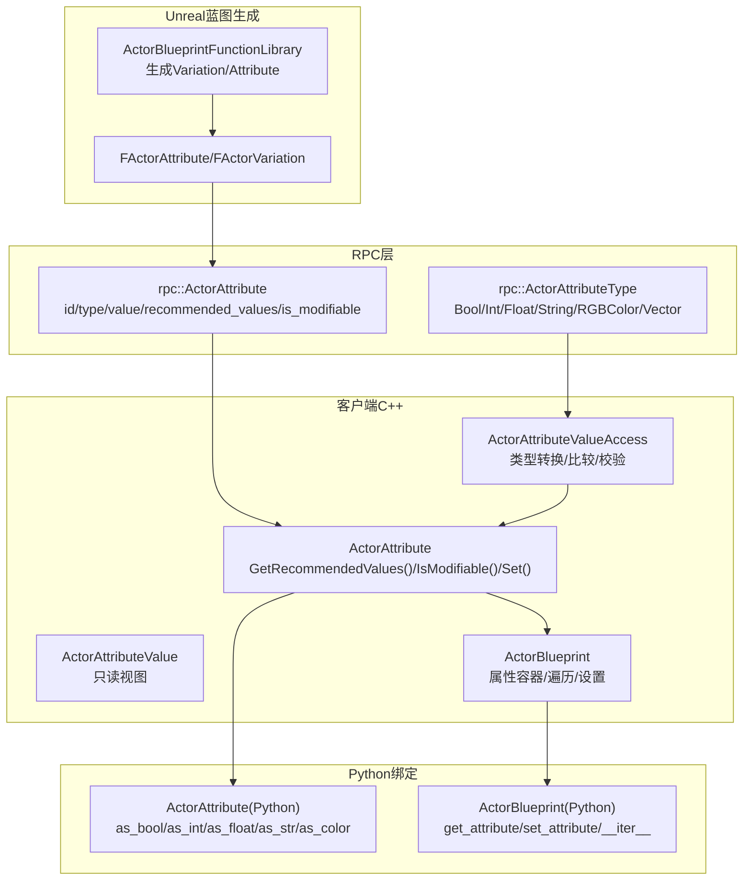
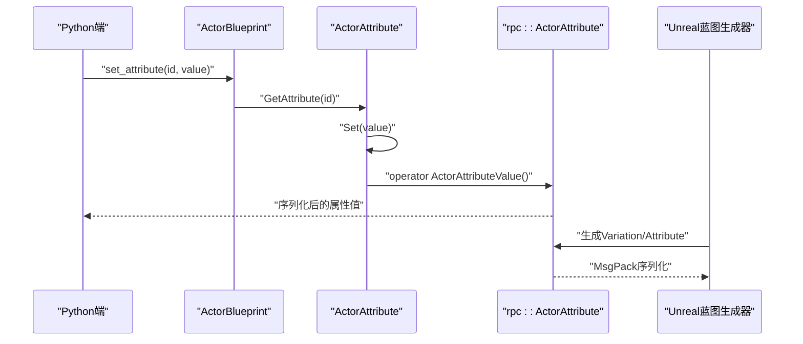
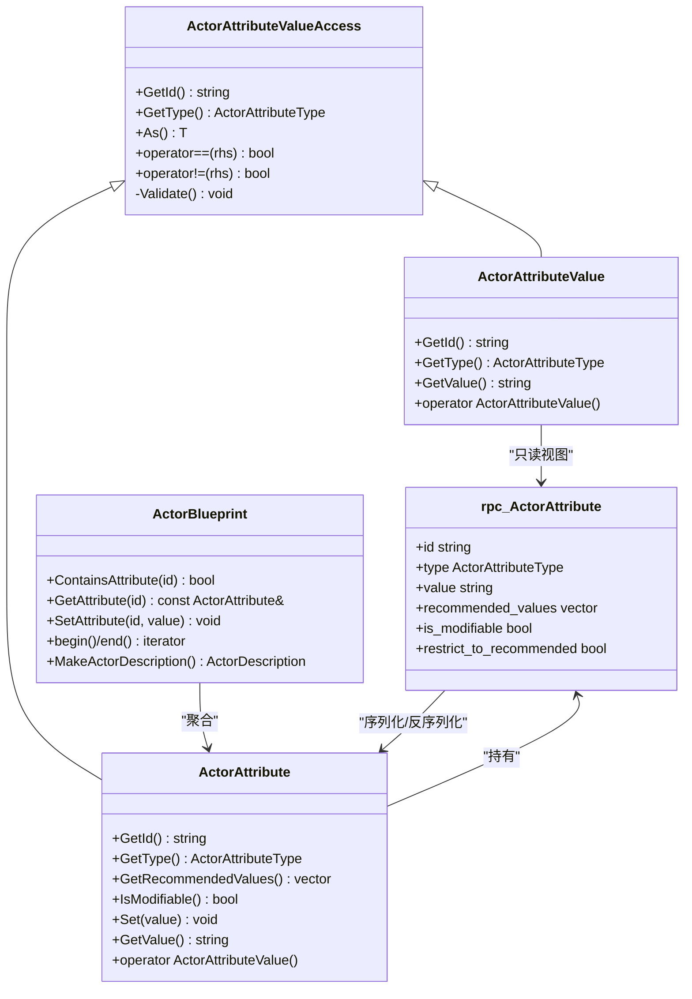
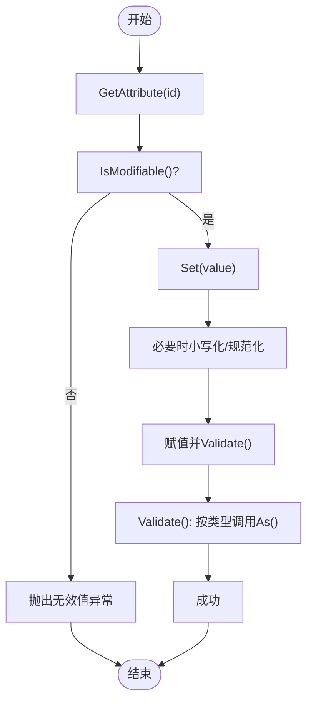
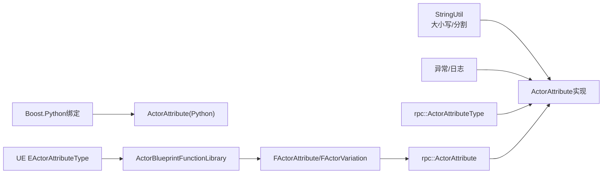

# 属性管理

> **引用文件** > **本文引用的文件**

- [ActorAttribute.h](https://github.com/carla-simulator/carla/blob/ue5-dev/LibCarla/source/carla/client/ActorAttribute.h)
- [ActorAttribute.cpp](https://github.com/carla-simulator/carla/blob/ue5-dev/LibCarla/source/carla/client/ActorAttribute.cpp)
- [ActorAttributeType.h](https://github.com/carla-simulator/carla/blob/ue5-dev/LibCarla/source/carla/rpc/ActorAttributeType.h)
- [ActorAttribute.h](https://github.com/carla-simulator/carla/blob/ue5-dev/LibCarla/source/carla/rpc/ActorAttribute.h)
- [ActorBlueprint.h](https://github.com/carla-simulator/carla/blob/ue5-dev/LibCarla/source/carla/client/ActorBlueprint.h)
- [ActorBlueprint.cpp](https://github.com/carla-simulator/carla/blob/ue5-dev/LibCarla/source/carla/client/ActorBlueprint.cpp)
- [Blueprint.cpp](https://github.com/carla-simulator/carla/blob/ue5-dev/PythonAPI/carla/src/Blueprint.cpp)
- [set_attribute.py](https://github.com/carla-simulator/carla/blob/ue5-dev/PythonAPI/docs/snipets/carla.ActorBlueprint.set_attribute.py)
- [core_actors.md](https://github.com/carla-simulator/carla/blob/ue5-dev/Docs/core_actors.md)
- [ActorAttribute.h](https://github.com/carla-simulator/carla/blob/ue5-dev/Unreal/CarlaUnreal/Plugins/Carla/Source/Carla/Actor/ActorAttribute.h)
- [ActorBlueprintFunctionLibrary.cpp](https://github.com/carla-simulator/carla/blob/ue5-dev/Unreal/CarlaUnreal/Plugins/Carla/Source/Carla/Actor/ActorBlueprintFunctionLibrary.cpp)

## 目录

1. [简介](#简介)
2. [项目结构](#项目结构)
3. [核心组件](#核心组件)
4. [架构总览](#架构总览)
5. [详细组件分析](#详细组件分析)
6. [依赖关系分析](#依赖关系分析)
7. [性能考量](#性能考量)
8. [故障排查指南](#故障排查指南)
9. [结论](#结论)
10. [附录](#附录)

## 简介

本文件聚焦于 ActorAttribute 类的设计与使用，系统性阐述 CARLA 属性系统的数据结构、类型体系、验证与默认值策略，并结合蓝图系统说明属性在角色生成过程中的作用。文档同时提供面向 Python API 的使用示例路径与 C++实现细节，帮助读者高效理解与应用属性系统。

## 项目结构

属性系统横跨客户端 C++、RPC 序列化层、Python 绑定层以及 Unreal 蓝图生成器，形成“定义—序列化—访问—生成”的完整链路：

- 定义与类型：RPC 层定义属性结构与类型枚举，供网络传输与序列化。
- 访问与校验：客户端 C++提供 ActorAttribute/ActorAttributeValueAccess 抽象与具体实现，负责类型转换、格式校验与异常抛出。
- 蓝图集成：ActorBlueprint 封装属性集合，支持按 id 检索、设置与遍历；Python 绑定导出到 API。
- 蓝图生成：Unreal 侧通过 ActorBlueprintFunctionLibrary 生成 Variation/Attribute，驱动属性推荐值与可变性约束。

图表来源

- <a href="https://github.com/carla-simulator/carla/blob/ue5-dev/LibCarla/source/carla/client/ActorAttribute.h#L47-L241" target="_blank">ActorAttribute.h</a>
- <a href="https://github.com/carla-simulator/carla/blob/ue5-dev/LibCarla/source/carla/client/ActorAttribute.cpp#L1-L108" target="_blank">ActorAttribute.cpp</a>
- <a href="https://github.com/carla-simulator/carla/blob/ue5-dev/LibCarla/source/carla/rpc/ActorAttribute.h#L26-L103" target="_blank">ActorAttribute.h</a>
- <a href="https://github.com/carla-simulator/carla/blob/ue5-dev/LibCarla/source/carla/rpc/ActorAttributeType.h#L14-L24" target="_blank">ActorAttributeType.h</a>
- <a href="https://github.com/carla-simulator/carla/blob/ue5-dev/LibCarla/source/carla/client/ActorBlueprint.h#L72-L121" target="_blank">ActorBlueprint.h</a>
- <a href="https://github.com/carla-simulator/carla/blob/ue5-dev/PythonAPI/carla/src/Blueprint.cpp#L58-L114" target="_blank">Blueprint.cpp</a>
- <a href="https://github.com/carla-simulator/carla/blob/ue5-dev/Unreal/CarlaUnreal/Plugins/Carla/Source/Carla/Actor/ActorBlueprintFunctionLibrary.cpp#L850-L888" target="_blank">ActorBlueprintFunctionLibrary.cpp</a>

章节来源

- <a href="https://github.com/carla-simulator/carla/blob/ue5-dev/LibCarla/source/carla/client/ActorAttribute.h#L47-L241" target="_blank">ActorAttribute.h</a>
- <a href="https://github.com/carla-simulator/carla/blob/ue5-dev/LibCarla/source/carla/client/ActorAttribute.cpp#L1-L108" target="_blank">ActorAttribute.cpp</a>
- <a href="https://github.com/carla-simulator/carla/blob/ue5-dev/LibCarla/source/carla/rpc/ActorAttribute.h#L26-L103" target="_blank">ActorAttribute.h</a>
- <a href="https://github.com/carla-simulator/carla/blob/ue5-dev/LibCarla/source/carla/rpc/ActorAttributeType.h#L14-L24" target="_blank">ActorAttributeType.h</a>
- <a href="https://github.com/carla-simulator/carla/blob/ue5-dev/LibCarla/source/carla/client/ActorBlueprint.h#L72-L121" target="_blank">ActorBlueprint.h</a>
- <a href="https://github.com/carla-simulator/carla/blob/ue5-dev/PythonAPI/carla/src/Blueprint.cpp#L58-L114" target="_blank">Blueprint.cpp</a>
- <a href="https://github.com/carla-simulator/carla/blob/ue5-dev/Unreal/CarlaUnreal/Plugins/Carla/Source/Carla/Actor/ActorBlueprintFunctionLibrary.cpp#L850-L888" target="_blank">ActorBlueprintFunctionLibrary.cpp</a>

## 核心组件

- ActorAttributeValueAccess：抽象基类，提供统一的类型转换接口 As<T>()、比较运算符与通用校验逻辑。
- ActorAttribute：蓝图属性对象，包含 id、类型、当前值、推荐值列表、是否可修改等元信息，并提供 Set()写入与 Validate()校验。
- ActorAttributeValue：只读属性值视图，用于运行时读取当前值。
- ActorBlueprint：蓝图容器，聚合多个 ActorAttribute，提供按 id 检索、设置、遍历与生成 ActorDescription。
- RPC 层：rpc::ActorAttribute 与 rpc::ActorAttributeType 定义属性的序列化结构与类型枚举，支持 MsgPack 序列化与 UE4 互操作。

章节来源

- <a href="https://github.com/carla-simulator/carla/blob/ue5-dev/LibCarla/source/carla/client/ActorAttribute.h#L47-L241" target="_blank">ActorAttribute.h</a>
- <a href="https://github.com/carla-simulator/carla/blob/ue5-dev/LibCarla/source/carla/client/ActorAttribute.cpp#L1-L108" target="_blank">ActorAttribute.cpp</a>
- <a href="https://github.com/carla-simulator/carla/blob/ue5-dev/LibCarla/source/carla/rpc/ActorAttribute.h#L26-L103" target="_blank">ActorAttribute.h</a>
- <a href="https://github.com/carla-simulator/carla/blob/ue5-dev/LibCarla/source/carla/rpc/ActorAttributeType.h#L14-L24" target="_blank">ActorAttributeType.h</a>
- <a href="https://github.com/carla-simulator/carla/blob/ue5-dev/LibCarla/source/carla/client/ActorBlueprint.h#L72-L121" target="_blank">ActorBlueprint.h</a>

## 架构总览

属性系统围绕“类型—值—元信息—访问—序列化”展开，客户端与 RPC 层保持一致的数据模型，Python 绑定提供易用的 API，Unreal 蓝图生成器负责将 Variation/Attribute 注入 RPC 结构，最终在运行时由 ActorAttribute 完成类型转换与校验。

图表来源

- <a href="https://github.com/carla-simulator/carla/blob/ue5-dev/LibCarla/source/carla/client/ActorBlueprint.cpp#L50-L63" target="_blank">ActorBlueprint.cpp</a>
- <a href="https://github.com/carla-simulator/carla/blob/ue5-dev/LibCarla/source/carla/client/ActorAttribute.cpp#L22-L31" target="_blank">ActorAttribute.cpp</a>
- <a href="https://github.com/carla-simulator/carla/blob/ue5-dev/LibCarla/source/carla/client/ActorAttribute.h#L216-L233" target="_blank">ActorAttribute.h</a>
- <a href="https://github.com/carla-simulator/carla/blob/ue5-dev/LibCarla/source/carla/rpc/ActorAttribute.h#L70-L103" target="_blank">ActorAttribute.h</a>
- <a href="https://github.com/carla-simulator/carla/blob/ue5-dev/Unreal/CarlaUnreal/Plugins/Carla/Source/Carla/Actor/ActorBlueprintFunctionLibrary.cpp#L850-L888" target="_blank">ActorBlueprintFunctionLibrary.cpp</a>

## 详细组件分析

### 类层次与关系

ActorAttribute 继承自 ActorAttributeValueAccess，二者均基于 rpc::ActorAttributeType 进行类型转换与校验；ActorAttributeValue 提供只读视图，便于快照或序列化。

图表来源

- <a href="https://github.com/carla-simulator/carla/blob/ue5-dev/LibCarla/source/carla/client/ActorAttribute.h#L47-L241" target="_blank">ActorAttribute.h</a>
- <a href="https://github.com/carla-simulator/carla/blob/ue5-dev/LibCarla/source/carla/client/ActorAttribute.cpp#L1-L108" target="_blank">ActorAttribute.cpp</a>
- <a href="https://github.com/carla-simulator/carla/blob/ue5-dev/LibCarla/source/carla/rpc/ActorAttribute.h#L26-L103" target="_blank">ActorAttribute.h</a>
- <a href="https://github.com/carla-simulator/carla/blob/ue5-dev/LibCarla/source/carla/client/ActorBlueprint.h#L72-L121" target="_blank">ActorBlueprint.h</a>

章节来源

- <a href="https://github.com/carla-simulator/carla/blob/ue5-dev/LibCarla/source/carla/client/ActorAttribute.h#L47-L241" target="_blank">ActorAttribute.h</a>
- <a href="https://github.com/carla-simulator/carla/blob/ue5-dev/LibCarla/source/carla/client/ActorAttribute.cpp#L1-L108" target="_blank">ActorAttribute.cpp</a>
- <a href="https://github.com/carla-simulator/carla/blob/ue5-dev/LibCarla/source/carla/rpc/ActorAttribute.h#L26-L103" target="_blank">ActorAttribute.h</a>
- <a href="https://github.com/carla-simulator/carla/blob/ue5-dev/LibCarla/source/carla/client/ActorBlueprint.h#L72-L121" target="_blank">ActorBlueprint.h</a>

### 数据结构与类型体系

- 属性名称：id 为字符串标识，用于蓝图检索与设置。
- 类型：ActorAttributeType 枚举包含 Bool、Int、Float、String、RGBColor、Vector 等。
- 值：以字符串存储，通过 As<T>()模板进行类型转换。
- 元信息：recommended_values 为可选值列表；is_modifiable 指示是否允许修改；restrict_to_recommended 在 UE 侧用于约束。
- 序列化：MsgPack 宏定义数组字段，支持跨进程/跨语言传递。

章节来源

- <a href="https://github.com/carla-simulator/carla/blob/ue5-dev/LibCarla/source/carla/rpc/ActorAttributeType.h#L14-L24" target="_blank">ActorAttributeType.h</a>
- <a href="https://github.com/carla-simulator/carla/blob/ue5-dev/LibCarla/source/carla/rpc/ActorAttribute.h#L26-L103" target="_blank">ActorAttribute.h</a>
- <a href="https://github.com/carla-simulator/carla/blob/ue5-dev/LibCarla/source/carla/client/ActorAttribute.h#L183-L239" target="_blank">ActorAttribute.h</a>

### 查询与修改流程

- 查询：ActorBlueprint::GetAttribute(id)返回 ActorAttribute 引用；支持遍历迭代器。
- 修改：ActorBlueprint::SetAttribute(id, value)委托给 ActorAttribute::Set；若属性不可修改或格式不匹配则抛出异常。
- 类型转换：As<T>()根据类型枚举进行解析，例如 bool 大小写不敏感、RGBColor 按逗号分隔且通道范围检查。

图表来源

- <a href="https://github.com/carla-simulator/carla/blob/ue5-dev/LibCarla/source/carla/client/ActorBlueprint.cpp#L50-L63" target="_blank">ActorBlueprint.cpp</a>
- <a href="https://github.com/carla-simulator/carla/blob/ue5-dev/LibCarla/source/carla/client/ActorAttribute.cpp#L22-L31" target="_blank">ActorAttribute.cpp</a>
- <a href="https://github.com/carla-simulator/carla/blob/ue5-dev/LibCarla/source/carla/client/ActorAttribute.cpp#L91-L101" target="_blank">ActorAttribute.cpp</a>

章节来源

- <a href="https://github.com/carla-simulator/carla/blob/ue5-dev/LibCarla/source/carla/client/ActorBlueprint.cpp#L50-L63" target="_blank">ActorBlueprint.cpp</a>
- <a href="https://github.com/carla-simulator/carla/blob/ue5-dev/LibCarla/source/carla/client/ActorAttribute.cpp#L22-L31" target="_blank">ActorAttribute.cpp</a>
- <a href="https://github.com/carla-simulator/carla/blob/ue5-dev/LibCarla/source/carla/client/ActorAttribute.cpp#L91-L101" target="_blank">ActorAttribute.cpp</a>

### 验证机制与默认值策略

- 验证规则：
  - 只读属性禁止 Set()。
  - 类型不匹配时抛出 BadAttributeCast 异常。
  - 数值溢出（如 float 超出 float 范围）抛出 InvalidAttributeValue 异常。
  - 颜色通道数量必须为 3 且不超过 uint8 范围。
- 默认值与推荐值：
  - UE 侧 Variation 可声明 recommended_values 与 restrict_to_recommended，Blueprint 构造时会填充默认值（通常取 recommended_values 首项）。
  - 客户端 C++未显式提供默认值字段，推荐值仅作为建议集合，实际值由 Set()或蓝图生成决定。

章节来源

- <a href="https://github.com/carla-simulator/carla/blob/ue5-dev/LibCarla/source/carla/client/ActorAttribute.cpp#L16-L21" target="_blank">ActorAttribute.cpp</a>
- <a href="https://github.com/carla-simulator/carla/blob/ue5-dev/LibCarla/source/carla/client/ActorAttribute.cpp#L34-L60" target="_blank">ActorAttribute.cpp</a>
- <a href="https://github.com/carla-simulator/carla/blob/ue5-dev/LibCarla/source/carla/client/ActorAttribute.cpp#L69-L89" target="_blank">ActorAttribute.cpp</a>
- <a href="https://github.com/carla-simulator/carla/blob/ue5-dev/LibCarla/source/carla/client/ActorAttribute.cpp#L91-L101" target="_blank">ActorAttribute.cpp</a>
- <a href="https://github.com/carla-simulator/carla/blob/ue5-dev/LibCarla/source/carla/rpc/ActorAttribute.h#L41-L63" target="_blank">ActorAttribute.h</a>
- <a href="https://github.com/carla-simulator/carla/blob/ue5-dev/Unreal/CarlaUnreal/Plugins/Carla/Source/Carla/Actor/ActorBlueprintFunctionLibrary.cpp#L850-L888" target="_blank">ActorBlueprintFunctionLibrary.cpp</a>

### 与蓝图系统的集成

- Python API 导出：
  - ActorAttribute 提供 as_bool/as_int/as_float/as_str/as_color 与比较运算符。
  - ActorBlueprint 提供 has_attribute/get_attribute/set_attribute/**iter**等方法。
- 使用示例：
  - 设置步行者不可被伤害、随机选择车辆颜色、设置相机分辨率等。

章节来源

- <a href="https://github.com/carla-simulator/carla/blob/ue5-dev/PythonAPI/carla/src/Blueprint.cpp#L58-L114" target="_blank">Blueprint.cpp</a>
- <a href="https://github.com/carla-simulator/carla/blob/ue5-dev/PythonAPI/docs/snipets/carla.ActorBlueprint.set_attribute.py#L1-L20" target="_blank">set_attribute.py</a>
- <a href="https://github.com/carla-simulator/carla/blob/ue5-dev/Docs/core_actors.md#L20-L60" target="_blank">core_actors.md</a>

### 在角色生成中的作用

- 蓝图生成阶段：ActorBlueprintFunctionLibrary 为不同类型的 Actor 生成 Variation/Attribute，如颜色、驾驶员 ID、粘性控制、地形力学等，设置 recommended_values 与可选约束。
- 运行时应用：ActorBlueprint 聚合这些 Variation/Attribute，用户可通过 API 设置属性，最终在生成 Actor 时生效。

章节来源

- <a href="https://github.com/carla-simulator/carla/blob/ue5-dev/Unreal/CarlaUnreal/Plugins/Carla/Source/Carla/Actor/ActorBlueprintFunctionLibrary.cpp#L850-L888" target="_blank">ActorBlueprintFunctionLibrary.cpp</a>
- <a href="https://github.com/carla-simulator/carla/blob/ue5-dev/LibCarla/source/carla/client/ActorBlueprint.h#L108-L111" target="_blank">ActorBlueprint.h</a>

## 依赖关系分析

- 客户端 C++依赖 RPC 层类型与序列化宏，确保跨模块一致性。
- ActorAttribute 依赖 StringUtil 工具进行大小写转换与分割，依赖日志与异常设施。
- Python 绑定依赖 Boost.Python 导出属性与方法，提供 as\_\*系列转换函数。
- Unreal 蓝图生成器依赖 rpc::ActorAttributeType 映射到 UE 枚举，生成 Variation/Attribute 并写入 recommended_values。

图表来源

- <a href="https://github.com/carla-simulator/carla/blob/ue5-dev/LibCarla/source/carla/client/ActorAttribute.cpp#L1-L108" target="_blank">ActorAttribute.cpp</a>
- <a href="https://github.com/carla-simulator/carla/blob/ue5-dev/LibCarla/source/carla/client/ActorAttribute.h#L47-L241" target="_blank">ActorAttribute.h</a>
- <a href="https://github.com/carla-simulator/carla/blob/ue5-dev/PythonAPI/carla/src/Blueprint.cpp#L58-L114" target="_blank">Blueprint.cpp</a>
- <a href="https://github.com/carla-simulator/carla/blob/ue5-dev/Unreal/CarlaUnreal/Plugins/Carla/Source/Carla/Actor/ActorAttribute.h#L17-L31" target="_blank">ActorAttribute.h</a>
- <a href="https://github.com/carla-simulator/carla/blob/ue5-dev/Unreal/CarlaUnreal/Plugins/Carla/Source/Carla/Actor/ActorBlueprintFunctionLibrary.cpp#L850-L888" target="_blank">ActorBlueprintFunctionLibrary.cpp</a>

章节来源

- <a href="https://github.com/carla-simulator/carla/blob/ue5-dev/LibCarla/source/carla/client/ActorAttribute.cpp#L1-L108" target="_blank">ActorAttribute.cpp</a>
- <a href="https://github.com/carla-simulator/carla/blob/ue5-dev/PythonAPI/carla/src/Blueprint.cpp#L58-L114" target="_blank">Blueprint.cpp</a>
- <a href="https://github.com/carla-simulator/carla/blob/ue5-dev/Unreal/CarlaUnreal/Plugins/Carla/Source/Carla/Actor/ActorAttribute.h#L17-L31" target="_blank">ActorAttribute.h</a>
- <a href="https://github.com/carla-simulator/carla/blob/ue5-dev/Unreal/CarlaUnreal/Plugins/Carla/Source/Carla/Actor/ActorBlueprintFunctionLibrary.cpp#L850-L888" target="_blank">ActorBlueprintFunctionLibrary.cpp</a>

## 性能考量

- 类型转换开销：As<T>()在每次读取时进行格式解析与边界检查，频繁读取建议缓存结果。
- 字符串处理：bool 大小写转换与颜色通道分割为 O(n)操作，建议批量设置时减少重复解析。
- 序列化成本：MsgPack 序列化字段较少，传输效率高；避免在热路径中频繁序列化大量属性。
- 遍历与查找：ActorBlueprint 内部使用哈希表存储属性，按 id 查找为平均 O(1)，遍历为 O(n)。

## 故障排查指南

- 无法修改属性：检查 is_modifiable 标志，只读属性会抛出无效值异常。
- 类型不匹配：确认传入字符串与类型一致（如 bool 大小写、RGBColor 格式），否则抛出坏类型转换异常。
- 数值溢出：确保数值在目标类型范围内，超界将触发无效值异常。
- 颜色格式错误：RGBColor 需为“R,G,B”，且每个通道不超过 uint8 范围。
- 蓝图未找到属性：使用 ActorBlueprint::ContainsAttribute/id 存在性检查，避免越界异常。

章节来源

- <a href="https://github.com/carla-simulator/carla/blob/ue5-dev/LibCarla/source/carla/client/ActorAttribute.cpp#L16-L21" target="_blank">ActorAttribute.cpp</a>
- <a href="https://github.com/carla-simulator/carla/blob/ue5-dev/LibCarla/source/carla/client/ActorAttribute.cpp#L34-L60" target="_blank">ActorAttribute.cpp</a>
- <a href="https://github.com/carla-simulator/carla/blob/ue5-dev/LibCarla/source/carla/client/ActorAttribute.cpp#L69-L89" target="_blank">ActorAttribute.cpp</a>
- <a href="https://github.com/carla-simulator/carla/blob/ue5-dev/LibCarla/source/carla/client/ActorBlueprint.cpp#L41-L48" target="_blank">ActorBlueprint.cpp</a>

## 结论

ActorAttribute 类通过清晰的类型体系与严格的验证机制，为 CARLA 的蓝图与运行时提供了可靠的属性管理能力。客户端 C++与 RPC 层的一致设计保证了跨模块的稳定性，Python 绑定与 Unreal 蓝图生成器进一步扩展了可用性与可配置性。遵循本文的使用与排错建议，可在角色生成与运行时配置中高效、安全地管理属性。

## 附录

### 常见属性与用途示例（路径）

- 设置步行者不可被伤害：参考示例路径
  - <a href="https://github.com/carla-simulator/carla/blob/ue5-dev/PythonAPI/docs/snipets/carla.ActorBlueprint.set_attribute.py#L1-L20" target="_blank">set_attribute.py</a>
- 随机选择车辆颜色：参考示例路径
  - <a href="https://github.com/carla-simulator/carla/blob/ue5-dev/PythonAPI/docs/snipets/carla.ActorBlueprint.set_attribute.py#L1-L20" target="_blank">set_attribute.py</a>
- 设置相机分辨率：参考示例路径
  - <a href="https://github.com/carla-simulator/carla/blob/ue5-dev/PythonAPI/docs/snipets/carla.ActorBlueprint.set_attribute.py#L1-L20" target="_blank">set_attribute.py</a>
- 遍历蓝图属性与获取特定属性信息：参考 API 导出路径
  - <a href="https://github.com/carla-simulator/carla/blob/ue5-dev/PythonAPI/carla/src/Blueprint.cpp#L88-L114" target="_blank">Blueprint.cpp</a>

### 关键 API 与行为摘要

- ActorAttribute
  - GetId()/GetType()/GetRecommendedValues()/IsModifiable()
  - Set(value)：写入并 Validate()
  - As<T>()：按类型解析字符串值
- ActorBlueprint
  - ContainsAttribute(id)/GetAttribute(id)/SetAttribute(id, value)
  - begin()/end()：遍历所有属性
  - MakeActorDescription()：生成运行时描述
- Python 绑定
  - ActorAttribute.as_bool/as_int/as_float/as_str/as_color
  - ActorBlueprint.get_attribute/set_attribute/**iter**

章节来源

- <a href="https://github.com/carla-simulator/carla/blob/ue5-dev/LibCarla/source/carla/client/ActorAttribute.h#L183-L239" target="_blank">ActorAttribute.h</a>
- <a href="https://github.com/carla-simulator/carla/blob/ue5-dev/LibCarla/source/carla/client/ActorAttribute.cpp#L22-L31" target="_blank">ActorAttribute.cpp</a>
- <a href="https://github.com/carla-simulator/carla/blob/ue5-dev/LibCarla/source/carla/client/ActorBlueprint.h#L72-L121" target="_blank">ActorBlueprint.h</a>
- <a href="https://github.com/carla-simulator/carla/blob/ue5-dev/PythonAPI/carla/src/Blueprint.cpp#L58-L114" target="_blank">Blueprint.cpp</a>
