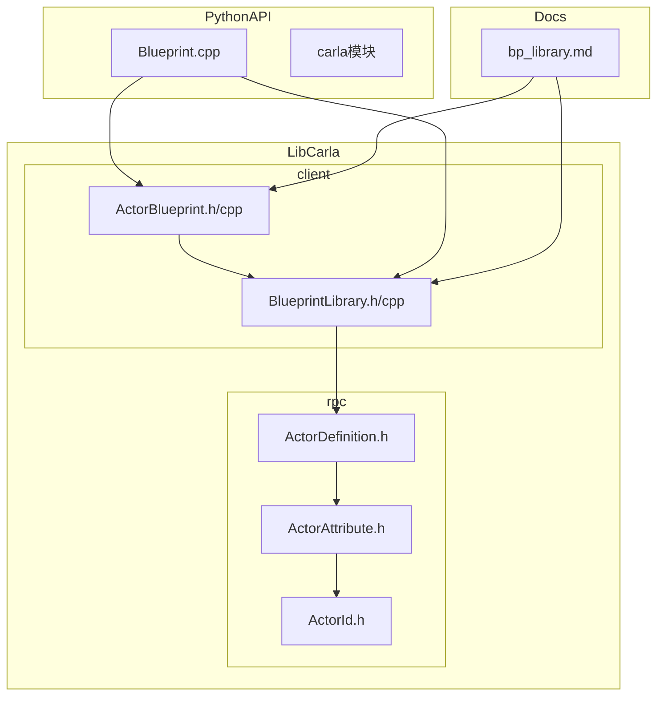
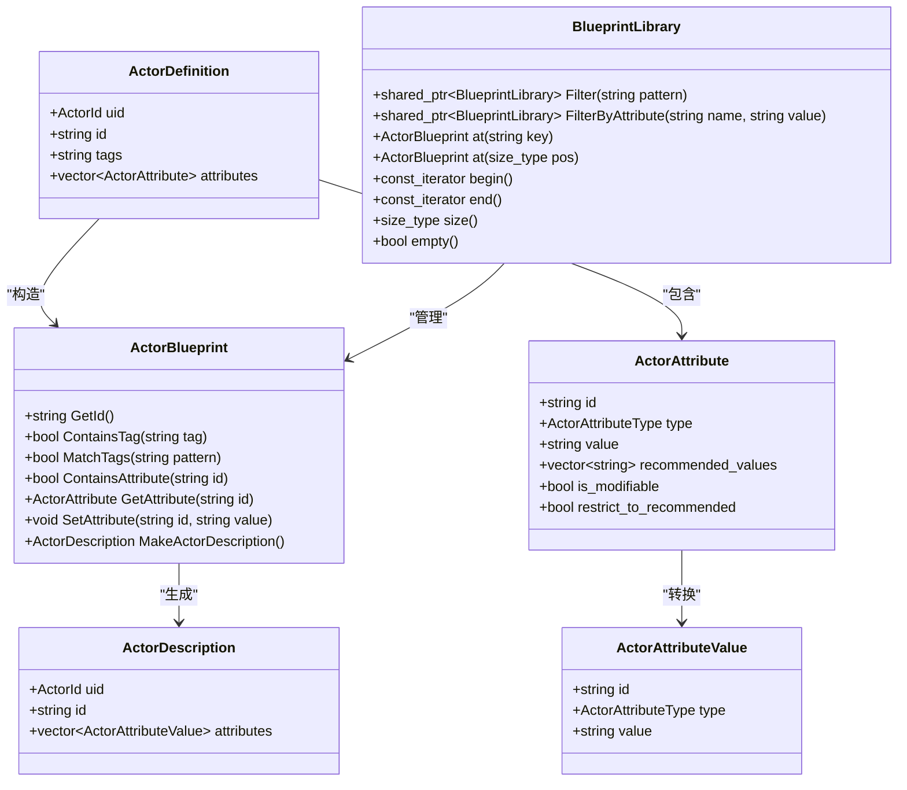
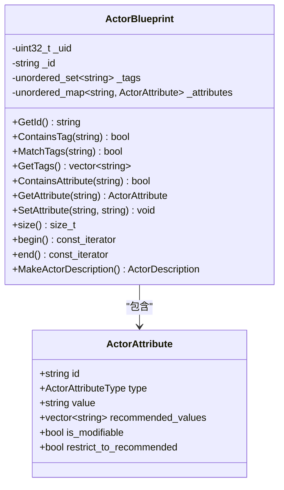
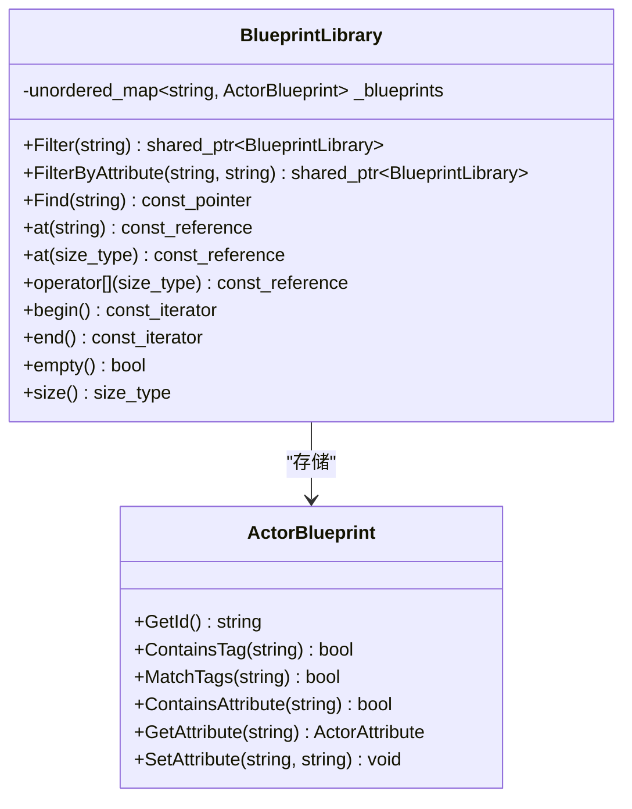
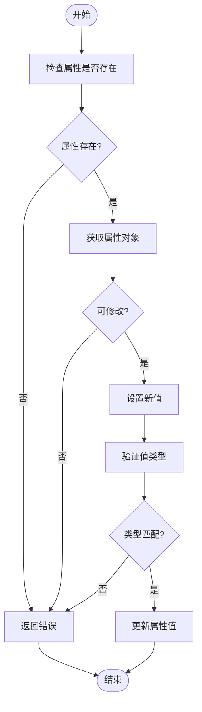
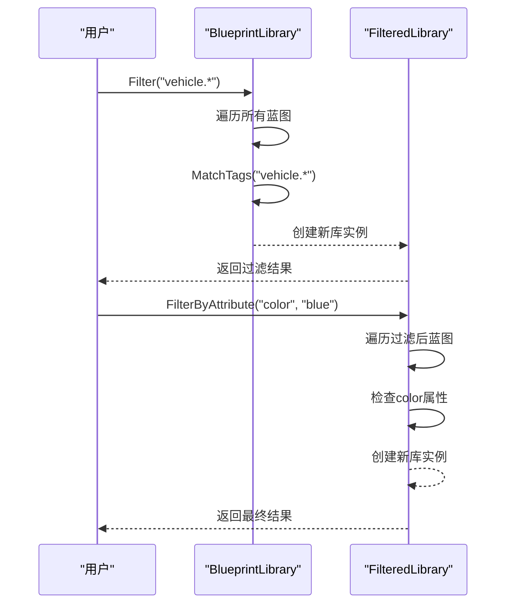
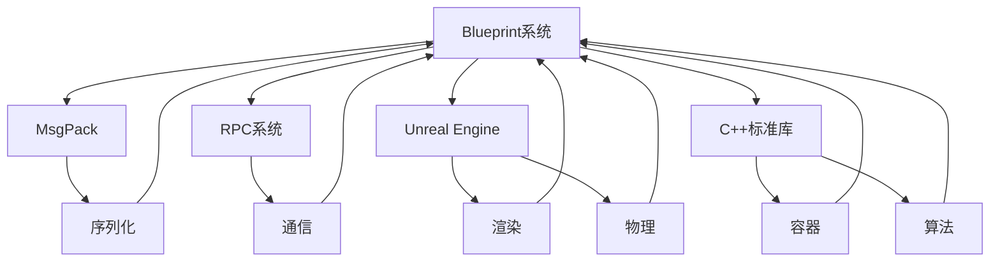

# 蓝图系统

> **引用文件**
> **本文档中引用的文件**

- [ActorBlueprint.h](https://github.com/carla-simulator/carla/blob/ue5-dev/LibCarla/source/carla/client/ActorBlueprint.h)
- [ActorBlueprint.cpp](https://github.com/carla-simulator/carla/blob/ue5-dev/LibCarla/source/carla/client/ActorBlueprint.cpp)
- [BlueprintLibrary.h](https://github.com/carla-simulator/carla/blob/ue5-dev/LibCarla/source/carla/client/BlueprintLibrary.h)
- [BlueprintLibrary.cpp](https://github.com/carla-simulator/carla/blob/ue5-dev/LibCarla/source/carla/client/BlueprintLibrary.cpp)
- [ActorDefinition.h](https://github.com/carla-simulator/carla/blob/ue5-dev/LibCarla/source/carla/rpc/ActorDefinition.h)
- [ActorDescription.h](https://github.com/carla-simulator/carla/blob/ue5-dev/LibCarla/source/carla/rpc/ActorDescription.h)
- [ActorAttribute.h](https://github.com/carla-simulator/carla/blob/ue5-dev/LibCarla/source/carla/rpc/ActorAttribute.h)
- [bp_library.md](https://github.com/carla-simulator/carla/blob/ue5-dev/Docs/bp_library.md)
- [test_blueprint.py](https://github.com/carla-simulator/carla/blob/ue5-dev/PythonAPI/test/smoke/test_blueprint.py)

## 目录

1. [简介](#简介)
2. [项目结构](#项目结构)
3. [核心组件](#核心组件)
4. [架构概述](#架构概述)
5. [详细组件分析](#详细组件分析)
6. [依赖分析](#依赖分析)
7. [性能考虑](#性能考虑)
8. [故障排除指南](#故障排除指南)
9. [结论](#结论)

## 简介

CARLA 模拟器中的蓝图系统是一个核心功能，它允许用户通过可实例化的模板来创建各种类型的模拟实体。该系统主要由两个关键类组成：ActorBlueprint 和 BlueprintLibrary。ActorBlueprint 类表示单个可实例化角色的模板，包含车辆、行人、传感器和静态物体等所有必要信息。BlueprintLibrary 类则管理这些蓝图的集合，提供过滤、查询和检索功能。本文档将深入探讨这些组件的实现细节、使用方法以及它们在模拟环境中的作用。

## 项目结构

CARLA 的蓝图系统分布在多个目录中，主要位于 LibCarla 模块的 client 子目录下。核心实现文件包括 ActorBlueprint.h/cpp 和 BlueprintLibrary.h/cpp，它们定义了蓝图的基本数据结构和操作。相关的 RPC 定义文件位于 rpc 子目录中，处理跨平台通信的数据序列化。Python API 通过 Boost.Python 绑定将这些 C++类暴露给用户，使得蓝图系统可以通过 Python 脚本进行访问和操作。文档文件位于 Docs 目录下，提供了详细的使用说明和示例。

**图源**

- [ActorBlueprint.h](https://github.com/carla-simulator/carla/blob/ue5-dev/LibCarla/source/carla/client/ActorBlueprint.h)
- [BlueprintLibrary.h](https://github.com/carla-simulator/carla/blob/ue5-dev/LibCarla/source/carla/client/BlueprintLibrary.h)
- [ActorDefinition.h](https://github.com/carla-simulator/carla/blob/ue5-dev/LibCarla/source/carla/rpc/ActorDefinition.h)
- [ActorAttribute.h](https://github.com/carla-simulator/carla/blob/ue5-dev/LibCarla/source/carla/rpc/ActorAttribute.h)

**节源**

- [ActorBlueprint.h](https://github.com/carla-simulator/carla/blob/ue5-dev/LibCarla/source/carla/client/ActorBlueprint.h)
- [BlueprintLibrary.h](https://github.com/carla-simulator/carla/blob/ue5-dev/LibCarla/source/carla/client/BlueprintLibrary.h)

## 核心组件

蓝图系统的核心组件包括 ActorBlueprint 类和 BlueprintLibrary 类。ActorBlueprint 类封装了创建模拟实体所需的所有信息，包括唯一标识符、标签、属性集合等。每个蓝图实例都代表一个可配置的模板，可以用来生成具体的模拟对象。BlueprintLibrary 类则作为一个容器，管理所有可用的蓝图实例，提供高效的查询和过滤机制。这些组件共同构成了 CARLA 模拟器中实体创建的基础框架。

**节源**

- <a href="https://github.com/carla-simulator/carla/blob/ue5-dev/LibCarla/source/carla/client/ActorBlueprint.h#L23-L121" target="_blank">ActorBlueprint.h</a>
- <a href="https://github.com/carla-simulator/carla/blob/ue5-dev/LibCarla/source/carla/client/BlueprintLibrary.h#L24-L85" target="_blank">BlueprintLibrary.h</a>

## 架构概述

蓝图系统的架构设计遵循了清晰的分层原则，从底层数据结构到高层应用接口形成了完整的体系。系统通过 ActorDefinition 结构体在客户端和服务器端之间传输蓝图数据，确保跨平台兼容性。ActorBlueprint 类作为核心数据模型，封装了蓝图的所有属性和行为。BlueprintLibrary 类提供了集合管理功能，支持基于标签和属性的高效过滤。整个系统通过消息打包（MsgPack）协议进行序列化，保证了数据传输的效率和可靠性。

**图源**

- <a href="https://github.com/carla-simulator/carla/blob/ue5-dev/LibCarla/source/carla/rpc/ActorDefinition.h#L19-L50" target="_blank">ActorDefinition.h</a>
- <a href="https://github.com/carla-simulator/carla/blob/ue5-dev/LibCarla/source/carla/rpc/ActorDescription.h#L25-L61" target="_blank">ActorDescription.h</a>
- <a href="https://github.com/carla-simulator/carla/blob/ue5-dev/LibCarla/source/carla/rpc/ActorAttribute.h#L26-L68" target="_blank">ActorAttribute.h</a>
- <a href="https://github.com/carla-simulator/carla/blob/ue5-dev/LibCarla/source/carla/client/ActorBlueprint.h#L23-L121" target="_blank">ActorBlueprint.h</a>
- <a href="https://github.com/carla-simulator/carla/blob/ue5-dev/LibCarla/source/carla/client/BlueprintLibrary.h#L24-L85" target="_blank">BlueprintLibrary.h</a>

## 详细组件分析

### ActorBlueprint 类分析

ActorBlueprint 类是蓝图系统的核心数据结构，它表示一个可实例化的角色模板。该类通过 ActorDefinition 构造，包含唯一标识符、标签集合和属性映射。蓝图的属性可以被查询和修改，支持创建具有特定特征的模拟实体。类提供了丰富的接口来访问和操作这些属性，包括检查属性存在性、获取属性值、设置新值等。此外，它还支持通过通配符模式匹配标签，便于分类和筛选。

**图源**

- <a href="https://github.com/carla-simulator/carla/blob/ue5-dev/LibCarla/source/carla/client/ActorBlueprint.h#L23-L121" target="_blank">ActorBlueprint.h</a>
- <a href="https://github.com/carla-simulator/carla/blob/ue5-dev/LibCarla/source/carla/rpc/ActorAttribute.h#L26-L68" target="_blank">ActorAttribute.h</a>

### BlueprintLibrary 类分析

BlueprintLibrary 类负责管理预定义的角色蓝图集合，提供高效的查询和过滤功能。它内部使用哈希映射存储蓝图，以蓝图 ID 作为键，实现快速查找。类提供了多种过滤方法，包括基于通配符模式的标签过滤和基于属性值的精确过滤。过滤操作返回新的 BlueprintLibrary 实例，支持链式调用。库还实现了标准容器接口，支持迭代、索引访问和大小查询，便于与现有代码集成。

**图源**

- <a href="https://github.com/carla-simulator/carla/blob/ue5-dev/LibCarla/source/carla/client/BlueprintLibrary.h#L24-L85" target="_blank">BlueprintLibrary.h</a>
- <a href="https://github.com/carla-simulator/carla/blob/ue5-dev/LibCarla/source/carla/client/ActorBlueprint.h#L23-L121" target="_blank">ActorBlueprint.h</a>

### 蓝图属性查询与修改

蓝图系统的属性系统提供了灵活的查询和修改机制。每个 ActorBlueprint 包含一个属性映射，可以通过 ID 访问特定属性。属性具有类型、值、推荐值列表和可修改性标志等元数据。用户可以检查属性是否存在，获取其当前值，并在允许的情况下设置新值。属性值的修改会直接影响后续通过该蓝图创建的实体，使得用户能够精确控制模拟对象的特征。

**图源**

- <a href="https://github.com/carla-simulator/carla/blob/ue5-dev/LibCarla/source/carla/client/ActorBlueprint.h#L74-L86" target="_blank">ActorBlueprint.h</a>
- <a href="https://github.com/carla-simulator/carla/blob/ue5-dev/LibCarla/source/carla/rpc/ActorAttribute.h#L26-L68" target="_blank">ActorAttribute.h</a>

### 蓝图过滤器机制

蓝图库提供了强大的过滤功能，支持基于标签模式和属性值的筛选。标签过滤使用 Unix shell 风格的通配符，可以匹配蓝图 ID 或任何标签。属性过滤则允许用户根据特定属性的值来筛选蓝图，支持精确匹配。这些过滤方法返回新的蓝图库实例，保留了原始库的不可变性，同时支持链式调用以实现复杂的筛选逻辑。

**图源**

- <a href="https://github.com/carla-simulator/carla/blob/ue5-dev/LibCarla/source/carla/client/BlueprintLibrary.h#L45-L46" target="_blank">BlueprintLibrary.h</a>
- <a href="https://github.com/carla-simulator/carla/blob/ue5-dev/LibCarla/source/carla/client/BlueprintLibrary.cpp#L25-L64" target="_blank">BlueprintLibrary.cpp</a>

## 依赖分析

蓝图系统依赖于多个底层组件和协议，形成了一个复杂的依赖网络。核心依赖包括消息打包（MsgPack）库用于数据序列化，RPC 系统用于跨进程通信，以及 Unreal Engine 的集成层。这些依赖确保了蓝图数据能够在不同平台和组件之间高效、可靠地传输。系统还依赖于 C++标准库的容器和算法，提供了高性能的数据结构操作。

**图源**

- <a href="https://github.com/carla-simulator/carla/blob/ue5-dev/LibCarla/source/carla/rpc/ActorDefinition.h#L9-L10" target="_blank">ActorDefinition.h</a>
- <a href="https://github.com/carla-simulator/carla/blob/ue5-dev/LibCarla/source/carla/rpc/ActorAttribute.h#L9-L10" target="_blank">ActorAttribute.h</a>
- <a href="https://github.com/carla-simulator/carla/blob/ue5-dev/LibCarla/source/carla/client/ActorBlueprint.h#L9-L12" target="_blank">ActorBlueprint.h</a>

## 性能考虑

蓝图系统的性能设计考虑了多个方面。首先，BlueprintLibrary 使用哈希映射存储蓝图，确保 O(1)平均时间复杂度的查找操作。其次，过滤操作虽然需要线性遍历，但通过返回共享指针的新实例避免了数据复制开销。属性访问和修改操作都是常数时间复杂度，保证了高效的运行性能。系统还通过预分配内存和对象重用等技术优化了内存使用，减少了动态分配的开销。

## 故障排除指南

在使用蓝图系统时可能遇到的常见问题包括：无法找到特定蓝图、属性设置失败、过滤结果为空等。这些问题通常源于蓝图 ID 拼写错误、属性不可修改或值类型不匹配。建议首先验证蓝图是否存在，然后检查属性的可修改性和推荐值列表。对于过滤操作，应确保通配符模式正确，并理解标签匹配的逻辑。调试时可以打印蓝图的详细信息，包括所有属性及其元数据。

**节源**

- [bp_library.md](https://github.com/carla-simulator/carla/blob/ue5-dev/Docs/bp_library.md)
- [test_blueprint.py](https://github.com/carla-simulator/carla/blob/ue5-dev/PythonAPI/test/smoke/test_blueprint.py)

## 结论

CARLA 的蓝图系统提供了一个强大而灵活的框架，用于创建和管理模拟环境中的各种实体。通过 ActorBlueprint 和 BlueprintLibrary 两个核心类，系统实现了高效的蓝图管理、属性配置和过滤机制。该设计不仅支持复杂的模拟场景构建，还保证了良好的性能和跨平台兼容性。未来的发展方向可能包括更高级的属性约束、动态蓝图生成和更智能的过滤算法，进一步提升系统的实用性和易用性。
