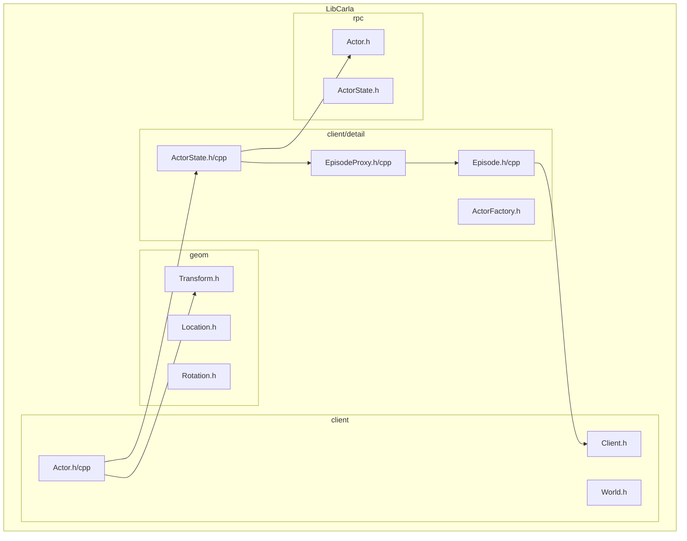
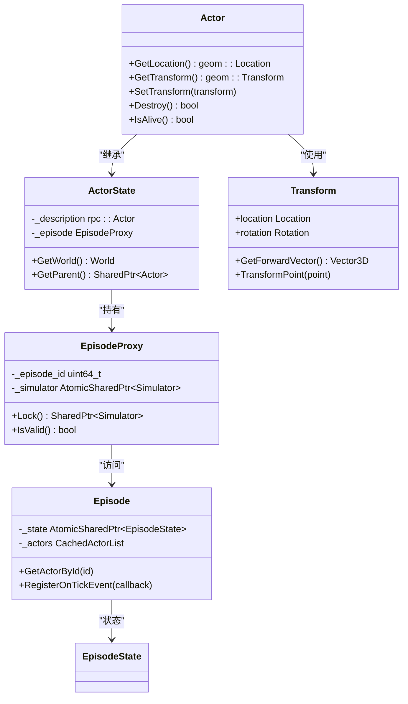
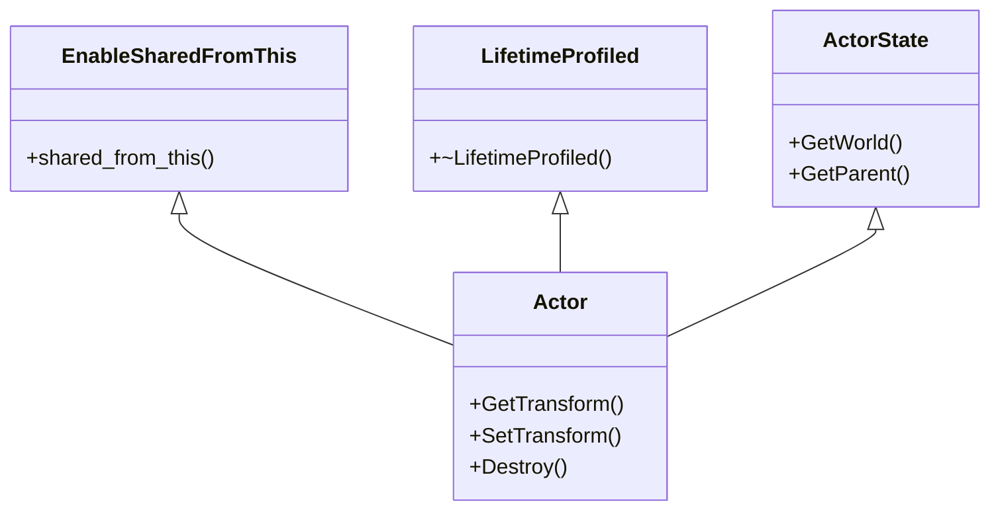
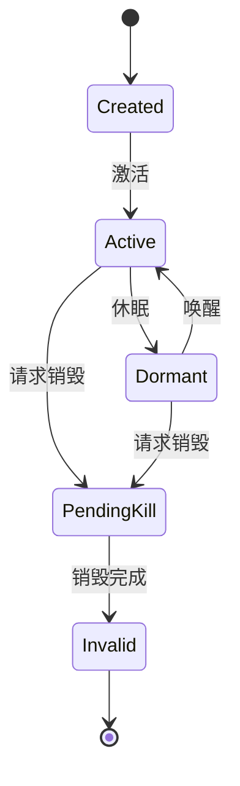
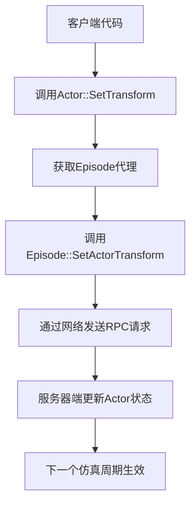
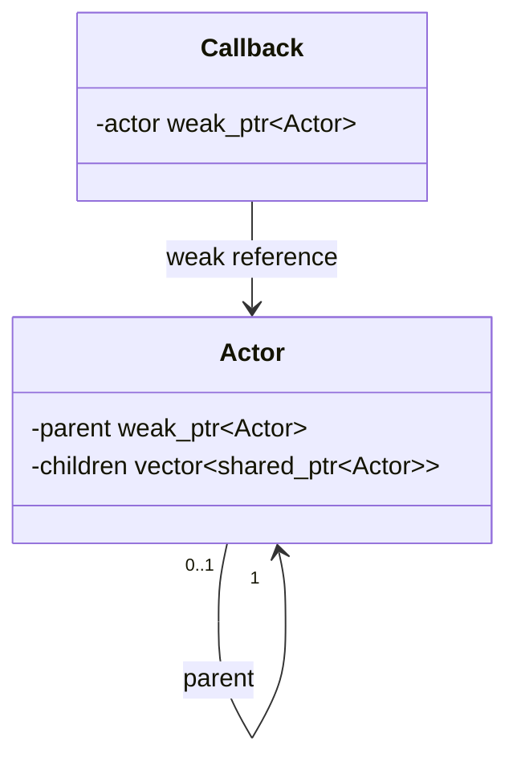
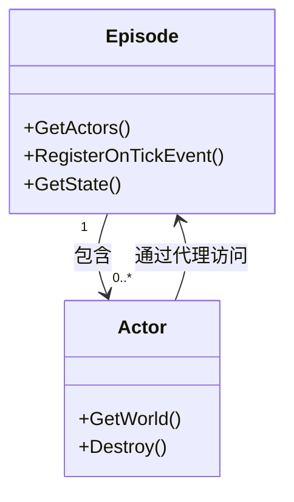
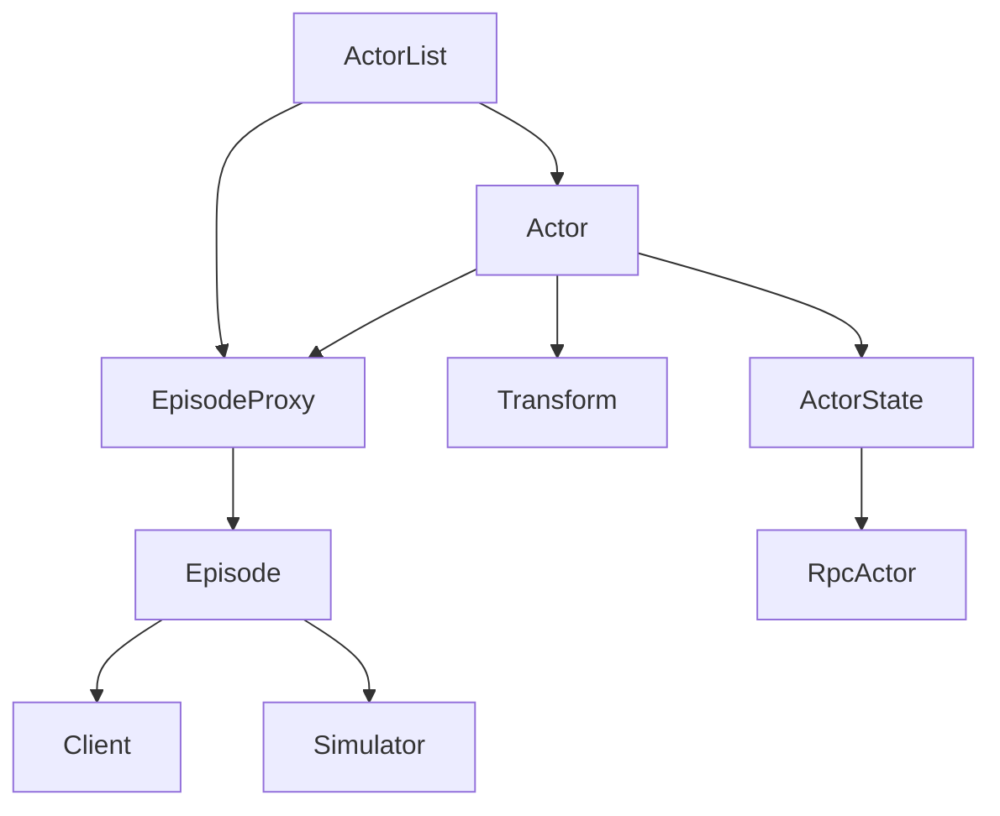

# 角色基础


**本文档中引用的文件**  
- [Actor.h](https://github.com/carla-simulator/carla/blob/ue5-dev/LibCarla/source/carla/client/Actor.h)
- [Actor.cpp](https://github.com/carla-simulator/carla/blob/ue5-dev/LibCarla/source/carla/client/Actor.cpp)
- [Transform.h](https://github.com/carla-simulator/carla/blob/ue5-dev/LibCarla/source/carla/geom/Transform.h)
- [ActorState.h](https://github.com/carla-simulator/carla/blob/ue5-dev/LibCarla/source/carla/client/detail/ActorState.h)
- [ActorState.cpp](https://github.com/carla-simulator/carla/blob/ue5-dev/LibCarla/source/carla/client/detail/ActorState.cpp)
- [Episode.h](https://github.com/carla-simulator/carla/blob/ue5-dev/LibCarla/source/carla/client/detail/Episode.h)
- [Episode.cpp](https://github.com/carla-simulator/carla/blob/ue5-dev/LibCarla/source/carla/client/detail/Episode.cpp)
- [EpisodeProxy.h](https://github.com/carla-simulator/carla/blob/ue5-dev/LibCarla/source/carla/client/detail/EpisodeProxy.h)
- [EpisodeProxy.cpp](https://github.com/carla-simulator/carla/blob/ue5-dev/LibCarla/source/carla/client/detail/EpisodeProxy.cpp)
- [ActorList.h](https://github.com/carla-simulator/carla/blob/ue5-dev/LibCarla/source/carla/client/ActorList.h)
- [rpc/ActorState.h](https://github.com/carla-simulator/carla/blob/ue5-dev/LibCarla/source/carla/rpc/ActorState.h)
- [ActorFactory.h](https://github.com/carla-simulator/carla/blob/ue5-dev/LibCarla/source/carla/client/detail/ActorFactory.h)


## 目录
1. [简介](#简介)
2. [项目结构](#项目结构)
3. [核心组件](#核心组件)
4. [架构概述](#架构概述)
5. [详细组件分析](#详细组件分析)
6. [依赖分析](#依赖分析)
7. [性能考虑](#性能考虑)
8. [故障排除指南](#故障排除指南)
9. [结论](#结论)

## 简介
本文档详细介绍了CARLA仿真平台中Actor基类的设计与实现。文档涵盖了Actor的生命周期管理、变换操作、引用计数机制、智能指针管理策略以及与Episode（场景）的关联关系。通过深入分析核心类和方法，本文档为开发者提供了全面的理解，以便在仿真环境中有效使用和扩展Actor系统。

## 项目结构
CARLA的Actor系统主要位于LibCarla模块的client子目录中，其结构体现了清晰的分层设计。核心Actor类位于`client/`目录下，而其内部状态和代理机制则分布在`client/detail/`子目录中。几何变换相关的功能独立在`geom/`目录中，体现了关注点分离的设计原则。



**图源**
- [Actor.h](https://github.com/carla-simulator/carla/blob/ue5-dev/LibCarla/source/carla/client/Actor.h)
- [Episode.h](https://github.com/carla-simulator/carla/blob/ue5-dev/LibCarla/source/carla/client/detail/Episode.h)
- [Transform.h](https://github.com/carla-simulator/carla/blob/ue5-dev/LibCarla/source/carla/geom/Transform.h)

**本节来源**
- [Actor.h](https://github.com/carla-simulator/carla/blob/ue5-dev/LibCarla/source/carla/client/Actor.h)
- [Episode.h](https://github.com/carla-simulator/carla/blob/ue5-dev/LibCarla/source/carla/client/detail/Episode.h)
- [Transform.h](https://github.com/carla-simulator/carla/blob/ue5-dev/LibCarla/source/carla/geom/Transform.h)

## 核心组件
Actor基类是CARLA仿真系统中所有可移动实体的核心抽象。它通过继承`EnableSharedFromThis<Actor>`实现了安全的共享指针管理，并通过`detail::ActorState`类继承了其基本状态和行为。Actor类的设计强调了与仿真环境的解耦，所有与仿真器的交互都通过`Episode`代理进行。

**本节来源**
- [Actor.h](https://github.com/carla-simulator/carla/blob/ue5-dev/LibCarla/source/carla/client/Actor.h#L18-L158)
- [ActorState.h](https://github.com/carla-simulator/carla/blob/ue5-dev/LibCarla/source/carla/client/detail/ActorState.h#L22-L87)

## 架构概述
CARLA的Actor系统采用了一种客户端-服务器分离的架构，其中Actor对象存在于客户端，而其真实状态和行为由服务器端的仿真环境管理。这种设计通过`EpisodeProxy`模式实现了安全的跨线程访问和生命周期管理。



**图源**
- [Actor.h](https://github.com/carla-simulator/carla/blob/ue5-dev/LibCarla/source/carla/client/Actor.h)
- [ActorState.h](https://github.com/carla-simulator/carla/blob/ue5-dev/LibCarla/source/carla/client/detail/ActorState.h)
- [EpisodeProxy.h](https://github.com/carla-simulator/carla/blob/ue5-dev/LibCarla/source/carla/client/detail/EpisodeProxy.h)
- [Episode.h](https://github.com/carla-simulator/carla/blob/ue5-dev/LibCarla/source/carla/client/detail/Episode.h)
- [Transform.h](https://github.com/carla-simulator/carla/blob/ue5-dev/LibCarla/source/carla/geom/Transform.h)

## 详细组件分析

### Actor基类分析
Actor基类作为所有仿真实体的基类，提供了统一的接口来访问和操作仿真中的对象。其设计遵循了现代C++的最佳实践，包括使用智能指针进行内存管理、通过代理模式实现安全的跨线程访问，以及通过继承层次结构实现功能扩展。

#### 类设计与继承
Actor类通过多重继承组合了不同的功能：
- `EnableSharedFromThis<Actor>`：允许对象安全地生成指向自身的`shared_ptr`，这对于回调和事件处理至关重要。
- `profiler::LifetimeProfiled`：用于性能分析，跟踪对象的生命周期。
- `detail::ActorState`：提供Actor的基本状态和与仿真环境的连接。



**图源**
- [Actor.h](https://github.com/carla-simulator/carla/blob/ue5-dev/LibCarla/source/carla/client/Actor.h#L19-L21)

**本节来源**
- [Actor.h](https://github.com/carla-simulator/carla/blob/ue5-dev/LibCarla/source/carla/client/Actor.h#L18-L158)

#### 生命周期管理
Actor的生命周期由创建、激活和销毁三个阶段组成。Actor的创建由`ActorFactory`类管理，该类负责根据蓝图描述符实例化具体的Actor对象。Actor的销毁通过`Destroy()`方法触发，该方法会向仿真器发送销毁请求，并在成功后返回true。

Actor的状态通过`rpc::ActorState`枚举进行管理，包括：
- `Invalid`：无效状态，通常表示Actor已被销毁
- `Active`：活跃状态，Actor正常参与仿真
- `Dormant`：休眠状态，Actor存在但不参与仿真
- `PendingKill`：待销毁状态，Actor即将被移除



**图源**
- [Actor.h](https://github.com/carla-simulator/carla/blob/ue5-dev/LibCarla/source/carla/client/Actor.h#L133-L143)
- [rpc/ActorState.h](https://github.com/carla-simulator/carla/blob/ue5-dev/LibCarla/source/carla/rpc/ActorState.h#L14-L19)

**本节来源**
- [Actor.h](https://github.com/carla-simulator/carla/blob/ue5-dev/LibCarla/source/carla/client/Actor.h#L133-L152)
- [Actor.cpp](https://github.com/carla-simulator/carla/blob/ue5-dev/LibCarla/source/carla/client/Actor.cpp#L127-L138)

### 变换操作实现
变换（Transform）是Actor在三维空间中位置、旋转和缩放的综合表示。在CARLA中，变换由`geom::Transform`类实现，它包含一个`Location`（位置）和一个`Rotation`（旋转）成员。

#### API使用方法
Actor提供了多种方法来获取和设置其变换状态：

| 方法 | 描述 | 线程安全性 |
|------|------|-----------|
| `GetTransform()` | 获取Actor的当前变换 | 线程安全，返回上一个仿真周期的数据 |
| `SetTransform(transform)` | 将Actor瞬移到指定变换位置 | 线程安全，通过Episode代理调用仿真器 |
| `GetLocation()` | 获取Actor的当前位置 | 线程安全 |
| `SetLocation(location)` | 将Actor瞬移到指定位置 | 线程安全 |



**图源**
- [Actor.h](https://github.com/carla-simulator/carla/blob/ue5-dev/LibCarla/source/carla/client/Actor.h#L79-L80)
- [Actor.cpp](https://github.com/carla-simulator/carla/blob/ue5-dev/LibCarla/source/carla/client/Actor.cpp#L49-L51)
- [Transform.h](https://github.com/carla-simulator/carla/blob/ue5-dev/LibCarla/source/carla/geom/Transform.h)

**本节来源**
- [Actor.h](https://github.com/carla-simulator/carla/blob/ue5-dev/LibCarla/source/carla/client/Actor.h#L39-L80)
- [Actor.cpp](https://github.com/carla-simulator/carla/blob/ue5-dev/LibCarla/source/carla/client/Actor.cpp#L19-L51)

### 引用计数与智能指针管理
CARLA系统广泛使用智能指针来管理Actor的生命周期，避免了手动内存管理的复杂性和潜在的内存泄漏问题。

#### 智能指针策略
Actor类通过继承`EnableSharedFromThis<Actor>`，允许安全地创建指向自身的`shared_ptr`。这种设计在事件回调和异步操作中尤为重要，确保了在回调执行时对象仍然有效。

引用计数机制通过`std::shared_ptr`和`std::weak_ptr`的组合使用来实现：
- `shared_ptr`：表示对对象的强引用，增加引用计数
- `weak_ptr`：表示对对象的弱引用，不增加引用计数，用于打破循环引用

#### 循环引用避免
循环引用是智能指针管理中的常见问题。CARLA通过以下策略避免循环引用：
1. 父子关系中，父对象使用`shared_ptr`引用子对象，子对象使用`weak_ptr`引用父对象
2. 回调系统中，使用`weak_ptr`捕获对象，避免因回调未执行而导致对象无法释放



**图源**
- [ActorState.h](https://github.com/carla-simulator/carla/blob/ue5-dev/LibCarla/source/carla/client/detail/ActorState.h#L45)
- [Actor.h](https://github.com/carla-simulator/carla/blob/ue5-dev/LibCarla/source/carla/client/Actor.h)

**本节来源**
- [ActorState.h](https://github.com/carla-simulator/carla/blob/ue5-dev/LibCarla/source/carla/client/detail/ActorState.h#L45-L54)
- [ActorState.cpp](https://github.com/carla-simulator/carla/blob/ue5-dev/LibCarla/source/carla/client/detail/ActorState.cpp#L31-L34)

### Actor状态与事件监听
Actor系统提供了丰富的API来获取状态信息和监听事件，使开发者能够实时响应仿真环境的变化。

#### 状态获取
可以通过以下方法获取Actor的当前状态：
- `GetLocation()`：获取位置
- `GetVelocity()`：获取速度
- `GetAngularVelocity()`：获取角速度
- `GetAcceleration()`：获取加速度
- `GetActorState()`：获取Actor的枚举状态

#### 事件监听
CARLA通过回调机制支持事件监听。虽然Actor类本身不直接提供事件注册方法，但可以通过`Episode`对象注册全局事件，如每帧更新、地图变更等。

```mermaid
sequenceDiagram
participant Client as 客户端
participant Actor as Actor
participant Episode as Episode
participant Simulator as 仿真器
Client->>Actor : GetTransform()
Actor->>Episode : Lock()
Episode->>Simulator : GetActorTransform(*this)
Simulator-->>Episode : 返回变换
Episode-->>Actor : 返回变换
Actor-->>Client : 返回变换
```

**图源**
- [Actor.h](https://github.com/carla-simulator/carla/blob/ue5-dev/LibCarla/source/carla/client/Actor.h#L39-L43)
- [Actor.cpp](https://github.com/carla-simulator/carla/blob/ue5-dev/LibCarla/source/carla/client/Actor.cpp#L19-L21)
- [Episode.h](https://github.com/carla-simulator/carla/blob/ue5-dev/LibCarla/source/carla/client/detail/Episode.h)

**本节来源**
- [Actor.h](https://github.com/carla-simulator/carla/blob/ue5-dev/LibCarla/source/carla/client/Actor.h#L33-L67)
- [Actor.cpp](https://github.com/carla-simulator/carla/blob/ue5-dev/LibCarla/source/carla/client/Actor.cpp#L15-L43)

### 标签系统与角色查找
CARLA提供了基于标签的Actor查找机制，使开发者能够根据语义信息快速定位特定类型的Actor。

#### 标签系统
每个Actor都关联一组语义标签（semantic tags），这些标签定义了Actor的类型和属性。标签系统支持通配符匹配，便于进行灵活的查询操作。

#### 角色查找
通过`ActorList`类提供的`Filter`方法，可以根据类型ID的通配符模式筛选Actor。例如，可以查找所有以"vehicle"开头的车辆Actor。

```cpp
// 示例：查找所有车辆
auto vehicles = world.GetActors()->Filter("vehicle.*");
```

**本节来源**
- [ActorState.h](https://github.com/carla-simulator/carla/blob/ue5-dev/LibCarla/source/carla/client/detail/ActorState.h#L41-L43)
- [ActorList.h](https://github.com/carla-simulator/carla/blob/ue5-dev/LibCarla/source/carla/client/ActorList.h#L34)

### Actor与Episode关联关系
Actor与Episode（场景）的关联是CARLA仿真系统的核心概念。Episode代表了一个独立的仿真环境实例，而Actor则是该环境中的参与者。

#### 关联机制
每个Actor都持有一个`EpisodeProxy`对象，该对象提供了访问当前Episode的受保护接口。`EpisodeProxy`通过检查Episode ID来确保Actor只能访问其所属的Episode，从而实现了安全的跨场景隔离。

#### 在仿真环境中的作用
Episode作为仿真环境的容器，负责管理所有Actor的生命周期、处理物理模拟、并提供世界状态的快照。Actor通过其Episode代理与仿真环境交互，实现了客户端与服务器端的解耦。



**图源**
- [Episode.h](https://github.com/carla-simulator/carla/blob/ue5-dev/LibCarla/source/carla/client/detail/Episode.h)
- [ActorState.h](https://github.com/carla-simulator/carla/blob/ue5-dev/LibCarla/source/carla/client/detail/ActorState.h#L47)

**本节来源**
- [Episode.h](https://github.com/carla-simulator/carla/blob/ue5-dev/LibCarla/source/carla/client/detail/Episode.h)
- [ActorState.h](https://github.com/carla-simulator/carla/blob/ue5-dev/LibCarla/source/carla/client/detail/ActorState.h#L47)

## 依赖分析
Actor系统依赖于多个核心组件，形成了一个复杂的依赖网络。主要依赖关系包括：



**图源**
- [Actor.h](https://github.com/carla-simulator/carla/blob/ue5-dev/LibCarla/source/carla/client/Actor.h)
- [Episode.h](https://github.com/carla-simulator/carla/blob/ue5-dev/LibCarla/source/carla/client/detail/Episode.h)
- [ActorList.h](https://github.com/carla-simulator/carla/blob/ue5-dev/LibCarla/source/carla/client/ActorList.h)

**本节来源**
- [Actor.h](https://github.com/carla-simulator/carla/blob/ue5-dev/LibCarla/source/carla/client/Actor.h)
- [Episode.h](https://github.com/carla-simulator/carla/blob/ue5-dev/LibCarla/source/carla/client/detail/Episode.h)
- [ActorList.h](https://github.com/carla-simulator/carla/blob/ue5-dev/LibCarla/source/carla/client/ActorList.h)

## 性能考虑
Actor系统的性能主要受以下几个因素影响：
1. **频繁的状态查询**：`Get`系列方法虽然线程安全，但频繁调用可能影响性能。建议在每帧只获取一次状态，并在本地缓存。
2. **变换计算**：复杂的变换操作（如矩阵计算）应尽量减少调用频率。
3. **事件回调**：过多的事件回调可能影响主线程性能，建议合理使用并及时注销不再需要的回调。

## 故障排除指南
### 常见问题
1. **Actor销毁后访问**：尝试访问已销毁的Actor会抛出运行时异常。应始终检查`IsAlive()`状态。
2. **跨Episode访问**：Actor不能跨Episode访问，尝试这样做会抛出异常。
3. **循环引用导致内存泄漏**：未正确使用`weak_ptr`可能导致Actor无法被正确销毁。

**本节来源**
- [Actor.h](https://github.com/carla-simulator/carla/blob/ue5-dev/LibCarla/source/carla/client/Actor.h#L133-L143)
- [EpisodeProxy.cpp](https://github.com/carla-simulator/carla/blob/ue5-dev/LibCarla/source/carla/client/detail/EpisodeProxy.cpp#L38-L46)

## 结论
CARLA的Actor基类设计体现了现代C++软件工程的最佳实践，通过智能指针、代理模式和清晰的分层架构，实现了高效、安全且易于扩展的仿真实体管理系统。理解Actor的生命周期、变换操作、引用计数机制以及与Episode的关联关系，对于在CARLA平台上开发复杂的仿真应用至关重要。