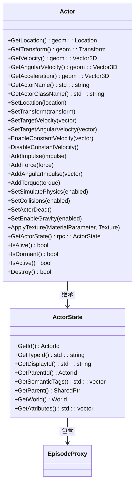
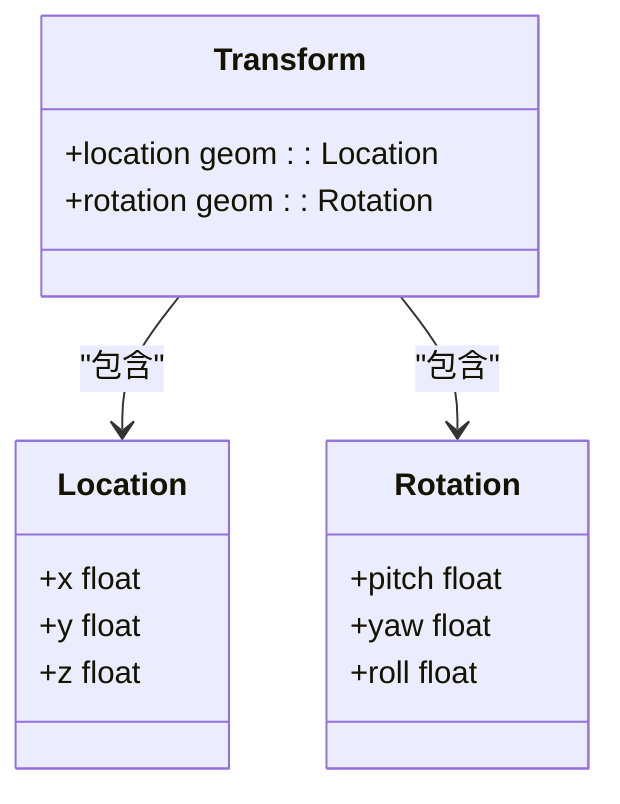
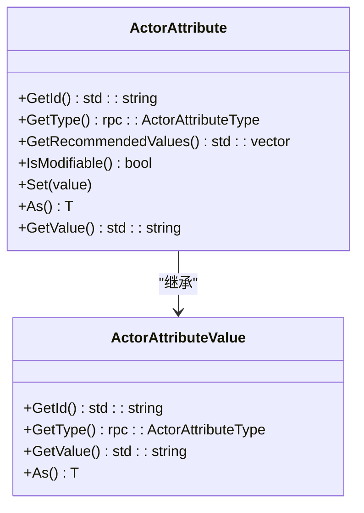
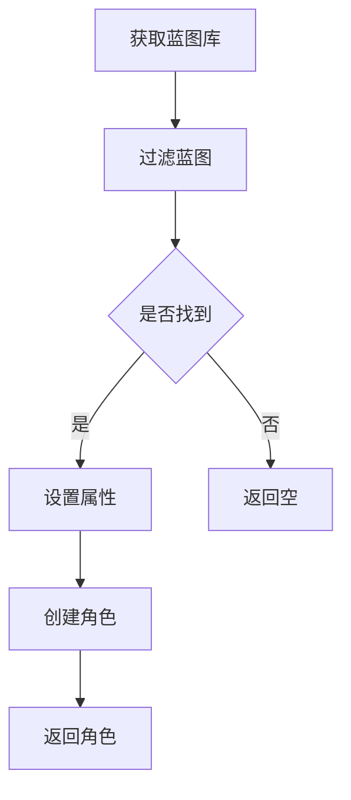
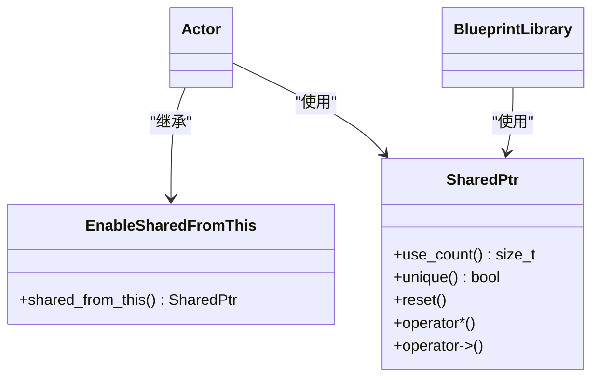
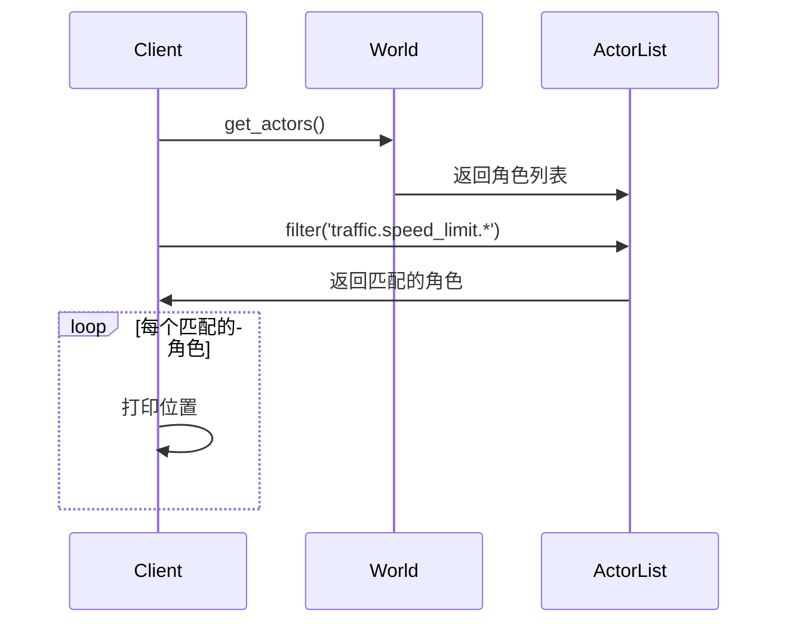

# 角色系统

> **引用文件**
> **本文档中引用的文件**

- [Actor.h](https://github.com/carla-simulator/carla/blob/ue5-dev/LibCarla/source/carla/client/Actor.h)
- [Actor.cpp](https://github.com/carla-simulator/carla/blob/ue5-dev/LibCarla/source/carla/client/Actor.cpp)
- [ActorAttribute.h](https://github.com/carla-simulator/carla/blob/ue5-dev/LibCarla/source/carla/client/ActorAttribute.h)
- [ActorAttribute.cpp](https://github.com/carla-simulator/carla/blob/ue5-dev/LibCarla/source/carla/client/ActorAttribute.cpp)
- [BlueprintLibrary.h](https://github.com/carla-simulator/carla/blob/ue5-dev/LibCarla/source/carla/client/BlueprintLibrary.h)
- [BlueprintLibrary.cpp](https://github.com/carla-simulator/carla/blob/ue5-dev/LibCarla/source/carla/client/BlueprintLibrary.cpp)
- [ActorBlueprint.h](https://github.com/carla-simulator/carla/blob/ue5-dev/LibCarla/source/carla/client/ActorBlueprint.h)
- [ActorBlueprint.cpp](https://github.com/carla-simulator/carla/blob/ue5-dev/LibCarla/source/carla/client/ActorBlueprint.cpp)
- [ActorState.h](https://github.com/carla-simulator/carla/blob/ue5-dev/LibCarla/source/carla/client/detail/ActorState.h)
- [ActorState.cpp](https://github.com/carla-simulator/carla/blob/ue5-dev/LibCarla/source/carla/client/detail/ActorState.cpp)
- [Walker.h](https://github.com/carla-simulator/carla/blob/ue5-dev/LibCarla/source/carla/client/Walker.h)
- [Vehicle.h](https://github.com/carla-simulator/carla/blob/ue5-dev/LibCarla/source/carla/client/Vehicle.h)
- [core_actors.md](https://github.com/carla-simulator/carla/blob/ue5-dev/Docs/core_actors.md)
- [bp_library.md](https://github.com/carla-simulator/carla/blob/ue5-dev/Docs/bp_library.md)

## 目录

1. [简介](#简介)
2. [Actor 基类与生命周期管理](#actor基类与生命周期管理)
3. [变换操作](#变换操作)
4. [属性系统](#属性系统)
5. [蓝图系统](#蓝图系统)
6. [预定义角色模板](#预定义角色模板)
7. [引用计数与智能指针](#引用计数与智能指针)
8. [角色查询与事件监听](#角色查询与事件监听)
9. [结论](#结论)

## 简介

CARLA 中的角色（Actor）是模拟环境中执行动作的实体，包括车辆、行人、传感器、交通信号灯和观察者等。本系统文档详细说明了从 Actor 基类开始的角色系统架构，涵盖生命周期管理、变换操作、属性系统、蓝图系统、预定义模板、引用计数机制以及角色查询和事件监听功能。

**Section sources**

- <a href="https://github.com/carla-simulator/carla/blob/ue5-dev/Docs/core_actors.md#L3-L320" target="_blank">core_actors.md</a>

## Actor 基类与生命周期管理

Actor 基类是所有模拟实体的抽象基类，提供了统一的接口和功能。它继承自`EnableSharedFromThis<Actor>`，支持共享指针管理，并通过`detail::ActorState`管理内部状态。



**Diagram sources**

- <a href="https://github.com/carla-simulator/carla/blob/ue5-dev/LibCarla/source/carla/client/Actor.h#L18-L158" target="_blank">Actor.h</a>
- <a href="https://github.com/carla-simulator/carla/blob/ue5-dev/LibCarla/source/carla/client/detail/ActorState.h#L22-L87" target="_blank">ActorState.h</a>

角色的生命周期包括创建、激活、休眠和销毁四个阶段。通过`IsAlive()`、`IsDormant()`和`IsActive()`方法可以查询角色的当前状态。角色的销毁通过`Destroy()`方法实现，该方法会阻塞直到模拟器完成销毁操作。

**Section sources**

- <a href="https://github.com/carla-simulator/carla/blob/ue5-dev/LibCarla/source/carla/client/Actor.h#L133-L152" target="_blank">Actor.h</a>
- <a href="https://github.com/carla-simulator/carla/blob/ue5-dev/LibCarla/source/carla/client/Actor.cpp#L127-L138" target="_blank">Actor.cpp</a>

## 变换操作

角色的变换操作包括位置、旋转和缩放的设置与查询。这些操作通过`geom::Transform`类来表示，包含位置和旋转信息。



**Diagram sources**

- <a href="https://github.com/carla-simulator/carla/blob/ue5-dev/LibCarla/source/carla/client/Actor.h#L39-L43" target="_blank">Actor.h</a>
- <a href="https://github.com/carla-simulator/carla/blob/ue5-dev/LibCarla/source/carla/client/Actor.cpp#L19-L21" target="_blank">Actor.cpp</a>

通过`GetTransform()`方法可以获取角色的当前变换，而`SetTransform()`方法可以设置角色的新变换。位置和旋转也可以单独设置，分别使用`SetLocation()`和`SetTransform()`方法。

**Section sources**

- <a href="https://github.com/carla-simulator/carla/blob/ue5-dev/LibCarla/source/carla/client/Actor.h#L75-L79" target="_blank">Actor.h</a>
- <a href="https://github.com/carla-simulator/carla/blob/ue5-dev/LibCarla/source/carla/client/Actor.cpp#L45-L51" target="_blank">Actor.cpp</a>

## 属性系统

角色的属性系统通过`ActorAttribute`类来表示，包含了角色的可配置参数。每个属性都有一个 ID、类型和值，以及是否可修改的标志。



**Diagram sources**

- <a href="https://github.com/carla-simulator/carla/blob/ue5-dev/LibCarla/source/carla/client/ActorAttribute.h#L184-L233" target="_blank">ActorAttribute.h</a>
- <a href="https://github.com/carla-simulator/carla/blob/ue5-dev/LibCarla/source/carla/client/ActorAttribute.cpp#L22-L31" target="_blank">ActorAttribute.cpp</a>

属性的类型包括布尔值、整数、浮点数、字符串和 RGB 颜色。通过`As<T>()`模板方法可以将属性值转换为指定类型，如果转换失败会抛出`BadAttributeCast`异常。`Set()`方法用于设置属性值，如果属性不可修改或值格式不匹配会抛出`InvalidAttributeValue`异常。

**Section sources**

- <a href="https://github.com/carla-simulator/carla/blob/ue5-dev/LibCarla/source/carla/client/ActorAttribute.h#L65-L81" target="_blank">ActorAttribute.h</a>
- <a href="https://github.com/carla-simulator/carla/blob/ue5-dev/LibCarla/source/carla/client/ActorAttribute.cpp#L34-L90" target="_blank">ActorAttribute.cpp</a>

## 蓝图系统

蓝图系统通过`ActorBlueprint`类来表示，包含了创建角色所需的所有信息。蓝图可以从蓝图库中获取，并可以设置属性来配置角色。

```mermaid
classDiagram
class ActorBlueprint {
+GetId() std : : string
+ContainsTag(tag) bool
+MatchTags(wildcard_pattern) bool
+GetTags() std : : vector<std : : string>
+ContainsAttribute(id) bool
+GetAttribute(id) ActorAttribute
+SetAttribute(id, value)
+MakeActorDescription() rpc : : ActorDescription
}
class BlueprintLibrary {
+Filter(wildcard_pattern) SharedPtr<BlueprintLibrary>
+FilterByAttribute(name, value) SharedPtr<BlueprintLibrary>
+Find(key) const_pointer
+at(key) const_reference
+operator[] pos const_reference
+begin() const_iterator
+end() const_iterator
+empty() bool
+size() size_type
}
ActorBlueprint --> std : : unordered_map : "包含"
BlueprintLibrary --> std : : unordered_map : "包含"
```

**Diagram sources**

- <a href="https://github.com/carla-simulator/carla/blob/ue5-dev/LibCarla/source/carla/client/ActorBlueprint.h#L23-L121" target="_blank">ActorBlueprint.h</a>
- <a href="https://github.com/carla-simulator/carla/blob/ue5-dev/LibCarla/source/carla/client/BlueprintLibrary.h#L24-L85" target="_blank">BlueprintLibrary.h</a>

通过`BlueprintLibrary`的`Filter()`方法可以使用通配符模式过滤蓝图，`FilterByAttribute()`方法可以根据属性值过滤蓝图。`Find()`和`at()`方法可以查找特定的蓝图。

**Section sources**

- <a href="https://github.com/carla-simulator/carla/blob/ue5-dev/LibCarla/source/carla/client/BlueprintLibrary.h#L45-L47" target="_blank">BlueprintLibrary.h</a>
- <a href="https://github.com/carla-simulator/carla/blob/ue5-dev/LibCarla/source/carla/client/BlueprintLibrary.cpp#L25-L65" target="_blank">BlueprintLibrary.cpp</a>

## 预定义角色模板

预定义角色模板存储在蓝图库中，可以通过 ID 或标签来查找。车辆和行人的蓝图都有生成属性，指示它们是新资产（gen 2）还是旧资产（gen 1）。



**Diagram sources**

- <a href="https://github.com/carla-simulator/carla/blob/ue5-dev/Docs/bp_library.md#L1-L800" target="_blank">bp_library.md</a>

例如，可以通过`blueprint_library.filter('vehicle.*.*')`随机选择一个车辆蓝图，或通过`blueprint_library.find('sensor.other.collision')`查找特定的传感器蓝图。可修改的属性可以通过`SetAttribute()`方法设置，推荐值列表可以通过`GetRecommendedValues()`方法获取。

**Section sources**

- <a href="https://github.com/carla-simulator/carla/blob/ue5-dev/Docs/bp_library.md#L30-L57" target="_blank">bp_library.md</a>
- <a href="https://github.com/carla-simulator/carla/blob/ue5-dev/Docs/core_actors.md#L30-L47" target="_blank">core_actors.md</a>

## 引用计数与智能指针

角色系统使用智能指针和引用计数来管理内存。`Actor`类继承自`EnableSharedFromThis<Actor>`，允许创建指向自身的`shared_ptr`。`BlueprintLibrary`使用`SharedPtr<BlueprintLibrary>`来管理蓝图库的生命周期。



**Diagram sources**

- <a href="https://github.com/carla-simulator/carla/blob/ue5-dev/LibCarla/source/carla/client/Actor.h#L19-L20" target="_blank">Actor.h</a>
- <a href="https://github.com/carla-simulator/carla/blob/ue5-dev/LibCarla/source/carla/client/BlueprintLibrary.h#L25-L26" target="_blank">BlueprintLibrary.h</a>

当角色被销毁时，其引用计数会减少，当引用计数为 0 时，角色对象会被自动删除。这种机制确保了内存的安全管理，避免了内存泄漏和悬空指针。

**Section sources**

- <a href="https://github.com/carla-simulator/carla/blob/ue5-dev/LibCarla/source/carla/client/Actor.h#L19-L20" target="_blank">Actor.h</a>
- <a href="https://github.com/carla-simulator/carla/blob/ue5-dev/LibCarla/source/carla/client/BlueprintLibrary.h#L25-L26" target="_blank">BlueprintLibrary.h</a>

## 角色查询与事件监听

角色系统提供了多种方法来查询角色状态和监听角色事件。可以通过标签系统查找特定角色，例如查找所有速度限制标志。



**Diagram sources**

- <a href="https://github.com/carla-simulator/carla/blob/ue5-dev/Docs/core_actors.md#L110-L117" target="_blank">core_actors.md</a>

通过`GetActorState()`方法可以获取角色的当前状态，`GetVelocity()`和`GetAcceleration()`方法可以获取角色的速度和加速度。对于车辆，还可以通过`GetTrafficLightState()`和`IsAtTrafficLight()`方法获取交通灯状态。

**Section sources**

- <a href="https://github.com/carla-simulator/carla/blob/ue5-dev/LibCarla/source/carla/client/Actor.h#L131-L143" target="_blank">Actor.h</a>
- <a href="https://github.com/carla-simulator/carla/blob/ue5-dev/Docs/core_actors.md#L110-L117" target="_blank">core_actors.md</a>

## 结论

CARLA 的角色系统提供了一个强大而灵活的框架，用于创建和管理模拟环境中的各种实体。通过 Actor 基类、属性系统、蓝图系统和智能指针管理，开发者可以轻松地创建、配置和控制角色，实现复杂的模拟场景。

**Section sources**

- <a href="https://github.com/carla-simulator/carla/blob/ue5-dev/Docs/core_actors.md#L303-L320" target="_blank">core_actors.md</a>
