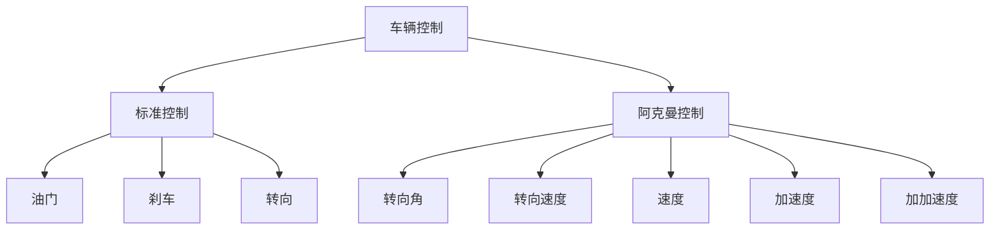
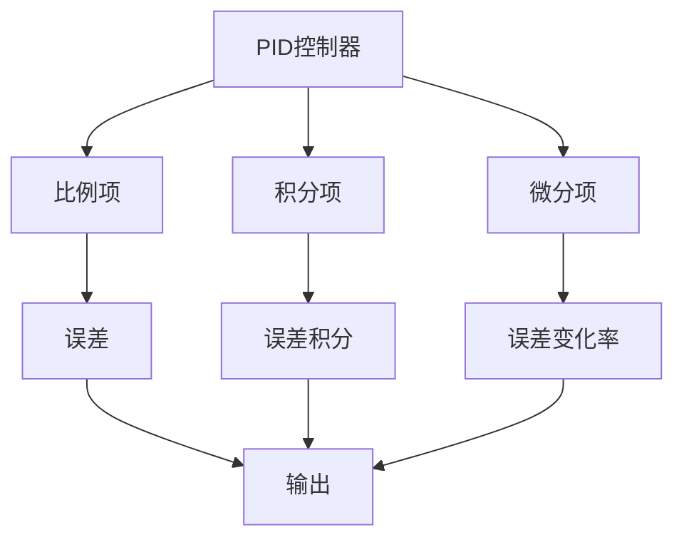
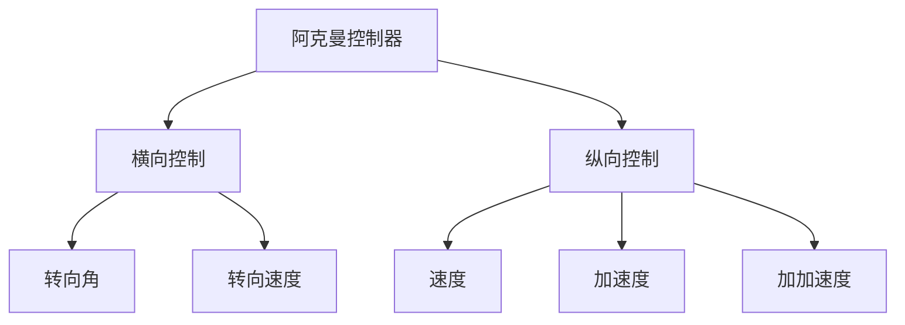
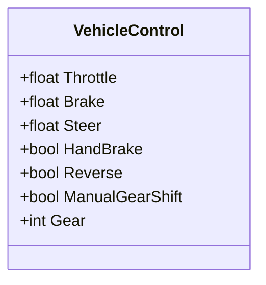
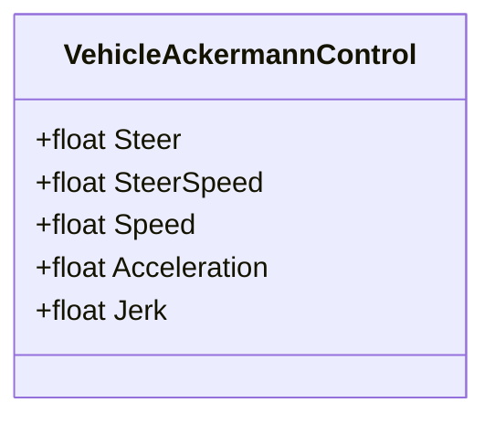
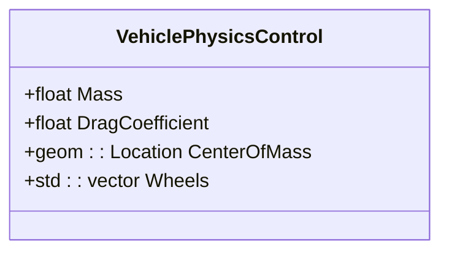
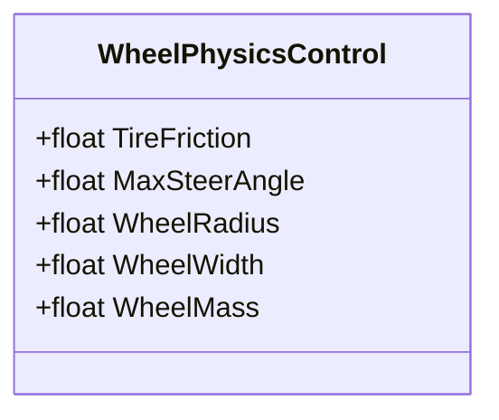
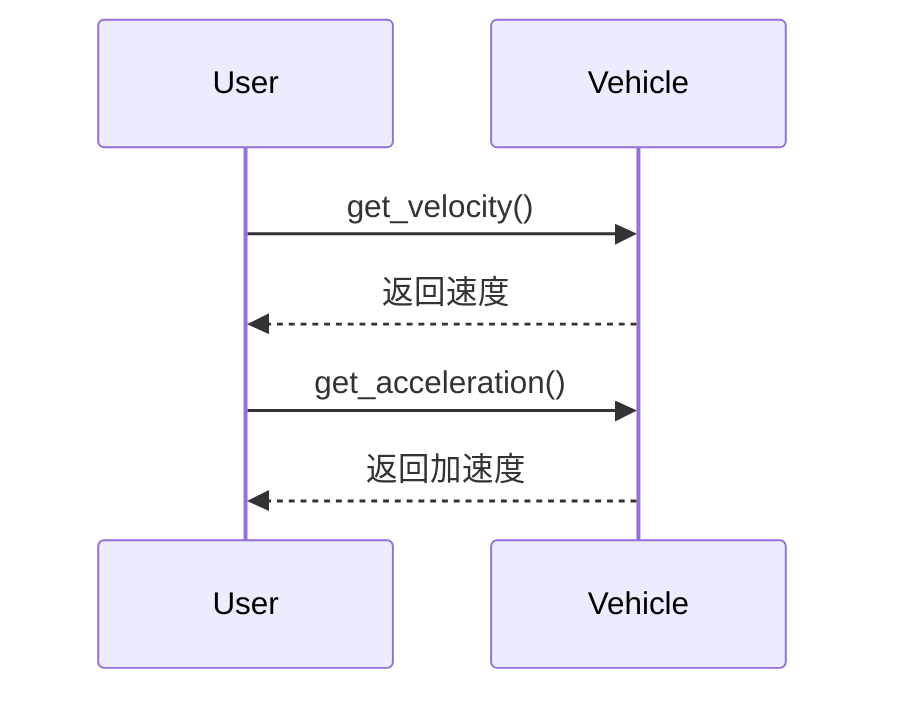
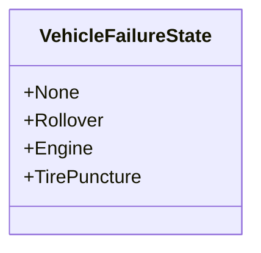

# 车辆控制

> **引用文件**
> **本文档中引用的文件**

- [VehicleControl.h](https://github.com/carla-simulator/carla/blob/ue5-dev/Unreal/CarlaUnreal/Plugins/Carla/Source/Carla/Vehicle/VehicleControl.h)
- [VehicleAckermannControl.h](https://github.com/carla-simulator/carla/blob/ue5-dev/Unreal/CarlaUnreal/Plugins/Carla/Source/Carla/Vehicle/VehicleAckermannControl.h)
- [VehiclePhysicsControl.h](https://github.com/carla-simulator/carla/blob/ue5-dev/LibCarla/source/carla/rpc/VehiclePhysicsControl.h)
- [WheelPhysicsControl.h](https://github.com/carla-simulator/carla/blob/ue5-dev/LibCarla/source/carla/rpc/WheelPhysicsControl.h)
- [AckermannController.h](https://github.com/carla-simulator/carla/blob/ue5-dev/Unreal/CarlaUnreal/Plugins/Carla/Source/Carla/Vehicle/AckermannController.h)
- [AckermannController.cpp](https://github.com/carla-simulator/carla/blob/ue5-dev/Unreal/CarlaUnreal/Plugins/Carla/Source/Carla/Vehicle/AckermannController.cpp)
- [VehicleFailureState.h](https://github.com/carla-simulator/carla/blob/ue5-dev/LibCarla/source/carla/rpc/VehicleFailureState.h)
- [Control.cpp](https://github.com/carla-simulator/carla/blob/ue5-dev/PythonAPI/carla/src/Control.cpp)
- [main.cpp](https://github.com/carla-simulator/carla/blob/ue5-dev/Examples/CppClient/main.cpp)
- [tuto_G_control_vehicle_physics.md](https://github.com/carla-simulator/carla/blob/ue5-dev/Docs/tuto_G_control_vehicle_physics.md)

## 目录

1. [引言](#引言)
2. [车辆控制接口概述](#车辆控制接口概述)
3. [标准 PID 控制与阿克曼转向控制](#标准pid控制与阿克曼转向控制)
4. [VehicleControl 和 VehicleAckermannControl 结构体参数](#vehiclecontrol和vehicleackermanncontrol结构体参数)
5. [VehiclePhysicsControl 类与车辆物理特性调整](#vehiclephysicscontrol类与车辆物理特性调整)
6. [车辆状态查询功能](#车辆状态查询功能)
7. [代码示例与应用](#代码示例与应用)
8. [结论](#结论)

## 引言

CARLA 模拟器提供了全面的车辆控制功能，支持从基础的油门、刹车、转向控制到复杂的物理特性调整。本文档详细介绍了 Vehicle 类及其控制接口，重点说明标准 PID 控制和阿克曼转向控制两种模式的区别和适用场景。文档化了 VehicleControl 和 VehicleAckermannControl 结构体的所有参数，包括油门、刹车、转向角等，并深入解析了 VehiclePhysicsControl 类如何调整车辆的物理特性，如质量、轮胎摩擦力和空气动力学参数。此外，本文档还解释了车辆状态查询功能，包括速度、转速和控制输入的获取，并提供代码示例展示如何实现平滑的车辆控制、处理车辆故障状态以及自定义车辆动力学模型。

## 车辆控制接口概述

CARLA 模拟器提供了多种车辆控制接口，允许用户精确控制车辆的行为。主要的控制接口包括标准的 VehicleControl 和更高级的 VehicleAckermannControl。这些接口通过不同的参数来控制车辆的运动，包括油门、刹车、转向角等。



**图源**

- [VehicleControl.h](https://github.com/carla-simulator/carla/blob/ue5-dev/Unreal/CarlaUnreal/Plugins/Carla/Source/Carla/Vehicle/VehicleControl.h)
- [VehicleAckermannControl.h](https://github.com/carla-simulator/carla/blob/ue5-dev/Unreal/CarlaUnreal/Plugins/Carla/Source/Carla/Vehicle/VehicleAckermannControl.h)

**节源**

- [VehicleControl.h](https://github.com/carla-simulator/carla/blob/ue5-dev/Unreal/CarlaUnreal/Plugins/Carla/Source/Carla/Vehicle/VehicleControl.h)
- [VehicleAckermannControl.h](https://github.com/carla-simulator/carla/blob/ue5-dev/Unreal/CarlaUnreal/Plugins/Carla/Source/Carla/Vehicle/VehicleAckermannControl.h)

## 标准 PID 控制与阿克曼转向控制

### 标准 PID 控制

标准 PID 控制是一种基于比例-积分-微分（Proportional-Integral-Derivative）算法的控制方法，广泛应用于车辆的速度和转向控制。在 CARLA 中，标准 PID 控制通过 VehicleControl 结构体实现，主要参数包括油门、刹车和转向角。



**图源**

- [AckermannController.h](https://github.com/carla-simulator/carla/blob/ue5-dev/Unreal/CarlaUnreal/Plugins/Carla/Source/Carla/Vehicle/AckermannController.h)

**节源**

- [AckermannController.h](https://github.com/carla-simulator/carla/blob/ue5-dev/Unreal/CarlaUnreal/Plugins/Carla/Source/Carla/Vehicle/AckermannController.h)

### 阿克曼转向控制

阿克曼转向控制是一种更高级的控制方法，特别适用于需要精确路径跟踪的自动驾驶场景。它通过 VehicleAckermannControl 结构体实现，主要参数包括转向角、转向速度、速度、加速度和加加速度。



**图源**

- [AckermannController.h](https://github.com/carla-simulator/carla/blob/ue5-dev/Unreal/CarlaUnreal/Plugins/Carla/Source/Carla/Vehicle/AckermannController.h)

**节源**

- [AckermannController.h](https://github.com/carla-simulator/carla/blob/ue5-dev/Unreal/CarlaUnreal/Plugins/Carla/Source/Carla/Vehicle/AckermannController.h)

## VehicleControl 和 VehicleAckermannControl 结构体参数

### VehicleControl 结构体

VehicleControl 结构体用于标准的车辆控制，包含以下参数：

- **油门 (Throttle)**: 控制车辆的加速程度，范围为 0.0 到 1.0。
- **刹车 (Brake)**: 控制车辆的减速程度，范围为 0.0 到 1.0。
- **转向 (Steer)**: 控制车辆的转向角度，范围为-1.0 到 1.0。
- **手刹 (HandBrake)**: 控制车辆的手刹状态，布尔值。
- **倒车 (Reverse)**: 控制车辆的倒车状态，布尔值。
- **手动换挡 (ManualGearShift)**: 控制车辆的手动换挡状态，布尔值。
- **档位 (Gear)**: 控制车辆的当前档位，整数值。



**图源**

- [VehicleControl.h](https://github.com/carla-simulator/carla/blob/ue5-dev/Unreal/CarlaUnreal/Plugins/Carla/Source/Carla/Vehicle/VehicleControl.h)

**节源**

- [VehicleControl.h](https://github.com/carla-simulator/carla/blob/ue5-dev/Unreal/CarlaUnreal/Plugins/Carla/Source/Carla/Vehicle/VehicleControl.h)

### VehicleAckermannControl 结构体

VehicleAckermannControl 结构体用于阿克曼转向控制，包含以下参数：

- **转向角 (Steer)**: 控制车辆的转向角度，范围为-1.0 到 1.0。
- **转向速度 (SteerSpeed)**: 控制车辆的转向速度，范围为 0.0 到 1.0。
- **速度 (Speed)**: 控制车辆的目标速度，单位为 m/s。
- **加速度 (Acceleration)**: 控制车辆的目标加速度，单位为 m/s²。
- **加加速度 (Jerk)**: 控制车辆的目标加加速度，单位为 m/s³。



**图源**

- [VehicleAckermannControl.h](https://github.com/carla-simulator/carla/blob/ue5-dev/Unreal/CarlaUnreal/Plugins/Carla/Source/Carla/Vehicle/VehicleAckermannControl.h)

**节源**

- [VehicleAckermannControl.h](https://github.com/carla-simulator/carla/blob/ue5-dev/Unreal/CarlaUnreal/Plugins/Carla/Source/Carla/Vehicle/VehicleAckermannControl.h)

## VehiclePhysicsControl 类与车辆物理特性调整

### VehiclePhysicsControl 类

VehiclePhysicsControl 类用于调整车辆的物理特性，包括质量、轮胎摩擦力和空气动力学参数。该类包含以下主要参数：

- **质量 (Mass)**: 车辆的质量，单位为 kg。
- **阻力系数 (DragCoefficient)**: 车辆的空气阻力系数。
- **质心 (CenterOfMass)**: 车辆的质心位置。
- **轮子物理控制 (Wheels)**: 包含每个轮子的物理控制参数，如轮胎摩擦力、最大转向角等。



**图源**

- [VehiclePhysicsControl.h](https://github.com/carla-simulator/carla/blob/ue5-dev/LibCarla/source/carla/rpc/VehiclePhysicsControl.h)

**节源**

- [VehiclePhysicsControl.h](https://github.com/carla-simulator/carla/blob/ue5-dev/LibCarla/source/carla/rpc/VehiclePhysicsControl.h)

### 轮子物理控制

轮子物理控制通过 WheelPhysicsControl 结构体实现，包含以下参数：

- **轮胎摩擦力 (TireFriction)**: 轮胎与地面的摩擦力系数。
- **最大转向角 (MaxSteerAngle)**: 轮子的最大转向角度。
- **轮子半径 (WheelRadius)**: 轮子的半径。
- **轮子宽度 (WheelWidth)**: 轮子的宽度。
- **轮子质量 (WheelMass)**: 轮子的质量。



**图源**

- [WheelPhysicsControl.h](https://github.com/carla-simulator/carla/blob/ue5-dev/LibCarla/source/carla/rpc/WheelPhysicsControl.h)

**节源**

- [WheelPhysicsControl.h](https://github.com/carla-simulator/carla/blob/ue5-dev/LibCarla/source/carla/rpc/WheelPhysicsControl.h)

## 车辆状态查询功能

### 速度和加速度查询

车辆的状态查询功能允许用户获取车辆的实时状态，包括速度、加速度和控制输入。这些信息对于实现精确的车辆控制和故障检测至关重要。



**图源**

- [AckermannController.cpp](https://github.com/carla-simulator/carla/blob/ue5-dev/Unreal/CarlaUnreal/Plugins/Carla/Source/Carla/Vehicle/AckermannController.cpp)

**节源**

- [AckermannController.cpp](https://github.com/carla-simulator/carla/blob/ue5-dev/Unreal/CarlaUnreal/Plugins/Carla/Source/Carla/Vehicle/AckermannController.cpp)

### 故障状态查询

车辆的故障状态可以通过 VehicleFailureState 枚举类获取，包括翻车、发动机故障和轮胎爆胎等。



**图源**

- [VehicleFailureState.h](https://github.com/carla-simulator/carla/blob/ue5-dev/LibCarla/source/carla/rpc/VehicleFailureState.h)

**节源**

- [VehicleFailureState.h](https://github.com/carla-simulator/carla/blob/ue5-dev/LibCarla/source/carla/rpc/VehicleFailureState.h)

## 代码示例与应用

### 平滑车辆控制

以下代码示例展示了如何使用 VehicleAckermannControl 实现平滑的车辆控制：

```cpp
// 设置目标速度和加速度
FVehicleAckermannControl ackermannControl;
ackermannControl.Speed = 20.0f; // 目标速度 20 m/s
ackermannControl.Acceleration = 2.0f; // 目标加速度 2 m/s²
ackermannControl.Steer = 0.1f; // 转向角 0.1 rad

// 应用控制
vehicle->ApplyAckermannControl(ackermannControl);
```

**节源**

- [main.cpp](https://github.com/carla-simulator/carla/blob/ue5-dev/Examples/CppClient/main.cpp)

### 处理车辆故障状态

以下代码示例展示了如何处理车辆的故障状态：

```cpp
// 获取车辆故障状态
auto failureState = vehicle->GetFailureState();

// 根据故障状态采取相应措施
switch (failureState) {
    case VehicleFailureState::Rollover:
        // 处理翻车故障
        break;
    case VehicleFailureState::Engine:
        // 处理发动机故障
        break;
    case VehicleFailureState::TirePuncture:
        // 处理轮胎爆胎故障
        break;
    default:
        // 无故障
        break;
}
```

**节源**

- [main.cpp](https://github.com/carla-simulator/carla/blob/ue5-dev/Examples/CppClient/main.cpp)

### 自定义车辆动力学模型

以下代码示例展示了如何自定义车辆的动力学模型：

```cpp
// 获取车辆物理控制
auto physicsControl = vehicle->GetPhysicsControl();

// 修改物理参数
physicsControl.Mass = 1500.0f; // 质量 1500 kg
physicsControl.DragCoefficient = 0.3f; // 阻力系数 0.3

// 应用物理控制
vehicle->ApplyPhysicsControl(physicsControl);
```

**节源**

- [tuto_G_control_vehicle_physics.md](https://github.com/carla-simulator/carla/blob/ue5-dev/Docs/tuto_G_control_vehicle_physics.md)

## 结论

本文档详细介绍了 CARLA 模拟器中的车辆控制功能，包括标准 PID 控制和阿克曼转向控制的区别和适用场景。文档化了 VehicleControl 和 VehicleAckermannControl 结构体的所有参数，并深入解析了 VehiclePhysicsControl 类如何调整车辆的物理特性。此外，本文档还解释了车辆状态查询功能，并提供了代码示例展示如何实现平滑的车辆控制、处理车辆故障状态以及自定义车辆动力学模型。这些信息对于开发和测试自动驾驶系统具有重要意义。
