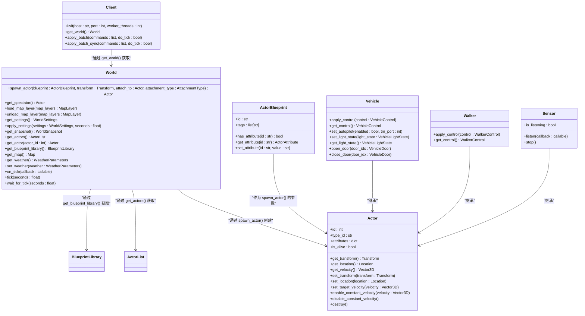
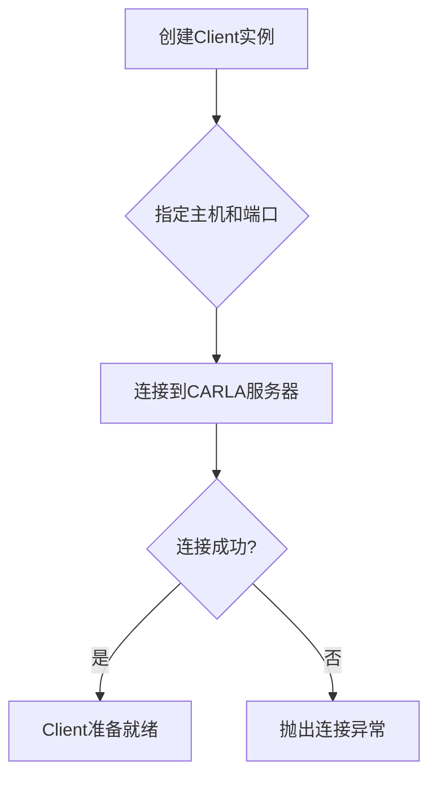

# Python API

> **引用文件**
> **本文档引用的文件**

- [**init**.py](https://github.com/carla-simulator/carla/blob/ue5-dev/PythonAPI/carla/__init__.py)
- [Client.cpp](https://github.com/carla-simulator/carla/blob/ue5-dev/PythonAPI/carla/src/Client.cpp)
- [World.cpp](https://github.com/carla-simulator/carla/blob/ue5-dev/PythonAPI/carla/src/World.cpp)
- [Actor.cpp](https://github.com/carla-simulator/carla/blob/ue5-dev/PythonAPI/carla/src/Actor.cpp)
- [Sensor.cpp](https://github.com/carla-simulator/carla/blob/ue5-dev/PythonAPI/carla/src/Sensor.cpp)
- [Blueprint.cpp](https://github.com/carla-simulator/carla/blob/ue5-dev/PythonAPI/carla/src/Blueprint.cpp)
- [manual_control.py](https://github.com/carla-simulator/carla/blob/ue5-dev/PythonAPI/examples/manual_control.py)
- [automatic_control.py](https://github.com/carla-simulator/carla/blob/ue5-dev/PythonAPI/examples/automatic_control.py)
- [client.yml](https://github.com/carla-simulator/carla/blob/ue5-dev/PythonAPI/docs/client.yml)
- [world.yml](https://github.com/carla-simulator/carla/blob/ue5-dev/PythonAPI/docs/world.yml)
- [actor.yml](https://github.com/carla-simulator/carla/blob/ue5-dev/PythonAPI/docs/actor.yml)
- [blueprint.yml](https://github.com/carla-simulator/carla/blob/ue5-dev/PythonAPI/docs/blueprint.yml)

## 目录

1. [简介](#简介)
2. [核心组件](#核心组件)
3. [连接管理](#连接管理)
4. [场景管理](#场景管理)
5. [Actor 控制接口](#actor控制接口)
6. [蓝图系统](#蓝图系统)
7. [传感器数据订阅](#传感器数据订阅)
8. [快速入门](#快速入门)
9. [高级技巧](#高级技巧)

## 简介

本文档全面介绍了 CARLA 模拟器的 Python API，重点聚焦于`carla`模块的公共接口。文档详细说明了`Client`类的连接管理方法、`World`类的场景管理功能，以及`Actor`及其子类（`Vehicle`、`Walker`、`Sensor`）的控制接口。所有关键方法的参数、返回值和异常处理机制都已文档化。文档还提供了来自`examples`目录的实际代码示例，如`manual_control.py`中的车辆控制逻辑和`automatic_control.py`中的自动驾驶代理使用。此外，文档解释了蓝图系统的工作原理和`set_attribute`方法的使用模式，以及传感器数据订阅的`listen`方法实现细节和回调函数模式。

**Section sources**

- [client.yml](https://github.com/carla-simulator/carla/blob/ue5-dev/PythonAPI/docs/client.yml)
- [world.yml](https://github.com/carla-simulator/carla/blob/ue5-dev/PythonAPI/docs/world.yml)
- [actor.yml](https://github.com/carla-simulator/carla/blob/ue5-dev/PythonAPI/docs/actor.yml)

## 核心组件

CARLA 的 Python API 围绕几个核心类构建，这些类共同管理模拟环境。`Client`类负责与服务器建立连接并发送命令。`World`类代表模拟环境本身，管理地图、天气和所有`Actor`。`Actor`是模拟中任何可移动实体的基类，包括车辆、行人、传感器和交通标志。`ActorBlueprint`类则作为创建`Actor`实例的模板，包含了其属性和类型信息。



**Diagram sources**

- [Client.cpp](https://github.com/carla-simulator/carla/blob/ue5-dev/PythonAPI/carla/src/Client.cpp)
- [World.cpp](https://github.com/carla-simulator/carla/blob/ue5-dev/PythonAPI/carla/src/World.cpp)
- [Actor.cpp](https://github.com/carla-simulator/carla/blob/ue5-dev/PythonAPI/carla/src/Actor.cpp)
- [Blueprint.cpp](https://github.com/carla-simulator/carla/blob/ue5-dev/PythonAPI/carla/src/Blueprint.cpp)

## 连接管理

`Client`类是与 CARLA 服务器通信的入口点。它负责建立连接、管理超时，并提供获取`World`对象和执行批处理命令的方法。

### Client 类

`Client`类的构造函数用于初始化与服务器的连接。

**Section sources**

- [Client.cpp](https://github.com/carla-simulator/carla/blob/ue5-dev/PythonAPI/carla/src/Client.cpp)
- [client.yml](https://github.com/carla-simulator/carla/blob/ue5-dev/PythonAPI/docs/client.yml)

#### **init**方法

此方法创建一个与 CARLA 服务器的客户端连接。



**参数:**

- `host` (str): 运行 CARLA 模拟器实例的 IP 地址。默认为 localhost (127.0.0.1)。
- `port` (int): CARLA 模拟器实例运行的 TCP 端口。默认为 2000。
- `worker_threads` (int): 用于后台更新的工作线程数。如果为 0，则使用所有可用的并发。

**返回值:** 无

**异常:** 如果无法连接到服务器，可能会抛出网络异常。

#### get_world 方法

此方法返回当前活动的`World`对象，该对象是与模拟环境交互的主要接口。

**参数:** 无

**返回值:** `World` - 当前活动的模拟世界对象。

**Section sources**

- [Client.cpp](https://github.com/carla-simulator/carla/blob/ue5-dev/PythonAPI/carla/src/Client.cpp)

#### apply_batch 方法

此方法在单个模拟步骤中执行一系列命令，但不返回任何信息。它适用于不需要知道每个命令执行结果的批量操作。

**参数:**

- `commands` (list): 要批量执行的命令列表。每个命令都是一个特定于操作的`Command`对象。
- `do_tick` (bool): 一个布尔参数，指定在同步模式下应用批处理后是否执行`World.tick`。默认为`False`。

**返回值:** 无

**异常:** 如果网络调用超时，可能会抛出`TimeoutException`。

**Section sources**

- [Client.cpp](https://github.com/carla-simulator/carla/blob/ue5-dev/PythonAPI/carla/src/Client.cpp)

#### apply_batch_sync 方法

此方法在单个模拟步骤中执行一系列命令，阻塞直到命令链接完成，并返回一个`command.Response`列表，可用于确定每个命令是否成功。

**参数:**

- `commands` (list): 要批量执行的命令列表。
- `do_tick` (bool): 一个布尔参数，指定在同步模式下应用批处理后是否执行`World.tick`。默认为`False`。

**返回值:** `list(command.Response)` - 一个包含每个命令执行结果的响应列表。

**异常:** 如果网络调用超时，可能会抛出`TimeoutException`。

**Section sources**

- [Client.cpp](https://github.com/carla-simulator/carla/blob/ue5-dev/PythonAPI/carla/src/Client.cpp)

## 场景管理

`World`类是模拟环境的核心，负责管理地图、天气、时间步长以及所有存在于场景中的`Actor`。

### World 类

`World`类提供了创建、查询和修改模拟环境的方法。

**Section sources**

- [World.cpp](https://github.com/carla-simulator/carla/blob/ue5-dev/PythonAPI/carla/src/World.cpp)
- [world.yml](https://github.com/carla-simulator/carla/blob/ue5-dev/PythonAPI/docs/world.yml)

#### spawn_actor 方法

此方法根据给定的蓝图在指定的变换位置创建并生成一个`Actor`。

**参数:**

- `blueprint` (ActorBlueprint): 用于创建`Actor`的蓝图。
- `transform` (Transform): 包含`Actor`将被生成的位置和方向的变换。
- `attach_to` (Actor): `Actor`将跟随的父对象。默认为`None`。
- `attachment_type` (AttachmentType): 决定`Actor`相对于其父对象位置变化的严格程度。默认为`Rigid`。

**返回值:** `Actor` - 新生成的`Actor`实例。

**异常:** 如果生成位置被占用或无效，可能会抛出异常。

#### get_spectator 方法

此方法返回`Spectator` `Actor`，它是一个特殊的`Actor`，充当模拟器窗口中的摄像机。

**参数:** 无

**返回值:** `Actor` - `Spectator` `Actor`实例。

**Section sources**

- [World.cpp](https://github.com/carla-simulator/carla/blob/ue5-dev/PythonAPI/carla/src/World.cpp)

#### load_map_layer 方法

此方法加载指定的地图层。此功能仅对“Opt”地图可用。

**参数:**

- `map_layers` (MapLayer): 要加载的地图层的掩码。

**返回值:** 无

**异常:** 如果地图不支持图层，可能会抛出异常。

**Section sources**

- [World.cpp](https://github.com/carla-simulator/carla/blob/ue5-dev/PythonAPI/carla/src/World.cpp)

#### unload_map_layer 方法

此方法卸载指定的地图层。此功能仅对“Opt”地图可用。

**参数:**

- `map_layers` (MapLayer): 要卸载的地图层的掩码。

**返回值:** 无

**异常:** 如果地图不支持图层，可能会抛出异常。

**Section sources**

- [World.cpp](https://github.com/carla-simulator/carla/blob/ue5-dev/PythonAPI/carla/src/World.cpp)

## Actor 控制接口

`Actor`类是所有可移动实体的基类，其子类`Vehicle`和`Walker`提供了特定于车辆和行人的控制方法。

### Vehicle 类

`Vehicle`类继承自`Actor`，并提供了用于控制车辆行为的方法。

**Section sources**

- [Actor.cpp](https://github.com/carla-simulator/carla/blob/ue5-dev/PythonAPI/carla/src/Actor.cpp)
- [actor.yml](https://github.com/carla-simulator/carla/blob/ue5-dev/PythonAPI/docs/actor.yml)

#### apply_control 方法

此方法在下一个模拟步骤中应用一个包含油门、转向、刹车等驾驶参数的控制对象。

**参数:**

- `control` (VehicleControl): 包含车辆控制指令的对象。

**返回值:** 无

**Section sources**

- [Actor.cpp](https://github.com/carla-simulator/carla/blob/ue5-dev/PythonAPI/carla/src/Actor.cpp)

#### set_autopilot 方法

此方法将车辆注册或从交通管理器（Traffic Manager）的列表中删除。当启用时，交通管理器将控制车辆的移动。

**参数:**

- `enabled` (bool): 如果为`True`，则启用自动驾驶。
- `tm_port` (int): 车辆将被注册到的交通管理器端口。默认为 8000。

**返回值:** 无

**Section sources**

- [Actor.cpp](https://github.com/carla-simulator/carla/blob/ue5-dev/PythonAPI/carla/src/Actor.cpp)

#### set_light_state 方法

此方法使用表示哪些灯开启或关闭的标志来设置车辆的灯光状态。

**参数:**

- `light_state` (VehicleLightState): 一个标志，表示车辆的灯光状态。

**返回值:** 无

**Section sources**

- [Actor.cpp](https://github.com/carla-simulator/carla/blob/ue5-dev/PythonAPI/carla/src/Actor.cpp)

#### open_door 和 close_door 方法

这些方法用于打开或关闭车辆的指定车门。

**参数:**

- `door_idx` (VehicleDoor): 要打开或关闭的车门索引。

**返回值:** 无

**Section sources**

- [Actor.cpp](https://github.com/carla-simulator/carla/blob/ue5-dev/PythonAPI/carla/src/Actor.cpp)

### Walker 类

`Walker`类继承自`Actor`，并提供了用于控制行人的方法。

#### apply_control 方法

此方法在下一个模拟步骤中应用一个控制对象，该对象将行人在特定方向上以特定速度移动。

**参数:**

- `control` (WalkerControl): 包含行人控制指令的对象。

**返回值:** 无

**Section sources**

- [Actor.cpp](https://github.com/carla-simulator/carla/blob/ue5-dev/PythonAPI/carla/src/Actor.cpp)

## 蓝图系统

蓝图系统是 CARLA 中用于定义和创建`Actor`的基础。`BlueprintLibrary`包含所有可用的`Actor`类型，而`ActorBlueprint`则代表一个具体的`Actor`模板。

### BlueprintLibrary 类

`BlueprintLibrary`是一个包含所有可用`Actor`蓝图的容器。

**Section sources**

- [Blueprint.cpp](https://github.com/carla-simulator/carla/blob/ue5-dev/PythonAPI/carla/src/Blueprint.cpp)
- [blueprint.yml](https://github.com/carla-simulator/carla/blob/ue5-dev/PythonAPI/docs/blueprint.yml)

#### filter 方法

此方法根据通配符模式过滤蓝图库，返回一个新的`BlueprintLibrary`。

**参数:**

- `wildcard_pattern` (str): 用于匹配蓝图 ID 和标签的通配符模式。

**返回值:** `BlueprintLibrary` - 包含匹配蓝图的新库。

**Section sources**

- [Blueprint.cpp](https://github.com/carla-simulator/carla/blob/ue5-dev/PythonAPI/carla/src/Blueprint.cpp)

#### find 方法

此方法根据 ID 查找并返回一个特定的`ActorBlueprint`。

**参数:**

- `id` (str): 要查找的蓝图的 ID。

**返回值:** `ActorBlueprint` - 找到的蓝图。

**异常:** 如果未找到具有指定 ID 的蓝图，可能会抛出异常。

**Section sources**

- [Blueprint.cpp](https://github.com/carla-simulator/carla/blob/ue5-dev/PythonAPI/carla/src/Blueprint.cpp)

### ActorBlueprint 类

`ActorBlueprint`代表一个具体的`Actor`模板，可以对其进行修改以自定义`Actor`的属性。

#### set_attribute 方法

此方法用于设置蓝图的可修改属性。

**参数:**

- `id` (str): 要更改的属性的标识符。
- `value` (str): 该属性的新值。

**返回值:** 无

**异常:** 如果属性不可修改或值无效，可能会抛出异常。

**Section sources**

- [Blueprint.cpp](https://github.com/carla-simulator/carla/blob/ue5-dev/PythonAPI/carla/src/Blueprint.cpp)

## 传感器数据订阅

传感器通过`listen`方法订阅数据流，该方法接受一个回调函数，当新数据可用时会调用该函数。

### Sensor 类

`Sensor`类继承自`Actor`，并提供了数据订阅功能。

**Section sources**

- [Sensor.cpp](https://github.com/carla-simulator/carla/blob/ue5-dev/PythonAPI/carla/src/Sensor.cpp)

#### listen 方法

此方法将一个回调函数注册到传感器，当新数据到达时，该函数将被调用。

**参数:**

- `callback` (callable): 一个函数，它接受一个`SensorData`对象作为参数。

**返回值:** 无

**Section sources**

- [Sensor.cpp](https://github.com/carla-simulator/carla/blob/ue5-dev/PythonAPI/carla/src/Sensor.cpp)

#### stop 方法

此方法停止传感器的数据流并取消注册回调函数。

**参数:** 无

**返回值:** 无

**Section sources**

- [Sensor.cpp](https://github.com/carla-simulator/carla/blob/ue5-dev/PythonAPI/carla/src/Sensor.cpp)

## 快速入门

以下是一个连接到 CARLA 服务器并生成第一辆车的简单示例。

```python
import carla

# 1. 连接到服务器
client = carla.Client('localhost', 2000)
client.set_timeout(10.0) # 设置10秒超时

# 2. 获取世界对象
world = client.get_world()

# 3. 获取蓝图库并选择一个车辆蓝图
blueprint_library = world.get_blueprint_library()
vehicle_bp = blueprint_library.find('vehicle.tesla.model3')

# 4. 设置车辆颜色
color = vehicle_bp.get_attribute('color').recommended_values[0]
vehicle_bp.set_attribute('color', color)

# 5. 定义生成位置
spawn_point = world.get_map().get_spawn_points()[0]

# 6. 生成车辆
vehicle = world.spawn_actor(vehicle_bp, spawn_point)

print(f"成功生成车辆: {vehicle.type_id}")
```

**Section sources**

- [manual_control.py](https://github.com/carla-simulator/carla/blob/ue5-dev/PythonAPI/examples/manual_control.py)

## 高级技巧

### 批处理命令

使用`apply_batch`和`apply_batch_sync`可以显著提高性能，尤其是在生成或销毁大量`Actor`时。

```python
import carla

# 示例：批量生成车辆
client = carla.Client('localhost', 2000)
world = client.get_world()
blueprint_library = world.get_blueprint_library()
spawn_points = world.get_map().get_spawn_points()

# 创建命令列表
batch = []
for spawn_point in spawn_points[:50]: # 生成前50个点的车辆
    vehicle_bp = random.choice(blueprint_library.filter('vehicle.*'))
    # 创建生成Actor的命令
    spawn_command = carla.command.SpawnActor(vehicle_bp, spawn_point)
    # 将生成的车辆设置为自动驾驶
    spawn_command.then(carla.command.SetAutopilot(vehicle, True))
    batch.append(spawn_command)

# 批量执行所有命令
responses = client.apply_batch_sync(batch, do_tick=True)
```

### 同步模式

在同步模式下，客户端控制模拟的推进，这对于精确的实验和数据收集至关重要。

```python
# 设置同步模式
settings = world.get_settings()
settings.synchronous_mode = True
settings.fixed_delta_seconds = 0.05
world.apply_settings(settings)

# 交通管理器也必须设置为同步模式
traffic_manager.set_synchronous_mode(True)

# 主循环
while True:
    # 1. 等待服务器的tick
    world.tick()

    # 2. 处理传感器数据
    # ... (处理来自传感器的回调数据)

    # 3. 更新车辆控制
    # ... (计算并应用新的控制指令)
```

**Section sources**

- [automatic_control.py](https://github.com/carla-simulator/carla/blob/ue5-dev/PythonAPI/examples/automatic_control.py)
