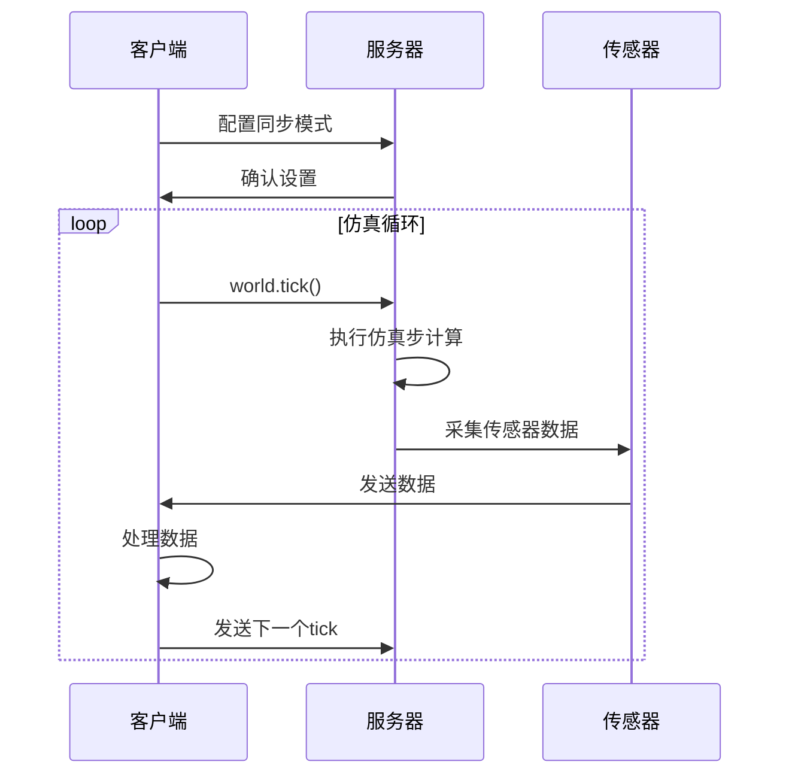

# 世界同步


**本文档中引用的文件**  
- [World.h](https://github.com/carla-simulator/carla/blob/ue5-dev/LibCarla/source/carla/client/World.h)
- [World.cpp](https://github.com/carla-simulator/carla/blob/ue5-dev/PythonAPI/carla/src/World.cpp)
- [EpisodeSettings.h](https://github.com/carla-simulator/carla/blob/ue5-dev/LibCarla/source/carla/rpc/EpisodeSettings.h)
- [Timestamp.h](https://github.com/carla-simulator/carla/blob/ue5-dev/LibCarla/source/carla/client/Timestamp.h)
- [WorldSnapshot.h](https://github.com/carla-simulator/carla/blob/ue5-dev/LibCarla/source/carla/client/WorldSnapshot.h)
- [Simulator.cpp](https://github.com/carla-simulator/carla/blob/ue5-dev/LibCarla/source/carla/client/detail/Simulator.cpp)
- [adv_synchrony_timestep.md](https://github.com/carla-simulator/carla/blob/ue5-dev/Docs/adv_synchrony_timestep.md)


## 目录
1. [简介](#简介)
2. [World.apply_settings 配置选项](#worldapply_settings-配置选项)
3. [同步模式工作原理](#同步模式工作原理)
4. [fixed_delta_seconds 参数详解](#fixed_delta_seconds-参数详解)
5. [物理子步优化](#物理子步优化)
6. [WorldSnapshot 类应用](#worldsnapshot-类应用)
7. [客户端-服务器交互流程](#客户端-服务器交互流程)
8. [物理子步与物理速率调优](#物理子步与物理速率调优)
9. [同步模式配置示例](#同步模式配置示例)
10. [高级时间控制与性能调优](#高级时间控制与性能调优)

## 简介
本文档详细阐述CARLA仿真环境中世界同步机制的核心概念与实现细节。重点聚焦于World.apply_settings方法的配置选项，深入解析同步模式的工作原理、性能影响以及相关参数的优化策略。文档涵盖从基础配置到高级调优的完整知识体系，为开发者提供精确控制仿真时间步长和同步行为的专业指导。

## World.apply_settings 配置选项
World.apply_settings方法用于配置仿真世界的核心参数，这些参数通过EpisodeSettings结构体进行设置。主要配置选项包括：

- **synchronous_mode**: 同步模式开关，控制服务器是否等待客户端的tick信号
- **fixed_delta_seconds**: 固定时间步长，定义每个仿真步的时间间隔
- **substepping**: 物理子步开关，启用物理计算的细分步长
- **max_substep_delta_time**: 最大物理子步时间间隔
- **max_substeps**: 最大物理子步数量
- **no_rendering_mode**: 无渲染模式，优化性能

这些配置选项共同决定了仿真的时间行为和同步特性，对仿真精度和性能有重要影响。

**Section sources**
- [EpisodeSettings.h](https://github.com/carla-simulator/carla/blob/ue5-dev/LibCarla/source/carla/rpc/EpisodeSettings.h#L46-L89)
- [World.cpp](https://github.com/carla-simulator/carla/blob/ue5-dev/PythonAPI/carla/src/World.cpp#L150-L184)

## 同步模式工作原理
同步模式是CARLA仿真中确保客户端与服务器精确同步的关键机制。在同步模式下，服务器会等待客户端发送"tick"信号后才进行下一个仿真步的计算。这种机制确保了客户端能够完全控制仿真进度，避免了异步模式下可能出现的数据丢失或时间错位问题。

同步模式的工作流程如下：
1. 客户端配置世界设置，启用synchronous_mode
2. 服务器完成当前仿真步的计算
3. 服务器暂停，等待客户端的tick信号
4. 客户端处理完当前步的数据后，发送tick信号
5. 服务器收到tick信号后，开始下一个仿真步的计算

这种机制特别适用于需要精确时间同步的场景，如多传感器数据采集、训练数据生成等。

**Section sources**
- [adv_synchrony_timestep.md](https://github.com/carla-simulator/carla/blob/ue5-dev/Docs/adv_synchrony_timestep.md#L113-L138)
- [World.h](https://github.com/carla-simulator/carla/blob/ue5-dev/LibCarla/source/carla/client/World.h#L139-L143)

## fixed_delta_seconds 参数详解
fixed_delta_seconds参数定义了仿真中每个时间步的固定时间间隔，对仿真稳定性和精度有重要影响。当设置为非零值时，仿真将采用固定时间步长；当设置为None或0时，仿真将采用可变时间步长。

固定时间步长的优势包括：
- 确保物理模拟的稳定性
- 提供可预测的仿真行为
- 便于数据采集和分析
- 支持精确的仿真重放

推荐的fixed_delta_seconds值通常在0.01到0.1秒之间，具体选择需根据仿真需求和性能要求权衡。较小的时间步长能提供更高的物理精度，但会增加计算开销。

**Section sources**
- [adv_synchrony_timestep.md](https://github.com/carla-simulator/carla/blob/ue5-dev/Docs/adv_synchrony_timestep.md#L42-L57)
- [EpisodeSettings.h](https://github.com/carla-simulator/carla/blob/ue5-dev/LibCarla/source/carla/rpc/EpisodeSettings.h#L65-L66)

## 物理子步优化
物理子步（substepping）是CARLA中用于提高物理模拟精度的重要优化技术。由于物理计算需要极小的时间步长才能保证精度，而传感器渲染等操作可能需要较大的时间步长，物理子步允许将一个仿真步分解为多个更小的物理计算步。

物理子步的关键参数：
- **substepping**: 启用/禁用物理子步功能
- **max_substep_delta_time**: 每个物理子步的最大时间间隔
- **max_substeps**: 每个仿真步的最大物理子步数

物理子步的约束条件为：`fixed_delta_seconds <= max_substep_delta_time * max_substeps`。为了获得最佳物理模拟效果，建议max_substep_delta_time至少低于0.01666秒，理想情况下低于0.01秒。

**Section sources**
- [adv_synchrony_timestep.md](https://github.com/carla-simulator/carla/blob/ue5-dev/Docs/adv_synchrony_timestep.md#L73-L98)
- [Simulator.cpp](https://github.com/carla-simulator/carla/blob/ue5-dev/LibCarla/source/carla/client/detail/Simulator.cpp#L261-L274)

## WorldSnapshot 类应用
WorldSnapshot类用于记录仿真世界在特定时刻的完整状态，是实现精确时间控制和状态回溯的关键组件。它提供了获取时间戳、平台时间和可视时间的方法。

WorldSnapshot包含以下时间信息：
- **frame**: 自仿真启动以来的帧数
- **elapsed_seconds**: 当前情景开始以来经过的模拟秒数
- **delta_seconds**: 与前一帧之间经过的模拟秒数
- **platform_timestamp**: 操作系统提供的帧时间戳

这些时间信息对于调试、数据分析和仿真同步至关重要，能够帮助开发者精确理解仿真过程中的时间关系。

**Section sources**
- [Timestamp.h](https://github.com/carla-simulator/carla/blob/ue5-dev/LibCarla/source/carla/client/Timestamp.h#L14-L52)
- [WorldSnapshot.h](https://github.com/carla-simulator/carla/blob/ue5-dev/LibCarla/source/carla/client/WorldSnapshot.h#L18-L78)

## 客户端-服务器交互流程
在同步模式下，客户端与服务器的交互遵循严格的流程，确保仿真步的精确同步。完整的交互流程包括tick等待和数据采集的正确模式。



**Diagram sources**
- [World.h](https://github.com/carla-simulator/carla/blob/ue5-dev/LibCarla/source/carla/client/World.h#L128-L143)
- [Simulator.cpp](https://github.com/carla-simulator/carla/blob/ue5-dev/LibCarla/source/carla/client/detail/Simulator.cpp#L255-L282)

**Section sources**
- [adv_synchrony_timestep.md](https://github.com/carla-simulator/carla/blob/ue5-dev/Docs/adv_synchrony_timestep.md#L139-L157)

## 物理子步与物理速率调优
物理子步和物理速率的调优是确保仿真精度和性能平衡的关键。合理的参数配置能够避免物理模拟的不稳定，同时保持良好的性能表现。

调优策略包括：
1. 确保物理子步约束条件：`fixed_delta_seconds <= max_substep_delta_time * max_substeps`
2. 根据仿真需求选择合适的max_substep_delta_time，通常建议在0.01-0.01666秒之间
3. 调整max_substeps以平衡精度和性能
4. 在高精度要求场景下，使用较小的fixed_delta_seconds值

性能影响方面，更小的物理子步时间间隔会增加计算开销，但能显著提高物理模拟的准确性。开发者需要根据具体应用场景在精度和性能之间做出权衡。

**Section sources**
- [adv_synchrony_timestep.md](https://github.com/carla-simulator/carla/blob/ue5-dev/Docs/adv_synchrony_timestep.md#L73-L111)
- [EpisodeSettings.h](https://github.com/carla-simulator/carla/blob/ue5-dev/LibCarla/source/carla/rpc/EpisodeSettings.h#L67-L68)

## 同步模式配置示例
以下是同步模式的基本配置示例，适用于初学者快速上手：

```python
# 基础同步模式配置
settings = world.get_settings()
settings.synchronous_mode = True
settings.fixed_delta_seconds = 0.05
settings.substepping = True
settings.max_substep_delta_time = 0.01
settings.max_substeps = 10
world.apply_settings(settings)

# 仿真循环
while True:
    world.tick()
    # 处理传感器数据
    data = sensor_queue.get()
    # 执行其他逻辑
```

此配置提供了良好的精度和性能平衡，适合大多数仿真场景。

**Section sources**
- [adv_synchrony_timestep.md](https://github.com/carla-simulator/carla/blob/ue5-dev/Docs/adv_synchrony_timestep.md#L126-L128)
- [World.cpp](https://github.com/carla-simulator/carla/blob/ue5-dev/PythonAPI/carla/src/World.cpp#L67-L70)

## 高级时间控制与性能调优
对于高级用户，可以采用更精细的时间控制和性能调优策略：

1. **高精度时间控制**：
   - 使用更小的fixed_delta_seconds（如0.01秒）
   - 优化物理子步参数以获得最佳物理精度
   - 利用WorldSnapshot进行精确的状态记录和回溯

2. **性能优化策略**：
   - 在不需要高精度的场景下适当增大时间步长
   - 根据硬件性能调整物理子步参数
   - 使用无渲染模式（no_rendering_mode）提升性能
   - 优化传感器配置以减少数据传输开销

3. **确定性仿真**：
   - 在加载世界前启用同步模式
   - 使用固定的随机种子
   - 批量处理命令以确保执行顺序

这些高级策略能够帮助开发者在复杂仿真场景中实现最佳的精度和性能平衡。

**Section sources**
- [adv_synchrony_timestep.md](https://github.com/carla-simulator/carla/blob/ue5-dev/Docs/adv_synchrony_timestep.md#L201-L266)
- [World.h](https://github.com/carla-simulator/carla/blob/ue5-dev/LibCarla/source/carla/client/World.h#L85-L88)