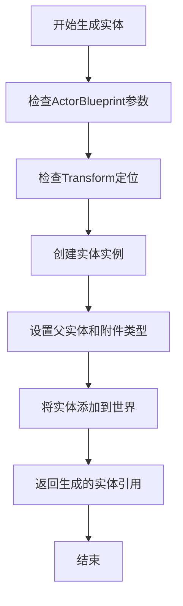
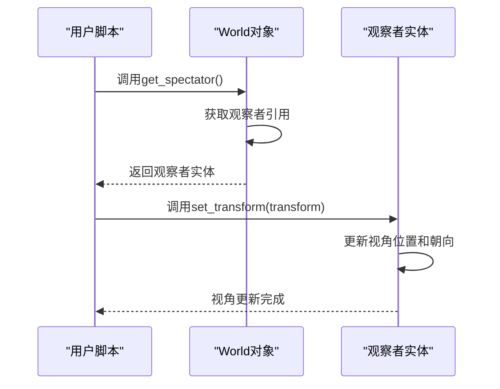
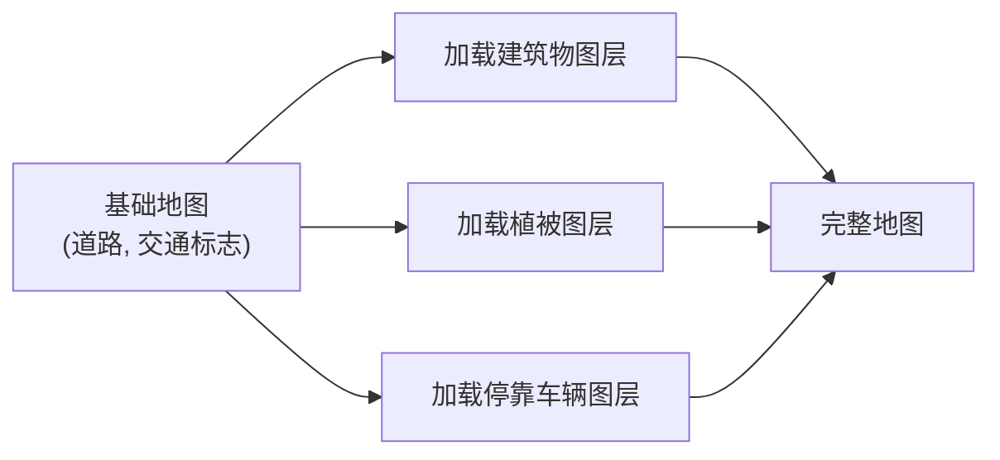
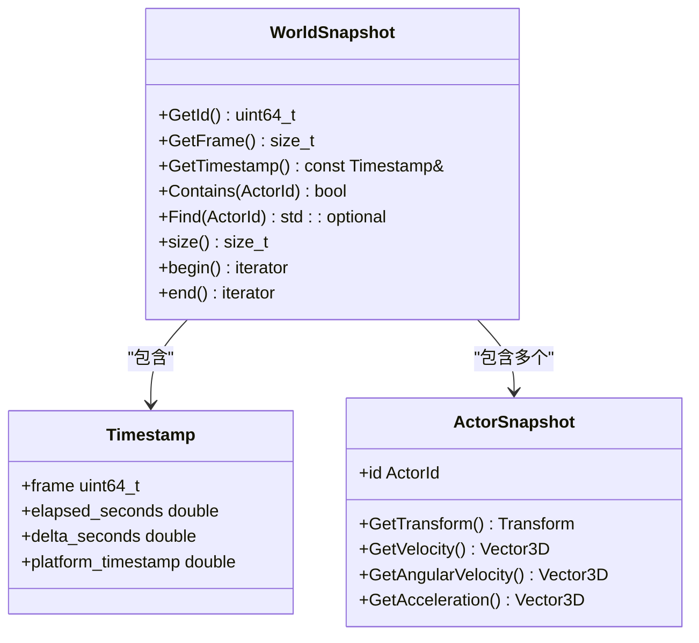

# 世界管理


**本文档中引用的文件**   
- [World.h](https://github.com/carla-simulator/carla/blob/ue5-dev/LibCarla/source/carla/client/World.h)
- [World.cpp](https://github.com/carla-simulator/carla/blob/ue5-dev/LibCarla/source/carla/client/World.cpp)
- [World.cpp](https://github.com/carla-simulator/carla/blob/ue5-dev/PythonAPI/carla/src/World.cpp)
- [core_world.md](https://github.com/carla-simulator/carla/blob/ue5-dev/Docs/core_world.md)
- [automatic_control.py](https://github.com/carla-simulator/carla/blob/ue5-dev/PythonAPI/examples/automatic_control.py)
- [WorldSnapshot.h](https://github.com/carla-simulator/carla/blob/ue5-dev/LibCarla/source/carla/client/WorldSnapshot.h)
- [Snapshot.cpp](https://github.com/carla-simulator/carla/blob/ue5-dev/PythonAPI/carla/src/Snapshot.cpp)


## 目录
1. [简介](#简介)
2. [核心功能详解](#核心功能详解)
3. [spawn_actor方法详解](#spawn_actor方法详解)
4. [视角控制与get_spectator方法](#视角控制与get_spectator方法)
5. [地图数据获取与get_map方法](#地图数据获取与get_map方法)
6. [地图图层动态管理](#地图图层动态管理)
7. [世界状态同步与apply_settings方法](#世界状态同步与apply_settings方法)
8. [WorldSnapshot类与状态记录](#worldsnapshot类与状态记录)
9. [实际应用示例](#实际应用示例)
10. [初学者指南：生成第一辆车](#初学者指南生成第一辆车)
11. [高级技术：批量生成与优化](#高级技术批量生成与优化)
12. [总结](#总结)

## 简介

世界管理是CARLA仿真系统的核心功能之一，它提供了对仿真环境的全面控制。`carla.World`类作为仿真世界的主要接口，允许用户与仿真环境进行交互，包括生成和管理各种实体（actors）、控制视角、获取地图数据、管理地图图层以及同步世界状态等。

世界对象通常通过客户端（client）获取，是连接用户脚本与仿真服务器的桥梁。它不仅提供了对当前仿真状态的访问，还允许用户修改仿真设置，从而创建复杂的测试场景。本文档将深入探讨`carla.World`类的核心功能，为用户提供从基础到高级的全面指导。

**Section sources**
- [core_world.md](https://github.com/carla-simulator/carla/blob/ue5-dev/Docs/core_world.md#L87-L97)

## 核心功能详解

`carla.World`类提供了多种核心功能，这些功能是构建和控制仿真环境的基础。主要包括实体生成与管理、视角控制、地图数据访问、天气控制、调试辅助和世界状态同步等。

实体管理功能允许用户在仿真世界中生成车辆、行人、传感器等各种实体，并通过蓝图库（Blueprint Library）进行配置。视角控制功能通过`get_spectator`方法提供对观察者视角的控制，这对于调试和可视化至关重要。地图数据访问功能通过`get_map`方法提供对当前地图的详细信息，包括道路网络、车道、交通标志等。

世界状态同步功能通过`apply_settings`方法实现，允许用户配置同步模式和固定时间步长，这对于精确控制仿真过程和确保结果的可重复性非常重要。此外，`WorldSnapshot`类提供了在特定时间点记录和回放世界状态的能力，是进行精确分析和调试的关键工具。

**Section sources**
- [World.h](https://github.com/carla-simulator/carla/blob/ue5-dev/LibCarla/source/carla/client/World.h#L45-L235)

## spawn_actor方法详解

`spawn_actor`方法是`carla.World`类中最常用的方法之一，用于在仿真世界中生成新的实体。该方法需要三个主要参数：`ActorBlueprint`、`Transform`和可选的父实体及附件类型。

`ActorBlueprint`参数定义了要生成的实体的类型和属性。蓝图库中包含了各种预定义的实体类型，如不同型号的车辆、行人、传感器等。用户可以通过过滤和选择合适的蓝图来生成所需的实体。`Transform`参数定义了实体在世界坐标系中的位置和朝向，包括位置（Location）和旋转（Rotation）两个部分。

该方法还支持将新生成的实体附加到现有实体上，例如将传感器附加到车辆上。这通过`parent`参数和`attachment_type`参数实现，其中`attachment_type`可以是刚性连接（Rigid）或弹簧臂连接（SpringArm）等。



**Diagram sources**
- [World.h](https://github.com/carla-simulator/carla/blob/ue5-dev/LibCarla/source/carla/client/World.h#L114-L118)
- [World.cpp](https://github.com/carla-simulator/carla/blob/ue5-dev/LibCarla/source/carla/client/World.cpp#L122-L127)

## 视角控制与get_spectator方法

`get_spectator`方法用于获取仿真世界的观察者（spectator）实体，该实体控制着仿真窗口的视角。通过操作观察者的变换（Transform），用户可以实现自由视角的移动和旋转，这对于调试和演示非常有用。

观察者实体的行为类似于一个没有物理碰撞的相机。用户可以通过`set_transform`方法直接设置其位置和朝向，也可以通过监听世界更新事件来实现平滑的视角移动。在同步模式下，观察者的更新需要与世界更新同步，以确保视角的连续性和一致性。

一个常见的应用场景是将观察者视角绑定到某个车辆上，从而实现跟随视角。这可以通过获取车辆的当前变换，并将其应用到观察者上来实现。此外，用户还可以实现自定义的视角控制逻辑，如环绕视角、俯视视角等。



**Diagram sources**
- [World.h](https://github.com/carla-simulator/carla/blob/ue5-dev/LibCarla/source/carla/client/World.h#L83-L83)
- [World.cpp](https://github.com/carla-simulator/carla/blob/ue5-dev/LibCarla/source/carla/client/World.cpp#L48-L50)
- [carla.World.get_spectator.py](https://github.com/carla-simulator/carla/blob/ue5-dev/PythonAPI/docs/snipets/carla.World.get_spectator.py#L6-L19)

## 地图数据获取与get_map方法

`get_map`方法用于获取描述当前仿真世界的地图对象（Map）。地图对象包含了世界的空间结构信息，如道路网络、车道、交叉口、交通标志和信号灯等。这些信息对于路径规划、行为决策和场景理解至关重要。

通过地图对象，用户可以查询特定位置的车道信息、获取最近的路点（Waypoint）、查找交通标志和信号灯等。地图数据基于OpenDRIVE格式，提供了精确的道路几何和拓扑信息。用户可以利用这些信息来生成符合交通规则的驾驶轨迹，或创建复杂的测试场景。

地图对象还提供了生成随机导航位置的功能，这对于生成行人或其他移动实体的起始位置非常有用。此外，地图对象支持查询特定区域内的所有地标（Landmark），并可以根据地标ID查找对应的交通信号灯或标志。

**Section sources**
- [World.h](https://github.com/carla-simulator/carla/blob/ue5-dev/LibCarla/source/carla/client/World.h#L64-L64)
- [World.cpp](https://github.com/carla-simulator/carla/blob/ue5-dev/LibCarla/source/carla/client/World.cpp#L24-L26)

## 地图图层动态管理

CARLA支持对地图图层的动态加载和卸载，这使得用户可以根据需要控制仿真世界的复杂度和视觉效果。`load_map_layer`和`unload_map_layer`方法允许用户在运行时添加或移除特定的环境元素。

地图图层包括建筑物（Buildings）、植被（Foliage）、地面（Ground）、停靠车辆（ParkedVehicles）、道具（Props）等。通过动态管理这些图层，用户可以创建简化的测试环境，或在需要时添加更多细节以增加场景的真实感。

例如，用户可以先加载一个只有道路和交通标志的基础地图，然后根据测试需求逐步添加建筑物和植被。这不仅有助于提高仿真性能，还可以实现特定的测试场景，如在空旷环境中测试车辆的感知算法。



**Diagram sources**
- [World.h](https://github.com/carla-simulator/carla/blob/ue5-dev/LibCarla/source/carla/client/World.h#L66-L68)
- [World.cpp](https://github.com/carla-simulator/carla/blob/ue5-dev/LibCarla/source/carla/client/World.cpp#L28-L34)
- [carla.World.load_map_layer.py](https://github.com/carla-simulator/carla/blob/ue5-dev/PythonAPI/docs/snipets/carla.World.load_map_layer.py#L7-L13)

## 世界状态同步与apply_settings方法

`apply_settings`方法用于配置和应用世界设置，是控制仿真行为的关键。其中最重要的设置是同步模式（synchronous_mode）和固定时间步长（fixed_delta_seconds）。

在同步模式下，仿真世界不会自动推进时间，而是等待客户端显式地调用`tick`方法来推进一个时间步。这确保了客户端有足够的时间处理传感器数据和计算控制指令，避免了数据丢失或处理延迟。固定时间步长则定义了每个仿真步的时间间隔，这对于确保物理模拟的稳定性和结果的可重复性至关重要。

`apply_settings`方法还会验证设置是否正确应用，特别是在设置固定时间步长时，会进行多次检查以确保仿真时间步长已稳定。这对于需要精确时间控制的实验和测试非常重要。

**Section sources**
- [World.h](https://github.com/carla-simulator/carla/blob/ue5-dev/LibCarla/source/carla/client/World.h#L85-L88)
- [World.cpp](https://github.com/carla-simulator/carla/blob/ue5-dev/LibCarla/source/carla/client/World.cpp#L56-L83)

## WorldSnapshot类与状态记录

`WorldSnapshot`类提供了在特定时间点记录世界状态的能力。一个世界快照包含了该时间点所有实体的状态信息，包括位置、速度、加速度等，以及一个时间戳。

世界快照对于精确的事件分析、调试和回放非常有用。用户可以通过`get_snapshot`方法获取当前世界的状态，或通过`wait_for_tick`方法等待下一个世界更新并获取其快照。快照中的时间戳包含了帧编号、经过的时间和时间步长等信息，可以用于精确的时间同步和性能分析。

此外，用户可以遍历快照中的所有实体快照，或通过实体ID查找特定实体的状态。这使得用户可以在不直接访问实体的情况下分析其行为，提高了代码的模块化和可维护性。



**Diagram sources**
- [WorldSnapshot.h](https://github.com/carla-simulator/carla/blob/ue5-dev/LibCarla/source/carla/client/WorldSnapshot.h#L18-L74)
- [Snapshot.cpp](https://github.com/carla-simulator/carla/blob/ue5-dev/PythonAPI/carla/src/Snapshot.cpp#L40-L57)

## 实际应用示例

在`automatic_control.py`示例脚本中，`carla.World`类的功能得到了综合应用。该脚本展示了如何创建一个自动驾驶车辆，并使用行为代理（BehaviorAgent）控制其行驶。

脚本首先通过客户端获取世界对象，然后从蓝图库中选择一个车辆蓝图，并在随机的生成点生成车辆。接着，脚本设置同步模式，并创建各种传感器，如碰撞传感器、车道入侵传感器和GNSS传感器。

在主循环中，脚本等待世界更新，获取传感器数据，并根据代理的决策更新车辆控制。当车辆到达目的地后，脚本可以选择生成新的目的地并继续行驶。这个示例完整地展示了世界管理、实体生成、传感器集成和自动驾驶控制的整个流程。

**Section sources**
- [automatic_control.py](https://github.com/carla-simulator/carla/blob/ue5-dev/PythonAPI/examples/automatic_control.py#L98-L782)

## 初学者指南：生成第一辆车

对于初学者，生成第一辆车是进入CARLA仿真的第一步。以下是简单的步骤指南：

1.  **连接到服务器**：创建一个客户端并连接到CARLA服务器。
2.  **获取世界对象**：通过客户端获取当前世界对象。
3.  **选择车辆蓝图**：从蓝图库中过滤出车辆类别，并选择一个具体的车辆型号。
4.  **选择生成点**：从地图的生成点列表中随机选择一个位置。
5.  **生成车辆**：使用`spawn_actor`方法在选定的位置生成车辆。

```python
import carla

# 1. 连接到服务器
client = carla.Client('localhost', 2000)
world = client.get_world()

# 2. 获取蓝图库并选择车辆
blueprint_library = world.get_blueprint_library()
vehicle_bp = blueprint_library.filter('vehicle.bmw.*')[0]

# 3. 获取生成点
spawn_points = world.get_map().get_spawn_points()
spawn_point = spawn_points[0]

# 4. 生成车辆
vehicle = world.spawn_actor(vehicle_bp, spawn_point)
```

**Section sources**
- [automatic_control.py](https://github.com/carla-simulator/carla/blob/ue5-dev/PythonAPI/examples/automatic_control.py#L134-L160)

## 高级技术：批量生成与优化

对于高级用户，批量生成实体和优化世界设置是提高仿真效率的关键。批量生成可以通过循环调用`spawn_actor`方法实现，但更高效的方式是使用客户端的`apply_batch`命令。

此外，优化世界设置可以显著提高仿真性能。例如，启用无渲染模式（no_rendering_mode）可以关闭图形渲染，专注于物理和逻辑模拟。调整固定时间步长和子步长设置可以平衡模拟精度和性能。

用户还可以通过动态管理地图图层来控制场景复杂度，或使用`try_spawn_actor`方法来安全地尝试生成实体，避免因生成失败而导致程序崩溃。

**Section sources**
- [World.h](https://github.com/carla-simulator/carla/blob/ue5-dev/LibCarla/source/carla/client/World.h#L122-L126)
- [World.cpp](https://github.com/carla-simulator/carla/blob/ue5-dev/LibCarla/source/carla/client/World.cpp#L130-L140)

## 总结

`carla.World`类是CARLA仿真系统的核心，提供了对仿真环境的全面控制。通过掌握`spawn_actor`、`get_spectator`、`get_map`、`load_map_layer`、`apply_settings`和`WorldSnapshot`等核心功能，用户可以创建复杂而精确的测试场景。

从生成第一辆车的简单示例到高级的批量生成和性能优化，世界管理功能为自动驾驶研究和开发提供了强大的支持。理解这些功能的原理和应用，是充分利用CARLA仿真平台的关键。

[无来源，因为本节是总结]