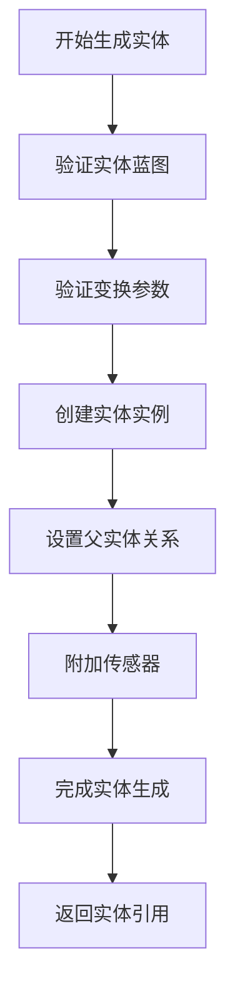
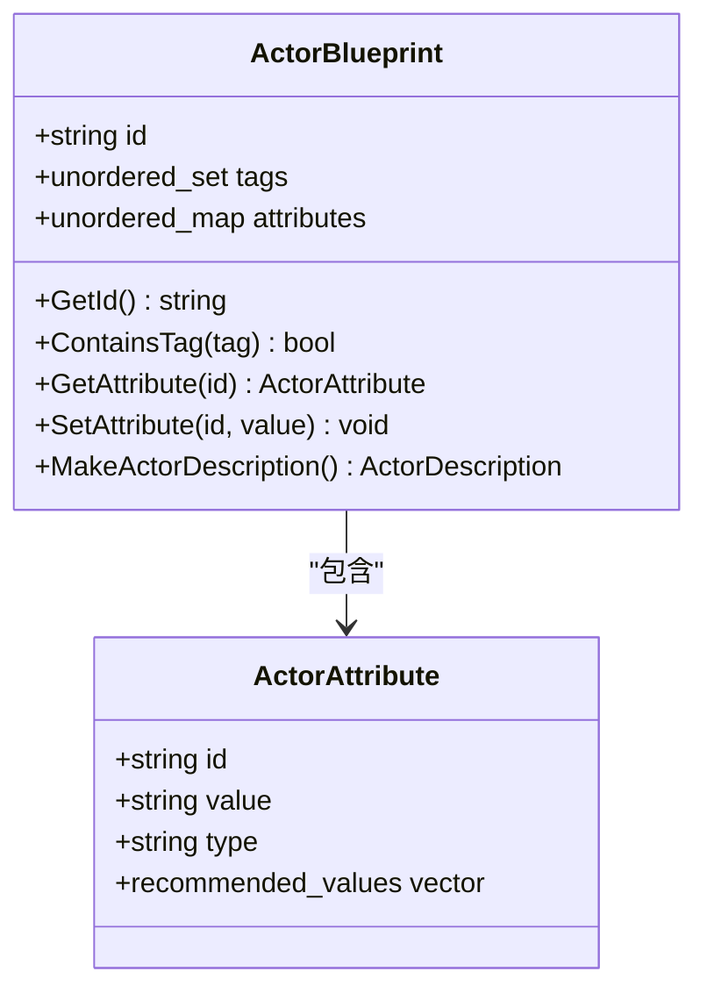
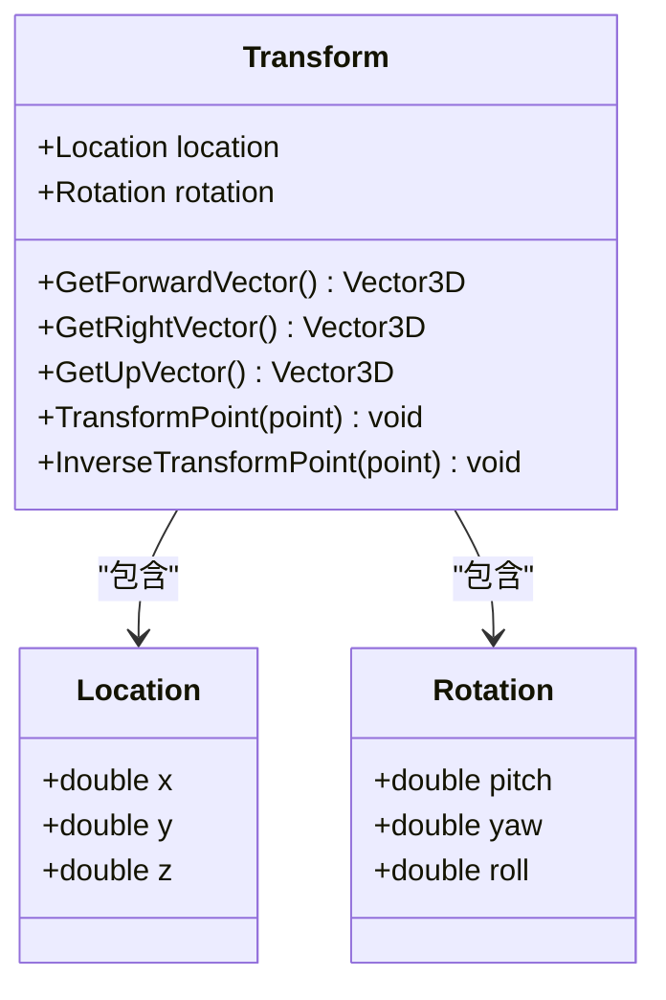
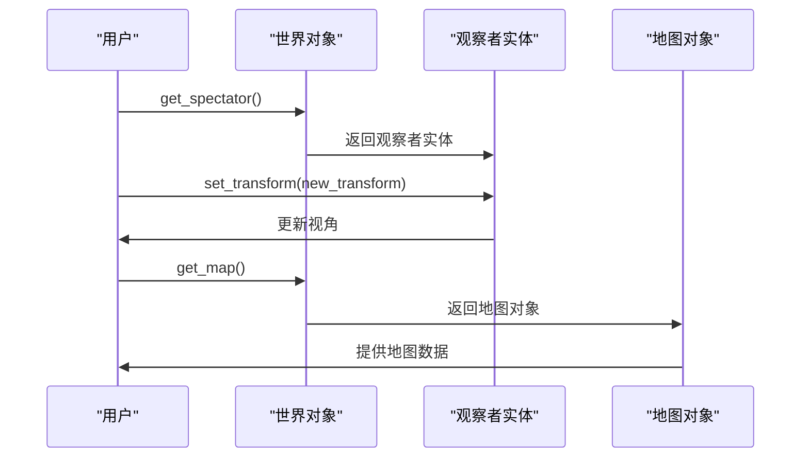
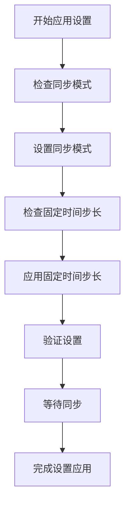
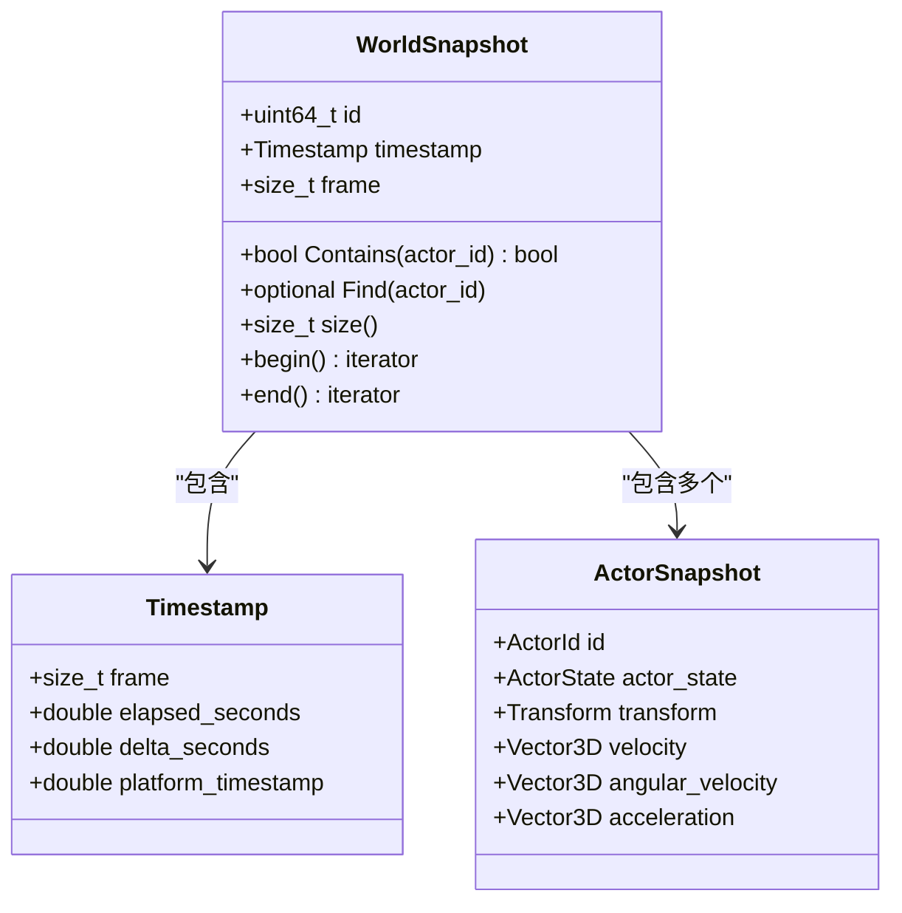

# 世界管理

> **引用文件**
> **本文档中引用的文件**

- [World.h](https://github.com/carla-simulator/carla/blob/ue5-dev/LibCarla/source/carla/client/World.h)
- [World.cpp](https://github.com/carla-simulator/carla/blob/ue5-dev/LibCarla/source/carla/client/World.cpp)
- [World.cpp](https://github.com/carla-simulator/carla/blob/ue5-dev/PythonAPI/carla/src/World.cpp)
- [core_world.md](https://github.com/carla-simulator/carla/blob/ue5-dev/Docs/core_world.md)
- [automatic_control.py](https://github.com/carla-simulator/carla/blob/ue5-dev/PythonAPI/examples/automatic_control.py)
- [ActorBlueprint.h](https://github.com/carla-simulator/carla/blob/ue5-dev/LibCarla/source/carla/client/ActorBlueprint.h)
- [Transform.h](https://github.com/carla-simulator/carla/blob/ue5-dev/LibCarla/source/carla/geom/Transform.h)
- [WorldSnapshot.h](https://github.com/carla-simulator/carla/blob/ue5-dev/LibCarla/source/carla/client/WorldSnapshot.h)
- [Timestamp.h](https://github.com/carla-simulator/carla/blob/ue5-dev/LibCarla/source/carla/client/Timestamp.h)

## 目录

1. [简介](#简介)
2. [核心功能详解](#核心功能详解)
3. [spawn_actor 方法详解](#spawn_actor方法详解)
4. [视角控制与地图获取](#视角控制与地图获取)
5. [地图图层动态管理](#地图图层动态管理)
6. [世界状态同步](#世界状态同步)
7. [WorldSnapshot 状态记录](#worldsnapshot状态记录)
8. [实际应用示例](#实际应用示例)
9. [初学者指南](#初学者指南)
10. [高级技术细节](#高级技术细节)

## 简介

世界管理是 CARLA 仿真系统的核心功能，它提供了对仿真环境的全面控制。`carla.World`类作为仿真环境的主要管理者，负责控制仿真中的所有实体和环境参数。通过世界对象，用户可以生成和管理仿真中的各种实体，控制视角，获取地图信息，管理地图图层，以及同步世界状态。本文档将深入探讨`carla.World`类的核心功能，为用户提供全面的使用指南。

**Section sources**

- <a href="https://github.com/carla-simulator/carla/blob/ue5-dev/Docs/core_world.md#L1-L278" target="_blank">core_world.md</a>

## 核心功能详解

`carla.World`类提供了对仿真环境的全面控制，其核心功能包括实体生成、视角控制、地图获取、图层管理和状态同步。这些功能共同构成了 CARLA 仿真系统的基础，使用户能够创建和控制复杂的仿真场景。世界对象通过客户端连接获取，是与仿真环境交互的主要接口。

**Section sources**

- <a href="https://github.com/carla-simulator/carla/blob/ue5-dev/LibCarla/source/carla/client/World.h#L45-L239" target="_blank">World.h</a>
- <a href="https://github.com/carla-simulator/carla/blob/ue5-dev/LibCarla/source/carla/client/World.cpp#L21-L392" target="_blank">World.cpp</a>

## spawn_actor 方法详解

`spawn_actor`方法是生成仿真实体的核心功能，它允许用户根据蓝图定义在指定位置生成各种类型的实体。该方法需要三个主要参数：实体蓝图、变换参数和可选的父实体。实体蓝图定义了要生成的实体类型和属性，变换参数定义了实体的位置和方向，父实体参数允许将新生成的实体附加到现有实体上。



**Diagram sources**

- <a href="https://github.com/carla-simulator/carla/blob/ue5-dev/LibCarla/source/carla/client/World.h#L114-L118" target="_blank">World.h</a>
- <a href="https://github.com/carla-simulator/carla/blob/ue5-dev/LibCarla/source/carla/client/World.cpp#L122-L128" target="_blank">World.cpp</a>

### ActorBlueprint 参数

`ActorBlueprint`类包含了生成实体所需的所有信息，包括实体 ID、标签和属性。实体 ID 唯一标识了实体类型，标签用于分类和筛选，属性则定义了实体的具体特征。用户可以通过设置属性来定制实体的外观和行为，例如车辆的颜色、传感器的噪声参数等。



**Diagram sources**

- <a href="https://github.com/carla-simulator/carla/blob/ue5-dev/LibCarla/source/carla/client/ActorBlueprint.h#L23-L125" target="_blank">ActorBlueprint.h</a>

### Transform 定位

`Transform`类定义了实体在三维空间中的位置和方向，由位置(`Location`)和旋转(`Rotation`)两个部分组成。位置使用三维坐标表示实体在世界中的坐标，旋转使用欧拉角表示实体的朝向。变换参数是生成实体时的关键参数，它决定了实体在仿真环境中的具体位置。



**Diagram sources**

- <a href="https://github.com/carla-simulator/carla/blob/ue5-dev/LibCarla/source/carla/geom/Transform.h#L23-L169" target="_blank">Transform.h</a>

### 噪声设置

噪声设置是传感器仿真中的重要功能，它允许用户为传感器添加真实的噪声特性。通过在实体蓝图中设置噪声相关的属性，可以模拟传感器在真实环境中的性能表现。噪声参数包括噪声种子、标准差和偏置等，这些参数共同决定了传感器输出的随机特性。

**Section sources**

- <a href="https://github.com/carla-simulator/carla/blob/ue5-dev/LibCarla/source/carla/client/ActorBlueprint.h#L23-L125" target="_blank">ActorBlueprint.h</a>
- <a href="https://github.com/carla-simulator/carla/blob/ue5-dev/LibCarla/source/carla/geom/Transform.h#L23-L169" target="_blank">Transform.h</a>

## 视角控制与地图获取

视角控制和地图获取是世界管理的重要功能，它们允许用户控制仿真视图和获取环境信息。`get_spectator`方法返回一个特殊的实体，它代表了仿真窗口的视角。通过修改这个实体的变换参数，可以实现视角的移动和旋转。`get_map`方法返回当前世界的地图对象，它包含了道路网络、车道信息和地标等详细数据。



**Diagram sources**

- <a href="https://github.com/carla-simulator/carla/blob/ue5-dev/LibCarla/source/carla/client/World.h#L83-L84" target="_blank">World.h</a>
- <a href="https://github.com/carla-simulator/carla/blob/ue5-dev/LibCarla/source/carla/client/World.h#L64-L65" target="_blank">World.h</a>

## 地图图层动态管理

地图图层动态管理功能允许用户在运行时加载和卸载地图的不同部分，这对于优化性能和创建动态场景非常有用。`load_map_layer`和`unload_map_layer`方法可以控制特定图层的可见性，例如建筑物、植被、街灯等。这些方法通过`MapLayer`枚举来指定要操作的图层类型。

```mermaid
erDiagram
WORLD ||--o{ MAP_LAYER : "包含"
WORLD {
string id
Map map
Spectator spectator
}
MAP_LAYER }|--|| BUILDINGS : "建筑"
MAP_LAYER }|--|| DECALS : "贴图"
MAP_LAYER }|--|| FOLIAGE : "植被"
MAP_LAYER }|--|| GROUND : "地面"
MAP_LAYER }|--|| PARKED_VEHICLES : "停放车辆"
MAP_LAYER }|--|| PARTICLES : "粒子"
MAP_LAYER }|--|| PROPS : "道具"
MAP_LAYER }|--|| STREET_LIGHTS : "街灯"
MAP_LAYER }|--|| WALLS : "墙壁"
class WORLD {
+load_map_layer(layer)
+unload_map_layer(layer)
}
```

**Diagram sources**

- <a href="https://github.com/carla-simulator/carla/blob/ue5-dev/LibCarla/source/carla/client/World.h#L66-L68" target="_blank">World.h</a>
- <a href="https://github.com/carla-simulator/carla/blob/ue5-dev/LibCarla/source/carla/client/World.cpp#L28-L34" target="_blank">World.cpp</a>

## 世界状态同步

世界状态同步是确保仿真一致性的关键功能，特别是在多客户端或需要精确时间控制的场景中。`apply_settings`方法允许用户配置世界的各种参数，包括同步模式、固定时间步长、渲染模式等。同步模式确保所有客户端在同一时间步上运行，而固定时间步长则保证了仿真的时间一致性。



**Diagram sources**

- <a href="https://github.com/carla-simulator/carla/blob/ue5-dev/LibCarla/source/carla/client/World.h#L85-L89" target="_blank">World.h</a>
- <a href="https://github.com/carla-simulator/carla/blob/ue5-dev/LibCarla/source/carla/client/World.cpp#L56-L84" target="_blank">World.cpp</a>

### 同步模式配置

同步模式配置是世界设置中的重要部分，它决定了仿真时间的推进方式。在同步模式下，仿真时间通过显式的`tick`调用来推进，这确保了所有客户端和传感器在同一时间步上运行。这种模式对于需要精确时间控制的仿真场景非常有用，例如自动驾驶算法测试。

**Section sources**

- <a href="https://github.com/carla-simulator/carla/blob/ue5-dev/LibCarla/source/carla/client/World.h#L85-L89" target="_blank">World.h</a>
- <a href="https://github.com/carla-simulator/carla/blob/ue5-dev/LibCarla/source/carla/client/World.cpp#L56-L84" target="_blank">World.cpp</a>

### 固定时间步长

固定时间步长是确保仿真时间一致性的关键参数。通过设置`fixed_delta_seconds`，可以指定每个仿真步的时间长度。这对于物理仿真和传感器数据采集非常重要，因为它确保了时间间隔的恒定，避免了由于帧率变化导致的时间不一致问题。

**Section sources**

- <a href="https://github.com/carla-simulator/carla/blob/ue5-dev/LibCarla/source/carla/client/World.h#L85-L89" target="_blank">World.h</a>
- <a href="https://github.com/carla-simulator/carla/blob/ue5-dev/LibCarla/source/carla/client/World.cpp#L56-L84" target="_blank">World.cpp</a>

## WorldSnapshot 状态记录

`WorldSnapshot`类提供了在特定时间点记录世界状态的功能，这对于调试、回放和分析仿真过程非常有用。快照包含了世界中所有实体的状态信息，包括位置、速度、加速度等。通过比较不同时间点的快照，可以分析实体的运动轨迹和行为模式。



**Diagram sources**

- <a href="https://github.com/carla-simulator/carla/blob/ue5-dev/LibCarla/source/carla/client/WorldSnapshot.h#L18-L78" target="_blank">WorldSnapshot.h</a>
- <a href="https://github.com/carla-simulator/carla/blob/ue5-dev/LibCarla/source/carla/client/Timestamp.h#L14-L73" target="_blank">Timestamp.h</a>

## 实际应用示例

在`automatic_control.py`示例中，世界管理功能被广泛应用于创建和控制仿真环境。该示例展示了如何使用世界对象来生成车辆、设置天气、控制视角和管理传感器。通过分析这个实际应用，可以更好地理解世界管理功能的使用方法和最佳实践。

**Section sources**

- <a href="https://github.com/carla-simulator/carla/blob/ue5-dev/PythonAPI/examples/automatic_control.py#L1-L849" target="_blank">automatic_control.py</a>

## 初学者指南

对于初学者来说，生成第一个车辆是学习 CARLA 的最佳起点。首先需要获取世界对象和蓝图库，然后选择一个车辆蓝图，找到一个合适的生成点，最后调用`spawn_actor`方法生成车辆。这个过程涵盖了世界管理的基本概念和操作方法。

**Section sources**

- <a href="https://github.com/carla-simulator/carla/blob/ue5-dev/PythonAPI/examples/automatic_control.py#L134-L160" target="_blank">automatic_control.py</a>

## 高级技术细节

对于高级用户，世界管理提供了批量生成和性能优化的技术细节。通过使用命令批处理，可以高效地生成大量实体。通过调整世界设置，可以优化仿真性能。这些高级功能使得 CARLA 能够处理复杂的仿真场景，满足专业应用的需求。

**Section sources**

- <a href="https://github.com/carla-simulator/carla/blob/ue5-dev/LibCarla/source/carla/client/World.h#L45-L239" target="_blank">World.h</a>
- <a href="https://github.com/carla-simulator/carla/blob/ue5-dev/LibCarla/source/carla/client/World.cpp#L21-L392" target="_blank">World.cpp</a>
