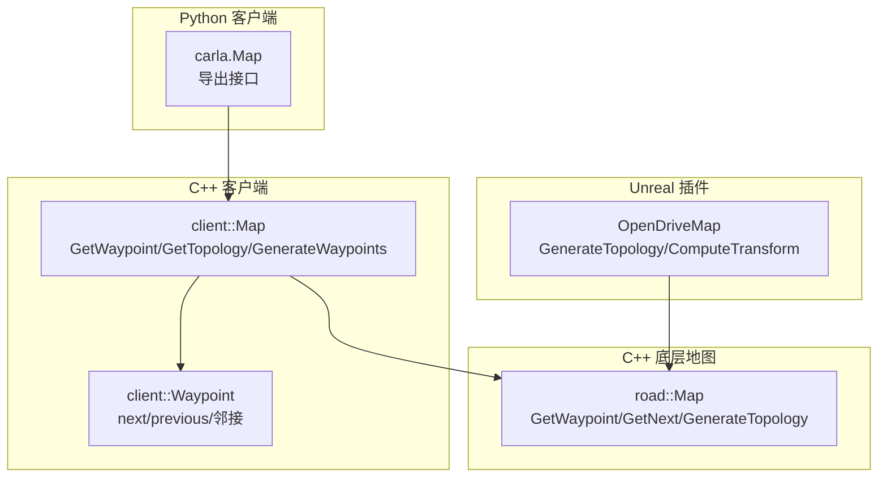
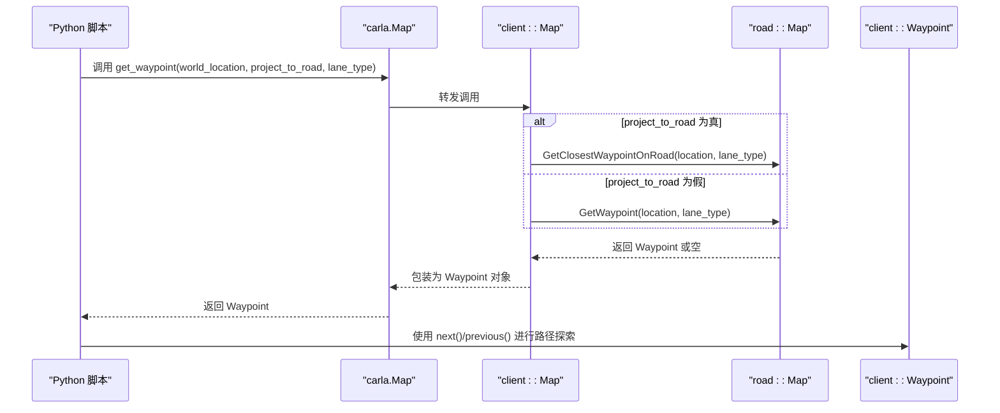
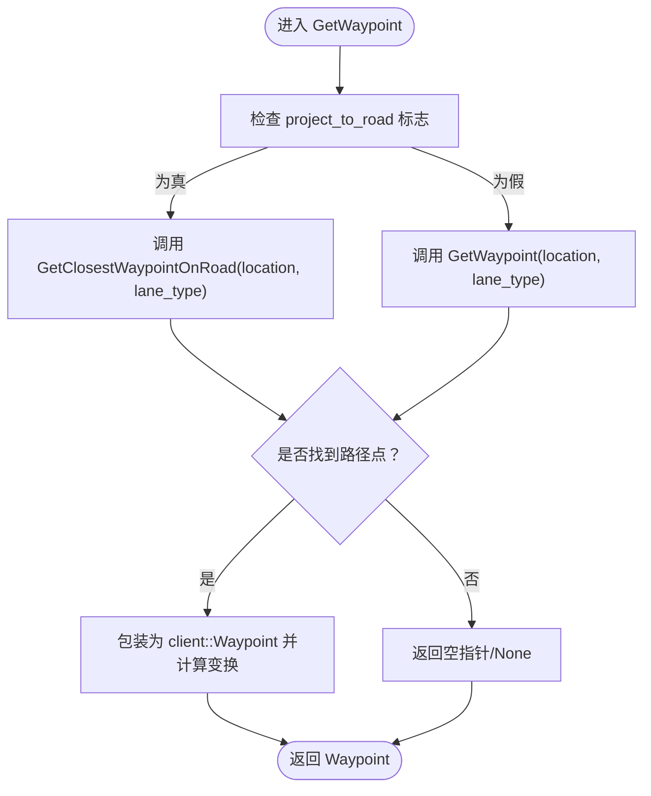
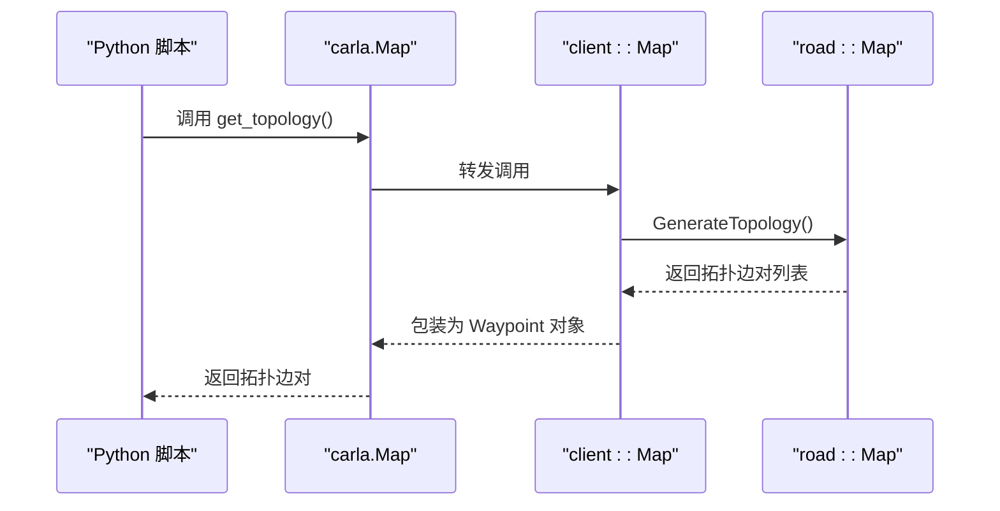
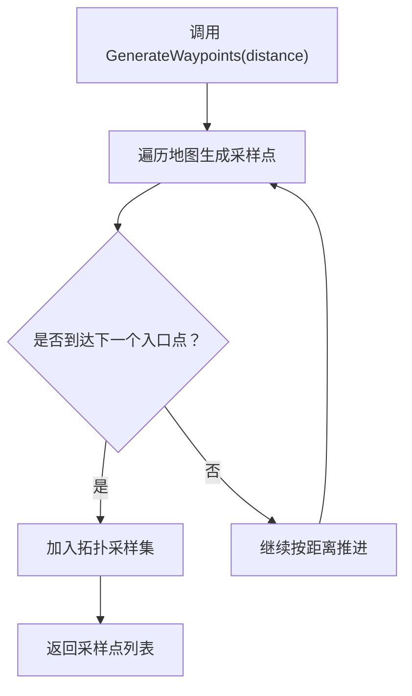
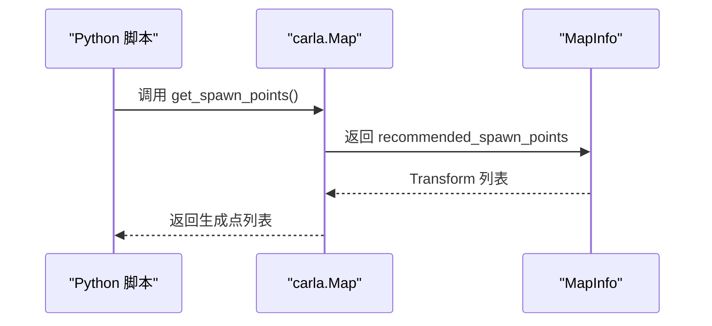
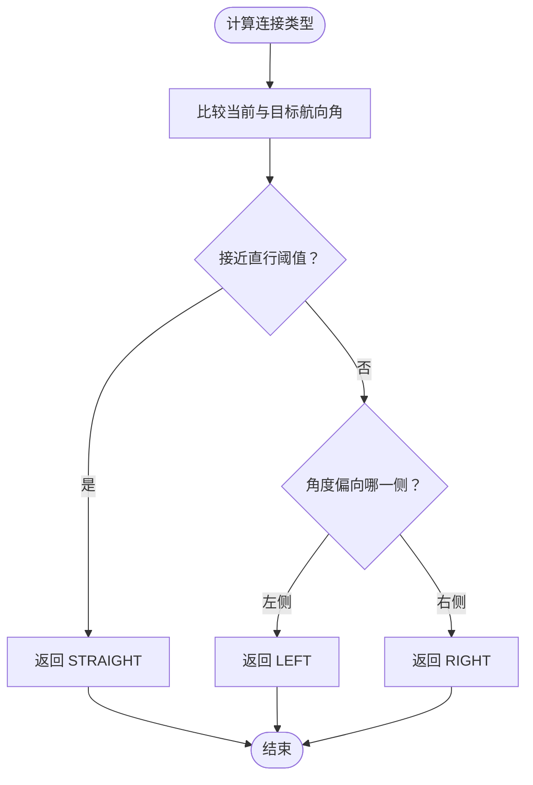
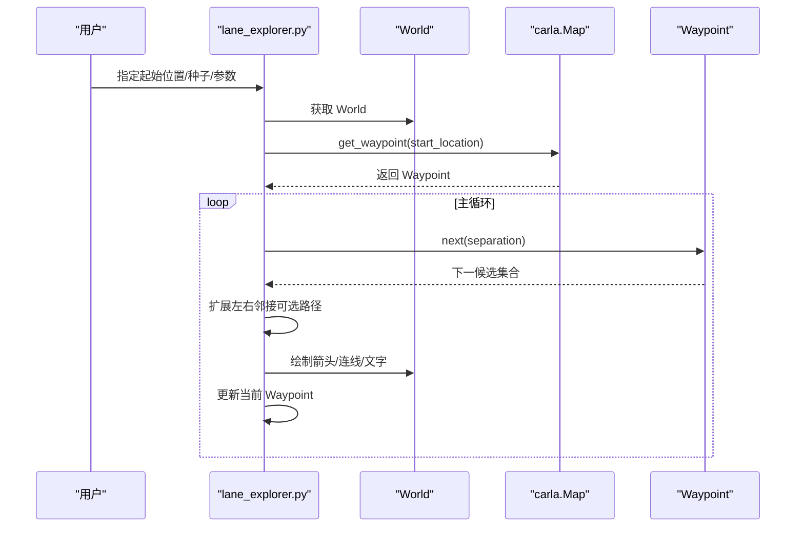
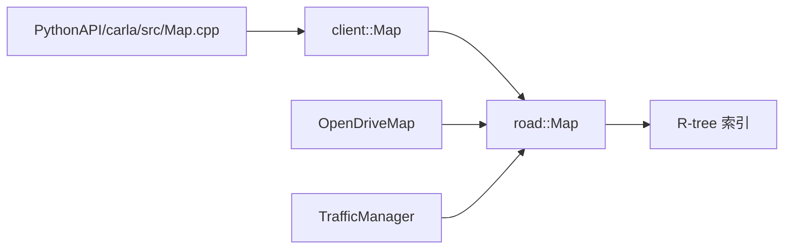

# 地图交互

**本文引用的文件列表**
- [LibCarla/source/carla/client/Map.h](https://github.com/carla-simulator/carla/blob/ue5-dev/LibCarla/source/carla/client/Map.h)
- [LibCarla/source/carla/client/Map.cpp](https://github.com/carla-simulator/carla/blob/ue5-dev/LibCarla/source/carla/client/Map.cpp)
- [LibCarla/source/carla/road/Map.h](https://github.com/carla-simulator/carla/blob/ue5-dev/LibCarla/source/carla/road/Map.h)
- [LibCarla/source/carla/client/Waypoint.cpp](https://github.com/carla-simulator/carla/blob/ue5-dev/LibCarla/source/carla/client/Waypoint.cpp)
- [LibCarla/source/carla/trafficmanager/InMemoryMap.cpp](https://github.com/carla-simulator/carla/blob/ue5-dev/LibCarla/source/carla/trafficmanager/InMemoryMap.cpp)
- [LibCarla/source/carla/trafficmanager/LocalizationStage.cpp](https://github.com/carla-simulator/carla/blob/ue5-dev/LibCarla/source/carla/trafficmanager/LocalizationStage.cpp)
- [PythonAPI/carla/src/Map.cpp](https://github.com/carla-simulator/carla/blob/ue5-dev/PythonAPI/carla/src/Map.cpp)
- [PythonAPI/examples/lane_explorer.py](https://github.com/carla-simulator/carla/blob/ue5-dev/PythonAPI/examples/lane_explorer.py)
- [PythonAPI/carla/agents/navigation/global_route_planner.py](https://github.com/carla-simulator/carla/blob/ue5-dev/PythonAPI/carla/agents/navigation/global_route_planner.py)
- [PythonAPI/carla/agents/navigation/local_planner.py](https://github.com/carla-simulator/carla/blob/ue5-dev/PythonAPI/carla/agents/navigation/local_planner.py)
- [PythonAPI/util/extract_spawn_points.py](https://github.com/carla-simulator/carla/blob/ue5-dev/PythonAPI/util/extract_spawn_points.py)
- [Unreal/CarlaUnreal/Plugins/Carla/Source/Carla/OpenDrive/OpenDriveMap.h](https://github.com/carla-simulator/carla/blob/ue5-dev/Unreal/CarlaUnreal/Plugins/Carla/Source/Carla/OpenDrive/OpenDriveMap.h)
- [Unreal/CarlaUnreal/Plugins/Carla/Source/Carla/OpenDrive/OpenDriveMap.cpp](https://github.com/carla-simulator/carla/blob/ue5-dev/Unreal/CarlaUnreal/Plugins/Carla/Source/Carla/OpenDrive/OpenDriveMap.cpp)
- [Unreal/CarlaUnreal/Plugins/CarlaTools/Source/CarlaTools/Private/OpenDriveToMap.cpp](https://github.com/carla-simulator/carla/blob/ue5-dev/Unreal/CarlaUnreal/Plugins/CarlaTools/Source/CarlaTools/Private/OpenDriveToMap.cpp)
- [Unreal/CarlaUnreal/Plugins/Carla/Source/Carla/Game/CarlaGameModeBase.cpp](https://github.com/carla-simulator/carla/blob/ue5-dev/Unreal/CarlaUnreal/Plugins/Carla/Source/Carla/Game/CarlaGameModeBase.cpp)
- [LibCarla/source/carla/rpc/MapInfo.h](https://github.com/carla-simulator/carla/blob/ue5-dev/LibCarla/source/carla/rpc/MapInfo.h)

## 目录
1. [简介](#简介)
2. [项目结构与入口](#项目结构与入口)
3. [核心组件](#核心组件)
4. [架构总览](#架构总览)
5. [详细组件分析](#详细组件分析)
6. [依赖关系分析](#依赖关系分析)
7. [性能考量](#性能考量)
8. [故障排查指南](#故障排查指南)
9. [结论](#结论)
10. [附录：基础到进阶路径规划指南](#附录基础到进阶路径规划指南)

## 简介
本文件围绕 CARLA 的地图交互能力，系统性梳理 carla.Map 类的地图查询功能，重点覆盖：
- get_waypoint 方法的使用、world_location 坐标转换与 project_to_road 标志对道路投影的影响
- get_spawn_points 获取车辆生成点的流程
- get_topology 获取道路拓扑结构及其在路径规划中的应用
- generate_waypoints 在路径规划中的作用
- lane_explorer.py 中道路拓扑可视化的实际用法
- RoadOption 在路径规划决策中的含义
- 面向初学者的基础路径点查询指南与面向高级用户的复杂路径规划与地图分析技术

## 项目结构与入口
- Python 客户端通过 PythonAPI 导出 carla.Map 接口，封装底层 C++ 实现，并提供 get_waypoint、get_topology、generate_waypoints、get_spawn_points 等常用方法。
- C++ 层在 LibCarla/source/carla/client/Map.cpp 提供 Map::GetWaypoint、Map::GetTopology、Map::GenerateWaypoints 等实现；底层地图数据结构由 LibCarla/source/carla/road/Map.h 提供。
- Unreal 插件层（OpenDriveMap）提供蓝图可用的生成拓扑、生成入口点、计算变换等接口，用于编辑器或关卡生成场景。
- 示例与工具脚本位于 PythonAPI/examples 与 PythonAPI/util，如 lane_explorer.py 与 extract_spawn_points.py。

图表来源
- [PythonAPI/carla/src/Map.cpp](https://github.com/carla-simulator/carla/blob/ue5-dev/PythonAPI/carla/src/Map.cpp#L131-L148)
- [LibCarla/source/carla/client/Map.cpp](https://github.com/carla-simulator/carla/blob/ue5-dev/LibCarla/source/carla/client/Map.cpp#L44-L82)
- [LibCarla/source/carla/road/Map.h](https://github.com/carla-simulator/carla/blob/ue5-dev/LibCarla/source/carla/road/Map.h#L54-L143)
- [Unreal/CarlaUnreal/Plugins/Carla/Source/Carla/OpenDrive/OpenDriveMap.h](https://github.com/carla-simulator/carla/blob/ue5-dev/Unreal/CarlaUnreal/Plugins/Carla/Source/Carla/OpenDrive/OpenDriveMap.h#L60-L98)

章节来源
- [PythonAPI/carla/src/Map.cpp](https://github.com/carla-simulator/carla/blob/ue5-dev/PythonAPI/carla/src/Map.cpp#L131-L148)
- [LibCarla/source/carla/client/Map.h](https://github.com/carla-simulator/carla/blob/ue5-dev/LibCarla/source/carla/client/Map.h#L54-L69)
- [LibCarla/source/carla/road/Map.h](https://github.com/carla-simulator/carla/blob/ue5-dev/LibCarla/source/carla/road/Map.h#L54-L143)

## 核心组件
- carla.Map（Python）：对外暴露地图查询与生成接口，包括 get_waypoint、get_topology、generate_waypoints、get_spawn_points 等。
- client::Map（C++）：封装底层 road::Map，提供 GetWaypoint、GetTopology、GenerateWaypoints 等方法。
- road::Map（C++）：底层地图数据结构与算法，包含 GetWaypoint、GetClosestWaypointOnRoad、GetNext、GenerateTopology、GenerateWaypointsOnRoadEntries 等。
- client::Waypoint（C++）：表示路径点，支持 next/previous、左右邻接车道、是否在交叉口等属性与查询。
- Unreal OpenDriveMap：蓝图可用的地图生成与变换接口，便于关卡生成与编辑器可视化。

章节来源
- [PythonAPI/carla/src/Map.cpp](https://github.com/carla-simulator/carla/blob/ue5-dev/PythonAPI/carla/src/Map.cpp#L131-L148)
- [LibCarla/source/carla/client/Map.h](https://github.com/carla-simulator/carla/blob/ue5-dev/LibCarla/source/carla/client/Map.h#L54-L69)
- [LibCarla/source/carla/road/Map.h](https://github.com/carla-simulator/carla/blob/ue5-dev/LibCarla/source/carla/road/Map.h#L54-L143)
- [LibCarla/source/carla/client/Waypoint.cpp](https://github.com/carla-simulator/carla/blob/ue5-dev/LibCarla/source/carla/client/Waypoint.cpp#L18-L48)

## 架构总览
下图展示从 Python 调用到 C++ 实现再到底层地图数据结构的整体调用链，以及与 Unreal 插件的衔接。

图表来源
- [PythonAPI/carla/src/Map.cpp](https://github.com/carla-simulator/carla/blob/ue5-dev/PythonAPI/carla/src/Map.cpp#L131-L139)
- [LibCarla/source/carla/client/Map.cpp](https://github.com/carla-simulator/carla/blob/ue5-dev/LibCarla/source/carla/client/Map.cpp#L44-L57)
- [LibCarla/source/carla/road/Map.h](https://github.com/carla-simulator/carla/blob/ue5-dev/LibCarla/source/carla/road/Map.h#L54-L66)

## 详细组件分析

### get_waypoint：世界坐标到路径点的映射与投影
- 参数与行为
  - world_location：世界坐标位置
  - project_to_road：布尔标志，控制是否将输入位置投影到最近的可行驶道路上
  - lane_type：限制返回的路径点所属的车道类型（默认为驾驶类型）
- 坐标转换
  - Python 层通过导出函数将传入的 Location 转换为底层几何类型后传递给 C++ 实现
  - C++ 层根据 project_to_road 决定调用 GetClosestWaypointOnRoad 或 GetWaypoint
  - 返回的 Waypoint 对象会计算其全局变换（ComputeTransform），用于后续可视化或导航
- project_to_road 的影响
  - 为真时：优先返回最近道路上的路径点，适合从任意位置快速定位到可行驶路径
  - 为假时：仅返回精确匹配到地图数据中的路径点，可能为空
- 复杂度与性能
  - 底层使用 R-tree 近似索引加速最近邻查找，时间复杂度近似 O(log N) 到 O(N) 取决于查询密度
  - 建议在批量查询时复用同一 Map 对象以避免重复构建索引

图表来源
- [LibCarla/source/carla/client/Map.cpp](https://github.com/carla-simulator/carla/blob/ue5-dev/LibCarla/source/carla/client/Map.cpp#L44-L57)
- [LibCarla/source/carla/road/Map.h](https://github.com/carla-simulator/carla/blob/ue5-dev/LibCarla/source/carla/road/Map.h#L54-L66)
- [LibCarla/source/carla/client/Waypoint.cpp](https://github.com/carla-simulator/carla/blob/ue5-dev/LibCarla/source/carla/client/Waypoint.cpp#L18-L22)

章节来源
- [LibCarla/source/carla/client/Map.cpp](https://github.com/carla-simulator/carla/blob/ue5-dev/LibCarla/source/carla/client/Map.cpp#L44-L57)
- [LibCarla/source/carla/road/Map.h](https://github.com/carla-simulator/carla/blob/ue5-dev/LibCarla/source/carla/road/Map.h#L54-L66)
- [LibCarla/source/carla/client/Waypoint.cpp](https://github.com/carla-simulator/carla/blob/ue5-dev/LibCarla/source/carla/client/Waypoint.cpp#L18-L22)

### get_topology：道路拓扑结构与路径规划应用
- 功能概述
  - 返回所有“起点-终点”路径点对，构成地图的最小拓扑集合
  - 每个拓扑边代表一个可直行的连续路段，便于进行路径规划与路由
- Python 侧导出
  - PythonAPI 将拓扑边对列表导出为元组列表，便于上层导航模块直接使用
- 导航应用
  - 全局路径规划器基于拓扑边构造图，结合采样分辨率生成详细路径
  - 局部路径规划器依据当前 Waypoint 的方向与邻接关系选择直行、左转、右转等 RoadOption

图表来源
- [PythonAPI/carla/src/Map.cpp](https://github.com/carla-simulator/carla/blob/ue5-dev/PythonAPI/carla/src/Map.cpp#L137-L137)
- [LibCarla/source/carla/client/Map.cpp](https://github.com/carla-simulator/carla/blob/ue5-dev/LibCarla/source/carla/client/Map.cpp#L70-L82)
- [LibCarla/source/carla/road/Map.h](https://github.com/carla-simulator/carla/blob/ue5-dev/LibCarla/source/carla/road/Map.h#L141-L143)

章节来源
- [PythonAPI/carla/src/Map.cpp](https://github.com/carla-simulator/carla/blob/ue5-dev/PythonAPI/carla/src/Map.cpp#L137-L137)
- [LibCarla/source/carla/client/Map.cpp](https://github.com/carla-simulator/carla/blob/ue5-dev/LibCarla/source/carla/client/Map.cpp#L70-L82)
- [LibCarla/source/carla/road/Map.h](https://github.com/carla-simulator/carla/blob/ue5-dev/LibCarla/source/carla/road/Map.h#L141-L143)

### generate_waypoints：路径规划采样与可视化
- 功能概述
  - 以近似距离生成地图上的路径点网格，用于路径规划采样、可视化或离线分析
- 应用场景
  - 全局路径规划器在拓扑基础上，按采样分辨率生成中间路径点
  - 可视化工具（如 lane_explorer.py）利用该网格进行轨迹绘制与交互
- Unreal 插件
  - OpenDriveMap 提供蓝图接口 GenerateWaypoints/GenerateTopology/GenerateWaypointsOnRoadEntries，便于编辑器生成入口点与拓扑

图表来源
- [LibCarla/source/carla/road/Map.h](https://github.com/carla-simulator/carla/blob/ue5-dev/LibCarla/source/carla/road/Map.h#L133-L139)
- [Unreal/CarlaUnreal/Plugins/Carla/Source/Carla/OpenDrive/OpenDriveMap.h](https://github.com/carla-simulator/carla/blob/ue5-dev/Unreal/CarlaUnreal/Plugins/Carla/Source/Carla/OpenDrive/OpenDriveMap.h#L60-L71)

章节来源
- [LibCarla/source/carla/road/Map.h](https://github.com/carla-simulator/carla/blob/ue5-dev/LibCarla/source/carla/road/Map.h#L133-L139)
- [Unreal/CarlaUnreal/Plugins/Carla/Source/Carla/OpenDrive/OpenDriveMap.h](https://github.com/carla-simulator/carla/blob/ue5-dev/Unreal/CarlaUnreal/Plugins/Carla/Source/Carla/OpenDrive/OpenDriveMap.h#L60-L71)

### get_spawn_points：车辆生成点的获取与落地
- 数据来源
  - MapInfo 中包含推荐的生成点列表（Transform 序列）
  - Python 层通过导出 get_spawn_points 返回该列表
- 实际应用
  - 工具脚本 extract_spawn_points 读取生成点并在场景中标注或导出 CSV
  - Unreal GameMode 通过 GenerateTopology 生成入口点并放置生成器

图表来源
- [PythonAPI/carla/src/Map.cpp](https://github.com/carla-simulator/carla/blob/ue5-dev/PythonAPI/carla/src/Map.cpp#L134-L134)
- [LibCarla/source/carla/rpc/MapInfo.h](https://github.com/carla-simulator/carla/blob/ue5-dev/LibCarla/source/carla/rpc/MapInfo.h#L18-L26)
- [PythonAPI/util/extract_spawn_points.py](https://github.com/carla-simulator/carla/blob/ue5-dev/PythonAPI/util/extract_spawn_points.py#L35-L58)
- [Unreal/CarlaUnreal/Plugins/CarlaTools/Source/CarlaTools/Private/OpenDriveToMap.cpp](https://github.com/carla-simulator/carla/blob/ue5-dev/Unreal/CarlaUnreal/Plugins/CarlaTools/Source/CarlaTools/Private/OpenDriveToMap.cpp#L739-L755)

章节来源
- [PythonAPI/carla/src/Map.cpp](https://github.com/carla-simulator/carla/blob/ue5-dev/PythonAPI/carla/src/Map.cpp#L134-L134)
- [LibCarla/source/carla/rpc/MapInfo.h](https://github.com/carla-simulator/carla/blob/ue5-dev/LibCarla/source/carla/rpc/MapInfo.h#L18-L26)
- [PythonAPI/util/extract_spawn_points.py](https://github.com/carla-simulator/carla/blob/ue5-dev/PythonAPI/util/extract_spawn_points.py#L35-L58)
- [Unreal/CarlaUnreal/Plugins/CarlaTools/Source/CarlaTools/Private/OpenDriveToMap.cpp](https://github.com/carla-simulator/carla/blob/ue5-dev/Unreal/CarlaUnreal/Plugins/CarlaTools/Source/CarlaTools/Private/OpenDriveToMap.cpp#L739-L755)

### RoadOption：路径规划决策的语义
- RoadOption 含义
  - LEFT/RIGHT/STRAIGHT：在拓扑连接处的转向决策
  - LANEFOLLOW：沿当前车道直行
  - CHANGELANELEFT/CHANGELANERIGHT：变道决策
  - VOID：无效或未定义
- 决策过程
  - 局部规划器根据当前 Waypoint 与候选目标的航向差计算 RoadOption
  - 全局规划器在拓扑边之间选择合适的 RoadOption，并据此生成路径片段
- Traffic Manager 中的使用
  - InMemoryMap 与 LocalizationStage 将 RoadOption 分配到 SimpleWaypoint，驱动仿真中的转向与变道

图表来源
- [PythonAPI/carla/agents/navigation/local_planner.py](https://github.com/carla-simulator/carla/blob/ue5-dev/PythonAPI/carla/agents/navigation/local_planner.py#L328-L352)
- [LibCarla/source/carla/trafficmanager/InMemoryMap.cpp](https://github.com/carla-simulator/carla/blob/ue5-dev/LibCarla/source/carla/trafficmanager/InMemoryMap.cpp#L447-L451)
- [LibCarla/source/carla/trafficmanager/LocalizationStage.cpp](https://github.com/carla-simulator/carla/blob/ue5-dev/LibCarla/source/carla/trafficmanager/LocalizationStage.cpp#L549-L574)

章节来源
- [PythonAPI/carla/agents/navigation/local_planner.py](https://github.com/carla-simulator/carla/blob/ue5-dev/PythonAPI/carla/agents/navigation/local_planner.py#L328-L352)
- [LibCarla/source/carla/trafficmanager/InMemoryMap.cpp](https://github.com/carla-simulator/carla/blob/ue5-dev/LibCarla/source/carla/trafficmanager/InMemoryMap.cpp#L447-L451)
- [LibCarla/source/carla/trafficmanager/LocalizationStage.cpp](https://github.com/carla-simulator/carla/blob/ue5-dev/LibCarla/source/carla/trafficmanager/LocalizationStage.cpp#L549-L574)

### lane_explorer.py：道路拓扑可视化的真实用法
- 功能要点
  - 从用户指定位置获取初始 Waypoint
  - 通过 next(waypoint_separation) 获取潜在下一路径点
  - 根据车道变更标志与相邻车道类型，扩展左右可选路径
  - 可选显示信息与绘制箭头、连线、交叉口边界框
- 实践建议
  - 使用 project_to_road=True（默认）确保从任意位置都能落到可行驶路径
  - 结合 get_topology 与 next() 构建简单路径树，辅助理解拓扑结构

图表来源
- [PythonAPI/examples/lane_explorer.py](https://github.com/carla-simulator/carla/blob/ue5-dev/PythonAPI/examples/lane_explorer.py#L121-L163)

章节来源
- [PythonAPI/examples/lane_explorer.py](https://github.com/carla-simulator/carla/blob/ue5-dev/PythonAPI/examples/lane_explorer.py#L121-L163)

## 依赖关系分析
- Python -> client::Map -> road::Map -> R-tree 索引
- Unreal OpenDriveMap 与 road::Map 共享底层数据结构，提供蓝图接口
- Traffic Manager 在 InMemoryMap 中使用 RoadOption 与 SimpleWaypoint 进行仿真驱动

图表来源
- [PythonAPI/carla/src/Map.cpp](https://github.com/carla-simulator/carla/blob/ue5-dev/PythonAPI/carla/src/Map.cpp#L131-L148)
- [LibCarla/source/carla/client/Map.h](https://github.com/carla-simulator/carla/blob/ue5-dev/LibCarla/source/carla/client/Map.h#L54-L69)
- [LibCarla/source/carla/road/Map.h](https://github.com/carla-simulator/carla/blob/ue5-dev/LibCarla/source/carla/road/Map.h#L209-L227)
- [Unreal/CarlaUnreal/Plugins/Carla/Source/Carla/OpenDrive/OpenDriveMap.h](https://github.com/carla-simulator/carla/blob/ue5-dev/Unreal/CarlaUnreal/Plugins/Carla/Source/Carla/OpenDrive/OpenDriveMap.h#L60-L98)
- [LibCarla/source/carla/trafficmanager/InMemoryMap.cpp](https://github.com/carla-simulator/carla/blob/ue5-dev/LibCarla/source/carla/trafficmanager/InMemoryMap.cpp#L447-L451)

章节来源
- [LibCarla/source/carla/road/Map.h](https://github.com/carla-simulator/carla/blob/ue5-dev/LibCarla/source/carla/road/Map.h#L209-L227)
- [LibCarla/source/carla/client/Map.h](https://github.com/carla-simulator/carla/blob/ue5-dev/LibCarla/source/carla/client/Map.h#L54-L69)
- [PythonAPI/carla/src/Map.cpp](https://github.com/carla-simulator/carla/blob/ue5-dev/PythonAPI/carla/src/Map.cpp#L131-L148)

## 性能考量
- get_waypoint 的 project_to_road 为真时，内部调用 GetClosestWaypointOnRoad，依赖 R-tree 近似索引，查询效率高；为假时严格匹配，可能返回空且不触发索引。
- generate_waypoints 与 get_topology 的采样密度与分辨率直接影响内存占用与计算开销；建议按需调整采样步长。
- Unreal OpenDriveMap 的 GenerateTopology/GenerateWaypointsOnRoadEntries 适合离线生成与编辑器使用，运行时建议优先使用 Python/C++ 导出接口。

## 故障排查指南
- get_waypoint 返回空
  - 检查 project_to_road 是否为假导致严格匹配失败
  - 确认 lane_type 是否与目标区域一致（如非驾驶类型）
- get_topology 为空
  - 确认地图已正确加载且包含拓扑数据
  - 检查生成分辨率是否过大导致采样稀疏
- RoadOption 不符合预期
  - 检查局部规划器的角度阈值设置
  - 确认当前 Waypoint 与目标 Waypoint 的航向差是否超过阈值
- Unreal 生成点不生效
  - 检查 GenerateTopology/ComputeTransform 是否被正确调用
  - 确认生成高度偏移与世界坐标系一致

章节来源
- [LibCarla/source/carla/client/Map.cpp](https://github.com/carla-simulator/carla/blob/ue5-dev/LibCarla/source/carla/client/Map.cpp#L44-L57)
- [LibCarla/source/carla/trafficmanager/LocalizationStage.cpp](https://github.com/carla-simulator/carla/blob/ue5-dev/LibCarla/source/carla/trafficmanager/LocalizationStage.cpp#L192-L216)
- [Unreal/CarlaUnreal/Plugins/Carla/Source/Carla/OpenDrive/OpenDriveMap.cpp](https://github.com/carla-simulator/carla/blob/ue5-dev/Unreal/CarlaUnreal/Plugins/Carla/Source/Carla/OpenDrive/OpenDriveMap.cpp#L131-L141)

## 结论
- carla.Map 提供了从世界坐标到路径点的高效映射、最小拓扑结构、采样路径点与推荐生成点等关键能力
- project_to_road 是 get_waypoint 的关键开关，决定投影策略与返回结果
- get_topology 与 generate_waypoints 为路径规划提供了坚实的数据基础
- RoadOption 为导航决策提供了明确的语义标签
- lane_explorer.py 展示了如何结合拓扑与邻接关系进行可视化探索

## 附录：基础到进阶路径规划指南
- 初学者指南
  - 从 get_waypoint(project_to_road=True) 获取初始路径点
  - 使用 next()/previous() 沿道路前进/后退
  - 通过 get_topology 快速理解地图连通性
  - 使用 get_spawn_points 为车辆生成提供预设位置
- 进阶指南
  - 基于 get_topology 构造图模型，结合 generate_waypoints 生成细粒度路径
  - 使用 RoadOption 进行转向与变道决策，参考局部与全局规划器实现
  - 在 Unreal 中使用 OpenDriveMap 的蓝图接口生成拓扑与入口点，提升关卡生成效率

章节来源
- [PythonAPI/carla/agents/navigation/global_route_planner.py](https://github.com/carla-simulator/carla/blob/ue5-dev/PythonAPI/carla/agents/navigation/global_route_planner.py#L51-L67)
- [PythonAPI/carla/agents/navigation/local_planner.py](https://github.com/carla-simulator/carla/blob/ue5-dev/PythonAPI/carla/agents/navigation/local_planner.py#L306-L352)
- [Unreal/CarlaUnreal/Plugins/Carla/Source/Carla/OpenDrive/OpenDriveMap.h](https://github.com/carla-simulator/carla/blob/ue5-dev/Unreal/CarlaUnreal/Plugins/Carla/Source/Carla/OpenDrive/OpenDriveMap.h#L60-L98)