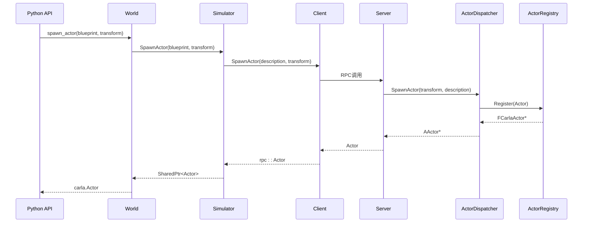
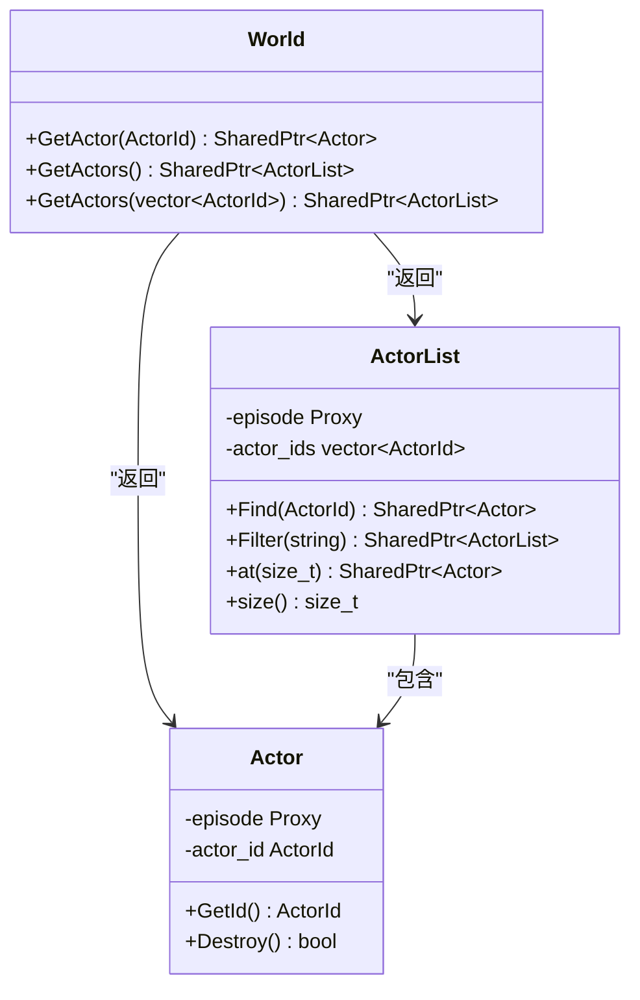
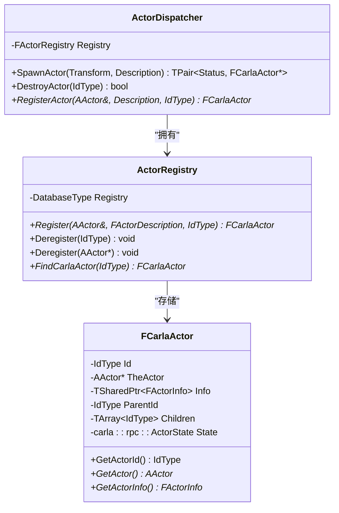

# 场景管理


**本文档引用的文件**   
- [World.h](https://github.com/carla-simulator/carla/blob/ue5-dev/LibCarla/source/carla/client/World.h)
- [World.cpp](https://github.com/carla-simulator/carla/blob/ue5-dev/LibCarla/source/carla/client/World.cpp)
- [Actor.cpp](https://github.com/carla-simulator/carla/blob/ue5-dev/LibCarla/source/carla/client/Actor.cpp)
- [Actor.h](https://github.com/carla-simulator/carla/blob/ue5-dev/LibCarla/source/carla/client/Actor.h)
- [ActorBlueprint.cpp](https://github.com/carla-simulator/carla/blob/ue5-dev/LibCarla/source/carla/client/ActorBlueprint.cpp)
- [ActorBlueprint.h](https://github.com/carla-simulator/carla/blob/ue5-dev/LibCarla/source/carla/client/ActorBlueprint.h)
- [ActorDispatcher.h](https://github.com/carla-simulator/carla/blob/ue5-dev/Unreal/CarlaUnreal/Plugins/Carla/Source/Carla/Actor/ActorDispatcher.h)
- [ActorDispatcher.cpp](https://github.com/carla-simulator/carla/blob/ue5-dev/Unreal/CarlaUnreal/Plugins/Carla/Source/Carla/Actor/ActorDispatcher.cpp)
- [Simulator.cpp](https://github.com/carla-simulator/carla/blob/ue5-dev/LibCarla/source/carla/client/detail/Simulator.cpp)
- [automatic_control.py](https://github.com/carla-simulator/carla/blob/ue5-dev/PythonAPI/examples/automatic_control.py)
- [adv_traffic_manager.md](https://github.com/carla-simulator/carla/blob/ue5-dev/Docs/adv_traffic_manager.md)


## 目录
1. [简介](#简介)
2. [核心场景操作](#核心场景操作)
3. [spawn_actor方法详解](#spawn_actor方法详解)
4. [destroy_actor方法详解](#destroy_actor方法详解)
5. [实体查询方法](#实体查询方法)
6. [ActorRegistry与生命周期管理](#actorregistry与生命周期管理)
7. [代码示例](#代码示例)
8. [最佳实践](#最佳实践)

## 简介
CARLA模拟器中的`carla.World`类是场景管理的核心，负责控制模拟环境中的所有实体（actors）。本文档详细解释`carla.World`类的场景操作功能，包括实体的生成、销毁、查询以及生命周期管理。文档将深入分析`spawn_actor`和`destroy_actor`等关键方法的实现细节，并提供从初学者到高级用户的完整指南。

## 核心场景操作
`carla.World`类提供了管理模拟场景的核心功能，主要包括实体的生成、销毁和查询。这些操作通过C++后端实现，并通过Python API暴露给用户。核心操作包括：
- **实体生成**：通过`spawn_actor`方法在指定位置生成新实体
- **实体销毁**：通过`destroy_actor`方法清理不再需要的实体
- **实体查询**：通过`get_actor`和`get_actors`方法获取场景中的实体
- **生命周期管理**：通过ActorRegistry跟踪所有实体的状态

这些操作确保了模拟环境的动态性和可控性，是构建复杂自动驾驶场景的基础。

**Section sources**
- [World.h](https://github.com/carla-simulator/carla/blob/ue5-dev/LibCarla/source/carla/client/World.h#L111-L127)
- [World.cpp](https://github.com/carla-simulator/carla/blob/ue5-dev/LibCarla/source/carla/client/World.cpp#L122-L128)

## spawn_actor方法详解
`spawn_actor`方法是场景管理中最关键的操作之一，用于在模拟环境中生成新的实体。该方法的实现涉及多个组件的协同工作。

### ActorBlueprint参数配置
`ActorBlueprint`类包含了生成实体所需的所有信息，包括实体类型、属性和标签。蓝图通过`MakeActorDescription`方法转换为RPC消息，包含以下关键信息：
- **ID**：实体的唯一标识符
- **标签**：用于分类和过滤的标签集合
- **属性**：实体的可配置属性，如颜色、生成代数等

蓝图的属性可以通过`set_attribute`方法进行配置，例如设置车辆颜色或生成代数。

### Transform定位与坐标系统
`Transform`类定义了实体在3D空间中的位置和方向，包含`Location`（位置）和`Rotation`（旋转）两个组件。坐标系统遵循右手定则：
- **X轴**：向前方向
- **Y轴**：向右方向  
- **Z轴**：向上方向

旋转使用欧拉角表示，按Yaw-Pitch-Roll顺序应用。`Transform`的`TransformPoint`方法首先应用旋转，然后进行平移。

### noise_seed参数与随机化
虽然`spawn_actor`方法本身不直接接受`noise_seed`参数，但随机化在实体生成过程中起着重要作用。通过`set_pedestrians_seed`方法可以设置行人的随机种子，确保在相同条件下产生一致的行为。这对于可重复的模拟实验至关重要。



**Diagram sources**
- [World.h](https://github.com/carla-simulator/carla/blob/ue5-dev/LibCarla/source/carla/client/World.h#L114-L118)
- [World.cpp](https://github.com/carla-simulator/carla/blob/ue5-dev/LibCarla/source/carla/client/World.cpp#L122-L128)
- [Simulator.cpp](https://github.com/carla-simulator/carla/blob/ue5-dev/LibCarla/source/carla/client/detail/Simulator.cpp#L345-L373)
- [ActorDispatcher.h](https://github.com/carla-simulator/carla/blob/ue5-dev/Unreal/CarlaUnreal/Plugins/Carla/Source/Carla/Actor/ActorDispatcher.h#L51-L54)

**Section sources**
- [World.h](https://github.com/carla-simulator/carla/blob/ue5-dev/LibCarla/source/carla/client/World.h#L111-L128)
- [ActorBlueprint.h](https://github.com/carla-simulator/carla/blob/ue5-dev/LibCarla/source/carla/client/ActorBlueprint.h#L23-L125)
- [ActorBlueprint.cpp](https://github.com/carla-simulator/carla/blob/ue5-dev/LibCarla/source/carla/client/ActorBlueprint.cpp#L26-L67)
- [Transform.h](https://github.com/carla-simulator/carla/blob/ue5-dev/LibCarla/source/carla/geom/Transform.h#L46-L79)

## destroy_actor方法详解
`destroy_actor`方法负责清理场景中的实体，确保资源得到正确释放。该方法的实现涉及多个层次的协调。

### 资源清理流程
实体销毁是一个多步骤的过程，确保所有相关资源都被正确清理：
1. 从ActorRegistry中注销实体
2. 销毁实体的控制器（如存在）
3. 销毁实体本身
4. 通知记录器（recorder）和流量管理器

### 错误处理与状态检查
在销毁过程中，系统会进行严格的状态检查：
- 验证实体是否存在于注册表中
- 检查实体是否已标记为待销毁
- 处理可能的销毁失败情况

这些检查确保了系统的稳定性和数据一致性。

```mermaid
sequenceDiagram
participant Actor as carla.Actor
participant World as World
participant Simulator as Simulator
participant Client as Client
participant Server as Server
participant Registry as ActorRegistry
Actor->>World : Destroy()
World->>Simulator : DestroyActor(actor)
Simulator->>Client : DestroyActor(id)
Client->>Server : RPC调用
Server->>ActorDispatcher : DestroyActor(id)
ActorDispatcher->>Registry : Deregister(id)
Registry-->>ActorDispatcher : true
ActorDispatcher->>Server : true
Server-->>Client : true
Client-->>Simulator : true
Simulator-->>World : true
World-->>Actor : true
```

**Diagram sources**
- [Actor.h](https://github.com/carla-simulator/carla/blob/ue5-dev/LibCarla/source/carla/client/Actor.h#L146-L153)
- [Actor.cpp](https://github.com/carla-simulator/carla/blob/ue5-dev/LibCarla/source/carla/client/Actor.cpp#L127-L138)
- [Simulator.cpp](https://github.com/carla-simulator/carla/blob/ue5-dev/LibCarla/source/carla/client/detail/Simulator.cpp#L375-L386)
- [ActorDispatcher.h](https://github.com/carla-simulator/carla/blob/ue5-dev/Unreal/CarlaUnreal/Plugins/Carla/Source/Carla/Actor/ActorDispatcher.h#L75)
- [ActorDispatcher.cpp](https://github.com/carla-simulator/carla/blob/ue5-dev/Unreal/CarlaUnreal/Plugins/Carla/Source/Carla/Actor/ActorDispatcher.cpp#L119-L162)

**Section sources**
- [Actor.h](https://github.com/carla-simulator/carla/blob/ue5-dev/LibCarla/source/carla/client/Actor.h#L146-L153)
- [Actor.cpp](https://github.com/carla-simulator/carla/blob/ue5-dev/LibCarla/source/carla/client/Actor.cpp#L127-L138)
- [Simulator.cpp](https://github.com/carla-simulator/carla/blob/ue5-dev/LibCarla/source/carla/client/detail/Simulator.cpp#L375-L386)

## 实体查询方法
`carla.World`类提供了多种方法来查询场景中的实体，支持精确查找和批量获取。

### get_actor方法
`get_actor`方法通过ActorId精确查找实体。该方法首先通过`GetActorById`从模拟器中获取实体描述，然后使用`MakeActor`工厂方法创建Actor对象。如果实体不存在，则返回nullptr。

### get_actors方法
`get_actors`方法返回场景中所有实体的列表。该方法通过`GetAllTheActorsInTheEpisode`获取所有实体ID，然后批量创建Actor对象。返回的`ActorList`支持过滤、查找等操作。



**Diagram sources**
- [World.h](https://github.com/carla-simulator/carla/blob/ue5-dev/LibCarla/source/carla/client/World.h#L102-L110)
- [World.cpp](https://github.com/carla-simulator/carla/blob/ue5-dev/LibCarla/source/carla/client/World.cpp#L102-L120)
- [ActorList.h](https://github.com/carla-simulator/carla/blob/ue5-dev/LibCarla/source/carla/client/ActorList.h#L15-L45)

**Section sources**
- [World.h](https://github.com/carla-simulator/carla/blob/ue5-dev/LibCarla/source/carla/client/World.h#L102-L110)
- [World.cpp](https://github.com/carla-simulator/carla/blob/ue5-dev/LibCarla/source/carla/client/World.cpp#L102-L120)

## ActorRegistry与生命周期管理
ActorRegistry是CARLA实体生命周期管理的核心组件，负责跟踪所有实体的状态和关系。

### 注册表结构
ActorRegistry使用`TMap`存储实体，以ActorId为键，`FCarlaActor`智能指针为值。每个`FCarlaActor`包含：
- **Actor指针**：指向Unreal引擎中的实际Actor
- **ActorInfo**：包含实体描述和状态
- **父子关系**：维护实体间的层次结构

### 生命周期事件
注册表处理以下关键生命周期事件：
- **注册**：当新实体生成时，将其添加到注册表
- **注销**：当实体销毁时，从注册表中移除
- **状态变更**：跟踪实体的激活、休眠和待销毁状态

这种集中式管理确保了实体状态的一致性和可追踪性。



**Diagram sources**
- [ActorRegistry.h](https://github.com/carla-simulator/carla/blob/ue5-dev/Unreal/CarlaUnreal/Plugins/Carla/Source/Carla/Actor/ActorRegistry.h#L1-L50)
- [ActorDispatcher.h](https://github.com/carla-simulator/carla/blob/ue5-dev/Unreal/CarlaUnreal/Plugins/Carla/Source/Carla/Actor/ActorDispatcher.h#L110)
- [CarlaActor.h](https://github.com/carla-simulator/carla/blob/ue5-dev/Unreal/CarlaUnreal/Plugins/Carla/Source/Carla/Actor/CarlaActor.h#L60-L151)

**Section sources**
- [ActorRegistry.h](https://github.com/carla-simulator/carla/blob/ue5-dev/Unreal/CarlaUnreal/Plugins/Carla/Source/Carla/Actor/ActorRegistry.h#L1-L50)
- [ActorDispatcher.h](https://github.com/carla-simulator/carla/blob/ue5-dev/Unreal/CarlaUnreal/Plugins/Carla/Source/Carla/Actor/ActorDispatcher.h#L77-L97)
- [CarlaActor.h](https://github.com/carla-simulator/carla/blob/ue5-dev/Unreal/CarlaUnreal/Plugins/Carla/Source/Carla/Actor/CarlaActor.h#L60-L151)

## 代码示例
以下代码示例展示了如何在实际应用中使用场景管理功能。

### automatic_control.py中的车辆生成
在`automatic_control.py`示例中，车辆的生成和销毁通过以下流程实现：

```python
# 从蓝图库中获取随机车辆蓝图
blueprint_list = get_actor_blueprints(self.world, self._actor_filter, self._actor_generation)
blueprint = random.choice(blueprint_list)

# 设置车辆属性
blueprint.set_attribute('role_name', 'hero')
if blueprint.has_attribute('color'):
    color = random.choice(blueprint.get_attribute('color').recommended_values)
    blueprint.set_attribute('color', color)

# 在随机生成点生成车辆
spawn_points = self.map.get_spawn_points()
spawn_point = random.choice(spawn_points)
self.player = self.world.try_spawn_actor(blueprint, spawn_point)
```

### 批量实体管理
对于需要管理大量实体的场景，建议使用批量操作：

```python
# 获取所有车辆实体
vehicles = world.get_actors().filter('vehicle.*')

# 批量销毁所有车辆
for vehicle in vehicles:
    vehicle.destroy()

# 批量设置天气参数
world.set_weather(carla.WeatherParameters.ClearNoon)
```

**Section sources**
- [automatic_control.py](https://github.com/carla-simulator/carla/blob/ue5-dev/PythonAPI/examples/automatic_control.py#L134-L160)
- [automatic_control.py](https://github.com/carla-simulator/carla/blob/ue5-dev/PythonAPI/examples/automatic_control.py#L294)

## 最佳实践
### 初学者指南：生成第一个车辆
1. 连接到CARLA服务器
2. 获取世界对象
3. 从蓝图库中选择车辆蓝图
4. 选择生成点
5. 调用`spawn_actor`方法

```python
client = carla.Client('localhost', 2000)
world = client.get_world()
blueprint_library = world.get_blueprint_library()
vehicle_bp = blueprint_library.filter('vehicle.*')[0]
spawn_point = world.get_map().get_spawn_points()[0]
vehicle = world.spawn_actor(vehicle_bp, spawn_point)
```

### 高级用户：批量生成优化
对于需要生成大量实体的场景，建议：
- 使用`try_spawn_actor`避免异常中断
- 批量获取生成点
- 设置随机种子确保可重复性
- 在同步模式下操作以精确控制时序

### 实体管理最佳实践
- 始终在不再需要时销毁实体以释放资源
- 使用`get_actors`方法定期清理无效实体
- 在同步模式下进行精确的场景控制
- 使用`ActorRegistry`监控实体状态

**Section sources**
- [automatic_control.py](https://github.com/carla-simulator/carla/blob/ue5-dev/PythonAPI/examples/automatic_control.py#L134-L160)
- [adv_traffic_manager.md](https://github.com/carla-simulator/carla/blob/ue5-dev/Docs/adv_traffic_manager.md#L376-L385)