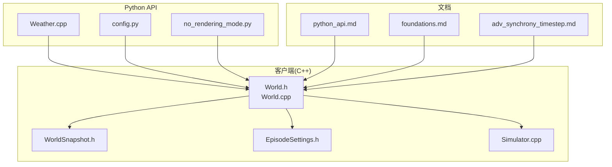
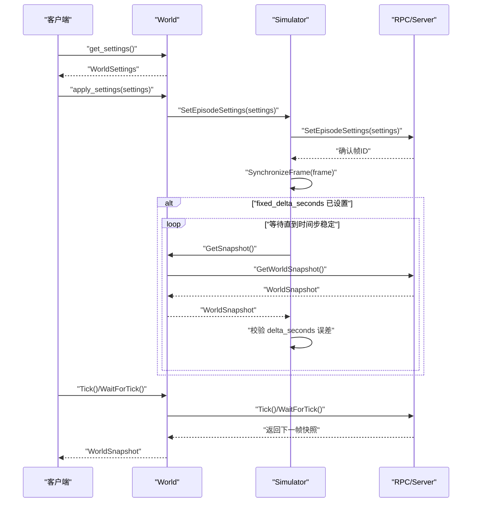
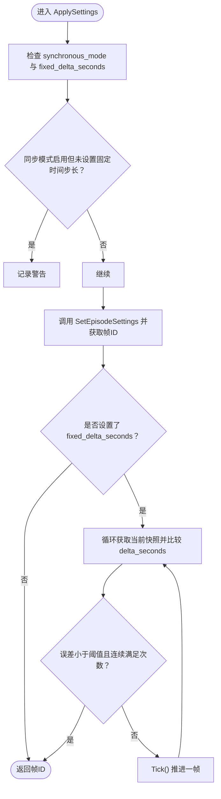
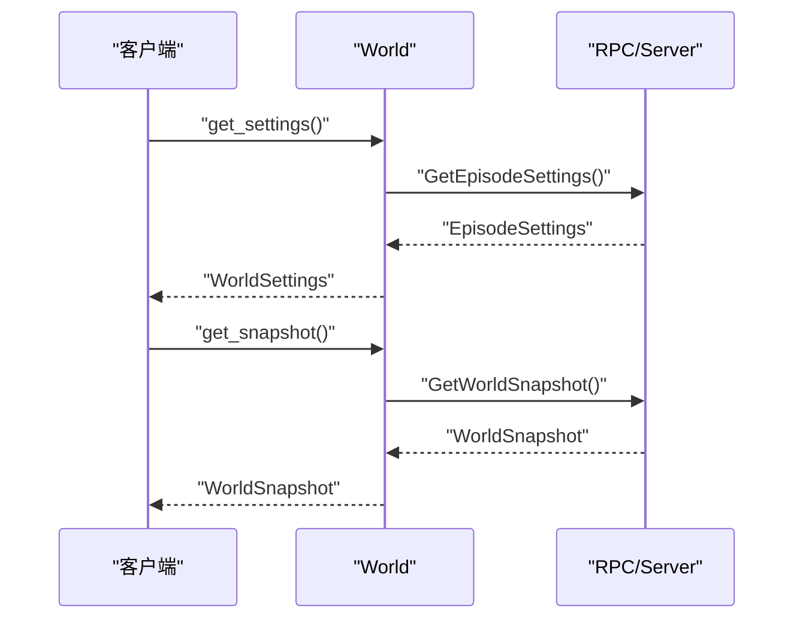
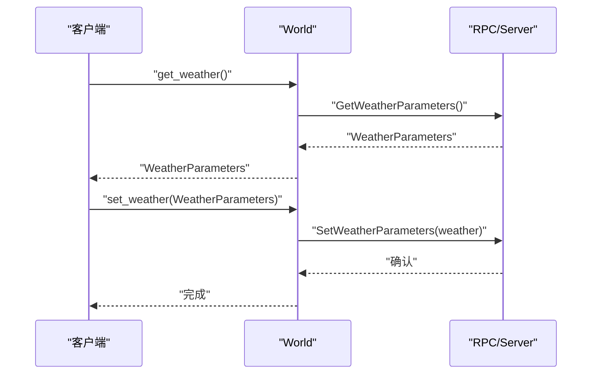
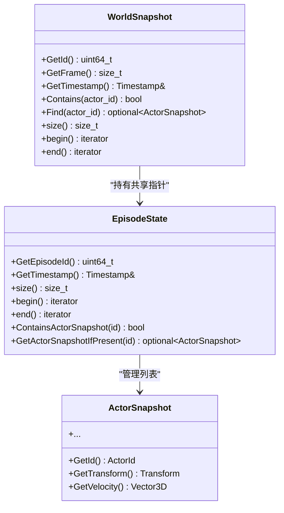
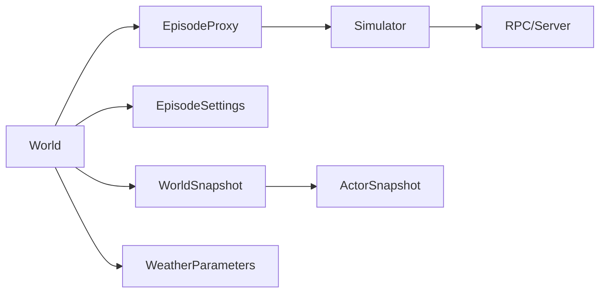

# 状态控制

> **引用文件**
> **本文引用的文件**

- [World.h](https://github.com/carla-simulator/carla/blob/ue5-dev/LibCarla/source/carla/client/World.h)
- [World.cpp](https://github.com/carla-simulator/carla/blob/ue5-dev/LibCarla/source/carla/client/World.cpp)
- [WorldSnapshot.h](https://github.com/carla-simulator/carla/blob/ue5-dev/LibCarla/source/carla/client/WorldSnapshot.h)
- [EpisodeSettings.h](https://github.com/carla-simulator/carla/blob/ue5-dev/LibCarla/source/carla/rpc/EpisodeSettings.h)
- [Simulator.cpp](https://github.com/carla-simulator/carla/blob/ue5-dev/LibCarla/source/carla/client/detail/Simulator.cpp)
- [Weather.cpp](https://github.com/carla-simulator/carla/blob/ue5-dev/PythonAPI/carla/src/Weather.cpp)
- [config.py](https://github.com/carla-simulator/carla/blob/ue5-dev/PythonAPI/util/config.py)
- [test_world.py](https://github.com/carla-simulator/carla/blob/ue5-dev/PythonAPI/test/smoke/test_world.py)
- [no_rendering_mode.py](https://github.com/carla-simulator/carla/blob/ue5-dev/PythonAPI/examples/no_rendering_mode.py)
- [python_api.md](https://github.com/carla-simulator/carla/blob/ue5-dev/Docs/python_api.md)
- [foundations.md](https://github.com/carla-simulator/carla/blob/ue5-dev/Docs/foundations.md)
- [adv_synchrony_timestep.md](https://github.com/carla-simulator/carla/blob/ue5-dev/Docs/adv_synchrony_timestep.md)

## 目录

1. [简介](#简介)
2. [项目结构](#项目结构)
3. [核心组件](#核心组件)
4. [架构总览](#架构总览)
5. [详细组件分析](#详细组件分析)
6. [依赖关系分析](#依赖关系分析)
7. [性能考虑](#性能考虑)
8. [故障排查指南](#故障排查指南)
9. [结论](#结论)
10. [附录](#附录)

## 简介

本文件围绕 CARLA 的世界状态控制能力展开，重点覆盖以下主题：

- carla.World 与 carla.Client 的状态管理职责与协作
- apply_settings 方法的使用：同步模式（synchronous_mode）与固定时间步长（fixed_delta_seconds）的配置与验证
- get_settings 与 get_snapshot 的工作流程与返回对象语义
- set_weather 对环境天气参数的动态调整
- 无渲染模式（no_rendering_mode）的实际应用示例
- WorldSnapshot 在状态记录与回放中的序列化与一致性保障
- 面向初学者的同步模式配置指南与面向高级用户的性能调优建议

## 项目结构

本仓库包含 C++ 客户端库（LibCarla）、Python API 绑定（PythonAPI）、示例脚本（Examples）与官方文档（Docs）。与“状态控制”直接相关的关键路径如下：

- C++ 客户端接口：World.h/World.cpp 提供 World 的核心方法（设置、快照、天气、同步等）
- RPC 数据结构：EpisodeSettings.h 定义世界设置的数据模型
- 同步器：Simulator.cpp 负责设置应用后的帧同步与校验
- Python API：Weather.cpp 暴露 WeatherParameters 类型；config.py 提供命令行配置工具
- 示例与测试：no_rendering_mode.py 展示无渲染模式；test_world.py 验证固定时间步长行为

图表来源

- <a href="https://github.com/carla-simulator/carla/blob/ue5-dev/LibCarla/source/carla/client/World.h#L45-L110" target="_blank">World.h</a>
- <a href="https://github.com/carla-simulator/carla/blob/ue5-dev/LibCarla/source/carla/client/World.cpp#L52-L101" target="_blank">World.cpp</a>
- <a href="https://github.com/carla-simulator/carla/blob/ue5-dev/LibCarla/source/carla/client/WorldSnapshot.h#L18-L77" target="_blank">WorldSnapshot.h</a>
- <a href="https://github.com/carla-simulator/carla/blob/ue5-dev/LibCarla/source/carla/rpc/EpisodeSettings.h#L46-L89" target="_blank">EpisodeSettings.h</a>
- <a href="https://github.com/carla-simulator/carla/blob/ue5-dev/LibCarla/source/carla/client/detail/Simulator.cpp#L255-L282" target="_blank">Simulator.cpp</a>
- <a href="https://github.com/carla-simulator/carla/blob/ue5-dev/PythonAPI/carla/src/Weather.cpp#L60-L95" target="_blank">Weather.cpp</a>
- <a href="https://github.com/carla-simulator/carla/blob/ue5-dev/PythonAPI/util/config.py#L208-L240" target="_blank">config.py</a>
- <a href="https://github.com/carla-simulator/carla/blob/ue5-dev/PythonAPI/examples/no_rendering_mode.py#L1-L200" target="_blank">no_rendering_mode.py</a>
- <a href="https://github.com/carla-simulator/carla/blob/ue5-dev/Docs/python_api.md#L3325-L3366" target="_blank">python_api.md</a>
- <a href="https://github.com/carla-simulator/carla/blob/ue5-dev/Docs/foundations.md#L42-L72" target="_blank">foundations.md</a>
- <a href="https://github.com/carla-simulator/carla/blob/ue5-dev/Docs/adv_synchrony_timestep.md#L139-L186" target="_blank">adv_synchrony_timestep.md</a>

章节来源

- <a href="https://github.com/carla-simulator/carla/blob/ue5-dev/LibCarla/source/carla/client/World.h#L45-L110" target="_blank">World.h</a>
- <a href="https://github.com/carla-simulator/carla/blob/ue5-dev/LibCarla/source/carla/client/World.cpp#L52-L101" target="_blank">World.cpp</a>
- <a href="https://github.com/carla-simulator/carla/blob/ue5-dev/LibCarla/source/carla/rpc/EpisodeSettings.h#L46-L89" target="_blank">EpisodeSettings.h</a>
- <a href="https://github.com/carla-simulator/carla/blob/ue5-dev/LibCarla/source/carla/client/detail/Simulator.cpp#L255-L282" target="_blank">Simulator.cpp</a>
- <a href="https://github.com/carla-simulator/carla/blob/ue5-dev/PythonAPI/carla/src/Weather.cpp#L60-L95" target="_blank">Weather.cpp</a>
- <a href="https://github.com/carla-simulator/carla/blob/ue5-dev/PythonAPI/util/config.py#L208-L240" target="_blank">config.py</a>
- <a href="https://github.com/carla-simulator/carla/blob/ue5-dev/PythonAPI/examples/no_rendering_mode.py#L1-L200" target="_blank">no_rendering_mode.py</a>
- <a href="https://github.com/carla-simulator/carla/blob/ue5-dev/Docs/python_api.md#L3325-L3366" target="_blank">python_api.md</a>
- <a href="https://github.com/carla-simulator/carla/blob/ue5-dev/Docs/foundations.md#L42-L72" target="_blank">foundations.md</a>
- <a href="https://github.com/carla-simulator/carla/blob/ue5-dev/Docs/adv_synchrony_timestep.md#L139-L186" target="_blank">adv_synchrony_timestep.md</a>

## 核心组件

- World（carla.World）
  - 提供 get_settings、apply_settings、get_snapshot、get_weather、set_weather、Tick、WaitForTick 等方法，用于查询与修改世界状态、驱动同步步进与获取世界快照。
- WorldSettings（对应 EpisodeSettings）
  - 包含 synchronous_mode、no_rendering_mode、fixed_delta_seconds、substepping、max_substep_delta_time、max_substeps 等字段，决定仿真时序与渲染策略。
- WorldSnapshot
  - 表示某一时刻的世界快照，包含帧号、时间戳与各演员快照集合，支持迭代与查找。
- WeatherParameters
  - 描述天气参数（云量、降水、风、湿气、散射等），通过 World.set_weather 动态更新。
- Simulator（内部）
  - 执行 apply_settings 后进行帧同步与一致性校验，并在同步模式下对子步长进行约束检查。

章节来源

- <a href="https://github.com/carla-simulator/carla/blob/ue5-dev/LibCarla/source/carla/client/World.h#L81-L110" target="_blank">World.h</a>
- <a href="https://github.com/carla-simulator/carla/blob/ue5-dev/LibCarla/source/carla/client/World.cpp#L52-L101" target="_blank">World.cpp</a>
- <a href="https://github.com/carla-simulator/carla/blob/ue5-dev/LibCarla/source/carla/rpc/EpisodeSettings.h#L46-L89" target="_blank">EpisodeSettings.h</a>
- <a href="https://github.com/carla-simulator/carla/blob/ue5-dev/LibCarla/source/carla/client/WorldSnapshot.h#L18-L77" target="_blank">WorldSnapshot.h</a>
- <a href="https://github.com/carla-simulator/carla/blob/ue5-dev/PythonAPI/carla/src/Weather.cpp#L60-L95" target="_blank">Weather.cpp</a>
- <a href="https://github.com/carla-simulator/carla/blob/ue5-dev/LibCarla/source/carla/client/detail/Simulator.cpp#L255-L282" target="_blank">Simulator.cpp</a>

## 架构总览

下图展示了 World 与底层 Episode/Simulator 的交互关系，以及设置应用后如何驱动同步与帧推进。

图表来源

- <a href="https://github.com/carla-simulator/carla/blob/ue5-dev/LibCarla/source/carla/client/World.cpp#L52-L101" target="_blank">World.cpp</a>
- <a href="https://github.com/carla-simulator/carla/blob/ue5-dev/LibCarla/source/carla/client/detail/Simulator.cpp#L255-L282" target="_blank">Simulator.cpp</a>

## 详细组件分析

### World.apply_settings：同步与时间步长控制

- 同步模式（synchronous_mode）
  - 当启用同步模式且未设置 fixed_delta_seconds 时，底层会发出警告，提示应同时设置固定时间步长以获得稳定的时序。
- 固定时间步长（fixed_delta_seconds）
  - 若设置了 fixed_delta_seconds，则 apply_settings 会在内部循环等待，通过不断获取当前快照并比较 delta_seconds 与目标值，直至误差满足阈值或达到最大尝试次数。
  - 这保证了客户端侧看到的 delta_seconds 与服务器一致，避免“设置已下发但尚未生效”的不一致。
- 子步长（substepping）
  - 在同步模式与子步长开启时，会对 max_substep_delta_time 与 max_substeps 进行有效性检查，确保 fixed_delta_seconds 不超过子步长上限。

图表来源

- <a href="https://github.com/carla-simulator/carla/blob/ue5-dev/LibCarla/source/carla/client/World.cpp#L56-L84" target="_blank">World.cpp</a>
- <a href="https://github.com/carla-simulator/carla/blob/ue5-dev/LibCarla/source/carla/client/detail/Simulator.cpp#L255-L282" target="_blank">Simulator.cpp</a>

章节来源

- <a href="https://github.com/carla-simulator/carla/blob/ue5-dev/LibCarla/source/carla/client/World.cpp#L56-L84" target="_blank">World.cpp</a>
- <a href="https://github.com/carla-simulator/carla/blob/ue5-dev/LibCarla/source/carla/client/detail/Simulator.cpp#L255-L282" target="_blank">Simulator.cpp</a>

### World.get_settings 与 World.get_snapshot

- get_settings
  - 返回当前世界设置对象（WorldSettings/EpisodeSettings），包含同步模式、渲染模式、时间步长、子步长等配置。
- get_snapshot
  - 返回当前世界快照（WorldSnapshot），包含帧号、时间戳与各演员快照集合，可用于状态记录与回放。

图表来源

- <a href="https://github.com/carla-simulator/carla/blob/ue5-dev/LibCarla/source/carla/client/World.h#L81-L110" target="_blank">World.h</a>
- <a href="https://github.com/carla-simulator/carla/blob/ue5-dev/LibCarla/source/carla/client/World.cpp#L52-L101" target="_blank">World.cpp</a>

章节来源

- <a href="https://github.com/carla-simulator/carla/blob/ue5-dev/LibCarla/source/carla/client/World.h#L81-L110" target="_blank">World.h</a>
- <a href="https://github.com/carla-simulator/carla/blob/ue5-dev/LibCarla/source/carla/client/World.cpp#L52-L101" target="_blank">World.cpp</a>
- <a href="https://github.com/carla-simulator/carla/blob/ue5-dev/Docs/python_api.md#L3325-L3366" target="_blank">python_api.md</a>

### World.set_weather：动态调整环境条件

- set_weather
  - 将新的 WeatherParameters 应用到仿真世界，实时改变天气参数（如云量、降水、风、湿气、散射等）。
- get_weather
  - 获取当前天气参数对象，便于读取与对比。

图表来源

- <a href="https://github.com/carla-simulator/carla/blob/ue5-dev/LibCarla/source/carla/client/World.h#L90-L100" target="_blank">World.h</a>
- <a href="https://github.com/carla-simulator/carla/blob/ue5-dev/PythonAPI/carla/src/Weather.cpp#L60-L95" target="_blank">Weather.cpp</a>

章节来源

- <a href="https://github.com/carla-simulator/carla/blob/ue5-dev/LibCarla/source/carla/client/World.h#L90-L100" target="_blank">World.h</a>
- <a href="https://github.com/carla-simulator/carla/blob/ue5-dev/PythonAPI/carla/src/Weather.cpp#L60-L95" target="_blank">Weather.cpp</a>
- <a href="https://github.com/carla-simulator/carla/blob/ue5-dev/Docs/python_api.md#L3363-L3366" target="_blank">python_api.md</a>

### 无渲染模式（no_rendering_mode）示例

- 无渲染模式通过 WorldSettings.no_rendering_mode 控制，可显著降低渲染开销，适合大规模数据采集与离线处理。
- 示例脚本 no_rendering_mode.py 展示了如何在禁用渲染的情况下进行可视化与交互，适合需要高吞吐传感器数据的场景。

章节来源

- <a href="https://github.com/carla-simulator/carla/blob/ue5-dev/PythonAPI/util/config.py#L208-L240" target="_blank">config.py</a>
- <a href="https://github.com/carla-simulator/carla/blob/ue5-dev/PythonAPI/examples/no_rendering_mode.py#L1-L200" target="_blank">no_rendering_mode.py</a>
- <a href="https://github.com/carla-simulator/carla/blob/ue5-dev/Docs/python_api.md#L3420-L3430" target="_blank">python_api.md</a>

### WorldSnapshot：状态记录与回放的序列化机制

- WorldSnapshot 提供对某一时刻世界状态的快照访问，包含帧号、时间戳与演员快照集合，支持迭代与查找。
- 快照在底层由 EpisodeState 管理，包含 ActorSnapshot 列表与时间戳信息，保证快照的一致性与可遍历性。
- 回放与录制通常基于快照序列进行，确保不同帧间的状态一致性与可重复性。

图表来源

- <a href="https://github.com/carla-simulator/carla/blob/ue5-dev/LibCarla/source/carla/client/WorldSnapshot.h#L18-L77" target="_blank">WorldSnapshot.h</a>

章节来源

- <a href="https://github.com/carla-simulator/carla/blob/ue5-dev/LibCarla/source/carla/client/WorldSnapshot.h#L18-L77" target="_blank">WorldSnapshot.h</a>

### 同步模式配置指南（初学者）

- 基本步骤
  - 获取当前设置：world.get_settings()
  - 设置同步模式：settings.synchronous_mode = True
  - 可选设置固定时间步长：settings.fixed_delta_seconds = 期望值（秒）
  - 应用设置：world.apply_settings(settings)
  - 在循环中推进：world.tick() 或使用回调 world.on_tick(...)
- 注意事项
  - 同步模式下强烈建议同时设置 fixed_delta_seconds，以避免变量时间步导致的数据错位。
  - 使用队列或回调收集传感器数据时，务必在获取数据后再发送 tick，确保所有传感器使用同一时刻的数据。

章节来源

- <a href="https://github.com/carla-simulator/carla/blob/ue5-dev/Docs/foundations.md#L101-L121" target="_blank">foundations.md</a>
- <a href="https://github.com/carla-simulator/carla/blob/ue5-dev/Docs/adv_synchrony_timestep.md#L139-L186" target="_blank">adv_synchrony_timestep.md</a>
- <a href="https://github.com/carla-simulator/carla/blob/ue5-dev/PythonAPI/test/smoke/test_world.py#L1-L24" target="_blank">test_world.py</a>

### 性能调优与高级配置（高级用户）

- 固定时间步长与子步长
  - fixed_delta_seconds 与物理子步长（max_substep_delta_time 与 max_substeps）需满足约束：fixed_delta_seconds ≤ max_substep_delta_time × max_substeps。
  - 子步长默认上限合理，但在高精度物理仿真中可适当收紧物理子步长以提升稳定性。
- 同步模式与吞吐
  - 同步模式下，服务器会等待客户端 tick，因此客户端处理速度决定了整体吞吐。建议将耗时操作（如图像解码、网络传输）移至后台线程，避免阻塞主循环。
- 渲染与资源占用
  - 开启 no_rendering_mode 可显著降低 GPU/CPU 占用，适合大规模数据采集与离线处理。
- 时间步长选择
  - 较小的 fixed_delta_seconds 提升时间分辨率，但增加计算压力；较大的时间步长可提高吞吐，但可能影响传感器与物理仿真精度。

章节来源

- <a href="https://github.com/carla-simulator/carla/blob/ue5-dev/Docs/adv_synchrony_timestep.md#L73-L103" target="_blank">adv_synchrony_timestep.md</a>
- <a href="https://github.com/carla-simulator/carla/blob/ue5-dev/LibCarla/source/carla/client/detail/Simulator.cpp#L255-L282" target="_blank">Simulator.cpp</a>
- <a href="https://github.com/carla-simulator/carla/blob/ue5-dev/PythonAPI/util/config.py#L208-L240" target="_blank">config.py</a>

## 依赖关系分析

- World 依赖 EpisodeProxy（内部封装）以访问底层 Episode/Simulator
- EpisodeSettings 是 RPC 层数据结构，被 World.ApplySettings 与 Simulator.SetEpisodeSettings 使用
- WeatherParameters 通过 World.set_weather 与底层 RPC 交互
- WorldSnapshot 由 EpisodeState 提供，包含 ActorSnapshot 列表

图表来源

- <a href="https://github.com/carla-simulator/carla/blob/ue5-dev/LibCarla/source/carla/client/World.h#L45-L110" target="_blank">World.h</a>
- <a href="https://github.com/carla-simulator/carla/blob/ue5-dev/LibCarla/source/carla/rpc/EpisodeSettings.h#L46-L89" target="_blank">EpisodeSettings.h</a>
- <a href="https://github.com/carla-simulator/carla/blob/ue5-dev/LibCarla/source/carla/client/WorldSnapshot.h#L18-L77" target="_blank">WorldSnapshot.h</a>

章节来源

- <a href="https://github.com/carla-simulator/carla/blob/ue5-dev/LibCarla/source/carla/client/World.h#L45-L110" target="_blank">World.h</a>
- <a href="https://github.com/carla-simulator/carla/blob/ue5-dev/LibCarla/source/carla/rpc/EpisodeSettings.h#L46-L89" target="_blank">EpisodeSettings.h</a>
- <a href="https://github.com/carla-simulator/carla/blob/ue5-dev/LibCarla/source/carla/client/WorldSnapshot.h#L18-L77" target="_blank">WorldSnapshot.h</a>

## 性能考虑

- 同步模式下的客户端处理链路应尽量异步化，避免阻塞 tick 循环。
- 固定时间步长与子步长的组合应平衡精度与性能，避免超限导致不稳定。
- 传感器数据采集与存储应采用缓冲队列与批处理策略，减少锁竞争与内存拷贝。
- 在高并发场景下，合理设置 worker_threads 与超时参数，避免长时间阻塞。

## 故障排查指南

- 同步模式未设置固定时间步长
  - 现象：日志出现警告，数据时序不稳定。
  - 处理：设置 settings.fixed_delta_seconds 并重新 apply。
- 固定时间步长与子步长不匹配
  - 现象：日志警告子步长上限不足或不满足约束。
  - 处理：调整 max_substep_delta_time 与 max_substeps，使 fixed_delta_seconds ≤ 二者乘积。
- apply_settings 后 delta_seconds 仍不正确
  - 现象：多次获取快照发现 delta_seconds 与预期不符。
  - 处理：确认服务器端设置已生效，必要时增加等待轮次或检查网络延迟。

章节来源

- <a href="https://github.com/carla-simulator/carla/blob/ue5-dev/LibCarla/source/carla/client/detail/Simulator.cpp#L255-L282" target="_blank">Simulator.cpp</a>
- <a href="https://github.com/carla-simulator/carla/blob/ue5-dev/LibCarla/source/carla/client/World.cpp#L56-L84" target="_blank">World.cpp</a>

## 结论

- World.apply_settings 是状态控制的核心入口，结合同步模式与固定时间步长可实现确定性的仿真时序。
- WorldSnapshot 提供了状态记录与回放的基础，配合 EpisodeState 保证一致性。
- set_weather 为动态环境建模提供了便捷手段；无渲染模式则在性能与资源上提供了优化空间。
- 对初学者，建议从同步模式 + 固定时间步长入手；对高级用户，应关注子步长约束、吞吐与资源分配的平衡。

## 附录

- 参考文档
  - <a href="https://github.com/carla-simulator/carla/blob/ue5-dev/Docs/python_api.md#L3325-L3366" target="_blank">python_api.md</a>
  - <a href="https://github.com/carla-simulator/carla/blob/ue5-dev/Docs/foundations.md#L42-L72" target="_blank">foundations.md</a>
  - <a href="https://github.com/carla-simulator/carla/blob/ue5-dev/Docs/adv_synchrony_timestep.md#L139-L186" target="_blank">adv_synchrony_timestep.md</a>
