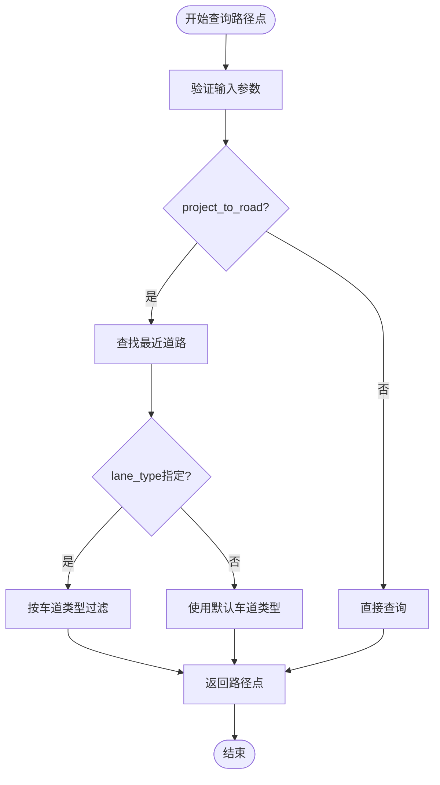
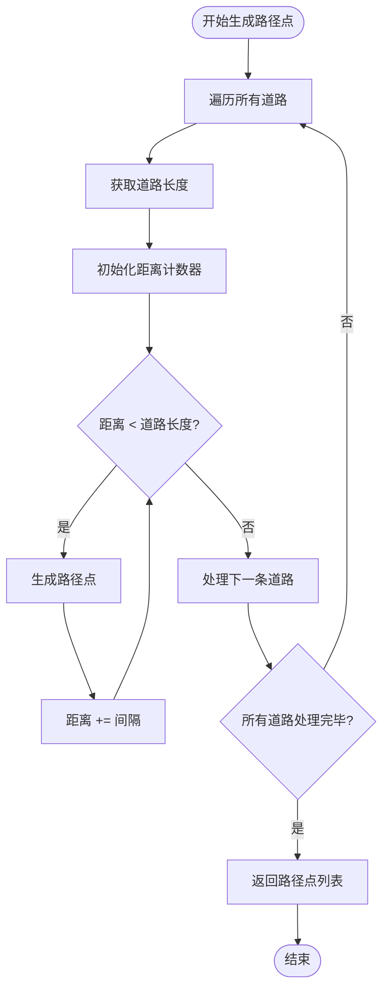
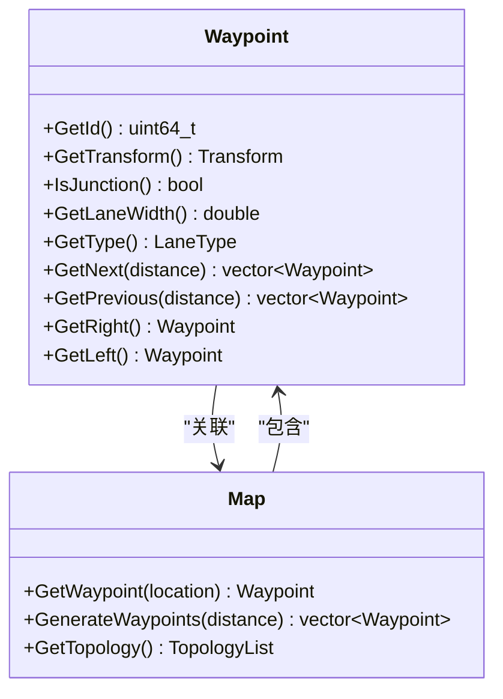
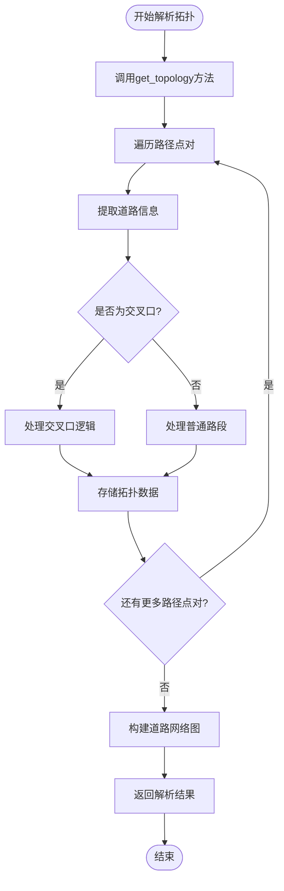
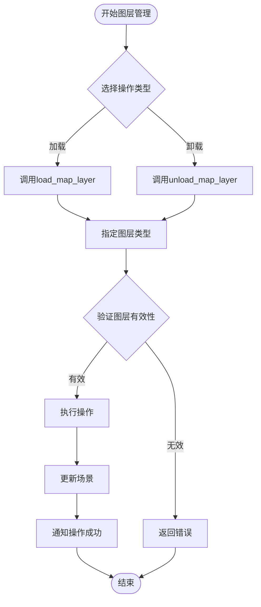
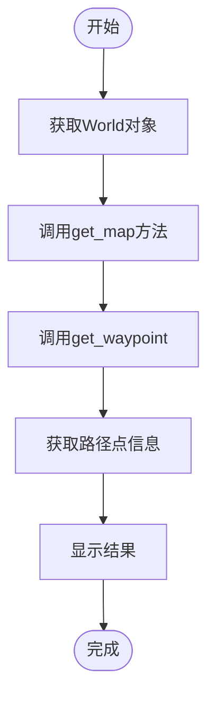

# 地图交互

> **引用文件**
> **本文档引用的文件**

- [Map.h](https://github.com/carla-simulator/carla/blob/ue5-dev/LibCarla/source/carla/client/Map.h)
- [Map.cpp](https://github.com/carla-simulator/carla/blob/ue5-dev/LibCarla/source/carla/client/Map.cpp)
- [Waypoint.h](https://github.com/carla-simulator/carla/blob/ue5-dev/LibCarla/source/carla/client/Waypoint.h)
- [Waypoint.cpp](https://github.com/carla-simulator/carla/blob/ue5-dev/LibCarla/source/carla/client/Waypoint.cpp)
- [World.h](https://github.com/carla-simulator/carla/blob/ue5-dev/LibCarla/source/carla/client/World.h)
- [World.cpp](https://github.com/carla-simulator/carla/blob/ue5-dev/LibCarla/source/carla/client/World.cpp)
- [Map.cpp](https://github.com/carla-simulator/carla/blob/ue5-dev/PythonAPI/carla/src/Map.cpp)
- [MapLayer.h](https://github.com/carla-simulator/carla/blob/ue5-dev/LibCarla/source/carla/rpc/MapLayer.h)

## 目录

1. [简介](#简介)
2. [Map 对象功能详解](#map对象功能详解)
3. [路径点查询与规划](#路径点查询与规划)
4. [道路拓扑结构分析](#道路拓扑结构分析)
5. [地图图层管理](#地图图层管理)
6. [地图数据提取](#地图数据提取)
7. [初学者指南](#初学者指南)
8. [高级技术应用](#高级技术应用)

## 简介

CARLA 仿真平台提供了强大的地图交互功能，通过 World.get_map 方法返回的 Map 对象，用户可以访问和操作详细的高精地图数据。Map 对象封装了 OpenDRIVE 格式的地图信息，支持路径规划、拓扑分析、交通标志识别等多种功能。本文档将深入解析 Map 对象的核心功能，为不同层次的用户提供全面的技术指导。

## Map 对象功能详解

Map 对象是 CARLA 地图交互的核心，通过 World.get_map 方法获取。该对象提供了丰富的接口来访问地图数据，包括获取地图名称、推荐的生成点、OpenDRIVE 内容等。Map 类的设计遵循面向对象原则，通过共享指针实现内存管理，确保了资源的安全访问。

Map 对象的主要功能包括：获取地图基本信息、查询路径点、生成路径点网格、获取道路拓扑结构、计算交叉车道线、获取地理参考信息等。这些功能为自动驾驶算法的开发提供了坚实的基础。

**Section sources**

- <a href="https://github.com/carla-simulator/carla/blob/ue5-dev/LibCarla/source/carla/client/Map.h#L38-L57" target="_blank">Map.h</a>
- <a href="https://github.com/carla-simulator/carla/blob/ue5-dev/LibCarla/source/carla/client/Map.cpp#L30-L43" target="_blank">Map.cpp</a>

## 路径点查询与规划

### get_waypoint 方法详解

get_waypoint 方法是路径规划的核心功能，用于根据地理位置查询对应的路径点。该方法接受三个参数：地理位置、是否投影到道路(project_to_road)和车道类型(lane_type)。

当 project_to_road 参数为 true 时，系统会自动将查询位置投影到最近的道路上，这对于处理 GPS 定位误差非常有用。lane_type 参数允许用户指定查询的车道类型，如驾驶车道、自行车道、人行道等，支持多种车道类型的组合查询。

**Diagram sources**

- <a href="https://github.com/carla-simulator/carla/blob/ue5-dev/LibCarla/source/carla/client/Map.h#L54-L57" target="_blank">Map.h</a>
- <a href="https://github.com/carla-simulator/carla/blob/ue5-dev/LibCarla/source/carla/client/Map.cpp#L44-L57" target="_blank">Map.cpp</a>

### 路径点网格生成策略

generate_waypoints 方法用于创建路径点网格，按照指定的距离间隔生成地图上的所有路径点。该方法在路径规划、环境感知和地图可视化等场景中非常有用。

生成策略基于地图的道路网络，遍历每条道路并在指定距离间隔处生成路径点。对于每条道路，系统会计算其长度，并从起点开始以指定间隔生成路径点，直到达到道路终点。这种方法确保了路径点的均匀分布，为后续的路径规划提供了可靠的基础。

**Diagram sources**

- <a href="https://github.com/carla-simulator/carla/blob/ue5-dev/LibCarla/source/carla/client/Map.h#L68" target="_blank">Map.h</a>
- <a href="https://github.com/carla-simulator/carla/blob/ue5-dev/LibCarla/source/carla/client/Map.cpp#L95-L102" target="_blank">Map.cpp</a>

### 路径点导航功能

Waypoint 对象提供了丰富的导航功能，包括获取前后路径点、左右车道、车道宽度等。GetNext 和 GetPrevious 方法用于获取指定距离内的前后路径点，支持路径跟踪和轨迹预测。

GetRight 和 GetLeft 方法用于获取相邻车道的路径点，这对于变道决策和车道保持算法至关重要。系统会根据道路的行驶方向(RHT)和车道 ID 计算相邻车道，确保在不同交通规则下的正确性。

**Diagram sources**

- <a href="https://github.com/carla-simulator/carla/blob/ue5-dev/LibCarla/source/carla/client/Waypoint.h#L72-L87" target="_blank">Waypoint.h</a>
- <a href="https://github.com/carla-simulator/carla/blob/ue5-dev/LibCarla/source/carla/client/Waypoint.cpp#L50-L146" target="_blank">Waypoint.cpp</a>

## 道路拓扑结构分析

### 拓扑数据格式解析

get_topology 方法返回道路拓扑结构，以路径点对的形式表示道路连接关系。每个路径点对包含起始路径点和结束路径点，描述了道路的连接方向和顺序。

拓扑数据的解析需要理解路径点的属性，包括道路 ID、车道 ID、s 距离等。通过分析这些数据，可以构建完整的道路网络图，用于路径规划和交通流模拟。拓扑结构还包含了交叉口信息，通过 IsJunction 方法可以识别路径点是否位于交叉口。

**Diagram sources**

- <a href="https://github.com/carla-simulator/carla/blob/ue5-dev/LibCarla/source/carla/client/Map.h#L66" target="_blank">Map.h</a>
- <a href="https://github.com/carla-simulator/carla/blob/ue5-dev/LibCarla/source/carla/client/Map.cpp#L70-L92" target="_blank">Map.cpp</a>

### 拓扑结构应用

道路拓扑结构在自动驾驶系统中有多种应用。在路径规划中，拓扑结构用于 A\*、Dijkstra 等算法的图搜索。在交通流模拟中，拓扑结构帮助确定车辆的行驶路线和转向选择。

通过分析拓扑结构，还可以识别道路的入口和出口，这对于高速公路匝道和城市道路的导航非常重要。系统提供了 GetSuccessors 和 GetPredecessors 方法，用于获取路径点的后续和前续路径点，支持双向路径搜索。

**Section sources**

- <a href="https://github.com/carla-simulator/carla/blob/ue5-dev/LibCarla/source/carla/client/Map.h#L64-L67" target="_blank">Map.h</a>
- <a href="https://github.com/carla-simulator/carla/blob/ue5-dev/LibCarla/source/carla/client/Map.cpp#L70-L92" target="_blank">Map.cpp</a>

## 地图图层管理

### 图层加载与卸载

CARLA 支持多种地图图层的动态管理，包括建筑物、贴花、植被、地面、停放车辆、粒子、道具、路灯和墙壁等。通过 World 对象的 load_map_layer 和 unload_map_layer 方法，用户可以按需加载或卸载特定图层。

这种功能在性能优化和场景定制中非常有用。例如，在进行传感器测试时，可以卸载不必要的视觉元素以提高仿真性能；在进行特定场景测试时，可以加载特定的道具和装饰。

**Diagram sources**

- <a href="https://github.com/carla-simulator/carla/blob/ue5-dev/LibCarla/source/carla/client/World.h#L66-L68" target="_blank">World.h</a>
- <a href="https://github.com/carla-simulator/carla/blob/ue5-dev/LibCarla/source/carla/client/World.cpp#L28-L34" target="_blank">World.cpp</a>

### 图层类型与应用场景

地图图层类型通过 MapLayer 枚举定义，支持位运算组合。None 表示无图层，All 表示所有图层，其他类型对应特定的视觉元素。这种设计允许用户同时操作多个图层。

不同图层类型适用于不同的测试场景。例如，建筑物和墙壁图层对于激光雷达仿真很重要；植被和地面图层影响视觉传感器的性能；路灯图层对于夜间场景测试至关重要。通过合理管理图层，可以在保证测试真实性的同时优化仿真性能。

**Section sources**

- <a href="https://github.com/carla-simulator/carla/blob/ue5-dev/LibCarla/source/carla/rpc/MapLayer.h#L18-L30" target="_blank">MapLayer.h</a>
- <a href="https://github.com/carla-simulator/carla/blob/ue5-dev/LibCarla/source/carla/client/World.h#L66-L68" target="_blank">World.h</a>

## 地图数据提取

### 交叉口提取

Map 对象提供了多种方法来提取交叉口信息。GetJunction 方法根据路径点获取对应的交叉口对象，包含交叉口的边界框和连接信息。GetAllCrosswalkZones 方法返回所有人行横道的区域坐标。

通过分析道路拓扑结构，可以识别不同类型的交叉口，如 T 型交叉口、十字交叉口等。系统还提供了 GetJunctionWaypoints 方法，获取交叉口内所有车道的起止路径点，支持详细的交叉口行为分析。

**Section sources**

- <a href="https://github.com/carla-simulator/carla/blob/ue5-dev/LibCarla/source/carla/client/Map.h#L78-L83" target="_blank">Map.h</a>
- <a href="https://github.com/carla-simulator/carla/blob/ue5-dev/LibCarla/source/carla/client/Map.cpp#L119-L135" target="_blank">Map.cpp</a>

### 车道线提取

车道线信息通过路径点的 GetRightLaneMarking 和 GetLeftLaneMarking 方法获取。这些方法返回车道标记的类型、颜色、变道规则和宽度等属性。

系统支持多种车道标记类型，包括实线、虚线、双实线等，以及不同的颜色编码。通过遍历路径点序列，可以重建完整的车道线网络，用于车道保持和变道辅助系统的开发。

**Section sources**

- <a href="https://github.com/carla-simulator/carla/blob/ue5-dev/LibCarla/source/carla/client/Waypoint.h#L88-L90" target="_blank">Waypoint.h</a>
- <a href="https://github.com/carla-simulator/carla/blob/ue5-dev/LibCarla/source/carla/client/Waypoint.cpp#L148-L164" target="_blank">Waypoint.cpp</a>

### 交通标志提取

交通标志通过 Landmark 对象表示，包含标志的类型、ID、位置、方向等信息。GetAllLandmarks 方法返回地图上所有交通标志，GetAllLandmarksOfType 方法按类型筛选标志。

系统支持多种交通标志类型，包括停车标志、让行标志、速度限制标志等。通过 GetLandmarkGroup 方法，可以获取属于同一控制组的标志，这对于交通信号协调控制非常重要。

**Section sources**

- <a href="https://github.com/carla-simulator/carla/blob/ue5-dev/LibCarla/source/carla/client/Map.h#L85-L95" target="_blank">Map.h</a>
- <a href="https://github.com/carla-simulator/carla/blob/ue5-dev/LibCarla/source/carla/client/Map.cpp#L138-L184" target="_blank">Map.cpp</a>

## 初学者指南

### 基本地图查询

初学者可以从基本的地图查询开始，使用简单的 API 调用来熟悉系统。首先获取 World 对象，然后调用 get_map 方法获取 Map 对象。通过 GetWaypoint 方法，可以将地理位置转换为路径点。

建议从简单的查询开始，如获取当前位置的路径点信息，包括道路 ID、车道 ID 和车道宽度。这些基本信息是理解车辆在地图中位置的基础。

**Diagram sources**

- <a href="https://github.com/carla-simulator/carla/blob/ue5-dev/LibCarla/source/carla/client/World.h#L64" target="_blank">World.h</a>
- <a href="https://github.com/carla-simulator/carla/blob/ue5-dev/LibCarla/source/carla/client/Map.h#L54-L57" target="_blank">Map.h</a>

### 简单路径规划

简单的路径规划可以通过获取前后路径点来实现。使用 GetNext 方法获取前方路径点，构建基本的路径序列。对于更复杂的路径规划，可以结合拓扑结构分析，实现多路段的路径跟踪。

初学者应该注意处理边界情况，如道路终点和交叉口。在道路终点，GetNext 方法可能返回空列表，需要适当处理。在交叉口，路径点的后续路径点可能有多个，需要根据转向需求选择合适的路径。

**Section sources**

- <a href="https://github.com/carla-simulator/carla/blob/ue5-dev/LibCarla/source/carla/client/Waypoint.h#L72-L78" target="_blank">Waypoint.h</a>
- <a href="https://github.com/carla-simulator/carla/blob/ue5-dev/LibCarla/source/carla/client/Waypoint.cpp#L50-L57" target="_blank">Waypoint.cpp</a>

## 高级技术应用

### 复杂路径分析

高级用户可以利用拓扑结构进行复杂的路径分析，如最短路径计算、多路径规划和路径优化。通过构建道路网络图，可以应用图论算法解决复杂的路径规划问题。

在动态环境中，需要考虑交通规则和障碍物的影响。系统提供了 GetTrafficLightsFromWaypoint 方法，获取路径点附近的交通信号灯，支持交通感知的路径规划。

**Section sources**

- <a href="https://github.com/carla-simulator/carla/blob/ue5-dev/LibCarla/source/carla/client/Map.h#L66" target="_blank">Map.h</a>
- <a href="https://github.com/carla-simulator/carla/blob/ue5-dev/LibCarla/source/carla/client/World.cpp#L264-L282" target="_blank">World.cpp</a>

### 自定义地图处理

专业用户可以进行自定义地图处理，如生成特定区域的路径点网格、提取特定类型的道路特征、创建自定义的交通场景等。通过组合多个 API 调用，可以实现复杂的地图分析功能。

高级技术还包括地图数据的持久化存储和共享。CookInMemoryMap 方法可以将地图数据编译为内存格式，提高后续访问的性能。用户还可以将 OpenDRIVE 数据保存到文件，实现地图的备份和共享。

**Section sources**

- <a href="https://github.com/carla-simulator/carla/blob/ue5-dev/LibCarla/source/carla/client/Map.h#L98" target="_blank">Map.h</a>
- <a href="https://github.com/carla-simulator/carla/blob/ue5-dev/LibCarla/source/carla/client/Map.cpp#L187-L189" target="_blank">Map.cpp</a>
