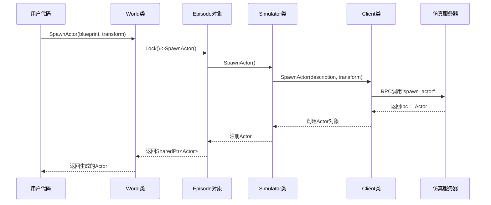
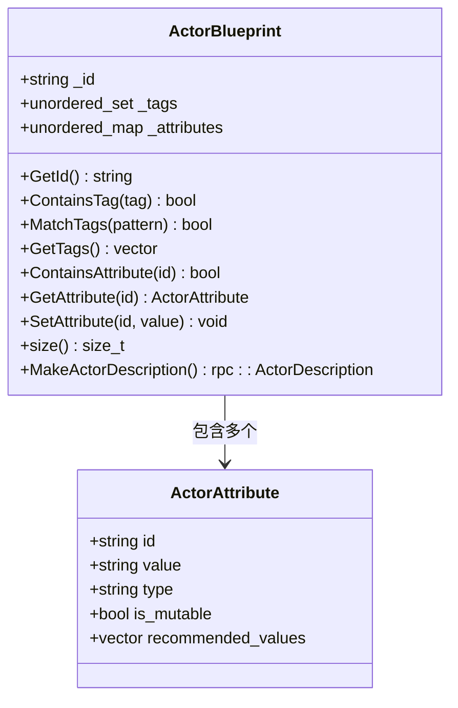
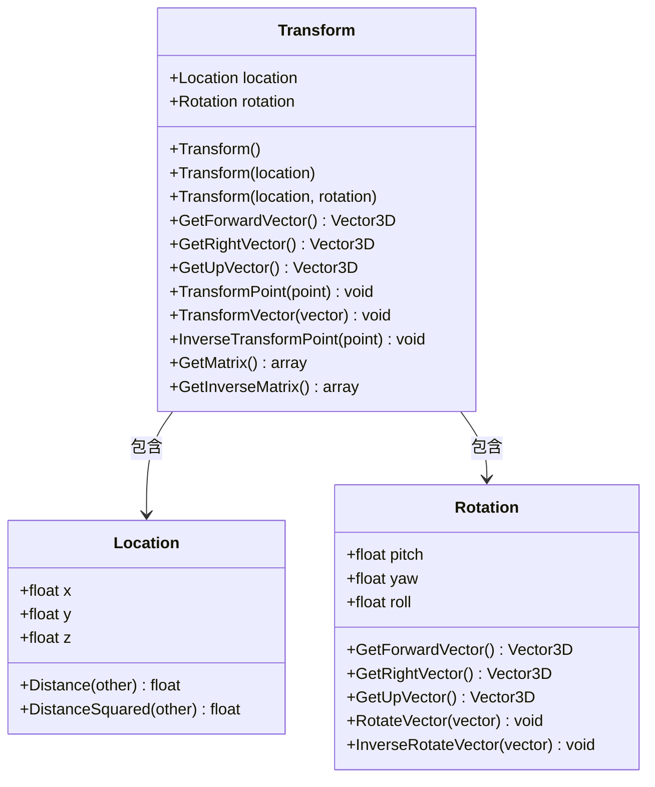
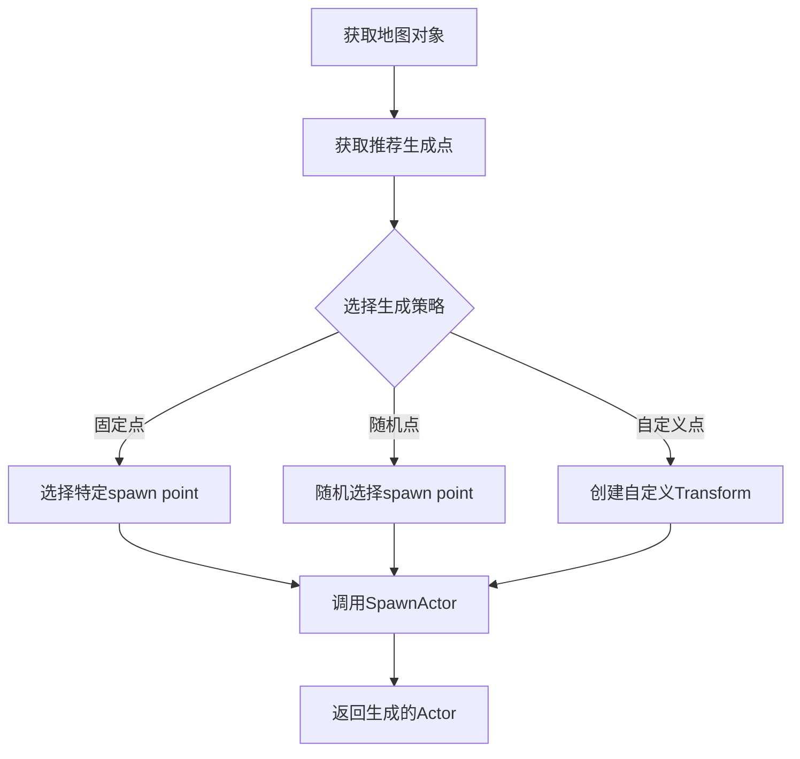
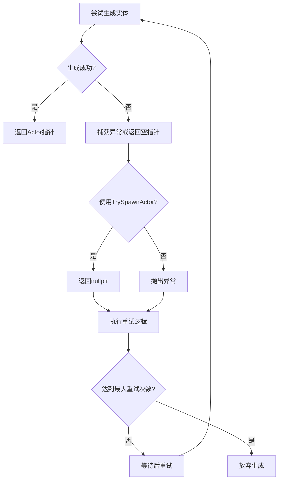
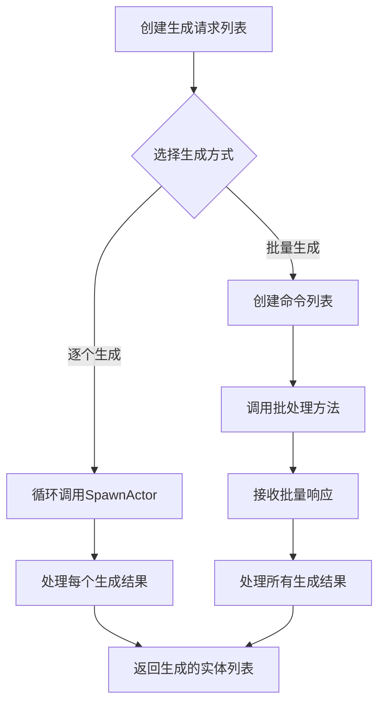
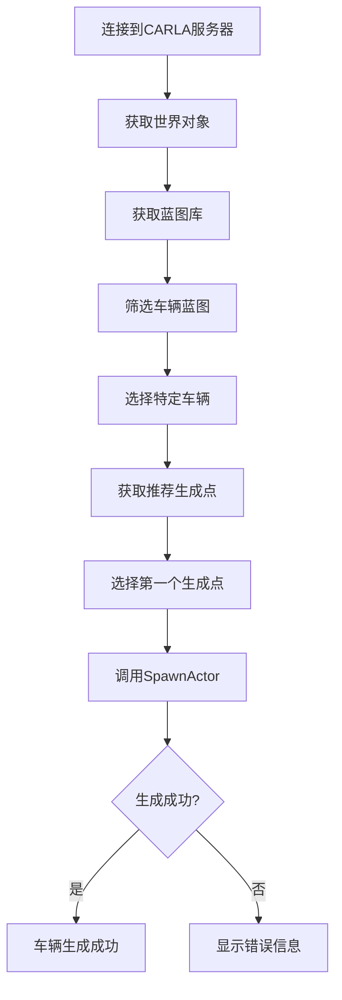
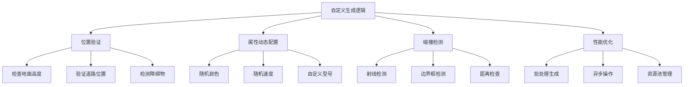

# 实体生成


**本文档引用的文件**   
- [World.h](https://github.com/carla-simulator/carla/blob/ue5-dev/LibCarla/source/carla/client/World.h)
- [ActorBlueprint.h](https://github.com/carla-simulator/carla/blob/ue5-dev/LibCarla/source/carla/client/ActorBlueprint.h)
- [Transform.h](https://github.com/carla-simulator/carla/blob/ue5-dev/LibCarla/source/carla/geom/Transform.h)
- [World.cpp](https://github.com/carla-simulator/carla/blob/ue5-dev/LibCarla/source/carla/client/World.cpp)
- [Simulator.h](https://github.com/carla-simulator/carla/blob/ue5-dev/LibCarla/source/carla/client/detail/Simulator.h)
- [Simulator.cpp](https://github.com/carla-simulator/carla/blob/ue5-dev/LibCarla/source/carla/client/detail/Simulator.cpp)
- [Client.h](https://github.com/carla-simulator/carla/blob/ue5-dev/LibCarla/source/carla/client/detail/Client.h)
- [Client.cpp](https://github.com/carla-simulator/carla/blob/ue5-dev/LibCarla/source/carla/client/detail/Client.cpp)
- [Map.h](https://github.com/carla-simulator/carla/blob/ue5-dev/LibCarla/source/carla/client/Map.h)


## 目录
1. [World.spawn_actor方法实现](#worldspawn_actor方法实现)
2. [ActorBlueprint属性配置](#actorblueprint属性配置)
3. [Transform类在定位和朝向控制中的应用](#transform类在定位和朝向控制中的应用)
4. [spawn_points使用方法和随机生成策略](#spawn_points使用方法和随机生成策略)
5. [生成失败的异常处理模式](#生成失败的异常处理模式)
6. [批量生成多个实体的最佳实践](#批量生成多个实体的最佳实践)
7. [生成后立即获取控制权的代码示例](#生成后立即获取控制权的代码示例)
8. [初学者指南：生成第一个车辆](#初学者指南生成第一个车辆)
9. [高级用户指南：自定义生成逻辑和性能优化](#高级用户指南自定义生成逻辑和性能优化)

## World.spawn_actor方法实现

World.spawn_actor方法是CARLA仿真环境中创建实体的核心接口。该方法通过一系列组件的协作完成实体的生成过程。首先，World类提供高层接口，接收ActorBlueprint和Transform参数，然后将请求委托给Episode对象。在底层实现中，Simulator类负责协调生成过程，最终通过Client类与仿真服务器进行通信。



**Diagram sources**
- [World.h](https://github.com/carla-simulator/carla/blob/ue5-dev/LibCarla/source/carla/client/World.h#L114-L118)
- [World.cpp](https://github.com/carla-simulator/carla/blob/ue5-dev/LibCarla/source/carla/client/World.cpp#L121-L127)
- [Simulator.h](https://github.com/carla-simulator/carla/blob/ue5-dev/LibCarla/source/carla/client/detail/Simulator.h#L362-L367)
- [Simulator.cpp](https://github.com/carla-simulator/carla/blob/ue5-dev/LibCarla/source/carla/client/detail/Simulator.cpp#L344-L372)
- [Client.h](https://github.com/carla-simulator/carla/blob/ue5-dev/LibCarla/source/carla/client/detail/Client.h#L187-L189)
- [Client.cpp](https://github.com/carla-simulator/carla/blob/ue5-dev/LibCarla/source/carla/client/detail/Client.cpp#L342-L346)

**Section sources**
- [World.h](https://github.com/carla-simulator/carla/blob/ue5-dev/LibCarla/source/carla/client/World.h#L114-L126)
- [World.cpp](https://github.com/carla-simulator/carla/blob/ue5-dev/LibCarla/source/carla/client/World.cpp#L121-L139)
- [Simulator.h](https://github.com/carla-simulator/carla/blob/ue5-dev/LibCarla/source/carla/client/detail/Simulator.h#L362-L367)
- [Simulator.cpp](https://github.com/carla-simulator/carla/blob/ue5-dev/LibCarla/source/carla/client/detail/Simulator.cpp#L344-L372)

## ActorBlueprint属性配置

ActorBlueprint类是实体生成的模板，包含了创建实体所需的所有属性信息。每个蓝图都有唯一的ID标识，并包含一组标签和属性。车辆颜色、行人速度等特定属性都通过属性系统进行配置。



**Diagram sources**
- [ActorBlueprint.h](https://github.com/carla-simulator/carla/blob/ue5-dev/LibCarla/source/carla/client/ActorBlueprint.h#L22-L120)
- [ActorAttribute.h](https://github.com/carla-simulator/carla/blob/ue5-dev/LibCarla/source/carla/client/ActorAttribute.h)

**Section sources**
- [ActorBlueprint.h](https://github.com/carla-simulator/carla/blob/ue5-dev/LibCarla/source/carla/client/ActorBlueprint.h#L22-L120)

## Transform类在定位和朝向控制中的应用

Transform类是CARLA中表示空间变换的核心数据结构，由Location和Rotation两个组件构成。它用于精确控制实体在三维空间中的位置和朝向。



**Diagram sources**
- [Transform.h](https://github.com/carla-simulator/carla/blob/ue5-dev/LibCarla/source/carla/geom/Transform.h#L22-L164)
- [Location.h](https://github.com/carla-simulator/carla/blob/ue5-dev/LibCarla/source/carla/geom/Location.h)
- [Rotation.h](https://github.com/carla-simulator/carla/blob/ue5-dev/LibCarla/source/carla/geom/Rotation.h)

**Section sources**
- [Transform.h](https://github.com/carla-simulator/carla/blob/ue5-dev/LibCarla/source/carla/geom/Transform.h#L22-L164)

## spawn_points使用方法和随机生成策略

CARLA提供了推荐的生成点（spawn points），这些点位于道路的有效位置上，确保生成的车辆不会与环境发生碰撞。通过Map类可以获取这些预定义的生成点。



**Diagram sources**
- [Map.h](https://github.com/carla-simulator/carla/blob/ue5-dev/LibCarla/source/carla/client/Map.h#L49-L51)
- [Map.cpp](https://github.com/carla-simulator/carla/blob/ue5-dev/LibCarla/source/carla/road/Map.cpp)

**Section sources**
- [Map.h](https://github.com/carla-simulator/carla/blob/ue5-dev/LibCarla/source/carla/client/Map.h#L49-L51)

## 生成失败的异常处理模式

实体生成可能因各种原因失败，如位置无效、空间不足等。CARLA提供了两种处理模式：异常抛出模式和安全模式。开发者应实现重试机制来处理生成失败的情况。



**Diagram sources**
- [World.h](https://github.com/carla-simulator/carla/blob/ue5-dev/LibCarla/source/carla/client/World.h#L121-L126)
- [World.cpp](https://github.com/carla-simulator/carla/blob/ue5-dev/LibCarla/source/carla/client/World.cpp#L129-L139)

**Section sources**
- [World.h](https://github.com/carla-simulator/carla/blob/ue5-dev/LibCarla/source/carla/client/World.h#L121-L126)
- [World.cpp](https://github.com/carla-simulator/carla/blob/ue5-dev/LibCarla/source/carla/client/World.cpp#L129-L139)

## 批量生成多个实体的最佳实践

批量生成实体时，建议使用批处理操作以提高效率。通过一次性发送多个生成请求，可以显著减少网络通信开销。



**Section sources**
- [World.h](https://github.com/carla-simulator/carla/blob/ue5-dev/LibCarla/source/carla/client/World.h#L114-L126)

## 生成后立即获取控制权的代码示例

生成实体后，通常需要立即获取对其的控制权，以便进行后续操作。这包括设置初始状态、订阅传感器数据等。

```mermaid
sequenceDiagram
participant User as 用户代码
participant World as World类
participant Actor as 生成的Actor
participant Controller as 控制器
User->>World : SpawnActor(blueprint, transform)
World-->>User : 返回Actor指针
User->>Actor : 检查是否为空
Actor-->>User : 确认生成成功
User->>Actor : 设置初始速度
User->>Actor : 启用自动驾驶
User->>Actor : 绑定传感器
User->>Controller : 获取控制权
Controller-->>User : 返回控制接口
```

**Section sources**
- [World.h](https://github.com/carla-simulator/carla/blob/ue5-dev/LibCarla/source/carla/client/World.h#L114-L126)
- [Actor.h](https://github.com/carla-simulator/carla/blob/ue5-dev/LibCarla/source/carla/client/Actor.h)

## 初学者指南：生成第一个车辆

对于初学者，生成第一个车辆的步骤相对简单。首先获取世界对象，然后从蓝图库中选择一个车辆蓝图，最后指定生成位置和朝向。



**Section sources**
- [World.h](https://github.com/carla-simulator/carla/blob/ue5-dev/LibCarla/source/carla/client/World.h#L114-L126)
- [Map.h](https://github.com/carla-simulator/carla/blob/ue5-dev/LibCarla/source/carla/client/Map.h#L49-L51)
- [BlueprintLibrary.h](https://github.com/carla-simulator/carla/blob/ue5-dev/LibCarla/source/carla/client/BlueprintLibrary.h)

## 高级用户指南：自定义生成逻辑和性能优化

高级用户可以实现更复杂的生成逻辑，包括自定义生成位置验证、动态属性配置和性能优化策略。



**Section sources**
- [World.h](https://github.com/carla-simulator/carla/blob/ue5-dev/LibCarla/source/carla/client/World.h#L114-L126)
- [Client.h](https://github.com/carla-simulator/carla/blob/ue5-dev/LibCarla/source/carla/client/detail/Client.h)
- [DebugHelper.h](https://github.com/carla-simulator/carla/blob/ue5-dev/LibCarla/source/carla/client/DebugHelper.h)