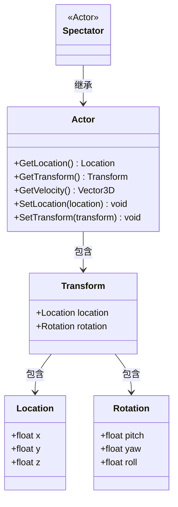
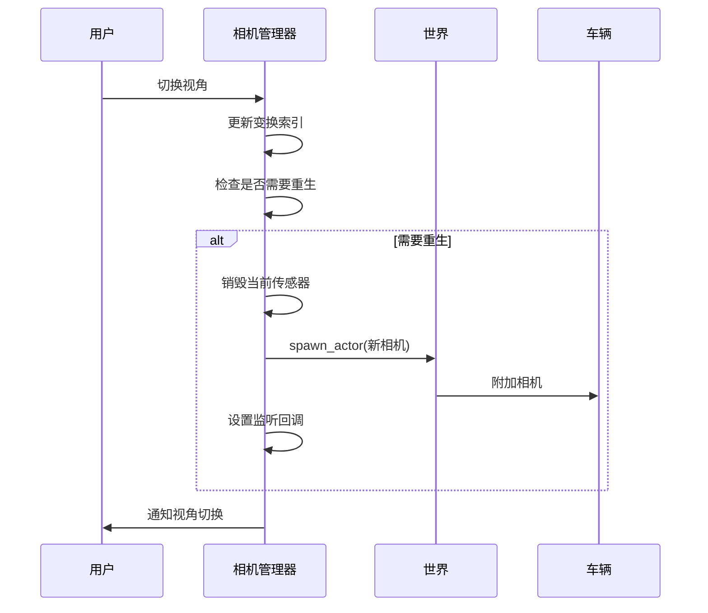
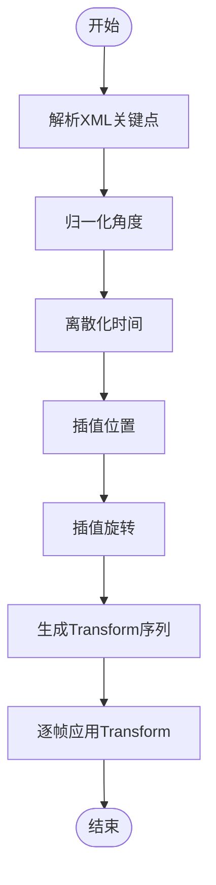

# 观察者控制

> **引用文件**
> **本文档中引用的文件**

- [World.h](https://github.com/carla-simulator/carla/blob/ue5-dev/LibCarla/source/carla/client/World.h)
- [World.cpp](https://github.com/carla-simulator/carla/blob/ue5-dev/LibCarla/source/carla/client/World.cpp)
- [Actor.h](https://github.com/carla-simulator/carla/blob/ue5-dev/LibCarla/source/carla/client/Actor.h)
- [Transform.h](https://github.com/carla-simulator/carla/blob/ue5-dev/LibCarla/source/carla/geom/Transform.h)
- [World.cpp](https://github.com/carla-simulator/carla/blob/ue5-dev/PythonAPI/carla/src/World.cpp)
- [Actor.cpp](https://github.com/carla-simulator/carla/blob/ue5-dev/PythonAPI/carla/src/Actor.cpp)
- [carla.World.get_spectator.py](https://github.com/carla-simulator/carla/blob/ue5-dev/PythonAPI/docs/snipets/carla.World.get_spectator.py)
- [spectator_transform.py](https://github.com/carla-simulator/carla/blob/ue5-dev/PythonAPI/util/spectator_transform.py)
- [interpolate_camera.py](https://github.com/carla-simulator/carla/blob/ue5-dev/PythonAPI/examples/interpolate_camera.py)
- [manual_control.py](https://github.com/carla-simulator/carla/blob/ue5-dev/PythonAPI/examples/manual_control.py)
- [automatic_control.py](https://github.com/carla-simulator/carla/blob/ue5-dev/PythonAPI/examples/automatic_control.py)

## 目录

1. [引言](#引言)
2. [观察者控制基础](#观察者控制基础)
3. [Spectator 对象与 Transform 属性](#spectator对象与transform属性)
4. [自由视角漫游](#自由视角漫游)
5. [车辆同步视角跟随](#车辆同步视角跟随)
6. [第一人称与第三人称视角切换](#第一人称与第三人称视角切换)
7. [视角插值平滑移动](#视角插值平滑移动)
8. [传感器视角查看](#传感器视角查看)
9. [高级视角控制技术](#高级视角控制技术)
10. [总结](#总结)

## 引言

本文档详细介绍了 CARLA 模拟器中观察者（Spectator）控制的核心机制，重点聚焦于`World.get_spectator`方法的应用。观察者是控制模拟器窗口视图的关键角色，通过操作其 Transform 属性，可以实现各种复杂的视角控制，包括自由漫游、车辆跟随、视角切换和动画路径等。文档为初学者提供了基本的视角控制指南，同时为高级用户提供了自定义相机路径和动画视角的专业技术。

## 观察者控制基础

观察者控制是 CARLA 模拟器中实现可视化和调试的核心功能。通过`World.get_spectator`方法获取的 Spectator 对象，开发者可以完全控制模拟器的视图。Spectator 本质上是一个特殊的 Actor，其位置和旋转决定了当前模拟器窗口的视角。

在 Python API 中，获取观察者的基本代码模式如下：

```python
world = client.get_world()
spectator = world.get_spectator()
```

一旦获取了 Spectator 对象，就可以通过`set_transform`方法来改变其位置和视角。Transform 由 Location（位置）和 Rotation（旋转）两个核心组件构成，精确控制这两个属性即可实现所需的视角效果。

**Section sources**

- <a href="https://github.com/carla-simulator/carla/blob/ue5-dev/LibCarla/source/carla/client/World.h#L81-L83" target="_blank">World.h</a>
- <a href="https://github.com/carla-simulator/carla/blob/ue5-dev/LibCarla/source/carla/client/World.cpp#L48-L50" target="_blank">World.cpp</a>
- <a href="https://github.com/carla-simulator/carla/blob/ue5-dev/PythonAPI/docs/snipets/carla.World.get_spectator.py#L5-L6" target="_blank">carla.World.get_spectator.py</a>

## Spectator 对象与 Transform 属性

Spectator 对象继承自 Actor 类，因此具备所有 Actor 的通用属性和方法。其核心功能是通过 Transform 属性来定义观察视角。Transform 属性包含两个主要部分：Location 和 Rotation。

Location 定义了观察者在三维空间中的坐标位置，由 x、y、z 三个分量组成。Rotation 定义了观察者的朝向，由 pitch（俯仰角）、yaw（偏航角）和 roll（翻滚角）三个角度组成。这些属性共同决定了观察者"看到"的场景。



**Diagram sources**

- <a href="https://github.com/carla-simulator/carla/blob/ue5-dev/LibCarla/source/carla/client/Actor.h#L37-L43" target="_blank">Actor.h</a>
- <a href="https://github.com/carla-simulator/carla/blob/ue5-dev/LibCarla/source/carla/geom/Transform.h#L30-L32" target="_blank">Transform.h</a>

**Section sources**

- <a href="https://github.com/carla-simulator/carla/blob/ue5-dev/LibCarla/source/carla/client/Actor.h#L37-L80" target="_blank">Actor.h</a>
- <a href="https://github.com/carla-simulator/carla/blob/ue5-dev/LibCarla/source/carla/geom/Transform.h#L23-L169" target="_blank">Transform.h</a>

## 自由视角漫游

自由视角漫游允许开发者将观察者放置在场景中的任意位置，实现对环境的全方位探索。这通过直接设置 Spectator 的 Transform 来实现。

要实现自由视角漫游，首先需要创建一个包含目标位置和旋转的 Transform 对象，然后将其应用到 Spectator 上。例如，将观察者移动到特定坐标并调整视角：

```python
new_transform = carla.Transform(
    carla.Location(x=100.0, y=200.0, z=50.0),
    carla.Rotation(pitch=-15.0, yaw=45.0, roll=0.0)
)
spectator.set_transform(new_transform)
```

这种方法常用于场景探索、调试和创建特定视角的截图或视频。通过编程方式改变位置和旋转，可以实现平滑的摄像机移动或预设的飞行路径。

**Section sources**

- <a href="https://github.com/carla-simulator/carla/blob/ue5-dev/LibCarla/source/carla/client/Actor.h#L76-L80" target="_blank">Actor.h</a>
- <a href="https://github.com/carla-simulator/carla/blob/ue5-dev/PythonAPI/carla/src/Actor.cpp#L125-L127" target="_blank">Actor.cpp</a>

## 车辆同步视角跟随

视角跟随模式是将观察者与特定车辆同步，实现类似车载摄像头的视角。这在自动驾驶算法的可视化和调试中非常有用。

实现车辆同步视角跟随的基本步骤是：首先获取目标车辆的当前 Transform，然后将其应用到 Spectator 上。为了实现更自然的跟随效果，通常会在车辆位置的基础上添加一个偏移量，形成第三人称视角。

```python
vehicle_transform = vehicle.get_transform()
spectator_transform = carla.Transform(
    vehicle_transform.location + carla.Location(z=50),
    carla.Rotation(pitch=-30)
)
spectator.set_transform(spectator_transform)
```

在同步模式下，可以在每个时间步更新观察者位置，确保视角与车辆运动完全同步。这对于实时监控车辆行为和周围环境变化至关重要。

**Section sources**

- <a href="https://github.com/carla-simulator/carla/blob/ue5-dev/PythonAPI/docs/snipets/carla.World.get_spectator.py#L18-L19" target="_blank">carla.World.get_spectator.py</a>
- <a href="https://github.com/carla-simulator/carla/blob/ue5-dev/PythonAPI/test/API/test_sync_mode.py#L50-L54" target="_blank">test_sync_mode.py</a>

## 第一人称与第三人称视角切换

CARLA 提供了多种预设的相机视角，可以通过 CameraManager 类实现第一人称和第三人称视角的切换。这些预设视角通常与车辆绑定，提供不同的观察角度。

在`manual_control.py`等示例代码中，CameraManager 定义了多个相机变换，包括：

- 第一人称视角：相机位于驾驶员位置，提供直接的驾驶视野
- 第三人称视角：相机位于车辆后方，提供车辆和周围环境的整体视图
- 鸟瞰视角：相机位于车辆上方，提供全局视角

视角切换通常通过循环遍历预设的相机变换来实现。每次切换时，销毁当前相机并根据新的变换参数创建新相机，同时保持与车辆的正确附件关系。



**Diagram sources**

- <a href="https://github.com/carla-simulator/carla/blob/ue5-dev/PythonAPI/examples/manual_control.py#L1108-L1121" target="_blank">manual_control.py</a>
- <a href="https://github.com/carla-simulator/carla/blob/ue5-dev/PythonAPI/examples/automatic_control.py#L587-L592" target="_blank">automatic_control.py</a>

**Section sources**

- <a href="https://github.com/carla-simulator/carla/blob/ue5-dev/PythonAPI/test/API/prop_control.py#L831-L844" target="_blank">prop_control.py</a>
- <a href="https://github.com/carla-simulator/carla/blob/ue5-dev/PythonAPI/examples/manual_control.py#L481-L484" target="_blank">manual_control.py</a>

## 视角插值平滑移动

视角插值技术用于创建平滑的摄像机动画，避免视角的突兀跳跃。这通过在关键点之间进行插值计算来实现，生成一系列中间位置和旋转。

`interpolate_camera.py`示例展示了如何从 XML 文件中读取关键点，并使用 scipy 的插值函数生成平滑的摄像机路径。关键点包含时间、位置和旋转信息，系统根据这些信息计算出每帧的精确 Transform。

插值过程包括：

1. 解析 XML 文件中的关键点
2. 对位置和旋转分量进行时间插值
3. 处理角度的周期性（如 yaw 角从 359 度到 0 度的平滑过渡）
4. 生成离散的时间序列 Transform
5. 在每个时间步应用新的 Transform

这种方法可以创建电影级的摄像机运动，用于演示、视频制作和高级可视化。



**Diagram sources**

- <a href="https://github.com/carla-simulator/carla/blob/ue5-dev/PythonAPI/examples/interpolate_camera.py#L50-L114" target="_blank">interpolate_camera.py</a>

**Section sources**

- <a href="https://github.com/carla-simulator/carla/blob/ue5-dev/PythonAPI/examples/interpolate_camera.py#L195-L199" target="_blank">interpolate_camera.py</a>

## 传感器视角查看

除了主观察者视角，CARLA 还允许通过传感器视角查看场景。这通过在车辆或其他 Actor 上附加相机传感器来实现，可以模拟各种车载传感器的视图。

传感器视角的创建过程包括：

1. 从蓝图库中获取相机传感器蓝图
2. 定义传感器的安装位置和方向
3. 将传感器作为 Actor 生成并附加到目标车辆
4. 设置传感器数据监听回调

这种方法可以同时获取多个视角的数据，用于多视角感知、传感器融合和数据记录。与主观察者不同，传感器视角可以独立配置分辨率、视野、位置等参数，以模拟真实传感器的特性。

**Section sources**

- <a href="https://github.com/carla-simulator/carla/blob/ue5-dev/PythonAPI/test/test_raycast_sensor.py#L116-L128" target="_blank">test_raycast_sensor.py</a>
- <a href="https://github.com/carla-simulator/carla/blob/ue5-dev/PythonAPI/test/API/test_sensor_recording.py#L89-L90" target="_blank">test_sensor_recording.py</a>

## 高级视角控制技术

对于专业应用，CARLA 提供了更高级的视角控制技术。`spectator_transform.py`工具允许用户获取当前观察者位置并保存为插值格式，便于后续重用。

高级技术包括：

- **动态视角调整**：根据场景内容自动调整视角，如在检测到感兴趣物体时自动聚焦
- **多视角管理**：同时管理多个观察者或传感器，实现复杂的监控系统
- **路径动画**：预定义复杂的摄像机路径，用于制作演示视频
- **交互式控制**：通过键盘、鼠标或游戏手柄实时控制观察者移动

这些技术结合了 Transform 操作、插值算法和事件处理，为高级可视化和分析提供了强大支持。

**Section sources**

- <a href="https://github.com/carla-simulator/carla/blob/ue5-dev/PythonAPI/util/spectator_transform.py#L46-L64" target="_blank">spectator_transform.py</a>

## 总结

本文档全面介绍了 CARLA 模拟器中的观察者控制机制。从基础的`get_spectator`方法到高级的视角插值技术，观察者控制为场景可视化、算法调试和数据采集提供了强大工具。通过精确控制 Spectator 的 Transform 属性，开发者可以实现从简单视角切换到复杂摄像机动画的各种功能。掌握这些技术对于有效利用 CARLA 进行自动驾驶研究和开发至关重要。
