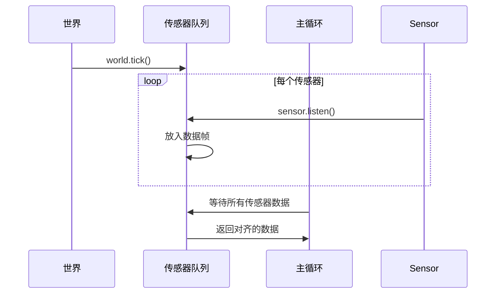

# 传感器同步机制

> **引用文件**
> **本文档引用的文件**

- [sensor_synchronization.py](https://github.com/carla-simulator/carla/blob/ue5-dev/PythonAPI/examples/sensor_synchronization.py)
- [adv_synchrony_timestep.md](https://github.com/carla-simulator/carla/blob/ue5-dev/Docs/adv_synchrony_timestep.md)
- [foundations.md](https://github.com/carla-simulator/carla/blob/ue5-dev/Docs/foundations.md)

## 目录

1. [引言](#引言)
2. [同步模式与异步模式](#同步模式与异步模式)
3. [tick 机制与数据流协调](#tick机制与数据流协调)
4. [帧对齐策略](#帧对齐策略)
5. [多传感器同步实现](#多传感器同步实现)
6. [常见同步问题及解决方案](#常见同步问题及解决方案)
7. [基础使用示例](#基础使用示例)
8. [高级优化方案](#高级优化方案)

## 引言

CARLA 仿真器提供了强大的传感器同步机制，用于在自动驾驶仿真中实现精确的时间对齐。本文档详细解释了同步模式（synchronous mode）和异步模式（asynchronous mode）的工作原理，重点介绍如何使用 world.tick()和 sensor.listen()实现多传感器数据流的帧对齐。文档包含完整的代码示例，展示不同帧率传感器之间的精确时间同步，并提供常见同步问题的解决方案。

## 同步模式与异步模式

CARLA 提供了两种主要的仿真模式：同步模式和异步模式。同步模式允许客户端完全控制仿真流程，确保传感器数据在精确的时间点上对齐。当启用同步模式时，服务器会等待客户端的 tick 信号才推进仿真时间步。

在同步模式下，客户端通过调用`world.tick()`方法向服务器发送 tick 信号，服务器接收到信号后推进一个时间步，并生成世界快照。这种机制对于需要精确时间对齐的多传感器系统至关重要，特别是在处理慢速客户端应用或需要传感器间同步的场景中。

异步模式则允许服务器以尽可能快的速度运行，不等待客户端的 tick 信号。这种模式适用于对实时性要求不高或需要最大化仿真速度的场景，但可能导致传感器数据的时间戳不一致。

```mermaid
graph TD
A[客户端] --> |world.tick()| B[服务器]
B --> C[推进仿真时间步]
C --> D[生成世界快照]
D --> E[发送传感器数据]
E --> A
```

**Diagram sources**

- <a href="https://github.com/carla-simulator/carla/blob/ue5-dev/PythonAPI/examples/sensor_synchronization.py#L52-L55" target="_blank">sensor_synchronization.py</a>

**Section sources**

- <a href="https://github.com/carla-simulator/carla/blob/ue5-dev/PythonAPI/examples/sensor_synchronization.py#L52-L55" target="_blank">sensor_synchronization.py</a>
- <a href="https://github.com/carla-simulator/carla/blob/ue5-dev/Docs/adv_synchrony_timestep.md#L180-L183" target="_blank">adv_synchrony_timestep.md</a>

## tick 机制与数据流协调

tick 机制是 CARLA 同步系统的核心。`world.tick()`方法用于推进仿真时间步，而`world.wait_for_tick()`则用于等待下一个 tick 并获取快照。在同步模式下，`world.tick()`会阻塞直到服务器完成当前时间步的计算。

传感器数据流通过`sensor.listen()`方法进行协调。该方法注册一个回调函数，当传感器生成新数据时自动调用。在同步模式下，所有传感器的数据生成都与世界 tick 同步，确保了时间上的一致性。

```python
# 设置同步模式
settings = world.get_settings()
settings.synchronous_mode = True
settings.fixed_delta_seconds = 0.2
world.apply_settings(settings)

# 传感器监听
camera.listen(lambda data: sensor_callback(data, sensor_queue, "camera"))
lidar.listen(lambda data: sensor_callback(data, sensor_queue, "lidar"))
```

**Section sources**

- <a href="https://github.com/carla-simulator/carla/blob/ue5-dev/PythonAPI/examples/sensor_synchronization.py#L52-L55" target="_blank">sensor_synchronization.py</a>
- <a href="https://github.com/carla-simulator/carla/blob/ue5-dev/PythonAPI/examples/sensor_synchronization.py#L72-L78" target="_blank">sensor_synchronization.py</a>

## 帧对齐策略

帧对齐是多传感器系统中的关键挑战。CARLA 通过使用队列机制来实现精确的帧对齐。每个传感器在接收到数据后，将其放入共享队列中，主循环则等待所有传感器的数据都到达后再进行处理。

这种策略确保了所有传感器的数据都来自同一仿真时间步，避免了由于处理延迟导致的数据错位。队列的使用是线程安全的，可以被多个传感器回调并发访问。



**Diagram sources**

- <a href="https://github.com/carla-simulator/carla/blob/ue5-dev/PythonAPI/examples/sensor_synchronization.py#L60-L61" target="_blank">sensor_synchronization.py</a>
- <a href="https://github.com/carla-simulator/carla/blob/ue5-dev/PythonAPI/examples/sensor_synchronization.py#L96-L109" target="_blank">sensor_synchronization.py</a>

**Section sources**

- <a href="https://github.com/carla-simulator/carla/blob/ue5-dev/PythonAPI/examples/sensor_synchronization.py#L60-L109" target="_blank">sensor_synchronization.py</a>

## 多传感器同步实现

以下是一个完整的多传感器同步实现示例，展示了如何在不同帧率的传感器之间实现精确的时间同步：

```python
def sensor_callback(sensor_data, sensor_queue, sensor_name):
    # 处理传感器数据
    sensor_queue.put((sensor_data.frame, sensor_name))

def main():
    client = carla.Client('localhost', 2000)
    client.set_timeout(2.0)
    world = client.get_world()

    try:
        original_settings = world.get_settings()
        settings = world.get_settings()
        settings.fixed_delta_seconds = 0.2
        settings.synchronous_mode = True
        world.apply_settings(settings)

        sensor_queue = Queue()

        # 创建多个传感器
        sensor_list = []
        camera = world.spawn_actor(camera_bp, transform)
        camera.listen(lambda data: sensor_callback(data, sensor_queue, "camera"))
        sensor_list.append(camera)

        lidar = world.spawn_actor(lidar_bp, transform)
        lidar.listen(lambda data: sensor_callback(data, sensor_queue, "lidar"))
        sensor_list.append(lidar)

        # 主循环
        while True:
            world.tick()
            w_frame = world.get_snapshot().frame

            # 等待所有传感器数据
            try:
                for _ in range(len(sensor_list)):
                    s_frame = sensor_queue.get(True, 1.0)
                    print(f"帧: {s_frame[0]} 传感器: {s_frame[1]}")
            except Empty:
                print("部分传感器数据丢失")

    finally:
        world.apply_settings(original_settings)
        for sensor in sensor_list:
            sensor.destroy()
```

**Section sources**

- <a href="https://github.com/carla-simulator/carla/blob/ue5-dev/PythonAPI/examples/sensor_synchronization.py#L40-L117" target="_blank">sensor_synchronization.py</a>

## 常见同步问题及解决方案

### 时钟漂移

时钟漂移是由于系统时钟精度不足导致的时间累积误差。解决方案包括：

- 使用高精度定时器
- 定期进行时钟校准
- 采用网络时间协议(NTP)同步

### 数据丢失

数据丢失可能由于网络延迟或处理能力不足导致。解决方案包括：

- 增加队列缓冲区大小
- 优化数据处理算法
- 使用超时机制处理丢失的数据

### 延迟累积

延迟累积会导致传感器数据与实际仿真时间不同步。解决方案包括：

- 实现延迟补偿算法
- 动态调整时间步长
- 使用预测滤波器

**Section sources**

- <a href="https://github.com/carla-simulator/carla/blob/ue5-dev/PythonAPI/examples/sensor_synchronization.py#L105-L112" target="_blank">sensor_synchronization.py</a>

## 基础使用示例

对于初学者，以下是一个简单的同步模式使用示例：

```python
# 基础同步模式示例
client = carla.Client('localhost', 2000)
world = client.get_world()

# 启用同步模式
settings = world.get_settings()
settings.synchronous_mode = True
world.apply_settings(settings)

# 创建传感器并监听
camera = world.spawn_actor(camera_bp, transform)
image_queue = Queue()
camera.listen(image_queue.put)

# 主循环
for _ in range(100):
    world.tick()
    image = image_queue.get()
    # 处理图像数据

# 恢复原始设置
world.apply_settings(original_settings)
camera.destroy()
```

**Section sources**

- <a href="https://github.com/carla-simulator/carla/blob/ue5-dev/PythonAPI/examples/sensor_synchronization.py#L52-L55" target="_blank">sensor_synchronization.py</a>

## 高级优化方案

### 高精度时间同步

对于需要高精度时间同步的应用，可以采用以下优化方案：

- 使用更小的固定时间步长
- 实现亚帧时间戳插值
- 采用硬件时间戳

### 分布式传感器网络

在分布式传感器网络中，可以采用以下策略：

- 实现分布式时钟同步协议
- 使用时间戳服务器
- 采用预测性数据融合

这些高级方案能够显著提高多传感器系统的同步精度和可靠性，适用于自动驾驶、机器人导航等对时间精度要求极高的应用场景。

**Section sources**

- <a href="https://github.com/carla-simulator/carla/blob/ue5-dev/PythonAPI/examples/sensor_synchronization.py#L53-L54" target="_blank">sensor_synchronization.py</a>
- <a href="https://github.com/carla-simulator/carla/blob/ue5-dev/Docs/adv_synchrony_timestep.md#L168-L172" target="_blank">adv_synchrony_timestep.md</a>
