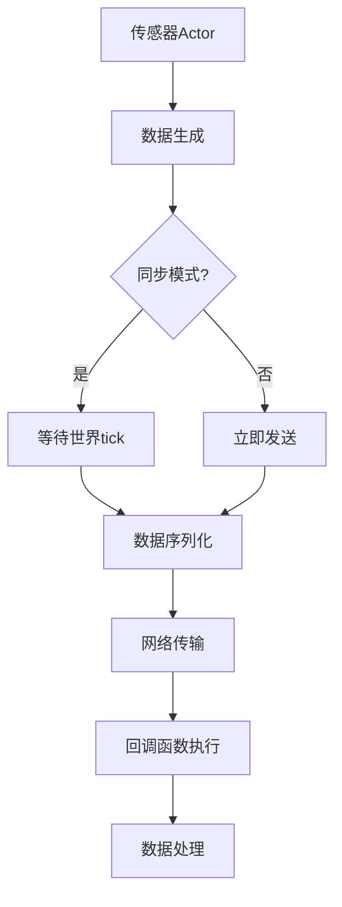
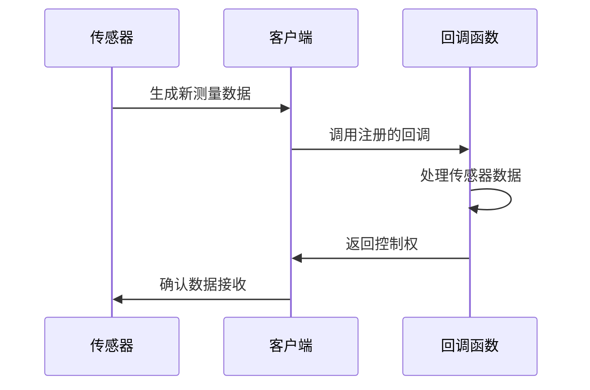
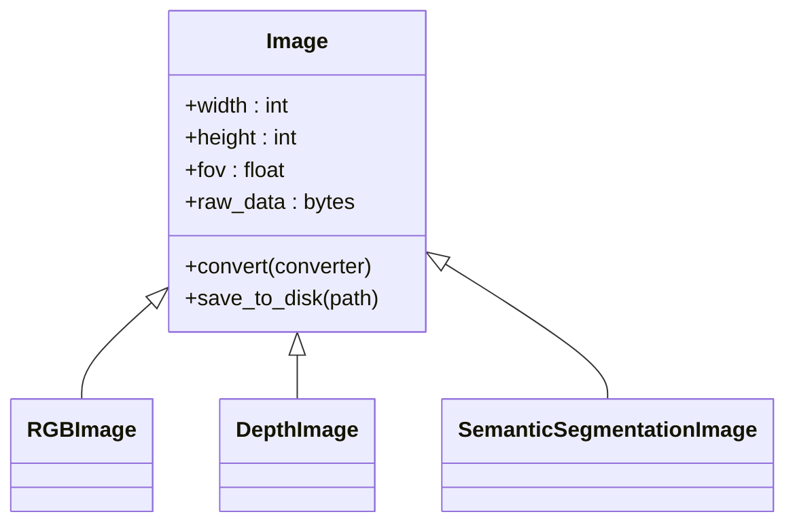
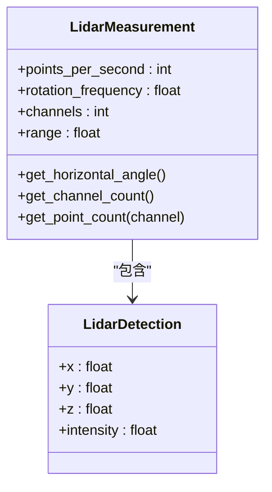
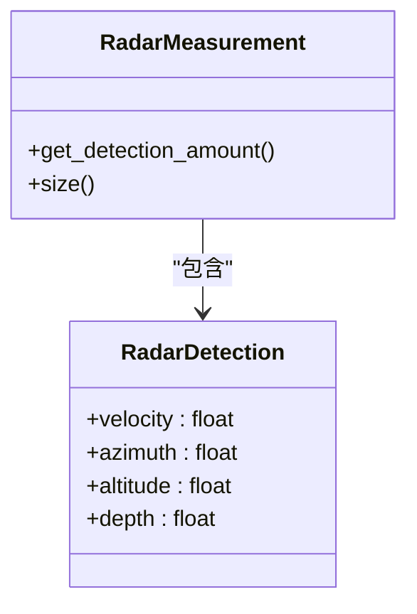
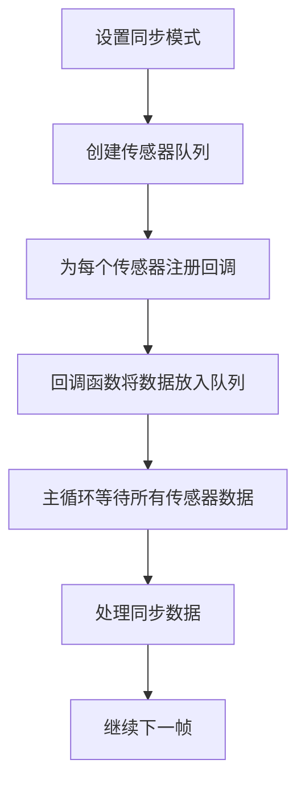
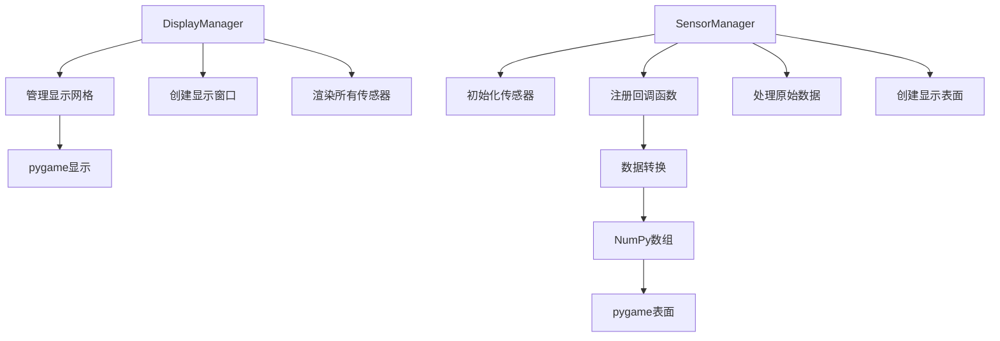
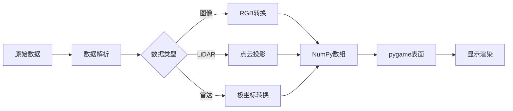
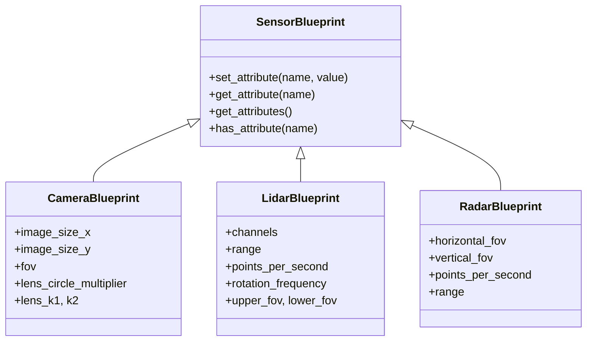
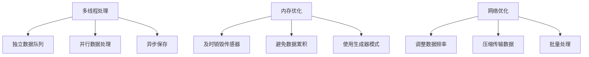

# 传感器接口

> **引用文件**
> **本文档中引用的文件**

- [Sensor.h](https://github.com/carla-simulator/carla/blob/ue5-dev/LibCarla/source/carla/client/Sensor.h)
- [Sensor.cpp](https://github.com/carla-simulator/carla/blob/ue5-dev/PythonAPI/carla/src/Sensor.cpp)
- [SensorData.h](https://github.com/carla-simulator/carla/blob/ue5-dev/LibCarla/source/carla/sensor/SensorData.h)
- [Image.h](https://github.com/carla-simulator/carla/blob/ue5-dev/LibCarla/source/carla/sensor/data/Image.h)
- [LidarMeasurement.h](https://github.com/carla-simulator/carla/blob/ue5-dev/LibCarla/source/carla/sensor/data/LidarMeasurement.h)
- [RadarMeasurement.h](https://github.com/carla-simulator/carla/blob/ue5-dev/LibCarla/source/carla/sensor/data/RadarMeasurement.h)
- [ServerSideSensor.h](https://github.com/carla-simulator/carla/blob/ue5-dev/LibCarla/source/carla/client/ServerSideSensor.h)
- [ClientSideSensor.h](https://github.com/carla-simulator/carla/blob/ue5-dev/LibCarla/source/carla/client/ClientSideSensor.h)
- [sensor_synchronization.py](https://github.com/carla-simulator/carla/blob/ue5-dev/PythonAPI/examples/sensor_synchronization.py)
- [visualize_multiple_sensors.py](https://github.com/carla-simulator/carla/blob/ue5-dev/PythonAPI/examples/visualize_multiple_sensors.py)

## 目录

1. [简介](#简介)
2. [核心组件](#核心组件)
3. [架构概述](#架构概述)
4. [详细组件分析](#详细组件分析)
5. [多传感器同步策略](#多传感器同步策略)
6. [数据可视化技术](#数据可视化技术)
7. [传感器配置最佳实践](#传感器配置最佳实践)
8. [初学者示例](#初学者示例)
9. [高级优化方案](#高级优化方案)
10. [结论](#结论)

## 简介

本文档详细介绍了 CARLA 仿真平台中`carla.Sensor`类的数据采集功能。重点解析了传感器数据流处理机制、回调系统、帧对齐策略以及多种传感器数据类型的结构和访问方法。文档还包含了多传感器同步和数据可视化的实际示例，并提供了传感器配置的最佳实践建议。

## 核心组件

`carla.Sensor`是所有传感器类型的基础类，继承自`Actor`类，提供了数据采集的核心功能。其主要方法包括`listen()`用于注册回调函数，`stop()`用于停止数据采集，以及`is_listening()`用于检查当前监听状态。

传感器系统分为两类实现：

- `ServerSideSensor`：服务器端传感器，数据在服务器生成并通过流传输
- `ClientSideSensor`：客户端传感器，数据在客户端计算生成

**本节来源**

- <a href="https://github.com/carla-simulator/carla/blob/ue5-dev/LibCarla/source/carla/client/Sensor.h#L17-L37" target="_blank">Sensor.h</a>
- <a href="https://github.com/carla-simulator/carla/blob/ue5-dev/LibCarla/source/carla/client/ServerSideSensor.h#L15-L71" target="_blank">ServerSideSensor.h</a>
- <a href="https://github.com/carla-simulator/carla/blob/ue5-dev/LibCarla/source/carla/client/ClientSideSensor.h#L14-L22" target="_blank">ClientSideSensor.h</a>

## 架构概述

CARLA 的传感器系统采用基于回调的异步数据采集架构。当传感器被激活时，它会持续生成测量数据，并通过注册的回调函数将数据传递给客户端应用程序。



**图表来源**

- <a href="https://github.com/carla-simulator/carla/blob/ue5-dev/LibCarla/source/carla/client/Sensor.h#L17-L37" target="_blank">Sensor.h</a>
- <a href="https://github.com/carla-simulator/carla/blob/ue5-dev/PythonAPI/carla/src/Sensor.cpp#L9-L18" target="_blank">Sensor.cpp</a>

## 详细组件分析

### 回调机制分析

`listen()`方法是传感器数据采集的核心，它接受一个回调函数作为参数，当新数据到达时自动调用该函数。



回调函数接收`SensorData`对象，该对象包含帧号、时间戳和传感器变换等元数据。

**本节来源**

- <a href="https://github.com/carla-simulator/carla/blob/ue5-dev/LibCarla/source/carla/client/Sensor.h#L20-L26" target="_blank">Sensor.h</a>
- <a href="https://github.com/carla-simulator/carla/blob/ue5-dev/PythonAPI/carla/src/Sensor.cpp#L9-L11" target="_blank">Sensor.cpp</a>

### 传感器数据结构

#### 图像数据结构

`Image`类表示由摄像头传感器生成的图像数据，包含像素数据和图像属性。



**图表来源**

- <a href="https://github.com/carla-simulator/carla/blob/ue5-dev/LibCarla/source/carla/sensor/data/Image.h#L16-L27" target="_blank">Image.h</a>
- <a href="https://github.com/carla-simulator/carla/blob/ue5-dev/LibCarla/source/carla/sensor/SensorData.h#L19-L73" target="_blank">SensorData.h</a>

#### 激光雷达数据结构

`LidarMeasurement`类表示激光雷达传感器的测量结果，包含点云数据和扫描参数。



**图表来源**

- <a href="https://github.com/carla-simulator/carla/blob/ue5-dev/LibCarla/source/carla/sensor/data/LidarMeasurement.h#L18-L62" target="_blank">LidarMeasurement.h</a>
- <a href="https://github.com/carla-simulator/carla/blob/ue5-dev/LibCarla/source/carla/sensor/SensorData.h#L19-L73" target="_blank">SensorData.h</a>

#### 雷达数据结构

`RadarMeasurement`类表示雷达传感器的检测结果。



**图表来源**

- <a href="https://github.com/carla-simulator/carla/blob/ue5-dev/LibCarla/source/carla/sensor/data/RadarMeasurement.h#L18-L41" target="_blank">RadarMeasurement.h</a>
- <a href="https://github.com/carla-simulator/carla/blob/ue5-dev/LibCarla/source/carla/sensor/SensorData.h#L19-L73" target="_blank">SensorData.h</a>

## 多传感器同步策略

在同步模式下，多个传感器的数据采集需要进行帧对齐，确保所有传感器数据对应同一仿真时刻。



**图表来源**

- <a href="https://github.com/carla-simulator/carla/blob/ue5-dev/PythonAPI/examples/sensor_synchronization.py#L24-L124" target="_blank">sensor_synchronization.py</a>

### 同步实现机制

1. **队列管理**：使用线程安全的队列来收集各个传感器的数据
2. **帧对齐**：通过比较帧号确保数据同步
3. **超时处理**：设置合理的超时时间防止死锁

```python
# 伪代码示例
sensor_queue = Queue()
for sensor in sensor_list:
    sensor.listen(lambda data: sensor_queue.put((data.frame, sensor.id)))

# 主循环
world.tick()
for _ in range(len(sensor_list)):
    frame, sensor_id = sensor_queue.get(timeout=1.0)
```

**本节来源**

- <a href="https://github.com/carla-simulator/carla/blob/ue5-dev/PythonAPI/examples/sensor_synchronization.py#L60-L112" target="_blank">sensor_synchronization.py</a>

## 数据可视化技术

### 多传感器可视化架构



**图表来源**

- <a href="https://github.com/carla-simulator/carla/blob/ue5-dev/PythonAPI/examples/visualize_multiple_sensors.py#L42-L83" target="_blank">visualize_multiple_sensors.py</a>

### 可视化流程

1. **显示管理器初始化**：创建主显示窗口并定义网格布局
2. **传感器管理器创建**：为每个传感器创建管理实例
3. **数据转换**：将原始传感器数据转换为可视化格式
4. **渲染循环**：持续更新显示内容



**本节来源**

- <a href="https://github.com/carla-simulator/carla/blob/ue5-dev/PythonAPI/examples/visualize_multiple_sensors.py#L84-L243" target="_blank">visualize_multiple_sensors.py</a>

## 传感器配置最佳实践

### 传感器蓝图配置



**图表来源**

- <a href="https://github.com/carla-simulator/carla/blob/ue5-dev/PythonAPI/examples/visualize_multiple_sensors.py#L100-L154" target="_blank">visualize_multiple_sensors.py</a>

### 关键属性设置

| 传感器类型 | 关键属性           | 推荐值   | 说明                 |
| ---------- | ------------------ | -------- | -------------------- |
| RGB 摄像头 | image_size_x/y     | 1280x720 | 分辨率影响性能和细节 |
|            | fov                | 90       | 视野角度             |
|            | sensor_tick        | 0.05     | 数据采集间隔(秒)     |
| 激光雷达   | channels           | 64       | 垂直方向光束数量     |
|            | range              | 100      | 最大检测距离(米)     |
|            | points_per_second  | 250000   | 点云密度             |
|            | rotation_frequency | 20       | 旋转频率(Hz)         |
| 雷达       | horizontal_fov     | 30       | 水平视野             |
|            | range              | 100      | 最大检测距离         |
|            | points_per_second  | 1500     | 检测点数量           |

**本节来源**

- <a href="https://github.com/carla-simulator/carla/blob/ue5-dev/PythonAPI/examples/visualize_multiple_sensors.py#L279-L293" target="_blank">visualize_multiple_sensors.py</a>
- <a href="https://github.com/carla-simulator/carla/blob/ue5-dev/PythonAPI/examples/sensor_synchronization.py#L75-L80" target="_blank">sensor_synchronization.py</a>

## 初学者示例

### RGB 摄像头数据采集

最简单的传感器使用示例：

```python
# 1. 获取世界和蓝图库
world = client.get_world()
blueprint_library = world.get_blueprint_library()

# 2. 创建摄像头蓝图
camera_bp = blueprint_library.find('sensor.camera.rgb')

# 3. 设置摄像头属性
camera_bp.set_attribute('image_size_x', '800')
camera_bp.set_attribute('image_size_y', '600')
camera_bp.set_attribute('fov', '90')

# 4. 生成传感器
camera = world.spawn_actor(camera_bp, transform, attach_to=vehicle)

# 5. 注册回调函数
camera.listen(lambda image: image.save_to_disk('output/%06d.png' % image.frame))
```

**本节来源**

- <a href="https://github.com/carla-simulator/carla/blob/ue5-dev/PythonAPI/examples/visualize_multiple_sensors.py#L100-L112" target="_blank">visualize_multiple_sensors.py</a>
- <a href="https://github.com/carla-simulator/carla/blob/ue5-dev/PythonAPI/examples/sensor_synchronization.py#L64-L73" target="_blank">sensor_synchronization.py</a>

## 高级优化方案

### 高性能数据流处理



**图表来源**

- <a href="https://github.com/carla-simulator/carla/blob/ue5-dev/PythonAPI/examples/sensor_synchronization.py#L57-L60" target="_blank">sensor_synchronization.py</a>
- <a href="https://github.com/carla-simulator/carla/blob/ue5-dev/PythonAPI/examples/visualize_multiple_sensors.py#L274-L277" target="_blank">visualize_multiple_sensors.py</a>

### 多传感器融合策略

1. **时间同步**：确保所有传感器数据时间戳对齐
2. **空间校准**：精确设置传感器相对位置和姿态
3. **数据融合**：结合不同类型传感器的优势
4. **冗余处理**：处理传感器数据丢失情况

```python
# 优化的同步处理
def optimized_sensor_sync():
    # 使用固定时间步长
    settings.fixed_delta_seconds = 0.1
    settings.synchronous_mode = True

    # 为每个传感器创建专用队列
    sensor_queues = {sensor.id: Queue() for sensor in sensor_list}

    # 异步数据处理
    with ThreadPoolExecutor() as executor:
        for sensor in sensor_list:
            executor.submit(process_sensor_data, sensor_queues[sensor.id])
```

**本节来源**

- <a href="https://github.com/carla-simulator/carla/blob/ue5-dev/PythonAPI/examples/sensor_synchronization.py#L52-L55" target="_blank">sensor_synchronization.py</a>
- <a href="https://github.com/carla-simulator/carla/blob/ue5-dev/PythonAPI/examples/visualize_multiple_sensors.py#L263-L266" target="_blank">visualize_multiple_sensors.py</a>

## 结论

CARLA 的传感器接口提供了强大而灵活的数据采集功能。通过理解`listen()`回调机制、掌握各种传感器数据类型的结构特点，并应用多传感器同步和可视化技术，开发者可以构建高效的自动驾驶感知系统。合理配置传感器属性和采用性能优化策略对于实现高质量的仿真至关重要。
