# 传感器数据处理

> **引用文件**
> **本文档中引用的文件**

- [SensorData.h](https://github.com/carla-simulator/carla/blob/ue5-dev/LibCarla/source/carla/sensor/SensorData.h)
- [SensorData.cpp](https://github.com/carla-simulator/carla/blob/ue5-dev/PythonAPI/carla/src/SensorData.cpp)
- [visualize_multiple_sensors.py](https://github.com/carla-simulator/carla/blob/ue5-dev/PythonAPI/examples/visualize_multiple_sensors.py)
- [Image.h](https://github.com/carla-simulator/carla/blob/ue5-dev/LibCarla/source/carla/sensor/data/Image.h)
- [LidarMeasurement.h](https://github.com/carla-simulator/carla/blob/ue5-dev/LibCarla/source/carla/sensor/data/LidarMeasurement.h)
- [IMUMeasurement.h](https://github.com/carla-simulator/carla/blob/ue5-dev/LibCarla/source/carla/sensor/data/IMUMeasurement.h)
- [GnssMeasurement.h](https://github.com/carla-simulator/carla/blob/ue5-dev/LibCarla/source/carla/sensor/data/GnssMeasurement.h)
- [Color.h](https://github.com/carla-simulator/carla/blob/ue5-dev/LibCarla/source/carla/sensor/data/Color.h)
- [LidarData.h](https://github.com/carla-simulator/carla/blob/ue5-dev/LibCarla/source/carla/sensor/data/LidarData.h)

## 目录

1. [简介](#简介)
2. [传感器数据基础结构](#传感器数据基础结构)
3. [图像数据处理](#图像数据处理)
4. [激光雷达数据处理](#激光雷达数据处理)
5. [IMU 与 GNSS 数据处理](#imu与gnss数据处理)
6. [多传感器数据可视化](#多传感器数据可视化)
7. [数据转换技术](#数据转换技术)
8. [内存优化策略](#内存优化策略)
9. [数据访问示例](#数据访问示例)
10. [高级数据处理管道](#高级数据处理管道)

## 简介

本文档详细介绍了 CARLA 模拟器中 carla.SensorData 类的数据解析功能，重点分析了各种传感器数据类型（图像、激光雷达、IMU、GNSS 等）的内部结构和访问方法。文档涵盖了数据转换技术、多传感器数据可视化示例以及内存优化策略，为初学者和高级用户提供全面的指导。

## 传感器数据基础结构

carla.SensorData 类是所有传感器数据对象的基类，包含传感器数据生成时的帧计数、时间戳和传感器变换信息。该类为所有传感器数据类型提供了统一的接口。

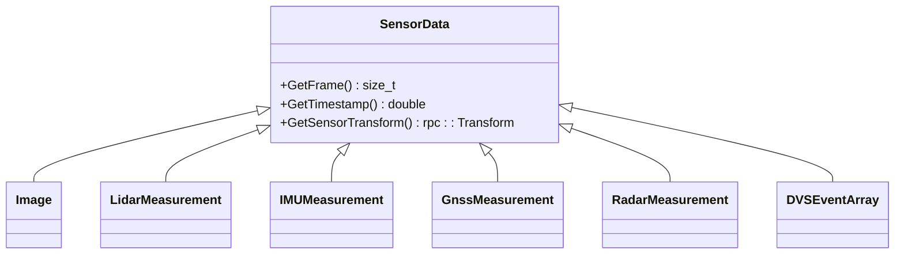

**图源**

- <a href="https://github.com/carla-simulator/carla/blob/ue5-dev/LibCarla/source/carla/sensor/SensorData.h#L19-L72" target="_blank">SensorData.h</a>

**本节来源**

- <a href="https://github.com/carla-simulator/carla/blob/ue5-dev/LibCarla/source/carla/sensor/SensorData.h#L19-L72" target="_blank">SensorData.h</a>

## 图像数据处理

图像数据由 carla.Image 类表示，包含 RGB 图像、深度图像和光流图像等多种类型。图像数据以 BGRA 格式存储，每个像素由 4 个字节组成（B、G、R、A 通道）。

### 图像数据结构

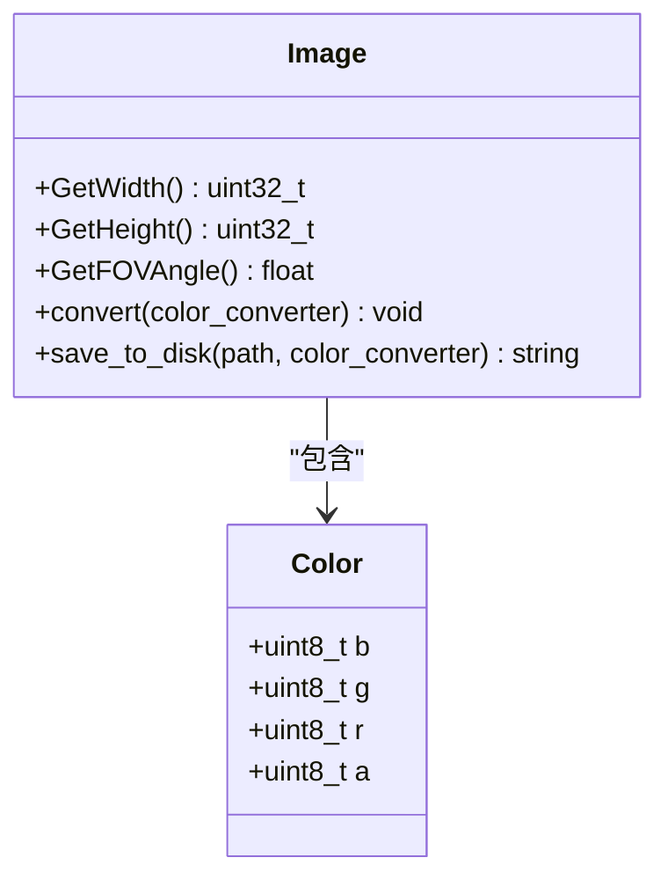

**图源**

- <a href="https://github.com/carla-simulator/carla/blob/ue5-dev/LibCarla/source/carla/sensor/data/Image.h#L16-L30" target="_blank">Image.h</a>
- <a href="https://github.com/carla-simulator/carla/blob/ue5-dev/LibCarla/source/carla/sensor/data/Color.h#L18-L48" target="_blank">Color.h</a>

**本节来源**

- <a href="https://github.com/carla-simulator/carla/blob/ue5-dev/LibCarla/source/carla/sensor/data/Image.h#L16-L30" target="_blank">Image.h</a>
- <a href="https://github.com/carla-simulator/carla/blob/ue5-dev/LibCarla/source/carla/sensor/data/Color.h#L18-L48" target="_blank">Color.h</a>

## 激光雷达数据处理

激光雷达数据由 carla.LidarMeasurement 类表示，包含点云数据和相关的元信息。激光雷达数据的结构包括水平角度、通道数和每个通道的点数。

### 激光雷达数据结构

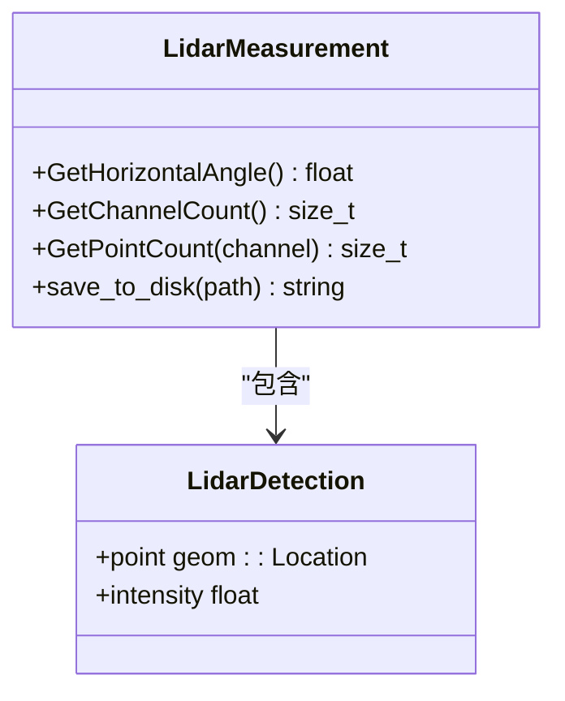

**图源**

- <a href="https://github.com/carla-simulator/carla/blob/ue5-dev/LibCarla/source/carla/sensor/data/LidarMeasurement.h#L18-L61" target="_blank">LidarMeasurement.h</a>
- <a href="https://github.com/carla-simulator/carla/blob/ue5-dev/LibCarla/source/carla/sensor/data/LidarData.h#L52-L74" target="_blank">LidarData.h</a>

**本节来源**

- <a href="https://github.com/carla-simulator/carla/blob/ue5-dev/LibCarla/source/carla/sensor/data/LidarMeasurement.h#L18-L61" target="_blank">LidarMeasurement.h</a>
- <a href="https://github.com/carla-simulator/carla/blob/ue5-dev/LibCarla/source/carla/sensor/data/LidarData.h#L52-L74" target="_blank">LidarData.h</a>

## IMU 与 GNSS 数据处理

IMU 和 GNSS 数据分别由 carla.IMUMeasurement 和 carla.GnssMeasurement 类表示，提供车辆的惯性测量和全球导航卫星系统数据。

### IMU 数据结构

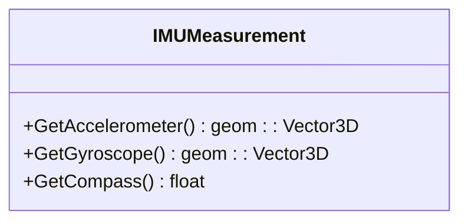

### GNSS 数据结构

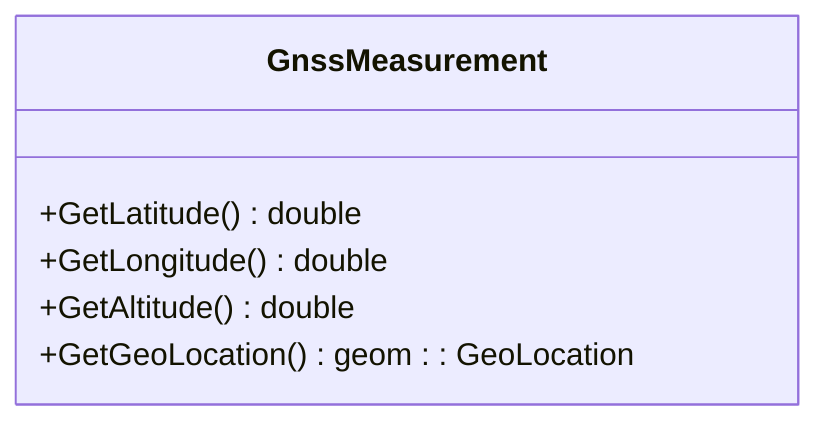

**图源**

- <a href="https://github.com/carla-simulator/carla/blob/ue5-dev/LibCarla/source/carla/sensor/data/IMUMeasurement.h#L17-L56" target="_blank">IMUMeasurement.h</a>
- <a href="https://github.com/carla-simulator/carla/blob/ue5-dev/LibCarla/source/carla/sensor/data/GnssMeasurement.h#L18-L62" target="_blank">GnssMeasurement.h</a>

**本节来源**

- <a href="https://github.com/carla-simulator/carla/blob/ue5-dev/LibCarla/source/carla/sensor/data/IMUMeasurement.h#L17-L56" target="_blank">IMUMeasurement.h</a>
- <a href="https://github.com/carla-simulator/carla/blob/ue5-dev/LibCarla/source/carla/sensor/data/GnssMeasurement.h#L18-L62" target="_blank">GnssMeasurement.h</a>

## 多传感器数据可视化

visualize_multiple_sensors.py 示例展示了如何同时处理和渲染多种传感器数据流，包括 RGB 相机、激光雷达和语义激光雷达。

### 多传感器可视化流程

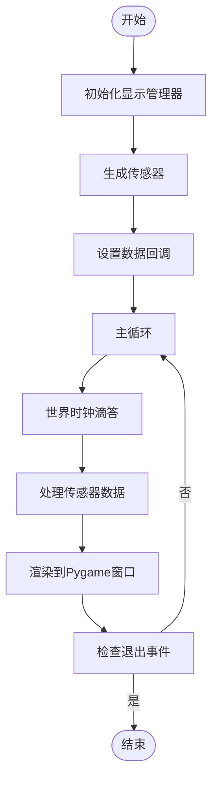

**图源**

- <a href="https://github.com/carla-simulator/carla/blob/ue5-dev/PythonAPI/examples/visualize_multiple_sensors.py#L42-L243" target="_blank">visualize_multiple_sensors.py</a>

**本节来源**

- <a href="https://github.com/carla-simulator/carla/blob/ue5-dev/PythonAPI/examples/visualize_multiple_sensors.py#L42-L243" target="_blank">visualize_multiple_sensors.py</a>

## 数据转换技术

CARLA 提供了多种数据转换技术，包括图像格式转换、点云坐标变换和 IMU 数据时间戳对齐。

### 图像格式转换

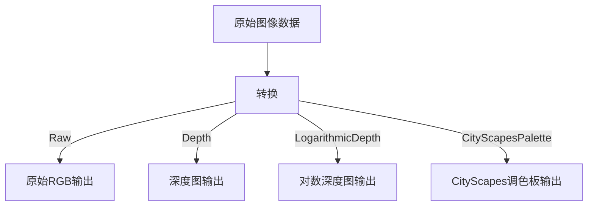

### 点云坐标变换

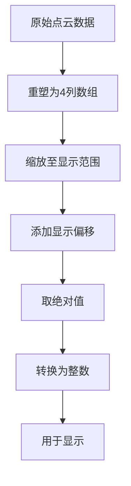

**图源**

- <a href="https://github.com/carla-simulator/carla/blob/ue5-dev/PythonAPI/carla/src/SensorData.cpp#L168-L187" target="_blank">SensorData.cpp</a>
- <a href="https://github.com/carla-simulator/carla/blob/ue5-dev/PythonAPI/examples/visualize_multiple_sensors.py#L181-L188" target="_blank">visualize_multiple_sensors.py</a>

**本节来源**

- <a href="https://github.com/carla-simulator/carla/blob/ue5-dev/PythonAPI/carla/src/SensorData.cpp#L168-L187" target="_blank">SensorData.cpp</a>
- <a href="https://github.com/carla-simulator/carla/blob/ue5-dev/PythonAPI/examples/visualize_multiple_sensors.py#L181-L188" target="_blank">visualize_multiple_sensors.py</a>

## 内存优化策略

处理大量传感器数据时，内存优化至关重要。CARLA 提供了缓冲区管理和数据流控制机制。

### 缓冲区管理

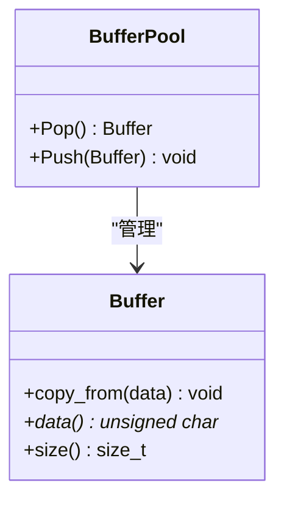

### 大数据量处理最佳实践

1. 使用缓冲区池减少内存分配开销
2. 及时销毁不再需要的传感器
3. 控制数据采样频率
4. 使用异步处理避免阻塞主线程

**本节来源**

- <a href="https://github.com/carla-simulator/carla/blob/ue5-dev/PythonAPI/carla/src/SensorData.cpp#L156-L165" target="_blank">SensorData.cpp</a>
- <a href="https://github.com/carla-simulator/carla/blob/ue5-dev/PythonAPI/examples/visualize_multiple_sensors.py#L77-L80" target="_blank">visualize_multiple_sensors.py</a>

## 数据访问示例

### 初学者数据访问示例

```python
# 获取图像数据
def process_image(image):
    # 转换为原始格式
    image.convert(carla.ColorConverter.Raw)
    # 获取原始数据
    array = np.frombuffer(image.raw_data, dtype=np.dtype("uint8"))
    # 重塑为图像数组
    array = np.reshape(array, (image.height, image.width, 4))
    # 去除alpha通道并转换BGR到RGB
    array = array[:, :, :3][:, :, ::-1]
    return array
```

### 激光雷达数据访问示例

```python
# 获取激光雷达数据
def process_lidar(lidar_data):
    # 解析原始数据
    points = np.frombuffer(lidar_data.raw_data, dtype=np.dtype('f4'))
    points = np.reshape(points, (int(points.shape[0] / 4), 4))
    # 提取3D坐标
    lidar_data = np.array(points[:, :3])
    return lidar_data
```

**本节来源**

- <a href="https://github.com/carla-simulator/carla/blob/ue5-dev/PythonAPI/examples/visualize_multiple_sensors.py#L162-L166" target="_blank">visualize_multiple_sensors.py</a>
- <a href="https://github.com/carla-simulator/carla/blob/ue5-dev/PythonAPI/examples/visualize_multiple_sensors.py#L181-L183" target="_blank">visualize_multiple_sensors.py</a>

## 高级数据处理管道

### 高性能数据处理架构

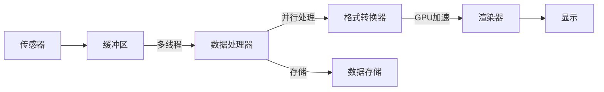

### 多线程光流处理

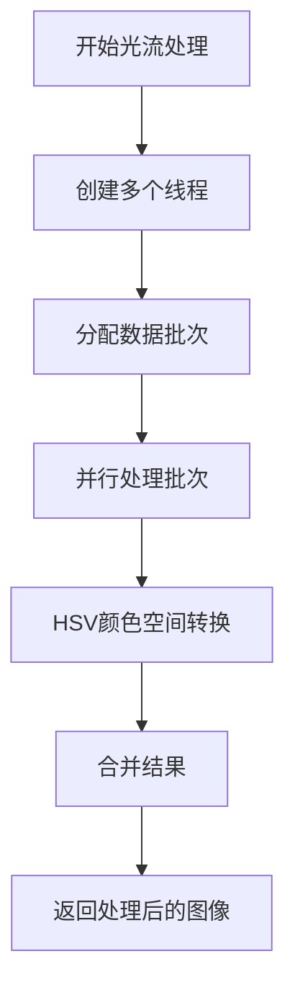

**图源**

- <a href="https://github.com/carla-simulator/carla/blob/ue5-dev/PythonAPI/carla/src/SensorData.cpp#L209-L297" target="_blank">SensorData.cpp</a>

**本节来源**

- <a href="https://github.com/carla-simulator/carla/blob/ue5-dev/PythonAPI/carla/src/SensorData.cpp#L209-L297" target="_blank">SensorData.cpp</a>
- [visualize_multiple_sensors.py](https://github.com/carla-simulator/carla/blob/ue5-dev/PythonAPI/examples/visualize_multiple_sensors.py)
