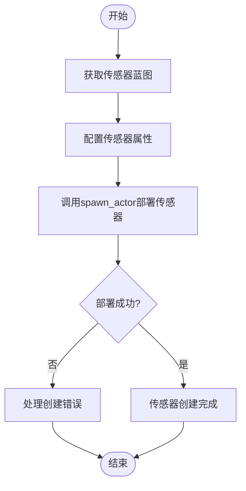
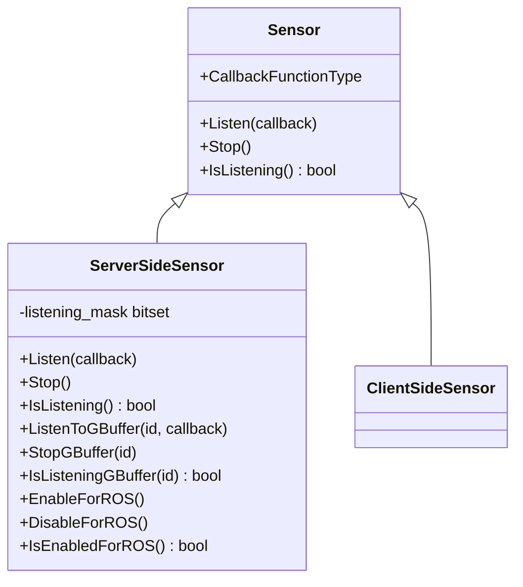
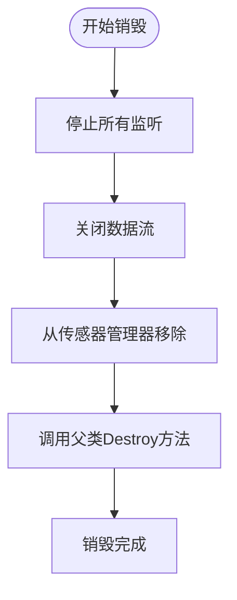
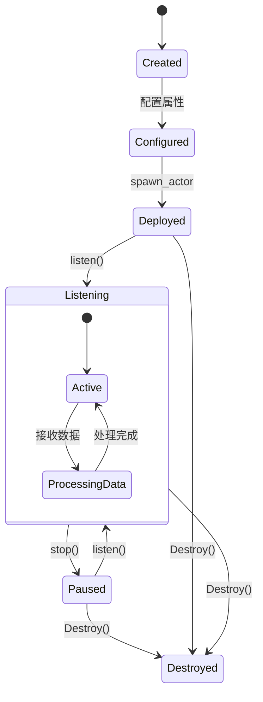
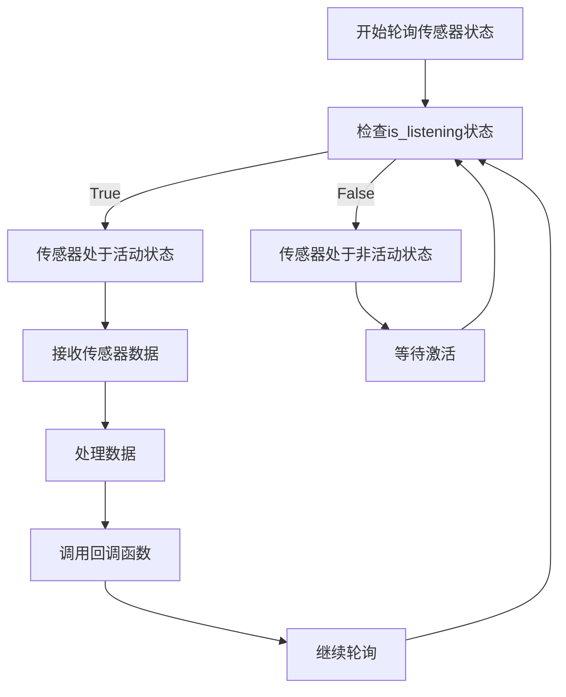

# 传感器管理


**本文档中引用的文件**   
- [Sensor.h](https://github.com/carla-simulator/carla/blob/ue5-dev/LibCarla/source/carla/client/Sensor.h)
- [ServerSideSensor.h](https://github.com/carla-simulator/carla/blob/ue5-dev/LibCarla/source/carla/client/ServerSideSensor.h)
- [ClientSideSensor.h](https://github.com/carla-simulator/carla/blob/ue5-dev/LibCarla/source/carla/client/ClientSideSensor.h)
- [Sensor.cpp](https://github.com/carla-simulator/carla/blob/ue5-dev/PythonAPI/carla/src/Sensor.cpp)
- [SensorData.cpp](https://github.com/carla-simulator/carla/blob/ue5-dev/PythonAPI/carla/src/SensorData.cpp)
- [core_sensors.md](https://github.com/carla-simulator/carla/blob/ue5-dev/Docs/core_sensors.md)
- [ref_sensors.md](https://github.com/carla-simulator/carla/blob/ue5-dev/Docs/ref_sensors.md)
- [bp_library.md](https://github.com/carla-simulator/carla/blob/ue5-dev/Docs/bp_library.md)
- [Sensor.cpp](https://github.com/carla-simulator/carla/blob/ue5-dev/Unreal/CarlaUnreal/Plugins/Carla/Source/Carla/Sensor/Sensor.cpp)
- [SensorFactory.cpp](https://github.com/carla-simulator/carla/blob/ue5-dev/Unreal/CarlaUnreal/Plugins/Carla/Source/Carla/Sensor/SensorFactory.cpp)
- [SensorManager.cpp](https://github.com/carla-simulator/carla/blob/ue5-dev/Unreal/CarlaUnreal/Plugins/Carla/Source/Carla/Sensor/SensorManager.cpp)
- [visualize_multiple_sensors.py](https://github.com/carla-simulator/carla/blob/ue5-dev/PythonAPI/examples/visualize_multiple_sensors.py)
- [sensor_synchronization.py](https://github.com/carla-simulator/carla/blob/ue5-dev/PythonAPI/examples/sensor_synchronization.py)


## 目录
1. [介绍](#介绍)
2. [传感器生命周期管理](#传感器生命周期管理)
3. [传感器蓝图配置](#传感器蓝图配置)
4. [传感器状态转换](#传感器状态转换)
5. [常见问题解决方案](#常见问题解决方案)
6. [传感器部署示例](#传感器部署示例)
7. [高级管理实践](#高级管理实践)
8. [结论](#结论)

## 介绍
CARLA中的传感器是能够从周围环境收集数据的特殊类型参与者（Actor）。它们在创建自动驾驶学习环境方面起着至关重要的作用。传感器系统允许用户通过各种传感器类型收集环境信息，包括摄像头、激光雷达、雷达、GPS和IMU等。本文档将深入探讨carla.Sensor类的生命周期管理，详细解释传感器的创建、配置、数据流管理和销毁过程。

**Section sources**
- [core_sensors.md](https://github.com/carla-simulator/carla/blob/ue5-dev/Docs/core_sensors.md#sensors-step-by-step)

## 传感器生命周期管理

### 传感器创建与部署
传感器的创建遵循CARLA中参与者的一般模式，通过`carla.World.spawn_actor`方法完成。首先需要从蓝图库中获取传感器的蓝图，然后设置其属性，最后在指定位置生成传感器。

传感器创建过程涉及三个核心组件：
1. **蓝图获取**：通过`world.get_blueprint_library().find()`方法获取特定类型的传感器蓝图
2. **属性配置**：使用`set_attribute()`方法配置传感器的特定参数
3. **部署**：通过`world.spawn_actor()`方法在指定变换位置生成传感器



**Diagram sources**
- [SensorFactory.cpp](https://github.com/carla-simulator/carla/blob/ue5-dev/Unreal/CarlaUnreal/Plugins/Carla/Source/Carla/Sensor/SensorFactory.cpp#L103-L160)
- [core_sensors.md](https://github.com/carla-simulator/carla/blob/ue5-dev/Docs/core_sensors.md#spawning)

### 传感器配置参数
传感器蓝图包含多种可配置属性，这些属性决定了传感器的行为和输出特性。主要配置参数包括：

| 传感器属性 | 类型 | 默认值 | 描述 |
|---------|------|-------|------|
| `fov` | float | 90.0 | 水平视场角（度） |
| `image_size_x` | int | 800 | 图像宽度（像素） |
| `image_size_y` | int | 600 | 图像高度（像素） |
| `sensor_tick` | float | 0.0 | 传感器采集间隔（模拟秒） |
| `fstop` | float | 1.4 | 相机镜头光圈值 |
| `iso` | float | 100.0 | 相机传感器灵敏度 |
| `gamma` | float | 2.2 | 相机目标伽马值 |
| `lens_flare_intensity` | float | 0.1 | 镜头光晕后处理效果强度 |
| `bloom_intensity` | float | 0.675 | 泛光后处理效果强度 |

**Section sources**
- [bp_library.md](https://github.com/carla-simulator/carla/blob/ue5-dev/Docs/bp_library.md#sensorcamera)
- [ref_sensors.md](https://github.com/carla-simulator/carla/blob/ue5-dev/Docs/ref_sensors.md#rgb-camera)

### 数据流管理
传感器通过`listen()`方法启动数据流，通过`stop()`方法停止数据流。数据流管理是传感器生命周期的核心部分，决定了何时开始和停止接收传感器数据。

```python
# 注册数据回调函数
sensor.listen(lambda data: process_sensor_data(data))

# 检查传感器是否正在监听
if sensor.is_listening:
    print("传感器正在接收数据")

# 停止数据流
sensor.stop()
```

在底层实现中，`ServerSideSensor`类使用位掩码（bitset）来跟踪多个数据流的状态，包括主数据流和GBuffer数据流。



**Diagram sources**
- [Sensor.h](https://github.com/carla-simulator/carla/blob/ue5-dev/LibCarla/source/carla/client/Sensor.h#L17-L37)
- [ServerSideSensor.h](https://github.com/carla-simulator/carla/blob/ue5-dev/LibCarla/source/carla/client/ServerSideSensor.h#L15-L71)
- [Sensor.cpp](https://github.com/carla-simulator/carla/blob/ue5-dev/PythonAPI/carla/src/Sensor.cpp#L24-L46)

### 传感器销毁
传感器的销毁通过`Destroy()`方法完成。在销毁过程中，系统会自动停止所有数据流并清理相关资源。对于`ServerSideSensor`，销毁操作还会停止所有GBuffer数据流。



**Diagram sources**
- [ServerSideSensor.cpp](https://github.com/carla-simulator/carla/blob/ue5-dev/LibCarla/source/carla/client/ServerSideSensor.cpp#L100-L110)
- [Sensor.cpp](https://github.com/carla-simulator/carla/blob/ue5-dev/Unreal/CarlaUnreal/Plugins/Carla/Source/Carla/Sensor/Sensor.cpp#L113-L129)

## 传感器蓝图配置

### 传感器类型与属性
CARLA提供了多种传感器类型，每种类型都有其特定的可配置属性。主要传感器类型包括：

#### 摄像头传感器
- **RGB摄像头** (`sensor.camera.rgb`): 提供场景的彩色图像
- **深度摄像头** (`sensor.camera.depth`): 渲染视场内元素的深度
- **语义分割摄像头** (`sensor.camera.semantic_segmentation`): 根据标签渲染元素
- **光流摄像头** (`sensor.camera.optical_flow`): 渲染像素运动
- **DVS摄像头** (`sensor.camera.dvs`): 异步测量亮度变化

#### 检测器传感器
- **碰撞检测器** (`sensor.other.collision`): 检测父级与其他参与者的碰撞
- **车道入侵检测器** (`sensor.other.lane_invasion`): 检测父级是否跨越车道线
- **障碍物检测器** (`sensor.other.obstacle`): 检测前方可能的障碍物

#### 其他传感器
- **GNSS传感器** (`sensor.other.gnss`): 获取传感器的地理位置
- **IMU传感器** (`sensor.other.imu`): 提供加速度计、陀螺仪和指南针数据
- **激光雷达** (`sensor.lidar.ray_cast`): 生成4D点云
- **语义激光雷达** (`sensor.lidar.ray_cast_semantic`): 生成带语义信息的3D点云
- **雷达** (`sensor.other.radar`): 生成2D点图

### 附件类型配置
传感器通常需要附加到父级参与者（如车辆）上，其位置更新方式由附件类型决定：

- **刚性附件** (`Rigid`): 相对于父级位置严格移动，适用于获取模拟数据
- **弹簧臂附件** (`SpringArm`): 移动时带有轻微加速度和减速度，适用于录制平滑视频
- **幽灵弹簧臂附件** (`SpringArmGhost`): 类似弹簧臂但不进行碰撞检测

```python
# 配置传感器附件
transform = carla.Transform(carla.Location(x=0.8, z=1.7))
sensor = world.spawn_actor(blueprint, transform, attach_to=my_vehicle, attachment_type=carla.AttachmentType.Rigid)
```

**Section sources**
- [core_sensors.md](https://github.com/carla-simulator/carla/blob/ue5-dev/Docs/core_sensors.md#spawning)
- [bp_library.md](https://github.com/carla-simulator/carla/blob/ue5-dev/Docs/bp_library.md#sensorother)

## 传感器状态转换

### 状态转换图
传感器在其生命周期中经历多个状态转换，从创建到销毁的完整状态转换过程如下：



**Diagram sources**
- [Sensor.h](https://github.com/carla-simulator/carla/blob/ue5-dev/LibCarla/source/carla/client/Sensor.h#L26-L29)
- [Sensor.cpp](https://github.com/carla-simulator/carla/blob/ue5-dev/Unreal/CarlaUnreal/Plugins/Carla/Source/Carla/Sensor/Sensor.cpp#L63-L85)

### 数据流状态管理
传感器的数据流状态由`is_listening`属性管理。当传感器处于监听状态时，它会持续接收数据并调用注册的回调函数。



**Diagram sources**
- [Sensor.cpp](https://github.com/carla-simulator/carla/blob/ue5-dev/PythonAPI/carla/src/Sensor.cpp#L26-L28)
- [Sensor.cpp](https://github.com/carla-simulator/carla/blob/ue5-dev/Unreal/CarlaUnreal/Plugins/Carla/Source/Carla/Sensor/Sensor.cpp#L66-L83)

## 常见问题解决方案

### 传感器重叠问题
当多个传感器在同一位置或角度重叠时，可能会导致性能下降或数据冲突。解决方案包括：

1. **空间分离**：确保传感器在物理空间上适当分离
2. **时间交错**：使用不同的`sensor_tick`值错开数据采集时间
3. **资源限制**：监控系统资源使用情况，避免过度配置

### 数据流中断问题
数据流中断可能由网络延迟、系统负载过高或回调函数执行时间过长引起。解决方案包括：

1. **异步处理**：在回调函数中使用队列将数据处理移到单独的线程
2. **超时设置**：为数据接收设置合理的超时时间
3. **错误重试**：实现重试机制处理临时性中断

```python
# 使用队列实现异步数据处理
from queue import Queue
sensor_queue = Queue()

def sensor_callback(data):
    sensor_queue.put(data)

# 在主循环中处理数据
while True:
    try:
        data = sensor_queue.get(timeout=1.0)
        process_data(data)
    except Queue.Empty:
        continue
```

### 资源释放异常
传感器销毁时可能出现资源释放异常，导致内存泄漏或连接未关闭。预防措施包括：

1. **确保调用Destroy**：在脚本结束时确保所有传感器都被正确销毁
2. **使用上下文管理器**：实现上下文管理器确保资源正确释放
3. **异常处理**：在销毁过程中添加适当的异常处理

```python
# 批量销毁传感器
for sensor in sensor_list:
    sensor.destroy()
```

**Section sources**
- [visualize_multiple_sensors.py](https://github.com/carla-simulator/carla/blob/ue5-dev/PythonAPI/examples/visualize_multiple_sensors.py#L316-L320)
- [sensor_synchronization.py](https://github.com/carla-simulator/carla/blob/ue5-dev/PythonAPI/examples/sensor_synchronization.py#L114-L117)

## 传感器部署示例

### 基础部署示例
以下是一个基础的传感器部署示例，展示如何创建和配置一个RGB摄像头：

```python
# 1. 获取蓝图库
blueprint_library = world.get_blueprint_library()

# 2. 获取传感器蓝图
camera_bp = blueprint_library.find('sensor.camera.rgb')

# 3. 配置传感器属性
camera_bp.set_attribute('image_size_x', '1920')
camera_bp.set_attribute('image_size_y', '1080')
camera_bp.set_attribute('fov', '110')
camera_bp.set_attribute('sensor_tick', '1.0')

# 4. 设置传感器位置
transform = carla.Transform(carla.Location(x=1.5, z=2.4))

# 5. 部署传感器
sensor = world.spawn_actor(camera_bp, transform, attach_to=vehicle)

# 6. 注册数据回调
sensor.listen(lambda data: process_image(data))
```

### 同步传感器数据
在同步模式下，可以确保多个传感器的数据在相同的时间步长采集：

```python
# 设置同步模式
settings = world.get_settings()
settings.synchronous_mode = True
settings.fixed_delta_seconds = 0.05
world.apply_settings(settings)

# 创建传感器队列
sensor_queue = Queue()

# 传感器回调函数
def sensor_callback(data, sensor_queue, sensor_name):
    sensor_queue.put((data.frame, sensor_name))

# 部署多个传感器
cam = world.spawn_actor(cam_bp, transform)
cam.listen(lambda data: sensor_callback(data, sensor_queue, "camera"))

lidar = world.spawn_actor(lidar_bp, transform)
lidar.listen(lambda data: sensor_callback(data, sensor_queue, "lidar"))

# 主循环
while True:
    world.tick()
    # 等待所有传感器数据
    for _ in range(2):  # 两个传感器
        try:
            frame = sensor_queue.get(timeout=1.0)
            print(f"接收到数据: {frame}")
        except Empty:
            print("数据接收超时")
```

**Section sources**
- [visualize_multiple_sensors.py](https://github.com/carla-simulator/carla/blob/ue5-dev/PythonAPI/examples/visualize_multiple_sensors.py#L279-L293)
- [sensor_synchronization.py](https://github.com/carla-simulator/carla/blob/ue5-dev/PythonAPI/examples/sensor_synchronization.py#L62-L92)

## 高级管理实践

### 批量传感器管理
对于需要部署大量传感器的场景，建议使用批量管理策略：

```python
class SensorManager:
    def __init__(self, world):
        self.world = world
        self.sensors = []
    
    def add_sensor(self, blueprint, transform, attach_to=None):
        sensor = self.world.spawn_actor(blueprint, transform, attach_to=attach_to)
        self.sensors.append(sensor)
        return sensor
    
    def start_all(self):
        for sensor in self.sensors:
            sensor.listen(self.default_callback)
    
    def stop_all(self):
        for sensor in self.sensors:
            sensor.stop()
    
    def destroy_all(self):
        for sensor in self.sensors:
            sensor.destroy()
        self.sensors.clear()
```

### 动态传感器重构
在运行时动态重构传感器配置：

```python
def reconfigure_sensor(sensor, new_attributes):
    """动态重新配置传感器属性"""
    # 停止当前数据流
    sensor.stop()
    
    # 获取当前蓝图并修改属性
    actor_id = sensor.type_id
    blueprint = world.get_blueprint_library().find(actor_id)
    for key, value in new_attributes.items():
        blueprint.set_attribute(key, str(value))
    
    # 销毁当前传感器
    sensor.destroy()
    
    # 使用新配置重新创建
    new_sensor = world.spawn_actor(blueprint, sensor.get_transform(), 
                                   attach_to=sensor.parent)
    return new_sensor
```

### ROS2集成
对于需要与ROS2集成的场景，可以启用传感器的ROS2发布功能：

```python
# 启用ROS2发布
sensor.enable_for_ros()

# 检查ROS2状态
if sensor.is_enabled_for_ros():
    print("传感器已启用ROS2发布")

# 禁用ROS2发布
sensor.disable_for_ros()
```

**Section sources**
- [Sensor.cpp](https://github.com/carla-simulator/carla/blob/ue5-dev/PythonAPI/carla/src/Sensor.cpp#L37-L39)
- [ServerSideSensor.h](https://github.com/carla-simulator/carla/blob/ue5-dev/LibCarla/source/carla/client/ServerSideSensor.h#L50-L57)

## 结论
CARLA的传感器管理系统提供了强大而灵活的接口，用于创建、配置和管理各种类型的传感器。通过理解传感器的生命周期、正确配置传感器蓝图属性、管理数据流状态以及处理常见问题，用户可以有效地利用CARLA进行自动驾驶研究和开发。高级管理实践如批量管理和动态重构进一步增强了系统的灵活性和可扩展性，满足复杂场景的需求。