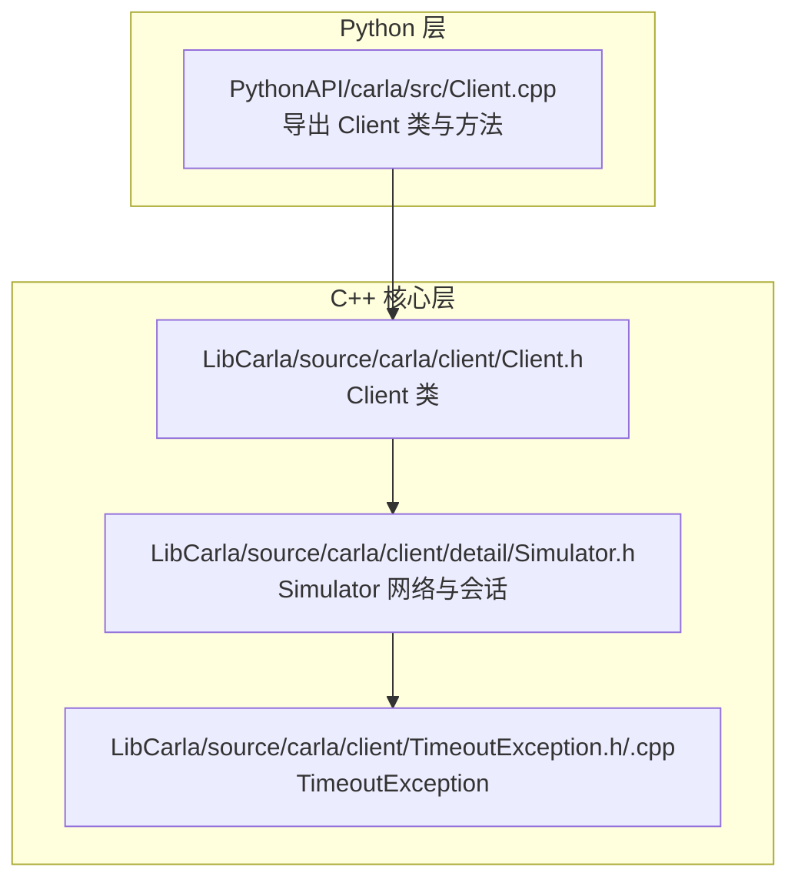
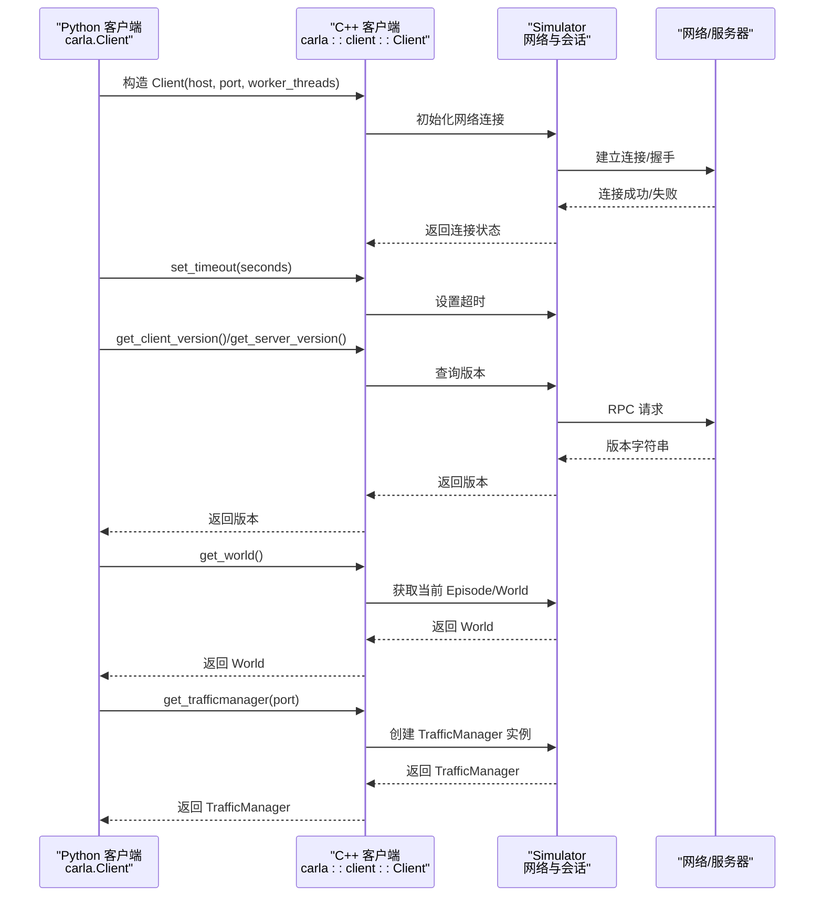
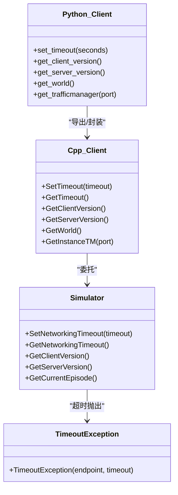

# 客户端连接

**本文引用的文件列表**
- [Client.h](https://github.com/carla-simulator/carla/blob/ue5-dev/LibCarla/source/carla/client/Client.h)
- [Client.cpp](https://github.com/carla-simulator/carla/blob/ue5-dev/PythonAPI/carla/src/Client.cpp)
- [TimeoutException.h](https://github.com/carla-simulator/carla/blob/ue5-dev/LibCarla/source/carla/client/TimeoutException.h)
- [TimeoutException.cpp](https://github.com/carla-simulator/carla/blob/ue5-dev/LibCarla/source/carla/client/TimeoutException.cpp)
- [Simulator.h](https://github.com/carla-simulator/carla/blob/ue5-dev/LibCarla/source/carla/client/detail/Simulator.h)
- [manual_control.py](https://github.com/carla-simulator/carla/blob/ue5-dev/PythonAPI/examples/manual_control.py)
- [test_connection.py](https://github.com/carla-simulator/carla/blob/ue5-dev/PythonAPI/test/test_connection.py)
- [snipets/carla.Client.__init__.py](https://github.com/carla-simulator/carla/blob/ue5-dev/PythonAPI/docs/snipets/carla.Client.__init__.py)

## 目录
1. [简介](#简介)
2. [项目结构](#项目结构)
3. [核心组件](#核心组件)
4. [架构总览](#架构总览)
5. [详细组件分析](#详细组件分析)
6. [依赖关系分析](#依赖关系分析)
7. [性能考量](#性能考量)
8. [故障排查指南](#故障排查指南)
9. [结论](#结论)
10. [附录](#附录)

## 简介
本文件围绕 CARLA 的 Python 客户端 carla.Client 类展开，系统性地说明其构造参数（主机地址、端口、worker_threads）、关键方法（get_world、get_trafficmanager、get_server_version、get_client_version）、网络超时与异常处理（TimeoutException），并结合官方示例展示连接流程与最佳实践。文档同时给出初学者连接本地服务器的入门步骤与高级用户连接远程服务器的安全与性能优化建议。

## 项目结构
- Python 客户端导出层位于 PythonAPI/carla/src/Client.cpp，将 LibCarla 的 C++ 客户端能力暴露给 Python API，并定义了 Python 层的 Client 类及其方法。
- LibCarla 的 C++ 客户端核心在 LibCarla/source/carla/client/Client.h，负责网络连接、超时控制、版本查询、世界加载等。
- 超时异常类型在 LibCarla/source/carla/client/TimeoutException.h/.cpp 中定义，用于在网络操作超时时抛出。
- 连接示例与测试脚本位于 PythonAPI/examples 与 PythonAPI/test。

图表来源
- [Client.cpp](https://github.com/carla-simulator/carla/blob/ue5-dev/PythonAPI/carla/src/Client.cpp#L172-L219)
- [Client.h](https://github.com/carla-simulator/carla/blob/ue5-dev/LibCarla/source/carla/client/Client.h#L20-L190)
- [Simulator.h](https://github.com/carla-simulator/carla/blob/ue5-dev/LibCarla/source/carla/client/detail/Simulator.h#L60-L80)
- [TimeoutException.h](https://github.com/carla-simulator/carla/blob/ue5-dev/LibCarla/source/carla/client/TimeoutException.h#L17-L23)
- [TimeoutException.cpp](https://github.com/carla-simulator/carla/blob/ue5-dev/LibCarla/source/carla/client/TimeoutException.cpp#L14-L20)

章节来源
- [Client.cpp](https://github.com/carla-simulator/carla/blob/ue5-dev/PythonAPI/carla/src/Client.cpp#L172-L219)
- [Client.h](https://github.com/carla-simulator/carla/blob/ue5-dev/LibCarla/source/carla/client/Client.h#L20-L190)
- [Simulator.h](https://github.com/carla-simulator/carla/blob/ue5-dev/LibCarla/source/carla/client/detail/Simulator.h#L60-L80)
- [TimeoutException.h](https://github.com/carla-simulator/carla/blob/ue5-dev/LibCarla/source/carla/client/TimeoutException.h#L17-L23)
- [TimeoutException.cpp](https://github.com/carla-simulator/carla/blob/ue5-dev/LibCarla/source/carla/client/TimeoutException.cpp#L14-L20)

## 核心组件
- carla.Client（Python 层）
  - 构造函数：接收 host、port、worker_threads 三个参数；默认值与行为由 Python 导出层定义。
  - 关键方法：
    - set_timeout(seconds)：设置网络请求超时时间（秒）。
    - get_client_version()：查询 Python 客户端 API 版本。
    - get_server_version()：查询 CARLA 服务器版本。
    - get_world()：返回当前仿真世界实例。
    - get_trafficmanager(port=8000)：返回 TrafficManager 实例。
- LibCarla::client::Client（C++ 层）
  - 提供 SetTimeout、GetTimeout、GetClientVersion、GetServerVersion、GetWorld、GetInstanceTM 等方法。
  - 内部通过 detail::Simulator 管理网络连接与会话。
- TimeoutException
  - 当网络请求超过设定超时，抛出运行时异常，包含端点与超时信息。

章节来源
- [Client.cpp](https://github.com/carla-simulator/carla/blob/ue5-dev/PythonAPI/carla/src/Client.cpp#L188-L219)
- [Client.h](https://github.com/carla-simulator/carla/blob/ue5-dev/LibCarla/source/carla/client/Client.h#L23-L114)
- [Simulator.h](https://github.com/carla-simulator/carla/blob/ue5-dev/LibCarla/source/carla/client/detail/Simulator.h#L170-L184)
- [TimeoutException.h](https://github.com/carla-simulator/carla/blob/ue5-dev/LibCarla/source/carla/client/TimeoutException.h#L17-L23)
- [TimeoutException.cpp](https://github.com/carla-simulator/carla/blob/ue5-dev/LibCarla/source/carla/client/TimeoutException.cpp#L14-L20)

## 架构总览
下图展示了从 Python 客户端到 C++ 客户端再到网络层的整体调用链与职责划分。

图表来源
- [Client.cpp](https://github.com/carla-simulator/carla/blob/ue5-dev/PythonAPI/carla/src/Client.cpp#L188-L219)
- [Client.h](https://github.com/carla-simulator/carla/blob/ue5-dev/LibCarla/source/carla/client/Client.h#L23-L114)
- [Simulator.h](https://github.com/carla-simulator/carla/blob/ue5-dev/LibCarla/source/carla/client/detail/Simulator.h#L170-L184)

## 详细组件分析

### 构造参数与初始化
- 参数说明
  - host：CARLA 服务器的 IP 地址或主机名，默认通常为本地回环地址。
  - port：CARLA 服务器监听的 TCP 端口，默认常见端口为 2000。
  - worker_threads：异步工作线程数；0 表示使用全部可用硬件并发。
- Python 导出层默认值
  - Python 层导出的 Client 构造函数提供了默认参数 host、port、worker_threads 的默认值，便于快速上手。
- C++ 层初始化
  - C++ 层 Client 将 host、port、worker_threads 传递给 detail::Simulator，完成底层网络初始化。

章节来源
- [Client.cpp](https://github.com/carla-simulator/carla/blob/ue5-dev/PythonAPI/carla/src/Client.cpp#L188-L190)
- [Client.h](https://github.com/carla-simulator/carla/blob/ue5-dev/LibCarla/source/carla/client/Client.h#L23-L32)
- [Simulator.h](https://github.com/carla-simulator/carla/blob/ue5-dev/LibCarla/source/carla/client/detail/Simulator.h#L60-L64)

### get_world 方法
- 功能：返回当前仿真世界实例（World），可用于获取地图、蓝图库、演员管理等。
- 实现路径：C++ 层通过 GetCurrentEpisode 包装为 World；Python 层直接暴露该方法。

章节来源
- [Client.h](https://github.com/carla-simulator/carla/blob/ue5-dev/LibCarla/source/carla/client/Client.h#L105-L109)
- [Client.cpp](https://github.com/carla-simulator/carla/blob/ue5-dev/PythonAPI/carla/src/Client.cpp#L193-L193)

### get_trafficmanager 方法
- 功能：返回 TrafficManager 实例，用于车辆自动驾驶与交通流控制。
- 默认端口：8000（可通过可选参数 port 指定）。
- 实现路径：C++ 层通过 GetInstanceTM(port) 创建 TrafficManager；Python 层导出该方法。

章节来源
- [Client.h](https://github.com/carla-simulator/carla/blob/ue5-dev/LibCarla/source/carla/client/Client.h#L111-L114)
- [Client.cpp](https://github.com/carla-simulator/carla/blob/ue5-dev/PythonAPI/carla/src/Client.cpp#L216-L216)

### 版本检查：get_client_version 与 get_server_version
- get_client_version：返回 Python 客户端 API 版本字符串。
- get_server_version：返回 CARLA 服务器版本字符串。
- 使用场景：确保客户端与服务器版本兼容，避免因版本不匹配导致的功能异常。

章节来源
- [Client.h](https://github.com/carla-simulator/carla/blob/ue5-dev/LibCarla/source/carla/client/Client.h#L44-L52)
- [Client.cpp](https://github.com/carla-simulator/carla/blob/ue5-dev/PythonAPI/carla/src/Client.cpp#L191-L192)
- [Simulator.h](https://github.com/carla-simulator/carla/blob/ue5-dev/LibCarla/source/carla/client/detail/Simulator.h#L178-L184)

### 超时设置与异常处理
- set_timeout(seconds)：设置网络请求超时时间（秒）。超时后可能触发 TimeoutException。
- TimeoutException：当网络等待超过设定阈值时抛出，异常消息包含端点与超时毫秒数，便于定位问题。
- 典型用法：在连接阶段设置短超时进行探测，在后续操作中根据任务复杂度调整超时。

章节来源
- [Client.cpp](https://github.com/carla-simulator/carla/blob/ue5-dev/PythonAPI/carla/src/Client.cpp#L15-L17)
- [Client.h](https://github.com/carla-simulator/carla/blob/ue5-dev/LibCarla/source/carla/client/Client.h#L34-L41)
- [Simulator.h](https://github.com/carla-simulator/carla/blob/ue5-dev/LibCarla/source/carla/client/detail/Simulator.h#L170-L176)
- [TimeoutException.h](https://github.com/carla-simulator/carla/blob/ue5-dev/LibCarla/source/carla/client/TimeoutException.h#L17-L23)
- [TimeoutException.cpp](https://github.com/carla-simulator/carla/blob/ue5-dev/LibCarla/source/carla/client/TimeoutException.cpp#L14-L20)

### 连接重试机制与最佳实践
- 基本重试策略
  - 在连接前先以极短超时（例如 0.1 秒）尝试探测，循环直到超时或连接成功。
  - 成功后可将超时提升到更合理的值，避免频繁超时。
- 异常处理
  - 捕获 RuntimeError 或 TimeoutException，记录错误并提示用户检查服务器状态与网络连通性。
- 示例参考
  - 测试脚本展示了“短超时探测 + 循环重试”的模式，适合在启动阶段保证连接稳定。

章节来源
- [test_connection.py](https://github.com/carla-simulator/carla/blob/ue5-dev/PythonAPI/test/test_connection.py#L34-L46)
- [TimeoutException.cpp](https://github.com/carla-simulator/carla/blob/ue5-dev/LibCarla/source/carla/client/TimeoutException.cpp#L14-L20)

### 来自 manual_control.py 的实际连接示例
- 示例要点
  - 使用 carla.Client(args.host, args.port) 建立连接。
  - set_timeout(2000.0) 设置较长超时，适配手动控制场景的交互延迟。
  - get_world() 获取 World 后进行后续操作。
- 适用场景：交互式手动控制演示，强调连接稳定性与超时设置的重要性。

章节来源
- [manual_control.py](https://github.com/carla-simulator/carla/blob/ue5-dev/PythonAPI/examples/manual_control.py#L1269-L1269)
- [snipets/carla.Client.__init__.py](https://github.com/carla-simulator/carla/blob/ue5-dev/PythonAPI/docs/snipets/carla.Client.__init__.py#L28-L30)

## 依赖关系分析

图表来源
- [Client.cpp](https://github.com/carla-simulator/carla/blob/ue5-dev/PythonAPI/carla/src/Client.cpp#L188-L219)
- [Client.h](https://github.com/carla-simulator/carla/blob/ue5-dev/LibCarla/source/carla/client/Client.h#L23-L114)
- [Simulator.h](https://github.com/carla-simulator/carla/blob/ue5-dev/LibCarla/source/carla/client/detail/Simulator.h#L170-L184)
- [TimeoutException.h](https://github.com/carla-simulator/carla/blob/ue5-dev/LibCarla/source/carla/client/TimeoutException.h#L17-L23)

章节来源
- [Client.cpp](https://github.com/carla-simulator/carla/blob/ue5-dev/PythonAPI/carla/src/Client.cpp#L188-L219)
- [Client.h](https://github.com/carla-simulator/carla/blob/ue5-dev/LibCarla/source/carla/client/Client.h#L23-L114)
- [Simulator.h](https://github.com/carla-simulator/carla/blob/ue5-dev/LibCarla/source/carla/client/detail/Simulator.h#L170-L184)
- [TimeoutException.h](https://github.com/carla-simulator/carla/blob/ue5-dev/LibCarla/source/carla/client/TimeoutException.h#L17-L23)

## 性能考量
- worker_threads 参数
  - 0 表示使用全部可用硬件并发，适合多线程并行任务；若任务量较小，适当减少可降低上下文切换开销。
- 超时设置
  - 短超时用于探测与快速失败，长超时用于复杂批处理或录制回放。
- 连接稳定性
  - 在高延迟或不稳定网络环境下，建议分阶段设置超时（先短后长），并配合重试逻辑。

[本节为通用指导，无需列出具体文件来源]

## 故障排查指南
- 常见问题
  - 连接超时：检查 host/port 是否正确、服务器是否启动、防火墙/安全组是否放行端口。
  - 版本不匹配：使用 get_client_version 与 get_server_version 对比，必要时升级客户端或服务器。
  - TimeoutException：查看异常消息中的端点与超时毫秒数，确认网络状况与服务器负载。
- 排查步骤
  - 使用短超时循环探测连接，确认服务器可达。
  - 在连接成功后逐步增大超时，观察是否仍有超时发生。
  - 记录 get_client_version 与 get_server_version，确保版本兼容。

章节来源
- [test_connection.py](https://github.com/carla-simulator/carla/blob/ue5-dev/PythonAPI/test/test_connection.py#L34-L46)
- [TimeoutException.cpp](https://github.com/carla-simulator/carla/blob/ue5-dev/LibCarla/source/carla/client/TimeoutException.cpp#L14-L20)
- [Simulator.h](https://github.com/carla-simulator/carla/blob/ue5-dev/LibCarla/source/carla/client/detail/Simulator.h#L170-L184)

## 结论
carla.Client 作为 Python 侧的统一入口，将底层 C++ 客户端的能力完整暴露，涵盖连接、超时、版本查询与世界管理等核心功能。通过合理设置 worker_threads 与超时、配合重试与异常处理，可在本地与远程环境中获得稳定可靠的连接体验。建议初学者从默认参数入手，逐步学习超时与版本检查；高级用户则应结合业务场景调优线程与超时参数，并在生产环境实施严格的版本与网络监控。

[本节为总结性内容，无需列出具体文件来源]

## 附录

### 初学者：连接本地服务器（步骤建议）
- 使用默认 host 与 port（通常为 127.0.0.1 与 2000）。
- 设置较短超时进行探测，确认服务器已就绪。
- 成功后设置更合适的超时，开始获取 World 并执行后续操作。

章节来源
- [snipets/carla.Client.__init__.py](https://github.com/carla-simulator/carla/blob/ue5-dev/PythonAPI/docs/snipets/carla.Client.__init__.py#L28-L30)
- [test_connection.py](https://github.com/carla-simulator/carla/blob/ue5-dev/PythonAPI/test/test_connection.py#L34-L46)

### 高级用户：连接远程服务器的安全与性能建议
- 安全配置
  - 仅在可信网络内访问服务器，必要时通过 VPN 或专用网络。
  - 限制服务器监听范围，避免对外网开放。
- 性能调优
  - 根据任务复杂度调整 worker_threads 与超时，平衡吞吐与延迟。
  - 对批处理操作（如 apply_batch_sync）设置足够长的超时，避免中途中断。
  - 使用 get_server_version 与 get_client_version 做版本一致性校验，避免兼容性问题。

章节来源
- [Client.cpp](https://github.com/carla-simulator/carla/blob/ue5-dev/PythonAPI/carla/src/Client.cpp#L188-L219)
- [Client.h](https://github.com/carla-simulator/carla/blob/ue5-dev/LibCarla/source/carla/client/Client.h#L23-L114)
- [Simulator.h](https://github.com/carla-simulator/carla/blob/ue5-dev/LibCarla/source/carla/client/detail/Simulator.h#L170-L184)