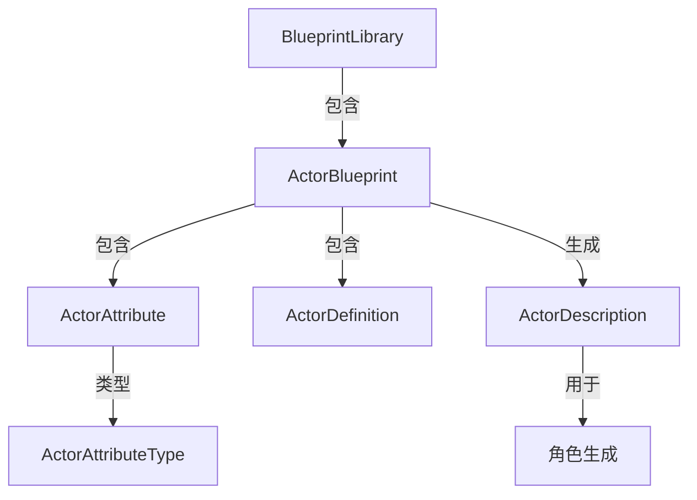
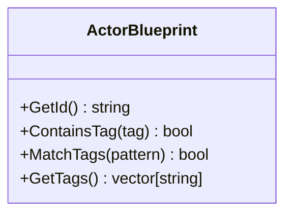
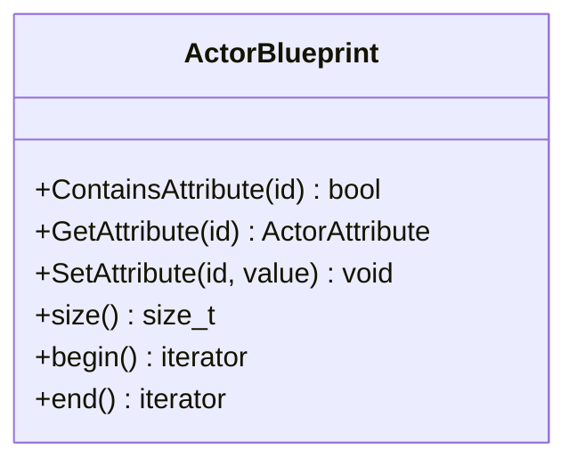
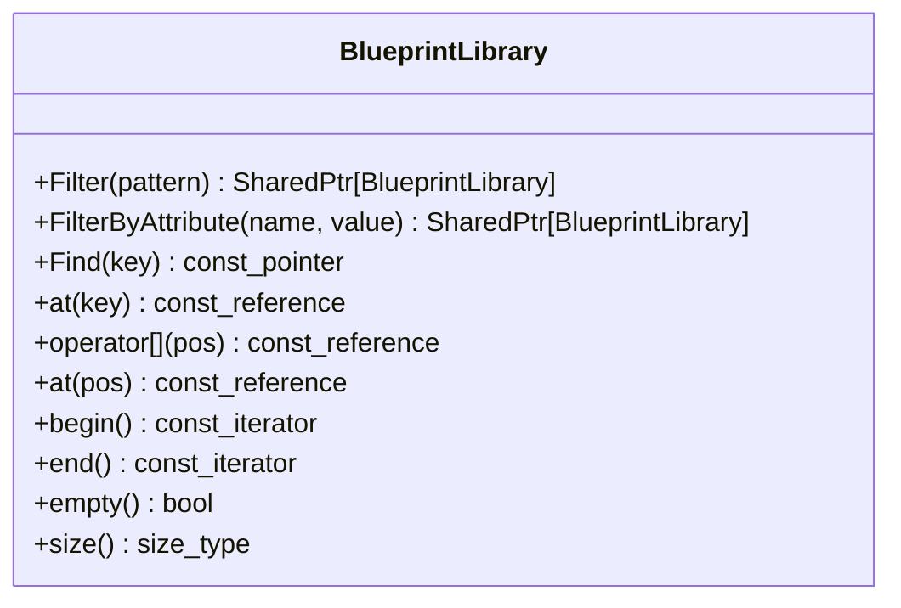
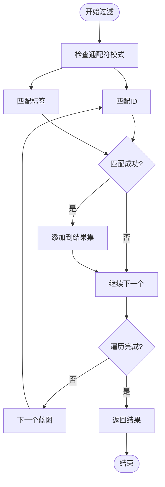
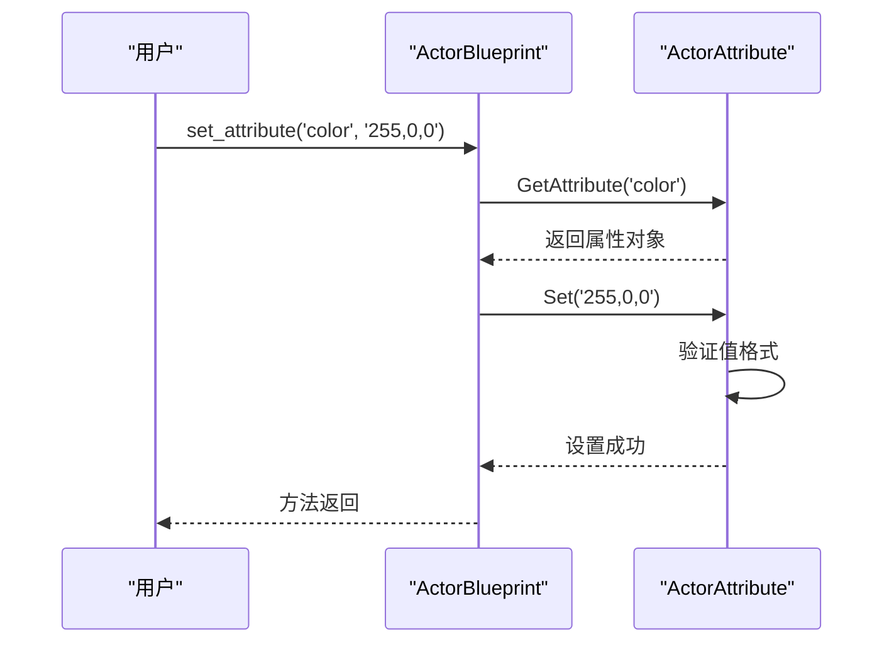
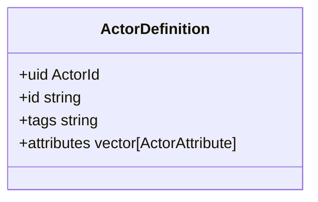
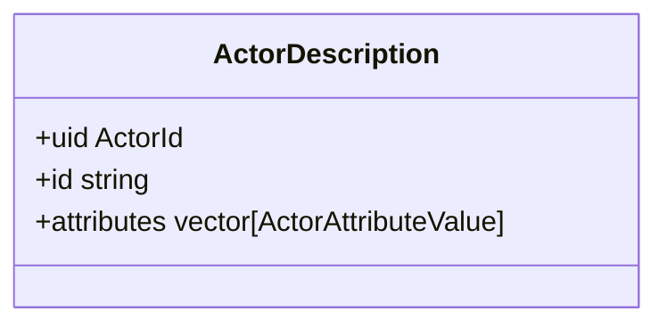
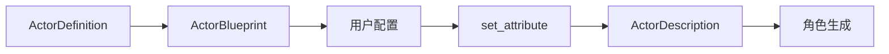

# 蓝图系统

> **引用文件**
> **本文档中引用的文件**

- [ActorBlueprint.h](https://github.com/carla-simulator/carla/blob/ue5-dev/LibCarla/source/carla/client/ActorBlueprint.h)
- [ActorBlueprint.cpp](https://github.com/carla-simulator/carla/blob/ue5-dev/LibCarla/source/carla/client/ActorBlueprint.cpp)
- [BlueprintLibrary.h](https://github.com/carla-simulator/carla/blob/ue5-dev/LibCarla/source/carla/client/BlueprintLibrary.h)
- [BlueprintLibrary.cpp](https://github.com/carla-simulator/carla/blob/ue5-dev/LibCarla/source/carla/client/BlueprintLibrary.cpp)
- [ActorAttribute.h](https://github.com/carla-simulator/carla/blob/ue5-dev/LibCarla/source/carla/client/ActorAttribute.h)
- [ActorAttribute.cpp](https://github.com/carla-simulator/carla/blob/ue5-dev/LibCarla/source/carla/client/ActorAttribute.cpp)
- [ActorDefinition.h](https://github.com/carla-simulator/carla/blob/ue5-dev/LibCarla/source/carla/rpc/ActorDefinition.h)
- [ActorDescription.h](https://github.com/carla-simulator/carla/blob/ue5-dev/LibCarla/source/carla/rpc/ActorDescription.h)
- [blueprint.yml](https://github.com/carla-simulator/carla/blob/ue5-dev/PythonAPI/docs/blueprint.yml)
- [bp_library.md](https://github.com/carla-simulator/carla/blob/ue5-dev/Docs/bp_library.md)
- [carla.ActorBlueprint.set_attribute.py](https://github.com/carla-simulator/carla/blob/ue5-dev/PythonAPI/docs/snipets/carla.ActorBlueprint.set_attribute.py)

## 目录

1. [简介](#简介)
2. [蓝图系统架构](#蓝图系统架构)
3. [核心组件分析](#核心组件分析)
4. [ActorBlueprint 类详解](#actorblueprint类详解)
5. [BlueprintLibrary 类详解](#blueprintlibrary类详解)
6. [属性系统](#属性系统)
7. [ActorDescription 与 ActorDefinition](#actordescription与actordefinition)
8. [使用示例](#使用示例)
9. [高级用法](#高级用法)
10. [结论](#结论)

## 简介

CARLA 仿真平台提供了一套完整的蓝图系统，用于管理和生成各种类型的仿真角色（Actor）。该系统通过`carla.ActorBlueprint`类为核心，实现了角色的定义、配置和实例化。蓝图系统允许用户根据特定 ID 查找角色模板，并通过设置属性来定制角色特征，如颜色、轮子数量等。本文档详细说明了蓝图系统的工作原理、核心组件及其使用方法，为初学者和高级用户提供全面的指导。

## 蓝图系统架构

CARLA 的蓝图系统由多个核心组件构成，形成了一个完整的角色生成和管理框架。系统架构主要包括`ActorBlueprint`、`BlueprintLibrary`、`ActorAttribute`、`ActorDescription`和`ActorDefinition`等关键类。这些组件协同工作，实现了从蓝图定义到角色实例化的完整流程。



**Diagram sources**

- [ActorBlueprint.h](https://github.com/carla-simulator/carla/blob/ue5-dev/LibCarla/source/carla/client/ActorBlueprint.h)
- [BlueprintLibrary.h](https://github.com/carla-simulator/carla/blob/ue5-dev/LibCarla/source/carla/client/BlueprintLibrary.h)
- [ActorAttribute.h](https://github.com/carla-simulator/carla/blob/ue5-dev/LibCarla/source/carla/client/ActorAttribute.h)

## 核心组件分析

蓝图系统的核心组件包括`ActorBlueprint`、`BlueprintLibrary`、`ActorAttribute`等类，它们共同构成了角色生成的基础框架。`ActorBlueprint`类是角色生成的核心，包含了角色的所有必要信息；`BlueprintLibrary`类管理着所有可用的蓝图，提供了查找和过滤功能；`ActorAttribute`类则负责管理蓝图的属性配置。

**Section sources**

- [ActorBlueprint.h](https://github.com/carla-simulator/carla/blob/ue5-dev/LibCarla/source/carla/client/ActorBlueprint.h)
- [BlueprintLibrary.h](https://github.com/carla-simulator/carla/blob/ue5-dev/LibCarla/source/carla/client/BlueprintLibrary.h)
- [ActorAttribute.h](https://github.com/carla-simulator/carla/blob/ue5-dev/LibCarla/source/carla/client/ActorAttribute.h)

## ActorBlueprint 类详解

`ActorBlueprint`类是 CARLA 蓝图系统的核心，它包含了生成角色所需的所有必要信息。该类提供了 ID、标签和属性等关键功能，允许用户对角色进行精确的配置和管理。

### ID 与标签系统

`ActorBlueprint`类通过 ID 和标签系统来唯一标识和分类角色。ID 是蓝图的唯一标识符，如`walker.pedestrian.0001`；标签则是一组描述性字符串，用于帮助分类和查找蓝图。



**Diagram sources**

- [ActorBlueprint.h](https://github.com/carla-simulator/carla/blob/ue5-dev/LibCarla/source/carla/client/ActorBlueprint.h)

### 属性管理

`ActorBlueprint`类提供了完整的属性管理功能，包括属性的获取、设置和遍历。属性是蓝图的核心配置项，决定了角色的具体特征。



**Diagram sources**

- [ActorBlueprint.h](https://github.com/carla-simulator/carla/blob/ue5-dev/LibCarla/source/carla/client/ActorBlueprint.h)

## BlueprintLibrary 类详解

`BlueprintLibrary`类是蓝图的容器，管理着所有可用的蓝图实例。它提供了查找、过滤和遍历等操作，是访问和管理蓝图的主要接口。

### 查找与过滤机制

`BlueprintLibrary`类提供了强大的查找和过滤功能，允许用户根据 ID、标签或属性值来筛选蓝图。`find`方法根据 ID 精确查找蓝图，而`filter`方法则支持通配符模式匹配。



**Diagram sources**

- [BlueprintLibrary.h](https://github.com/carla-simulator/carla/blob/ue5-dev/LibCarla/source/carla/client/BlueprintLibrary.h)

### 过滤算法

`BlueprintLibrary`的过滤机制基于通配符匹配算法，支持 Unix shell 风格的通配符模式。`Filter`方法遍历所有蓝图，检查其 ID 或标签是否与给定模式匹配。



**Diagram sources**

- [BlueprintLibrary.cpp](https://github.com/carla-simulator/carla/blob/ue5-dev/LibCarla/source/carla/client/BlueprintLibrary.cpp)

## 属性系统

CARLA 的属性系统是蓝图配置的核心，它定义了角色的各种可配置参数。属性系统支持多种数据类型，包括布尔值、整数、浮点数、字符串和 RGB 颜色。

### 属性类型

`ActorAttributeType`枚举定义了所有支持的属性类型，包括：

- `Bool`：布尔值
- `Int`：整数值
- `Float`：浮点数值
- `String`：字符串值
- `RGBColor`：RGB 颜色值

### 常见属性

#### 颜色属性

颜色属性（color）是车辆蓝图中最常用的可配置属性之一。它使用 RGB 格式表示，值范围为 0-255。用户可以通过`set_attribute`方法设置车辆颜色。

```python
# 设置车辆颜色
vehicle_bp = world.get_blueprint_library().find('vehicle.bmw.grantourer')
color = '255,0,0'  # 红色
vehicle_bp.set_attribute('color', color)
```

**Section sources**

- [bp_library.md](https://github.com/carla-simulator/carla/blob/ue5-dev/Docs/bp_library.md)
- [carla.ActorBlueprint.set_attribute.py](https://github.com/carla-simulator/carla/blob/ue5-dev/PythonAPI/docs/snipets/carla.ActorBlueprint.set_attribute.py)

#### 轮子数量属性

轮子数量属性（number_of_wheels）定义了车辆的轮子数量，通常为 4。该属性在车辆蓝图中是只读的，反映了车辆模型的物理特性。

### 属性配置

`set_attribute`方法是配置蓝图属性的主要方式。该方法检查属性是否可修改，并验证值的格式是否正确。



**Diagram sources**

- [ActorBlueprint.cpp](https://github.com/carla-simulator/carla/blob/ue5-dev/LibCarla/source/carla/client/ActorBlueprint.cpp)
- [ActorAttribute.cpp](https://github.com/carla-simulator/carla/blob/ue5-dev/LibCarla/source/carla/client/ActorAttribute.cpp)

## ActorDescription 与 ActorDefinition

`ActorDescription`和`ActorDefinition`是蓝图系统中的两个重要概念，它们分别代表了蓝图的不同状态和用途。

### ActorDefinition

`ActorDefinition`是蓝图的定义结构，包含了蓝图的原始定义信息。它在系统初始化时从服务器获取，包含了蓝图的 ID、标签和属性定义。



**Diagram sources**

- [ActorDefinition.h](https://github.com/carla-simulator/carla/blob/ue5-dev/LibCarla/source/carla/rpc/ActorDefinition.h)

### ActorDescription

`ActorDescription`是蓝图的描述结构，包含了经过用户配置后的蓝图信息。它是从`ActorBlueprint`生成的，用于实际的角色生成。



**Diagram sources**

- [ActorDescription.h](https://github.com/carla-simulator/carla/blob/ue5-dev/LibCarla/source/carla/rpc/ActorDescription.h)

### 转换流程

从`ActorDefinition`到`ActorDescription`的转换流程是蓝图系统的核心：



**Diagram sources**

- [ActorBlueprint.cpp](https://github.com/carla-simulator/carla/blob/ue5-dev/LibCarla/source/carla/client/ActorBlueprint.cpp)

## 使用示例

本节提供从基础到高级的使用示例，展示如何在实际应用中使用蓝图系统。

### 生成随机车辆

对于初学者，生成随机车辆是一个简单的入门示例：

```python
# 获取随机车辆蓝图
blueprint_library = world.get_blueprint_library()
vehicle_blueprints = blueprint_library.filter('vehicle.*')
random_vehicle_bp = random.choice(vehicle_blueprints)

# 生成车辆
spawn_point = random.choice(world.get_map().get_spawn_points())
vehicle = world.spawn_actor(random_vehicle_bp, spawn_point)
```

**Section sources**

- [bp_library.md](https://github.com/carla-simulator/carla/blob/ue5-dev/Docs/bp_library.md)

### 定制车辆颜色

更复杂的示例展示了如何定制车辆颜色：

```python
# 查找特定车辆并设置颜色
vehicle_bp = world.get_blueprint_library().find('vehicle.bmw.grantourer')

# 获取颜色属性的推荐值
color_attr = vehicle_bp.get_attribute('color')
recommended_colors = color_attr.recommended_values

# 随机选择一个颜色
import random
random_color = random.choice(recommended_colors)
vehicle_bp.set_attribute('color', random_color)
```

**Section sources**

- [carla.ActorBlueprint.set_attribute.py](https://github.com/carla-simulator/carla/blob/ue5-dev/PythonAPI/docs/snipets/carla.ActorBlueprint.set_attribute.py)

## 高级用法

### 批量生成优化

对于需要生成大量角色的场景，可以使用批量生成来提高效率：

```python
# 批量生成多个车辆
blueprint_library = world.get_blueprint_library()
vehicle_bp = blueprint_library.find('vehicle.audi.tt')

# 准备生成命令
batch = []
for i in range(10):
    spawn_point = world.get_map().get_spawn_points()[i]
    transform = carla.Transform(spawn_point.location, spawn_point.rotation)
    batch.append(carla.command.SpawnActor(vehicle_bp, transform))

# 执行批量生成
results = client.apply_batch_sync(batch)
```

### 复杂角色定制

高级用户可以进行更复杂的角色定制：

```python
# 过滤特定类型的车辆
blueprint_library = world.get_blueprint_library()
sedan_blueprints = blueprint_library.filter('vehicle.*sedan')

# 进一步按属性过滤
filtered_blueprints = sedan_blueprints.filter_by_attribute('number_of_wheels', '4')

# 随机选择并配置
selected_bp = random.choice(filtered_blueprints)
# 设置多个属性
selected_bp.set_attribute('color', '0,0,255')  # 蓝色
selected_bp.set_attribute('role_name', 'custom_sedan')
```

**Section sources**

- [blueprint.yml](https://github.com/carla-simulator/carla/blob/ue5-dev/PythonAPI/docs/blueprint.yml)

## 结论

CARLA 的蓝图系统提供了一套强大而灵活的角色生成机制。通过`ActorBlueprint`类和`BlueprintLibrary`类的协同工作，用户可以方便地查找、配置和生成各种类型的仿真角色。系统支持丰富的属性配置，包括颜色、轮子数量等常见属性，并提供了高效的过滤和查找机制。无论是初学者还是高级用户，都可以根据需求使用蓝图系统来创建符合要求的仿真环境。掌握蓝图系统的使用方法对于有效利用 CARLA 进行自动驾驶和机器人研究至关重要。
