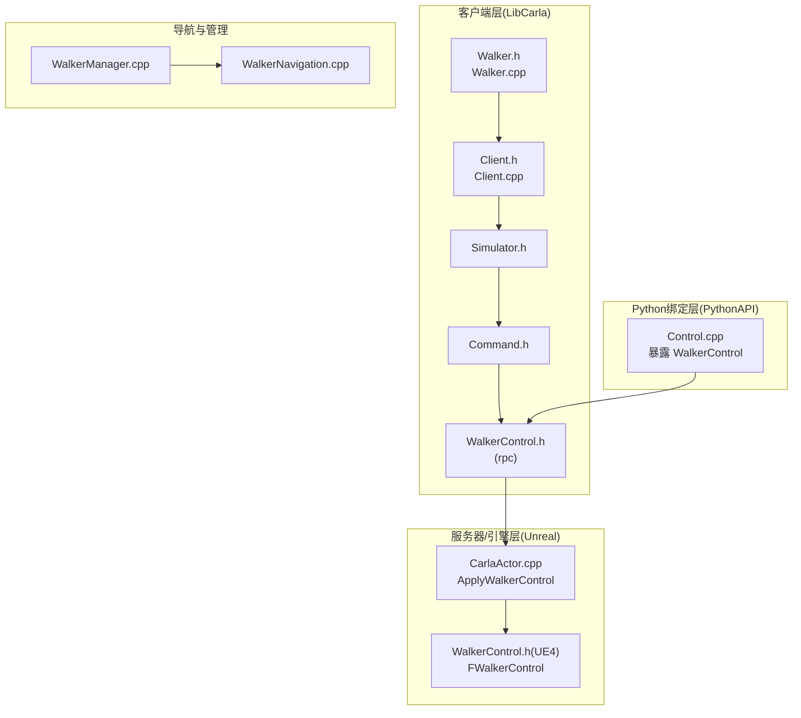
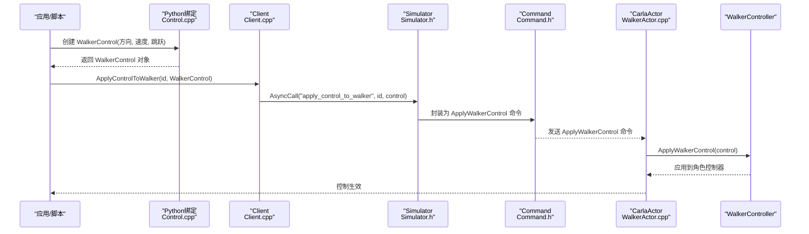
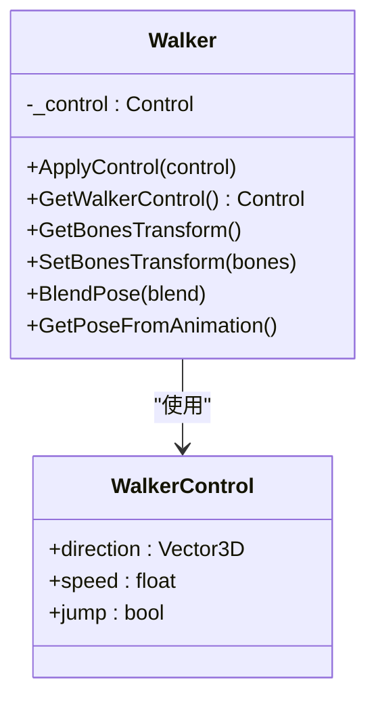
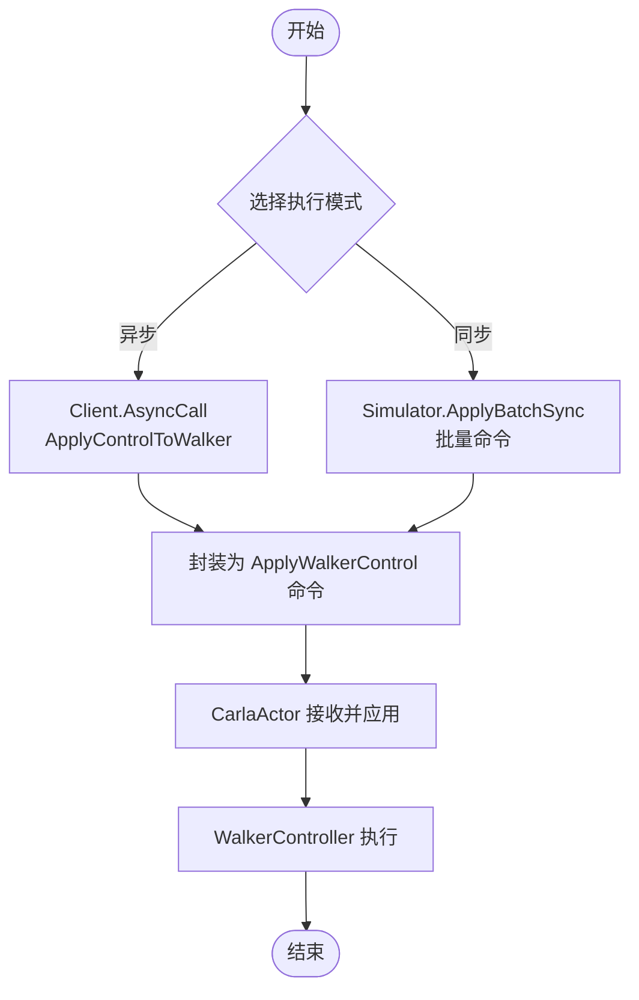
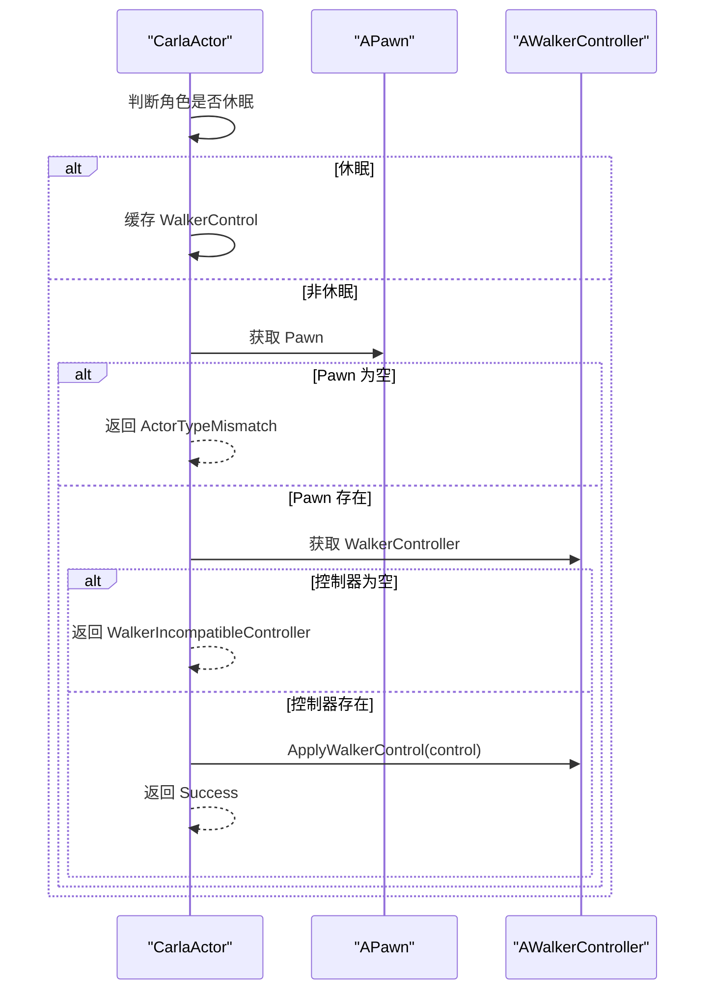
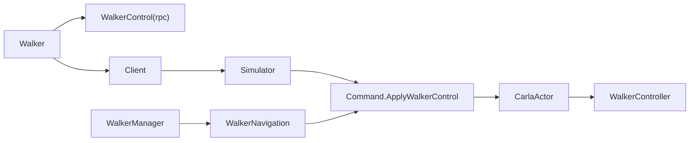

# 基础移动控制

> **引用文件**
> **本文引用的文件**

- [Walker.h](https://github.com/carla-simulator/carla/blob/ue5-dev/LibCarla/source/carla/client/Walker.h)
- [Walker.cpp](https://github.com/carla-simulator/carla/blob/ue5-dev/LibCarla/source/carla/client/Walker.cpp)
- [WalkerControl.h](https://github.com/carla-simulator/carla/blob/ue5-dev/LibCarla/source/carla/rpc/WalkerControl.h)
- [Client.h](https://github.com/carla-simulator/carla/blob/ue5-dev/LibCarla/source/carla/client/detail/Client.h)
- [Client.cpp](https://github.com/carla-simulator/carla/blob/ue5-dev/LibCarla/source/carla/client/detail/Client.cpp)
- [Simulator.h](https://github.com/carla-simulator/carla/blob/ue5-dev/LibCarla/source/carla/client/detail/Simulator.h)
- [Command.h](https://github.com/carla-simulator/carla/blob/ue5-dev/LibCarla/source/carla/rpc/Command.h)
- [Control.cpp](https://github.com/carla-simulator/carla/blob/ue5-dev/PythonAPI/carla/src/Control.cpp)
- [manual_control.py](https://github.com/carla-simulator/carla/blob/ue5-dev/PythonAPI/examples/manual_control.py)
- [WalkerActor.cpp](https://github.com/carla-simulator/carla/blob/ue5-dev/Unreal/CarlaUnreal/Plugins/Carla/Source/Carla/Actor/CarlaActor.cpp)
- [WalkerControl.h（UE4）](https://github.com/carla-simulator/carla/blob/ue5-dev/Unreal/CarlaUnreal/Plugins/Carla/Source/Carla/Walker/WalkerControl.h)
- [WalkerManager.cpp](https://github.com/carla-simulator/carla/blob/ue5-dev/LibCarla/source/carla/nav/WalkerManager.cpp)
- [WalkerNavigation.cpp](https://github.com/carla-simulator/carla/blob/ue5-dev/LibCarla/source/carla/client/detail/WalkerNavigation.cpp)
- [tuto_G_control_walker_skeletons.md](https://github.com/carla-simulator/carla/blob/ue5-dev/Docs/tuto_G_control_walker_skeletons.md)

## 目录

1. [简介](#简介)
2. [项目结构](#项目结构)
3. [核心组件](#核心组件)
4. [架构总览](#架构总览)
5. [详细组件分析](#详细组件分析)
6. [依赖关系分析](#依赖关系分析)
7. [性能考量](#性能考量)
8. [故障排查指南](#故障排查指南)
9. [结论](#结论)
10. [附录：从零到一的完整流程](#附录从零到一的完整流程)

## 简介

本文件围绕 CARLA 行人基础移动控制展开，重点讲解 carla.Walker 类的 apply_control 方法与 WalkerControl 接口的工作机制。内容涵盖：

- 如何通过设置速度、方向和跳跃标志控制行人的基本移动；
- 控制参数的配置选项与有效取值范围；
- 同步与异步执行模式对行人行为的影响；
- 提供面向初学者的分步骤实践流程，从生成行人到实现前进、转向与停止等基本动作。

## 项目结构

与行人移动控制直接相关的核心代码分布在以下层次：

- 客户端层（LibCarla）：Walker 类、Client/Simulator 抽象、RPC 命令定义；
- Python 绑定层（PythonAPI）：WalkerControl 暴露给 Python 的接口；
- 服务器/引擎层（Unreal）：接收 WalkerControl 并驱动角色控制器；
- 导航与管理模块：WalkerManager/WalkerNavigation 负责路径与状态管理。

图表来源

- <a href="https://github.com/carla-simulator/carla/blob/ue5-dev/LibCarla/source/carla/client/Walker.h#L1-L48" target="_blank">Walker.h</a>
- <a href="https://github.com/carla-simulator/carla/blob/ue5-dev/LibCarla/source/carla/client/Walker.cpp#L1-L43" target="_blank">Walker.cpp</a>
- <a href="https://github.com/carla-simulator/carla/blob/ue5-dev/LibCarla/source/carla/client/detail/Client.h#L300-L330" target="_blank">Client.h</a>
- <a href="https://github.com/carla-simulator/carla/blob/ue5-dev/LibCarla/source/carla/client/detail/Client.cpp#L498-L531" target="_blank">Client.cpp</a>
- <a href="https://github.com/carla-simulator/carla/blob/ue5-dev/LibCarla/source/carla/client/detail/Simulator.h#L525-L559" target="_blank">Simulator.h</a>
- <a href="https://github.com/carla-simulator/carla/blob/ue5-dev/LibCarla/source/carla/rpc/Command.h#L87-L125" target="_blank">Command.h</a>
- <a href="https://github.com/carla-simulator/carla/blob/ue5-dev/LibCarla/source/carla/rpc/WalkerControl.h#L1-L68" target="_blank">WalkerControl.h</a>
- <a href="https://github.com/carla-simulator/carla/blob/ue5-dev/PythonAPI/carla/src/Control.cpp#L340-L360" target="_blank">Control.cpp</a>
- <a href="https://github.com/carla-simulator/carla/blob/ue5-dev/Unreal/CarlaUnreal/Plugins/Carla/Source/Carla/Actor/CarlaActor.cpp#L1230-L1277" target="_blank">WalkerActor.cpp</a>
- <a href="https://github.com/carla-simulator/carla/blob/ue5-dev/Unreal/CarlaUnreal/Plugins/Carla/Source/Carla/Walker/WalkerControl.h#L1-L24" target="_blank">WalkerControl.h（UE4）</a>
- <a href="https://github.com/carla-simulator/carla/blob/ue5-dev/LibCarla/source/carla/nav/WalkerManager.cpp#L1-L275" target="_blank">WalkerManager.cpp</a>
- <a href="https://github.com/carla-simulator/carla/blob/ue5-dev/LibCarla/source/carla/client/detail/WalkerNavigation.cpp#L45-L83" target="_blank">WalkerNavigation.cpp</a>

章节来源

- <a href="https://github.com/carla-simulator/carla/blob/ue5-dev/LibCarla/source/carla/client/Walker.h#L1-L48" target="_blank">Walker.h</a>
- <a href="https://github.com/carla-simulator/carla/blob/ue5-dev/LibCarla/source/carla/client/Walker.cpp#L1-L43" target="_blank">Walker.cpp</a>
- <a href="https://github.com/carla-simulator/carla/blob/ue5-dev/LibCarla/source/carla/client/detail/Client.h#L300-L330" target="_blank">Client.h</a>
- <a href="https://github.com/carla-simulator/carla/blob/ue5-dev/LibCarla/source/carla/client/detail/Client.cpp#L498-L531" target="_blank">Client.cpp</a>
- <a href="https://github.com/carla-simulator/carla/blob/ue5-dev/LibCarla/source/carla/client/detail/Simulator.h#L525-L559" target="_blank">Simulator.h</a>
- <a href="https://github.com/carla-simulator/carla/blob/ue5-dev/LibCarla/source/carla/rpc/Command.h#L87-L125" target="_blank">Command.h</a>
- <a href="https://github.com/carla-simulator/carla/blob/ue5-dev/LibCarla/source/carla/rpc/WalkerControl.h#L1-L68" target="_blank">WalkerControl.h</a>
- <a href="https://github.com/carla-simulator/carla/blob/ue5-dev/PythonAPI/carla/src/Control.cpp#L340-L360" target="_blank">Control.cpp</a>
- <a href="https://github.com/carla-simulator/carla/blob/ue5-dev/Unreal/CarlaUnreal/Plugins/Carla/Source/Carla/Actor/CarlaActor.cpp#L1230-L1277" target="_blank">WalkerActor.cpp</a>
- <a href="https://github.com/carla-simulator/carla/blob/ue5-dev/Unreal/CarlaUnreal/Plugins/Carla/Source/Carla/Walker/WalkerControl.h#L1-L24" target="_blank">WalkerControl.h（UE4）</a>
- <a href="https://github.com/carla-simulator/carla/blob/ue5-dev/LibCarla/source/carla/nav/WalkerManager.cpp#L1-L275" target="_blank">WalkerManager.cpp</a>
- <a href="https://github.com/carla-simulator/carla/blob/ue5-dev/LibCarla/source/carla/client/detail/WalkerNavigation.cpp#L45-L83" target="_blank">WalkerNavigation.cpp</a>

## 核心组件

- Walker 类：封装行人的控制接口，提供 apply_control 与获取最近一次控制的方法，并支持骨骼控制与姿态混合。
- WalkerControl 结构：包含方向向量、速度标量与跳跃布尔值，用于描述行人的基本运动意图。
- Client/Simulator：负责将 WalkerControl 异步发送至服务器；同时提供同步批处理能力以提升效率。
- Python 绑定：在 Python 层暴露 WalkerControl，便于脚本化控制。
- 服务器侧：CarlaActor 接收 WalkerControl 并交由 WalkerController 应用到角色。

章节来源

- <a href="https://github.com/carla-simulator/carla/blob/ue5-dev/LibCarla/source/carla/client/Walker.h#L1-L48" target="_blank">Walker.h</a>
- <a href="https://github.com/carla-simulator/carla/blob/ue5-dev/LibCarla/source/carla/client/Walker.cpp#L1-L43" target="_blank">Walker.cpp</a>
- <a href="https://github.com/carla-simulator/carla/blob/ue5-dev/LibCarla/source/carla/rpc/WalkerControl.h#L1-L68" target="_blank">WalkerControl.h</a>
- <a href="https://github.com/carla-simulator/carla/blob/ue5-dev/LibCarla/source/carla/client/detail/Client.h#L300-L330" target="_blank">Client.h</a>
- <a href="https://github.com/carla-simulator/carla/blob/ue5-dev/LibCarla/source/carla/client/detail/Client.cpp#L498-L531" target="_blank">Client.cpp</a>
- <a href="https://github.com/carla-simulator/carla/blob/ue5-dev/LibCarla/source/carla/client/detail/Simulator.h#L525-L559" target="_blank">Simulator.h</a>
- <a href="https://github.com/carla-simulator/carla/blob/ue5-dev/PythonAPI/carla/src/Control.cpp#L340-L360" target="_blank">Control.cpp</a>
- <a href="https://github.com/carla-simulator/carla/blob/ue5-dev/Unreal/CarlaUnreal/Plugins/Carla/Source/Carla/Actor/CarlaActor.cpp#L1230-L1277" target="_blank">WalkerActor.cpp</a>

## 架构总览

下图展示了从应用层到服务器层的调用链路，以及控制参数在各层之间的传递与转换。

图表来源

- <a href="https://github.com/carla-simulator/carla/blob/ue5-dev/PythonAPI/carla/src/Control.cpp#L340-L360" target="_blank">Control.cpp</a>
- <a href="https://github.com/carla-simulator/carla/blob/ue5-dev/LibCarla/source/carla/client/detail/Client.cpp#L498-L531" target="_blank">Client.cpp</a>
- <a href="https://github.com/carla-simulator/carla/blob/ue5-dev/LibCarla/source/carla/client/detail/Simulator.h#L525-L559" target="_blank">Simulator.h</a>
- <a href="https://github.com/carla-simulator/carla/blob/ue5-dev/LibCarla/source/carla/rpc/Command.h#L87-L125" target="_blank">Command.h</a>
- <a href="https://github.com/carla-simulator/carla/blob/ue5-dev/Unreal/CarlaUnreal/Plugins/Carla/Source/Carla/Actor/CarlaActor.cpp#L1230-L1277" target="_blank">WalkerActor.cpp</a>

## 详细组件分析

### Walker 类与 apply_control

- Walker::ApplyControl：仅在控制参数发生变化时才向服务器发送，避免冗余通信；内部保存最近一次控制以便查询。
- Walker::GetWalkerControl：返回上一帧接收到的 WalkerControl，不触发模拟器调用。
- 骨骼控制与姿态混合：提供获取骨骼变换、设置骨骼变换、混合姿态与从动画获取姿态等接口，便于精细动画控制。

图表来源

- <a href="https://github.com/carla-simulator/carla/blob/ue5-dev/LibCarla/source/carla/client/Walker.h#L1-L48" target="_blank">Walker.h</a>
- <a href="https://github.com/carla-simulator/carla/blob/ue5-dev/LibCarla/source/carla/client/Walker.cpp#L1-L43" target="_blank">Walker.cpp</a>
- <a href="https://github.com/carla-simulator/carla/blob/ue5-dev/LibCarla/source/carla/rpc/WalkerControl.h#L1-L68" target="_blank">WalkerControl.h</a>

章节来源

- <a href="https://github.com/carla-simulator/carla/blob/ue5-dev/LibCarla/source/carla/client/Walker.h#L1-L48" target="_blank">Walker.h</a>
- <a href="https://github.com/carla-simulator/carla/blob/ue5-dev/LibCarla/source/carla/client/Walker.cpp#L1-L43" target="_blank">Walker.cpp</a>

### WalkerControl 参数与取值范围

- 方向 direction：三维向量，建议归一化以获得稳定的移动方向；其模长在当前实现中不被直接用作速度缩放。
- 速度 speed：标量，单位通常与仿真时间步长相关；在 Python 示例中，HUD 显示速度上限为约 5.556 m/s（对应 20 km/h），可作为参考上限。
- 跳跃 jump：布尔值，触发行人的跳跃动作。

章节来源

- <a href="https://github.com/carla-simulator/carla/blob/ue5-dev/LibCarla/source/carla/rpc/WalkerControl.h#L1-L68" target="_blank">WalkerControl.h</a>
- <a href="https://github.com/carla-simulator/carla/blob/ue5-dev/PythonAPI/carla/src/Control.cpp#L340-L360" target="_blank">Control.cpp</a>
- <a href="https://github.com/carla-simulator/carla/blob/ue5-dev/PythonAPI/examples/manual_control.py#L652-L667" target="_blank">manual_control.py</a>

### 同步与异步执行模式

- 异步模式（默认）：Client::ApplyControlToWalker 使用 AsyncCall，立即返回，控制在下一帧或后续帧生效；适合实时交互与高频更新场景。
- 同步批处理：Simulator::ApplyBatchSync 支持批量同步命令，减少网络往返与状态抖动；适用于需要多步协调的场景（如导航模块）。
- 服务器侧应用：CarlaActor::ApplyControlToWalker 在非休眠状态下将控制交给 WalkerController 执行；若角色控制器缺失则返回兼容性错误码。

图表来源

- <a href="https://github.com/carla-simulator/carla/blob/ue5-dev/LibCarla/source/carla/client/detail/Client.cpp#L498-L531" target="_blank">Client.cpp</a>
- <a href="https://github.com/carla-simulator/carla/blob/ue5-dev/LibCarla/source/carla/client/detail/Simulator.h#L525-L559" target="_blank">Simulator.h</a>
- <a href="https://github.com/carla-simulator/carla/blob/ue5-dev/LibCarla/source/carla/rpc/Command.h#L87-L125" target="_blank">Command.h</a>
- <a href="https://github.com/carla-simulator/carla/blob/ue5-dev/Unreal/CarlaUnreal/Plugins/Carla/Source/Carla/Actor/CarlaActor.cpp#L1230-L1277" target="_blank">WalkerActor.cpp</a>

章节来源

- <a href="https://github.com/carla-simulator/carla/blob/ue5-dev/LibCarla/source/carla/client/detail/Client.cpp#L498-L531" target="_blank">Client.cpp</a>
- <a href="https://github.com/carla-simulator/carla/blob/ue5-dev/LibCarla/source/carla/client/detail/Simulator.h#L525-L559" target="_blank">Simulator.h</a>
- <a href="https://github.com/carla-simulator/carla/blob/ue5-dev/LibCarla/source/carla/rpc/Command.h#L87-L125" target="_blank">Command.h</a>
- <a href="https://github.com/carla-simulator/carla/blob/ue5-dev/Unreal/CarlaUnreal/Plugins/Carla/Source/Carla/Actor/CarlaActor.cpp#L1230-L1277" target="_blank">WalkerActor.cpp</a>

### 服务器端控制应用流程

- 接收控制：CarlaActor::ApplyControlToWalker 根据角色是否休眠决定缓存或直接应用；
- 角色控制器：若存在兼容的 WalkerController，则调用其 ApplyWalkerControl；
- 错误处理：类型不匹配或控制器缺失会返回相应响应码，便于上层诊断。

图表来源

- <a href="https://github.com/carla-simulator/carla/blob/ue5-dev/Unreal/CarlaUnreal/Plugins/Carla/Source/Carla/Actor/CarlaActor.cpp#L1230-L1277" target="_blank">WalkerActor.cpp</a>

章节来源

- <a href="https://github.com/carla-simulator/carla/blob/ue5-dev/Unreal/CarlaUnreal/Plugins/Carla/Source/Carla/Actor/CarlaActor.cpp#L1230-L1277" target="_blank">WalkerActor.cpp</a>

### 导航与状态管理

- WalkerManager：维护行人的状态机（空闲、行走、事件中、停止），根据目标点与距离阈值推进路径；
- WalkerNavigation：周期性收集行人的位置与速度，构造 ApplyWalkerState 批量命令同步到服务器，提高效率；
- 与 WalkerControl 的关系：导航模块通常通过设置目标点与速度影响 WalkerControl 的速度分量，从而间接控制行人的移动。

章节来源

- <a href="https://github.com/carla-simulator/carla/blob/ue5-dev/LibCarla/source/carla/nav/WalkerManager.cpp#L1-L275" target="_blank">WalkerManager.cpp</a>
- <a href="https://github.com/carla-simulator/carla/blob/ue5-dev/LibCarla/source/carla/client/detail/WalkerNavigation.cpp#L45-L83" target="_blank">WalkerNavigation.cpp</a>

## 依赖关系分析

- Walker 依赖 WalkerControl（rpc）进行控制参数传递；
- Client 通过 Simulator 抽象发送命令；
- Command.h 定义 ApplyWalkerControl 命令体；
- Python 绑定通过 Control.cpp 暴露 WalkerControl；
- 服务器端 CarlaActor 接收并应用 WalkerControl；
- 导航模块通过 WalkerNavigation 构造批量命令，减少通信开销。

图表来源

- <a href="https://github.com/carla-simulator/carla/blob/ue5-dev/LibCarla/source/carla/client/Walker.h#L1-L48" target="_blank">Walker.h</a>
- <a href="https://github.com/carla-simulator/carla/blob/ue5-dev/LibCarla/source/carla/rpc/WalkerControl.h#L1-L68" target="_blank">WalkerControl.h</a>
- <a href="https://github.com/carla-simulator/carla/blob/ue5-dev/LibCarla/source/carla/client/detail/Client.h#L300-L330" target="_blank">Client.h</a>
- <a href="https://github.com/carla-simulator/carla/blob/ue5-dev/LibCarla/source/carla/client/detail/Simulator.h#L525-L559" target="_blank">Simulator.h</a>
- <a href="https://github.com/carla-simulator/carla/blob/ue5-dev/LibCarla/source/carla/rpc/Command.h#L87-L125" target="_blank">Command.h</a>
- <a href="https://github.com/carla-simulator/carla/blob/ue5-dev/Unreal/CarlaUnreal/Plugins/Carla/Source/Carla/Actor/CarlaActor.cpp#L1230-L1277" target="_blank">WalkerActor.cpp</a>
- <a href="https://github.com/carla-simulator/carla/blob/ue5-dev/LibCarla/source/carla/nav/WalkerManager.cpp#L1-L275" target="_blank">WalkerManager.cpp</a>
- <a href="https://github.com/carla-simulator/carla/blob/ue5-dev/LibCarla/source/carla/client/detail/WalkerNavigation.cpp#L45-L83" target="_blank">WalkerNavigation.cpp</a>

章节来源

- <a href="https://github.com/carla-simulator/carla/blob/ue5-dev/LibCarla/source/carla/client/Walker.h#L1-L48" target="_blank">Walker.h</a>
- <a href="https://github.com/carla-simulator/carla/blob/ue5-dev/LibCarla/source/carla/rpc/WalkerControl.h#L1-L68" target="_blank">WalkerControl.h</a>
- <a href="https://github.com/carla-simulator/carla/blob/ue5-dev/LibCarla/source/carla/client/detail/Client.h#L300-L330" target="_blank">Client.h</a>
- <a href="https://github.com/carla-simulator/carla/blob/ue5-dev/LibCarla/source/carla/client/detail/Simulator.h#L525-L559" target="_blank">Simulator.h</a>
- <a href="https://github.com/carla-simulator/carla/blob/ue5-dev/LibCarla/source/carla/rpc/Command.h#L87-L125" target="_blank">Command.h</a>
- <a href="https://github.com/carla-simulator/carla/blob/ue5-dev/Unreal/CarlaUnreal/Plugins/Carla/Source/Carla/Actor/CarlaActor.cpp#L1230-L1277" target="_blank">WalkerActor.cpp</a>
- <a href="https://github.com/carla-simulator/carla/blob/ue5-dev/LibCarla/source/carla/nav/WalkerManager.cpp#L1-L275" target="_blank">WalkerManager.cpp</a>
- <a href="https://github.com/carla-simulator/carla/blob/ue5-dev/LibCarla/source/carla/client/detail/WalkerNavigation.cpp#L45-L83" target="_blank">WalkerNavigation.cpp</a>

## 性能考量

- 异步发送：频繁调用 ApplyControlToWalker 时应避免每帧都发送相同控制，可采用“变更检测”策略（如 Walker 内部已做）以减少网络与状态更新压力。
- 批量同步：在需要多步协调或大量行人时，优先使用 ApplyBatchSync，降低命令封装与传输开销。
- 导航模块：WalkerNavigation 通过批量命令同步状态，有助于稳定帧率与减少抖动。

章节来源

- <a href="https://github.com/carla-simulator/carla/blob/ue5-dev/LibCarla/source/carla/client/Walker.cpp#L1-L43" target="_blank">Walker.cpp</a>
- <a href="https://github.com/carla-simulator/carla/blob/ue5-dev/LibCarla/source/carla/client/detail/Simulator.h#L525-L559" target="_blank">Simulator.h</a>
- <a href="https://github.com/carla-simulator/carla/blob/ue5-dev/LibCarla/source/carla/client/detail/WalkerNavigation.cpp#L45-L83" target="_blank">WalkerNavigation.cpp</a>

## 故障排查指南

- 控制未生效
  - 检查角色是否处于休眠状态（休眠时控制会被缓存）；
  - 确认角色控制器类型是否兼容（控制器为空会返回不兼容响应）。
- 控制器缺失
  - 若角色不是 Pawn 或控制器不存在，服务器侧会返回相应错误码；请确认角色蓝图与控制器配置。
- 速度异常
  - 确保 speed 设置在合理范围内；HUD 中显示的速度上限可作为参考。
- 跳跃无效
  - 确认 jump 为 true 且角色具备跳跃能力；地形与物理约束可能影响效果。

章节来源

- <a href="https://github.com/carla-simulator/carla/blob/ue5-dev/Unreal/CarlaUnreal/Plugins/Carla/Source/Carla/Actor/CarlaActor.cpp#L1230-L1277" target="_blank">WalkerActor.cpp</a>

## 结论

- WalkerControl 是行人基础移动的核心载体，包含方向、速度与跳跃三要素；
- 客户端默认采用异步发送，必要时可使用同步批处理提升稳定性；
- 服务器端通过 WalkerController 应用控制，确保与角色蓝图一致；
- 导航模块可与 WalkerControl 协同工作，实现更复杂的路径与行为编排。

## 附录：从零到一的完整流程

以下步骤基于仓库中的示例与文档，帮助你从生成行人到实现基本移动控制：

1. 连接到仿真器并加载世界
   - 参考：<a href="https://github.com/carla-simulator/carla/blob/ue5-dev/PythonAPI/examples/manual_control.py#L1-L120" target="_blank">manual_control.py</a>
2. 生成行人
   - 参考：<a href="https://github.com/carla-simulator/carla/blob/ue5-dev/PythonAPI/test/API/test_spawn_walkers.py#L1-L46" target="_blank">test_spawn_walkers.py</a>
3. 创建 WalkerControl 并设置方向与速度
   - 参考：<a href="https://github.com/carla-simulator/carla/blob/ue5-dev/PythonAPI/carla/src/Control.cpp#L340-L360" target="_blank">Control.cpp</a>、<a href="https://github.com/carla-simulator/carla/blob/ue5-dev/PythonAPI/examples/manual_control.py#L652-L667" target="_blank">manual_control.py</a>
4. 应用控制
   - 参考：<a href="https://github.com/carla-simulator/carla/blob/ue5-dev/LibCarla/source/carla/client/Walker.cpp#L1-L43" target="_blank">Walker.cpp</a>、<a href="https://github.com/carla-simulator/carla/blob/ue5-dev/LibCarla/source/carla/client/detail/Client.cpp#L498-L531" target="_blank">Client.cpp</a>
5. 查看效果与调试
   - 参考：<a href="https://github.com/carla-simulator/carla/blob/ue5-dev/PythonAPI/examples/manual_control.py#L739-L758" target="_blank">manual_control.py</a>

此外，若需手动控制骨架或动画，可参考：

- <a href="https://github.com/carla-simulator/carla/blob/ue5-dev/Docs/tuto_G_control_walker_skeletons.md#L1-L149" target="_blank">tuto_G_control_walker_skeletons.md</a>

章节来源

- <a href="https://github.com/carla-simulator/carla/blob/ue5-dev/PythonAPI/examples/manual_control.py#L1-L120" target="_blank">manual_control.py</a>
- <a href="https://github.com/carla-simulator/carla/blob/ue5-dev/PythonAPI/test/API/test_spawn_walkers.py#L1-L46" target="_blank">test_spawn_walkers.py</a>
- <a href="https://github.com/carla-simulator/carla/blob/ue5-dev/PythonAPI/carla/src/Control.cpp#L340-L360" target="_blank">Control.cpp</a>
- <a href="https://github.com/carla-simulator/carla/blob/ue5-dev/LibCarla/source/carla/client/Walker.cpp#L1-L43" target="_blank">Walker.cpp</a>
- <a href="https://github.com/carla-simulator/carla/blob/ue5-dev/LibCarla/source/carla/client/detail/Client.cpp#L498-L531" target="_blank">Client.cpp</a>
- <a href="https://github.com/carla-simulator/carla/blob/ue5-dev/Docs/tuto_G_control_walker_skeletons.md#L1-L149" target="_blank">tuto_G_control_walker_skeletons.md</a>
