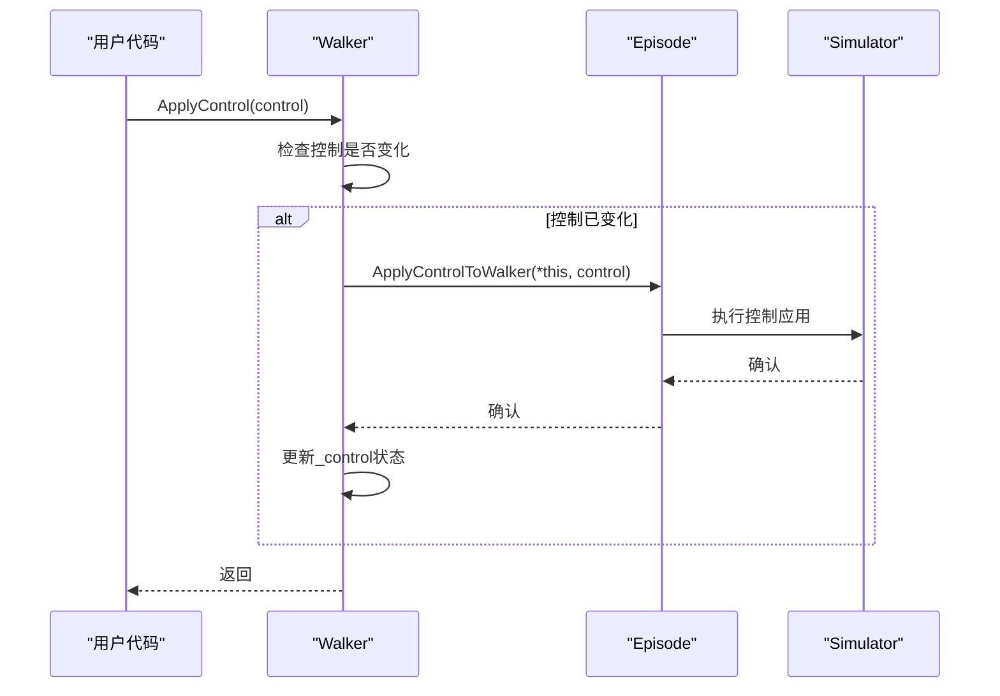
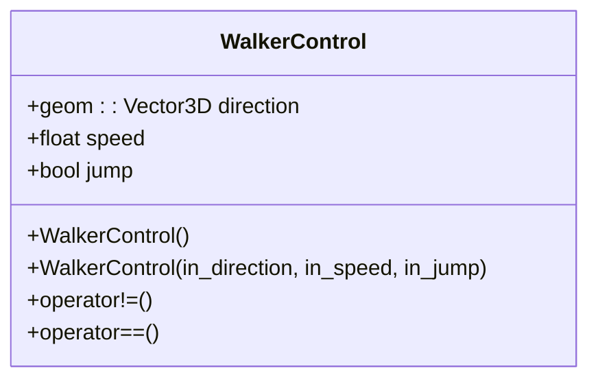
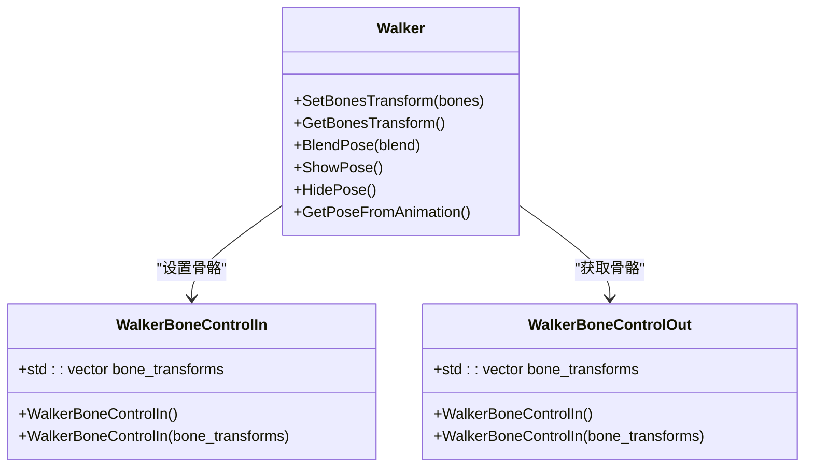
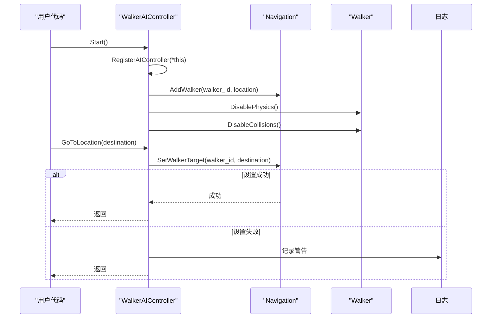
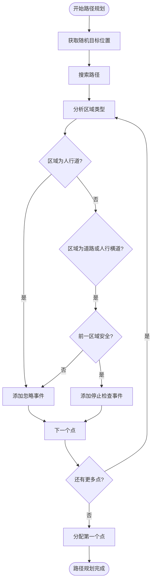
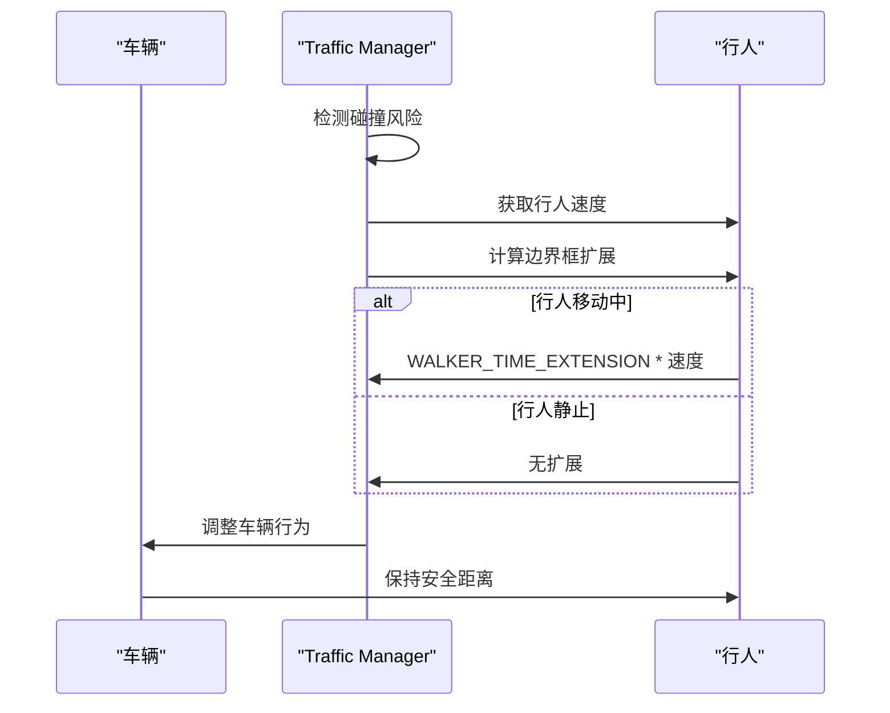
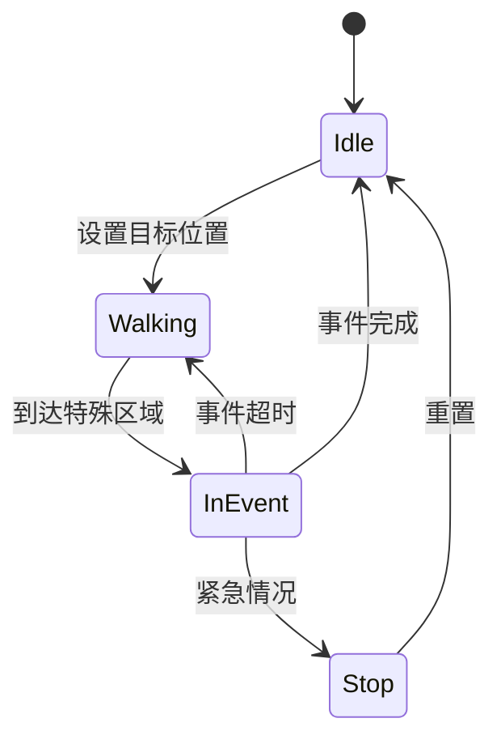

# 行人控制


**本文档中引用的文件**  
- [Walker.cpp](https://github.com/carla-simulator/carla/blob/ue5-dev/LibCarla/source/carla/client/Walker.cpp)
- [Walker.h](https://github.com/carla-simulator/carla/blob/ue5-dev/LibCarla/source/carla/client/Walker.h)
- [WalkerControl.h](https://github.com/carla-simulator/carla/blob/ue5-dev/LibCarla/source/carla/rpc/WalkerControl.h)
- [WalkerBoneControlIn.h](https://github.com/carla-simulator/carla/blob/ue5-dev/LibCarla/source/carla/rpc/WalkerBoneControlIn.h)
- [WalkerBoneControlOut.h](https://github.com/carla-simulator/carla/blob/ue5-dev/LibCarla/source/carla/rpc/WalkerBoneControlOut.h)
- [WalkerNavigation.h](https://github.com/carla-simulator/carla/blob/ue5-dev/LibCarla/source/carla/client/detail/WalkerNavigation.h)
- [WalkerAIController.cpp](https://github.com/carla-simulator/carla/blob/ue5-dev/LibCarla/source/carla/client/WalkerAIController.cpp)
- [WalkerAIController.h](https://github.com/carla-simulator/carla/blob/ue5-dev/LibCarla/source/carla/client/WalkerAIController.h)
- [WalkerManager.h](https://github.com/carla-simulator/carla/blob/ue5-dev/LibCarla/source/carla/nav/WalkerManager.h)
- [WalkerEvent.h](https://github.com/carla-simulator/carla/blob/ue5-dev/LibCarla/source/carla/nav/WalkerEvent.h)
- [CollisionStage.cpp](https://github.com/carla-simulator/carla/blob/ue5-dev/LibCarla/source/carla/trafficmanager/CollisionStage.cpp)
- [behavior_agent.py](https://github.com/carla-simulator/carla/blob/ue5-dev/PythonAPI/carla/agents/navigation/behavior_agent.py)
- [MotionPlanStage.cpp](https://github.com/carla-simulator/carla/blob/ue5-dev/LibCarla/source/carla/trafficmanager/MotionPlanStage.cpp)
- [WalkerManager.cpp](https://github.com/carla-simulator/carla/blob/ue5-dev/LibCarla/source/carla/nav/WalkerManager.cpp)
- [carla.WalkerAIController.stop.py](https://github.com/carla-simulator/carla/blob/ue5-dev/PythonAPI/docs/snipets/carla.WalkerAIController.stop.py)


## 目录
1. [简介](#简介)
2. [核心组件](#核心组件)
3. [控制接口详解](#控制接口详解)
4. [骨骼动画控制](#骨骼动画控制)
5. [导航与路径规划](#导航与路径规划)
6. [与交通管理器的集成](#与交通管理器的集成)
7. [碰撞检测与行为响应](#碰撞检测与行为响应)
8. [代码示例](#代码示例)
9. [初学者指南](#初学者指南)
10. [高级技巧](#高级技巧)
11. [结论](#结论)

## 简介
CARLA模拟器提供了完整的行人控制功能，允许用户精确控制行人的移动、姿态和行为。本文档深入解析了`carla.Walker`类的控制接口，涵盖从基础移动控制到高级群体行为模拟的各个方面。文档详细解释了`apply_control`方法及其`WalkerControl`参数，探讨了行人骨骼动画控制机制，以及与Traffic Manager的集成方式。通过实际代码示例，展示了行人的生成、控制和行为模拟过程，为不同层次的用户提供全面的指导。

## 核心组件

CARLA中的行人控制系统由多个核心组件构成，包括`Walker`类、`WalkerAIController`类、`WalkerControl`结构体以及导航系统。`Walker`类继承自`Actor`，是行人的基本表示，提供了应用控制、获取骨骼变换等核心功能。`WalkerAIController`类负责管理行人的自主导航行为，包括路径规划和速度控制。`WalkerControl`结构体定义了行人的控制参数，包括方向、速度和跳跃状态。导航系统基于Recast & Detour框架，实现了复杂的路径规划和避障功能。

**Section sources**
- [Walker.h](https://github.com/carla-simulator/carla/blob/ue5-dev/LibCarla/source/carla/client/Walker.h#L17-L49)
- [WalkerAIController.h](https://github.com/carla-simulator/carla/blob/ue5-dev/LibCarla/source/carla/client/WalkerAIController.h#L17-L35)
- [WalkerControl.h](https://github.com/carla-simulator/carla/blob/ue5-dev/LibCarla/source/carla/rpc/WalkerControl.h#L20-L69)

## 控制接口详解

### apply_control方法

`apply_control`方法是控制行人的主要接口，通过`WalkerControl`结构体传递控制指令。该方法检查控制指令是否发生变化，如果变化则通过模拟器应用新的控制指令，并更新本地控制状态。



**Diagram sources**
- [Walker.cpp](https://github.com/carla-simulator/carla/blob/ue5-dev/LibCarla/source/carla/client/Walker.cpp#L14-L19)

### WalkerControl参数

`WalkerControl`结构体包含三个主要参数：方向、速度和跳跃状态。方向由`geom::Vector3D`表示，定义了行人的移动方向；速度为浮点数，表示行人的移动速度（单位：米/秒）；跳跃为布尔值，控制行人是否执行跳跃动作。



**Diagram sources**
- [WalkerControl.h](https://github.com/carla-simulator/carla/blob/ue5-dev/LibCarla/source/carla/rpc/WalkerControl.h#L20-L69)

## 骨骼动画控制

### 骨骼变换接口

CARLA提供了精细的骨骼动画控制功能，允许用户直接操作行人的骨骼变换。`SetBonesTransform`方法接收`Walker::BoneControlIn`对象，设置行人的骨骼变换；`GetBonesTransform`方法返回当前的骨骼变换状态。



**Diagram sources**
- [Walker.h](https://github.com/carla-simulator/carla/blob/ue5-dev/LibCarla/source/carla/client/Walker.h#L35-L40)
- [WalkerBoneControlIn.h](https://github.com/carla-simulator/carla/blob/ue5-dev/LibCarla/source/carla/rpc/WalkerBoneControlIn.h#L25-L53)
- [WalkerBoneControlOut.h](https://github.com/carla-simulator/carla/blob/ue5-dev/LibCarla/source/carla/rpc/WalkerBoneControlOut.h#L25-L41)

### 姿态混合

`BlendPose`方法允许在动画姿态和骨骼控制姿态之间进行混合。当参数为1.0时，完全显示骨骼控制姿态；当参数为0.0时，完全隐藏骨骼控制姿态，显示动画姿态。`ShowPose`和`HidePose`是`BlendPose`的便捷方法。

**Section sources**
- [Walker.cpp](https://github.com/carla-simulator/carla/blob/ue5-dev/LibCarla/source/carla/client/Walker.cpp#L33-L39)
- [Walker.h](https://github.com/carla-simulator/carla/blob/ue5-dev/LibCarla/source/carla/client/Walker.h#L37-L39)

## 导航与路径规划

### WalkerAIController

`WalkerAIController`类提供了高级导航功能，包括自动路径规划、目标点设置和速度控制。通过`Start`方法启动导航，`Stop`方法停止导航，`GoToLocation`方法设置目标位置，`SetMaxSpeed`方法设置最大速度。



**Diagram sources**
- [WalkerAIController.cpp](https://github.com/carla-simulator/carla/blob/ue5-dev/LibCarla/source/carla/client/WalkerAIController.cpp#L18-L67)

### 路径规划机制

路径规划系统基于Recast & Detour框架，使用导航网格（nav mesh）进行路径搜索。`WalkerManager`类管理所有行人的路径，`WalkerEvent`定义了不同类型的路径事件，包括等待、停止检查等。路径规划考虑了人行道、道路和人行横道等不同区域类型。



**Diagram sources**
- [WalkerManager.cpp](https://github.com/carla-simulator/carla/blob/ue5-dev/LibCarla/source/carla/nav/WalkerManager.cpp#L114-L181)
- [WalkerEvent.h](https://github.com/carla-simulator/carla/blob/ue5-dev/LibCarla/source/carla/nav/WalkerEvent.h#L28-L56)

**Section sources**
- [WalkerManager.h](https://github.com/carla-simulator/carla/blob/ue5-dev/LibCarla/source/carla/nav/WalkerManager.h#L23-L44)
- [WalkerEvent.h](https://github.com/carla-simulator/carla/blob/ue5-dev/LibCarla/source/carla/nav/WalkerEvent.h#L28-L56)

## 与交通管理器的集成

行人系统与Traffic Manager紧密集成，确保行人在交通环境中的行为符合现实。Traffic Manager的碰撞检测阶段会特别处理行人，通过扩展行人的边界框来预测其未来位置，避免车辆与行人发生碰撞。



**Diagram sources**
- [CollisionStage.cpp](https://github.com/carla-simulator/carla/blob/ue5-dev/LibCarla/source/carla/trafficmanager/CollisionStage.cpp#L146-L149)

## 碰撞检测与行为响应

### 碰撞检测机制

行人的碰撞检测不仅用于避免与其他实体的碰撞，还用于触发特定的行为响应。`WalkerManager`通过`ExecuteEvent`方法处理不同类型的事件，包括等待、停止检查等。当行人接近道路时，会自动进入"停止检查"状态，观察交通情况。



**Diagram sources**
- [WalkerManager.cpp](https://github.com/carla-simulator/carla/blob/ue5-dev/LibCarla/source/carla/nav/WalkerManager.cpp#L89-L108)
- [WalkerEvent.h](https://github.com/carla-simulator/carla/blob/ue5-dev/LibCarla/source/carla/nav/WalkerEvent.h#L28-L56)

### 行为响应策略

行人的行为响应策略包括：在人行横道前停止并检查交通状况、在道路上等待安全时机通过、在人行道上自由行走等。这些行为通过`WalkerEvent`系统实现，确保行人在复杂交通环境中的行为既安全又自然。

**Section sources**
- [WalkerManager.cpp](https://github.com/carla-simulator/carla/blob/ue5-dev/LibCarla/source/carla/nav/WalkerManager.cpp#L164-L170)
- [WalkerEvent.h](https://github.com/carla-simulator/carla/blob/ue5-dev/LibCarla/source/carla/nav/WalkerEvent.h#L44-L52)

## 代码示例

### 基础行人控制

```python
# 创建行人
walker_bp = blueprint_library.find('walker.pedestrian.0001')
spawn_point = random.choice(world.get_map().get_spawn_points())
walker = world.spawn_actor(walker_bp, spawn_point)

# 创建控制器
controller_bp = blueprint_library.find('controller.ai.walker')
controller = world.spawn_actor(controller_bp, carla.Transform(), walker)

# 启动控制器
controller.start()
controller.go_to_location(world.get_random_location_from_navigation())
controller.set_max_speed(1.7)  # 步行速度
```

### 骨骼动画控制

```python
# 获取骨骼变换
bones = walker.get_bones_transform()

# 修改骨骼变换
for bone in bones.bone_transforms:
    if bone.name == "head":
        bone.rotation.y = 30  # 转头

# 应用骨骼变换
walker.set_bones_transform(bones)
walker.show_pose()  # 显示骨骼姿态
```

### 群体控制

```python
# 生成多个行人
for i in range(50):
    # 生成行人和控制器
    walker = world.spawn_actor(walker_bp, spawn_point)
    controller = world.spawn_actor(controller_bp, carla.Transform(), walker)
    all_actors.append(controller)
    all_actors.append(walker)
    
    # 启动并设置目标
    controller.start()
    controller.go_to_location(world.get_random_location_from_navigation())

# 停止所有行人
for i in range(0, len(all_actors), 2):
    all_actors[i].stop()

# 销毁所有实体
client.apply_batch([carla.command.DestroyActor(x) for x in all_actors])
```

**Section sources**
- [carla.WalkerAIController.stop.py](https://github.com/carla-simulator/carla/blob/ue5-dev/PythonAPI/docs/snipets/carla.WalkerAIController.stop.py#L2-L10)

## 初学者指南

### 基础移动控制

对于初学者，建议从基础的移动控制开始：

1. **生成行人**：使用蓝图库中的行人蓝图生成行人实体
2. **创建控制器**：为每个行人创建AI控制器
3. **启动导航**：调用`start()`方法启动行人的自主导航
4. **设置目标**：使用`go_to_location()`方法设置行人的目标位置
5. **控制速度**：通过`set_max_speed()`方法调整行人的移动速度

### 简单行为模拟

通过组合基本控制方法，可以实现简单的行人行为：

- **随机漫步**：定期调用`get_random_location_from_navigation()`获取随机目标
- **定点移动**：将行人移动到特定的地理位置
- **速度变化**：根据场景需求调整行人的移动速度

**Section sources**
- [WalkerAIController.h](https://github.com/carla-simulator/carla/blob/ue5-dev/LibCarla/source/carla/client/WalkerAIController.h#L22-L31)
- [WalkerAIController.cpp](https://github.com/carla-simulator/carla/blob/ue5-dev/LibCarla/source/carla/client/WalkerAIController.cpp#L18-L67)

## 高级技巧

### 复杂行为模拟

对于高级用户，可以实现更复杂的行人行为：

1. **自定义路径规划**：直接操作`WalkerControl`实现精确的路径控制
2. **骨骼动画同步**：结合骨骼控制和移动控制，实现自然的行走动画
3. **群体行为**：通过协调多个行人的行为，模拟人群流动
4. **交互式行为**：根据环境变化动态调整行人的行为策略

### 性能优化

在大规模行人模拟中，需要注意性能优化：

- **批量操作**：使用批量命令减少网络通信开销
- **合理密度**：根据硬件性能调整行人密度
- **选择性更新**：只对活跃的行人进行频繁更新
- **资源管理**：及时销毁不再需要的行人实体

**Section sources**
- [Walker.cpp](https://github.com/carla-simulator/carla/blob/ue5-dev/LibCarla/source/carla/client/Walker.cpp#L14-L19)
- [WalkerAIController.cpp](https://github.com/carla-simulator/carla/blob/ue5-dev/LibCarla/source/carla/client/WalkerAIController.cpp#L18-L85)

## 结论

CARLA提供了全面而灵活的行人控制功能，从基础的移动控制到高级的骨骼动画和群体行为模拟。通过`Walker`类和`WalkerAIController`类的组合，用户可以实现从简单到复杂的各种行人行为。导航系统基于先进的Recast & Detour框架，确保了路径规划的准确性和效率。与Traffic Manager的深度集成使得行人能够在真实的交通环境中安全、自然地移动。通过合理使用这些功能，用户可以创建逼真的城市交通模拟场景，满足自动驾驶测试、城市规划等多种应用需求。