# 高级行为控制

**本文档中引用的文件**  
- [Walker.cpp](https://github.com/carla-simulator/carla/blob/ue5-dev/LibCarla/source/carla/client/Walker.cpp)
- [Walker.h](https://github.com/carla-simulator/carla/blob/ue5-dev/LibCarla/source/carla/client/Walker.h)
- [WalkerAIController.cpp](https://github.com/carla-simulator/carla/blob/ue5-dev/LibCarla/source/carla/client/WalkerAIController.cpp)
- [WalkerAIController.h](https://github.com/carla-simulator/carla/blob/ue5-dev/LibCarla/source/carla/client/WalkerAIController.h)
- [WalkerManager.cpp](https://github.com/carla-simulator/carla/blob/ue5-dev/LibCarla/source/carla/nav/WalkerManager.cpp)
- [WalkerManager.h](https://github.com/carla-simulator/carla/blob/ue5-dev/LibCarla/source/carla/nav/WalkerManager.h)
- [Navigation.cpp](https://github.com/carla-simulator/carla/blob/ue5-dev/LibCarla/source/carla/nav/Navigation.cpp)
- [Navigation.h](https://github.com/carla-simulator/carla/blob/ue5-dev/LibCarla/source/carla/nav/Navigation.h)
- [WalkerControl.h](https://github.com/carla-simulator/carla/blob/ue5-dev/LibCarla/source/carla/rpc/WalkerControl.h)
- [WalkerBoneControlIn.h](https://github.com/carla-simulator/carla/blob/ue5-dev/LibCarla/source/carla/rpc/WalkerBoneControlIn.h)
- [WalkerBoneControlOut.h](https://github.com/carla-simulator/carla/blob/ue5-dev/LibCarla/source/carla/rpc/WalkerBoneControlOut.h)
- [tuto_G_control_walker_skeletons.md](https://github.com/carla-simulator/carla/blob/ue5-dev/Docs/tuto_G_control_walker_skeletons.md)
- [tuto_G_pedestrian_bones.md](https://github.com/carla-simulator/carla/blob/ue5-dev/Docs/tuto_G_pedestrian_bones.md)

## 目录
1. [引言](#引言)
2. [行人骨骼动画控制](#行人骨骼动画控制)
3. [行人导航与路径规划](#行人导航与路径规划)
4. [与Traffic Manager的集成](#与traffic-manager的集成)
5. [群体行为模拟与交互机制](#群体行为模拟与交互机制)
6. [避障行为与复杂场景移动](#避障行为与复杂场景移动)
7. [碰撞检测与行为响应](#碰撞检测与行为响应)
8. [高级代码示例](#高级代码示例)
9. [结论](#结论)

## 引言
本文档详细介绍了CARLA仿真平台中行人高级行为控制系统的实现机制。文档聚焦于复杂行人行为的实现，包括行人骨骼动画控制、姿态调整、导航路径规划、群体行为模拟以及与Traffic Manager的协同工作。通过深入分析核心组件和API接口，为开发者提供实现自然行人行为的完整指南。

## 行人骨骼动画控制
行人骨骼动画控制是实现逼真行人行为的关键技术。CARLA系统通过专门的API接口实现对行人骨骼的精确控制，允许开发者修改行人的行走姿态和动作。

### 骨骼控制机制
行人骨骼控制通过`Walker`类的骨骼变换接口实现。系统提供了`SetBonesTransform`和`GetBonesTransform`方法来设置和获取骨骼变换数据。这些方法通过`WalkerBoneControlIn`和`WalkerBoneControlOut`数据结构传递骨骼变换信息。

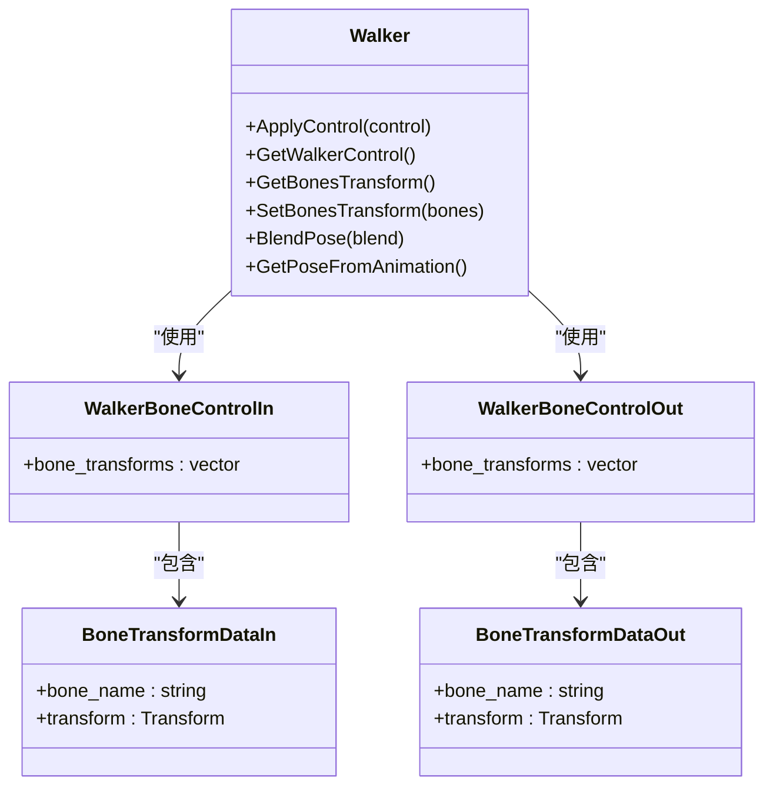

**图示来源**
- [Walker.cpp](https://github.com/carla-simulator/carla/blob/ue5-dev/LibCarla/source/carla/client/Walker.cpp#L25-L31)
- [Walker.h](https://github.com/carla-simulator/carla/blob/ue5-dev/LibCarla/source/carla/client/Walker.h#L35-L36)
- [WalkerBoneControlIn.h](https://github.com/carla-simulator/carla/blob/ue5-dev/LibCarla/source/carla/rpc/WalkerBoneControlIn.h#L25-L49)
- [WalkerBoneControlOut.h](https://github.com/carla-simulator/carla/blob/ue5-dev/LibCarla/source/carla/rpc/WalkerBoneControlOut.h#L25-L37)

### 姿态调整API
系统提供了多种姿态调整方法，包括：
- `BlendPose(float blend)`: 在动画姿态和控制姿态之间进行混合
- `ShowPose()`: 显示自定义姿态（等同于`BlendPose(1.0f)`）
- `HidePose()`: 隐藏自定义姿态（等同于`BlendPose(0.0f)`）
- `GetPoseFromAnimation()`: 从动画获取姿态

这些方法允许开发者在运行时动态调整行人的姿态，实现各种复杂的动作效果。

**本节来源**
- [Walker.cpp](https://github.com/carla-simulator/carla/blob/ue5-dev/LibCarla/source/carla/client/Walker.cpp#L33-L40)
- [Walker.h](https://github.com/carla-simulator/carla/blob/ue5-dev/LibCarla/source/carla/client/Walker.h#L37-L40)

## 行人导航与路径规划
行人导航系统基于Recast & Detour库实现，提供了完整的路径规划和导航功能。系统能够计算从起点到终点的最优路径，并处理各种导航事件。

### 导航架构
导航系统由`Navigation`类和`WalkerManager`类协同工作。`Navigation`类负责底层的路径计算，而`WalkerManager`类负责高层的路线管理和事件处理。

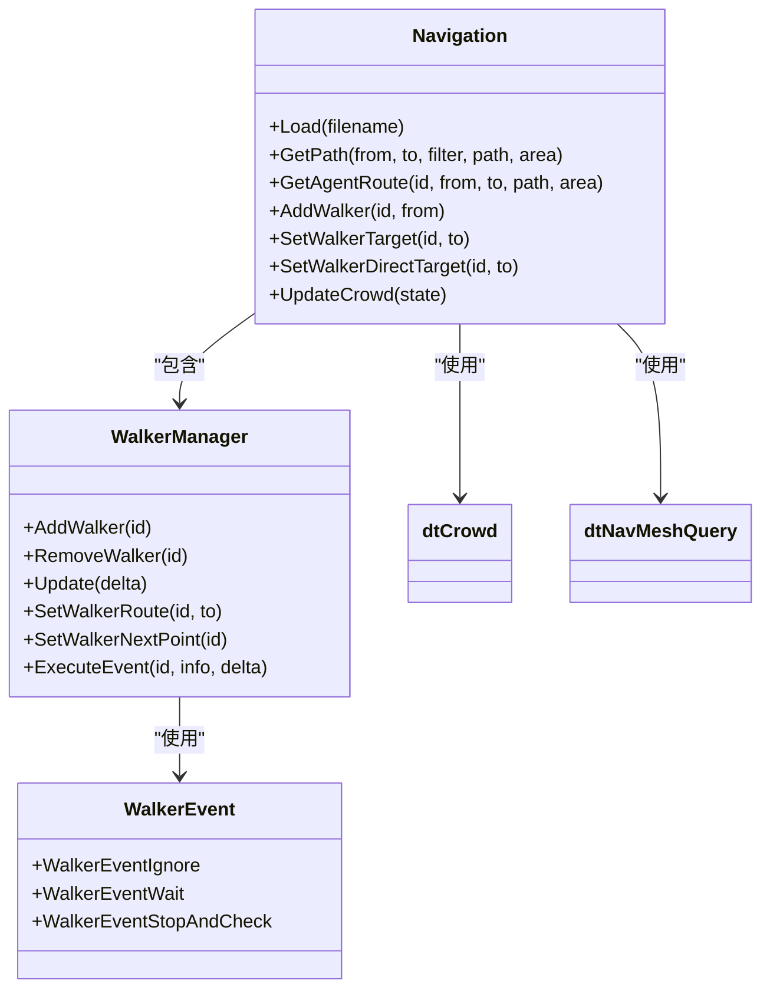

**图示来源**
- [Navigation.cpp](https://github.com/carla-simulator/carla/blob/ue5-dev/LibCarla/source/carla/nav/Navigation.cpp#L51-L800)
- [Navigation.h](https://github.com/carla-simulator/carla/blob/ue5-dev/LibCarla/source/carla/nav/Navigation.h#L57-L157)
- [WalkerManager.cpp](https://github.com/carla-simulator/carla/blob/ue5-dev/LibCarla/source/carla/nav/WalkerManager.cpp#L20-L329)
- [WalkerManager.h](https://github.com/carla-simulator/carla/blob/ue5-dev/LibCarla/source/carla/nav/WalkerManager.h#L48-L100)

### 路径规划算法
路径规划算法使用A*搜索在导航网格上寻找最优路径。系统支持多种区域类型和成本计算：

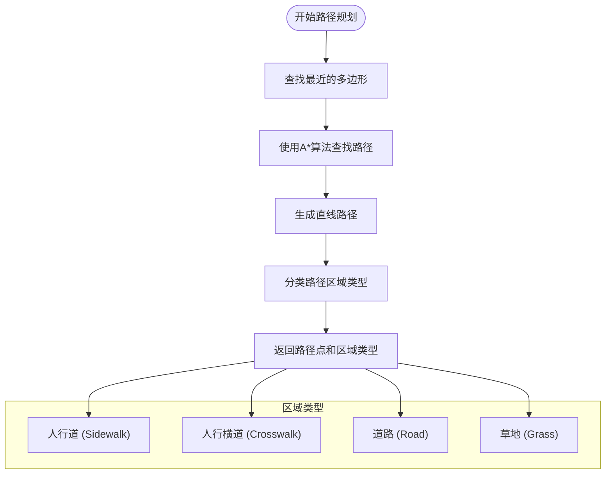

**本节来源**
- [Navigation.cpp](https://github.com/carla-simulator/carla/blob/ue5-dev/LibCarla/source/carla/nav/Navigation.cpp#L267-L370)
- [Navigation.h](https://github.com/carla-simulator/carla/blob/ue5-dev/LibCarla/source/carla/nav/Navigation.h#L26-L44)

## 与Traffic Manager的集成
行人系统与Traffic Manager紧密集成，实现了交通参与者之间的协同行为。这种集成确保了行人能够正确响应交通信号灯和车辆。

### 交通信号灯交互
`WalkerManager`类通过`GetAllTrafficLightWaypoints`方法收集所有交通信号灯的位置信息，并在行人过马路时检查相关信号灯的状态：

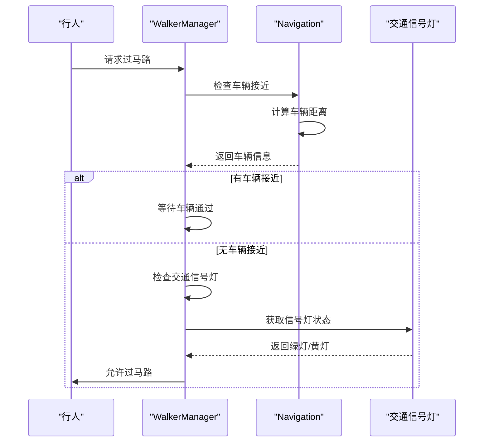

**图示来源**
- [WalkerManager.cpp](https://github.com/carla-simulator/carla/blob/ue5-dev/LibCarla/source/carla/nav/WalkerManager.cpp#L277-L324)
- [WalkerEvent.cpp](https://github.com/carla-simulator/carla/blob/ue5-dev/LibCarla/source/carla/nav/WalkerEvent.cpp#L28-L63)

### 协同工作机制
行人AI控制器通过`WalkerAIController`类与Traffic Manager协同工作。当行人需要移动时，系统会注册AI控制器并禁用物理模拟：

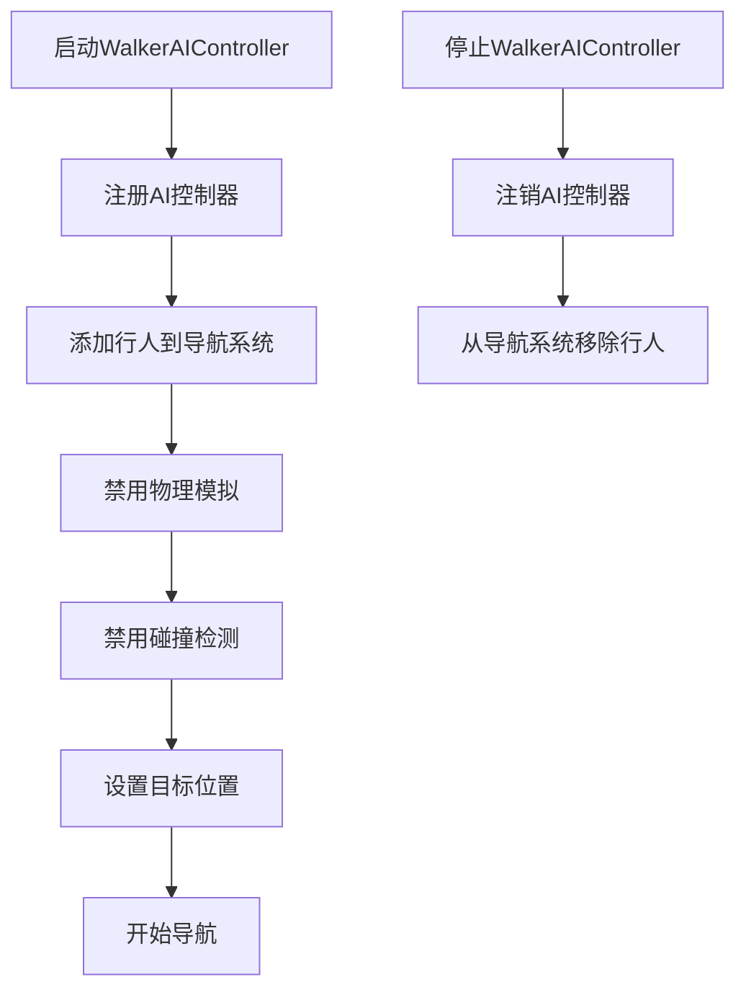

**本节来源**
- [WalkerAIController.cpp](https://github.com/carla-simulator/carla/blob/ue5-dev/LibCarla/source/carla/client/WalkerAIController.cpp#L18-L45)
- [WalkerAIController.h](https://github.com/carla-simulator/carla/blob/ue5-dev/LibCarla/source/carla/client/WalkerAIController.h#L22-L24)

## 群体行为模拟与交互机制
系统实现了复杂的群体行为模拟，包括行人之间的避让、群体移动和交互行为。

### 群体行为管理
`WalkerManager`类管理所有行人的状态和行为，支持多种状态转换：

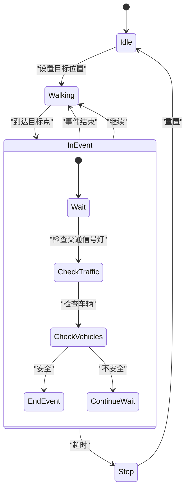

**本节来源**
- [WalkerManager.cpp](https://github.com/carla-simulator/carla/blob/ue5-dev/LibCarla/source/carla/nav/WalkerManager.cpp#L70-L107)
- [WalkerManager.h](https://github.com/carla-simulator/carla/blob/ue5-dev/LibCarla/source/carla/nav/WalkerManager.h#L23-L28)

### 交互事件类型
系统支持多种交互事件，通过`WalkerEvent`变体类型实现：

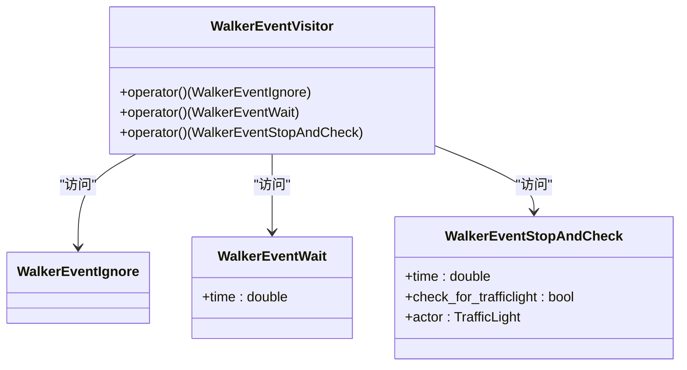

**图示来源**
- [WalkerEvent.h](https://github.com/carla-simulator/carla/blob/ue5-dev/LibCarla/source/carla/nav/WalkerEvent.h#L28-L55)
- [WalkerEvent.cpp](https://github.com/carla-simulator/carla/blob/ue5-dev/LibCarla/source/carla/nav/WalkerEvent.cpp#L15-L63)

## 避障行为与复杂场景移动
系统实现了先进的避障算法，确保行人在复杂场景中能够自然移动。

### 避障算法
避障功能基于Detour Crowd库实现，支持多种避障质量级别：

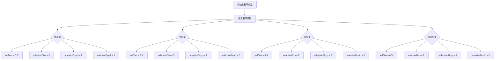

**本节来源**
- [Navigation.cpp](https://github.com/carla-simulator/carla/blob/ue5-dev/LibCarla/source/carla/nav/Navigation.cpp#L231-L263)

### 复杂场景移动
在复杂场景中，系统通过多种机制确保行人能够自然移动：

1. **区域成本计算**：不同区域有不同的移动成本
   - 人行道：成本1.0
   - 道路：成本10.0
   - 草地：成本1.0

2. **路径优化**：系统会自动选择最优路径
3. **动态调整**：根据环境变化实时调整路径

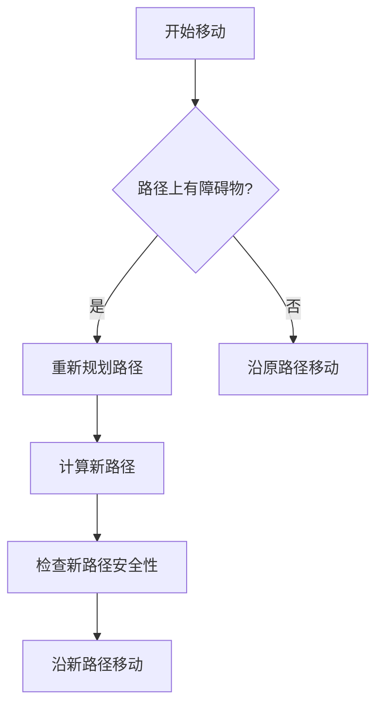

**本节来源**
- [Navigation.cpp](https://github.com/carla-simulator/carla/blob/ue5-dev/LibCarla/source/carla/nav/Navigation.cpp#L43-L45)
- [Navigation.cpp](https://github.com/carla-simulator/carla/blob/ue5-dev/LibCarla/source/carla/nav/Navigation.cpp#L220-L230)

## 碰撞检测与行为响应
系统实现了完整的碰撞检测机制，并提供了相应的行为响应策略。

### 碰撞检测
碰撞检测通过`HasVehicleNear`方法实现，检查指定距离内是否有车辆：

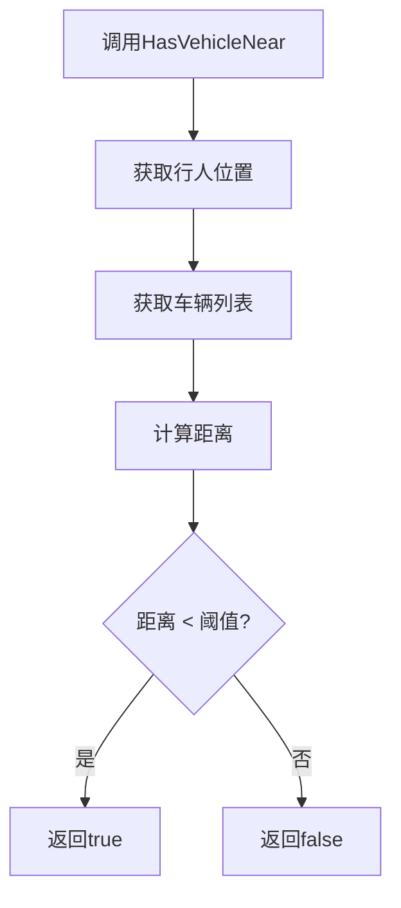

**本节来源**
- [Navigation.cpp](https://github.com/carla-simulator/carla/blob/ue5-dev/LibCarla/source/carla/nav/Navigation.cpp#L110)
- [Navigation.h](https://github.com/carla-simulator/carla/blob/ue5-dev/LibCarla/source/carla/nav/Navigation.h#L110)

### 行为响应机制
碰撞后的行为响应包括：

1. **暂停移动**：通过`PauseAgent`方法暂停行人移动
2. **重新规划路径**：遇到障碍物时重新计算路径
3. **死亡检测**：通过`IsWalkerAlive`方法检测行人状态

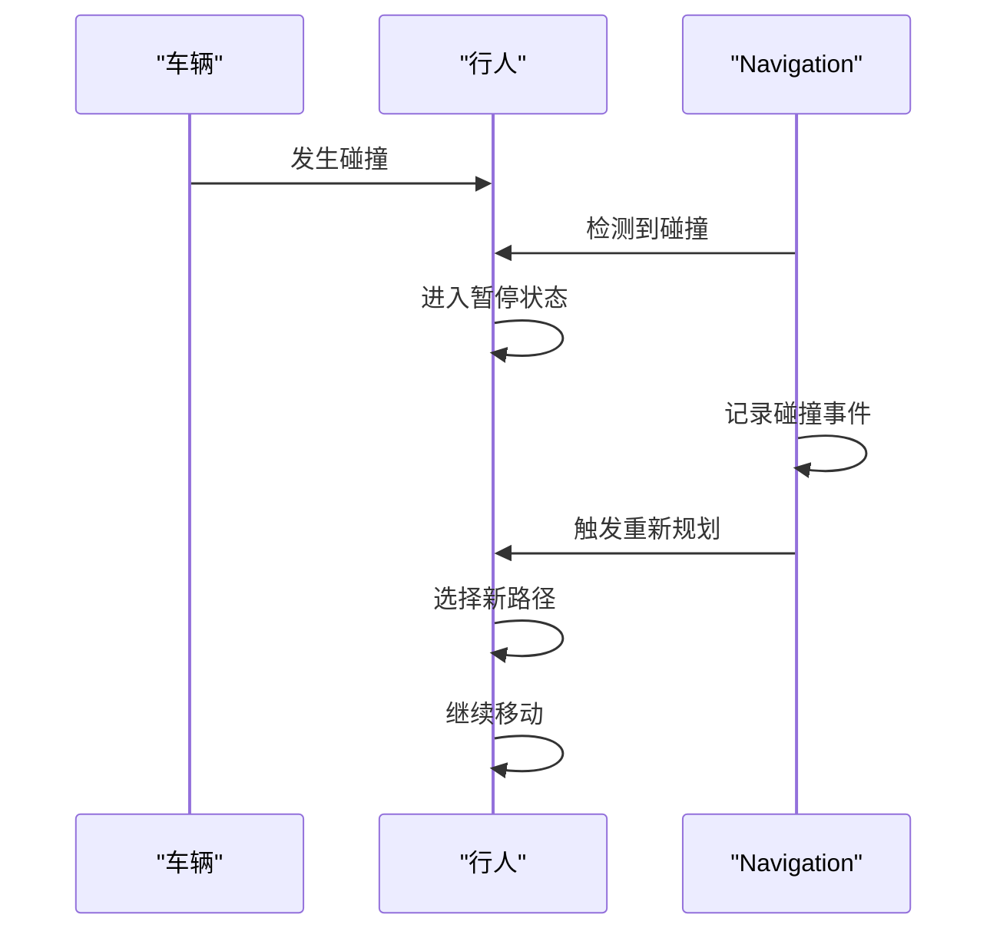

**本节来源**
- [Navigation.cpp](https://github.com/carla-simulator/carla/blob/ue5-dev/LibCarla/source/carla/nav/Navigation.cpp#L108)
- [Navigation.cpp](https://github.com/carla-simulator/carla/blob/ue5-dev/LibCarla/source/carla/nav/Navigation.cpp#L114)
- [Navigation.h](https://github.com/carla-simulator/carla/blob/ue5-dev/LibCarla/source/carla/nav/Navigation.h#L108-L114)

## 高级代码示例
本节提供高级代码示例，展示如何实现复杂的行人行为。

### 自然行走模式
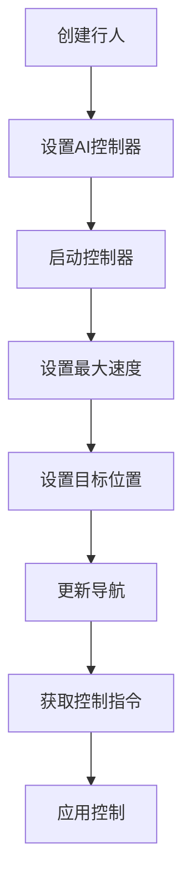

**本节来源**
- [WalkerAIController.cpp](https://github.com/carla-simulator/carla/blob/ue5-dev/LibCarla/source/carla/client/WalkerAIController.cpp#L55-L67)
- [Walker.cpp](https://github.com/carla-simulator/carla/blob/ue5-dev/LibCarla/source/carla/client/Walker.cpp#L14-L18)

### 群体移动示例
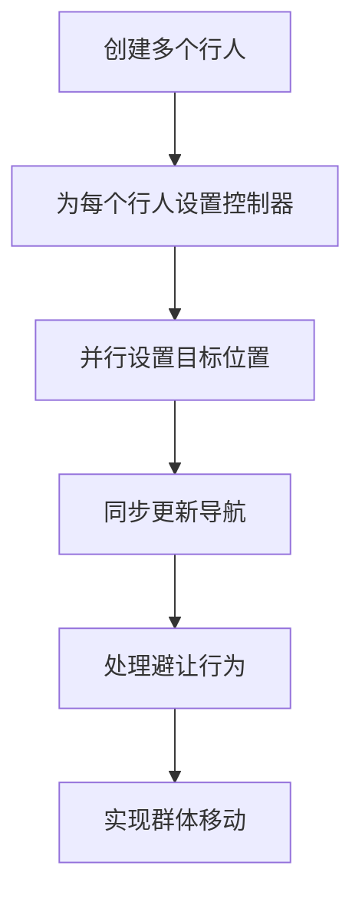

**本节来源**
- [Navigation.cpp](https://github.com/carla-simulator/carla/blob/ue5-dev/LibCarla/source/carla/nav/Navigation.cpp#L709-L732)
- [WalkerManager.cpp](https://github.com/carla-simulator/carla/blob/ue5-dev/LibCarla/source/carla/nav/WalkerManager.cpp#L61-L63)

## 结论
CARLA的行人高级行为控制系统提供了一套完整的解决方案，支持复杂的行人行为模拟。通过骨骼动画控制、智能导航、群体行为模拟和碰撞响应机制，开发者可以创建高度逼真的行人行为。系统与Traffic Manager的集成确保了交通参与者之间的协调，为自动驾驶测试提供了真实的交通环境。