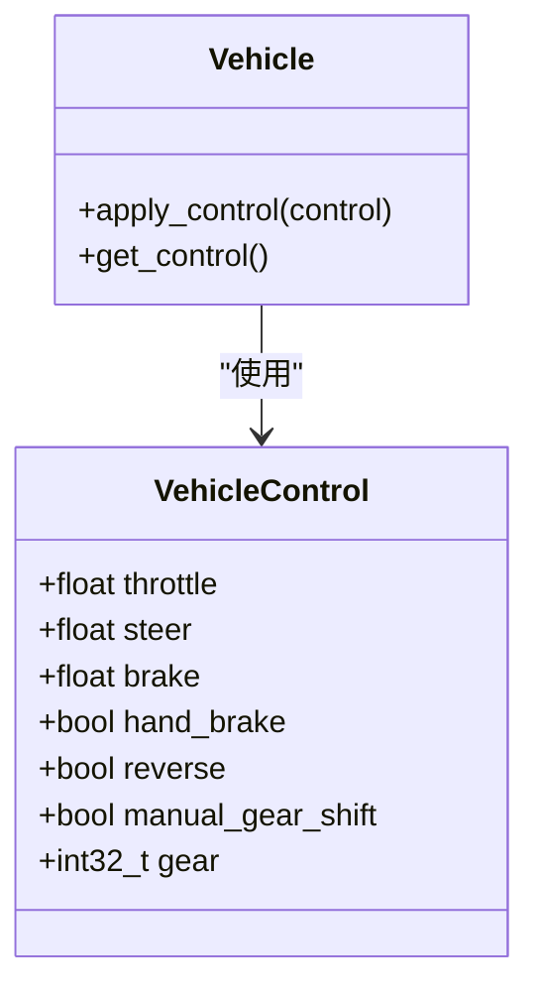
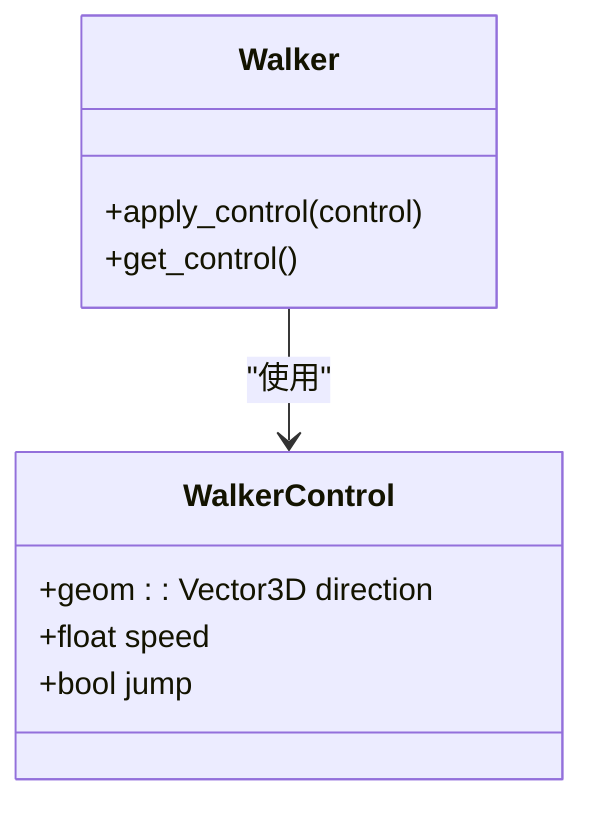
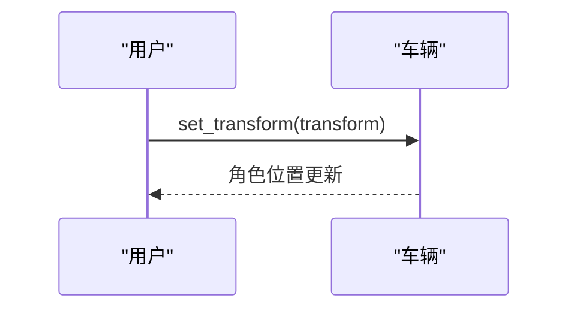
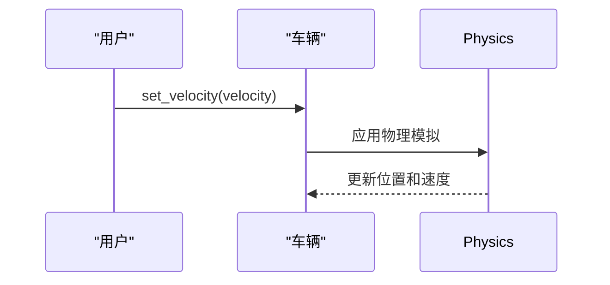
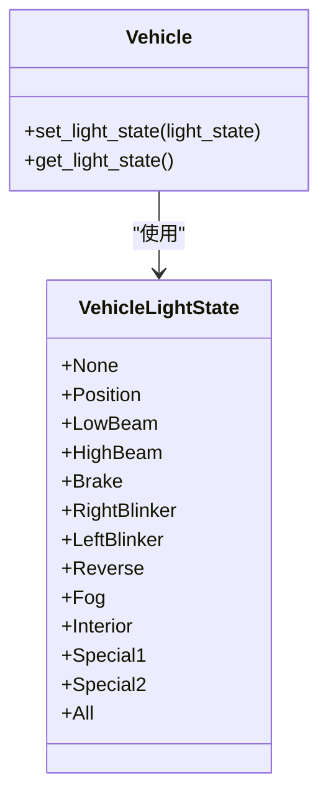
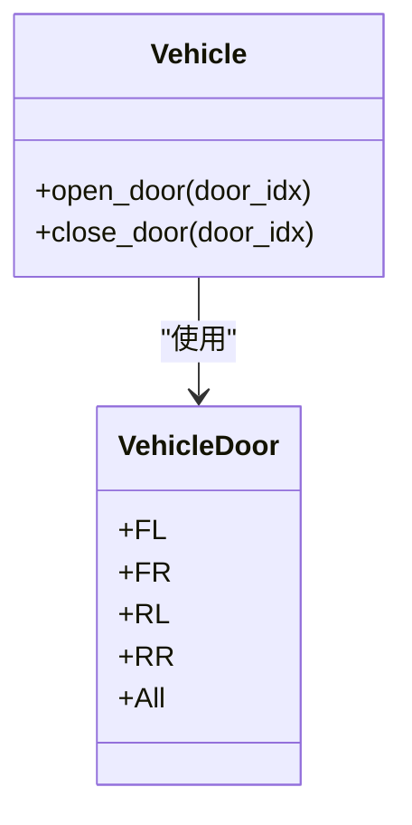
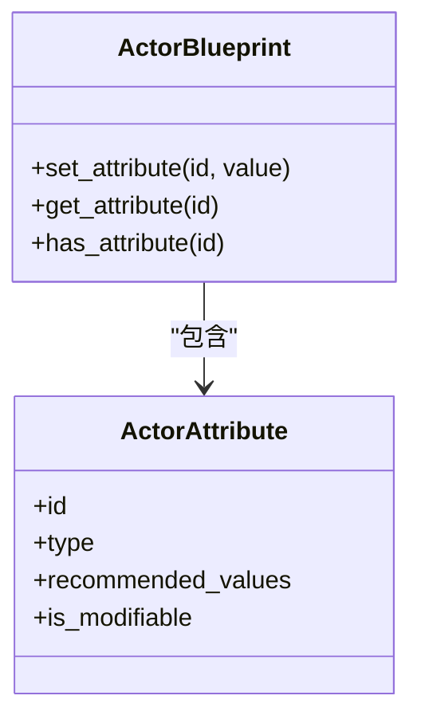

# 角色控制

**本文档中引用的文件**   
- [vehicle_doors_demo.py](https://github.com/carla-simulator/carla/blob/ue5-dev/PythonAPI/examples/vehicle_doors_demo.py)
- [vehicle_lights_demo.py](https://github.com/carla-simulator/carla/blob/ue5-dev/PythonAPI/examples/vehicle_lights_demo.py)
- [Vehicle.h](https://github.com/carla-simulator/carla/blob/ue5-dev/LibCarla/source/carla/client/Vehicle.h)
- [Walker.h](https://github.com/carla-simulator/carla/blob/ue5-dev/LibCarla/source/carla/client/Walker.h)
- [VehicleControl.h](https://github.com/carla-simulator/carla/blob/ue5-dev/LibCarla/source/carla/rpc/VehicleControl.h)
- [WalkerControl.h](https://github.com/carla-simulator/carla/blob/ue5-dev/LibCarla/source/carla/rpc/WalkerControl.h)
- [Actor.h](https://github.com/carla-simulator/carla/blob/ue5-dev/LibCarla/source/carla/client/Actor.h)
- [Control.cpp](https://github.com/carla-simulator/carla/blob/ue5-dev/PythonAPI/carla/src/Control.cpp)
- [Actor.cpp](https://github.com/carla-simulator/carla/blob/ue5-dev/PythonAPI/carla/src/Actor.cpp)
- [Blueprint.cpp](https://github.com/carla-simulator/carla/blob/ue5-dev/PythonAPI/carla/src/Blueprint.cpp)
- [ActorBlueprint.h](https://github.com/carla-simulator/carla/blob/ue5-dev/LibCarla/source/carla/client/ActorBlueprint.h)

## 目录
1. [简介](#简介)
2. [车辆控制接口](#车辆控制接口)
3. [行人控制接口](#行人控制接口)
4. [通用角色控制方法](#通用角色控制方法)
5. [车辆灯光与车门控制](#车辆灯光与车门控制)
6. [角色属性与蓝图定制](#角色属性与蓝图定制)
7. [控制示例与最佳实践](#控制示例与最佳实践)

## 简介
CARLA仿真平台提供了丰富的角色控制接口，允许用户精确控制车辆和行人的行为。本文档详细介绍了carla.Actor及其子类的控制机制，重点涵盖车辆的apply_control方法、行人的WalkerControl接口，以及通用的set_transform和set_velocity方法。文档还包含了车辆灯光和车门控制的实际示例，并解释了如何通过蓝图属性系统定制角色。

**Section sources**
- [vehicle_doors_demo.py](https://github.com/carla-simulator/carla/blob/ue5-dev/PythonAPI/examples/vehicle_doors_demo.py#L1-L113)
- [vehicle_lights_demo.py](https://github.com/carla-simulator/carla/blob/ue5-dev/PythonAPI/examples/vehicle_lights_demo.py#L1-L124)

## 车辆控制接口

### apply_control方法
车辆控制的核心是`apply_control`方法，它接受一个`VehicleControl`对象作为参数，该对象包含以下控制参数：

- **Throttle（油门）**: 浮点值，范围0.0到1.0，表示油门开度
- **Brake（刹车）**: 浮点值，范围0.0到1.0，表示刹车力度
- **Steer（转向）**: 浮点值，范围-1.0到1.0，表示方向盘转向角度（-1.0为最大左转，1.0为最大右转）
- **Hand Brake（手刹）**: 布尔值，true表示启用手刹
- **Reverse（倒车）**: 布尔值，true表示倒车模式
- **Manual Gear Shift（手动换挡）**: 布尔值，true表示手动换挡模式
- **Gear（档位）**: 整数值，表示当前档位

**Diagram sources **
- [VehicleControl.h](https://github.com/carla-simulator/carla/blob/ue5-dev/LibCarla/source/carla/rpc/VehicleControl.h#L20-L47)
- [Vehicle.h](https://github.com/carla-simulator/carla/blob/ue5-dev/LibCarla/source/carla/client/Vehicle.h#L53-L54)
- [Control.cpp](https://github.com/carla-simulator/carla/blob/ue5-dev/PythonAPI/carla/src/Control.cpp#L287-L306)

### 精确车辆动力学控制
对于需要精确车辆动力学控制的高级用户，CARLA提供了`ApplyPhysicsControl`方法，允许设置车辆的物理属性，包括：

- 扭矩曲线（torque_curve）
- 最大扭矩（max_torque）
- 最大转速（max_rpm）
- 差速器类型（differential_type）
- 轮胎物理参数
- 悬挂系统参数

这些参数可以通过`VehiclePhysicsControl`对象进行设置，实现对车辆动力学行为的精细控制。

**Section sources**
- [Vehicle.h](https://github.com/carla-simulator/carla/blob/ue5-dev/LibCarla/source/carla/client/Vehicle.h#L66-L67)
- [Control.cpp](https://github.com/carla-simulator/carla/blob/ue5-dev/PythonAPI/carla/src/Control.cpp#L454-L490)

## 行人控制接口

### WalkerControl接口
行人的控制通过`WalkerControl`接口实现，该接口包含以下主要参数：

- **Direction（方向）**: 一个三维向量，表示行人的移动方向
- **Speed（速度）**: 浮点值，表示行人的移动速度（单位：米/秒）
- **Jump（跳跃）**: 布尔值，表示是否执行跳跃动作

**Diagram sources **
- [WalkerControl.h](https://github.com/carla-simulator/carla/blob/ue5-dev/LibCarla/source/carla/rpc/WalkerControl.h#L20-L37)
- [Walker.h](https://github.com/carla-simulator/carla/blob/ue5-dev/LibCarla/source/carla/client/Walker.h#L27-L28)
- [Control.cpp](https://github.com/carla-simulator/carla/blob/ue5-dev/PythonAPI/carla/src/Control.cpp#L344-L355)

### 移动控制机制
行人的移动控制机制基于方向向量和速度的组合。通过设置不同的方向向量，可以实现行人在三维空间中的任意方向移动。速度参数控制移动的快慢，而跳跃参数可以触发行人的跳跃动画。

**Section sources**
- [Walker.h](https://github.com/carla-simulator/carla/blob/ue5-dev/LibCarla/source/carla/client/Walker.h#L27-L33)

## 通用角色控制方法

### set_transform方法
`set_transform`方法用于将角色直接传送到指定的变换位置，包括位置和旋转。这个方法会立即改变角色的位置，不考虑物理模拟。

**Diagram sources **
- [Actor.h](https://github.com/carla-simulator/carla/blob/ue5-dev/LibCarla/source/carla/client/Actor.h#L79-L80)
- [Actor.cpp](https://github.com/carla-simulator/carla/blob/ue5-dev/PythonAPI/carla/src/Actor.cpp#L126-L127)

### set_velocity方法
`set_velocity`方法用于设置角色的目标速度，在应用物理之前。这与`set_transform`不同，它会考虑物理模拟。

**Diagram sources **
- [Actor.h](https://github.com/carla-simulator/carla/blob/ue5-dev/LibCarla/source/carla/client/Actor.h#L82-L83)
- [Actor.cpp](https://github.com/carla-simulator/carla/blob/ue5-dev/PythonAPI/carla/src/Actor.cpp#L127-L128)

### 批量操作技巧
对于需要同时控制多个角色的场景，可以使用批量操作技巧。通过将多个控制命令组合成一个批处理，可以提高控制效率并确保操作的原子性。

**Section sources**
- [Actor.h](https://github.com/carla-simulator/carla/blob/ue5-dev/LibCarla/source/carla/client/Actor.h#L79-L83)
- [Actor.cpp](https://github.com/carla-simulator/carla/blob/ue5-dev/PythonAPI/carla/src/Actor.cpp#L126-L128)

## 车辆灯光与车门控制

### 车辆灯光控制
车辆灯光控制通过`set_light_state`和`get_light_state`方法实现。灯光状态使用位标志组合，支持以下灯光类型：

- Position（位置灯）
- LowBeam（近光灯）
- HighBeam（远光灯）
- Brake（刹车灯）
- RightBlinker（右转向灯）
- LeftBlinker（左转向灯）
- Reverse（倒车灯）
- Fog（雾灯）
- Interior（内饰灯）
- Special1/Special2（特殊灯）

**Diagram sources **
- [Actor.cpp](https://github.com/carla-simulator/carla/blob/ue5-dev/PythonAPI/carla/src/Actor.cpp#L145-L158)
- [vehicle_lights_demo.py](https://github.com/carla-simulator/carla/blob/ue5-dev/PythonAPI/examples/vehicle_lights_demo.py#L65-L109)

### 车辆车门控制
车辆车门控制通过`open_door`和`close_door`方法实现。支持的车门位置包括：

- FL（前左门）
- FR（前右门）
- RL（后左门）
- RR（后右门）
- All（所有车门）

**Diagram sources **
- [Actor.cpp](https://github.com/carla-simulator/carla/blob/ue5-dev/PythonAPI/carla/src/Actor.cpp#L170-L176)
- [vehicle_doors_demo.py](https://github.com/carla-simulator/carla/blob/ue5-dev/PythonAPI/examples/vehicle_doors_demo.py#L76-L97)

## 角色属性与蓝图定制

### Actor属性系统
CARLA的角色属性系统允许在运行时查询和修改角色的属性。每个角色都有一个属性字典，可以通过`attributes`属性访问。

### Blueprint的set_attribute方法
蓝图的`set_attribute`方法用于在创建角色前定制其属性。常见的可设置属性包括：

- **color（颜色）**: 设置车辆颜色
- **is_invincible（无敌）**: 设置角色是否无敌
- **driver_id（驾驶员ID）**: 设置驾驶员特征
- **role_name（角色名称）**: 设置角色名称

**Diagram sources **
- [ActorBlueprint.h](https://github.com/carla-simulator/carla/blob/ue5-dev/LibCarla/source/carla/client/ActorBlueprint.h#L86-L87)
- [Blueprint.cpp](https://github.com/carla-simulator/carla/blob/ue5-dev/PythonAPI/carla/src/Blueprint.cpp#L95-L96)
- [Actor.cpp](https://github.com/carla-simulator/carla/blob/ue5-dev/PythonAPI/carla/src/Actor.cpp#L109-L115)

## 控制示例与最佳实践

### 基础车辆控制示例
对于初学者，以下是一个基础的车辆控制示例：

1. 创建车辆控制对象
2. 设置油门、刹车和转向参数
3. 应用控制到车辆

### 高级控制技巧
对于高级用户，建议使用以下技巧：

- 使用Ackermann控制模型进行更真实的车辆动力学模拟
- 利用物理控制接口微调车辆性能
- 使用批量操作提高多角色控制效率
- 结合传感器数据实现闭环控制

**Section sources**
- [vehicle_doors_demo.py](https://github.com/carla-simulator/carla/blob/ue5-dev/PythonAPI/examples/vehicle_doors_demo.py#L59-L98)
- [vehicle_lights_demo.py](https://github.com/carla-simulator/carla/blob/ue5-dev/PythonAPI/examples/vehicle_lights_demo.py#L59-L109)
- [manual_control.py](https://github.com/carla-simulator/carla/blob/ue5-dev/PythonAPI/examples/manual_control.py#L386-L611)