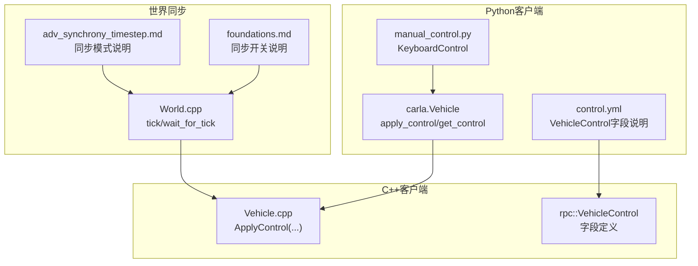
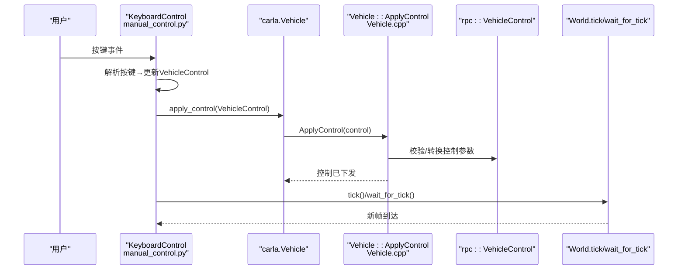
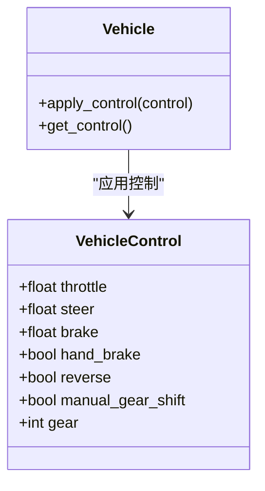
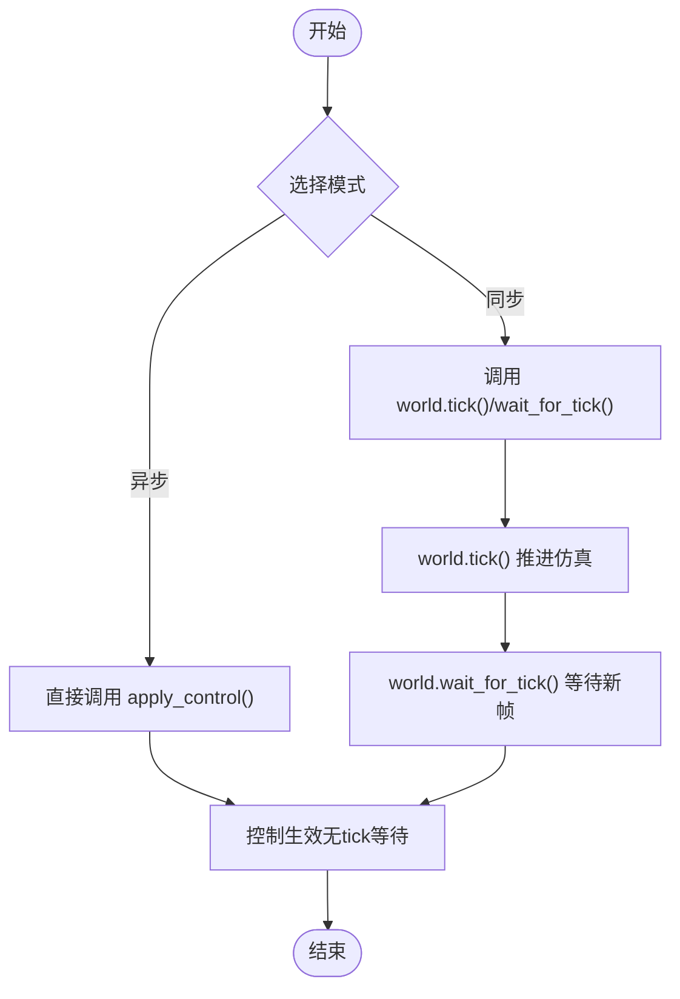
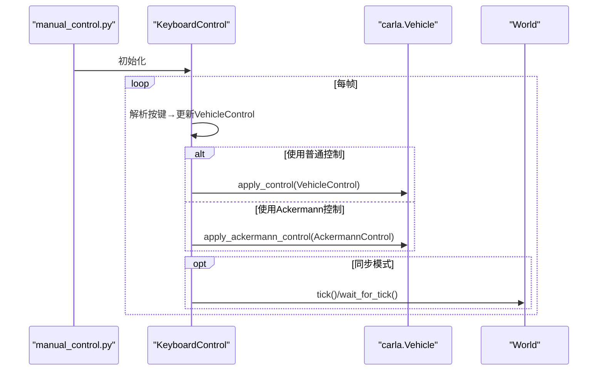
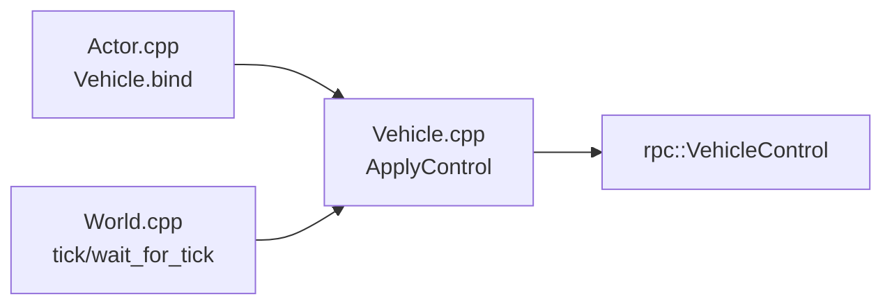

# 基础车辆控制

**本文引用的文件**
- [LibCarla/source/carla/rpc/VehicleControl.h](https://github.com/carla-simulator/carla/blob/ue5-dev/LibCarla/source/carla/rpc/VehicleControl.h)
- [LibCarla/source/carla/client/Vehicle.cpp](https://github.com/carla-simulator/carla/blob/ue5-dev/LibCarla/source/carla/client/Vehicle.cpp)
- [PythonAPI/examples/manual_control.py](https://github.com/carla-simulator/carla/blob/ue5-dev/PythonAPI/examples/manual_control.py)
- [PythonAPI/docs/control.yml](https://github.com/carla-simulator/carla/blob/ue5-dev/PythonAPI/docs/control.yml)
- [PythonAPI/docs/world.yml](https://github.com/carla-simulator/carla/blob/ue5-dev/PythonAPI/docs/world.yml)
- [LibCarla/source/carla/client/World.cpp](https://github.com/carla-simulator/carla/blob/ue5-dev/LibCarla/source/carla/client/World.cpp)
- [Docs/adv_synchrony_timestep.md](https://github.com/carla-simulator/carla/blob/ue5-dev/Docs/adv_synchrony_timestep.md)
- [Docs/foundations.md](https://github.com/carla-simulator/carla/blob/ue5-dev/Docs/foundations.md)
- [PythonAPI/carla/src/Actor.cpp](https://github.com/carla-simulator/carla/blob/ue5-dev/PythonAPI/carla/src/Actor.cpp)

## 目录
1. [简介](#简介)
2. [项目结构](#项目结构)
3. [核心组件](#核心组件)
4. [架构总览](#架构总览)
5. [详细组件分析](#详细组件分析)
6. [依赖关系分析](#依赖关系分析)
7. [性能考量](#性能考量)
8. [故障排查指南](#故障排查指南)
9. [结论](#结论)
10. [附录](#附录)

## 简介
本文件围绕 CARLA 的基础车辆控制展开，重点讲解 Python 客户端中 carla.Vehicle 类的 apply_control 方法，以及 VehicleControl 参数对象的各字段含义与用法。同时覆盖同步/异步模式下的控制应用方式，结合 manual_control.py 示例说明键盘输入驱动的手动驾驶流程，并给出控制命令频率、常见问题与调试建议，帮助初学者快速掌握车辆控制。

## 项目结构
与“基础车辆控制”直接相关的核心位置：
- Python 客户端接口层：暴露 Vehicle.apply_control、Vehicle.get_control 等方法
- C++ 客户端实现层：Vehicle::ApplyControl 将控制下发至服务器
- 世界同步机制：World.tick()/wait_for_tick() 控制仿真步进
- 文档与示例：control.yml 描述 VehicleControl 字段；manual_control.py 展示键盘输入与控制应用

图表来源
- [PythonAPI/carla/src/Actor.cpp](https://github.com/carla-simulator/carla/blob/ue5-dev/PythonAPI/carla/src/Actor.cpp#L185-L200)
- [LibCarla/source/carla/client/Vehicle.cpp](https://github.com/carla-simulator/carla/blob/ue5-dev/LibCarla/source/carla/client/Vehicle.cpp#L51-L56)
- [LibCarla/source/carla/rpc/VehicleControl.h](https://github.com/carla-simulator/carla/blob/ue5-dev/LibCarla/source/carla/rpc/VehicleControl.h#L41-L47)
- [LibCarla/source/carla/client/World.cpp](https://github.com/carla-simulator/carla/blob/ue5-dev/LibCarla/source/carla/client/World.cpp#L142-L161)
- [Docs/adv_synchrony_timestep.md](https://github.com/carla-simulator/carla/blob/ue5-dev/Docs/adv_synchrony_timestep.md#L139-L186)
- [Docs/foundations.md](https://github.com/carla-simulator/carla/blob/ue5-dev/Docs/foundations.md#L101-L121)

章节来源
- [PythonAPI/carla/src/Actor.cpp](https://github.com/carla-simulator/carla/blob/ue5-dev/PythonAPI/carla/src/Actor.cpp#L185-L200)
- [LibCarla/source/carla/client/Vehicle.cpp](https://github.com/carla-simulator/carla/blob/ue5-dev/LibCarla/source/carla/client/Vehicle.cpp#L51-L56)
- [LibCarla/source/carla/rpc/VehicleControl.h](https://github.com/carla-simulator/carla/blob/ue5-dev/LibCarla/source/carla/rpc/VehicleControl.h#L41-L47)
- [LibCarla/source/carla/client/World.cpp](https://github.com/carla-simulator/carla/blob/ue5-dev/LibCarla/source/carla/client/World.cpp#L142-L161)
- [Docs/adv_synchrony_timestep.md](https://github.com/carla-simulator/carla/blob/ue5-dev/Docs/adv_synchrony_timestep.md#L139-L186)
- [Docs/foundations.md](https://github.com/carla-simulator/carla/blob/ue5-dev/Docs/foundations.md#L101-L121)

## 核心组件
- 车辆控制对象 VehicleControl
  - 字段：throttle（油门，0.0-1.0）、brake（刹车，0.0-1.0）、steer（转向，-1.0 到 1.0，左负右正）、hand_brake（手刹，布尔）、reverse（倒车，布尔）、manual_gear_shift（手动换挡，布尔）、gear（档位，整数）
- 车辆类 Vehicle
  - apply_control(control)：应用控制命令
  - get_control()：获取当前控制状态
- 世界同步机制
  - world.tick()：发送 tick，推进仿真一步
  - world.wait_for_tick()：等待下一帧快照
  - 同步模式开关：通过 world.apply_settings 设置同步模式

章节来源
- [PythonAPI/docs/control.yml](https://github.com/carla-simulator/carla/blob/ue5-dev/PythonAPI/docs/control.yml#L12-L46)
- [LibCarla/source/carla/rpc/VehicleControl.h](https://github.com/carla-simulator/carla/blob/ue5-dev/LibCarla/source/carla/rpc/VehicleControl.h#L41-L47)
- [PythonAPI/carla/src/Actor.cpp](https://github.com/carla-simulator/carla/blob/ue5-dev/PythonAPI/carla/src/Actor.cpp#L185-L200)
- [LibCarla/source/carla/client/World.cpp](https://github.com/carla-simulator/carla/blob/ue5-dev/LibCarla/source/carla/client/World.cpp#L142-L161)
- [Docs/adv_synchrony_timestep.md](https://github.com/carla-simulator/carla/blob/ue5-dev/Docs/adv_synchrony_timestep.md#L139-L186)

## 架构总览
从键盘输入到车辆控制生效的关键路径如下：

图表来源
- [PythonAPI/examples/manual_control.py](https://github.com/carla-simulator/carla/blob/ue5-dev/PythonAPI/examples/manual_control.py#L581-L605)
- [LibCarla/source/carla/client/Vehicle.cpp](https://github.com/carla-simulator/carla/blob/ue5-dev/LibCarla/source/carla/client/Vehicle.cpp#L51-L56)
- [LibCarla/source/carla/rpc/VehicleControl.h](https://github.com/carla-simulator/carla/blob/ue5-dev/LibCarla/source/carla/rpc/VehicleControl.h#L41-L47)
- [LibCarla/source/carla/client/World.cpp](https://github.com/carla-simulator/carla/blob/ue5-dev/LibCarla/source/carla/client/World.cpp#L142-L161)

## 详细组件分析

### VehicleControl 参数详解
- throttle（油门，0.0-1.0）
  - 用于加速，数值越大加速度越大
- brake（刹车，0.0-1.0）
  - 用于减速或驻车，数值越大制动力越大
- steer（转向，-1.0 到 1.0）
  - 左负右正，绝对值越大转角越大
- hand_brake（手刹，布尔）
  - 手刹开启时，通常对后轮施加制动力
- reverse（倒车，布尔）
  - 为真时车辆向后运动；需配合 gear 或自动/手动换挡
- manual_gear_shift（手动换挡，布尔）
  - 开启后可手动设置 gear
- gear（档位，整数）
  - 正数前进档，负数倒档，0 为空档

章节来源
- [PythonAPI/docs/control.yml](https://github.com/carla-simulator/carla/blob/ue5-dev/PythonAPI/docs/control.yml#L12-L46)
- [LibCarla/source/carla/rpc/VehicleControl.h](https://github.com/carla-simulator/carla/blob/ue5-dev/LibCarla/source/carla/rpc/VehicleControl.h#L41-L47)

### apply_control 的调用链与实现要点
- Python 层：Vehicle.apply_control(control)
- C++ 实现：Vehicle::ApplyControl(control)
  - 若控制不粘性或与上次不同，则下发给服务器
- 服务器侧：Episode 接收并应用控制，随后在下一帧生效

图表来源
- [PythonAPI/carla/src/Actor.cpp](https://github.com/carla-simulator/carla/blob/ue5-dev/PythonAPI/carla/src/Actor.cpp#L185-L200)
- [LibCarla/source/carla/client/Vehicle.cpp](https://github.com/carla-simulator/carla/blob/ue5-dev/LibCarla/source/carla/client/Vehicle.cpp#L51-L56)
- [LibCarla/source/carla/rpc/VehicleControl.h](https://github.com/carla-simulator/carla/blob/ue5-dev/LibCarla/source/carla/rpc/VehicleControl.h#L41-L47)

章节来源
- [PythonAPI/carla/src/Actor.cpp](https://github.com/carla-simulator/carla/blob/ue5-dev/PythonAPI/carla/src/Actor.cpp#L185-L200)
- [LibCarla/source/carla/client/Vehicle.cpp](https://github.com/carla-simulator/carla/blob/ue5-dev/LibCarla/source/carla/client/Vehicle.cpp#L51-L56)

### 同步与异步控制模式
- 异步模式
  - 不需要显式 tick，控制立即下发
  - 适合快速交互，但传感器数据可能跨帧
- 同步模式
  - 需要显式调用 world.tick() 推进仿真
  - 可通过 world.wait_for_tick() 等待新帧到达
  - 适合多传感器同步采集

图表来源
- [Docs/adv_synchrony_timestep.md](https://github.com/carla-simulator/carla/blob/ue5-dev/Docs/adv_synchrony_timestep.md#L139-L186)
- [LibCarla/source/carla/client/World.cpp](https://github.com/carla-simulator/carla/blob/ue5-dev/LibCarla/source/carla/client/World.cpp#L142-L161)

章节来源
- [Docs/adv_synchrony_timestep.md](https://github.com/carla-simulator/carla/blob/ue5-dev/Docs/adv_synchrony_timestep.md#L139-L186)
- [Docs/foundations.md](https://github.com/carla-simulator/carla/blob/ue5-dev/Docs/foundations.md#L101-L121)
- [LibCarla/source/carla/client/World.cpp](https://github.com/carla-simulator/carla/blob/ue5-dev/LibCarla/source/carla/client/World.cpp#L142-L161)

### 手动驾驶流程（manual_control.py）
- 初始化：KeyboardControl 创建 VehicleControl 和 VehicleAckermannControl，设置灯光与自动驾驶
- 键盘解析：根据按键更新 throttle、brake、steer、hand_brake、reverse、gear 等
- 应用控制：调用 world.player.apply_control(self._control) 或 apply_ackermann_control
- 同步推进：在同步模式下循环调用 world.tick() 并等待 world.wait_for_tick()

图表来源
- [PythonAPI/examples/manual_control.py](https://github.com/carla-simulator/carla/blob/ue5-dev/PythonAPI/examples/manual_control.py#L386-L605)
- [LibCarla/source/carla/client/World.cpp](https://github.com/carla-simulator/carla/blob/ue5-dev/LibCarla/source/carla/client/World.cpp#L142-L161)

章节来源
- [PythonAPI/examples/manual_control.py](https://github.com/carla-simulator/carla/blob/ue5-dev/PythonAPI/examples/manual_control.py#L386-L605)

### 控制命令频率与常见问题
- 频率建议
  - 建议每帧至少应用一次控制，以获得顺滑响应
  - 在同步模式下，控制应在 tick 循环内应用，避免跨帧错位
- 常见问题
  - 控制延迟：检查是否在同步模式下正确调用 world.tick()/wait_for_tick()
  - 转向过度：限制 steer 的变化速率，使用缓存平滑（参考 manual_control.py 中 steer_cache 的处理）
  - 倒车切换：注意 reverse 与 gear 的联动，避免静止状态下误触发倒车
- 调试建议
  - 打开车辆遥测（show_debug_telemetry），观察控制与物理响应
  - 使用 HUD 显示当前控制状态，核对 throttle/brake/steer/hand_brake/reverse/gear
  - 在异步模式下，若出现交通模拟不稳定，考虑切换到同步模式

章节来源
- [PythonAPI/examples/manual_control.py](https://github.com/carla-simulator/carla/blob/ue5-dev/PythonAPI/examples/manual_control.py#L581-L605)
- [PythonAPI/examples/manual_control.py](https://github.com/carla-simulator/carla/blob/ue5-dev/PythonAPI/examples/manual_control.py#L612-L651)
- [PythonAPI/docs/control.yml](https://github.com/carla-simulator/carla/blob/ue5-dev/PythonAPI/docs/control.yml#L12-L46)

## 依赖关系分析
- Python 层 Vehicle.apply_control 依赖 C++ 层 Vehicle::ApplyControl
- Vehicle::ApplyControl 依赖 rpc::VehicleControl 结构体
- 同步模式依赖 World.tick()/wait_for_tick() 与 Episode 状态管理

图表来源
- [PythonAPI/carla/src/Actor.cpp](https://github.com/carla-simulator/carla/blob/ue5-dev/PythonAPI/carla/src/Actor.cpp#L185-L200)
- [LibCarla/source/carla/client/Vehicle.cpp](https://github.com/carla-simulator/carla/blob/ue5-dev/LibCarla/source/carla/client/Vehicle.cpp#L51-L56)
- [LibCarla/source/carla/rpc/VehicleControl.h](https://github.com/carla-simulator/carla/blob/ue5-dev/LibCarla/source/carla/rpc/VehicleControl.h#L41-L47)
- [LibCarla/source/carla/client/World.cpp](https://github.com/carla-simulator/carla/blob/ue5-dev/LibCarla/source/carla/client/World.cpp#L142-L161)

章节来源
- [PythonAPI/carla/src/Actor.cpp](https://github.com/carla-simulator/carla/blob/ue5-dev/PythonAPI/carla/src/Actor.cpp#L185-L200)
- [LibCarla/source/carla/client/Vehicle.cpp](https://github.com/carla-simulator/carla/blob/ue5-dev/LibCarla/source/carla/client/Vehicle.cpp#L51-L56)
- [LibCarla/source/carla/rpc/VehicleControl.h](https://github.com/carla-simulator/carla/blob/ue5-dev/LibCarla/source/carla/rpc/VehicleControl.h#L41-L47)
- [LibCarla/source/carla/client/World.cpp](https://github.com/carla-simulator/carla/blob/ue5-dev/LibCarla/source/carla/client/World.cpp#L142-L161)

## 性能考量
- 控制频率与帧率匹配：在同步模式下，控制应用应与 tick 周期一致，避免过高的控制频率造成不必要的网络/计算压力
- 转向平滑：对 steer 进行缓存与限幅，减少高频抖动
- 手动/自动换挡：合理设置 gear_change_time 与档位切换策略，避免频繁切换导致响应迟滞

## 故障排查指南
- 未生效的控制
  - 检查是否处于同步模式且正确调用了 world.tick()/wait_for_tick()
  - 确认 apply_control 是否在每帧被调用
- 转向抖动或过度
  - 使用 steer_cache 平滑转向，限制 steer 的变化速率
- 倒车切换异常
  - 确保在静止状态下再切换 reverse，并正确设置 gear
- 多传感器同步
  - 在同步模式下，先采集传感器数据，再调用 world.tick()，最后等待 world.wait_for_tick()

章节来源
- [PythonAPI/examples/manual_control.py](https://github.com/carla-simulator/carla/blob/ue5-dev/PythonAPI/examples/manual_control.py#L612-L651)
- [Docs/adv_synchrony_timestep.md](https://github.com/carla-simulator/carla/blob/ue5-dev/Docs/adv_synchrony_timestep.md#L139-L186)

## 结论
通过理解 VehicleControl 的字段语义、apply_control 的调用链以及同步/异步模式下的推进机制，可以稳定地实现手动驾驶与自动化控制。结合 manual_control.py 的示例，开发者能够快速搭建基于键盘输入的控制流，并在同步模式下保证多传感器数据的时间一致性。

## 附录
- 关键 API 与路径
  - VehicleControl 字段说明：[PythonAPI/docs/control.yml](https://github.com/carla-simulator/carla/blob/ue5-dev/PythonAPI/docs/control.yml#L12-L46)
  - apply_control 绑定：[PythonAPI/carla/src/Actor.cpp](https://github.com/carla-simulator/carla/blob/ue5-dev/PythonAPI/carla/src/Actor.cpp#L185-L200)
  - apply_control 实现：[LibCarla/source/carla/client/Vehicle.cpp](https://github.com/carla-simulator/carla/blob/ue5-dev/LibCarla/source/carla/client/Vehicle.cpp#L51-L56)
  - 同步模式推进：[LibCarla/source/carla/client/World.cpp](https://github.com/carla-simulator/carla/blob/ue5-dev/LibCarla/source/carla/client/World.cpp#L142-L161)
  - 手动驾驶示例：[PythonAPI/examples/manual_control.py](https://github.com/carla-simulator/carla/blob/ue5-dev/PythonAPI/examples/manual_control.py#L386-L605)