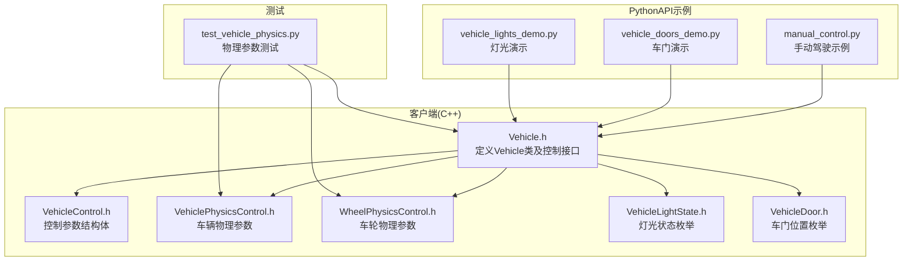
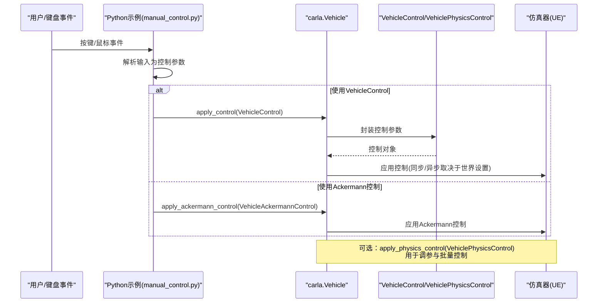
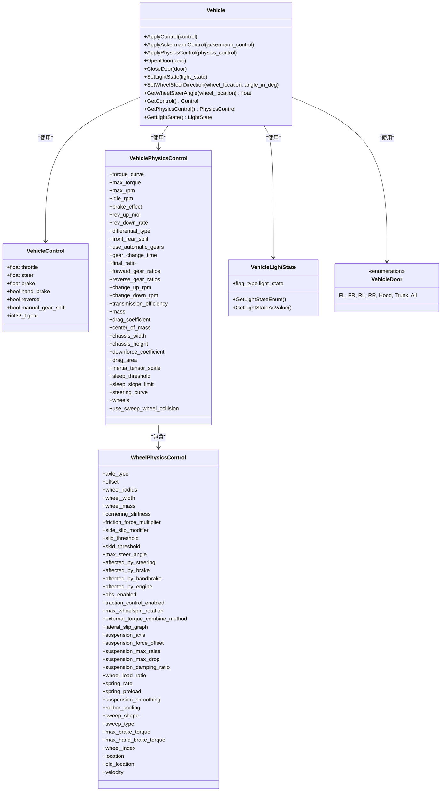

# 车辆控制

**本文引用的文件**
- [Vehicle.h](https://github.com/carla-simulator/carla/blob/ue5-dev/LibCarla/source/carla/client/Vehicle.h)
- [VehicleControl.h](https://github.com/carla-simulator/carla/blob/ue5-dev/LibCarla/source/carla/rpc/VehicleControl.h)
- [VehiclePhysicsControl.h](https://github.com/carla-simulator/carla/blob/ue5-dev/LibCarla/source/carla/rpc/VehiclePhysicsControl.h)
- [WheelPhysicsControl.h](https://github.com/carla-simulator/carla/blob/ue5-dev/LibCarla/source/carla/rpc/WheelPhysicsControl.h)
- [VehicleLightState.h](https://github.com/carla-simulator/carla/blob/ue5-dev/LibCarla/source/carla/rpc/VehicleLightState.h)
- [VehicleDoor.h](https://github.com/carla-simulator/carla/blob/ue5-dev/LibCarla/source/carla/rpc/VehicleDoor.h)
- [vehicle_doors_demo.py](https://github.com/carla-simulator/carla/blob/ue5-dev/PythonAPI/examples/vehicle_doors_demo.py)
- [vehicle_lights_demo.py](https://github.com/carla-simulator/carla/blob/ue5-dev/PythonAPI/examples/vehicle_lights_demo.py)
- [manual_control.py](https://github.com/carla-simulator/carla/blob/ue5-dev/PythonAPI/examples/manual_control.py)
- [test_vehicle_physics.py](https://github.com/carla-simulator/carla/blob/ue5-dev/PythonAPI/test/test_vehicle_physics.py)

## 目录
1. [简介](#简介)
2. [项目结构](#项目结构)
3. [核心组件](#核心组件)
4. [架构总览](#架构总览)
5. [详细组件分析](#详细组件分析)
6. [依赖关系分析](#依赖关系分析)
7. [性能考量](#性能考量)
8. [故障排查指南](#故障排查指南)
9. [结论](#结论)
10. [附录](#附录)

## 简介
本文件面向CARLA中carla.Vehicle类的控制接口，系统性阐述以下内容：
- apply_control方法与VehicleControl参数：Throttle、Brake、Steer、Hand Brake、Reverse的精确控制方式与交互逻辑
- 车辆特有控制方法：set_light_state、open_door、close_door、set_wheel_steer_direction
- 车辆动力学控制：VehiclePhysicsControl的使用与物理参数调整（质量、阻力系数、惯量、差速器、齿轮比、悬架等）
- 实战示例：来自vehicle_doors_demo.py与vehicle_lights_demo.py的灯光与车门编程控制演示
- 手动驾驶模式：按键到控制命令的映射、同步与异步应用策略
- 初学者与高级用户的分层指南：从基础移动控制到精确调校与批量控制技巧

## 项目结构
围绕车辆控制的核心代码位于LibCarla客户端与RPC层，并通过PythonAPI示例与测试验证其行为。下图展示了与“车辆控制”直接相关的模块与文件关系。

图表来源
- [Vehicle.h](https://github.com/carla-simulator/carla/blob/ue5-dev/LibCarla/source/carla/client/Vehicle.h#L32-L150)
- [VehicleControl.h](https://github.com/carla-simulator/carla/blob/ue5-dev/LibCarla/source/carla/rpc/VehicleControl.h#L20-L100)
- [VehiclePhysicsControl.h](https://github.com/carla-simulator/carla/blob/ue5-dev/LibCarla/source/carla/rpc/VehiclePhysicsControl.h#L20-L240)
- [WheelPhysicsControl.h](https://github.com/carla-simulator/carla/blob/ue5-dev/LibCarla/source/carla/rpc/WheelPhysicsControl.h#L19-L260)
- [VehicleLightState.h](https://github.com/carla-simulator/carla/blob/ue5-dev/LibCarla/source/carla/rpc/VehicleLightState.h#L24-L106)
- [VehicleDoor.h](https://github.com/carla-simulator/carla/blob/ue5-dev/LibCarla/source/carla/rpc/VehicleDoor.h#L16-L30)
- [manual_control.py](https://github.com/carla-simulator/carla/blob/ue5-dev/PythonAPI/examples/manual_control.py#L386-L672)
- [vehicle_doors_demo.py](https://github.com/carla-simulator/carla/blob/ue5-dev/PythonAPI/examples/vehicle_doors_demo.py#L57-L112)
- [vehicle_lights_demo.py](https://github.com/carla-simulator/carla/blob/ue5-dev/PythonAPI/examples/vehicle_lights_demo.py#L58-L123)
- [test_vehicle_physics.py](https://github.com/carla-simulator/carla/blob/ue5-dev/PythonAPI/test/test_vehicle_physics.py#L66-L102)

章节来源
- [Vehicle.h](https://github.com/carla-simulator/carla/blob/ue5-dev/LibCarla/source/carla/client/Vehicle.h#L32-L150)
- [VehicleControl.h](https://github.com/carla-simulator/carla/blob/ue5-dev/LibCarla/source/carla/rpc/VehicleControl.h#L20-L100)
- [VehiclePhysicsControl.h](https://github.com/carla-simulator/carla/blob/ue5-dev/LibCarla/source/carla/rpc/VehiclePhysicsControl.h#L20-L240)
- [WheelPhysicsControl.h](https://github.com/carla-simulator/carla/blob/ue5-dev/LibCarla/source/carla/rpc/WheelPhysicsControl.h#L19-L260)
- [VehicleLightState.h](https://github.com/carla-simulator/carla/blob/ue5-dev/LibCarla/source/carla/rpc/VehicleLightState.h#L24-L106)
- [VehicleDoor.h](https://github.com/carla-simulator/carla/blob/ue5-dev/LibCarla/source/carla/rpc/VehicleDoor.h#L16-L30)
- [manual_control.py](https://github.com/carla-simulator/carla/blob/ue5-dev/PythonAPI/examples/manual_control.py#L386-L672)
- [vehicle_doors_demo.py](https://github.com/carla-simulator/carla/blob/ue5-dev/PythonAPI/examples/vehicle_doors_demo.py#L57-L112)
- [vehicle_lights_demo.py](https://github.com/carla-simulator/carla/blob/ue5-dev/PythonAPI/examples/vehicle_lights_demo.py#L58-L123)
- [test_vehicle_physics.py](https://github.com/carla-simulator/carla/blob/ue5-dev/PythonAPI/test/test_vehicle_physics.py#L66-L102)

## 核心组件
- Vehicle类：封装对车辆的所有控制操作，包括apply_control、apply_physics_control、set_light_state、open_door、close_door、set_wheel_steer_direction等。
- VehicleControl：描述一次控制输入，包含油门、刹车、转向、手刹、倒挡、手动换挡与档位等字段。
- VehiclePhysicsControl：描述车辆整体物理特性，包括引擎曲线、差速器类型、前后分配、自动/手动变速箱、齿轮比、质量、阻力系数、质心、悬架与车轮参数等。
- WheelPhysicsControl：描述单个车轮的物理属性，如半径、宽度、质量、摩擦、阻尼、弹簧刚度、最大制动力矩等。
- VehicleLightState：灯光状态标志集合，支持按位或/与操作以组合多种灯光。
- VehicleDoor：车门位置枚举，支持按门单独或全部控制。

章节来源
- [Vehicle.h](https://github.com/carla-simulator/carla/blob/ue5-dev/LibCarla/source/carla/client/Vehicle.h#L32-L150)
- [VehicleControl.h](https://github.com/carla-simulator/carla/blob/ue5-dev/LibCarla/source/carla/rpc/VehicleControl.h#L20-L100)
- [VehiclePhysicsControl.h](https://github.com/carla-simulator/carla/blob/ue5-dev/LibCarla/source/carla/rpc/VehiclePhysicsControl.h#L20-L240)
- [WheelPhysicsControl.h](https://github.com/carla-simulator/carla/blob/ue5-dev/LibCarla/source/carla/rpc/WheelPhysicsControl.h#L19-L260)
- [VehicleLightState.h](https://github.com/carla-simulator/carla/blob/ue5-dev/LibCarla/source/carla/rpc/VehicleLightState.h#L24-L106)
- [VehicleDoor.h](https://github.com/carla-simulator/carla/blob/ue5-dev/LibCarla/source/carla/rpc/VehicleDoor.h#L16-L30)

## 架构总览
下图展示了从用户输入到车辆执行控制的端到端流程，涵盖同步/异步模式下的控制应用路径。

图表来源
- [manual_control.py](https://github.com/carla-simulator/carla/blob/ue5-dev/PythonAPI/examples/manual_control.py#L522-L605)
- [Vehicle.h](https://github.com/carla-simulator/carla/blob/ue5-dev/LibCarla/source/carla/client/Vehicle.h#L52-L68)
- [VehicleControl.h](https://github.com/carla-simulator/carla/blob/ue5-dev/LibCarla/source/carla/rpc/VehicleControl.h#L20-L100)
- [VehiclePhysicsControl.h](https://github.com/carla-simulator/carla/blob/ue5-dev/LibCarla/source/carla/rpc/VehiclePhysicsControl.h#L20-L240)

## 详细组件分析

### apply_control与VehicleControl参数详解
- 参数含义与范围
  - throttle：油门，范围通常在[0,1]之间；踩下油门使车辆加速。
  - brake：刹车，范围通常在[0,1]之间；踩下刹车使车辆减速或驻车。
  - steer：转向，范围通常在[-1,1]之间；负值左转，正值右转。
  - hand_brake：手刹布尔开关；启用后仅影响驻车效果，不参与驱动。
  - reverse：倒挡布尔开关；与gear配合决定前进/倒退。
  - manual_gear_shift：手动换挡开关；开启后可由gear显式指定档位。
  - gear：档位；正数前进档，负数倒档，0为空档。
- 关键交互逻辑
  - reverse字段由gear符号决定，且在某些实现中会自动更新。
  - 当manual_gear_shift为False时，gear由自动变速箱逻辑管理；为True时，gear需显式设置。
  - throttle与brake同时存在时，通常以刹车优先级更高处理。
- 同步与异步应用
  - 在同步模式下，apply_control会在世界tick后立即生效；在异步模式下，控制可能在下一帧或更晚生效，需谨慎处理状态一致性。

章节来源
- [Vehicle.h](https://github.com/carla-simulator/carla/blob/ue5-dev/LibCarla/source/carla/client/Vehicle.h#L52-L68)
- [VehicleControl.h](https://github.com/carla-simulator/carla/blob/ue5-dev/LibCarla/source/carla/rpc/VehicleControl.h#L20-L100)
- [manual_control.py](https://github.com/carla-simulator/carla/blob/ue5-dev/PythonAPI/examples/manual_control.py#L581-L605)

### 车辆灯光控制：set_light_state与VehicleLightState
- VehicleLightState是位标志集合，支持组合多种灯光：
  - Position、LowBeam、HighBeam、Brake、RightBlinker、LeftBlinker、Reverse、Fog、Interior、Special1、Special2、All等。
- 常见用法
  - 通过按位或(|)添加特定灯光，按位与(&~)移除特定灯光，最终调用set_light_state一次性应用。
- 示例参考
  - 车灯演示脚本展示了从低光到高光再到雾灯与转向灯的切换过程。

章节来源
- [Vehicle.h](https://github.com/carla-simulator/carla/blob/ue5-dev/LibCarla/source/carla/client/Vehicle.h#L75-L77)
- [VehicleLightState.h](https://github.com/carla-simulator/carla/blob/ue5-dev/LibCarla/source/carla/rpc/VehicleLightState.h#L24-L106)
- [vehicle_lights_demo.py](https://github.com/carla-simulator/carla/blob/ue5-dev/PythonAPI/examples/vehicle_lights_demo.py#L65-L110)

### 车门控制：open_door与close_door
- 支持按门单独控制或All批量控制：
  - FL、FR、RL、RR、Hood、Trunk、All。
- 示例参考
  - 车门演示脚本展示了按顺序打开/关闭各门并进行循环展示。

章节来源
- [Vehicle.h](https://github.com/carla-simulator/carla/blob/ue5-dev/LibCarla/source/carla/client/Vehicle.h#L69-L74)
- [VehicleDoor.h](https://github.com/carla-simulator/carla/blob/ue5-dev/LibCarla/source/carla/rpc/VehicleDoor.h#L16-L30)
- [vehicle_doors_demo.py](https://github.com/carla-simulator/carla/blob/ue5-dev/PythonAPI/examples/vehicle_doors_demo.py#L75-L98)

### 轮向控制：set_wheel_steer_direction与GetWheelSteerAngle
- set_wheel_steer_direction：将某个车轮的方向角设置到骨架（bone）层级，不影响物理转向，仅改变模型外观。
- GetWheelSteerAngle：返回基于物理的车轮转向角度，可用于调试或可视化。

章节来源
- [Vehicle.h](https://github.com/carla-simulator/carla/blob/ue5-dev/LibCarla/source/carla/client/Vehicle.h#L78-L85)

### 车辆动力学控制：VehiclePhysicsControl与WheelPhysicsControl
- VehiclePhysicsControl关键参数
  - 引擎：扭矩曲线、最大扭矩、最大转速、怠速、差速器类型、前后分配、自动/手动变速箱、换挡时间、终传比、前后齿轮比、换挡阈值、传动效率。
  - 车身：质量、阻力系数、质心、底盘宽高、下压力系数、阻力面积、惯量缩放、休眠阈值与斜率。
  - 操控：转向曲线、是否使用扫掠车轮碰撞。
  - 车轮：每轮独立的WheelPhysicsControl列表。
- WheelPhysicsControl关键参数
  - 轮毂：半径、宽度、质量、偏移、轴类型。
  - 摩擦与约束：侧偏刚度、摩擦力倍率、侧滑阈值、滑移阈值、最大转向角、ABS与牵引力控制。
  - 动力学：弹簧刚度、预载、阻尼比、悬架升降、滚杠缩放、最大制动力矩、手刹最大制动力矩、轮索引与位置/速度。
- 调参建议
  - 质量与阻力系数影响加速度与最高速度；惯量缩放影响旋转惯性。
  - 差速器类型与前后分配影响过弯稳定性；齿轮比影响加速与极速。
  - 悬架参数影响颠簸与抓地；轮胎摩擦与侧偏影响转向响应与极限。
- 批量控制技巧
  - 通过测试脚本可对多辆车批量应用不同的drag_coefficient、use_sweep_wheel_collision、max_rpm等参数，验证不同配置下的动态差异。

章节来源
- [VehiclePhysicsControl.h](https://github.com/carla-simulator/carla/blob/ue5-dev/LibCarla/source/carla/rpc/VehiclePhysicsControl.h#L20-L240)
- [WheelPhysicsControl.h](https://github.com/carla-simulator/carla/blob/ue5-dev/LibCarla/source/carla/rpc/WheelPhysicsControl.h#L19-L260)
- [test_vehicle_physics.py](https://github.com/carla-simulator/carla/blob/ue5-dev/PythonAPI/test/test_vehicle_physics.py#L66-L102)

### 手动驾驶模式：按键到控制命令的映射
- 键位与控制映射
  - W/↑：油门
  - S/↓：刹车
  - A/←：左转
  - D/→：右转
  - Q：切换倒挡
  - 空格：手刹
  - P：切换自动驾驶
  - M：切换手动变速箱
  - ,/.：手动换挡
  - L：切换灯光模式
  - Shift+L：高光灯
  - Z/X：左右转向灯
  - I：车内灯
  - O：打开/关闭所有车门
- 控制应用策略
  - 在非同步模式下，按键事件直接更新VehicleControl并调用apply_control；在同步模式下，需等待tick后再应用，避免状态漂移。
  - 自动灯光：根据刹车与倒挡状态自动设置对应灯光标志，必要时才调用set_light_state。

章节来源
- [manual_control.py](https://github.com/carla-simulator/carla/blob/ue5-dev/PythonAPI/examples/manual_control.py#L1-L120)
- [manual_control.py](https://github.com/carla-simulator/carla/blob/ue5-dev/PythonAPI/examples/manual_control.py#L522-L605)
- [manual_control.py](https://github.com/carla-simulator/carla/blob/ue5-dev/PythonAPI/examples/manual_control.py#L632-L650)

### 实战示例：灯光与车门编程控制
- 车灯演示
  - 通过get_light_state读取当前灯光状态，使用按位或/与操作增删灯光，再set_light_state一次性应用。
- 车门演示
  - 循环打开/关闭各门，最后All全开，配合相机视角展示效果。

章节来源
- [vehicle_lights_demo.py](https://github.com/carla-simulator/carla/blob/ue5-dev/PythonAPI/examples/vehicle_lights_demo.py#L65-L110)
- [vehicle_doors_demo.py](https://github.com/carla-simulator/carla/blob/ue5-dev/PythonAPI/examples/vehicle_doors_demo.py#L75-L98)

## 依赖关系分析
- Vehicle类依赖VehicleControl、VehiclePhysicsControl、WheelPhysicsControl、VehicleLightState、VehicleDoor等RPC结构体，用于封装控制与物理参数。
- Python示例通过carla.Vehicle接口调用上述C++能力，形成“输入解析—控制封装—应用执行”的闭环。
- 测试脚本验证物理参数修改的有效性与一致性，支撑批量调参与回归测试。

图表来源
- [Vehicle.h](https://github.com/carla-simulator/carla/blob/ue5-dev/LibCarla/source/carla/client/Vehicle.h#L32-L150)
- [VehicleControl.h](https://github.com/carla-simulator/carla/blob/ue5-dev/LibCarla/source/carla/rpc/VehicleControl.h#L20-L100)
- [VehiclePhysicsControl.h](https://github.com/carla-simulator/carla/blob/ue5-dev/LibCarla/source/carla/rpc/VehiclePhysicsControl.h#L20-L240)
- [WheelPhysicsControl.h](https://github.com/carla-simulator/carla/blob/ue5-dev/LibCarla/source/carla/rpc/WheelPhysicsControl.h#L19-L260)
- [VehicleLightState.h](https://github.com/carla-simulator/carla/blob/ue5-dev/LibCarla/source/carla/rpc/VehicleLightState.h#L24-L106)
- [VehicleDoor.h](https://github.com/carla-simulator/carla/blob/ue5-dev/LibCarla/source/carla/rpc/VehicleDoor.h#L16-L30)

## 性能考量
- 同步模式下的控制延迟：在同步模式下，apply_control会在tick后生效，适合需要严格时序的场景；异步模式下可减少等待，但需注意状态一致性。
- 物理参数调优成本：大量批量调参会增加仿真计算负担，建议分组测试与缓存常用配置。
- 轮向与灯光更新频率：频繁调用set_light_state或set_wheel_steer_direction可能带来额外网络/渲染开销，应按需更新。

## 故障排查指南
- 控制未生效
  - 检查是否处于同步模式且已tick；确认manual_gear_shift与gear设置正确；确认reverse与gear符号一致。
- 灯光状态异常
  - 确认按位运算是否正确（添加用|，移除用&~），并在必要时调用set_light_state。
- 车门无法打开/关闭
  - 确认目标车门是否存在且蓝图支持动态车门；检查open_door/close_door调用时机与蓝图属性。
- 物理参数不生效
  - 确认apply_physics_control已调用且wheels数组长度与实际一致；测试脚本提供了对比验证方法。

章节来源
- [manual_control.py](https://github.com/carla-simulator/carla/blob/ue5-dev/PythonAPI/examples/manual_control.py#L581-L605)
- [vehicle_lights_demo.py](https://github.com/carla-simulator/carla/blob/ue5-dev/PythonAPI/examples/vehicle_lights_demo.py#L65-L110)
- [vehicle_doors_demo.py](https://github.com/carla-simulator/carla/blob/ue5-dev/PythonAPI/examples/vehicle_doors_demo.py#L75-L98)
- [test_vehicle_physics.py](https://github.com/carla-simulator/carla/blob/ue5-dev/PythonAPI/test/test_vehicle_physics.py#L120-L155)

## 结论
本文从接口设计、参数语义、控制流程、动力学调参与实战示例五个维度全面梳理了carla.Vehicle的控制能力。对于初学者，建议先掌握apply_control的基础参数与手动驾驶示例；对于高级用户，可通过VehiclePhysicsControl与WheelPhysicsControl进行精细化调参，并结合批量控制技巧提升实验效率。

## 附录
- 快速参考
  - apply_control：油门、刹车、转向、手刹、倒挡、手动换挡、档位
  - set_light_state：灯光标志组合（位置、近光、远光、刹车、右/左转向灯、倒车、雾灯、车内灯、特殊灯）
  - open_door/close_door：按门或All控制
  - set_wheel_steer_direction：按轮设置外观转向角
  - apply_physics_control：批量调整质量、阻力、差速器、齿轮比、悬架与轮胎参数