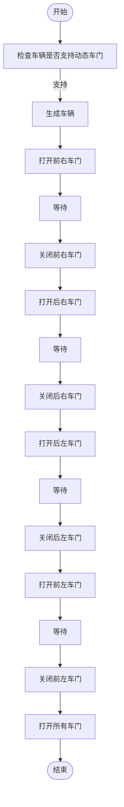
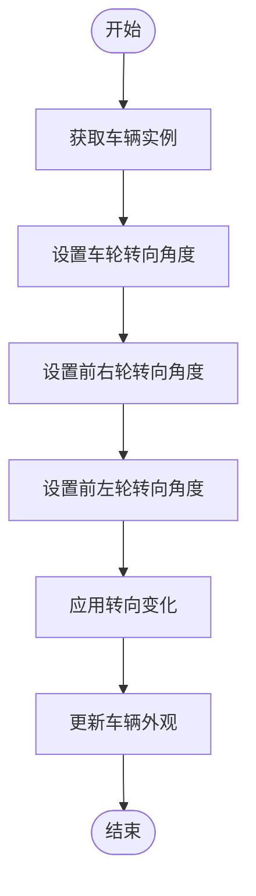
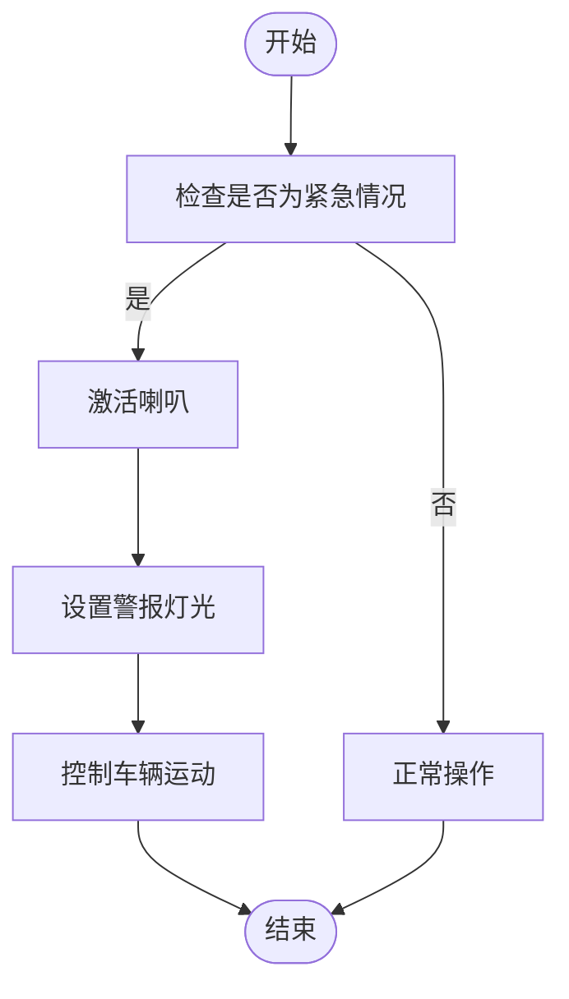
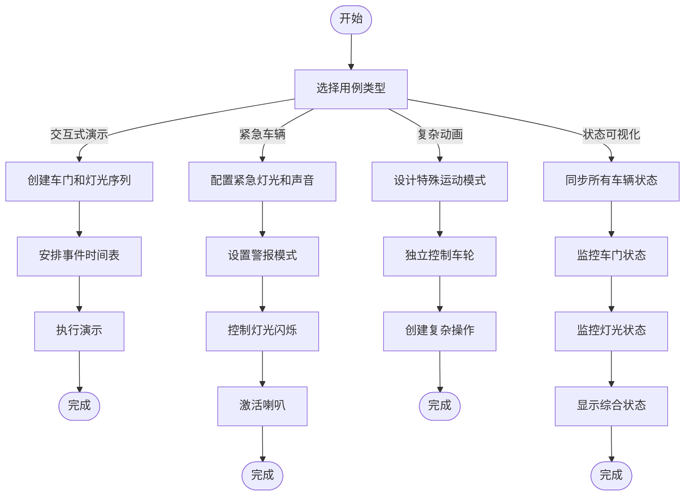

# 车辆特定功能控制

**本文档中引用的文件**  
- [vehicle_doors_demo.py](https://github.com/carla-simulator/carla/blob/ue5-dev/PythonAPI/examples/vehicle_doors_demo.py)
- [vehicle_lights_demo.py](https://github.com/carla-simulator/carla/blob/ue5-dev/PythonAPI/examples/vehicle_lights_demo.py)
- [Vehicle.h](https://github.com/carla-simulator/carla/blob/ue5-dev/LibCarla/source/carla/client/Vehicle.h)
- [VehicleDoor.h](https://github.com/carla-simulator/carla/blob/ue5-dev/LibCarla/source/carla/rpc/VehicleDoor.h)
- [VehicleLightState.h](https://github.com/carla-simulator/carla/blob/ue5-dev/LibCarla/source/carla/rpc/VehicleLightState.h)
- [Actor.cpp](https://github.com/carla-simulator/carla/blob/ue5-dev/PythonAPI/carla/src/Actor.cpp)
- [CarlaWheeledVehicle.cpp](https://github.com/carla-simulator/carla/blob/ue5-dev/Unreal/CarlaUnreal/Plugins/Carla/Source/Carla/Vehicle/CarlaWheeledVehicle.cpp)

## 目录
1. [简介](#简介)
2. [车门控制](#车门控制)
3. [灯光控制](#灯光控制)
4. [车轮转向控制](#车轮转向控制)
5. [车辆喇叭控制](#车辆喇叭控制)
6. [典型用例](#典型用例)

## 简介
本文档详细介绍了CARLA模拟器中车辆的特定功能控制接口，包括车门、灯光、车轮转向和喇叭的控制方法。这些非标准控制接口允许开发者创建更真实和复杂的车辆交互场景，如交互式车辆演示、紧急车辆模拟和复杂的车辆动画。

## 车门控制

CARLA提供了对车辆车门的精细控制，允许开发者独立打开和关闭特定车门。通过`open_door`和`close_door`方法，可以控制车辆的前左（FL）、前右（FR）、后左（RL）、后右（RR）车门，以及引擎盖（Hood）和后备箱（Trunk）。

在`vehicle_doors_demo.py`示例中，展示了如何通过循环控制不同车门的开合状态，创建一个动态的车辆演示。代码首先检查车辆蓝图是否支持动态车门（通过`has_dynamic_doors`属性），然后在不同的时间点依次打开和关闭各个车门。

**图示来源**
- [vehicle_doors_demo.py](https://github.com/carla-simulator/carla/blob/ue5-dev/PythonAPI/examples/vehicle_doors_demo.py#L75-L96)
- [Vehicle.h](https://github.com/carla-simulator/carla/blob/ue5-dev/LibCarla/source/carla/client/Vehicle.h#L69-L73)
- [CarlaWheeledVehicle.cpp](https://github.com/carla-simulator/carla/blob/ue5-dev/Unreal/CarlaUnreal/Plugins/Carla/Source/Carla/Vehicle/CarlaWheeledVehicle.cpp#L850-L880)

**本节来源**
- [vehicle_doors_demo.py](https://github.com/carla-simulator/carla/blob/ue5-dev/PythonAPI/examples/vehicle_doors_demo.py#L1-L113)
- [VehicleDoor.h](https://github.com/carla-simulator/carla/blob/ue5-dev/LibCarla/source/carla/rpc/VehicleDoor.h#L16-L23)

## 灯光控制

车辆灯光控制是创建真实驾驶场景的关键功能。CARLA提供了`set_light_state`方法来设置车辆的各种灯光状态，包括位置灯（Position）、近光灯（LowBeam）、远光灯（HighBeam）、刹车灯（Brake）、右转向灯（RightBlinker）、左转向灯（LeftBlinker）、倒车灯（Reverse）、雾灯（Fog）、车内灯（Interior）等。

在`vehicle_lights_demo.py`示例中，展示了如何通过位操作来组合和切换不同的灯光状态。灯光状态使用位标志（bit flags）实现，允许同时激活多个灯光。例如，通过`|=`操作符可以添加特定灯光，而通过`&=~`操作符可以移除特定灯光。

```mermaid
flowchart TD
Start([开始]) --> Initialize["初始化车辆和灯光"]
Initialize --> SetInitialLights["设置初始灯光状态"]
SetInitialLights --> AddInterior["添加车内灯"]
AddInterior --> AddLowBeam["添加近光灯"]
AddLowBeam --> AddPosition["添加位置灯"]
AddPosition --> AddReverse["添加倒车灯"]
AddReverse --> ApplyLights["应用灯光状态"]
ApplyLights --> Wait["等待"]
Wait --> CheckAngle["检查角度是否达到315°"]
CheckAngle --> |是| ChangeLights1["切换灯光状态"]
ChangeLights1 --> RemoveLowBeam["移除近光灯"]
RemoveLowBeam --> RemovePosition["移除位置灯"]
RemovePosition --> RemoveReverse["移除倒车灯"]
RemoveReverse --> AddHighBeam["添加远光灯"]
AddHighBeam --> AddBrake["添加刹车灯"]
AddBrake --> ApplyNewLights["应用新灯光状态"]
ApplyNewLights --> CheckAngle2["检查角度是否达到675°"]
CheckAngle2 --> |是| ChangeLights2["再次切换灯光状态"]
ChangeLights2 --> RemoveHighBeam["移除远光灯"]
RemoveHighBeam --> RemoveBrake["移除刹车灯"]
RemoveBrake --> AddFog["添加雾灯"]
AddFog --> AddTurnSignals["添加转向灯"]
AddTurnSignals --> AddSpecial["添加特殊灯光"]
AddSpecial --> ApplyFinalLights["应用最终灯光状态"]
ApplyFinalLights --> End([结束])
```

**图示来源**
- [vehicle_lights_demo.py](https://github.com/carla-simulator/carla/blob/ue5-dev/PythonAPI/examples/vehicle_lights_demo.py#L65-L101)
- [VehicleLightState.h](https://github.com/carla-simulator/carla/blob/ue5-dev/LibCarla/source/carla/rpc/VehicleLightState.h#L31-L45)
- [LightManager.cpp](https://github.com/carla-simulator/carla/blob/ue5-dev/LibCarla/source/carla/client/LightManager.cpp#L242-L247)

**本节来源**
- [vehicle_lights_demo.py](https://github.com/carla-simulator/carla/blob/ue5-dev/PythonAPI/examples/vehicle_lights_demo.py#L1-L124)
- [VehicleLightState.h](https://github.com/carla-simulator/carla/blob/ue5-dev/LibCarla/source/carla/rpc/VehicleLightState.h#L26-L46)

## 车轮转向控制

`set_wheel_steer_direction`方法允许独立控制每个车轮的转向角度，这对于特殊车辆如叉车或坦克的模拟特别有用。此方法仅影响车辆的外观（骨骼动画），而不影响物理行为，因此可以创建复杂的转向动画而不改变车辆的实际运动。

在`carla.Vehicle.set_wheel_steer_direction.py`示例中，展示了如何将车辆前轮设置为40度的转向角。此功能可以用于创建特殊的车辆行为，如原地转向或非对称转向。

**图示来源**
- [carla.Vehicle.set_wheel_steer_direction.py](https://github.com/carla-simulator/carla/blob/ue5-dev/PythonAPI/docs/snipets/carla.Vehicle.set_wheel_steer_direction.py#L3-L4)
- [Vehicle.h](https://github.com/carla-simulator/carla/blob/ue5-dev/LibCarla/source/carla/client/Vehicle.h#L78-L79)
- [Actor.cpp](https://github.com/carla-simulator/carla/blob/ue5-dev/PythonAPI/carla/src/Actor.cpp#L193)

**本节来源**
- [carla.Vehicle.set_wheel_steer_direction.py](https://github.com/carla-simulator/carla/blob/ue5-dev/PythonAPI/docs/snipets/carla.Vehicle.set_wheel_steer_direction.py#L1-L5)
- [Vehicle.h](https://github.com/carla-simulator/carla/blob/ue5-dev/LibCarla/source/carla/client/Vehicle.h#L78-L79)

## 车辆喇叭控制

车辆喇叭控制通过`enable_horn`方法实现，允许开发者在需要时激活车辆喇叭。虽然在提供的示例文件中没有直接展示喇叭控制，但根据CARLA的API设计，喇叭控制通常作为车辆灯光或控制状态的一部分进行管理。

在实际应用中，喇叭控制可以与其他车辆状态（如灯光、刹车）结合使用，创建更真实的紧急车辆行为。例如，警车或救护车在执行任务时可以同时激活警报灯和喇叭。

**图示来源**
- [Vehicle.h](https://github.com/carla-simulator/carla/blob/ue5-dev/LibCarla/source/carla/client/Vehicle.h#L52-L56)
- [Actor.cpp](https://github.com/carla-simulator/carla/blob/ue5-dev/PythonAPI/carla/src/Actor.cpp#L187-L188)

**本节来源**
- [Vehicle.h](https://github.com/carla-simulator/carla/blob/ue5-dev/LibCarla/source/carla/client/Vehicle.h#L52-L56)
- [Actor.cpp](https://github.com/carla-simulator/carla/blob/ue5-dev/PythonAPI/carla/src/Actor.cpp#L187-L188)

## 典型用例

### 交互式车辆演示
通过组合车门控制和灯光控制，可以创建引人注目的车辆演示。`vehicle_doors_demo.py`和`vehicle_lights_demo.py`示例展示了如何创建动态的车辆展示，其中车门和灯光按照预定的时间序列进行变化。

### 紧急车辆模拟
紧急车辆（如警车、救护车、消防车）需要特殊的灯光和声音模式。通过组合不同的灯光状态（如闪烁的警报灯）和喇叭控制，可以创建逼真的紧急车辆行为。例如，可以实现转向灯和特殊灯光的交替闪烁，同时周期性地激活喇叭。

### 复杂车辆动画
对于特殊车辆（如叉车、坦克、农业机械），独立的车轮转向控制允许创建复杂的运动模式。例如，叉车可能需要前轮转向而保持后轮直线，或者实现原地转向。这些非标准的运动模式可以通过`set_wheel_steer_direction`方法精确控制。

### 车辆状态可视化
通过同步车门状态、灯光状态和车辆运动，可以创建详细的车辆状态可视化系统。这对于测试自动驾驶算法或进行车辆行为分析非常有用。例如，可以创建一个监控系统，实时显示车辆的所有灯光和车门状态。

**图示来源**
- [vehicle_doors_demo.py](https://github.com/carla-simulator/carla/blob/ue5-dev/PythonAPI/examples/vehicle_doors_demo.py#L1-L113)
- [vehicle_lights_demo.py](https://github.com/carla-simulator/carla/blob/ue5-dev/PythonAPI/examples/vehicle_lights_demo.py#L1-L124)
- [carla.Vehicle.set_wheel_steer_direction.py](https://github.com/carla-simulator/carla/blob/ue5-dev/PythonAPI/docs/snipets/carla.Vehicle.set_wheel_steer_direction.py#L1-L5)

**本节来源**
- [vehicle_doors_demo.py](https://github.com/carla-simulator/carla/blob/ue5-dev/PythonAPI/examples/vehicle_doors_demo.py#L1-L113)
- [vehicle_lights_demo.py](https://github.com/carla-simulator/carla/blob/ue5-dev/PythonAPI/examples/vehicle_lights_demo.py#L1-L124)
- [carla.Vehicle.set_wheel_steer_direction.py](https://github.com/carla-simulator/carla/blob/ue5-dev/PythonAPI/docs/snipets/carla.Vehicle.set_wheel_steer_direction.py#L1-L5)