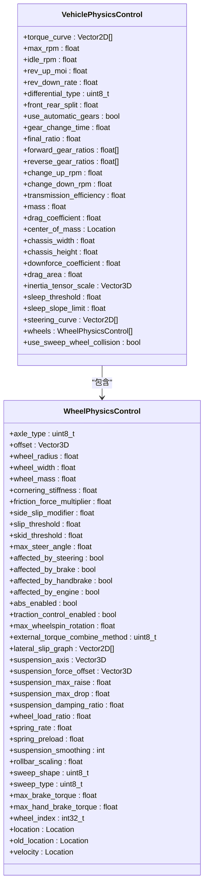

# 高级车辆物理控制

> **引用文件**
> **本文档引用的文件**

- [VehiclePhysicsControl.h](https://github.com/carla-simulator/carla/blob/ue5-dev/LibCarla/source/carla/rpc/VehiclePhysicsControl.h)
- [WheelPhysicsControl.h](https://github.com/carla-simulator/carla/blob/ue5-dev/LibCarla/source/carla/rpc/WheelPhysicsControl.h)
- [Control.cpp](https://github.com/carla-simulator/carla/blob/ue5-dev/PythonAPI/carla/src/Control.cpp)
- [test_vehicle_physics.py](https://github.com/carla-simulator/carla/blob/ue5-dev/PythonAPI/test/test_vehicle_physics.py)
- [test_vehicle_physics.py](https://github.com/carla-simulator/carla/blob/ue5-dev/PythonAPI/test/smoke/test_vehicle_physics.py)
- [tuto_G_control_vehicle_physics.md](https://github.com/carla-simulator/carla/blob/ue5-dev/Docs/tuto_G_control_vehicle_physics.md)
- [CarlaWheeledVehicle.cpp](https://github.com/carla-simulator/carla/blob/ue5-dev/Unreal/CarlaUnreal/Plugins/Carla/Source/Carla/Vehicle/CarlaWheeledVehicle.cpp)
- [WheeledVehicleMovementComponentNW.h](https://github.com/carla-simulator/carla/blob/ue5-dev/Unreal/CarlaUnreal/Plugins/Carla/Source/Carla/Vehicle/WheeledVehicleMovementComponentNW.h)
- [Vehicle.h](https://github.com/carla-simulator/carla/blob/ue5-dev/LibCarla/source/carla/client/Vehicle.h)

## 目录

1. [简介](#简介)
2. [车辆物理控制架构](#车辆物理控制架构)
3. [VehiclePhysicsControl 核心参数详解](#vehiclephysicscontrol-核心参数详解)
4. [WheelPhysicsControl 车轮参数详解](#wheelphysicscontrol-车轮参数详解)
5. [物理控制的应用与获取](#物理控制的应用与获取)
6. [实际应用场景](#实际应用场景)
7. [最佳实践与性能影响](#最佳实践与性能影响)
8. [结论](#结论)

## 简介

车辆物理控制是模拟真实驾驶体验的核心。通过精确调整 `VehiclePhysicsControl` 和 `WheelPhysicsControl` 类中的参数，可以实现从日常驾驶到专业赛车的各种车辆行为。本文档深入探讨了这些参数的物理意义、对车辆动态的影响以及如何通过 `apply_physics_control` 和 `get_physics_control` 方法进行应用和查询。文档还将介绍如何为不同车轮设置独立参数以实现特殊效果，如漂移或模拟不同路面条件。

## 车辆物理控制架构

车辆物理控制系统由两个主要类构成：`VehiclePhysicsControl` 和 `WheelPhysicsControl`。`VehiclePhysicsControl` 负责管理车辆的整体物理属性，如质量、空气动力学和传动系统。它包含一个 `wheels` 属性，该属性是一个 `WheelPhysicsControl` 对象的列表，用于定义每个车轮的特定物理行为。这种分层设计允许对车辆进行全局和局部的精细调校。



**图源**

- [VehiclePhysicsControl.h](https://github.com/carla-simulator/carla/blob/ue5-dev/LibCarla/source/carla/rpc/VehiclePhysicsControl.h)
- [WheelPhysicsControl.h](https://github.com/carla-simulator/carla/blob/ue5-dev/LibCarla/source/carla/rpc/WheelPhysicsControl.h)

**节源**

- <a href="https://github.com/carla-simulator/carla/blob/ue5-dev/LibCarla/source/carla/rpc/VehiclePhysicsControl.h#L20-L245" target="_blank">VehiclePhysicsControl.h</a>
- <a href="https://github.com/carla-simulator/carla/blob/ue5-dev/LibCarla/source/carla/rpc/WheelPhysicsControl.h#L19-L260" target="_blank">WheelPhysicsControl.h</a>

## VehiclePhysicsControl 核心参数详解

`VehiclePhysicsControl` 类定义了车辆的整体物理特性。以下是对关键参数的详细解释：

- **torque_curve**: 发动机扭矩曲线，定义了不同转速下的扭矩输出，直接影响车辆的加速性能。
- **max_rpm**: 发动机最大转速，限制了车辆的最高速度。
- **idle_rpm**: 发动机怠速转速，影响车辆在空挡或离合器踩下时的发动机行为。
- **rev_up_moi**: 发动机在油门踩下时的转动惯量（MOI），值越大，发动机转速上升越慢，模拟了更重的飞轮。
- **rev_down_rate**: 发动机在油门松开时的转速下降率，影响发动机的“回火”或“拖拽”感。
- **differential_type**: 差速器类型，影响动力在左右轮之间的分配，对车辆的过弯特性至关重要。
- **use_automatic_gears**: 是否使用自动变速箱。
- **gear_change_time**: 换挡时间，模拟变速箱换挡所需的时间。
- **clutch_strength**: 离合器强度，控制发动机与传动系统之间的连接强度，影响起步和换挡的平顺性。
- **mass**: 车辆总质量，影响惯性、加速度和制动距离。
- **drag_coefficient**: 空气阻力系数，影响高速行驶时的阻力。
- **center_of_mass**: 质心位置，对车辆的俯仰、侧倾和稳定性有决定性影响。
- **inertia_tensor_scale**: 转动惯量张量缩放，用于调整车辆绕各轴旋转的难易程度。

## WheelPhysicsControl 车轮参数详解

`WheelPhysicsControl` 类允许对每个车轮进行精细化控制，实现高度定制化的车辆行为。

- **tire_friction**: 轮胎摩擦系数，直接决定了轮胎与地面之间的抓地力。值越高，抓地力越强，转弯和制动性能越好。
- **wheel_mass**: 轮胎质量，影响车辆的簧下质量，对悬挂响应和操控性有细微影响。
- **max_steer_angle**: 最大转向角，定义了车轮可以转向的最大角度，影响车辆的最小转弯半径。
- **affected_by_steering/brake/handbrake/engine**: 这些布尔值决定了车轮是否受转向、刹车、手刹和发动机动力的影响，可用于创建特殊的车辆配置，如仅前轮转向或仅后轮驱动。
- **abs_enabled**: 为该车轮启用/禁用防抱死刹车系统（ABS）。
- **traction_control_enabled**: 为该车轮启用/禁用牵引力控制系统。
- **suspension_axis**: 悬挂轴方向，定义了悬挂运动的方向。
- **spring_rate**: 弹簧刚度，值越大，悬挂越硬，车辆在颠簸路面上的跳动越小，但舒适性降低。
- **spring_preload**: 弹簧预载，影响车辆的初始姿态和悬挂的初始压缩量。
- **rollbar_scaling**: 防倾杆缩放，用于调整防倾杆的刚度，影响车辆过弯时的侧倾程度。

## 物理控制的应用与获取

要应用自定义的物理控制，首先需要通过 `get_physics_control()` 方法获取当前车辆的物理控制对象。然后，修改该对象的属性以满足需求。最后，使用 `apply_physics_control()` 方法将修改后的配置应用到车辆上。此过程在运行时生效，不会永久改变车辆蓝图。

```python
# 获取车辆的物理控制对象
physics_control = vehicle.get_physics_control()

# 修改参数
physics_control.mass = 1500.0  # 增加车辆质量
physics_control.drag_coefficient = 0.4  # 增加空气阻力

# 为每个车轮设置不同的摩擦系数
for wheel in physics_control.wheels:
    if wheel.location.y > 0:  # 前轮
        wheel.tire_friction = 2.5
    else:  # 后轮
        wheel.tire_friction = 2.0

# 应用新的物理控制
vehicle.apply_physics_control(physics_control)
```

**节源**

- <a href="https://github.com/carla-simulator/carla/blob/ue5-dev/LibCarla/source/carla/client/Vehicle.h#L66-L95" target="_blank">Vehicle.h</a>
- <a href="https://github.com/carla-simulator/carla/blob/ue5-dev/Docs/tuto_G_control_vehicle_physics.md#L14-L61" target="_blank">tuto_G_control_vehicle_physics.md</a>

## 实际应用场景

通过调整物理参数，可以模拟各种现实场景：

- **模拟不同路面条件**: 通过在特定区域使用 `static.trigger.friction` 触发器来动态改变车轮的 `tire_friction` 值，可以模拟冰面、湿滑路面或砂石路。例如，将摩擦系数从默认的 3.0 降低到 0.5，可以模拟车辆在冰面上打滑。
- **创建漂移车辆**: 通过将后轮的 `tire_friction` 设置为较低值（如 1.0），同时增加发动机扭矩和调整差速器，可以轻松创建一辆易于漂移的车辆。
- **调整赛车性能**: 为了模拟高性能赛车，可以增加 `max_rpm` 和 `torque_curve` 的峰值，减小 `gear_change_time` 以实现更快的换挡，并降低 `drag_coefficient` 以减少高速阻力。

## 最佳实践与性能影响

在调校车辆物理时，应遵循以下最佳实践：

- **逐步调整**: 每次只调整一个或少数几个参数，以便清晰地观察其对车辆行为的影响。
- **验证一致性**: 应用新设置后，使用 `get_physics_control()` 获取当前设置，并与预期设置进行比较，确保所有参数都已正确应用。
- **性能考虑**: 过于复杂的物理设置或过高的更新频率可能会对模拟性能产生影响。应平衡真实性和性能需求。

## 结论

`VehiclePhysicsControl` 和 `WheelPhysicsControl` 提供了强大的工具来精确控制车辆的动态行为。通过深入理解每个参数的物理意义并进行系统性的调校，可以创建出从逼真的日常驾驶到极限竞速的各种车辆体验。本文档提供的知识和示例为实现这些目标奠定了坚实的基础。
