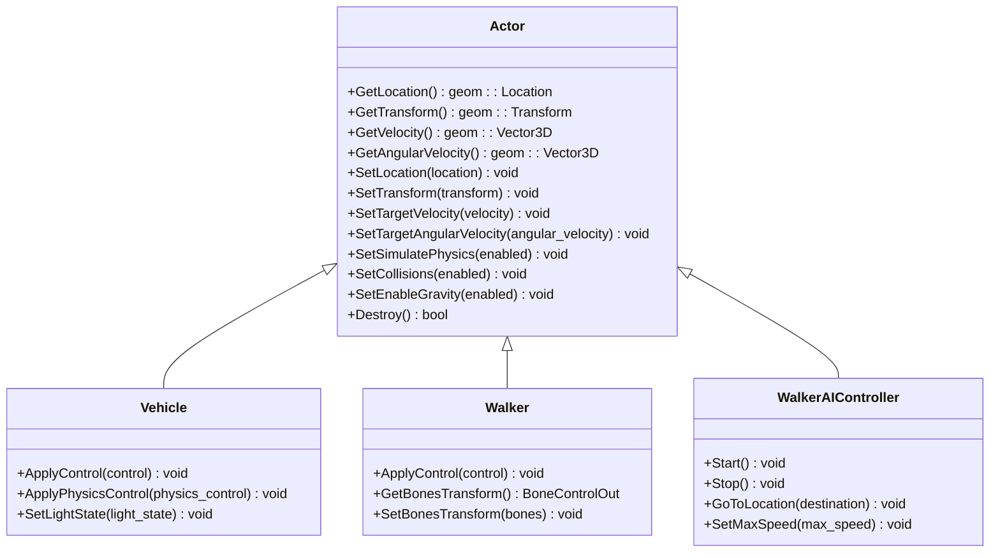
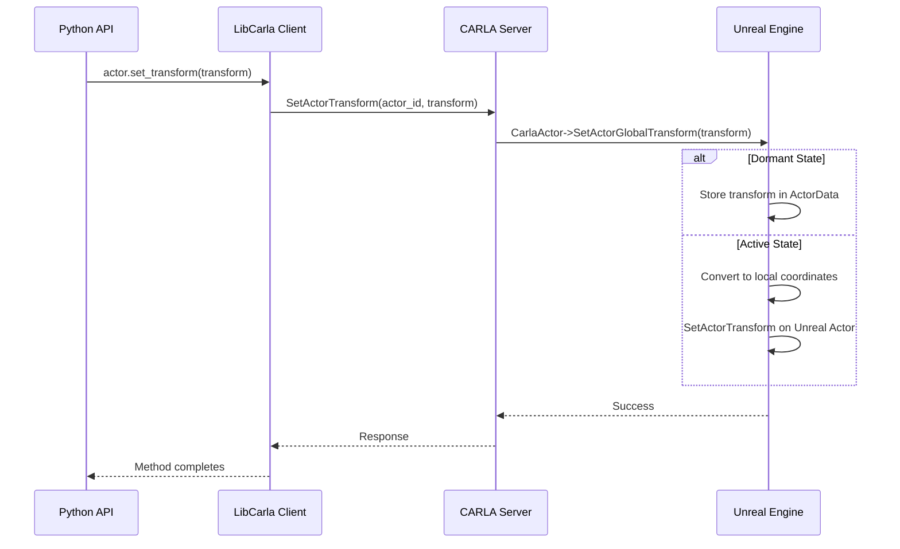
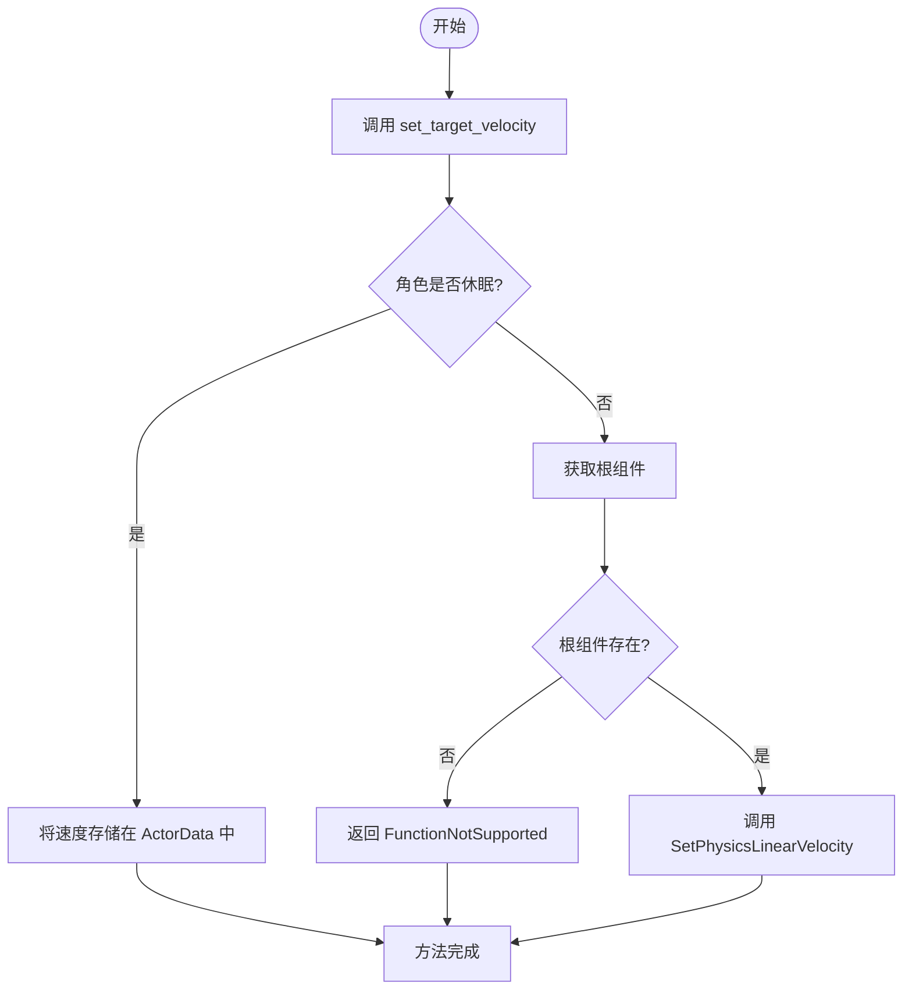
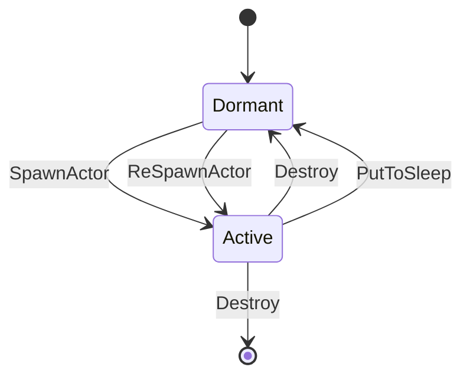

# 通用角色控制


**本文档引用的文件**   
- [Actor.h](https://github.com/carla-simulator/carla/blob/ue5-dev/LibCarla/source/carla/client/Actor.h)
- [Actor.cpp](https://github.com/carla-simulator/carla/blob/ue5-dev/LibCarla/source/carla/client/Actor.cpp)
- [Actor.cpp](https://github.com/carla-simulator/carla/blob/ue5-dev/PythonAPI/carla/src/Actor.cpp)
- [Blueprint.cpp](https://github.com/carla-simulator/carla/blob/ue5-dev/PythonAPI/carla/src/Blueprint.cpp)
- [CarlaActor.cpp](https://github.com/carla-simulator/carla/blob/ue5-dev/Unreal/CarlaUnreal/Plugins/Carla/Source/Carla/Actor/CarlaActor.cpp)
- [Walker.h](https://github.com/carla-simulator/carla/blob/ue5-dev/LibCarla/source/carla/client/Walker.h)
- [Vehicle.h](https://github.com/carla-simulator/carla/blob/ue5-dev/LibCarla/source/carla/client/Vehicle.h)
- [WalkerAIController.cpp](https://github.com/carla-simulator/carla/blob/ue5-dev/LibCarla/source/carla/client/WalkerAIController.cpp)
- [test_sync_mode.py](https://github.com/carla-simulator/carla/blob/ue5-dev/PythonAPI/test/API/test_sync_mode.py)
- [carla.ActorBlueprint.set_attribute.py](https://github.com/carla-simulator/carla/blob/ue5-dev/PythonAPI/docs/snipets/carla.ActorBlueprint.set_attribute.py)
- [tuto_G_control_walker_skeletons.md](https://github.com/carla-simulator/carla/blob/ue5-dev/Docs/tuto_G_control_walker_skeletons.md)
- [automatic_control.py](https://github.com/carla-simulator/carla/blob/ue5-dev/PythonAPI/examples/automatic_control.py)


## 目录
1. [简介](#简介)
2. [核心控制接口](#核心控制接口)
3. [位置与姿态控制](#位置与姿态控制)
4. [物理状态控制](#物理状态控制)
5. [角色生命周期管理](#角色生命周期管理)
6. [角色属性与蓝图定制](#角色属性与蓝图定制)
7. [高级控制技巧](#高级控制技巧)
8. [代码示例](#代码示例)
9. [结论](#结论)

## 简介
CARLA仿真平台中的`carla.Actor`基类为所有可交互对象提供了统一的控制接口。本指南深入解析了该基类的核心控制方法，包括位置、旋转、速度和物理模拟的精确控制。文档详细说明了角色的可见性控制、生命周期管理以及通过蓝图进行角色定制的方法。通过本指南，初学者可以快速掌握基础的角色操作，而高级用户则能利用精确的物理模拟控制和批量操作技巧来实现复杂的仿真场景。

**Section sources**
- [Actor.h](https://github.com/carla-simulator/carla/blob/ue5-dev/LibCarla/source/carla/client/Actor.h#L17-L158)

## 核心控制接口
`carla.Actor`基类提供了对仿真中所有角色的统一控制接口。这些接口允许用户精确控制角色的位置、姿态、速度和物理状态。核心控制方法包括`set_transform`用于设置角色的位置和旋转，`set_target_velocity`和`set_target_angular_velocity`用于设置线速度和角速度，以及`set_simulate_physics`用于控制物理模拟的开关。这些方法构成了角色控制的基础，为构建复杂的自动驾驶仿真场景提供了必要的工具。



**Diagram sources**
- [Actor.h](https://github.com/carla-simulator/carla/blob/ue5-dev/LibCarla/source/carla/client/Actor.h#L17-L158)
- [Vehicle.h](https://github.com/carla-simulator/carla/blob/ue5-dev/LibCarla/source/carla/client/Vehicle.h#L32-L153)
- [Walker.h](https://github.com/carla-simulator/carla/blob/ue5-dev/LibCarla/source/carla/client/Walker.h#L17-L48)
- [WalkerAIController.h](https://github.com/carla-simulator/carla/blob/ue5-dev/LibCarla/source/carla/client/WalkerAIController.h#L17-L33)

## 位置与姿态控制
### set_transform方法详解
`set_transform`方法是控制角色位置和姿态的核心接口。该方法接受一个`carla.Transform`对象作为参数，该对象包含了位置（`carla.Location`）和旋转（`carla.Rotation`）信息。调用此方法会立即将角色瞬移到指定的变换位置，实现精确的定位和朝向控制。

在底层实现中，`set_transform`方法通过调用`SetActorTransform`函数来完成实际的变换操作。该函数会检查角色是否处于休眠状态，并根据需要在全局坐标和局部坐标之间进行转换。对于大型地图，系统会自动处理坐标转换，确保角色被正确放置。



**Diagram sources**
- [Actor.cpp](https://github.com/carla-simulator/carla/blob/ue5-dev/LibCarla/source/carla/client/Actor.cpp#L49-L51)
- [CarlaActor.cpp](https://github.com/carla-simulator/carla/blob/ue5-dev/Unreal/CarlaUnreal/Plugins/Carla/Source/Carla/Actor/CarlaActor.cpp#L335-L359)

### 精确的位置、旋转和姿态设置
精确控制角色的姿态需要理解CARLA中的坐标系统。位置由`carla.Location`表示，包含x、y、z三个坐标分量，单位为米。旋转由`carla.Rotation`表示，包含pitch（俯仰）、yaw（偏航）和roll（翻滚）三个角度，单位为度。

在设置姿态时，需要注意旋转的顺序和参考系。CARLA使用右手坐标系，其中x轴指向前方，y轴指向右侧，z轴指向上方。旋转顺序为ZYX（偏航-俯仰-翻滚），这与大多数3D图形系统一致。

**Section sources**
- [Actor.h](https://github.com/carla-simulator/carla/blob/ue5-dev/LibCarla/source/carla/client/Actor.h#L78-L79)
- [geom/Transform.h](https://github.com/carla-simulator/carla/blob/ue5-dev/LibCarla/source/carla/geom/Transform.h)

## 物理状态控制
### 速度与角速度控制
`set_target_velocity`和`set_target_angular_velocity`方法用于设置角色的目标速度和角速度。这些方法在物理模拟的每一步之前应用，因此最终的速度会受到摩擦力等外部力的影响。

`set_target_velocity`接受一个`carla.Vector3D`对象，表示在世界坐标系中的线速度向量。`set_target_angular_velocity`同样接受一个`carla.Vector3D`对象，但表示的是角速度，单位为度/秒。



**Diagram sources**
- [Actor.cpp](https://github.com/carla-simulator/carla/blob/ue5-dev/LibCarla/source/carla/client/Actor.cpp#L53-L58)
- [CarlaActor.cpp](https://github.com/carla-simulator/carla/blob/ue5-dev/Unreal/CarlaUnreal/Plugins/Carla/Source/Carla/Actor/CarlaActor.cpp#L392-L410)

### 物理模拟开关
`set_simulate_physics`方法用于控制角色的物理模拟状态。启用物理模拟后，角色将受到重力、碰撞和其他物理力的影响。禁用物理模拟后，角色将不受物理规则约束，可以被精确控制。

在自动驾驶仿真中，这个功能特别有用。例如，可以禁用行人的物理模拟，然后使用AI控制器精确控制其路径，避免不可预测的物理行为。

**Section sources**
- [Actor.h](https://github.com/carla-simulator/carla/blob/ue5-dev/LibCarla/source/carla/client/Actor.h#L111-L112)
- [CarlaServer.cpp](https://github.com/carla-simulator/carla/blob/ue5-dev/Unreal/CarlaUnreal/Plugins/Carla/Source/Carla/Server/CarlaServer.cpp#L1550-L1572)

## 角色生命周期管理
### 角色可见性控制
角色的可见性可以通过`set_collisions`方法控制。禁用碰撞后，角色将变为"幽灵"状态，可以穿过其他物体而不会发生碰撞。这在测试路径规划算法时非常有用，可以避免意外的碰撞中断测试。

### 角色创建与销毁
角色的生命周期通过`spawn_actor`和`destroy`方法管理。`spawn_actor`方法根据蓝图在指定位置创建角色，返回一个`carla.Actor`对象。`destroy`方法则通知仿真器销毁角色，释放相关资源。



**Diagram sources**
- [ActorDispatcher.h](https://github.com/carla-simulator/carla/blob/ue5-dev/Unreal/CarlaUnreal/Plugins/Carla/Source/Carla/Actor/ActorDispatcher.h#L45-L75)
- [ActorDispatcher.cpp](https://github.com/carla-simulator/carla/blob/ue5-dev/Unreal/CarlaUnreal/Plugins/Carla/Source/Carla/Actor/ActorDispatcher.cpp#L40-L159)

## 角色属性与蓝图定制
### 属性系统
CARLA的角色属性系统允许在创建角色时定制其外观和行为。每个角色蓝图都有一组可修改的属性，如颜色、灯光状态等。这些属性可以通过`get_attribute`和`set_attribute`方法访问和修改。

### Blueprint的set_attribute方法
`set_attribute`方法是定制角色的关键。它接受属性名和值作为参数，修改蓝图的相应属性。例如，可以设置车辆的颜色、行人的无敌状态或传感器的分辨率。

```python
# 示例：修改不同角色蓝图的属性
walker_bp = world.get_blueprint_library().filter('walker.pedestrian.0002')
walker_bp.set_attribute('is_invincible', 'true')

vehicle_bp = world.get_blueprint_library().filter('vehicle.bmw.*')
color = random.choice(vehicle_bp.get_attribute('color').recommended_values)
vehicle_bp.set_attribute('color', color)

camera_bp = world.get_blueprint_library().filter('sensor.camera.rgb')
camera_bp.set_attribute('image_size_x', '600')
camera_bp.set_attribute('image_size_y', '600')
```

**Diagram sources**
- [Blueprint.cpp](https://github.com/carla-simulator/carla/blob/ue5-dev/PythonAPI/carla/src/Blueprint.cpp#L95-L96)
- [carla.ActorBlueprint.set_attribute.py](https://github.com/carla-simulator/carla/blob/ue5-dev/PythonAPI/docs/snipets/carla.ActorBlueprint.set_attribute.py)

## 高级控制技巧
### 精确的物理模拟控制
对于需要精确物理行为的场景，可以结合使用`set_simulate_physics`、`set_target_velocity`和`add_impulse`等方法。例如，可以先禁用物理模拟，将车辆放置到精确位置，然后启用物理模拟并设置初始速度。

### 批量操作技巧
在管理大量角色时，可以使用批量操作提高效率。CARLA提供了`apply_batch`方法，允许在一次网络调用中执行多个控制命令。这对于同时控制多个车辆或行人的场景非常有用。

**Section sources**
- [Actor.h](https://github.com/carla-simulator/carla/blob/ue5-dev/LibCarla/source/carla/client/Actor.h#L93-L109)
- [Commands.cpp](https://github.com/carla-simulator/carla/blob/ue5-dev/LibCarla/source/carla/client/Commands.cpp)

## 代码示例
以下代码示例展示了如何使用CARLA API进行角色控制：

```python
# 创建车辆并设置初始位置
vehicle_bp = blueprint_library.filter('vehicle.bmw.grandtourer')[0]
transform = carla.Transform(carla.Location(x=100, y=50, z=0.1), carla.Rotation(yaw=90))
vehicle = world.spawn_actor(vehicle_bp, transform)

# 控制车辆速度
vehicle.set_target_velocity(carla.Vector3D(10, 0, 0))

# 创建行人AI控制器
walker_bp = blueprint_library.filter('walker.pedestrian.0002')[0]
walker_transform = carla.Transform(carla.Location(x=80, y=50, z=0.1))
walker = world.spawn_actor(walker_bp, walker_transform)

controller_bp = blueprint_library.find('controller.ai.walker')
controller = world.spawn_actor(controller_bp, carla.Transform(), walker)

# 启动AI控制器并设置目标
controller.start()
controller.go_to_location(carla.Location(x=120, y=50, z=0))
controller.set_max_speed(1.5)
```

**Section sources**
- [test_sync_mode.py](https://github.com/carla-simulator/carla/blob/ue5-dev/PythonAPI/test/API/test_sync_mode.py#L47-L60)
- [automatic_control.py](https://github.com/carla-simulator/carla/blob/ue5-dev/PythonAPI/examples/automatic_control.py#L730-L734)

## 结论
CARLA的`carla.Actor`基类提供了一套强大而灵活的控制接口，使用户能够精确控制仿真中的各种角色。通过掌握`set_transform`、`set_target_velocity`、`set_simulate_physics`等核心方法，用户可以创建复杂的自动驾驶测试场景。结合角色属性系统和AI控制器，可以实现从简单的位置控制到复杂的群体行为模拟的各种功能。这些工具为自动驾驶算法的开发和测试提供了坚实的基础。