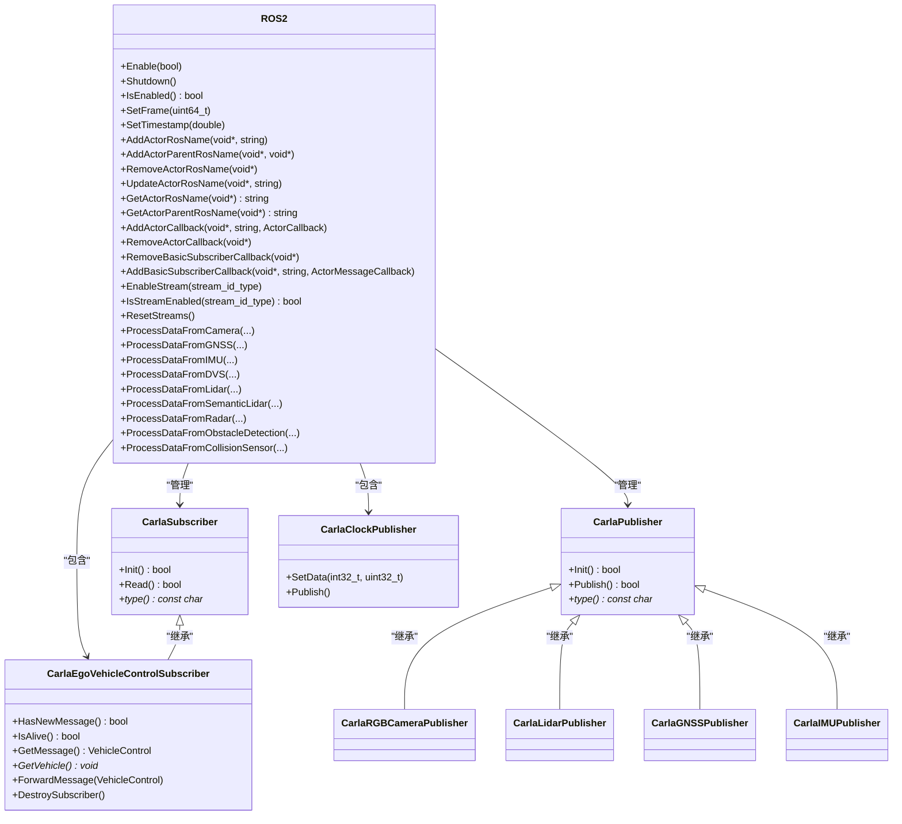
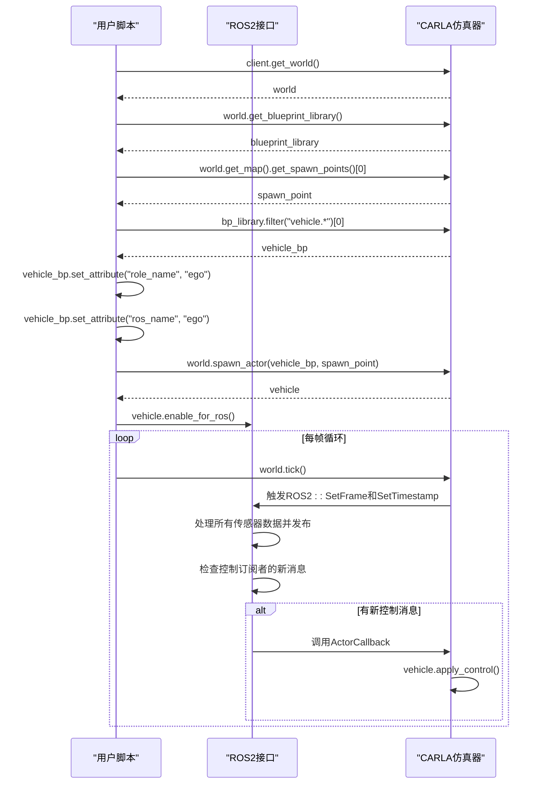
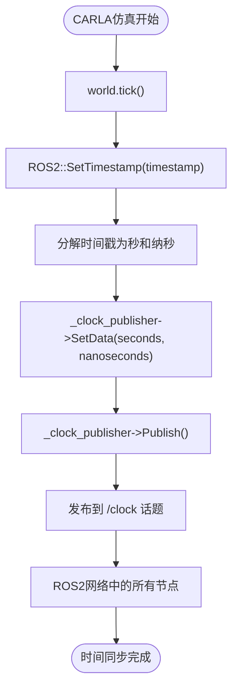

# ROS2 接口

> **引用文件**
> **本文档中引用的文件**

- [ros2_native.py](https://github.com/carla-simulator/carla/blob/ue5-dev/PythonAPI/examples/ros2/ros2_native.py)
- [ros2_native.rviz](https://github.com/carla-simulator/carla/blob/ue5-dev/PythonAPI/examples/ros2/rviz/ros2_native.rviz)
- [fastrtps-profile.xml](https://github.com/carla-simulator/carla/blob/ue5-dev/PythonAPI/examples/ros2/config/fastrtps-profile.xml)
- [ROS2.h](https://github.com/carla-simulator/carla/blob/ue5-dev/LibCarla/source/carla/ros2/ROS2.h)
- [ROS2.cpp](https://github.com/carla-simulator/carla/blob/ue5-dev/LibCarla/source/carla/ros2/ROS2.cpp)
- [CarlaRGBCameraPublisher.h](https://github.com/carla-simulator/carla/blob/ue5-dev/LibCarla/source/carla/ros2/publishers/CarlaRGBCameraPublisher.h)
- [CarlaLidarPublisher.h](https://github.com/carla-simulator/carla/blob/ue5-dev/LibCarla/source/carla/ros2/publishers/CarlaLidarPublisher.h)
- [CarlaEgoVehicleControlSubscriber.h](https://github.com/carla-simulator/carla/blob/ue5-dev/LibCarla/source/carla/ros2/subscribers/CarlaEgoVehicleControlSubscriber.h)
- [ros2_native.md](https://github.com/carla-simulator/carla/blob/ue5-dev/Docs/ros2_native.md)
- [ros2_native_sensors.md](https://github.com/carla-simulator/carla/blob/ue5-dev/Docs/ros2_native_sensors.md)
- [ros2_native_msgs.md](https://github.com/carla-simulator/carla/blob/ue5-dev/Docs/ros2_native_msgs.md)

## 目录

1. [简介](#简介)
2. [架构设计](#架构设计)
3. [核心话题与消息类型](#核心话题与消息类型)
4. [Python API 集成示例](#python-api集成示例)
5. [ROS2 时钟与仿真时间同步](#ros2时钟与仿真时间同步)
6. [RViz 可视化配置](#rviz可视化配置)
7. [坐标系与数据格式转换](#坐标系与数据格式转换)
8. [故障排除指南](#故障排除指南)

## 简介

CARLA 仿真器通过其服务器原生支持 ROS2，为自动驾驶系统开发提供了强大的集成能力。通过在启动时使用`--ros2`命令行选项，CARLA 能够直接与 ROS2 生态系统通信，无需额外的桥接程序。这种原生集成支持传感器数据的发布和车辆控制命令的订阅，实现了高效、低延迟的通信。

ROS2 接口允许开发者通过标准的 ROS2 话题接收来自 CARLA 仿真器的传感器数据，如摄像头图像、激光雷达点云和 IMU 数据，同时可以通过特定话题向仿真中的主车辆发送控制指令。该接口还支持仿真时钟的同步，确保 ROS2 系统中的时间与 CARLA 仿真时间保持一致。

**Section sources**

- <a href="https://github.com/carla-simulator/carla/blob/ue5-dev/Docs/ros2_native.md#L1-L64" target="_blank">ros2_native.md</a>

## 架构设计

CARLA 的 ROS2 集成架构基于发布者-订阅者模式，核心组件位于 LibCarla 库中。该架构由`ROS2`单例类管理，负责协调所有 ROS2 相关的通信。系统包含两类主要组件：发布者（Publishers）用于将 CARLA 的传感器数据和状态信息发布到 ROS2 话题，订阅者（Subscribers）用于接收来自 ROS2 系统的控制命令。



**Diagram sources**

- <a href="https://github.com/carla-simulator/carla/blob/ue5-dev/LibCarla/source/carla/ros2/ROS2.h#L47-L177" target="_blank">ROS2.h</a>
- <a href="https://github.com/carla-simulator/carla/blob/ue5-dev/LibCarla/source/carla/ros2/ROS2.cpp#L51-L898" target="_blank">ROS2.cpp</a>
- <a href="https://github.com/carla-simulator/carla/blob/ue5-dev/LibCarla/source/carla/ros2/publishers/CarlaRGBCameraPublisher.h#L18-L51" target="_blank">CarlaRGBCameraPublisher.h</a>
- <a href="https://github.com/carla-simulator/carla/blob/ue5-dev/LibCarla/source/carla/ros2/publishers/CarlaLidarPublisher.h#L17-L39" target="_blank">CarlaLidarPublisher.h</a>
- <a href="https://github.com/carla-simulator/carla/blob/ue5-dev/LibCarla/source/carla/ros2/subscribers/CarlaEgoVehicleControlSubscriber.h#L18-L47" target="_blank">CarlaEgoVehicleControlSubscriber.h</a>

**Section sources**

- <a href="https://github.com/carla-simulator/carla/blob/ue5-dev/LibCarla/source/carla/ros2/ROS2.h#L47-L177" target="_blank">ROS2.h</a>
- <a href="https://github.com/carla-simulator/carla/blob/ue5-dev/LibCarla/source/carla/ros2/ROS2.cpp#L51-L898" target="_blank">ROS2.cpp</a>

## 核心话题与消息类型

CARLA 的 ROS2 接口定义了一系列标准化的话题和消息类型，用于传输传感器数据和控制指令。话题命名遵循`/carla/[<PARENT_ROLE_NAME>]/<SENSOR_ROLE_NAME>`的层次结构，其中`PARENT_ROLE_NAME`通常是主车辆的角色名，`SENSOR_ROLE_NAME`是传感器的 ROS 名称。

### 传感器数据话题

| 话题                                                         | 消息类型                            | 描述                                   |
| ------------------------------------------------------------ | ----------------------------------- | -------------------------------------- |
| `/carla/[<PARENT_ROLE_NAME>]/<SENSOR_ROLE_NAME>/image`       | `sensor_msgs/Image`                 | RGB、深度、语义分割等摄像头的图像数据  |
| `/carla/[<PARENT_ROLE_NAME>]/<SENSOR_ROLE_NAME>/camera_info` | `sensor_msgs/CameraInfo`            | 摄像头的内参和畸变信息                 |
| `/carla/[<PARENT_ROLE_NAME>]/<SENSOR_ROLE_NAME>/events`      | `sensor_msgs/PointCloud2`           | DVS 事件相机的事件流                   |
| `/carla/[<PARENT_ROLE_NAME>]/<SENSOR_ROLE_NAME>`             | `sensor_msgs/PointCloud2`           | 激光雷达、语义激光雷达和雷达的点云数据 |
| `/carla/[<PARENT_ROLE_NAME>]/<SENSOR_ROLE_NAME>`             | `sensor_msgs/Imu`                   | IMU 传感器的加速度、角速度和方向数据   |
| `/carla/[<PARENT_ROLE_NAME>]/<SENSOR_ROLE_NAME>`             | `sensor_msgs/NavSatFix`             | GNSS 传感器的经纬度和海拔数据          |
| `/carla/[<PARENT_ROLE_NAME>]/<SENSOR_ROLE_NAME>`             | `carla_msgs/CarlaLaneInvasionEvent` | 车道入侵传感器检测到的车道标记         |

### 控制与状态话题

| 话题                                              | 消息类型                 | 描述                                       |
| ------------------------------------------------- | ------------------------ | ------------------------------------------ |
| `/carla/[<PARENT_ROLE_NAME>]/vehicle_control_cmd` | `CarlaEgoVehicleControl` | 向主车辆发送控制命令（油门、转向、刹车等） |
| `/carla/clock`                                    | `rosgraph_msgs/Clock`    | CARLA 仿真时钟，与仿真时间同步             |

**Section sources**

- <a href="https://github.com/carla-simulator/carla/blob/ue5-dev/Docs/ros2_native_sensors.md#L1-L94" target="_blank">ros2_native_sensors.md</a>
- <a href="https://github.com/carla-simulator/carla/blob/ue5-dev/Docs/ros2_native_msgs.md#L1-L332" target="_blank">ros2_native_msgs.md</a>

## Python API 集成示例

以下示例展示了如何使用 Python API 在 CARLA 中设置 ROS2 集成，包括主车辆和传感器的创建与配置。



**Diagram sources**

- <a href="https://github.com/carla-simulator/carla/blob/ue5-dev/PythonAPI/examples/ros2/ros2_native.py#L1-L132" target="_blank">ros2_native.py</a>

**Section sources**

- <a href="https://github.com/carla-simulator/carla/blob/ue5-dev/PythonAPI/examples/ros2/ros2_native.py#L1-L132" target="_blank">ros2_native.py</a>

## ROS2 时钟与仿真时间同步

CARLA 的 ROS2 接口通过`/clock`话题实现与 ROS2 系统的时钟同步。`CarlaClockPublisher`类负责将 CARLA 的仿真时间转换为 ROS2 的时钟消息。每当仿真器执行一个时间步（通过`world.tick()`），`ROS2::SetTimestamp`方法就会被调用，它将 CARLA 的双精度时间戳分解为秒和纳秒，并通过`/clock`话题发布。

这种同步机制对于依赖精确时间戳的 ROS2 节点（如定位、感知和规划节点）至关重要。它确保了所有在 ROS2 网络中传输的数据都与同一个时间基准对齐，从而避免了由于时间不同步导致的数据融合错误。



**Diagram sources**

- <a href="https://github.com/carla-simulator/carla/blob/ue5-dev/LibCarla/source/carla/ros2/ROS2.cpp#L125-L137" target="_blank">ROS2.cpp</a>
- <a href="https://github.com/carla-simulator/carla/blob/ue5-dev/LibCarla/source/carla/ros2/ROS2.h#L64-L65" target="_blank">ROS2.h</a>

**Section sources**

- <a href="https://github.com/carla-simulator/carla/blob/ue5-dev/LibCarla/source/carla/ros2/ROS2.cpp#L125-L137" target="_blank">ROS2.cpp</a>

## RViz 可视化配置

CARLA 提供了一个预配置的 RViz 配置文件`ros2_native.rviz`，用于可视化仿真中的传感器数据和车辆状态。该配置文件定义了多个显示面板，包括：

- **TF**：可视化车辆和传感器的坐标系变换。
- **Image**：显示来自 RGB 摄像头的图像流。
- **PointCloud2**：可视化激光雷达的点云数据。
- **Grid**：显示地面网格，辅助空间定位。

要使用此配置，启动 CARLA 服务器和 ROS2 节点后，运行`rviz2 -d ros2_native.rviz`即可加载预设的可视化界面。该配置将`Fixed Frame`设置为车辆的 ROS 名称（如`hero`），确保所有传感器数据都相对于车辆坐标系正确显示。

**Section sources**

- <a href="https://github.com/carla-simulator/carla/blob/ue5-dev/PythonAPI/examples/ros2/rviz/ros2_native.rviz#L1-L210" target="_blank">ros2_native.rviz</a>

## 坐标系与数据格式转换

CARLA 使用 Unreal Engine 4（UE4）的左手坐标系（X 前，Y 右，Z 上），而 ROS2 标准使用右手坐标系（X 前，Y 左，Z 上）。在数据发布到 ROS2 之前，CARLA 的 ROS2 接口会自动进行坐标系转换。

对于传感器数据，转换主要涉及 Y 轴的符号反转。例如，在`_setup_sensors`函数中，传感器的生成点被显式地转换：

```python
wp = carla.Transform(
    location=carla.Location(x=sensor["spawn_point"]["x"], y=-sensor["spawn_point"]["y"], z=sensor["spawn_point"]["z"]),
    rotation=carla.Rotation(roll=sensor["spawn_point"]["roll"], pitch=-sensor["spawn_point"]["pitch"], yaw=-sensor["spawn_point"]["yaw"])
)
```

此外，数据格式也进行了标准化：

- 图像数据从 CARLA 的 BGRA 格式转换为 ROS2 的 RGB8 或 BGR8 格式。
- 点云数据被组织成符合`sensor_msgs/PointCloud2`消息格式的结构。
- IMU 和 GNSS 数据被转换为相应的 ROS2 标准消息类型。

**Section sources**

- <a href="https://github.com/carla-simulator/carla/blob/ue5-dev/PythonAPI/examples/ros2/ros2_native.py#L48-L51" target="_blank">ros2_native.py</a>
- <a href="https://github.com/carla-simulator/carla/blob/ue5-dev/LibCarla/source/carla/ros2/ROS2.cpp#L524-L800" target="_blank">ROS2.cpp</a>

## 故障排除指南

### DDS 通信问题

DDS（Data Distribution Service）是 ROS2 的底层通信中间件。常见的通信问题包括：

- **发现失败**：确保所有节点在同一网络域中运行。可以通过设置`ROS_DOMAIN_ID`环境变量来指定域 ID。
- **数据丢失**：检查网络带宽，特别是对于高带宽的传感器数据（如摄像头和激光雷达）。可以调整 DDS 的 QoS（服务质量）配置。

### QoS 配置冲突

QoS 策略定义了消息的可靠性、持久性和历史记录。冲突通常发生在发布者和订阅者的 QoS 不兼容时。

解决方案是使用 CARLA 提供的`fastrtps-profile.xml`配置文件，该文件为发布者设置了`SYNCHRONOUS`发布模式和`PREALLOCATED_WITH_REALLOC`内存策略，以确保可靠的消息传递。

```xml
<profiles xmlns="http://www.eprosima.com/XMLSchemas/fastRTPS_Profiles" >
    <transport_descriptors>
        <transport_descriptor>
            <transport_id>CustomUdpTransport</transport_id>
            <type>UDPv4</type>
        </transport_descriptor>
    </transport_descriptors>
    <participant profile_name="participant_profile" is_default_profile="true">
        <rtps>
            <userTransports>
                <transport_id>CustomUdpTransport</transport_id>
            </userTransports>
            <useBuiltinTransports>false</useBuiltinTransports>
        </rtps>
    </participant>
    <publisher profile_name="default publisher profile" is_default_profile="true">
        <qos>
            <publishMode>
                <kind>SYNCHRONOUS</kind>
            </publishMode>
        </qos>
        <historyMemoryPolicy>PREALLOCATED_WITH_REALLOC</historyMemoryPolicy>
    </publisher>
</profiles>
```

**Section sources**

- <a href="https://github.com/carla-simulator/carla/blob/ue5-dev/PythonAPI/examples/ros2/config/fastrtps-profile.xml#L1-L28" target="_blank">fastrtps-profile.xml</a>
