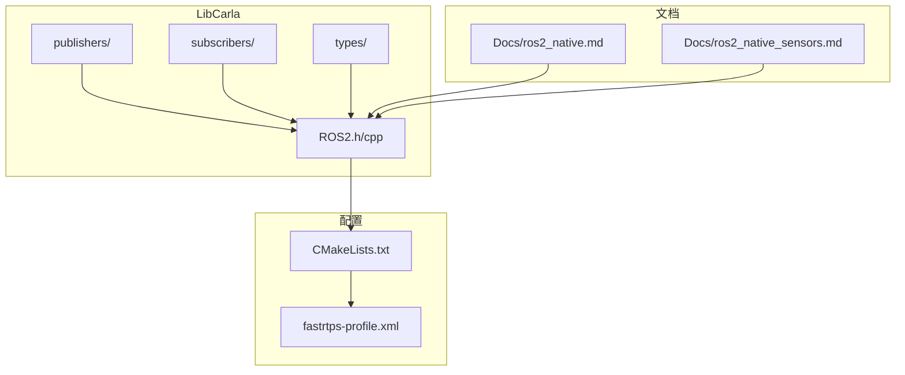
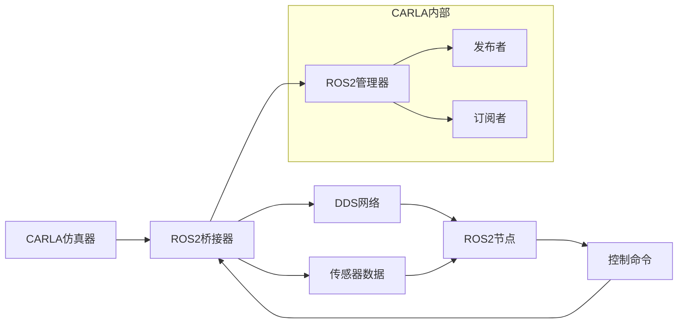
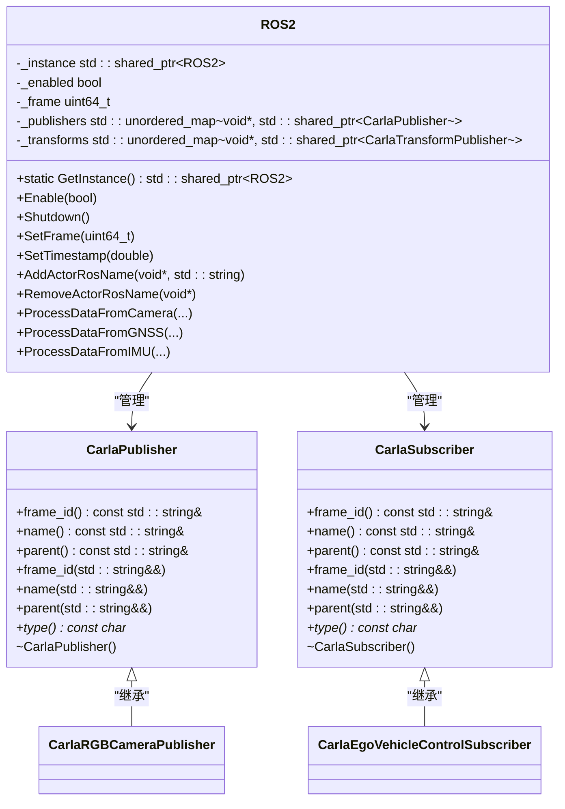
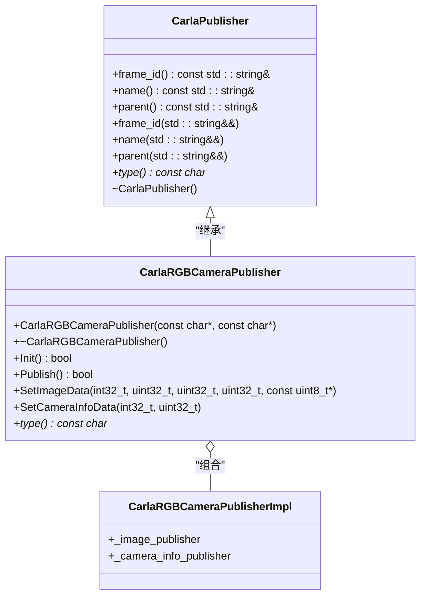
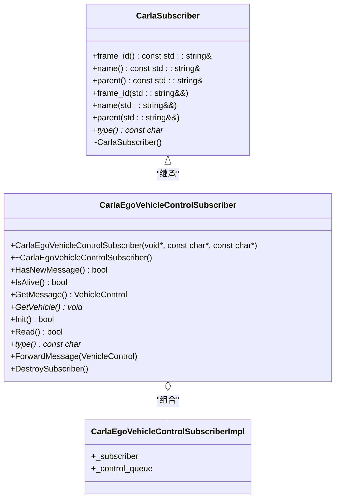
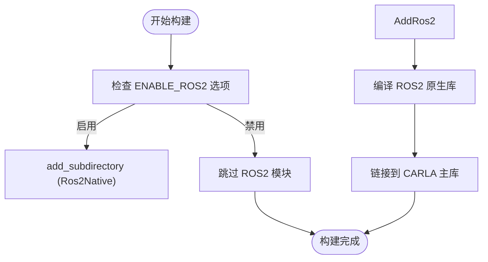
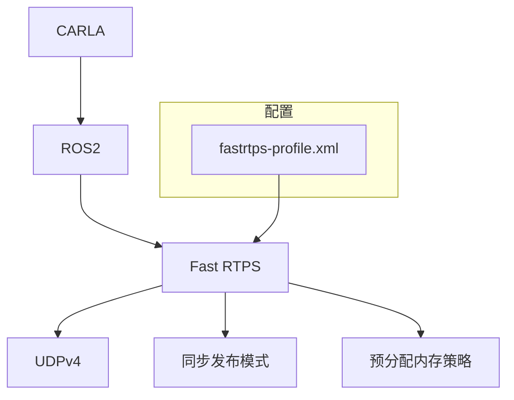

# ROS2 架构设计

> **引用文件**
> **本文档中引用的文件**

- [ROS2.h](https://github.com/carla-simulator/carla/blob/ue5-dev/LibCarla/source/carla/ros2/ROS2.h)
- [ROS2.cpp](https://github.com/carla-simulator/carla/blob/ue5-dev/LibCarla/source/carla/ros2/ROS2.cpp)
- [ROS2CallbackData.h](https://github.com/carla-simulator/carla/blob/ue5-dev/LibCarla/source/carla/ros2/ROS2CallbackData.h)
- [CarlaPublisher.h](https://github.com/carla-simulator/carla/blob/ue5-dev/LibCarla/source/carla/ros2/publishers/CarlaPublisher.h)
- [CarlaSubscriber.h](https://github.com/carla-simulator/carla/blob/ue5-dev/LibCarla/source/carla/ros2/subscribers/CarlaSubscriber.h)
- [CarlaRGBCameraPublisher.h](https://github.com/carla-simulator/carla/blob/ue5-dev/LibCarla/source/carla/ros2/publishers/CarlaRGBCameraPublisher.h)
- [CarlaEgoVehicleControlSubscriber.h](https://github.com/carla-simulator/carla/blob/ue5-dev/LibCarla/source/carla/ros2/subscribers/CarlaEgoVehicleControlSubscriber.h)
- [CMakeLists.txt](https://github.com/carla-simulator/carla/blob/ue5-dev/CMakeLists.txt)
- [ros2_native.md](https://github.com/carla-simulator/carla/blob/ue5-dev/Docs/ros2_native.md)
- [ros2_native_sensors.md](https://github.com/carla-simulator/carla/blob/ue5-dev/Docs/ros2_native_sensors.md)
- [fastrtps-profile.xml](https://github.com/carla-simulator/carla/blob/ue5-dev/PythonAPI/examples/ros2/config/fastrtps-profile.xml)
- [ros2_native.py](https://github.com/carla-simulator/carla/blob/ue5-dev/PythonAPI/examples/ros2/ros2_native.py)

## 目录

1. [引言](#引言)
2. [项目结构](#项目结构)
3. [核心组件](#核心组件)
4. [架构概述](#架构概述)
5. [详细组件分析](#详细组件分析)
6. [依赖分析](#依赖分析)
7. [性能考虑](#性能考虑)
8. [故障排除指南](#故障排除指南)
9. [结论](#结论)

## 引言

本文档详细描述了 CARLA 仿真器与 ROS2 生态系统之间的集成架构。文档重点介绍了 ROS2 通信层如何作为桥梁，连接 CARLA 仿真器与 ROS2 节点，包括初始化流程、节点管理、DDS 中间件配置等关键方面。通过分析 ROS2 类的职责划分，特别是发布者和订阅者的基类设计模式，以及 ROS2 插件系统的集成方式，本文档为开发者提供了全面的系统上下文理解。

## 项目结构

CARLA 的 ROS2 集成主要分布在`LibCarla/source/carla/ros2/`目录下，包含发布者、订阅者、类型定义和核心 ROS2 管理类。ROS2 功能通过 CMake 配置集成到 CARLA 构建系统中，允许在编译时启用或禁用 ROS2 支持。

**图源**

- [ROS2.h](https://github.com/carla-simulator/carla/blob/ue5-dev/LibCarla/source/carla/ros2/ROS2.h)
- [CMakeLists.txt](https://github.com/carla-simulator/carla/blob/ue5-dev/CMakeLists.txt)
- [fastrtps-profile.xml](https://github.com/carla-simulator/carla/blob/ue5-dev/PythonAPI/examples/ros2/config/fastrtps-profile.xml)

**本节来源**

- [ROS2.h](https://github.com/carla-simulator/carla/blob/ue5-dev/LibCarla/source/carla/ros2/ROS2.h)
- [CMakeLists.txt](https://github.com/carla-simulator/carla/blob/ue5-dev/CMakeLists.txt)

## 核心组件

CARLA 的 ROS2 集成核心由`ROS2`单例类管理，该类负责协调所有 ROS2 相关的发布者和订阅者。系统通过`CarlaPublisher`和`CarlaSubscriber`基类实现发布-订阅模式，支持多种传感器数据的发布和车辆控制命令的订阅。

**本节来源**

- [ROS2.h](https://github.com/carla-simulator/carla/blob/ue5-dev/LibCarla/source/carla/ros2/ROS2.h)
- [ROS2.cpp](https://github.com/carla-simulator/carla/blob/ue5-dev/LibCarla/source/carla/ros2/ROS2.cpp)

## 架构概述

CARLA 的 ROS2 架构采用分层设计，将仿真器与 ROS2 生态系统解耦。核心组件包括 ROS2 管理器、传感器发布者、控制订阅者和 DDS 中间件。系统通过`ROS2`单例类统一管理所有 ROS2 通信，确保线程安全和资源高效利用。

**图源**

- [ROS2.h](https://github.com/carla-simulator/carla/blob/ue5-dev/LibCarla/source/carla/ros2/ROS2.h)
- [ROS2.cpp](https://github.com/carla-simulator/carla/blob/ue5-dev/LibCarla/source/carla/ros2/ROS2.cpp)

## 详细组件分析

### ROS2 管理器分析

`ROS2`类作为系统的核心管理器，采用单例模式确保全局唯一实例。该类负责初始化 ROS2 环境、管理发布者和订阅者生命周期，并处理传感器数据的转发。

**图源**

- [ROS2.h](https://github.com/carla-simulator/carla/blob/ue5-dev/LibCarla/source/carla/ros2/ROS2.h)
- [CarlaPublisher.h](https://github.com/carla-simulator/carla/blob/ue5-dev/LibCarla/source/carla/ros2/publishers/CarlaPublisher.h)
- [CarlaSubscriber.h](https://github.com/carla-simulator/carla/blob/ue5-dev/LibCarla/source/carla/ros2/subscribers/CarlaSubscriber.h)

### 发布者基类分析

`CarlaPublisher`基类定义了所有 ROS2 发布者的公共接口和属性，包括 ROS 名称、父级名称和帧 ID。该基类采用组合模式，允许具体发布者类通过组合实现特定功能。

**图源**

- [CarlaPublisher.h](https://github.com/carla-simulator/carla/blob/ue5-dev/LibCarla/source/carla/ros2/publishers/CarlaPublisher.h)
- [CarlaRGBCameraPublisher.h](https://github.com/carla-simulator/carla/blob/ue5-dev/LibCarla/source/carla/ros2/publishers/CarlaRGBCameraPublisher.h)

### 订阅者基类分析

`CarlaSubscriber`基类为所有 ROS2 订阅者提供了统一的接口，与发布者基类对称设计。`CarlaEgoVehicleControlSubscriber`类专门处理车辆控制命令的订阅。

**图源**

- [CarlaSubscriber.h](https://github.com/carla-simulator/carla/blob/ue5-dev/LibCarla/source/carla/ros2/subscribers/CarlaSubscriber.h)
- [CarlaEgoVehicleControlSubscriber.h](https://github.com/carla-simulator/carla/blob/ue5-dev/LibCarla/source/carla/ros2/subscribers/CarlaEgoVehicleControlSubscriber.h)

### ROS2 插件系统集成

CARLA 通过 CMake 配置将 ROS2 功能编译到系统中。`ENABLE_ROS2`选项控制 ROS2 模块的编译，确保灵活性和可配置性。

**图源**

- [CMakeLists.txt](https://github.com/carla-simulator/carla/blob/ue5-dev/CMakeLists.txt)

**本节来源**

- [CMakeLists.txt](https://github.com/carla-simulator/carla/blob/ue5-dev/CMakeLists.txt)

## 依赖分析

CARLA 的 ROS2 集成依赖于 DDS 中间件（如 Fast RTPS）进行底层通信。系统通过`fastrtps-profile.xml`配置文件定义 DDS 传输参数，确保实时性和可靠性。

**图源**

- [fastrtps-profile.xml](https://github.com/carla-simulator/carla/blob/ue5-dev/PythonAPI/examples/ros2/config/fastrtps-profile.xml)

**本节来源**

- [fastrtps-profile.xml](https://github.com/carla-simulator/carla/blob/ue5-dev/PythonAPI/examples/ros2/config/fastrtps-profile.xml)

## 性能考虑

CARLA 的 ROS2 集成在性能方面需要考虑消息序列化开销、网络带宽需求和实时性保证。系统采用预分配内存策略和同步发布模式来优化性能。

| 性能因素           | 描述                                         | 优化策略                           |
| ------------------ | -------------------------------------------- | ---------------------------------- |
| **消息序列化开销** | 传感器数据（如图像、点云）的序列化和反序列化 | 使用高效的序列化库，减少数据拷贝   |
| **网络带宽需求**   | 高分辨率传感器数据的传输需求                 | 采用压缩算法，优化数据格式         |
| **实时性保证**     | 控制命令的及时响应                           | 使用同步发布模式，确保消息及时传递 |
| **内存使用**       | 大量传感器数据的内存占用                     | 预分配内存，减少动态分配开销       |
| **CPU 利用率**     | 数据处理和通信的 CPU 消耗                    | 优化算法，减少不必要的计算         |

**本节来源**

- [ROS2.cpp](https://github.com/carla-simulator/carla/blob/ue5-dev/LibCarla/source/carla/ros2/ROS2.cpp)
- [fastrtps-profile.xml](https://github.com/carla-simulator/carla/blob/ue5-dev/PythonAPI/examples/ros2/config/fastrtps-profile.xml)

## 故障排除指南

当 ROS2 集成出现问题时，可以检查以下方面：

1. **ROS2 启用状态**：确保 CARLA 启动时启用了 ROS2 功能（使用`--ros2`参数）。
2. **传感器配置**：确认传感器的`ros_name`属性已正确设置。
3. **DDS 配置**：检查`fastrtps-profile.xml`配置文件是否正确。
4. **网络连接**：确保 CARLA 服务器和 ROS2 节点之间的网络连接正常。
5. **主题名称**：验证 ROS2 主题名称是否符合预期格式（如`/carla/ego/vehicle_control_cmd`）。

**本节来源**

- [ros2_native.md](https://github.com/carla-simulator/carla/blob/ue5-dev/Docs/ros2_native.md)
- [ros2_native_sensors.md](https://github.com/carla-simulator/carla/blob/ue5-dev/Docs/ros2_native_sensors.md)

## 结论

CARLA 的 ROS2 集成提供了一个强大而灵活的桥梁，连接了仿真器与 ROS2 生态系统。通过精心设计的架构和模块化实现，系统能够高效地处理传感器数据发布和车辆控制命令订阅。未来的工作可以进一步优化性能，支持更多 ROS2 功能，并增强系统的可扩展性和可靠性。
