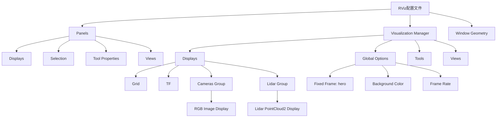
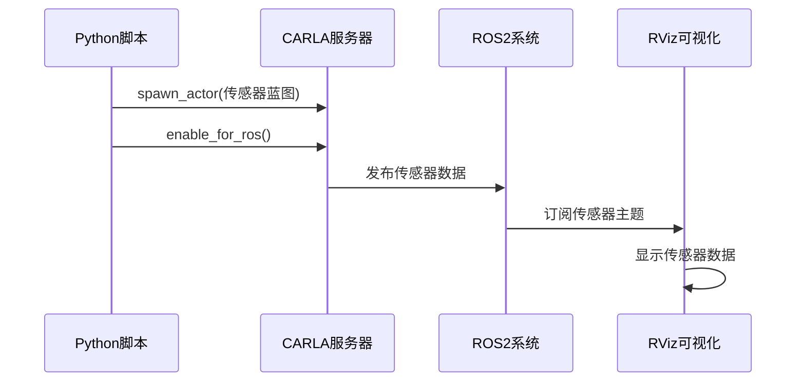
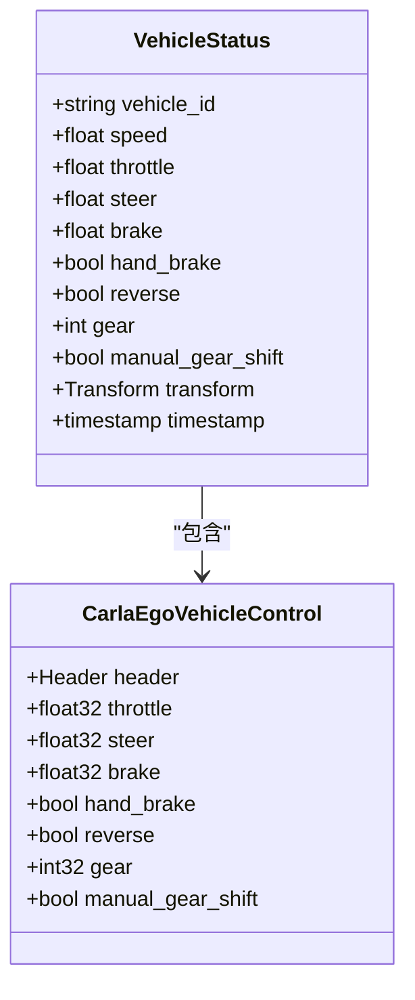
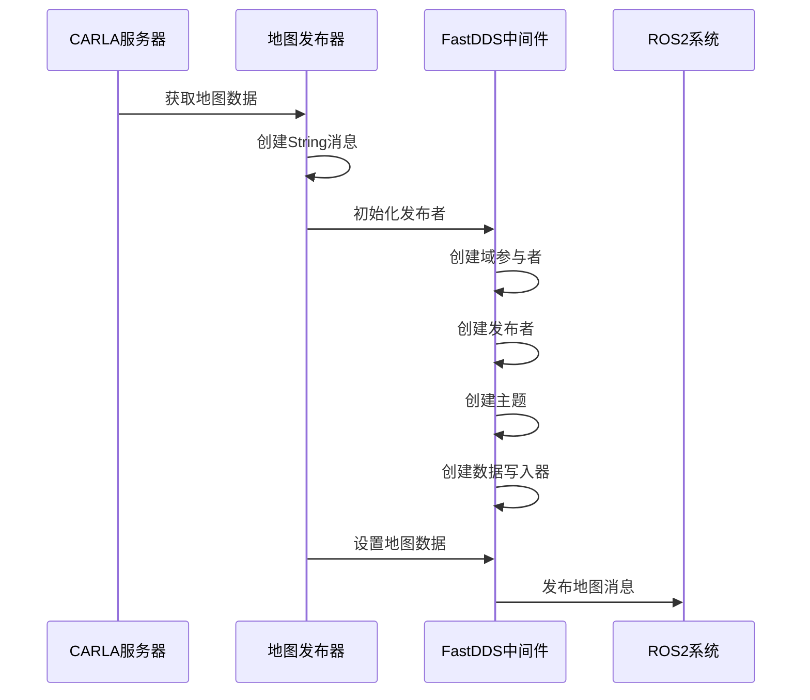
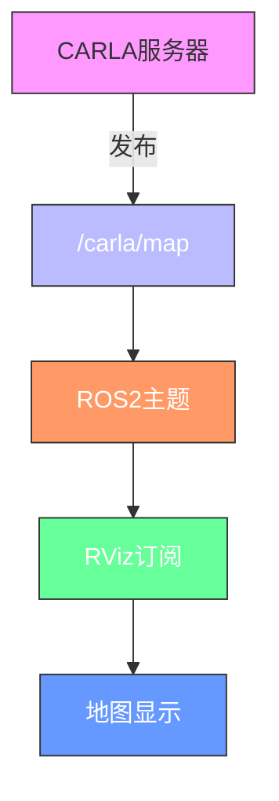
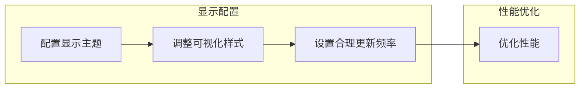
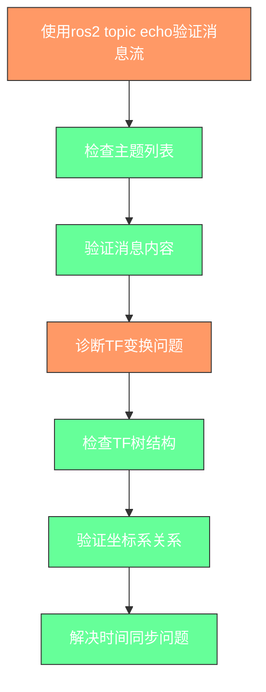

# 可视化与调试


**本文档中引用的文件**  
- [ros2_native.rviz](https://github.com/carla-simulator/carla/blob/ue5-dev/PythonAPI/examples/ros2/rviz/ros2_native.rviz)
- [ros2_native.py](https://github.com/carla-simulator/carla/blob/ue5-dev/PythonAPI/examples/ros2/ros2_native.py)
- [stack.json](https://github.com/carla-simulator/carla/blob/ue5-dev/PythonAPI/examples/ros2/stack.json)
- [README.md](https://github.com/carla-simulator/carla/blob/ue5-dev/PythonAPI/examples/ros2/README.md)
- [ros2_native.md](https://github.com/carla-simulator/carla/blob/ue5-dev/Docs/ros2_native.md)
- [ros2_native_sensors.md](https://github.com/carla-simulator/carla/blob/ue5-dev/Docs/ros2_native_sensors.md)
- [ROS2.cpp](https://github.com/carla-simulator/carla/blob/ue5-dev/LibCarla/source/carla/ros2/ROS2.cpp)
- [CarlaTransformPublisher.h](https://github.com/carla-simulator/carla/blob/ue5-dev/LibCarla/source/carla/ros2/publishers/CarlaTransformPublisher.h)
- [CarlaTransformPublisher.cpp](https://github.com/carla-simulator/carla/blob/ue5-dev/LibCarla/source/carla/ros2/publishers/CarlaTransformPublisher.cpp)
- [CarlaRGBCameraPublisher.h](https://github.com/carla-simulator/carla/blob/ue5-dev/LibCarla/source/carla/ros2/publishers/CarlaRGBCameraPublisher.h)
- [CarlaLidarPublisher.h](https://github.com/carla-simulator/carla/blob/ue5-dev/LibCarla/source/carla/ros2/publishers/CarlaLidarPublisher.h)
- [CarlaMapSensorPublisher.h](https://github.com/carla-simulator/carla/blob/ue5-dev/LibCarla/source/carla/ros2/publishers/CarlaMapSensorPublisher.h)
- [CarlaMapSensorPublisher.cpp](https://github.com/carla-simulator/carla/blob/ue5-dev/LibCarla/source/carla/ros2/publishers/CarlaMapSensorPublisher.cpp)
- [run_rviz.sh](https://github.com/carla-simulator/carla/blob/ue5-dev/PythonAPI/examples/ros2/run_rviz.sh)


## 目录
1. [简介](#简介)
2. [ROS2可视化配置](#ros2可视化配置)
3. [RViz配置文件结构解析](#rviz配置文件结构解析)
4. [传感器数据显示设置](#传感器数据显示设置)
5. [TF变换可视化](#tf变换可视化)
6. [车辆状态监控](#车辆状态监控)
7. [地图传感器数据发布机制](#地图传感器数据发布机制)
8. [CARLA环境地图显示](#carla环境地图显示)
9. [最佳实践](#最佳实践)
10. [调试技巧](#调试技巧)

## 简介
本文档详细介绍了CARLA模拟器中ROS2可视化集成的实现方法，重点阐述了RViz配置和调试工具的使用。文档深入解析了`ros2_native.rviz`配置文件的结构，说明了如何设置传感器数据显示、TF变换可视化和车辆状态监控。同时，文档化了地图传感器数据的发布机制，以及如何在RViz中正确显示CARLA环境地图。提供了配置显示主题、调整可视化样式和设置合理更新频率的最佳实践，并包含使用`ros2 topic echo`命令验证消息流和诊断TF变换问题的调试技巧。

**Section sources**
- [ros2_native.md](https://github.com/carla-simulator/carla/blob/ue5-dev/Docs/ros2_native.md#L1-L64)
- [ros2_native_sensors.md](https://github.com/carla-simulator/carla/blob/ue5-dev/Docs/ros2_native_sensors.md#L1-L94)

## ROS2可视化配置
CARLA模拟器支持从服务器端原生使用ROS2。要启用ROS2功能，需要在启动CARLA模拟器时添加`--ros2`命令行选项。ROS2可视化主要通过RViz工具实现，该工具通过Docker容器运行，以便在不同系统上保持一致性。

**Section sources**
- [README.md](https://github.com/carla-simulator/carla/blob/ue5-dev/PythonAPI/examples/ros2/README.md#L1-L41)
- [run_rviz.sh](https://github.com/carla-simulator/carla/blob/ue5-dev/PythonAPI/examples/ros2/run_rviz.sh#L1-L25)

## RViz配置文件结构解析
`ros2_native.rviz`配置文件定义了RViz的显示设置和可视化管理器配置。该文件包含面板设置、显示配置、工具设置和窗口几何信息。



**Diagram sources**
- [ros2_native.rviz](https://github.com/carla-simulator/carla/blob/ue5-dev/PythonAPI/examples/ros2/rviz/ros2_native.rviz#L1-L210)

**Section sources**
- [ros2_native.rviz](https://github.com/carla-simulator/carla/blob/ue5-dev/PythonAPI/examples/ros2/rviz/ros2_native.rviz#L1-L210)

## 传感器数据显示设置
CARLA服务器会为已启用ROS功能的传感器广播传感器数据。可以通过传感器类的`enable_for_ros()`方法启用传感器的ROS功能。传感器的ROS主题名称可以在生成传感器之前在蓝图中设置。



**Diagram sources**
- [ros2_native.py](https://github.com/carla-simulator/carla/blob/ue5-dev/PythonAPI/examples/ros2/ros2_native.py#L1-L132)
- [ROS2.cpp](https://github.com/carla-simulator/carla/blob/ue5-dev/LibCarla/source/carla/ros2/ROS2.cpp#L662-L779)

**Section sources**
- [ros2_native.py](https://github.com/carla-simulator/carla/blob/ue5-dev/PythonAPI/examples/ros2/ros2_native.py#L35-L63)
- [ros2_native.md](https://github.com/carla-simulator/carla/blob/ue5-dev/Docs/ros2_native.md#L11-L29)
- [ros2_native_sensors.md](https://github.com/carla-simulator/carla/blob/ue5-dev/Docs/ros2_native_sensors.md#L37-L94)

## TF变换可视化
TF（Transform）变换在ROS2中用于表示不同坐标系之间的空间关系。在CARLA中，TF变换用于表示车辆、传感器和其他实体之间的相对位置和方向。RViz中的TF显示可以可视化这些变换关系。

```mermaid
erDiagram
hero : "车辆坐标系"
lidar : "激光雷达坐标系"
rgb : "RGB相机坐标系"
hero ||--o{ lidar : "包含"
hero ||--o{ rgb : "包含"
class hero {
+string frame_id
+Transform transform
+timestamp timestamp
}
class lidar {
+string frame_id
+Transform transform
+timestamp timestamp
}
class rgb {
+string frame_id
+Transform transform
+timestamp timestamp
}
```

**Diagram sources**
- [CarlaTransformPublisher.h](https://github.com/carla-simulator/carla/blob/ue5-dev/LibCarla/source/carla/ros2/publishers/CarlaTransformPublisher.h#L1-L35)
- [CarlaTransformPublisher.cpp](https://github.com/carla-simulator/carla/blob/ue5-dev/LibCarla/source/carla/ros2/publishers/CarlaTransformPublisher.cpp#L1-L257)
- [ros2_native.rviz](https://github.com/carla-simulator/carla/blob/ue5-dev/PythonAPI/examples/ros2/rviz/ros2_native.rviz#L46-L69)

**Section sources**
- [CarlaTransformPublisher.h](https://github.com/carla-simulator/carla/blob/ue5-dev/LibCarla/source/carla/ros2/publishers/CarlaTransformPublisher.h#L1-L35)
- [CarlaTransformPublisher.cpp](https://github.com/carla-simulator/carla/blob/ue5-dev/LibCarla/source/carla/ros2/publishers/CarlaTransformPublisher.cpp#L1-L257)
- [ros2_native.rviz](https://github.com/carla-simulator/carla/blob/ue5-dev/PythonAPI/examples/ros2/rviz/ros2_native.rviz#L46-L69)

## 车辆状态监控
通过ROS2接口，可以监控车辆的各种状态信息，包括位置、速度、姿态等。这些信息对于自动驾驶系统的开发和调试至关重要。



**Diagram sources**
- [ros2_native.md](https://github.com/carla-simulator/carla/blob/ue5-dev/Docs/ros2_native.md#L46-L60)
- [ros2_native.py](https://github.com/carla-simulator/carla/blob/ue5-dev/PythonAPI/examples/ros2/ros2_native.py#L19-L32)

**Section sources**
- [ros2_native.md](https://github.com/carla-simulator/carla/blob/ue5-dev/Docs/ros2_native.md#L33-L60)
- [ros2_native.py](https://github.com/carla-simulator/carla/blob/ue5-dev/PythonAPI/examples/ros2/ros2_native.py#L19-L32)

## 地图传感器数据发布机制
CARLA通过`CarlaMapSensorPublisher`类发布地图传感器数据。该发布器使用FastDDS作为通信中间件，将地图数据以ROS2消息的形式发布到指定主题。



**Diagram sources**
- [CarlaMapSensorPublisher.h](https://github.com/carla-simulator/carla/blob/ue5-dev/LibCarla/source/carla/ros2/publishers/CarlaMapSensorPublisher.h#L1-L34)
- [CarlaMapSensorPublisher.cpp](https://github.com/carla-simulator/carla/blob/ue5-dev/LibCarla/source/carla/ros2/publishers/CarlaMapSensorPublisher.cpp#L1-L208)

**Section sources**
- [CarlaMapSensorPublisher.h](https://github.com/carla-simulator/carla/blob/ue5-dev/LibCarla/source/carla/ros2/publishers/CarlaMapSensorPublisher.h#L1-L34)
- [CarlaMapSensorPublisher.cpp](https://github.com/carla-simulator/carla/blob/ue5-dev/LibCarla/source/carla/ros2/publishers/CarlaMapSensorPublisher.cpp#L1-L208)

## CARLA环境地图显示
在RViz中显示CARLA环境地图需要正确配置地图数据的发布和订阅。地图数据通常以字符串形式发布，包含OpenDRIVE格式的地图信息。



**Diagram sources**
- [CarlaMapSensorPublisher.h](https://github.com/carla-simulator/carla/blob/ue5-dev/LibCarla/source/carla/ros2/publishers/CarlaMapSensorPublisher.h#L1-L34)
- [ros2_native.rviz](https://github.com/carla-simulator/carla/blob/ue5-dev/PythonAPI/examples/ros2/rviz/ros2_native.rviz#L25-L131)

**Section sources**
- [CarlaMapSensorPublisher.h](https://github.com/carla-simulator/carla/blob/ue5-dev/LibCarla/source/carla/ros2/publishers/CarlaMapSensorPublisher.h#L1-L34)
- [ros2_native.rviz](https://github.com/carla-simulator/carla/blob/ue5-dev/PythonAPI/examples/ros2/rviz/ros2_native.rviz#L25-L131)

## 最佳实践
为了获得最佳的ROS2可视化体验，建议遵循以下最佳实践：



**Section sources**
- [ros2_native.rviz](https://github.com/carla-simulator/carla/blob/ue5-dev/PythonAPI/examples/ros2/rviz/ros2_native.rviz#L25-L131)
- [ros2_native.py](https://github.com/carla-simulator/carla/blob/ue5-dev/PythonAPI/examples/ros2/ros2_native.py#L66-L132)

## 调试技巧
有效的调试技巧对于开发和维护ROS2集成系统至关重要。以下是一些常用的调试方法：



**Section sources**
- [ros2_native.md](https://github.com/carla-simulator/carla/blob/ue5-dev/Docs/ros2_native.md#L1-L64)
- [README.md](https://github.com/carla-simulator/carla/blob/ue5-dev/PythonAPI/examples/ros2/README.md#L1-L41)