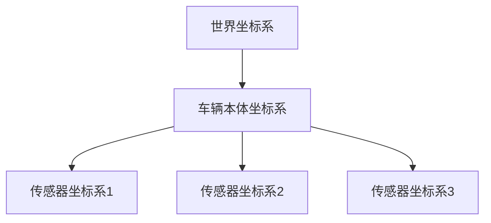

# 坐标系与转换

> **引用文件**
> **本文档引用的文件**

- [CarlaTransformPublisher.h](https://github.com/carla-simulator/carla/blob/ue5-dev/LibCarla/source/carla/ros2/publishers/CarlaTransformPublisher.h)
- [CarlaTransformPublisher.cpp](https://github.com/carla-simulator/carla/blob/ue5-dev/LibCarla/source/carla/ros2/publishers/CarlaTransformPublisher.cpp)
- [Transform.h](https://github.com/carla-simulator/carla/blob/ue5-dev/LibCarla/source/carla/geom/Transform.h)
- [Rotation.h](https://github.com/carla-simulator/carla/blob/ue5-dev/LibCarla/source/carla/geom/Rotation.h)
- [Math.h](https://github.com/carla-simulator/carla/blob/ue5-dev/LibCarla/source/carla/geom/Math.h)
- [Vector3D.h](https://github.com/carla-simulator/carla/blob/ue5-dev/LibCarla/source/carla/geom/Vector3D.h)
- [python_api.md](https://github.com/carla-simulator/carla/blob/ue5-dev/Docs/python_api.md)
- [ros2_native.md](https://github.com/carla-simulator/carla/blob/ue5-dev/Docs/ros2_native.md)

## 目录

1. [引言](#引言)
2. [CARLA 与 ROS2 坐标系差异](#carla与ros2坐标系差异)
3. [坐标系转换矩阵](#坐标系转换矩阵)
4. [TF2 变换发布机制](#tf2变换发布机制)
5. [CarlaTransformPublisher 实现细节](#carlatransformpublisher实现细节)
6. [常见错误与故障排除](#常见错误与故障排除)
7. [结论](#结论)

## 引言

本文档详细解释 CARLA 仿真器与 ROS2 系统之间的坐标系转换机制。CARLA 基于 Unreal Engine 构建，使用左手坐标系（Z 轴向上），而 ROS2 遵循右手坐标系（Y 轴向上）标准。这种坐标系差异要求在数据交换时进行精确的数学转换。文档将深入分析坐标系转换的数学原理、TF2 变换的发布机制、CarlaTransformPublisher 的实现细节，并提供故障排除指南。

## CARLA 与 ROS2 坐标系差异

CARLA 仿真器采用 Unreal Engine 的坐标系统，这是一个左手坐标系，其中 Z 轴指向上方。在该系统中，旋转角度按照(pitch, yaw, roll)的顺序定义，分别对应 Y 轴、Z 轴和 X 轴的旋转。具体来说：

- **Pitch**：绕 Y 轴的旋转
- **Yaw**：绕 Z 轴的旋转
- **Roll**：绕 X 轴的旋转

相比之下，ROS2 使用标准的右手坐标系，其中 Y 轴指向上方。这种根本性的坐标系差异要求在数据交换时进行坐标变换。CARLA 中的位置和旋转数据必须经过特定的数学转换才能在 ROS2 中正确使用。

**Section sources**

- <a href="https://github.com/carla-simulator/carla/blob/ue5-dev/Docs/python_api.md#L1650-L1660" target="_blank">python_api.md</a>
- <a href="https://github.com/carla-simulator/carla/blob/ue5-dev/LibCarla/source/carla/geom/Rotation.h#L43-L127" target="_blank">Rotation.h</a>

## 坐标系转换矩阵

### 位置向量转换

在 CARLA 到 ROS2 的转换中，位置向量需要进行坐标轴映射和符号调整。具体转换公式为：

```
ROS2_x = CARLA_x
ROS2_y = -CARLA_y
ROS2_z = CARLA_z
```

这种转换反映了从左手系到右手系的坐标轴重新映射，其中 Y 轴方向需要取反。

### 旋转四元数转换

旋转的转换更为复杂，涉及欧拉角到四元数的转换以及坐标系的调整。在 CarlaTransformPublisher 的实现中，旋转转换的关键步骤包括：

1. 将 CARLA 的欧拉角（度）转换为弧度
2. 对 pitch 和 yaw 角度应用-1.0 的缩放因子
3. 使用四元数乘法公式计算最终的旋转四元数

转换的核心代码逻辑如下：

```cpp
const float rx = ((*rotation++) * -1.0f) * (M_PIf32 / 180.0f);
const float ry = ((*rotation++) * -1.0f) * (M_PIf32 / 180.0f);
const float rz = *rotation++ * (M_PIf32 / 180.0f);

_impl->vec_rotation.w(cr * cp * cy + sr * sp * sy);
_impl->vec_rotation.x(sr * cp * cy - cr * sp * sy);
_impl->vec_rotation.y(cr * sp * cy + sr * cp * sy);
_impl->vec_rotation.z(cr * cp * sy - sr * sp * cy);
```

### 变换矩阵

CARLA 中的变换矩阵可以通过 Transform 类的 GetMatrix()方法获取，该方法返回一个 4x4 的齐次变换矩阵，包含了旋转和平移信息。这个矩阵在内部使用 cos 和 sin 函数计算旋转分量，并结合位置信息构建完整的变换矩阵。

**Section sources**

- <a href="https://github.com/carla-simulator/carla/blob/ue5-dev/LibCarla/source/carla/ros2/publishers/CarlaTransformPublisher.cpp#L150-L181" target="_blank">CarlaTransformPublisher.cpp</a>
- <a href="https://github.com/carla-simulator/carla/blob/ue5-dev/LibCarla/source/carla/geom/Transform.h#L90-L107" target="_blank">Transform.h</a>

## TF2 变换发布机制

### 坐标系层次关系

在 CARLA-ROS2 集成中，建立了清晰的坐标系层次结构：

- **世界坐标系 (world)**：全局参考坐标系
- **车辆本体坐标系 (vehicle)**：固定在车辆中心，随车辆移动
- **传感器坐标系 (sensor)**：固定在各个传感器上，相对于车辆坐标系有固定的偏移

这种层次关系通过 TF2 的父子坐标系机制实现，允许在不同坐标系之间进行无缝转换。

### 变换时间戳同步

CarlaTransformPublisher 通过 SetData 方法接收时间戳信息（秒和纳秒），确保变换数据与仿真时间同步。时间戳被封装在 std_msgs::msg::Header 中，与变换数据一起发布，保证了数据的时间一致性。

### 坐标系命名约定

坐标系命名遵循 CARLA 的命名规范：

- 父坐标系通过\_parent 参数指定
- 子坐标系通过\_child_frame_id 指定
- 默认 TF 话题为`/rt/tf`

这种命名约定确保了不同实体之间的变换关系能够被正确识别和处理。



**Diagram sources**

- <a href="https://github.com/carla-simulator/carla/blob/ue5-dev/LibCarla/source/carla/ros2/publishers/CarlaTransformPublisher.cpp#L183-L199" target="_blank">CarlaTransformPublisher.cpp</a>
- <a href="https://github.com/carla-simulator/carla/blob/ue5-dev/LibCarla/source/carla/ros2/publishers/CarlaTransformPublisher.h#L17-L33" target="_blank">CarlaTransformPublisher.h</a>

## CarlaTransformPublisher 实现细节

### 类结构与初始化

CarlaTransformPublisher 继承自 CarlaPublisher 基类，使用 Pimpl 模式（Pointer to implementation）封装内部实现。初始化过程包括：

1. 创建 DDS 域参与者（DomainParticipant）
2. 创建发布者（Publisher）
3. 创建话题（Topic）
4. 注册 TFMessage 类型

### 数据发布流程

数据发布遵循以下流程：

1. 调用 SetData()设置变换数据
2. 检查数据是否发生变化（避免重复发布）
3. 执行坐标系转换
4. 构造 TransformStamped 消息
5. 通过 DDS 发布消息

关键的发布方法 Publish()处理了各种可能的错误码，确保系统的健壮性。

### 性能优化

实现中包含多项性能优化：

- 使用 memcmp()检查数据变化，避免不必要的计算和发布
- 使用 std::shared_ptr 管理内部实现，确保线程安全
- 在构造函数中预分配资源，减少运行时开销

**Section sources**

- <a href="https://github.com/carla-simulator/carla/blob/ue5-dev/LibCarla/source/carla/ros2/publishers/CarlaTransformPublisher.h#L17-L33" target="_blank">CarlaTransformPublisher.h</a>
- <a href="https://github.com/carla-simulator/carla/blob/ue5-dev/LibCarla/source/carla/ros2/publishers/CarlaTransformPublisher.cpp#L45-L87" target="_blank">CarlaTransformPublisher.cpp</a>

## 常见错误与故障排除

### 方向错误

最常见的问题是方向错误，通常由以下原因引起：

- 忘记对 Y 轴进行符号取反
- 欧拉角顺序错误
- 旋转方向理解错误

**解决方案**：仔细检查 CarlaTransformPublisher 中的 rx、ry、rz 计算，确保正确应用了-1.0 的缩放因子。

### 尺度不匹配

尺度问题通常表现为位置数据过大或过小，原因包括：

- 未正确处理单位转换（CARLA 使用厘米，ROS2 使用米）
- 浮点数精度问题

**解决方案**：确认所有位置数据都经过了正确的单位转换，必要时使用 Vector3D 的 ToMeters()或 ToCentimeters()方法。

### 时间同步问题

时间戳不同步会导致 TF 查找失败，表现为：

- "Could not find a connection between 'frame1' and 'frame2'"错误
- 变换数据延迟或丢失

**解决方案**：确保仿真时间和 ROS 时间正确同步，检查 SetTimestamp()调用是否正常工作。

### 变换丢失

变换丢失通常由以下原因造成：

- 发布者未正确初始化
- DDS 网络配置问题
- 频繁发布相同数据被优化掉

**解决方案**：检查 Init()方法的返回值，确保所有 DDS 组件创建成功；验证网络配置；确保数据确实发生变化。

**Section sources**

- <a href="https://github.com/carla-simulator/carla/blob/ue5-dev/LibCarla/source/carla/ros2/publishers/CarlaTransformPublisher.cpp#L88-L121" target="_blank">CarlaTransformPublisher.cpp</a>
- <a href="https://github.com/carla-simulator/carla/blob/ue5-dev/Docs/ros2_native.md#L1-L64" target="_blank">ros2_native.md</a>

## 结论

CARLA 与 ROS2 的坐标系转换是一个关键的集成环节，涉及复杂的数学变换和精确的系统集成。通过理解 Unreal Engine 左手系与 ROS 右手系的根本差异，掌握转换矩阵的数学原理，熟悉 TF2 变换的发布机制，开发者可以确保仿真数据在两个系统间的准确传递。CarlaTransformPublisher 的实现展示了如何高效、可靠地处理这些转换，为自动驾驶系统的开发提供了坚实的基础。
