# GNSS 发布器

> **引用文件**
> **本文档引用的文件**

- [CarlaGNSSPublisher.h](https://github.com/carla-simulator/carla/blob/ue5-dev/LibCarla/source/carla/ros2/publishers/CarlaGNSSPublisher.h)
- [CarlaGNSSPublisher.cpp](https://github.com/carla-simulator/carla/blob/ue5-dev/LibCarla/source/carla/ros2/publishers/CarlaGNSSPublisher.cpp)
- [NavSatFix.h](https://github.com/carla-simulator/carla/blob/ue5-dev/LibCarla/source/carla/ros2/types/NavSatFix.h)
- [NavSatFixPubSubTypes.h](https://github.com/carla-simulator/carla/blob/ue5-dev/LibCarla/source/carla/ros2/types/NavSatFixPubSubTypes.h)
- [ROS2.h](https://github.com/carla-simulator/carla/blob/ue5-dev/LibCarla/source/carla/ros2/ROS2.h)
- [ROS2.cpp](https://github.com/carla-simulator/carla/blob/ue5-dev/LibCarla/source/carla/ros2/ROS2.cpp)
- [GnssSensor.h](https://github.com/carla-simulator/carla/blob/ue5-dev/Unreal/CarlaUnreal/Plugins/Carla/Source/Carla/Sensor/GnssSensor.h)
- [GnssSensor.cpp](https://github.com/carla-simulator/carla/blob/ue5-dev/Unreal/CarlaUnreal/Plugins/Carla/Source/Carla/Sensor/GnssSensor.cpp)
- [GeoLocation.h](https://github.com/carla-simulator/carla/blob/ue5-dev/LibCarla/source/carla/geom/GeoLocation.h)
- [GeoLocation.cpp](https://github.com/carla-simulator/carla/blob/ue5-dev/LibCarla/source/carla/geom/GeoLocation.cpp)
- [ros2_native.py](https://github.com/carla-simulator/carla/blob/ue5-dev/PythonAPI/examples/ros2/ros2_native.py)

## 目录

1. [简介](#简介)
2. [项目结构](#项目结构)
3. [核心组件](#核心组件)
4. [架构概述](#架构概述)
5. [详细组件分析](#详细组件分析)
6. [依赖分析](#依赖分析)
7. [性能考虑](#性能考虑)
8. [故障排除指南](#故障排除指南)
9. [结论](#结论)

## 简介

本文档详细描述了 CARLA 模拟器中 GNSS 发布器（CarlaGNSSPublisher）的实现机制，该发布器负责将车辆的全球导航卫星系统（GNSS）数据转换为 ROS2 标准的 sensor_msgs/NavSatFix 消息格式。文档涵盖了从 CARLA 局部坐标系到 WGS84 地理坐标系的坐标转换过程、GNSS 数据的获取与发布机制，以及定位精度（协方差）的模拟方法。此外，还提供了使用这些 GNSS 数据进行定位和地图匹配的实践指南。

## 项目结构

CARLA 的 GNSS 发布器功能主要分布在 LibCarla 库的 ROS2 模块中，涉及传感器数据处理、消息发布和坐标转换等多个组件。核心文件位于`LibCarla/source/carla/ros2/publishers/`目录下，其中`CarlaGNSSPublisher`类负责 GNSS 数据的 ROS2 消息发布。

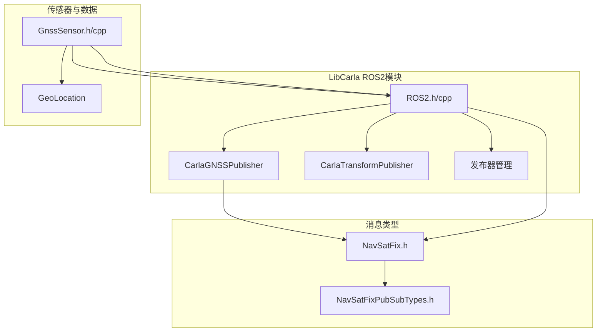

**图源**

- [CarlaGNSSPublisher.h](https://github.com/carla-simulator/carla/blob/ue5-dev/LibCarla/source/carla/ros2/publishers/CarlaGNSSPublisher.h)
- [ROS2.h](https://github.com/carla-simulator/carla/blob/ue5-dev/LibCarla/source/carla/ros2/ROS2.h)
- [GnssSensor.h](https://github.com/carla-simulator/carla/blob/ue5-dev/Unreal/CarlaUnreal/Plugins/Carla/Source/Carla/Sensor/GnssSensor.h)
- [NavSatFix.h](https://github.com/carla-simulator/carla/blob/ue5-dev/LibCarla/source/carla/ros2/types/NavSatFix.h)

**本节来源**

- [CarlaGNSSPublisher.h](https://github.com/carla-simulator/carla/blob/ue5-dev/LibCarla/source/carla/ros2/publishers/CarlaGNSSPublisher.h)
- [ROS2.h](https://github.com/carla-simulator/carla/blob/ue5-dev/LibCarla/source/carla/ros2/ROS2.h)
- [GnssSensor.h](https://github.com/carla-simulator/carla/blob/ue5-dev/Unreal/CarlaUnreal/Plugins/Carla/Source/Carla/Sensor/GnssSensor.h)

## 核心组件

CarlaGNSSPublisher 是 GNSS 数据发布的核心组件，它继承自 CarlaPublisher 基类，实现了 GNSS 传感器数据到 ROS2 消息的转换和发布。该组件通过 Fast DDS 中间件将 GNSS 数据发布到指定的 ROS2 话题上。GNSS 数据的来源是 CARLA 模拟器中的 GnssSensor，该传感器在每次物理引擎更新后计算车辆的地理坐标。

**本节来源**

- [CarlaGNSSPublisher.h](https://github.com/carla-simulator/carla/blob/ue5-dev/LibCarla/source/carla/ros2/publishers/CarlaGNSSPublisher.h)
- [GnssSensor.h](https://github.com/carla-simulator/carla/blob/ue5-dev/Unreal/CarlaUnreal/Plugins/Carla/Source/Carla/Sensor/GnssSensor.h)

## 架构概述

GNSS 发布器的架构涉及多个层次的协作：从底层的 GnssSensor 获取车辆位置，通过坐标转换得到 WGS84 地理坐标，再到 ROS2 模块处理数据流，最后由 CarlaGNSSPublisher 将数据封装为 NavSatFix 消息并发布。

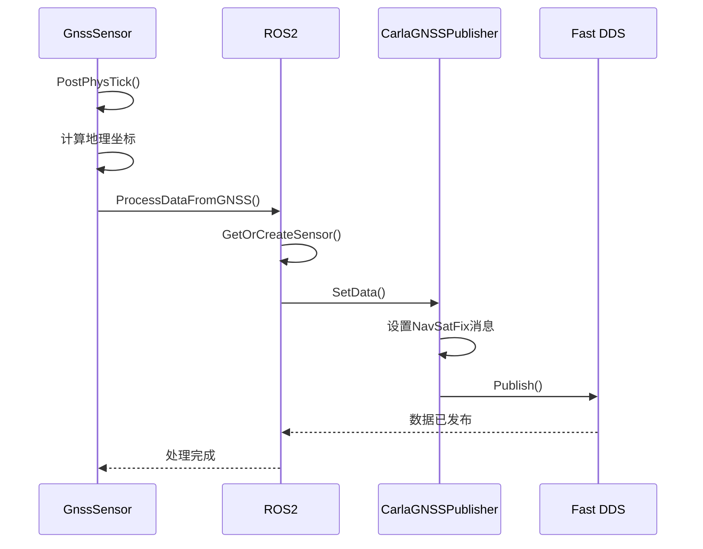

**图源**

- [GnssSensor.cpp](https://github.com/carla-simulator/carla/blob/ue5-dev/Unreal/CarlaUnreal/Plugins/Carla/Source/Carla/Sensor/GnssSensor.cpp)
- [ROS2.cpp](https://github.com/carla-simulator/carla/blob/ue5-dev/LibCarla/source/carla/ros2/ROS2.cpp)
- [CarlaGNSSPublisher.cpp](https://github.com/carla-simulator/carla/blob/ue5-dev/LibCarla/source/carla/ros2/publishers/CarlaGNSSPublisher.cpp)

## 详细组件分析

### CarlaGNSSPublisher 分析

CarlaGNSSPublisher 类负责将 GNSS 数据转换为 ROS2 的 NavSatFix 消息并发布。其主要功能包括初始化发布器、设置数据和发布消息。

#### 类结构

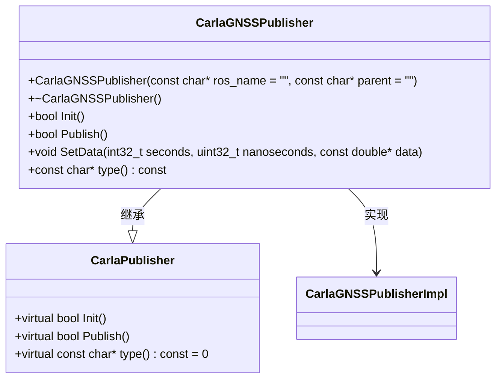

**图源**

- [CarlaGNSSPublisher.h](https://github.com/carla-simulator/carla/blob/ue5-dev/LibCarla/source/carla/ros2/publishers/CarlaGNSSPublisher.h)
- [CarlaPublisher.h](https://github.com/carla-simulator/carla/blob/ue5-dev/LibCarla/source/carla/ros2/publishers/CarlaPublisher.h)

#### 初始化与发布流程

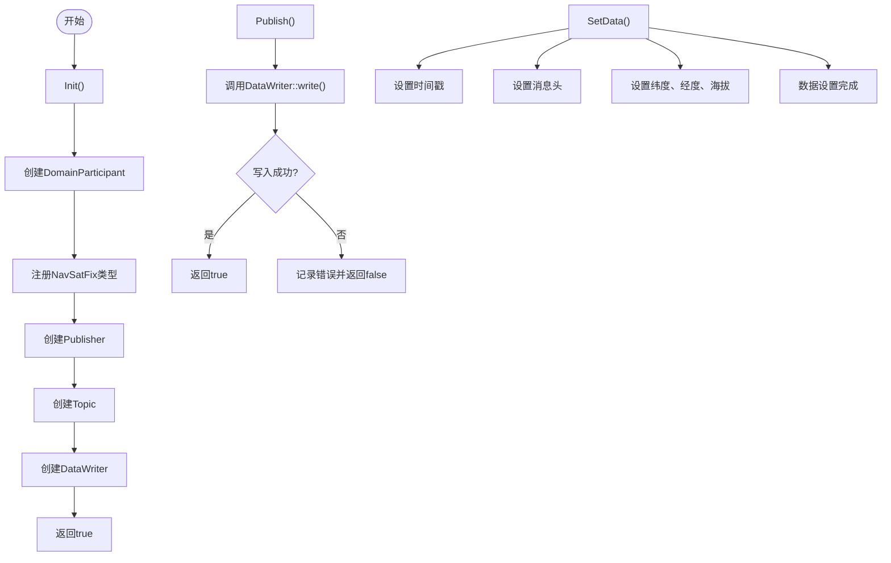

**图源**

- [CarlaGNSSPublisher.cpp](https://github.com/carla-simulator/carla/blob/ue5-dev/LibCarla/source/carla/ros2/publishers/CarlaGNSSPublisher.cpp)

**本节来源**

- [CarlaGNSSPublisher.h](https://github.com/carla-simulator/carla/blob/ue5-dev/LibCarla/source/carla/ros2/publishers/CarlaGNSSPublisher.h)
- [CarlaGNSSPublisher.cpp](https://github.com/carla-simulator/carla/blob/ue5-dev/LibCarla/source/carla/ros2/publishers/CarlaGNSSPublisher.cpp)

### GnssSensor 分析

GnssSensor 是 CARLA 模拟器中的 GNSS 传感器实现，负责计算车辆的地理坐标并触发数据发布。

#### 坐标转换机制

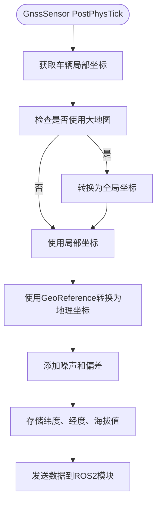

**图源**

- [GnssSensor.cpp](https://github.com/carla-simulator/carla/blob/ue5-dev/Unreal/CarlaUnreal/Plugins/Carla/Source/Carla/Sensor/GnssSensor.cpp)

#### 噪声与偏差模拟

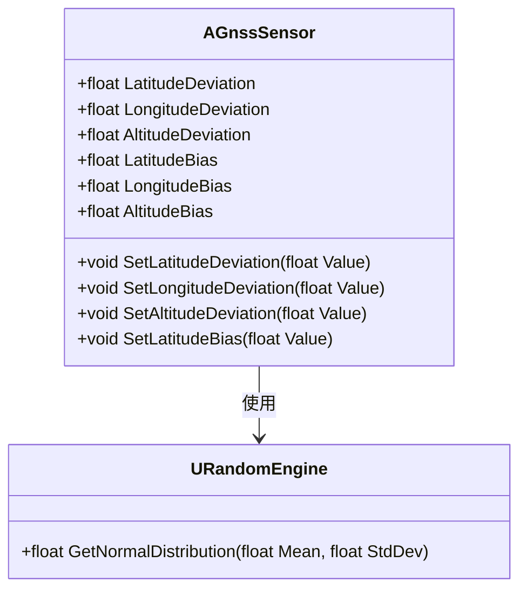

**图源**

- [GnssSensor.h](https://github.com/carla-simulator/carla/blob/ue5-dev/Unreal/CarlaUnreal/Plugins/Carla/Source/Carla/Sensor/GnssSensor.h)
- [GnssSensor.cpp](https://github.com/carla-simulator/carla/blob/ue5-dev/Unreal/CarlaUnreal/Plugins/Carla/Source/Carla/Sensor/GnssSensor.cpp)

**本节来源**

- [GnssSensor.h](https://github.com/carla-simulator/carla/blob/ue5-dev/Unreal/CarlaUnreal/Plugins/Carla/Source/Carla/Sensor/GnssSensor.h)
- [GnssSensor.cpp](https://github.com/carla-simulator/carla/blob/ue5-dev/Unreal/CarlaUnreal/Plugins/Carla/Source/Carla/Sensor/GnssSensor.cpp)

### GeoLocation 坐标转换分析

GeoLocation 类负责实现从 CARLA 局部坐标系到 WGS84 地理坐标系的转换，使用墨卡托投影算法。

#### 坐标转换算法

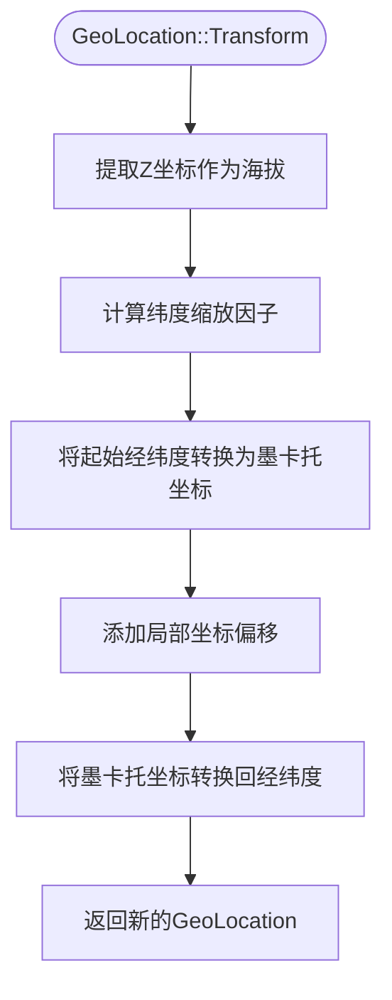

**图源**

- [GeoLocation.cpp](https://github.com/carla-simulator/carla/blob/ue5-dev/LibCarla/source/carla/geom/GeoLocation.cpp)

#### 数学公式实现

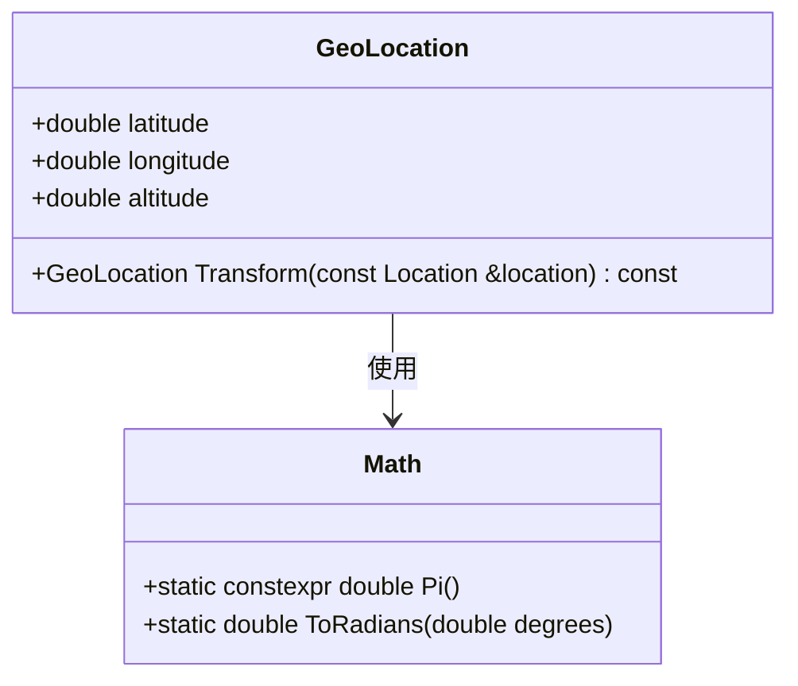

**图源**

- [GeoLocation.h](https://github.com/carla-simulator/carla/blob/ue5-dev/LibCarla/source/carla/geom/GeoLocation.h)
- [GeoLocation.cpp](https://github.com/carla-simulator/carla/blob/ue5-dev/LibCarla/source/carla/geom/GeoLocation.cpp)

**本节来源**

- [GeoLocation.h](https://github.com/carla-simulator/carla/blob/ue5-dev/LibCarla/source/carla/geom/GeoLocation.h)
- [GeoLocation.cpp](https://github.com/carla-simulator/carla/blob/ue5-dev/LibCarla/source/carla/geom/GeoLocation.cpp)

### NavSatFix 消息格式分析

NavSatFix 是 ROS2 中用于表示 GNSS 数据的标准消息类型，包含位置、状态和协方差信息。

#### 消息结构

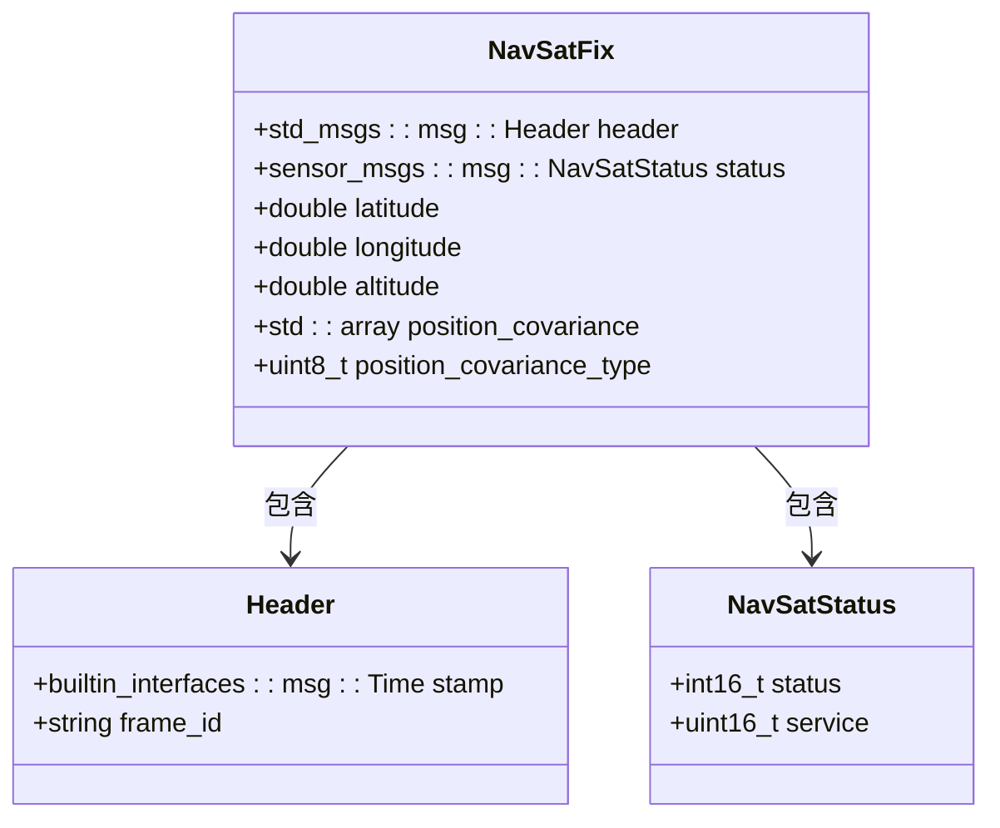

**图源**

- [NavSatFix.h](https://github.com/carla-simulator/carla/blob/ue5-dev/LibCarla/source/carla/ros2/types/NavSatFix.h)

#### 协方差类型定义

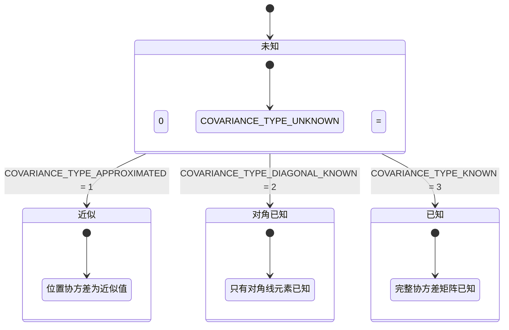

**图源**

- [NavSatFix.h](https://github.com/carla-simulator/carla/blob/ue5-dev/LibCarla/source/carla/ros2/types/NavSatFix.h)

**本节来源**

- [NavSatFix.h](https://github.com/carla-simulator/carla/blob/ue5-dev/LibCarla/source/carla/ros2/types/NavSatFix.h)
- [NavSatFixPubSubTypes.h](https://github.com/carla-simulator/carla/blob/ue5-dev/LibCarla/source/carla/ros2/types/NavSatFixPubSubTypes.h)

## 依赖分析

GNSS 发布器系统涉及多个组件之间的依赖关系，从传感器数据采集到消息发布形成了一条完整的数据流。

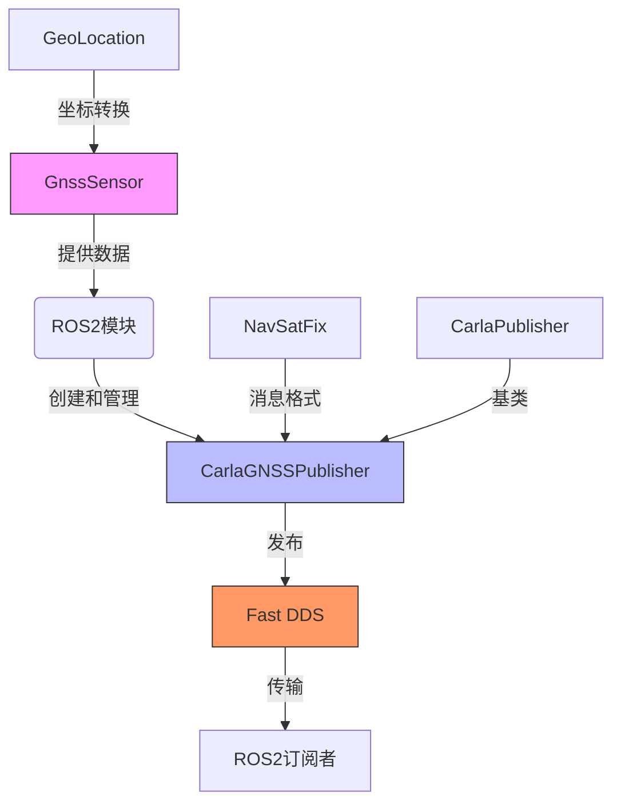

**图源**

- [GnssSensor.cpp](https://github.com/carla-simulator/carla/blob/ue5-dev/Unreal/CarlaUnreal/Plugins/Carla/Source/Carla/Sensor/GnssSensor.cpp)
- [ROS2.cpp](https://github.com/carla-simulator/carla/blob/ue5-dev/LibCarla/source/carla/ros2/ROS2.cpp)
- [CarlaGNSSPublisher.cpp](https://github.com/carla-simulator/carla/blob/ue5-dev/LibCarla/source/carla/ros2/publishers/CarlaGNSSPublisher.cpp)

**本节来源**

- [ROS2.h](https://github.com/carla-simulator/carla/blob/ue5-dev/LibCarla/source/carla/ros2/ROS2.h)
- [CarlaGNSSPublisher.h](https://github.com/carla-simulator/carla/blob/ue5-dev/LibCarla/source/carla/ros2/publishers/CarlaGNSSPublisher.h)
- [GnssSensor.h](https://github.com/carla-simulator/carla/blob/ue5-dev/Unreal/CarlaUnreal/Plugins/Carla/Source/Carla/Sensor/GnssSensor.h)

## 性能考虑

GNSS 发布器的性能主要受以下几个因素影响：数据发布频率、坐标转换计算开销和网络传输延迟。由于使用了 Fast DDS 作为中间件，数据传输效率较高。坐标转换使用了优化的墨卡托投影算法，计算开销较小。建议根据实际需求设置合适的 GNSS 传感器更新频率，以平衡数据精度和系统性能。

## 故障排除指南

当 GNSS 数据发布出现问题时，可以按照以下步骤进行排查：

1. 检查 ROS2 是否已启用（ROS2::Enable(true)）
2. 确认 GNSS 传感器已正确附加到车辆并启用 ROS2 功能
3. 检查 Fast DDS 网络配置是否正确
4. 验证坐标参考系（GeoReference）是否已正确设置
5. 查看系统日志中的错误信息，特别是 CarlaGNSSPublisher::Publish()方法的返回值

**本节来源**

- [CarlaGNSSPublisher.cpp](https://github.com/carla-simulator/carla/blob/ue5-dev/LibCarla/source/carla/ros2/publishers/CarlaGNSSPublisher.cpp)
- [ROS2.cpp](https://github.com/carla-simulator/carla/blob/ue5-dev/LibCarla/source/carla/ros2/ROS2.cpp)

## 结论

CarlaGNSSPublisher 成功实现了将 CARLA 模拟器中的车辆位置数据转换为标准 ROS2 NavSatFix 消息的功能。通过 GnssSensor 获取车辆局部坐标，利用 GeoLocation 类进行 WGS84 地理坐标转换，并通过 Fast DDS 中间件发布 GNSS 数据。该系统支持噪声和偏差模拟，能够为自动驾驶系统的定位和地图匹配提供可靠的仿真数据。开发者可以通过配置传感器参数来调整 GNSS 数据的精度特性，满足不同应用场景的需求。
