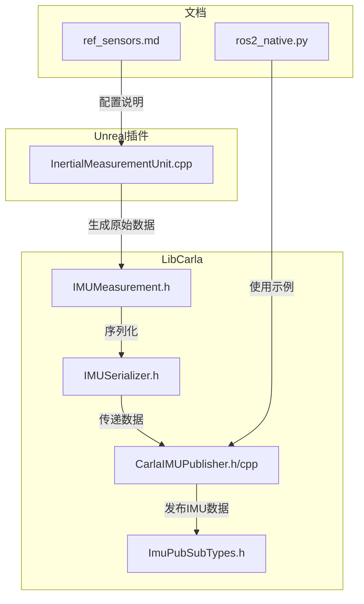
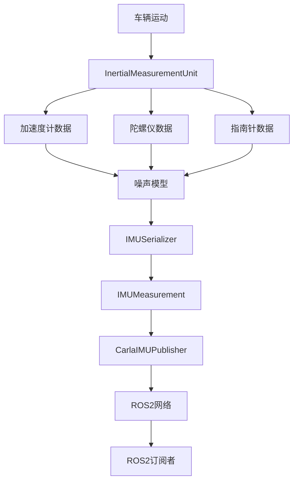
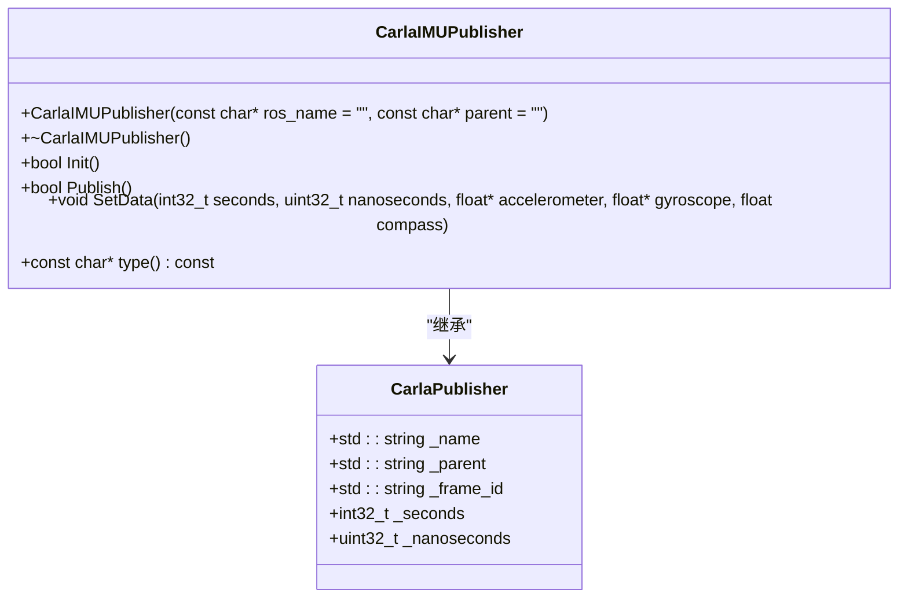
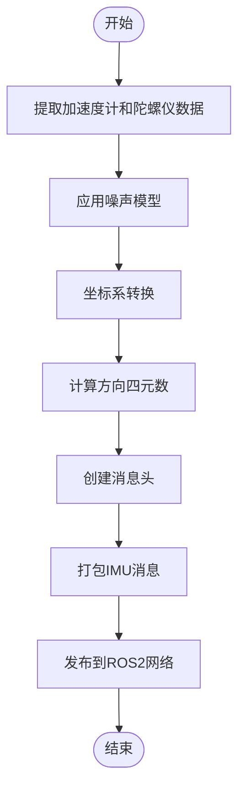
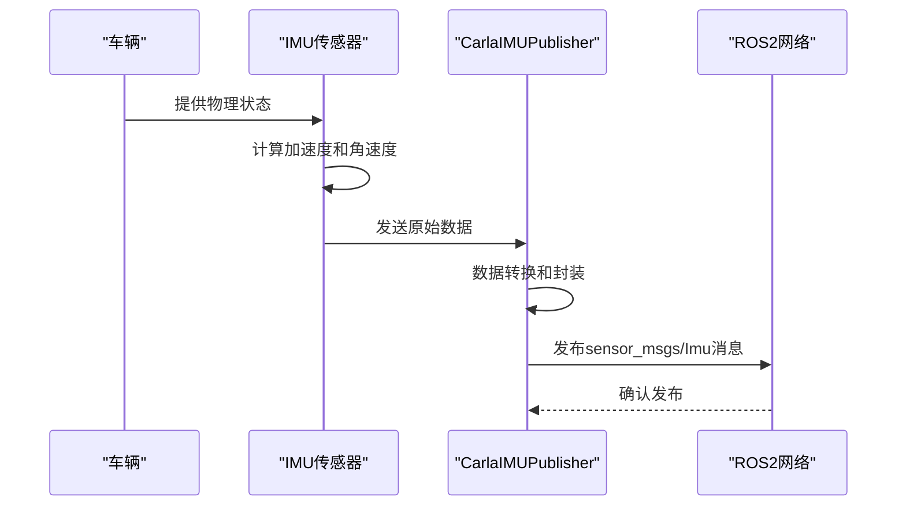
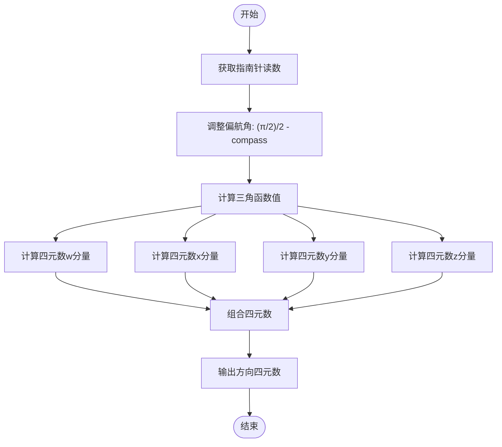
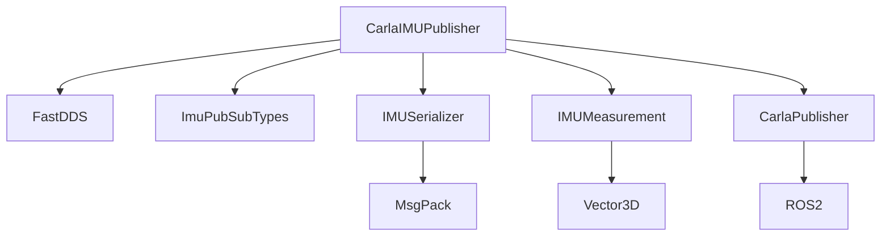

# IMU 发布器

> **引用文件**
> **本文档中引用的文件**

- [CarlaIMUPublisher.h](https://github.com/carla-simulator/carla/blob/ue5-dev/LibCarla/source/carla/ros2/publishers/CarlaIMUPublisher.h)
- [CarlaIMUPublisher.cpp](https://github.com/carla-simulator/carla/blob/ue5-dev/LibCarla/source/carla/ros2/publishers/CarlaIMUPublisher.cpp)
- [IMUMeasurement.h](https://github.com/carla-simulator/carla/blob/ue5-dev/LibCarla/source/carla/sensor/data/IMUMeasurement.h)
- [IMUSerializer.h](https://github.com/carla-simulator/carla/blob/ue5-dev/LibCarla/source/carla/sensor/s11n/IMUSerializer.h)
- [ImuPubSubTypes.h](https://github.com/carla-simulator/carla/blob/ue5-dev/LibCarla/source/carla/ros2/types/ImuPubSubTypes.h)
- [InertialMeasurementUnit.cpp](https://github.com/carla-simulator/carla/blob/ue5-dev/Unreal/CarlaUnreal/Plugins/Carla/Source/Carla/Sensor/InertialMeasurementUnit.cpp)
- [ref_sensors.md](https://github.com/carla-simulator/carla/blob/ue5-dev/Docs/ref_sensors.md)
- [ros2_native.py](https://github.com/carla-simulator/carla/blob/ue5-dev/PythonAPI/examples/ros2/ros2_native.py)

## 目录

1. [简介](#简介)
2. [项目结构](#项目结构)
3. [核心组件](#核心组件)
4. [架构概述](#架构概述)
5. [详细组件分析](#详细组件分析)
6. [依赖分析](#依赖分析)
7. [性能考虑](#性能考虑)
8. [故障排除指南](#故障排除指南)
9. [结论](#结论)

## 简介

本文档详细说明了 CARLA 模拟器中 IMU 发布器的实现机制，重点介绍 CarlaIMUPublisher 如何将车辆的惯性测量数据转换为 ROS2 标准的 sensor_msgs/Imu 消息。文档涵盖了线性加速度和角速度的提取过程、方向四元数的计算方法、传感器噪声模型的模拟机制，以及 IMU 数据采样频率的配置方式。同时提供在 ROS2 环境中使用这些 IMU 数据进行状态估计和传感器融合的示例。

## 项目结构

CARLA 的 IMU 发布器功能主要分布在 LibCarla 和 Unreal 插件两个主要模块中。LibCarla 负责 ROS2 消息的序列化和发布，而 Unreal 插件则负责 IMU 传感器的物理模拟和数据生成。

**图源**

- [CarlaIMUPublisher.h](https://github.com/carla-simulator/carla/blob/ue5-dev/LibCarla/source/carla/ros2/publishers/CarlaIMUPublisher.h)
- [InertialMeasurementUnit.cpp](https://github.com/carla-simulator/carla/blob/ue5-dev/Unreal/CarlaUnreal/Plugins/Carla/Source/Carla/Sensor/InertialMeasurementUnit.cpp)
- [ref_sensors.md](https://github.com/carla-simulator/carla/blob/ue5-dev/Docs/ref_sensors.md)

## 核心组件

IMU 发布器的核心组件包括 CarlaIMUPublisher 类，负责将 CARLA 模拟器生成的惯性测量数据转换为 ROS2 的 sensor_msgs/Imu 消息格式并发布。该组件从 Unreal 引擎获取原始的加速度计、陀螺仪和指南针数据，经过坐标转换和噪声模拟后，封装成标准的 ROS2 消息。

**节源**

- <a href="https://github.com/carla-simulator/carla/blob/ue5-dev/LibCarla/source/carla/ros2/publishers/CarlaIMUPublisher.h#L14-L35" target="_blank">CarlaIMUPublisher.h</a>
- <a href="https://github.com/carla-simulator/carla/blob/ue5-dev/LibCarla/source/carla/ros2/publishers/CarlaIMUPublisher.cpp#L1-L253" target="_blank">CarlaIMUPublisher.cpp</a>

## 架构概述

IMU 发布器的架构采用分层设计，底层由 Unreal 引擎的 InertialMeasurementUnit 组件负责物理模拟，中间层通过 LibCarla 的序列化机制处理数据，顶层由 CarlaIMUPublisher 完成 ROS2 消息的构建和发布。这种架构实现了物理模拟与消息通信的解耦，提高了系统的可维护性和扩展性。

**图源**

- <a href="https://github.com/carla-simulator/carla/blob/ue5-dev/Unreal/CarlaUnreal/Plugins/Carla/Source/Carla/Sensor/InertialMeasurementUnit.cpp#L69-L101" target="_blank">InertialMeasurementUnit.cpp</a>
- <a href="https://github.com/carla-simulator/carla/blob/ue5-dev/LibCarla/source/carla/sensor/s11n/IMUSerializer.h#L20-L61" target="_blank">IMUSerializer.h</a>
- <a href="https://github.com/carla-simulator/carla/blob/ue5-dev/LibCarla/source/carla/ros2/publishers/CarlaIMUPublisher.cpp#L149-L195" target="_blank">CarlaIMUPublisher.cpp</a>

## 详细组件分析

### CarlaIMUPublisher 分析

CarlaIMUPublisher 是 IMU 数据发布的核心类，继承自 CarlaPublisher 基类，实现了 IMU 特定的消息发布功能。该类通过 FastDDS 中间件将 IMU 数据发布到 ROS2 网络中。

#### 类结构

**图源**

- <a href="https://github.com/carla-simulator/carla/blob/ue5-dev/LibCarla/source/carla/ros2/publishers/CarlaIMUPublisher.h#L16-L35" target="_blank">CarlaIMUPublisher.h</a>

#### 数据处理流程

**图源**

- <a href="https://github.com/carla-simulator/carla/blob/ue5-dev/LibCarla/source/carla/ros2/publishers/CarlaIMUPublisher.cpp#L149-L195" target="_blank">CarlaIMUPublisher.cpp</a>

### 线性加速度和角速度提取

IMU 发布器从车辆的物理状态中提取线性加速度和角速度数据。加速度计测量车辆在三个轴向上的线性加速度，陀螺仪测量绕三个轴的角速度。

**图源**

- <a href="https://github.com/carla-simulator/carla/blob/ue5-dev/Unreal/CarlaUnreal/Plugins/Carla/Source/Carla/Sensor/InertialMeasurementUnit.cpp#L69-L101" target="_blank">InertialMeasurementUnit.cpp</a>
- <a href="https://github.com/carla-simulator/carla/blob/ue5-dev/LibCarla/source/carla/ros2/publishers/CarlaIMUPublisher.cpp#L150-L163" target="_blank">CarlaIMUPublisher.cpp</a>

### 方向四元数计算

方向四元数的计算是 IMU 发布器的关键功能之一，它将指南针提供的偏航角信息转换为四元数表示，以便在 ROS2 中进行姿态表示。

**图源**

- <a href="https://github.com/carla-simulator/carla/blob/ue5-dev/LibCarla/source/carla/ros2/publishers/CarlaIMUPublisher.cpp#L175-L189" target="_blank">CarlaIMUPublisher.cpp</a>

### 传感器噪声模型

IMU 发布器实现了完整的传感器噪声模型，模拟真实 IMU 传感器的随机偏差和噪声特性。噪声模型包括加速度计的标准差噪声和陀螺仪的偏差噪声。

| 噪声参数               | 类型  | 默认值 | 描述                   |
| ---------------------- | ----- | ------ | ---------------------- |
| `noise_accel_stddev_x` | float | 0.0    | X 轴加速度计噪声标准差 |
| `noise_accel_stddev_y` | float | 0.0    | Y 轴加速度计噪声标准差 |
| `noise_accel_stddev_z` | float | 0.0    | Z 轴加速度计噪声标准差 |
| `noise_gyro_bias_x`    | float | 0.0    | X 轴陀螺仪偏差均值     |
| `noise_gyro_bias_y`    | float | 0.0    | Y 轴陀螺仪偏差均值     |
| `noise_gyro_bias_z`    | float | 0.0    | Z 轴陀螺仪偏差均值     |
| `noise_gyro_stddev_x`  | float | 0.0    | X 轴陀螺仪噪声标准差   |
| `noise_gyro_stddev_y`  | float | 0.0    | Y 轴陀螺仪噪声标准差   |
| `noise_gyro_stddev_z`  | float | 0.0    | Z 轴陀螺仪噪声标准差   |
| `noise_seed`           | int   | 0      | 伪随机数生成器种子     |

**节源**

- <a href="https://github.com/carla-simulator/carla/blob/ue5-dev/Docs/ref_sensors.md#L163-L172" target="_blank">ref_sensors.md</a>
- <a href="https://github.com/carla-simulator/carla/blob/ue5-dev/Unreal/CarlaUnreal/Plugins/Carla/Source/Carla/Sensor/InertialMeasurementUnit.cpp#L72-L101" target="_blank">InertialMeasurementUnit.cpp</a>

### 采样频率配置

IMU 数据的采样频率通过`sensor_tick`参数进行配置，该参数定义了传感器采集数据的时间间隔（以模拟秒为单位）。

| 配置参数      | 类型  | 默认值 | 描述                               |
| ------------- | ----- | ------ | ---------------------------------- |
| `sensor_tick` | float | 0.0    | 传感器采集数据的时间间隔（模拟秒） |

**节源**

- <a href="https://github.com/carla-simulator/carla/blob/ue5-dev/Docs/ref_sensors.md#L173" target="_blank">ref_sensors.md</a>

## 依赖分析

IMU 发布器依赖于多个 CARLA 系统组件，包括 ROS2 通信框架、传感器序列化库和物理模拟引擎。这些依赖关系确保了 IMU 数据能够准确地从物理模拟层传递到 ROS2 通信层。

**图源**

- [CarlaIMUPublisher.h](https://github.com/carla-simulator/carla/blob/ue5-dev/LibCarla/source/carla/ros2/publishers/CarlaIMUPublisher.h)
- [ImuPubSubTypes.h](https://github.com/carla-simulator/carla/blob/ue5-dev/LibCarla/source/carla/ros2/types/ImuPubSubTypes.h)

## 性能考虑

IMU 发布器的性能主要受以下几个因素影响：数据采样频率、噪声模型复杂度和网络传输开销。较高的采样频率会增加 CPU 和网络负载，复杂的噪声模型会增加计算开销。建议根据实际应用需求合理配置`sensor_tick`参数，在数据精度和系统性能之间取得平衡。

## 故障排除指南

当 IMU 发布器工作异常时，可以按照以下步骤进行排查：

1. 检查 ROS2 网络连接是否正常
2. 验证 IMU 传感器是否已正确附加到车辆
3. 确认`ros_name`和`role_name`属性已正确设置
4. 检查`sensor_tick`配置是否合理
5. 验证噪声模型参数是否在合理范围内

**节源**

- <a href="https://github.com/carla-simulator/carla/blob/ue5-dev/LibCarla/source/carla/ros2/publishers/CarlaIMUPublisher.cpp#L87-L147" target="_blank">CarlaIMUPublisher.cpp</a>
- <a href="https://github.com/carla-simulator/carla/blob/ue5-dev/PythonAPI/examples/ros2/ros2_native.py#L35-L63" target="_blank">ros2_native.py</a>

## 结论

CARLA 的 IMU 发布器提供了一个完整的解决方案，将车辆的惯性测量数据转换为 ROS2 标准格式。通过精确的物理模拟、真实的噪声模型和灵活的配置选项，该组件能够为自动驾驶算法开发提供高质量的 IMU 数据。开发者可以利用这些数据进行状态估计、传感器融合和其他高级应用。
