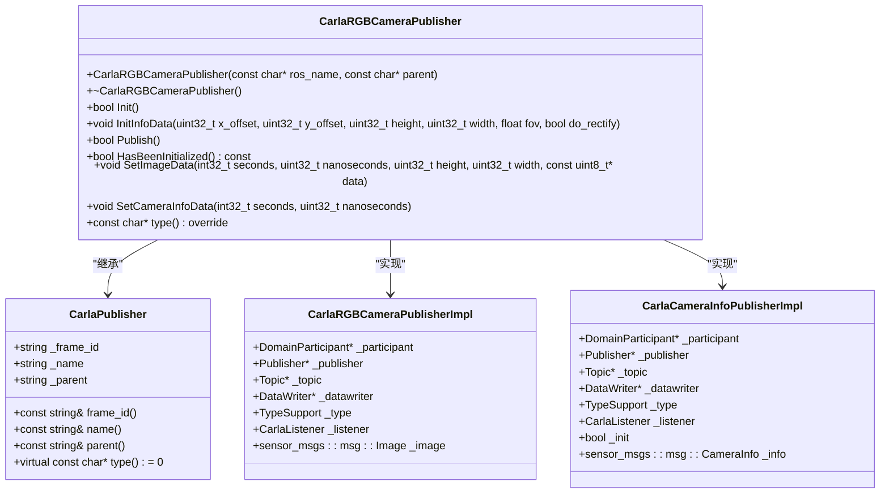
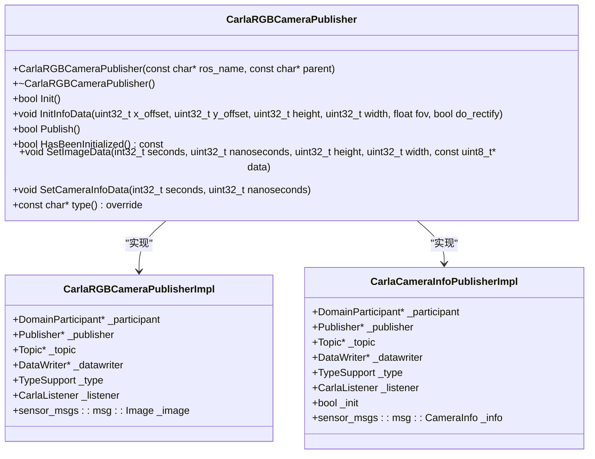
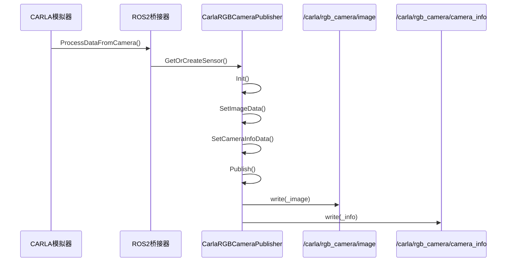
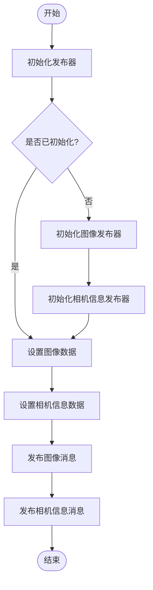

# 摄像头发布器


**本文档中引用的文件**  
- [CarlaRGBCameraPublisher.h](https://github.com/carla-simulator/carla/blob/ue5-dev/LibCarla/source/carla/ros2/publishers/CarlaRGBCameraPublisher.h)
- [CarlaRGBCameraPublisher.cpp](https://github.com/carla-simulator/carla/blob/ue5-dev/LibCarla/source/carla/ros2/publishers/CarlaRGBCameraPublisher.cpp)
- [ROS2.h](https://github.com/carla-simulator/carla/blob/ue5-dev/LibCarla/source/carla/ros2/ROS2.h)
- [ROS2.cpp](https://github.com/carla-simulator/carla/blob/ue5-dev/LibCarla/source/carla/ros2/ROS2.cpp)
- [ImagePubSubTypes.h](https://github.com/carla-simulator/carla/blob/ue5-dev/LibCarla/source/carla/ros2/types/ImagePubSubTypes.h)
- [CameraInfoPubSubTypes.h](https://github.com/carla-simulator/carla/blob/ue5-dev/LibCarla/source/carla/ros2/types/CameraInfoPubSubTypes.h)
- [ros2_native_sensors.md](https://github.com/carla-simulator/carla/blob/ue5-dev/Docs/ros2_native_sensors.md)
- [ros2_native.py](https://github.com/carla-simulator/carla/blob/ue5-dev/PythonAPI/examples/ros2/ros2_native.py)


## 目录
1. [简介](#简介)
2. [项目结构](#项目结构)
3. [核心组件](#核心组件)
4. [架构概述](#架构概述)
5. [详细组件分析](#详细组件分析)
6. [依赖分析](#依赖分析)
7. [性能考虑](#性能考虑)
8. [故障排除指南](#故障排除指南)
9. [结论](#结论)

## 简介
本文档详细介绍了CARLA模拟器中摄像头发布器的实现，重点分析了CarlaRGBCameraPublisher如何将CARLA的RGB摄像头数据转换为ROS2的sensor_msgs/Image和sensor_msgs/CameraInfo消息。文档涵盖了图像编码格式（如bgr8）的转换过程、相机内参（焦距、主点偏移）的提取和发布机制、图像数据序列化流程，以及内存布局优化和零拷贝传输的可能性。同时提供了订阅这些话题并在ROS2中进行图像处理的示例，并讨论了不同图像分辨率和帧率设置对发布性能的影响。

## 项目结构
CARLA项目中的ROS2摄像头发布器主要位于LibCarla模块的ros2/publishers子目录中。该目录包含了各种传感器发布器的实现，其中CarlaRGBCameraPublisher专门负责处理RGB摄像头数据的发布。发布器通过ROS2中间件（使用FastDDS）将CARLA模拟器中的摄像头数据转换为标准的ROS2消息格式，以便在ROS2生态系统中使用。

```mermaid
graph TD
subgraph "CARLA模拟器"
Camera[RGB摄像头]
SensorRegistry[传感器注册表]
ROS2Bridge[ROS2桥接器]
end
subgraph "ROS2系统"
Publisher[CarlaRGBCameraPublisher]
ImageTopic[/carla/rgb_camera/image]
CameraInfoTopic[/carla/rgb_camera/camera_info]
ROS2Middleware[ROS2中间件]
end
Camera --> SensorRegistry
SensorRegistry --> ROS2Bridge
ROS2Bridge --> Publisher
Publisher --> ImageTopic
Publisher --> CameraInfoTopic
Publisher --> ROS2Middleware
```

**图表来源**
- [CarlaRGBCameraPublisher.h](https://github.com/carla-simulator/carla/blob/ue5-dev/LibCarla/source/carla/ros2/publishers/CarlaRGBCameraPublisher.h)
- [ROS2.h](https://github.com/carla-simulator/carla/blob/ue5-dev/LibCarla/source/carla/ros2/ROS2.h)

**章节来源**
- [CarlaRGBCameraPublisher.h](https://github.com/carla-simulator/carla/blob/ue5-dev/LibCarla/source/carla/ros2/publishers/CarlaRGBCameraPublisher.h)
- [ROS2.h](https://github.com/carla-simulator/carla/blob/ue5-dev/LibCarla/source/carla/ros2/ROS2.h)

## 核心组件
CarlaRGBCameraPublisher是处理RGB摄像头数据发布的核心组件。它继承自CarlaPublisher基类，实现了将CARLA的原始图像数据转换为ROS2标准消息的功能。该组件负责初始化发布器、设置图像数据、发布图像和相机信息消息。

**章节来源**
- [CarlaRGBCameraPublisher.h](https://github.com/carla-simulator/carla/blob/ue5-dev/LibCarla/source/carla/ros2/publishers/CarlaRGBCameraPublisher.h)
- [CarlaRGBCameraPublisher.cpp](https://github.com/carla-simulator/carla/blob/ue5-dev/LibCarla/source/carla/ros2/publishers/CarlaRGBCameraPublisher.cpp)

## 架构概述
CarlaRGBCameraPublisher的架构基于ROS2的发布-订阅模式，使用FastDDS作为底层通信中间件。发布器通过两个独立的发布者分别发布图像数据和相机信息，确保了数据的分离和灵活性。



**图表来源**
- [CarlaRGBCameraPublisher.h](https://github.com/carla-simulator/carla/blob/ue5-dev/LibCarla/source/carla/ros2/publishers/CarlaRGBCameraPublisher.h)
- [CarlaRGBCameraPublisher.cpp](https://github.com/carla-simulator/carla/blob/ue5-dev/LibCarla/source/carla/ros2/publishers/CarlaRGBCameraPublisher.cpp)

## 详细组件分析
### CarlaRGBCameraPublisher分析
CarlaRGBCameraPublisher负责将CARLA的RGB摄像头数据转换为ROS2的sensor_msgs/Image和sensor_msgs/CameraInfo消息。它通过两个独立的发布者分别处理图像数据和相机信息，确保了数据的分离和灵活性。

#### 对象导向组件


**图表来源**
- [CarlaRGBCameraPublisher.h](https://github.com/carla-simulator/carla/blob/ue5-dev/LibCarla/source/carla/ros2/publishers/CarlaRGBCameraPublisher.h)
- [CarlaRGBCameraPublisher.cpp](https://github.com/carla-simulator/carla/blob/ue5-dev/LibCarla/source/carla/ros2/publishers/CarlaRGBCameraPublisher.cpp)

#### API/服务组件


**图表来源**
- [ROS2.cpp](https://github.com/carla-simulator/carla/blob/ue5-dev/LibCarla/source/carla/ros2/ROS2.cpp)
- [CarlaRGBCameraPublisher.cpp](https://github.com/carla-simulator/carla/blob/ue5-dev/LibCarla/source/carla/ros2/publishers/CarlaRGBCameraPublisher.cpp)

#### 复杂逻辑组件


**图表来源**
- [CarlaRGBCameraPublisher.cpp](https://github.com/carla-simulator/carla/blob/ue5-dev/LibCarla/source/carla/ros2/publishers/CarlaRGBCameraPublisher.cpp)

**章节来源**
- [CarlaRGBCameraPublisher.h](https://github.com/carla-simulator/carla/blob/ue5-dev/LibCarla/source/carla/ros2/publishers/CarlaRGBCameraPublisher.h)
- [CarlaRGBCameraPublisher.cpp](https://github.com/carla-simulator/carla/blob/ue5-dev/LibCarla/source/carla/ros2/publishers/CarlaRGBCameraPublisher.cpp)

## 依赖分析
CarlaRGBCameraPublisher依赖于多个CARLA和ROS2组件，包括传感器注册表、ROS2桥接器、FastDDS中间件以及各种ROS2消息类型。

```mermaid
graph TD
CarlaRGBCameraPublisher --> CarlaPublisher : "继承"
CarlaRGBCameraPublisher --> ROS2 : "通过ROS2桥接"
CarlaRGBCameraPublisher --> ImagePubSubTypes : "使用Image消息类型"
CarlaRGBCameraPublisher --> CameraInfoPubSubTypes : "使用CameraInfo消息类型"
CarlaRGBCameraPublisher --> FastDDS : "使用FastDDS通信"
ROS2 --> SensorRegistry : "获取传感器数据"
SensorRegistry --> SceneCaptureCamera : "RGB摄像头实现"
```

**图表来源**
- [CarlaRGBCameraPublisher.h](https://github.com/carla-simulator/carla/blob/ue5-dev/LibCarla/source/carla/ros2/publishers/CarlaRGBCameraPublisher.h)
- [ROS2.h](https://github.com/carla-simulator/carla/blob/ue5-dev/LibCarla/source/carla/ros2/ROS2.h)
- [SensorRegistry.h](https://github.com/carla-simulator/carla/blob/ue5-dev/LibCarla/source/carla/sensor/SensorRegistry.h)

**章节来源**
- [CarlaRGBCameraPublisher.h](https://github.com/carla-simulator/carla/blob/ue5-dev/LibCarla/source/carla/ros2/publishers/CarlaRGBCameraPublisher.h)
- [ROS2.h](https://github.com/carla-simulator/carla/blob/ue5-dev/LibCarla/source/carla/ros2/ROS2.h)
- [SensorRegistry.h](https://github.com/carla-simulator/carla/blob/ue5-dev/LibCarla/source/carla/sensor/SensorRegistry.h)

## 性能考虑
CarlaRGBCameraPublisher的性能受到图像分辨率、帧率和网络带宽的影响。高分辨率和高帧率会增加数据传输的负担，可能导致网络拥塞和延迟。为了优化性能，可以考虑以下策略：
- 使用适当的图像压缩格式
- 调整发布频率以匹配应用需求
- 优化网络配置以减少延迟
- 使用零拷贝技术减少内存复制开销

## 故障排除指南
在使用CarlaRGBCameraPublisher时，可能会遇到以下常见问题：
- 发布器初始化失败：检查ROS2环境配置和FastDDS设置
- 图像数据丢失：检查网络连接和带宽
- 相机信息不正确：验证相机内参设置
- 性能下降：调整图像分辨率和帧率

**章节来源**
- [CarlaRGBCameraPublisher.cpp](https://github.com/carla-simulator/carla/blob/ue5-dev/LibCarla/source/carla/ros2/publishers/CarlaRGBCameraPublisher.cpp)
- [ROS2.cpp](https://github.com/carla-simulator/carla/blob/ue5-dev/LibCarla/source/carla/ros2/ROS2.cpp)

## 结论
CarlaRGBCameraPublisher是CARLA模拟器与ROS2系统之间的重要桥梁，它有效地将CARLA的RGB摄像头数据转换为标准的ROS2消息格式。通过深入分析其架构和实现，我们可以更好地理解其工作原理，并优化其性能以满足不同的应用需求。未来的工作可以集中在进一步优化数据传输效率和增强错误处理机制上。