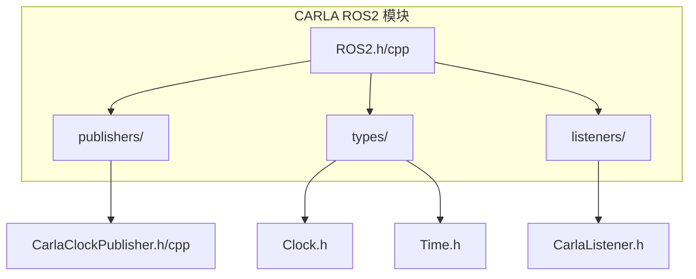
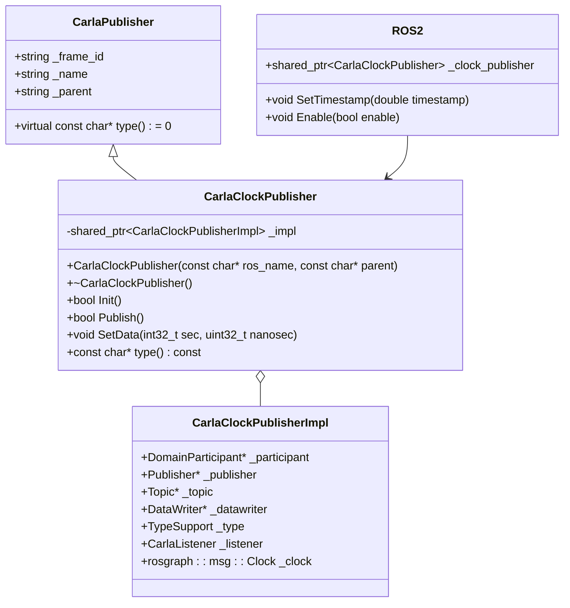
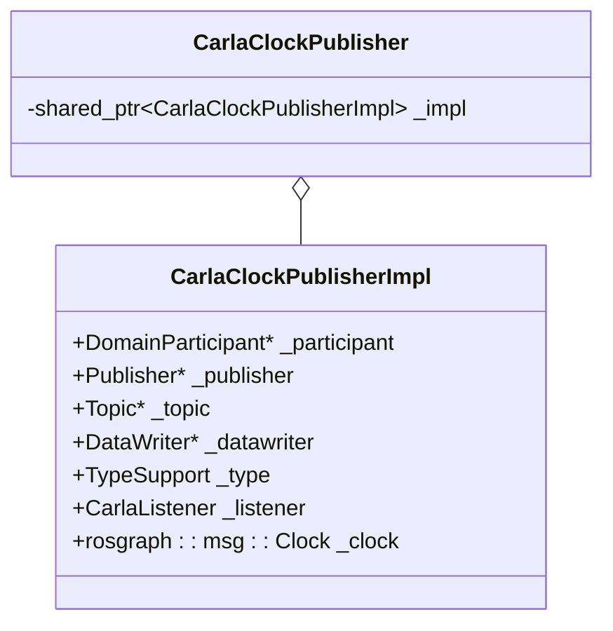
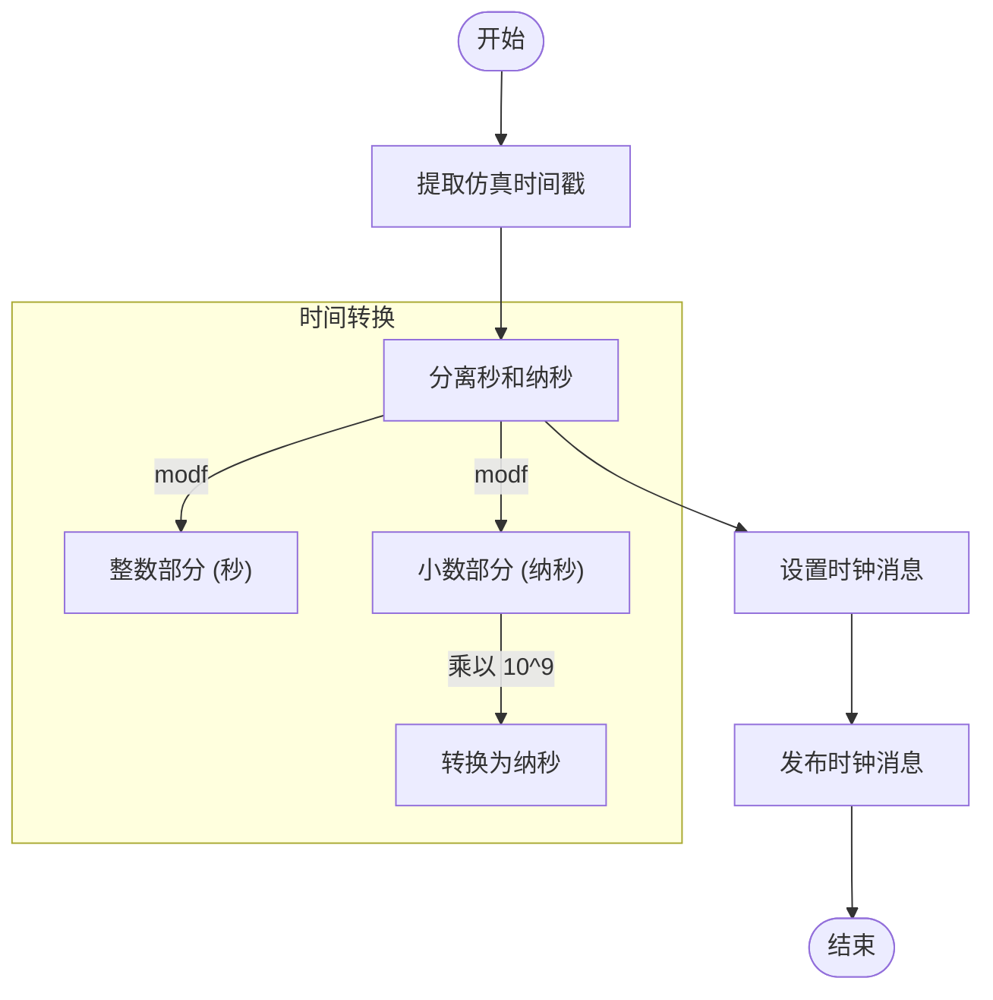
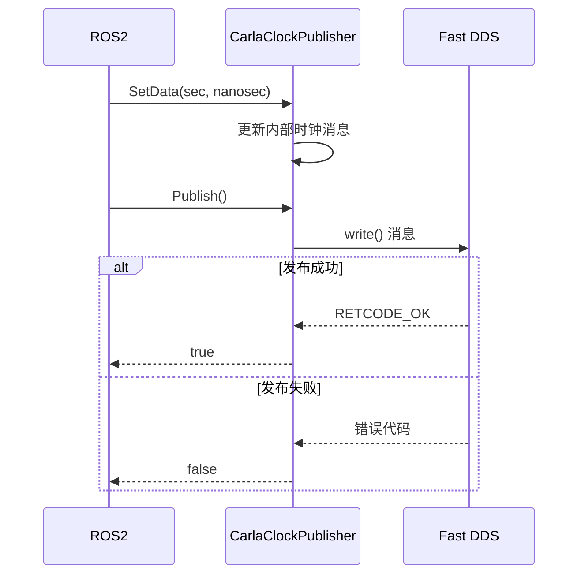
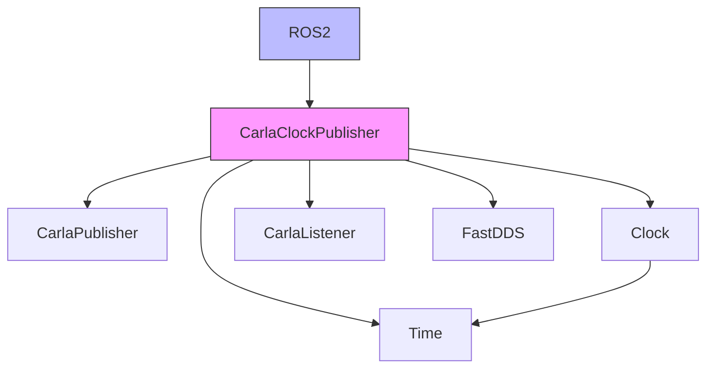

# 时钟发布器

**本文档中引用的文件**  
- [CarlaClockPublisher.h](https://github.com/carla-simulator/carla/blob/ue5-dev/LibCarla/source/carla/ros2/publishers/CarlaClockPublisher.h)
- [CarlaClockPublisher.cpp](https://github.com/carla-simulator/carla/blob/ue5-dev/LibCarla/source/carla/ros2/publishers/CarlaClockPublisher.cpp)
- [CarlaPublisher.h](https://github.com/carla-simulator/carla/blob/ue5-dev/LibCarla/source/carla/ros2/publishers/CarlaPublisher.h)
- [Clock.h](https://github.com/carla-simulator/carla/blob/ue5-dev/LibCarla/source/carla/ros2/types/Clock.h)
- [Time.h](https://github.com/carla-simulator/carla/blob/ue5-dev/LibCarla/source/carla/ros2/types/Time.h)
- [ROS2.h](https://github.com/carla-simulator/carla/blob/ue5-dev/LibCarla/source/carla/ros2/ROS2.h)
- [ROS2.cpp](https://github.com/carla-simulator/carla/blob/ue5-dev/LibCarla/source/carla/ros2/ROS2.cpp)
- [CarlaListener.h](https://github.com/carla-simulator/carla/blob/ue5-dev/LibCarla/source/carla/ros2/listeners/CarlaListener.h)

## 目录
1. [简介](#简介)
2. [项目结构](#项目结构)
3. [核心组件](#核心组件)
4. [架构概述](#架构概述)
5. [详细组件分析](#详细组件分析)
6. [依赖分析](#依赖分析)
7. [性能考虑](#性能考虑)
8. [故障排除指南](#故障排除指南)
9. [结论](#结论)

## 简介
本文档详细介绍了CARLA仿真器中`CarlaClockPublisher`的实现机制，该组件负责将CARLA仿真时间同步到ROS2生态系统。文档涵盖了其继承自`CarlaPublisher`基类的实现、时间转换逻辑、配置选项以及在不同仿真模式下的行为差异。同时提供了调试技巧，帮助验证时钟同步准确性和诊断时间漂移问题。

## 项目结构
`CarlaClockPublisher`位于CARLA的ROS2集成模块中，其主要文件位于`LibCarla/source/carla/ros2/publishers/`目录下。该模块通过Fast DDS实现ROS2通信，将CARLA仿真时间发布为`rosgraph_msgs::msg::Clock`消息。

**图源**
- [ROS2.h](https://github.com/carla-simulator/carla/blob/ue5-dev/LibCarla/source/carla/ros2/ROS2.h#L47-L173)
- [CarlaClockPublisher.h](https://github.com/carla-simulator/carla/blob/ue5-dev/LibCarla/source/carla/ros2/publishers/CarlaClockPublisher.h#L1-L35)
- [Clock.h](https://github.com/carla-simulator/carla/blob/ue5-dev/LibCarla/source/carla/ros2/types/Clock.h#L1-L215)
- [Time.h](https://github.com/carla-simulator/carla/blob/ue5-dev/LibCarla/source/carla/ros2/types/Time.h#L1-L227)
- [CarlaListener.h](https://github.com/carla-simulator/carla/blob/ue5-dev/LibCarla/source/carla/ros2/listeners/CarlaListener.h#L1-L27)

**节源**
- [ROS2.h](https://github.com/carla-simulator/carla/blob/ue5-dev/LibCarla/source/carla/ros2/ROS2.h#L47-L173)
- [CarlaClockPublisher.h](https://github.com/carla-simulator/carla/blob/ue5-dev/LibCarla/source/carla/ros2/publishers/CarlaClockPublisher.h#L1-L35)

## 核心组件
`CarlaClockPublisher`是CARLA ROS2集成中的核心时间同步组件。它继承自`CarlaPublisher`基类，实现了将CARLA仿真时间定期发布到ROS2生态系统的功能。该组件在CARLA启用ROS2功能时自动初始化，并在每个仿真步骤中更新和发布时钟消息。

**节源**
- [CarlaClockPublisher.h](https://github.com/carla-simulator/carla/blob/ue5-dev/LibCarla/source/carla/ros2/publishers/CarlaClockPublisher.h#L17-L33)
- [ROS2.cpp](https://github.com/carla-simulator/carla/blob/ue5-dev/LibCarla/source/carla/ros2/ROS2.cpp#L80-L81)

## 架构概述
`CarlaClockPublisher`的架构基于发布-订阅模式，使用Fast DDS作为底层通信框架。它通过`ROS2`单例类进行管理，并在仿真过程中持续发布时钟消息。

**图源**
- [CarlaPublisher.h](https://github.com/carla-simulator/carla/blob/ue5-dev/LibCarla/source/carla/ros2/publishers/CarlaPublisher.h#L12-L32)
- [CarlaClockPublisher.h](https://github.com/carla-simulator/carla/blob/ue5-dev/LibCarla/source/carla/ros2/publishers/CarlaClockPublisher.h#L17-L33)
- [CarlaClockPublisher.cpp](https://github.com/carla-simulator/carla/blob/ue5-dev/LibCarla/source/carla/ros2/publishers/CarlaClockPublisher.cpp#L30-L38)
- [ROS2.h](https://github.com/carla-simulator/carla/blob/ue5-dev/LibCarla/source/carla/ros2/ROS2.h#L163)

**节源**
- [CarlaPublisher.h](https://github.com/carla-simulator/carla/blob/ue5-dev/LibCarla/source/carla/ros2/publishers/CarlaPublisher.h#L12-L32)
- [CarlaClockPublisher.h](https://github.com/carla-simulator/carla/blob/ue5-dev/LibCarla/source/carla/ros2/publishers/CarlaClockPublisher.h#L17-L33)

## 详细组件分析

### CarlaClockPublisher 分析
`CarlaClockPublisher`负责将CARLA仿真时间同步到ROS2生态系统。它通过继承`CarlaPublisher`基类，实现了ROS2发布器的标准接口。

#### 实现机制
`CarlaClockPublisher`使用PIMPL（Pointer to Implementation）模式，将实现细节封装在`CarlaClockPublisherImpl`结构体中。这种设计模式有助于减少编译依赖并提高代码的可维护性。

**图源**
- [CarlaClockPublisher.h](https://github.com/carla-simulator/carla/blob/ue5-dev/LibCarla/source/carla/ros2/publishers/CarlaClockPublisher.h#L15-L33)
- [CarlaClockPublisher.cpp](https://github.com/carla-simulator/carla/blob/ue5-dev/LibCarla/source/carla/ros2/publishers/CarlaClockPublisher.cpp#L30-L38)

#### 时间转换逻辑
`CarlaClockPublisher`处理仿真时间到ROS时间的转换，包括处理时间暂停和加速等特殊情况。

**图源**
- [ROS2.cpp](https://github.com/carla-simulator/carla/blob/ue5-dev/LibCarla/source/carla/ros2/ROS2.cpp#L125-L132)
- [CarlaClockPublisher.cpp](https://github.com/carla-simulator/carla/blob/ue5-dev/LibCarla/source/carla/ros2/publishers/CarlaClockPublisher.cpp#L143-L146)

**节源**
- [CarlaClockPublisher.cpp](https://github.com/carla-simulator/carla/blob/ue5-dev/LibCarla/source/carla/ros2/publishers/CarlaClockPublisher.cpp#L143-L146)
- [ROS2.cpp](https://github.com/carla-simulator/carla/blob/ue5-dev/LibCarla/source/carla/ros2/ROS2.cpp#L125-L132)

### 消息发布流程
`CarlaClockPublisher`的发布流程遵循标准的DDS发布者模式，确保时间消息的可靠传输。

**图源**
- [CarlaClockPublisher.cpp](https://github.com/carla-simulator/carla/blob/ue5-dev/LibCarla/source/carla/ros2/publishers/CarlaClockPublisher.cpp#L81-L140)
- [ROS2.cpp](https://github.com/carla-simulator/carla/blob/ue5-dev/LibCarla/source/carla/ros2/ROS2.cpp#L131-L132)

**节源**
- [CarlaClockPublisher.cpp](https://github.com/carla-simulator/carla/blob/ue5-dev/LibCarla/source/carla/ros2/publishers/CarlaClockPublisher.cpp#L81-L140)

## 依赖分析
`CarlaClockPublisher`依赖于多个CARLA ROS2模块的组件，形成了一个紧密耦合的系统。

**图源**
- [CarlaClockPublisher.h](https://github.com/carla-simulator/carla/blob/ue5-dev/LibCarla/source/carla/ros2/publishers/CarlaClockPublisher.h#L10)
- [Clock.h](https://github.com/carla-simulator/carla/blob/ue5-dev/LibCarla/source/carla/ros2/types/Clock.h#L25)
- [Time.h](https://github.com/carla-simulator/carla/blob/ue5-dev/LibCarla/source/carla/ros2/types/Time.h#L25)
- [CarlaListener.h](https://github.com/carla-simulator/carla/blob/ue5-dev/LibCarla/source/carla/ros2/listeners/CarlaListener.h#L12)
- [ROS2.h](https://github.com/carla-simulator/carla/blob/ue5-dev/LibCarla/source/carla/ros2/ROS2.h#L163)

**节源**
- [CarlaClockPublisher.h](https://github.com/carla-simulator/carla/blob/ue5-dev/LibCarla/source/carla/ros2/publishers/CarlaClockPublisher.h#L10-L33)
- [Clock.h](https://github.com/carla-simulator/carla/blob/ue5-dev/LibCarla/source/carla/ros2/types/Clock.h#L25)
- [Time.h](https://github.com/carla-simulator/carla/blob/ue5-dev/LibCarla/source/carla/ros2/types/Time.h#L25)

## 性能考虑
`CarlaClockPublisher`的设计考虑了性能因素，确保在高频率仿真中能够高效运行。

- **内存管理**: 使用智能指针（`std::shared_ptr`）管理`CarlaClockPublisherImpl`，避免内存泄漏
- **初始化开销**: `Init()`方法只在启动时调用一次，避免重复初始化DDS实体
- **发布效率**: `Publish()`方法直接调用DDS的`write()`函数，最小化开销
- **线程安全**: 通过DDS的线程安全机制确保多线程环境下的正确性

## 故障排除指南
### 验证时钟同步准确性
1. 订阅`/clock`话题并检查消息频率是否与仿真步长匹配
2. 使用`ros2 topic hz /clock`命令检查发布频率
3. 比较CARLA客户端的`world.get_snapshot().timestamp.elapsed_seconds`与ROS2时钟消息的时间戳

### 诊断时间漂移问题
1. 检查仿真模式：同步模式下时间漂移较小，异步模式下可能有较大漂移
2. 验证网络延迟：高网络延迟可能导致时钟消息延迟
3. 检查系统时钟同步：确保所有节点的系统时钟已同步
4. 监控CPU使用率：高CPU使用率可能导致仿真步长不一致

### 常见问题
- **时钟消息未发布**: 确保已调用`ROS2::Enable(true)`启用ROS2功能
- **时间戳不连续**: 检查仿真是否卡顿或丢帧
- **DDS连接问题**: 检查Fast DDS配置和网络连接

**节源**
- [CarlaClockPublisher.cpp](https://github.com/carla-simulator/carla/blob/ue5-dev/LibCarla/source/carla/ros2/publishers/CarlaClockPublisher.cpp#L40-L78)
- [ROS2.cpp](https://github.com/carla-simulator/carla/blob/ue5-dev/LibCarla/source/carla/ros2/ROS2.cpp#L77-L85)

## 结论
`CarlaClockPublisher`是CARLA与ROS2集成的关键组件，负责将仿真时间准确同步到ROS2生态系统。通过继承`CarlaPublisher`基类，它实现了标准的发布器接口，并利用DDS的高效通信机制确保时间消息的可靠传输。该组件的设计考虑了性能、可靠性和可维护性，为自动驾驶仿真提供了精确的时间同步基础。